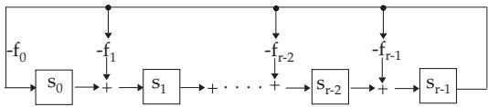

#### 5.3.7 Rings and Fields

In this section, there are discussed algebraic structures with two binary operations.

##### 5.3.7.1 Definitions

1. Rings

A set R with two binary operations + and is called a ring (notation: $( R , + , * ) )$ , if

$( R , + )$ is an Abelian group,

$( R , * )$ is a semigroup, and

the distributive laws hold:

$$
a * ( b + c ) = ( a * b ) + ( a * c ) , \quad ( b + c ) * a = ( b * a ) + ( c * a ) .\tag{5.173}
$$

If $( R , * )$ is commutative or if $( R , * )$ has a neutral element, then $( R , + , * )$ is called a commutative ring or a ring with identity (ring with unit element), respectively.

A commutative ring with a unit element and without zero divisor is called the domain ofintegrity.

A nonzero element of a ring is called zero divisor or singular element if there is a nonzero element of the ring such that their product is equal to zero.

In a ring with zero divisor the following implication is generally false: $a * b = 0 \implies ( a = 0 \vee b = 0 )$ If R is a ring with a unit element, then the characteristic ofthe ring R is the smallest natural number k such that $k { \mathord { \mathrm { 1 } } } = 1 + 1 + . . . + 1 = 0$ (k times 1 equals to zero), and it is denoted by char $R = k$ . If such a k does not exist, then char $R = 0$

char $R = k$ means that the cyclic subgroup 1 of the additive group $( R , + )$ generated by 1 has order $k ,$ so the order of every element is a divisor of k.

If char $R = k$ and for all $r \in R$ , then $r + r + \ldots + r$ (k times)is equal to zero. The characteristic of a domain of integrity is zero or a prime.

2. Division Ring, Field

A ring is called division ring or skew field if $( R \backslash \{ 0 \} , * )$ is a group .

$\mathrm { I f } \left( R \backslash \{ 0 \} , * \right)$ is commutative, then R is a field. So, every field is a domain of integrity and also a division ring. Reversed, every finite domain of integrity and every finite division ring is a field. This statement is a theorem of Wedderburn.

Examples of rings and fields

A: The number domains Z, Q, IR, and C are commutative rings with identity with respect to addition and multiplication; Q , IR, and C are also fields. The set of even integers is an example of a ring without identity.

B: The set $M _ { n }$ of all square matrices of order n with real (or complex) elements is a non-commutative ring with respect to matrix addition and multiplication. It has a unit element which is the identity matrix. $M _ { n }$ has zero divisors, e.g. for $n = 2 , { \binom { 1 0 } { 1 0 } } { \binom { 0 0 } { 1 1 } } = { \binom { 0 0 } { 0 0 } }$ , i.e. both matrices $\left( ^ { 1 0 } _ { 1 0 } \right)$ and

$\binom { 0 ~ 0 } { 1 ~ 1 }$ are zero divisors in $M _ { 2 }$

C: The set of real polynomials $p ( x ) = a _ { n } x ^ { n } + a _ { n - 1 } x ^ { n - 1 } + \cdot \cdot \cdot + a _ { 1 } x + a _ { 0 }$ forms a ring with respect to the usual addition and multiplication of polynomials, the polynomial ring $\mathbb { R } [ x ]$

More generally, instead of polynomials over IR, polynomial rings over arbitrary commutative rings with identity element can be considered.

D: Examples of finite rings are the residue class rings $\mathbb { Z } _ { n }$ modulo n. $\mathbb { Z } _ { n }$ consists of all the classes $[ a ] _ { n }$ of integers having the same residue on division by n. $( [ a ] _ { n }$ is the equivalence class defined by the natural number a with respect to the relation $\sim _ { R }$ introduced in 5.2.4, 1., p. 334.) The ring operations , on $\mathbb { Z } _ { n }$ are defined by

$$
[ a ] _ { n } \oplus [ b ] _ { n } = [ a + b ] _ { n } \quad { \mathrm { a n d } } \quad [ a ] _ { n } \odot [ b ] _ { n } = [ a \cdot b ] _ { n } .\tag{5.174}
$$

If the natural number n is a prime, then $( \mathbb { Z } _ { n }  , \oplus , \odot )$ is a field. Otherwise $\mathbb { Z } _ { n }$ has zero divisors, e.g. in $\mathrm { Z _ { 6 } }$ (numbers modulo 6) $[ 3 ] _ { 6 } \cdot [ 2 ] _ { 6 } = [ 0 ] _ { 6 }$ . Usually $\mathbb { Z } _ { n }$ is considered as $\mathbb { Z } _ { n } = \{ 0 , 1 , \ldots , n - 1 \}$ , i.e. the

residue classes are replaced by representatives(see 5.4.3,3., S. 377).

3. Field Extensions

If K and L are fields and $K \subseteq L$ , then L is an extension field or an over-field of K. In this case L can be considered as a vector space over $K .$

If L is a finite dimensional space over K, then L is called a finite extension field. If this dimension is n, then L is called also an extension ofdegree n of K (Notation: $[ L : K ] = n )$

E.g. C is a finite extension of IR. C is two-dimensional over IR, and $\{ 1 , i \}$ is a basis. IR is an infinitedimensional space over Q.

For a set $M \subseteq L , K ( M )$ denotes the smallest field (an over-field of K) which contains the field K and the set M.

Especially important are the simple algebraic extensions $K ( \alpha )$ , where $\alpha \in L$ is a root of a polynomia from $K [ x ]$ . The polynomial of lowest degree with a leading coeficient 1 having α as a root is called the minimal polynomial ofα over K. If the degree of the minimal polynomials of $\alpha \in L$ is n, then $K ( \alpha )$ is an extension of degree n, i.e. the degree of the minimal polynomials is equal to the dimension of L as a vector space over K.

$\mathrm { E . g . ~ } \mathbb { C } = \mathbb { R } ( i )$ and $i \in \mathbb { C }$ is the root of the polynomial $x ^ { 2 } + 1 \in \mathbb { R } [ x ]$ , i.e. C is a simple algebraic extension and $[ \mathbb { C } : \mathbb { R } ] = 2$

A field, which does not have any proper subfield, is called a prime field.

Every field K contains a smallest subfield, the prime field of $K$

Out of isomorphism, Q (for fields of characteristic 0) and $\mathbb { Z } _ { p }$ (p prime, for fields of characteristic p) are the single prime fields.

##### 5.3.7.2 Subrings, Ideals

1. Subring

Suppose $R = ( R , + , * )$ is a ring and $U \subseteq R$ . If U with respect to + and is also a ring, then $U = ( U , + , * )$ is called a subring of R.

A non-empty subset U of a ring $( R , + , * )$ forms a subring of R if and only if for all $a , b \in U$ also $a + ( - b )$ and $a * b$ are in U (subring criterion).

2. Ideal

A subring I is called an ideal if for all $r \in R$ and $a \in I$ also r a and $a * r$ are in I. These specia subrings are the basis for the formation of factor rings (see 5.3.7.3, p. 363).

The trivial subrings 0 and R are always ideals of $R .$ . Fields have only trivial ideals.

3. Principal Ideal

If all the elements of an ideal can be generated by one element according to the subring criterion, then it is called a principal ideal. All ideals of Z are principal ideals. They can be written in the form $m \mathbb { Z } = \{ m g | g \in \mathbb { Z } \}$ and they are denoted by (m).

##### 5.3.7.3 Homomorphism, Isomorphism, Homomorphism Theorem

1. Ring Homomorphism and Ring Isomorphism

1. Ring Homomorphism: Let $R _ { 1 } = ( R _ { 1 } , + , * )$ and $R _ { 2 } = ( R _ { 2 } , \circ _ { + } , \circ _ { * } )$ be two rings. A mapping $h \colon R _ { 1 } \to R _ { 2 }$ is called a ring homomorphism if for all $a , b \in R _ { 1 }$

$$
h ( a + b ) = h ( a ) \circ _ { + } h ( b ) \quad { \mathrm { a n d } } \quad h ( a * b ) = h ( a ) \circ _ { * } h ( b )\tag{5.175}
$$

hold.

2. Kernel: The kernel of h is the set of elements of $R _ { 1 }$ whose image by h is the neutral element 0 of $( R _ { 2 } , + )$ , and it is denoted by ker h:

$$
\ker h = \{ a \in R _ { 1 } | h ( a ) = 0 \} { \mathrm { . } }\tag{5.176}
$$

Here ker h is an ideal of $R _ { 1 }$

3. Ring Isomorphism: If h is also bijective, then h is called a ring isomorphism, and the rings $R _ { 1 }$ and $R _ { 2 }$ are called isomorphic.

4. Factor Ring: If I is an ideal of a ring $( R , + , * )$ , then the sets of co-sets $\{ a + I | a \in R \}$ of I in the additive group $( { \bar { R } } , + )$ of the ring R (see 5.3.3, 1., p. 337) form a ring with respect to the operations

$$
( a + I ) \circ _ { + } ( b + I ) = ( a + b ) + I \quad { \mathrm { a n d } } \quad ( a + I ) \circ _ { * } ( b + I ) = ( a * b ) + I .\tag{5.177}
$$

This ring is called the factor ring of R by I, and it is denoted by $R / I .$

The factor ring of Z by a principal ideal (m) is the residue class ring $Z _ { m } = Z _ { / ( m ) }$ (see examples of rings and fields on p. 361).

2. Homomorphism Theorem for Rings

If the notion of a normal subgroup is replaced by the notion of an ideal in the homomorphism theorem for groups, then the homomorphism theorem for rings is obtained: A ring homomorphism h: $R _ { 1 } \to R _ { 2 }$ defines an ideal of $R _ { 1 }$ , namely ker $h = \{ a \in R _ { 1 } | h ( a ) = 0 \}$ . The factor ring $R _ { 1 } /$ ker h is isomorphic to the homomorphic image $h ( R _ { 1 } ) = \{ h ( a ) | \grave { a } \in R _ { 1 } \}$ . Conversely, every ideal I of $R _ { 1 }$ defines a homomorphic mapping nat : $R _ { 1 } \stackrel { } {  } R _ { 2 } / \dot { I }$ with $n a t _ { I } ( a ) = a { + } I$ . This mapping $n a t _ { I }$ is called a natural homomorphism.

##### 5.3.7.4 Finite Fields and Shift Registers

1. Finite Fields

The following statements give an overview of the structure of finite fields.

1. Galois Field GF For every power of primes $p ^ { n }$ there exits a unique field with $p ^ { n }$ elements (out of an isomorphism), and every finite field has $p ^ { n }$ elements. The fields with $p ^ { n }$ elements are denoted by GF(pn) (Galois field).

Note: For $n > 1 \operatorname { G F } ( p ^ { n } )$ and $\mathbb { Z } _ { p ^ { n } }$ are diferent.

In constructing finite fields with $p ^ { n }$ elements (p is prime, $n > 1 )$ , the ring of polynomials over $\mathbb { Z } _ { p }$ (see 5.3.7,2., p. 361, C) and irreducible polynomials are needed: $\mathbb { Z } _ { p } [ x ]$ consists of all polynomials with coeficients from $\mathbb { Z } _ { p }$ . The coeficients are calculated modulo $p .$

2. Algorithm of Division and Euclidean Algorithm In a ring of polynomials $K [ x ]$ the division algorithm is applicable (dividing polynomials with a remainder), i.e. for $f ( { \boldsymbol { x } } ) , g ( { \boldsymbol { x } } ) \in { \dot { K } } [ { \dot { \boldsymbol { x } } } ]$ $\deg ( \mathrm { x } ) \leq$ $\mathrm { d e g g ( x ) }$ there exist $q ( x ) , r ( x ) \in \bar { K } [ x ]$ such that

$$
g ( x ) = q ( x ) \cdot f ( x ) + r ( x ) \mathrm { a n d } \deg r ( x ) < \deg f ( x ) .\tag{5.178}
$$

This relation is denoted by $r ( x ) = g ( x ) ( { \bmod { f ( x ) } } )$ . Repeatedly performed division with remainders is known as the Euclidean algorithm for rings of polynomials and the last nonzero remainder gives the greatest common divisor of $f ( x )$ and $g ( x )$

3. Irreducible Polynomials A polynomial $f ( x ) \in K [ x ]$ is irreducible if it can not be represented as a product of polynomials of lower degrees, i.e. (analogously to the prime numbers in $\bar { \ Z } ) \bar { f } ( x )$ is a prime in K[x]. E.g. for polynomials of second or third degree irreducibility means, that they do not have roots in $K$

It can be shown that there are irreducible polynomials of arbitrary degree in $K [ x ]$ . If $f ( x ) \in K [ x ]$ is an irreducible polynomial, then

$$
K [ x ] / f ( x ) : = \{ p ( x ) \in K [ x ] \mid \deg p ( x ) < \deg f ( x ) \}\tag{5.179}
$$

is a field, where addition and multiplication are performed modulo f(x), i.e. $g ( x ) * h ( x ) = g ( x )$ $h ( x )$ (mod $f ( x ) )$

If $K = \mathbb { Z } _ { p }$ and deg $f ( x ) = n$ , then $K [ x ] / f ( x )$ has $p ^ { n }$ elements, i.e. $\mathrm { { G F } } ( p ^ { n } ) = \mathbb { Z } _ { p } [ x ] / f ( x )$ , where $f ( x )$ is an irreducible polynomial of degree n.

4. Calculation Rule in $\mathrm { G F } ( p ^ { n } )$ In ${ \mathrm { G F } } ( p ^ { n } )$ the following useful rule is valid:

$$
( a + b ) ^ { p ^ { r } } = a ^ { p ^ { r } } + b ^ { p ^ { r } } , r \in \mathbb { N } .\tag{5.180}
$$

So, in $\mathrm { { G F } } ( p ^ { n } ) = \mathbb { Z } _ { p } [ x ] / f ( x )$ there is an element $\alpha = x$ , a root of the polynomial $f ( x )$ irreducible in $\mathbb { Z } _ { p } ( x )$ , and $\mathrm { \hat { G F } } ( p ^ { n } ) \stackrel { \cdot } { = } \mathrm { \hat { Z } } _ { p } [ x ] / f ( x ) = \mathrm { Z } _ { p } ( \alpha )$ . It can be proven that $\mathbb { Z } _ { p } ( \alpha )$ is the splitting field of $f ( x )$ The splitting field of a polynomial from $\mathbb { Z } _ { p } [ x ]$ is the smallest extension field of $\mathbb { Z } _ { p }$ which contains all roots of $f ( x )$

5. Algebraic Closure, Fundamental Theorem of Algebra A field K is algebraically closed if all roots of the polynomials from $K [ x ]$ are in K. The fundamental theorem ofalgebra tells that the field C of complex numbers is algebraically closed. An algebraic extension L of $\dot { K }$ is called the algebraic closure of K if L is algebraically closed. The algebraic closure of a finite field is not finite. So there are infinite fields with characteristic $p .$

6. Cyclic and Multiplicative Group The multiplicative group $K ^ { * } = K \setminus \{ 0 \}$ of a finite field K is cyclic, i.e. there is an element $a \in K$ such that every element of $K ^ { * }$ is a power of a: $K ^ { * } =$ $\{ 1 , a , \tilde { a ^ { 2 } } , \ldots , a ^ { q - 2 } \}$ , if K has q elements.

An irreducible polynomial $f ( x ) \in K [ x ]$ is called primitive, if the powers of x represents all nonzero elements of $L : = { \dot { K } } [ x ] / f ( x ) , { \mathrm { i . e . } }$ . the multiplicative group $L ^ { * }$ of L can be generated by x.

With a primitive polynomial $f ( x )$ of degree n it is possible to construct a ,,Table of logarithm” for ${ \mathrm { G F } } ( p ^ { n } )$ from $\mathrm { G F } ( \bar { p } ) [ x ]$ , which makes calculations easier.

Construction of field $\mathrm { G F } ( 2 ^ { 3 } )$ and its table of logarithm.

$f ( x ) = 1 + x + x ^ { 3 }$ is irreducible over $\mathbb { Z } [ x ]$ , since neither 0 nor 1 are roots of it:

$$
\mathrm { G F } ( 2 ^ { 3 } ) = \mathrm { Z } _ { 2 } [ x ] / f ( x ) = \left\{ a _ { 0 } + a _ { 1 } x + a _ { 2 } x ^ { 2 } ~ | ~ a _ { 0 } , a _ { 1 } , a _ { 2 } \in \mathrm { Z } _ { 2 } \wedge x ^ { 3 } = 1 + x \right\} .\tag{5.181}
$$

f(x) is primitive, so a table of logarithm can be created for $\mathrm { G F } ( 2 ^ { 3 } )$

Two expressions are assigned to every polynomial $a _ { 0 } + a _ { 1 } x + a _ { 2 } x ^ { 2 }$ from $\mathbb { Z } _ { 2 } [ x ] / f ( x )$ . The coeficient vector $a _ { 0 } , a _ { 1 } , a _ { 2 }$ and the so called logarithm which is a natural number i such that $x ^ { i } = a _ { 0 } + a _ { 1 } x + a _ { 2 } x ^ { 2 }$ modulo $1 + x + x ^ { 3 }$ . The table of logarithm is:

KE KV Log. Addition of the field elements (KE) in GF(8):   
1 1 0 0 0 Addition of the coordinate vectors (KV) componentwise mod 2   
x 0 1 0 1   
(in general mod p).   
$x ^ { 2 }$ 0 0 1 2 Multiplication of the field elements (KE) in GF(8):   
$x ^ { 3 }$ 1 1 0 3   
Addition of logarithms (Log) mod 7 (in general mod $( p ^ { n } - 1 ) )$ .   
x4 0 1 1 4   
x5 1 1 1 5 Example: ${ \frac { x ^ { 2 } + x ^ { 4 } } { x ^ { 3 } + x ^ { 4 } } } = { \frac { x } { x ^ { 6 } } } = x ^ { - 5 } = x ^ { 2 }$   
x6 1 0 1 6

Remark: Finite fields are extremely important in coding theory as linear codes, where vector spaces in form $( \mathrm { G F } ( q ) ) ^ { n }$ are considered. A subspace of such a vector space is called linear code (see 5.4.6.2,3., p. 385). The elements (code words) of a linear code are also n-tuples with elements from a finite field ${ \mathrm { G F } } ( q ^ { n } )$ . In applications in code theory it is important to know the divisors of $X ^ { n } - 1$ The splitting field of $X ^ { n } - 1 \in K [ X ]$ is called the $n { - } t h$ cyclotomic field over K.

If the characteristic of K is not a divisor of n and α is a primitive n-th unit root, then:

a) The extension field $K ( \alpha )$ is the splitting field of $X ^ { n } - 1$ over $K .$

b) In $K ( \alpha )$ , the field $X ^ { n } - 1$ has exactly n pairwise diferent roots which form a cyclic group, and among them there are $\varphi ( n )$ primitive n-th unit roots, where $\varphi ( n )$ denotes the Euler function (5.4.4,1., p. 381). By the k-th powers $( k < n , \mathrm { g . c . d . } ( \mathrm { k , n } ) { = } 1 )$ of a primitive n-th unit root α all unit roots can be got.

2. Applications of Shift Registers

Calculations with polynomials can be performed well by a linear feedback shift register (see Fig.5.18). With a linear feedback shift register based on the feedback polynomial $f ( x ) = f _ { 0 } + \overbar { f } _ { 1 } x + \cdot \cdot \cdot + f _ { r - 1 } x ^ { r - 1 } +$ $x ^ { r }$ and from the state polynomia $s ( x ) = s _ { 0 } + s _ { 1 } x + \cdot \cdot \cdot + s _ { r - 1 } x ^ { r - 1 }$ one gets the state polynomia $s ( x ) \cdot x - s _ { r - 1 } \cdot f ( x ) = { \overset { \cdot } { s } } s ( { \overset { \cdot } { x } } ) \cdot x ( \mathrm { m o d } \ f ( x ) )$

Especially, if $s ( x ) = 1$ , after i steps (i-times applications) the state polynomial is $x ^ { i }$ (mod $f ( x ) )$

Demonstration with the example from page 364: The primitive polynomial $f ( x ) = 1 + x + x ^ { 3 } \in \mathbb { Z } _ { 2 } [ x ]$ is chosen as feedback polynomial. Then the shift register with lengh 3 has the following sequence of states:

  
Figure 5.18

From the initial state: $1 0 0 \hat { = } 1$ (mod f(x))

the states follow as: $0 1 0 \hat { = } x$ (mod f(x))

$$
0 0 1 \hat { = } x ^ { 2 }
$$

$$
1 1 0 \widehat { = } x ^ { 3 } \equiv 1 + x
$$

$$
\begin{array} { r l } { 0 \ 1 \ 1 \triangleq x ^ { 4 } } & { { } \equiv x + x ^ { 2 } } \end{array}
$$

(mod f(x))

$\begin{array} { r l } { 1 1 1 \bumpeq x ^ { 5 } } & { { } \equiv 1 + x + x ^ { 2 } } \end{array}$ (mod f(x))

$1 0 1 \triangleq x ^ { 6 } \equiv 1 + x ^ { 2 }$ (mod f(x))

$$
1 0 0 \hat { = } x ^ { 7 } \equiv 1
$$

(mod f(x))

;The states are considered as coeficient vectors of a state polynomia $s _ { 0 } + s _ { 1 } x + s _ { 2 } x ^ { 2 }$

In general: A linear feedback shift register with length r gives a sequence of states of maximal length with period $2 ^ { r } - 1$ if and only if the feedback polynomial is a primitive polynomial of degree r.
