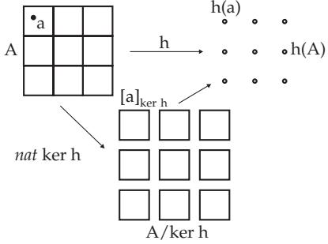

### 5.6 Universal Algebra

A universal algebra consists of a set, the underlying set, and operations on this set. Simple examples are semigroups, groups, rings, and fields discussed in sections 5.3.2, p. 336; 5.3.3, p. 336 and 5.3.7, p. 361. Universal algebras (mostly many-sorted, i.e., with several underlying sets) are handled especially in theoretical informatics. There they form the basis of algebraic specifications of abstract data types and systems and of term-rewriting systems.

#### 5.6.1 Definition

Let Ω be a set of operation symbols divided into pairwise disjoint subsets $\Omega _ { n } , n \in  { \mathbb { N } } . \ \Omega _ { 0 }$ contains the constants, $\Omega _ { n } , n > 0$ , contain the n-ary operation symbols. The family $( \Omega _ { n } ) _ { n \in \mathbb { N } }$ is called the type or signature. If A is a set, and if to every n-ary operation symbol $\omega \in \Omega _ { n }$ an n-ary operation $\omega ^ { A }$ in A is assigned, then $A = ( A , \{ \omega ^ { A } | \omega \in \Omega \} )$ is called an Ω algebra or algebra of type (or of signature) Ω.

$$
\Omega = \{ \omega _ { 1 } , \ldots , \omega _ { k } \}
$$

$$
\breve { A } = ( A , \omega _ { 1 } ^ { A } , \ldots , \omega _ { k } ^ { A } )
$$

If a ring (see 5.3.7, p. 361) is considered as an Ω algebra, then Ω is partitioned $\Omega _ { 0 } = \{ \omega _ { 1 } \} , \Omega _ { 1 } = \{ \omega _ { 2 } \}$ $\Omega _ { 2 } = \{ \omega _ { 3 } , \omega _ { 4 } \}$ , where to the operation symbols $\omega _ { 1 } , \omega _ { 2 } , \omega _ { 3 } , \omega _ { 4 }$ the constant 0, taking the inverse with respect to addition, addition and multiplication are assigned.

Let A and B be Ω algebras. B is called an Ω subalgebra of A, if $B \subseteq A$ holds and the operations $\omega ^ { B }$ are the restrictions of the operations $\omega ^ { A } \left( \omega \in \Omega \right)$ to the subset B.

#### 5.6.2 Congruence Relations, Factor Algebras

In constructing factor structures for universal algebras, the notion of congruence relation is needed. A congruence relation is an equivalence relation compatible with the structure: Let $A = ( A , \{ \omega ^ { A } | \omega \in \Omega \} )$ be an Ω algebra and R be an equivalence relation in A. R is called a congruence relation in A, if for all $\omega \in \Omega _ { n } \mathrm { ~ } ( n \in \mathbb { N } )$ and all $a _ { i } , b _ { i } \in A$ with $a _ { i } R b _ { i } ( i = 1 , \dots , n )$

$$
\omega ^ { A } ( a _ { 1 } , \ldots , a _ { n } ) R \omega ^ { A } ( b _ { 1 } , \ldots , b _ { n } ) .\tag{5.278}
$$

The set of equivalence classes (factor set) with respect to a congruence relation also form an Ω algebra with respect to representative-wise calculations: Let $A = ( A , \breve { \{ } \omega ^ { A } |  \omega \in \Omega \} )$ be an Ω algebra and R be a congruence relation in A. The factor set $A / R$ (see 5.2.4, 2., p. 334) is an Ω algebra $A / R$ with the following operations $\omega ^ { A / R } \left( \omega \in \Omega _ { n } , n \in \mathbb { N } \right)$ with

$$
\omega ^ { A / R } ( [ a _ { 1 } ] _ { R } , \dots , [ a _ { n } ] _ { R } ) = [ \omega ^ { A } ( a _ { 1 } , \dots , a _ { n } ) ] _ { R }\tag{5.279}
$$

and it is called the factor algebra of A with respect to R.

The congruence relations of groups and rings can be defined by special substructures – normal subgroups (see 5.3.3.2, 2. p. 338) and ideals (see 5.3.7.2, p. 362), respectively. In general, e.g., in semigroups, such a characterization of congruence relations is not possible.

#### 5.6.3 Homomorphism

Just as with classical algebraic structures, the homomorphism theorem gives a connection between the homomorphisms and congruence relations.

Let A and B be Ω algebras. A mapping h: $A  B$ is called a homomorphism, if for every $\omega \in \Omega _ { n }$ and all $a _ { 1 } , \ldots , a _ { n } \in A { \mathrm { : } }$

$$
h ( \omega ^ { A } ( a _ { 1 } , \ldots , a _ { n } ) ) = \omega ^ { B } ( h ( a _ { 1 } ) , \ldots , h ( a _ { n } ) ) .\tag{5.280}
$$

If, in addition, h is bijective, then h is called an isomorphism; the algebras A and B are called isomorphic. The homomorphic image $h ( A )$ of an Ω algebra A is an Ω subalgebra of B. Under a homomorphism h, the decomposition of A into subsets of elements with the same image corresponds to a congruence relation which is called the kernel of h:

$$
\ker h = \{ ( a , b ) \in A \times A | h ( a ) = h ( b ) \} { \mathrm { . } }\tag{5.281}
$$

#### 5.6.4 Homomorphism Theorem

Let A and B be Ω algebras and h: $A  B$ a homomorphism. h defines a congruence relation ker h in A. The factor algebra A/ ker h is isomorphic to the homomorphic image $h ( A )$

Conversely, every congruence relation R defines a homomorphic mapping na $\boldsymbol { \cdot } \boldsymbol { R } \colon \boldsymbol { A } \to \boldsymbol { A } / R$ with $n a t _ { R } ( a )$ $= [ a ] _ { R }$ . Fig. 5.19 illustrates the homomorphism theorem.

  
Figure 5.19

#### 5.6.5 Varieties

A variety V is a class of Ω algebras, which is closed under forming direct products, subalgebras, and homomorphic images, i.e., these formations do not lead out of V. Here the direct products are defined in the following way:

Considering the operations corresponding to Ω componentwise on the Cartesian product of the underlying sets of Ω algebras, an Ω algebra, the direct product of these algebras is obtained. The theorem of Birkhof (see 5.6.6, p. 395) characterizes the varieties as those classes of Ω algebras, which can be equationally defined.

#### 5.6.6 Term Algebras, Free Algebras

Let $( \Omega _ { n } ) _ { n \in \mathbb { N } }$ be a type (signature) and X a countable set of variables. The set $T _ { \Omega } ( X )$ of Ω terms over X is defined inductively in the following way:

1. $X \cup \Omega _ { 0 } \subseteq T _ { \Omega } ( X )$

2. If $t _ { 1 } , \ldots , t _ { n } \in T _ { \Omega } ( X )$ and $\omega \in \Omega _ { n }$ hold, then also $\omega t _ { 1 } \ldots t _ { n } \in T _ { \Omega } ( X )$ holds.

The set $T _ { \Omega } ( X )$ defined in this way is an underlying set of an Ω algebra, the term algebra $T _ { \Omega } ( X )$ of type Ω over X, with the following operations: ${ \mathrm { I f } } t _ { 1 } , \ldots , t _ { n } \in T _ { \Omega } ( X )$ and $\omega \in \Omega _ { n }$ hold, then $\omega ^ { T _ { \Omega } ( X ) }$ is defined by

$$
\omega ^ { T _ { \Omega } ( X ) } ( t _ { 1 } , \dots , t _ { n } ) = \omega t _ { 1 } \dots t _ { n } .\tag{5.282}
$$

Term algebras are the “most general” algebras in the class of all Ω algebras, i.e., no “identities” are valid in term algebras. These algebras are called free algebras.

An identity is a pair $( s ( x _ { 1 } , \ldots , x _ { n } ) , t ( x _ { 1 } , \ldots , x _ { n } ) )$ of Ω terms in the variables $x _ { 1 } , \ldots , x _ { n }$ . An Ω algebra A satisfies such an equation, if for every $a _ { 1 } , \ldots , a _ { n } \in A$ holds:

$$
s ^ { A } ( a _ { 1 } , \ldots , a _ { n } ) = t ^ { A } ( a _ { 1 } , \ldots , a _ { n } ) .\tag{5.283}
$$

A class of Ω algebras defined by identities is a class of Ω algebras satisfying a given set of identities.

Theorem of Birkhof: The classes defined by identities are exactly the varieties.

Varieties are for example the classes of all semigroups, groups, Abelian groups, and rings. But, e.g., the direct product of cyclic groups is not a cyclic group, and the direct product of fields is not a field. Therefore cyclic groups or fields do not form a variety, and cannot be defined by equations.
