### 5.7 Boolean Algebras and Switch Algebra

Calculating rules, similar to the rules established in 5.2.2, 3., p. 329 for set algebra and propositional calculus (5.1.1, 6., p. 324), can be found for other objects in mathematics too. The investigation of these rules yields the notion of Boolean algebra.

#### 5.7.1 Definition

A set B, together with two binary operations $( ^ { \mathfrak { c } } \mathrm { c o n j u n c t i o n } ^ { \mathfrak { N } } )$ and $( ^ { \mathrm { * } } \mathrm { d i s j u n c t i o n " } )$ , and a unary operation $( \ " \mathrm { { n e g a t i o n } } ^ { \prime \prime } )$ , and two distinguished (neutral) elements 0 and 1 from B, is called a Boolean

algebra $B = ( B , \Pi , \sqcup , ^ { - } , 0 , 1 )$ if the following properties are valid:

(1) Associative Laws:

$$
( a \sqcap b ) \sqcap c = a \sqcap ( b \sqcap c ) ,\tag{5.284}
$$

$$
( a \sqcup b ) \sqcup c = a \sqcup ( b \sqcup c ) .\tag{5.285}
$$

(2) Commutative Laws:

$$
a \sqcap b = b \sqcap a ,\tag{5.286}
$$

$$
a \sqcup b = b \sqcup a .\tag{5.287}
$$

(3) Absorption Laws:

$$
a \sqcap \left( a \sqcup b \right) = a ,\tag{5.288}
$$

$$
a \sqcup ( a \sqcap b ) = a .\tag{5.289}
$$

(4) Distributive Laws:

$$
( a \sqcup b ) \cap c = ( a \sqcap c ) \sqcup ( b \sqcap c ) ,\tag{5.290}
$$

$$
( a \sqcap b ) \sqcup c = ( a \sqcup c ) \sqcap ( b \sqcup c ) .\tag{5.291}
$$

(5) Neutral Elements:

$$
a \sqcap 1 = a ,\tag{5.292}
$$

$$
a \sqcup 0 = a ,\tag{5.293}
$$

$$
a \sqcap 0 = 0 ,\tag{5.294}
$$

$$
a \sqcup 1 = 1 ,\tag{5.295}
$$

(6) Complement:

$$
a \sqcap \overline { { { a } } } = 0 ,\tag{5.296}
$$

$$
a \sqcup { \overline { { a } } } = 1 .\tag{5.297}
$$

A structure with the associative laws, commutative laws, and absorption laws is called a lattice. If the distributive laws also hold, then the lattice is called a distributive lattice. So a Boolean algebra is a special distributive lattice.

Remark: The notation used for Boolean algebras is not necessarily identical to the notation for the operations in propositional calculus.

#### 5.7.2 Duality Principle

1. Dualizing

In the “axioms” of a Boolean algebra is included the following duality: Replacing by , by , 0 by 1, and 1 by 0 in an axiom gives always the other axiom in the same row. The axioms in a row are dual to each other, and the substitution process is called dualization. The dual statement follows from a statement of the Boolean algebra by dualization.

2. Duality Principle for Boolean Algebras

The dual statement of a true statement for a Boolean algebra is also a true statement for the Boolean algebra, i.e., with every proved proposition, the dual proposition is also proved.

3. Properties

One gets, e.g., the following properties for Boolean algebras from the axioms.

(E1) The Operations and are Idempotent:

$$
a \sqcap a = a ,
$$

(5.298)

$$
a \sqcup a = a .\tag{5.299}
$$

(E2) De Morgan Rules:

$$
\overline { { { a \sqcap b } } } = \overline { { { a } } } \sqcup \overline { { { b } } } ,\tag{5.300}
$$

$$
{ \overline { { a \sqcup b } } } = { \overline { { a } } } \sqcap { \overline { { b } } } ,\tag{5.301}
$$

(E3) A further Property:

$$
{ \overline { { \overline { { a } } } } } = a .\tag{5.302}
$$

It is enough to prove only one of the two properties in any line above, because the other one is the dual property. The last property is self-dual.

#### 5.7.3 Finite Boolean Algebras

All finite Boolean algebras can be described easily up to “isomorphism”. Let $B _ { 1 } , B _ { 2 }$ be two Boolean algebras and $f \colon B _ { 1 } \to B _ { 2 }$ a bijective mapping. f is called an isomorphism if

$$
f ( a \sqcap b ) = f ( a ) \sqcap f ( b ) , \quad f ( a \sqcup b ) = f ( a ) \sqcup f ( b ) \quad { \mathrm { a n d } } \quad f ( { \overline { { a } } } ) = { \overline { { f ( a ) } } }\tag{5.303}
$$

hold. Every finite Boolean algebra is isomorphic to the Boolean algebra of the power set of a finite set. In particular every finite Boolean algebra has $2 ^ { n }$ elements, and every two finite Boolean algebras with the same number of elements are isomorphic.

Hereafter B denotes the Boolean algebra with two elements 0, 1 and with the operations

$$
\frac { \sqcap \ \ \middle | \ 0 \quad 1 } { \ 0 \ \left| \ 0 \quad 0 \right| }
$$

$$
\frac { \textsf { U } \mathbin { \left| \begin{array} { l l } { 0 } & { 1 } \\ { 0 } & { 1 } \end{array} \right| } } { 1 }
$$

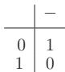

Defining the operations , , and componentwise on the n-times Cartesian product $B ^ { n } = \{ 0 , 1 \} \times$ $\cdots \times \{ 0 , 1 \}$ , then $B ^ { n }$ will be a Boolean algebra with $0 = ( 0 , \ldots , 0 )$ and $1 = ( 1 , \ldots , 1 )$ $B ^ { n }$ is called the n times direct product of B. Because $B ^ { n }$ contains $2 ^ { n }$ elements, this way one gets all finite Boolean algebras (out of isomorphism).

#### 5.7.4 Boolean Algebras as Orderings

An order relation can be assigned to every Boolean algebra B: Here $a \leq b$ holds if $a \sqcap b = a$ is valid (or equivalently, if $a \sqcup b = b$ holds).

So every finite Boolean algebra can be represented by a Hasse diagram (see 5.2.4, 4., p. 334).

Suppose B is the set 1, 2, 3, 5, 6, 10, 15, 30 of the divisors of 30. Then, the least common multiple and the greatest common divisor can be defined as binary operations and the complement as unary operation. The numbers 1 and 30 correspond to the distinguished elements 0 and 1. The corresponding Hasse diagram is shown in Fig. 5.20.

#### 5.7.5 Boolean Functions, Boolean Expressions

1. Boolean Functions

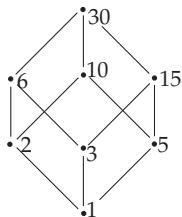

Denoting by B the Boolean algebra with two elements as in 5.7.3, p. 397, then an n-ary Boolean function f is a mapping from $B ^ { n }$ into B. There are $2 ^ { 2 ^ { n } }$ n-ary Boolean functions. The set of all n-ary Boolean functions with the operations

Figure 5.20

$$
( f \sqcap g ) ( b ) = f ( b ) \sqcap g ( b ) , \qquad ( 5 . 3 0 4 )
$$

$$
( f \sqcup g ) ( b ) = f ( b ) \sqcup g ( b ) ,\tag{5.305}
$$

$$
{ \overline { { f } } } ( b ) = { \overline { { f ( b ) } } } ,\tag{5.306}
$$

is a Boolean algebra. Here b always means an n tuple of the elements of $B = \{ 0 , 1 \}$ , and on the righthand side of the equations the operations are performed in B. The distinguished elements 0 and 1 correspond to the functions $f _ { 0 }$ and $f _ { 1 }$ with

$$
f _ { 0 } ( b ) = 0 , \quad f _ { 1 } ( b ) = 1 \quad \mathrm { f o r \ a l l } \quad b \in B ^ { n } .\tag{5.307}
$$

A: In the case $n = 1 , \mathrm { i . e . }$ , for only one Boolean variable $b ,$ there are four Boolean functions:

$$
{ \begin{array} { l l l l } { { \mathrm { I d e n t i t y } } } & { f ( b ) = b , } & { { \mathrm { N e g a t i o n } } } & { f ( b ) = { \bar { b } } , } \\ { { \mathrm { T a u t o l o g y } } } & { f ( b ) = 1 , } & { { \mathrm { C o n t r a d i c t i o n } } } & { f ( b ) = 0 . } \end{array} }\tag{5.308}
$$

B: In the case $n = 2 , { \mathrm { i . e . } }$ ., for two Boolean variables a and b, there are 16 diferent Boolean functions, among which the most important ones have their own names and notation. They are shown in Table 5.6.

Table 5.6 Some Boolean functions with two variables a and b
<table><tr><td>Name of the function</td><td>Different notation</td><td colspan="4">Value table for Different symbols</td></tr><tr><td>Sheffer or NAND</td><td> $\overline { { a \cdot b } }$   $a \ | \ b$   $\mathrm { N } \dot { \mathrm { A N D } } \left( a , b \right)$ </td><td></td><td>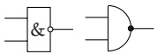</td><td> ${ \binom { a } { b } } = { \binom { 0 } { 0 } } , { \binom { 0 } { 1 } } , { \binom { 1 } { 0 } } , { \binom { 1 } { 1 } }$  1,</td><td>1,</td><td>1,</td><td>0</td></tr><tr><td>Peirce or NOR</td><td> $\overline { { a + b } }$   $a \downarrow b$   $\mathrm { N O R } ~ a , b$ </td><td></td><td>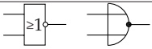</td><td></td><td>1,</td><td>0,</td><td>0, 0</td></tr><tr><td>Antivalence or XOR</td><td>āb + a b  $a \mathrm { X O R } b$   $a \not \equiv b$   $a \oplus b$ </td><td>=1</td><td></td><td>④</td><td></td><td>0, 1, 1,</td><td>0</td></tr><tr><td>Equivalence</td><td> ${ \overline { { a } } } { \overline { { b } } } + a b$   $a \equiv b$   $a  b$ </td><td></td><td>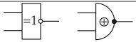</td><td></td><td>1,</td><td>0, 0,</td><td>1</td></tr><tr><td>Implication</td><td> ${ \overline { { a } } } + b$   $a \ \to \ b$ </td><td></td><td></td><td></td><td>1,</td><td>1, 0,</td><td>1</td></tr></table>

2. Boolean Expressions

Boolean expressions are defined in an inductive way: Let $X = \{ x , y , z , \ldots \}$ be a (countable) set of Boolean variables (which can take values only from 0, 1 ):

1. The constants 0 and 1 just as the Boolean variables from X are

(5.309)

2. If S and T are Boolean expressions, so are ${ \overline { { T } } } ,$ (S T), and (S T), as well.

(5.310)

If a Boolean expression contains the variables $x _ { 1 } , \ldots , x _ { n }$ , then it represents an n-ary Boolean function $f _ { T } { \mathrm { : } }$

Let b be a “valuation” of the Boolean variables $x _ { 1 } , \ldots , x _ { n } , { \mathrm { i . e . , ~ } } b = ( b _ { 1 } , \ldots , b _ { n } ) \in B ^ { n }$

Assigning a Boolean function to the expression $T$ in the following way gives:

1. If $T = 0$ , then $f _ { T } = f _ { 0 } ;$ if $T = 1$ , then $f _ { T } = f _ { 1 }$

(5.311a)

$$
2 . \mathrm { ~ I f ~ } T = x _ { i } , \mathrm { ~ t h e n ~ } f _ { T } ( b ) = b _ { i } ; \mathrm { ~ i f ~ } T = \overline { { S } } , \mathrm { ~ t h e n ~ } f _ { T } ( b ) = \overline { { f _ { S } ( b ) } } .\tag{5.311b}
$$

3. If $T = R \cap S .$ , then $f _ { T } ( b ) = f _ { R } ( b ) \cap f _ { S } ( b )$

(5.311c)

4. If $T = R \sqcup S$ , then $f _ { T } ( b ) = f _ { R } ( b ) \sqcup f _ { S } ( b ) .$

(5.311d)

On the other hand, every Boolean function f can be represented by a Boolean expression T (see 5.7.6, p. 399).

3. Concurrent or Semantically Equivalent Boolean Expressions

The Boolean expressions S and T are called concurrent or semantically equivalent if they represent the same Boolean function. Boolean expressions are equal if and only if they can be transformed into each other according to the axioms of a Boolean algebra.

Under transformations of a Boolean expression here are considered especially two aspects:

Transformation in a possible “simple” form (see 5.7.7, p. 399).

Transformation in a “normal form”.

#### 5.7.6 Normal Forms

1. Elementary Conjunction, Elementary Disjunction

Let $B = ( B , \Pi , { \sqcup } , ^ { - } , 0 , 1 )$ be a Boolean algebra and $\{ x _ { 1 } , \ldots , x _ { n } \}$ a set of Boolean variables. Every conjunction or disjunction in which every variable or its negation occurs exactly once is called an elementary conjunction or an elementary disjunction respectively (in the variables $x _ { 1 } , \ldots , x _ { n } )$ Let $T ( x _ { 1 } , \ldots , x _ { n } )$ be a Boolean expression. A disjunction D of elementary conjunctions with $D = T$ is called a principal disjunctive normal form (PDNF) of T. A conjunction C of elementary disjunctions with $C = T$ is called a principal conjunctive normal form (PCNF) of T.

Part 1: In order to show that every Boolean function f can be represented as a Boolean expression, the PDNF form of the function f given in the annexed table is to be constructed:

<table><tr><td rowspan=1 colspan=1>x y 2</td><td rowspan=1 colspan=1> $f ( x , y , z )$ </td></tr><tr><td rowspan=1 colspan=1></td><td rowspan=8 colspan=1>01000110</td></tr><tr><td rowspan=1 colspan=1>0 0 1</td></tr><tr><td rowspan=1 colspan=1>0 1 0</td></tr><tr><td rowspan=1 colspan=1></td></tr><tr><td rowspan=1 colspan=1>1 0 0</td></tr><tr><td rowspan=1 colspan=1></td></tr><tr><td rowspan=1 colspan=1></td></tr><tr><td rowspan=1 colspan=1></td></tr></table>

The PDNF of the Boolean function f contains the elementary conjunctions $\overline { { x } } \sqcap \overline { { y } } \sqcap z , x \sqcap \overline { { y } } \sqcap z , x \sqcap y \sqcap \overline { { z } }$ These elementary conjunctions belong to the valuations b of the variables where the function f has the value 1. If a variable v has the value 1 in b, then v is to put in the elementary conjunction, otherwise v.

Part 2: The PDNF for the example of Part 1 is:

$$
( { \overline { { x } } } \sqcap { \overline { { y } } } \sqcap z ) \sqcup ( x \sqcap { \overline { { y } } } \sqcap z ) \sqcup ( x \sqcap y \sqcap { \overline { { z } } } ) .\tag{5.312}
$$

The “dual” form for PDNF is the PCNF: The elementary disjunctions belong to the valuations b of the variables for which f has the value 0.

If a variable v has the value 0 in b, then v is to put in the elementary disjunction, otherwise v. So the PCNF is:

$$
( x \sqcup y \sqcup z ) \cap ( x \sqcup \overline { y } \sqcup z ) \cap ( x \sqcup \overline { y } \sqcup \overline { z } ) \cap ( \overline { x } \sqcup y \sqcup z ) \cap ( \overline { x } \sqcup \overline { y } \sqcup z ) \cap ( \overline { x } \sqcup \overline { y } \sqcup \overline { z } ) .\tag{5.313}
$$

The PDNF and the PCNF of f are uniquely determined, if the ordering of the variables and the ordering of the valuations is given, e.g., if considering the valuations as binary numbers and arranging them in increasing order.

2. Principal Normal Forms

The principal normal form of a Boolean function $f _ { T }$ is considered as the principal normal form of the corresponding Boolean expression T.

Checking the equivalence of two Boolean expressions by transformations is often dificult. The principal normal forms are useful: Two Boolean expressions are semantically equivalent exactly if their corresponding uniquely determined principal normal forms are identical letter by letter.

Part 3: In the considered example (see Part 1 and 2) the expressions $( { \overline { { y } } } \cap z ) \sqcup ( x \sqcap y \sqcap { \overline { { z } } } )$ and $( x \sqcup ( ( y \sqcup z ) \sqcap ( \overline { { y } } \sqcup z ) \sqcap ( \overline { { y } } \sqcup \overline { { z } } ) ) ) \cap \{ \overline { { x } } \sqcup ( ( y \sqcup z ) \sqcap ( \overline { { y } } \sqcup \check { z } ) ) )$ are semantically equivalent because the principal disjunctive (or conjunctive) normal forms of both are the same.

#### 5.7.7 Switch Algebra

A typical application of Boolean algebra is the simplification of series–parallel connections (SPC). Therefore a Boolean expression is to be assigned to a SPC (transformation). This expression will be “simplified” with the transformation rules of the Boolean algebra. Finally a SPC is to be assigned to this expression (inverse transformation). The result is a simplified SPC which produces the same behavior as the initial connection system (Fig. 5.21).

A SPC has two types of contact points: the so-called “make contacts” and “break contacts”, and both types have two states; namely open or closed. The usual symbolism is: When the equipment is put on, the make contacts close and the break contacts open. With Boolean variables assigned to the contacts of the switch equipment follows:

The position “of” or “on” of the equipment corresponds to the value 0 or 1 of the Boolean variables. The contacts being switched by the same equipment are denoted by the same symbol, the Boolean variable belonging to this equipment. The contact value of a SPC is 0 or 1, according to whether the switch is electrically non-conducting or conducting. The contact value depends on the position of the contacts, so it is a Boolean function S (switch function) of the variables assigned to the switch equipment. Contacts, connections, symbols, and the corresponding Boolean expressions are represented in Fig. 5.22.

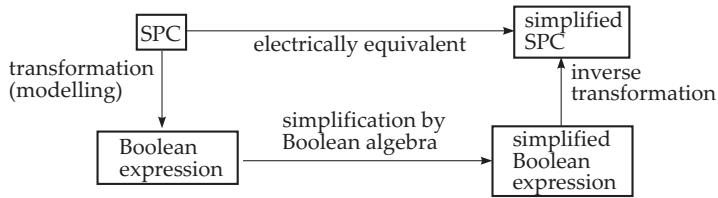  
Figure 5.21

make contact

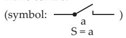

break contact

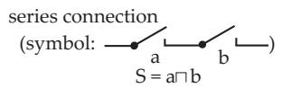

parallel connection

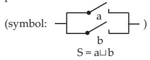  
Figure 5.22

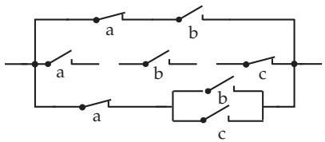  
Figure 5.23

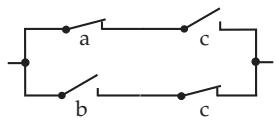  
Figure 5.24

The Boolean expressions, which represent switch functions of SPC, have the special property that the negation sign can occur only above variables (never over subexpressions).

Simplification of the SPC Fig. 5.23. This connection corresponds to the Boolean expression

$$
S = ( \overline { { a } } \sqcap b ) \sqcup ( a \sqcap b \sqcap \overline { { c } } ) \sqcup ( \overline { { a } } \sqcap ( b \sqcup c ) )\tag{5.314}
$$

as switch function. According to the transformation formulas of Boolean algebra holds:

$$
\begin{array} { r l } & { S = ( b \cap ( \overline { { a } } \sqcup ( a \cap \overline { { c } } ) ) ) \sqcup ( \overline { { a } } \cap ( b \sqcup c ) ) } \\ & { \quad = ( b \cap ( \overline { { a } } \sqcup \overline { { c } } ) ) \sqcup ( \overline { { a } } \cap ( b \sqcup c ) ) } \\ & { \quad = ( \overline { { a } } \cap b ) \sqcup ( b \cap \overline { { c } } ) \sqcup ( \overline { { a } } \cap c ) } \\ & { \quad = ( \overline { { a } } \cap b \cap c ) \sqcup ( \overline { { a } } \cap b \cap \overline { { c } } ) \sqcup ( b \cap \overline { { c } } ) \sqcup ( a \cap b \cap \overline { { c } } ) \sqcup ( \overline { { a } } \cap c ) \sqcup ( \overline { { a } } \cap \overline { { b } } \cap c ) } \\ & { \quad = ( \overline { { a } } \cap c ) \sqcup ( b \cap \overline { { c } } ) . } \end{array}\tag{5.315}
$$

Here one gets a c from $( { \overline { { a } } } \sqcap b \sqcap c ) \sqcup ( { \overline { { a } } } \sqcap c ) \sqcup ( { \overline { { a } } } \sqcap { \overline { { b } } } \sqcap c )$ , and b c from $( { \overline { { a } } } \sqcap b \sqcap { \overline { { c } } } ) \sqcup ( b \sqcap { \overline { { c } } } ) \sqcup ( a \sqcap b \sqcap { \overline { { c } } } )$ The finally simplified result SPC is shown in Fig. 5.24.

This example shows that usually it is not so easy to get the simplest Boolean expression by transformations. In the literature one can find diferent methods for this procedure.
