#### 5.8.1 Basic Notions and Notation

1. Undirected and Directed Graphs

A graph G is an ordered pair (V, E) of a set V of vertices and a set E of edges. There is a mapping, defined on E, the incidence function, which uniquely assigns to every element of E an ordered or nonordered pair of (not necessarily distinct) elements of V. If a non-ordered pair is assigned then G is called an undirected graph (Fig. 5.25). If an ordered pair is assigned to every element of E, then the graph is called a directed graph (Fig. 5.26), and the elements of E are called arcs or directed edges. All other graphs are called mixed graphs.

In the graphical representation, the vertices of a graph are denoted by points, the directed edges by arrows, and undirected edges by non-directed lines.

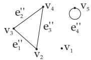

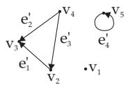  
Figure 5.25  
Figure 5.26

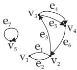  
Figure 5.27

A: For the graph G in $\mathbf { F i g . ~ 5 . 2 7 } \colon V = \{ v _ { 1 } , v _ { 2 } , v _ { 3 } , v _ { 4 } , v _ { 5 } \} , E = \{ e _ { 1 } , e _ { 2 } , e _ { 3 } , e _ { 4 } , e _ { 5 } , e _ { 6 } , e _ { 7 } \} .$

$$
\begin{array} { l } { { f _ { 1 } ( e _ { 1 } ) = \{ v _ { 1 } , v _ { 2 } \} , f _ { 1 } ( e _ { 2 } ) = \{ v _ { 1 } , v _ { 2 } \} , f _ { 1 } ( e _ { 3 } ) = ( v _ { 2 } , v _ { 3 } ) , f _ { 1 } ( e _ { 4 } ) = ( v _ { 3 } , v _ { 4 } ) , f _ { 1 } ( e _ { 5 } ) = ( v _ { 3 } , v _ { 4 } ) , } } \\ { { f _ { 1 } ( e _ { 6 } ) = ( v _ { 4 } , v _ { 2 } ) , f _ { 1 } ( e _ { 7 } ) = ( v _ { 5 } , v _ { 5 } ) . } } \end{array}
$$

$$
\begin{array} { r l } & { \qquad \mathbf { B } \colon \mathrm { ~ F o r ~ t h e ~ g r a p h ~ } G \mathrm { ~ i n ~ } \mathbf { F i g } . \ \mathsf { 5 } . 2 \mathsf { 6 } \colon V = \{ v _ { 1 } , v _ { 2 } , v _ { 3 } , v _ { 4 } , v _ { 5 } \} , \quad E ^ { \prime } = \{ e _ { 1 } ^ { \prime } , e _ { 2 } ^ { \prime } , e _ { 3 } ^ { \prime } , e _ { 4 } ^ { \prime } \} } \\ & { f _ { 2 } ( e _ { 1 } ^ { \prime } ) = ( v _ { 2 } , v _ { 3 } ) , \ f _ { 2 } ( e _ { 2 } ^ { \prime } ) = ( v _ { 4 } , v _ { 3 } ) , \ f _ { 2 } ( e _ { 3 } ^ { \prime } ) = ( v _ { 4 } , v _ { 2 } ) , \ f _ { 2 } ( e _ { 4 } ^ { \prime } ) = ( v _ { 5 } , v _ { 5 } ) . } \end{array}
$$

C: For the graph G in Fig. 5.25: $V = \{ v _ { 1 } , v _ { 2 } , v _ { 3 } , v _ { 4 } , v _ { 5 } \} , \quad E ^ { \prime \prime } = \{ e _ { 1 } ^ { \prime \prime } , e _ { 2 } ^ { \prime \prime } , e _ { 3 } ^ { \prime \prime } , e _ { 4 } ^ { \prime \prime } \} ,$

$$
f _ { 3 } ( e _ { 1 } ^ { \prime \prime } ) = \{ v _ { 2 } , v _ { 3 } \} , \ : \ : f _ { 3 } ( e _ { 2 } ^ { \prime \prime } ) = \{ \tilde { v } _ { 4 } , v _ { 3 } \} , \ : \ : f _ { 3 } ( e _ { 3 } ^ { \prime \prime } ) \stackrel { \sim } { = } \{ v _ { 4 } , v _ { 2 } \} , \ : \ : f _ { 3 } ( e _ { 4 } ^ { \prime \prime } ) = \{ v _ { 5 } , v _ { 5 } \} .
$$

2. Adjacency

If $( v , w ) \in E$ , then the vertex v is called adjacent to the vertex w. Vertex v is called the initial point of $( v , w )$ , w is called the terminal point of $( v , w )$ , and v and w are called the endpoints of $( v , w )$ Adjacency in undirected graphs and the endpoints of undirected edges are defined analogously.

3. Simple Graphs

If several edges or arcs are assigned to the same ordered or non-ordered pairs of vertices, then they are called multiple edges. An edge with identical endpoints is called a loop. Graphs without loops and multiple edges and multiple arcs, respectively, are called simple graphs.

4. Degrees of Vertices

The number of edges or arcs incident to a vertex v is called the degree $d _ { G } ( v )$ of the vertex v. Loops are counted twice. Vertices of degree zero are called isolated vertices.

For every vertex v of a directed graph G, the out-degree $d _ { G } ^ { + } ( v )$ and in-degree $d _ { G } ^ { - } ( v )$ of v are distinguished as follows:

$$
d _ { G } ^ { + } ( v ) = | \{ w | ( v , w ) \in E \} | , \qquad ( 5 . 3 1 6 \mathrm { a } )
$$

$$
d _ { G } ^ { - } ( v ) = | \{ w | ( w , v ) \in E \} | .\tag{5.316b}
$$

5. Special Classes of Graphs

Finite graphs have a finite set of vertices and a finite set of edges. Otherwise the graph is called infinite.   
In regular graphs ofdegree r every vertex has degree r.

An undirected simple graph with vertex set V is called a complete graph if any two diferent vertices in V are connected by an edge. A complete graph with an n element set of vertices is denoted by $K _ { n }$

If the set of vertices of an undirected simple graph G can be partitioned into two disjoint classes X and Y such that every edge of G joins a vertex of X and a vertex of Y, then G is called a bipartite graph. A bipartite graph is called a complete bipartite graph, if every vertex of X is joined by an edge with every vertex of Y. If X has n elements and Y has m elements, then the graph is denoted by $K _ { n , m }$

Fig. 5.28 shows a complete graph with five vertices.

Fig. 5.29 shows a complete bipartite graph with a two-element set X and a three-element set $Y$

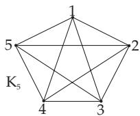  
Figure 5.28

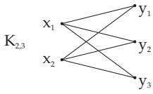  
Figure 5.29

Further special classes of graphs are plane graphs, trees and transport networks. Their properties will be discussed in later paragraphs.

6. Representation of Graphs

Finite graphs can be visualized by assigning to every vertex a point in the plane and connecting two points by a directed or undirected curve, if the graph has the corresponding edge. There are examples in Fig. 5.30–5.33. Fig. 5.33 shows the Petersen graph, which is a well-known counterexample for several graph-theoretic conjectures, which could not be proved in general.

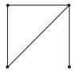  
Figure 5.30

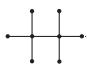  
Figure 5.31

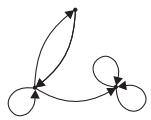  
Figure 5.32

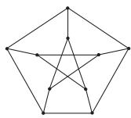  
Figure 5.33

7. Isomorphism of Graphs

A graph $G _ { 1 } = ( V _ { 1 } , E _ { 1 } )$ is called isomorphic to a graph $G _ { 2 } = ( V _ { 2 } , E _ { 2 } )$ if there are bijective mappings $\varphi$ from $V _ { 1 }$ onto $V _ { 2 }$ and ψ from $E _ { 1 }$ onto $E _ { 2 }$ being compatible with the incidence function, i.e., if u, v are the endpoints of an edge or u is the initial point of an arc and v is its terminal point, then $\varphi ( u )$ and $\varphi ( v )$ are the endpoints of an edge and $\varphi ( u )$ is the initial point and $\varphi ( v )$ the terminal point of an arc, respectively. Fig. 5.34 and Fig. 5.35 show two isomorphic graphs. The mapping $\varphi$ with $\varphi ( 1 ) = a , \varphi ( 2 ) = b , \varphi ( 3 ) = c , \varphi ( 4 ) = \bar { d }$ is an isomorphism. In this case, every bijective mapping of $\{ 1 , 2 , 3 , 4 \}$ onto $\{ a , b , c , d \}$ is an isomorphism, since both graphs are complete graphs with equal number of vertices.

8. Subgraphs, Factors

If $G = ( V , E )$ is a graph, then the graph $G ^ { \prime } = ( V ^ { \prime } , E ^ { \prime } )$ is called a subgraph of $G , { \mathrm { i f } } V ^ { \prime } \subseteq V$ and $E ^ { \prime } \subseteq E$ If $E ^ { \prime }$ contains exactly those edges of $E$ which connect vertices of $V ^ { \prime }$ , then $G ^ { \prime }$ is called the subgraph ofG induced by $V ^ { \prime }$ (induced subgraph).

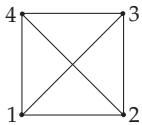  
Figure 5.34

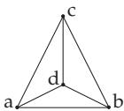  
Figure 5.35

A subgraph $G ^ { \prime } = ( V ^ { \prime } , E ^ { \prime } )$ of $G = ( V , E )$ with $V ^ { \prime } = V$ is called a partial graph of $G .$ A factor F of a graph G is a regular subgraph of $G$ containing all vertices of G.

9. Adjacency Matrix

Finite graphs can be described by matrices: Let $G = ( V , E )$ be a graph with $V = \{ v _ { 1 } , v _ { 2 } , \ldots , v _ { n } \}$ and $E = \{ e _ { 1 } , e _ { 2 } , \ldots , e _ { m } \}$ . Let $m ( v _ { i } , v _ { j } )$ denote the number of edges from $v _ { i }$ to $v _ { j }$ . For undirected graphs, loops are counted twice; for directed graphs loops are counted once. The matrix A of type $( n , n )$ with $\mathbf { A } \ = \ ( m ( v _ { i } , v _ { j } ) )$ is called an adjacency matrix. If in addition the graph is simple, then the adjacency matrix has the following form:

$$
\mathbf { A } = ( a _ { i j } ) = \left\{ { 1 } , \quad { \mathrm { f o r } } \ ( v _ { i } , v _ { j } ) \in E , \right.\tag{5.317}
$$

i.e., in the matrix A there is a 1 in the i-th row and j-th column if there is an edge from $v _ { i }$ to $v _ { j }$ The adjacency matrix of undirected graphs is symmetric.

A: Beside Fig. 5.36 there is the adjacency matrix $\mathbf { A } _ { 1 } = \mathbf { A } ( G _ { 1 } )$ of the directed graph $G _ { 1 }$

B: Beside Fig. 5.37 there is the adjacency matrix $\mathbf { A } _ { 2 } = \mathbf { A } ( G _ { 2 } )$ of the undirected simple graph $G _ { 2 }$

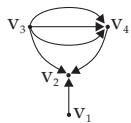  
Figure 5.36

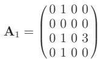

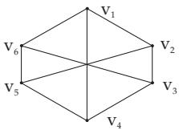

$$
\mathbf { A } _ { 2 } = { \left( \begin{array} { l } { 0 \ 1 \ 0 \ 1 \ 0 \ 1 } \\ { 1 \ 0 \ 1 \ 0 \ 1 \ 0 } \\ { 0 \ 1 \ 0 \ 1 \ 0 \ 1 } \\ { 1 \ 0 \ 1 \ 0 \ 1 \ 0 } \\ { 0 \ 1 \ 0 \ 1 \ 0 \ 1 } \\ { 1 \ 0 \ 1 \ 0 \ 1 \ 0 } \end{array} \right) }
$$

Figure 5.37

10. Incidence Matrix

For an undirected graph $G = ( V , E )$ with $V = \{ v _ { 1 } , v _ { 2 } , \ldots , v _ { n } \}$ and $E = \{ e _ { 1 } , e _ { 2 } , \ldots , e _ { m } \}$ , the matrix I of type (n, m) given by

$b _ { i j } = { \left\{ \begin{array} { l l } { 0 , } & { v _ { i } } \\ { 1 , } & { v _ { i } } \\ { 2 , } & { v _ { i } } \end{array} \right. }$ is not incident with $e _ { j }$ I = (bij) with is incident with $e _ { j }$ and $e _ { j }$ is not a loop, is incident with $e _ { j }$ and $e _ { j }$ is a loop

(5.318)

is called the incidence matrix.

For a directed graph $G = ( V , E )$ with $V = \{ v _ { 1 } , v _ { 2 } , \ldots , v _ { n } \}$ and $E = \{ e _ { 1 } , e _ { 2 } , \ldots , e _ { m } \}$ , the incidence matrix I is the matrix of type $( n , m )$ , defined by

$b _ { i j } = \left\{ \begin{array} { r l } { 0 , } & { { } v _ { i } } \\ { 1 , } & { { } v _ { i } } \\ { - 1 , } & { { } v _ { i } } \\ { - 0 , } & { { } v _ { i } } \end{array} \right.$ is not incident with $e _ { j }$ is the initial point of $e _ { j }$ and $e _ { j }$ is not a loop, I = (b ) with is the terminal point of $e _ { j }$ and $e _ { j }$ is not a loop, is incident to $e _ { j }$ and $e _ { j }$ is a loop.

(5.319)

11. Weighted Graphs

If $G = ( V , E )$ is a graph and f is a mapping assigning a real number to every edge, then $( V , E , f )$ is called a weighted graph, and $f ( e )$ is the weight or length of the edge e.

In applications, these weights of the edges represent costs resulting from the construction, maintenance or use of the connections.
