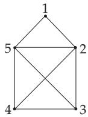
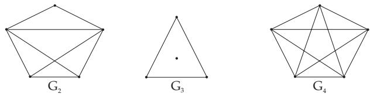
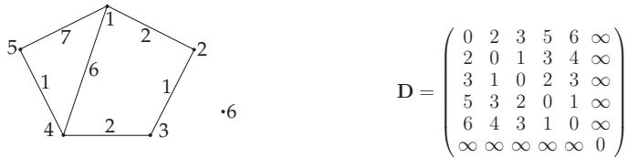
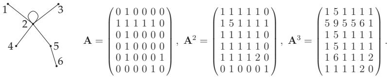
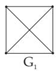
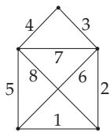
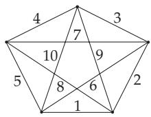
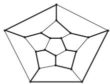
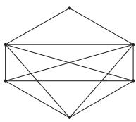
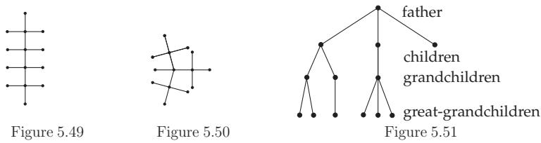

#### 5.8.2 Traverse of Undirected Graphs

##### 5.8.2.1 Edge Sequences or Paths

1. Edge Sequences or Paths

In an undirected graph $G = ( V , E )$ every sequence $F = ( \{ v _ { 1 } , v _ { 2 } \} , \{ v _ { 2 } , v _ { 3 } \} , \dots , \{ v _ { s } , v _ { s + 1 } \} )$ of the ele-

If $v _ { 1 } = v _ { s + 1 }$ , then the sequence is called a cycle, otherwise it is an open edge sequence. An edge sequence F is called a path if $v _ { 1 } , v _ { 2 } , \ldots , v _ { s }$ are pairwise distinct vertices. A closed path is a circuit. A trail is a sequence of edges without repeated edges.

In the graphs in Fig. 5.38, $F _ { 1 } = ( \{ 1 , 2 \} , \{ 2 , 3 \} , \{ 3 , 5 \} , \{ 5 , 2 \} , \{ 2 , 4 \} )$ is an edge sequence of length 5, $F _ { 2 } ~ = ~ \left( \{ 1 , 2 \} , \{ 2 , 3 \} , \{ 3 , 4 \} , \{ 4 , 2 \} , \{ 2 , 1 \} \right)$ is a cycle of length 5, $\begin{array} { r c l } { F _ { 3 } } & { = } & { ( \{ 2 , 3 \} , \{ 3 , 5 \} , \{ 5 , 2 \} , \{ 2 , 1 \} ) } \end{array}$ is a path, $F _ { 4 } ~ =$ $( \{ 1 , 2 \} , \{ 2 , 3 \} , \{ 3 , 4 \} )$ is a path. An elementary cycle is given by $F _ { 5 } ~ =$ $( \{ 1 , 2 \} , \{ 2 , 5 \} , \{ 5 , 1 \} )$

Figure 5.38

2. Connected Graphs, Components

If there is at least one path between every pair of distinct vertices v, w in a graph $G ,$ then G is called connected. If a graph G is not connected, it can be decomposed into components, i.e., into induced connected subgraphs with maximal number of vertices.

3. Distance Between Vertices

The distance $\delta ( v , w )$ between two vertices $v , w$ of an undirected graph is the length of a path with minimum number of edges connecting v and w. If such a path does not exist, then let $\delta ( v , w ) = \infty$

4. Problem of Shortest Paths

Let $G = ( V , E , f )$ be a weighted simple graph with $f ( e ) > 0$ for every $e \in E$ . Determine the shortest path from v to w for two vertices v, w of G, i.e., a path from v to w having minimum sum of weights of edges and arcs, respectively.

There is an eficient algorithm of Dantzig to solve this problem, which is formulated for directed graphs and can be used for undirected graphs (see 5.8.6, p. 410) in a similar way.

Every graph $G = ( V , E , f )$ with $V = \{ v _ { 1 } , v _ { 2 } , \ldots , v _ { n } \}$ has a distance matrix D of type $( n , n )$

$$
{ \bf D } = ( d _ { i j } ) \quad \mathrm { w i t h } \quad d _ { i j } = \delta ( v _ { i } , v _ { j } ) \qquad ( i , j = 1 , 2 , \ldots , n ) .\tag{5.320}
$$

In the case that every edge has weight 1, i.e., the distance between v and w is equal to the minimum number of edges which have to be traversed in the graph to get from v to w, then the distance between two vertices can be determined using the adjacency matrix: Let $v _ { 1 } , v _ { 2 } , \ldots , v _ { n }$ be the vertices of G. The adjacency matrix of G is $\mathbf { A } = \left( a _ { i j } \right)$ , and the powers of the adjacency matrix with respect to the usual multiplication of matrices (see 4.1.4, 5., p. 272) are denoted by $\mathbf { A } ^ { m } = ( a _ { i j } ^ { m } ) , m \in \mathbb { N }$

There is a shortest path of length k from the vertex $v _ { i }$ to the vertex $v _ { j } \ ( i \neq j )$ if:

$$
a _ { i j } ^ { k } \neq 0 \quad \mathrm { a n d } \quad a _ { i j } ^ { s } = 0 \quad ( s = 1 , 2 , \ldots , k - 1 ) .\tag{5.321}
$$

The weighted graph represented in Fig. 5.39 has the distance matrix D beside it.

The graph represented in Fig. 5.40 has the adjacency matrix A beside it, and for $m = 2$ or $m = 3$ the matrices ${ \bf A } ^ { 2 }$ and ${ \mathbf A } ^ { 3 }$ are obtained. Shortest paths of length 2 connect the vertices 1 and 3, 1 and 4, 1 and 5, 2 and 6, 3 and 4, 3 and 5, 4 and 5. Furthermore the shortest paths between the vertices 1 and 6, 3 and 6, and finally 4 and 6 are of length 3.

  
Figure 5.39

  
Figure 5.40

##### 5.8.2.2 Euler Trails

1. Euler Trail, Euler Graph

A trail containing every edge of a graph G is called an open or closed Euler trail of G.

A connected graph containing a closed Euler trail is an Euler graph.

The graph $G _ { 1 }$ (Fig. 5.41) has no Euler trail. The graph $G _ { 2 }$ (Fig. 5.42) has an Euler trail, but it is not an Euler graph. The graph $G _ { 3 }$ (Fig. 5.43) has a closed Euler trail, but it is not an Euler graph. The graph $G _ { 4 }$ (Fig. 5.44) is an Euler graph.

  
Figure 5.41  
Figure 5.42  
Figure 5.43  
Figure 5.44

2. Theorem of Euler-Hierholzer

A finite connected graph is an Euler graph if all vertices have positive even degrees.

3. Construction of a Closed Euler Trail

If G is an Euler graph, then one chooses an arbitrary vertex $v _ { 1 }$ of G and constructs a trail $F _ { 1 }$ by traversing a path, starting at $v _ { 1 }$ and proceeding until it cannot be continued. If $F _ { 1 }$ does not yet contain all edges of $G ,$ then one constructs another path $F _ { 2 }$ containing the edges not in $F _ { 1 }$ , but starting at a vertex $v _ { 2 } \in F _ { 1 }$ and proceeds until it cannot be continued. Then one composes a closed trail in $\mathrm { \bar { \it G } }$ using $F _ { 1 }$ and $F _ { 2 } { \mathrm { : } }$ Starting to traverse $F _ { 1 }$ at $v _ { 1 }$ until $v _ { 2 }$ is reached, then continuing to traverse $F _ { 2 } .$ , and finishing at the edges of $F _ { 1 }$ not used before. Repeating this method a closed Euler trail is obtained in finitely many steps.

4. Open Euler Trails

There is an open Euler trail in a graph G if there are exactly two vertices in G with odd degrees. Fig. 5.45 shows a graph which has no closed Euler trail, but it has an open Euler trail. The edges are consecutively enumerated with respect to an Euler trail. In Fig. 5.46 there is a graph with a closed Euler trail.

  
Figure 5.45

  
Figure 5.46

  
Figure 5.47

5. Chinese Postman Problem

The problem, that a postman should pass through all streets in his service area at least once and return to the initial point and use a trail as short as possible, can be formulated in graph theoretical terms as follows: Let $\bar { G } = ( V , E , f )$ be a weighted graph with $f ( e ) \geq 0$ for every edge $e \in E$ . Determine an edge sequence $F$ with minimum total length

$$
L = \sum _ { e \in F } f ( e ) .\tag{5.322}
$$

The name of the problem refers to the Chinese mathematician Kuan, who studied this problem first. To solve it two cases are distinguished:

1. G is an Euler graph – then every closed Euler trail is optimal – and

2. G has no closed Euler trail.

An efective algorithm solving this problem is given by Edmonds and Johnson (see [5.25]).

##### 5.8.2.3 Hamiltonian Cycles

1. Hamiltonian Cycle

A Hamiltonian cycle is an elementary cycle in a graph covering all of the vertices.

In Fig. 5.47, lines in bold face show a Hamiltonian cycle.

The idea of a game to construct Hamiltonian cycles in the graph of a pentagondodecaeder, goes back to Sir W. Hamilton.

Remark: The problem of characterizing graphs with Hamiltonian cycles leads to one of the classical NP-complete problems. Therefore, an eficient algorithm to determine the Hamilton cycles cannot be given here.

2. Theorem of Dirac

If a simple graph $G = ( V , E )$ has at least three vertices, and $d _ { G } ( v ) \geq | V | / 2$ holds for every vertex v of G, then G has a Hamiltonian cycle. This is a suficient but not a necessary condition for the existence of Hamiltonian cycles. The following theorems with more general assumptions give only suficient but not necessary conditions for the existence of Hamilton cycles, too.

  
Figure 5.48

Fig. 5.48 shows a graph which has a Hamiltonian cycle, but does not satisfy the assumptions of the following theorem of Ore.

3. Theorem of Ore

If a simple graph $G = ( V , E )$ has at least three vertices, and $d _ { G } ( v ) +$ $d _ { G } ( w ) \geq | V |$ holds for every pair of non-adjacent vertices v, w, then $G$ contains a Hamiltonian cycle.

4. Theorem of Posa

Let $G = ( V , E )$ be a simple graph with at least three vertices. There is a Hamiltonian cycle in G if the following conditions are satisfied:

1. For $1 \leq k < ( | V | - 1 ) / 2$ , the number of vertices of degree not exceeding k is less than k.

2. If V is odd, then the number of vertices of degree not exceeding $( | V | - 1 ) / 2$ is less than or equal to $( | V | - \dot { 1 } ) / 2$

