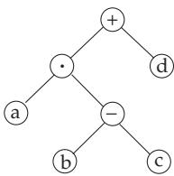
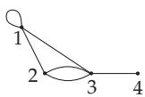
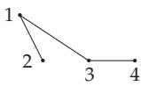

#### 5.8.3 Trees and Spanning Trees

##### 5.8.3.1 Trees

1. Trees

An undirected connected graph without cycles is called a tree. Every tree with at least two vertices has at least two vertices of degree 1. Every tree with n vertices has exactly n 1 edges.

A directed graph is called a tree if G is connected and does not contain any circuit (see 5.8.6, p. 410).

Fig. 5.49 and Fig. 5.50 represent two non-isomorphic trees with 14 vertices. They demonstrate the chemical structure of butane and iso-butane.

2. Rooted Trees

A tree with a distinguished vertex is called a rooted tree, and the distinguished vertex is called the root. In diagrams, the root is usually on the top, and the edges are directed downwards from the root (see Fig. 5.51). Rooted trees are used to represent hierarchic structures, as for instance hierarchies in factories, family trees, grammatical structures.

Fig. 5.51 shows the genealogy of a family in the form of a rooted tree. The root is the vertex assigned to the father.

3. Regular Binary Trees

If a tree has exactly one vertex of degree 2 and otherwise only vertices of degree 1 or 3, then it is called a regular binary tree.

The number of vertices of a regular binary tree is odd. Regular trees with n vertices have (n + 1)/2 vertices of degree 1. The level of a vertex is its distance from the root. The maximal level occurring in a tree is the height of the tree. There are several applications of regular binary rooted trees, e.g., in informatics.

4. Ordered Binary Trees

Arithmetical expressions can be represented by binary trees. Here, the numbers and variables are as-signed vertices of degree 1, the operations “+”,“−”, “·” correspond to vertices of degree > 1, and the left and right subtree, respectively, represents the first and second operand, respectively, which is, in general, also an expression. These trees are called ordered binary trees.

The traverse of an ordered binary tree can be performed in three diferent ways, which are defined in a recursive way (see also Fig. 5.52):

Inorder traverse: Traverse the left subtree of the root (in inorder traverse),

Preorder traverse: Visit the root,

traverse the left subtree (in preorder traverse),

traverse the right subtree of the root (in preorder traverse).

Postorder traverse: Traverse the left subtree of the root (in postorder traverse),

traverse the right subtree of the root (in postorder traverse), visit the root.

Using inorder traverse the order of the terms does not change in comparison with the given expression. The term obtained by postorder traverse is called postfix notation PN or Polish notation. Analogously, the term obtained by preorder traverse is called prefix notation or reversed Polish notation.

Prefix and postfix expressions uniquely describe the tree. This fact can be used for the implementation of trees.

In Fig. 5.52 the term $a \cdot ( b - c ) + d$ is represented by a graph. Inorder traverse yields $a \cdot b - c + { \dot { d } } , $ preorder traverse yields + bcad, and postorder traversal yields abc $- \cdot d +$

##### 5.8.3.2 Spanning Trees

1. Spanning Trees

A tree, being a subgraph of an undirected graph $G ,$ and containing all vertices of G, is called a spanning tree of G. Every finite connected graph G contains a spanning tree H:

Figure 5.52

If G contains a cycle, then delete an edge of this cycle. The remaining graph $G _ { 1 }$ is still connected and can be transformed into a connected graph $G _ { 2 }$ by deleting a further edge of a cycle of $G _ { 1 }$ , if there exists such an edge. After finitely many steps a spanning tree of G is obtained.

Fig. 5.54 shows a spanning tree H of the graph $G$ shown in Fig. 5.53.

Figure 5.53

Figure 5.54

2. Theorem of Cayley

Every complete graph with n vertices $( n > 1 )$ has exactly $n ^ { n - 2 }$ spanning trees.

3. Matrix Spanning Tree Theorem

Let $G = ( V , E )$ be a graph with $V = \{ v _ { 1 } , v _ { 2 } , \ldots , v _ { n } \} ( n > 1 )$ and $E = \{ e _ { 1 } , e _ { 2 } , \ldots , e _ { m } \}$ . Define a matrix $\mathbf { D } = ( d _ { i j } )$ of type $( n , n )$

$$
d _ { i j } = { \left\{ \begin{array} { r } { 0 { \mathrm { ~ f o r ~ } } i \neq j , } \\ { d _ { G } ( v _ { i } ) { \mathrm { ~ f o r ~ } } i = j , } \end{array} \right. }\tag{5.323a}
$$

which is called the degree matrix. The diference between the degree matrix and the adjacency matrix is the admittance matrix L of G:

$$
\mathbf { L } = \mathbf { D } - \mathbf { A } .\tag{5.323b}
$$

Deleting the i-th row and the i-th column of L the matrix $\mathbf { L } _ { i }$ is obtained. The determinant of $\mathbf { L } _ { i }$ i equal to the number of spanning trees of the graph G.

The adjacency matrix, the degree matrix and the admittance matrix of the graph in Fig. 5.53 are:

$$
\mathbf { A } = { \left( \begin{array} { l } { 2 \ 1 \ 1 \ 0 } \\ { 1 \ 0 \ 2 \ 0 } \\ { 1 \ 2 \ 0 \ 1 } \\ { 0 \ 0 \ 1 \ 0 } \end{array} \right) } \ ,
$$

$$
\mathbf { D } = { \left( \begin{array} { l } { 4 \mathrm { ~ 0 ~ 0 ~ 0 ~ } } \\ { 0 \mathrm { ~ 3 ~ 0 ~ 0 ~ } } \\ { 0 \mathrm { ~ 0 ~ 4 ~ 0 ~ } } \\ { 0 \mathrm { ~ 0 ~ 0 ~ 1 ~ } } \end{array} \right) } ,
$$

$$
\begin{array} { r } { { \bf L } = \left( \begin{array} { c c c c } { 2 - 1 - 1 } & { 0 } \\ { - 1 } & { 3 - 2 } & { 0 } \\ { - 1 } & { - 2 } & { 4 - 1 } \\ { 0 } & { 0 } & { - 1 } & { 1 } \end{array} \right) . } \end{array}
$$

Since det $\mathbf { L } _ { 3 } = 5$ , the graph has five spanning trees.

4. Minimal Spanning Trees

Let $G = ( V , E , f )$ be a connected weighted graph. A spanning tree H of G is called a minimum spanning tree if its total length $f ( H )$ is minimum:

$$
f ( H ) = \sum _ { e \in H } f ( e ) .\tag{5.324}
$$

Minimum spanning trees are searched for, e.g., if the edge weights represent costs, and one is interested in minimum costs. A method to find a minimum spanning tree is the Kruskal algorithm:

a) Choose an edge with the least weight.

b) Continue, as long as it is possible, choosing a further edge having least weight and not forming a cycle with the edges already chosen, and add such an edge to the tree.

In step b) the choice of the admissible edges can be made easier by the following labeling algorithm: Let the vertices of the graph be labeled pairwise diferently.

At every step, an edge can be added only in the case that it connects vertices with diferent labels.

After adding an edge, the label of the endpoint with the larger label is changed to the value of the smaller endpoint label.
