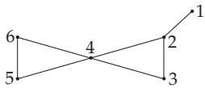

#### 5.8.4 Matchings

1. Matchings

A set M of edges of a graph G is called a matching in G, if M contains no loop and two diferent edges of M do not have common endpoints.

A matching $M ^ { * }$ of G is called a saturated matching, if there is no matching M in G such that $M ^ { * } \subset M$ A matching $M ^ { * * }$ of G is called a maximum matching, if there is no matching M in G such that $| M | >$ $\lvert M ^ { * * } \rvert$

If M is a matching of G such that every vertex of G is an endpoint of an edge of M, then M is called a

  
Figure 5.55

perfect matching.

In the graph in Fig. 5.55 $M _ { 1 } = \{ \{ 2 , 3 \} , \{ 5 , 6 \} \}$ is a saturated matching and $M _ { 2 } = \{ \bar { \{ 1 , 2 \} } , \{ 3 , 4 \} , \{ \bar { 5 , 6 } \} \}$ is a maximum matching which is also perfect.

Remark: In graphs with an odd number of edges there is no perfect matching.

2. Theorem of Tutte

Let $q ( G - S )$ denote the number of the components of $G - S$ with an odd number of vertices. A graph $G = ( V , E )$ has a perfect matching if $| V |$ is even and for every subset S of the vertex set $q ( G - S ) \leq | { \bar { S } } |$ Here $G - { \cal S }$ denotes the graph obtained from G by deleting the vertices of S and the edges incident with these vertices.

Perfect machings exist for example in complete graphs with an even number of vertices, in complete bipartite graphs $K _ { n , n }$ and in arbitrary regular bipartite graphs of degree $r > 0$

3. Alternating Paths

Let G be a graph with a matching M. A path W in G is called an alternating path if in W every edge e with $e \in M \ ( { \mathrm { o r } } \ e \not \in M )$ is followed by an edge e with $e ^ { \prime } \notin M \mathrm { ~ } ( \mathrm { o r ~ } e \in M )$

An open alternating path is called an increasing path if none of the endpoints of the path is incident with an edge of M.

4. Theorem of Berge

A matching M in a graph G is maximum if there is no increasing alternating path in G.

If W is an increasing alternating path in G with corresponding set $E ( W )$ of traversed edges, then $M ^ { \prime } = \left( M \setminus E ( W ) \right) \cup \left( E ( W ) \setminus \tilde { M } \right)$ forms a matching in G with $| \bar { M } ^ { \prime } | = | \dot { M } | \dot { + } 1$

In the graph of Fig. 5.55 $( \{ 1 , 2 \} , \{ 2 , 3 \} , \{ 3 , 4 \} )$ is an increasing alternating path with respect to matching $M _ { 1 }$ . Matching $M _ { 2 }$ with $\hat { | M _ { 2 } | } = \hat { | M _ { 1 } | } + \hat { 1 }$ is obtained as described above.

5. Determination of Maximum Matchings

Let G be a graph with a matching M.

a) First form a saturated matching M∗ with $M \subseteq M ^ { * }$

b) Chose a vertex v in G, which is not incident with an edge of $M ^ { * }$ , and determine an increasing alternating path in G starting at v.

c) If such a path exists, then the method described above results in a matching $M ^ { \prime }$ with $| M ^ { \prime } | > | M ^ { * } |$ If there is no such path, then delete vertex v and all edges incident with v in G, and repeat step b).

There is an algorithm of Edmonds, which is an efective method to search for maximum matchings, but it is rather complicated to describe (see [5.24]).
