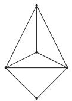
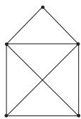
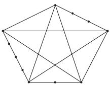
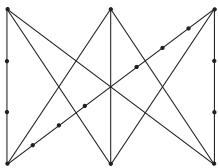

#### 5.8.5 Planar Graphs

Here, the considerations are restricted to undirected graphs, since a directed graph is planar if the corresponding undirected graph is a planar one.

  
Figure 5.56  
Figure 5.57

1. Planar Graph

A graph is called a plane graph if G can be drawn in the plane with its edges intersecting only in vertices of G. A graph isomorphic with a plane graph is called a planar graph.

Fig. 5.56 shows a plane graph $G _ { 1 }$ . The graph $G _ { 2 }$ in Fig. 5.57 is isomorphic to $G _ { 1 } ,$ , it is not a plane graph but a planar graph, since it is isomorphic with $G _ { 1 }$

2. Non-Planar Graphs

The complete graph $K _ { 5 }$ and the complete bipartite graph $K _ { 3 , 3 }$ are non-planar graphs (see 5.8.1, 5., p. 402).

3. Subdivisions

A subdivision of a graph G is obtained if vertices of degree 2 are inserted into edges of G. Every graph is a subdivision of itself. Certain subdivisions of $K _ { 5 }$ and $K _ { 3 , 3 }$ are represented in Fig. 5.58 and Fig. 5.59.

4. Kuratowski’s Theorem

A graph is non-planar if it contains a subgraph which is a subdivision either of the complete bipartite graph $K _ { 3 , 3 }$ or of the complete graph $K _ { 5 }$

Figure 5.58

Figure 5.59
