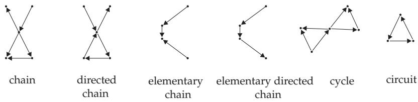
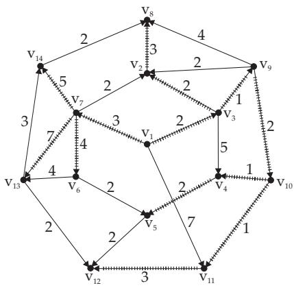

#### 5.8.6 Paths in Directed Graphs

1. Arc Sequences

A sequence $F = ( e _ { 1 } , e _ { 2 } , \dots , e _ { s } )$ of arcs in a directed graph is called a chain of length s, if F does not contain any arc twice and one of the endpoints of every arc $e _ { i }$ for $i = 2 , 3 , \dots , s - 1$ is an endpoint of the arc $e _ { i - 1 }$ and the other one an endpoint of $e _ { i + 1 }$

A chain is called a directed chain if for $i = 1 , 2 , \ldots , s - 1$ the terminal point of the arc $e _ { i }$ coincides with the initial point of $e _ { i + 1 }$

Chains or directed chains traversing every vertex at most once are called elementary chains and elementary directed chains, respectively.

A closed chain is called a cycle. A closed directed path, with every vertex being the endpoint of exactly two arcs, is called a circuit.

Fig. 5.60 contains examples for various kinds of arc sequences.

2. Connected and Strongly Connected Graphs

A directed graph G is called connected if for any two vertices there is a chain connecting these vertices. The graph G is called strongly connected if to every two vertices v, w there is is assigned a directed chain connecting these vertices.

3. Algorithm of Dantzig

Let $G = ( V , E , f )$ be a weighted simple directed graph with $f ( e ) > 0$ for every arc e. The following algorithm yields all vertices of G, which are connected with a fixed vertex $v _ { 1 }$ by a directed chain, together with their distances from $v _ { 1 } \mathrm { { : } }$

a) Vertex $v _ { 1 }$ gets the label $t ( v _ { 1 } ) = 0 . \ \mathrm { L e t } \ S _ { 1 } = \{ v _ { 1 } \}$

  
Figure 5.60

b) The set of the labeled vertices is $S _ { m }$

c) If $U _ { m } = \{ e | e = ( v _ { i } , v _ { j } ) \in E , v _ { i } \in S _ { m } , v _ { j } \notin S _ { m } \} = \emptyset$ , then one finishes the algorithm.

d) Otherwise one chooses an arc $e ^ { * } = ( x ^ { * } , y ^ { * } )$ with minimum $t ( x ^ { * } ) + f ( e ^ { * } )$ . One labels $e ^ { * }$ and $y ^ { * }$ and puts $t ( y ^ { * } ) = t ( x ^ { * } ) + f ( e ^ { * } )$ and also $S _ { m + 1 } = \bar { S } _ { m } \cup \{ y ^ { * } \}$ and repeats b) with $m : = m + 1$

(If all arcs have weight 1, then the length of a shortest directed chain from a vertex v to a vertex w can be found using the adjacency matrix (see 5.8.2.1, 4., p. 404)).

If a vertex v of $G$ is not labeled, then there is no directed path from $v _ { 1 }$ to v.

If v has label $t ( v )$ , then $t ( v )$ is the length of such a directed chain. A shortest directed path from $v _ { 1 }$ to v can be found in the tree given by the labeled arcs and vertices, the distance tree with respect to $v _ { 1 }$

In Fig. 5.61, the labeled arcs and vertices represent the distance tree with respect to $v _ { 1 }$ in the graph. The lengths of the shortest directed chains are:

Figure 5.61
<table><tr><td>from  $v _ { 1 }$  to  $v _ { 3 }$ </td><td>2</td><td>from  $v _ { 1 }$  to  $v _ { \mathrm { 6 } }$ </td><td>7</td></tr><tr><td>from  $v _ { 1 }$  to  $v _ { 7 }$ </td><td>3</td><td>from  $v _ { 1 }$  to  $v _ { 8 }$ </td><td>7</td></tr><tr><td>from  $v _ { 1 }$  to  $v _ { 9 }$ </td><td>3</td><td>from  $v _ { 1 }$  to  $v _ { 1 4 }$ </td><td>8</td></tr><tr><td>from  $v _ { 1 }$  to  $v _ { 2 }$ </td><td>4</td><td>from  $v _ { 1 }$  to  $v _ { 5 }$ </td><td>8</td></tr><tr><td>from  $v _ { 1 }$  to  $v _ { 1 0 } :$ </td><td>5</td><td>from  $v _ { 1 }$  to  $v _ { 1 2 } :$ </td><td>9</td></tr><tr><td>from  $v _ { 1 }$  to  $v _ { 4 } :$ </td><td>6</td><td>from  $v _ { 1 }$  to  $v _ { 1 3 }$ </td><td>10</td></tr><tr><td>from  $v _ { 1 }$  to  $v _ { 1 1 }$ </td><td>6.</td><td></td><td></td></tr></table>

Remark: There is also a modified algorithm to find the shortest directed chains in the case that $G = ( V , E , f )$ has arcs with negative weights.
