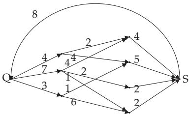
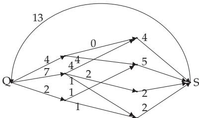
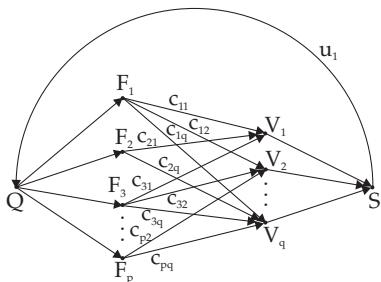

#### 5.8.7 Transport Networks

1. Transport Network

A connected directed graph is called a transport network if it has two labeled vertices, called the source $Q$ and sink S which have the following properties:

a) There is an arc $u _ { 1 }$ from $S$ to $Q .$ , where $u _ { 1 }$ is the only arc with initial point S and the only arc with terminal point $Q$

b) Every arc $u _ { i }$ diferent from $u _ { 1 }$ is assigned a real number $c ( u _ { i } ) \geq 0$ . This number is called its capacity.   
The arc $u _ { 1 }$ has capacity .

$$
\sum _ { ( u , v ) \in G } \varphi ( u , v ) = \sum _ { ( v , w ) \in G } \varphi ( v , w )
$$

A function $\varphi _ { : }$ , which assigns a real number to every arc, is called a flow on $G ,$ if the equality

(5.325a)

holds for every vertex v. The sum

$$
\sum _ { ( Q , v ) \in G } \varphi ( Q , v )\tag{5.325b}
$$

is called the intensity of the flow. A flow $\varphi$ is called compatible to the capacities, if for every arc $u _ { i }$ of $G$ $0 \leq \varphi ( u _ { i } ) \leq c ( u _ { i } )$ holds.

For an example of a transport network see p. 412.

2. Maximum Flow Algorithm of Ford and Fulkerson

Using the maximum flow algorithm one can recognize whether a given flow $\varphi$ is maximal.

Let G be a transport network and $\varphi$ a flow of intensity $v _ { 1 }$ compatible with the capacities. The algorithm given below contains the following steps for labeling the vertices, and after finishing this procedure one can realize how much the intensity of the flow could be improved depending on the chosen labeling steps.

a) One labels the source Q and sets $\varepsilon ( Q ) = \infty$

b) If there is an arc $u _ { i } = ( x , y )$ with labeled x and unlabeled $y$ and $\varphi ( u _ { i } ) < c ( u _ { i } )$ , then one labels y and $( x , y )$ , and sets $\varepsilon ( y ) = \operatorname* { m i n } \{ \varepsilon ( x ) , c ( u _ { i } ) - \varphi ( u _ { i } ) \}$ , then one repeats step b), otherwise follows step c).

c) If there is an arc $u _ { i } = ( x , y )$ with unlabeled x and labeled $y , \varphi ( u _ { i } ) > 0$ and $u _ { i } \neq u _ { 1 }$ , then one labels x and $( x , y )$ , substitutes $\dot { \varepsilon } ( x ) = \operatorname* { m i n } \{ \varepsilon ( y ) , \varphi ( u _ { i } ) \}$ and returns to continue step b) if it is possible.

If the sink S of G is labeled, then the flow in G can be improved by an amount of $\varepsilon ( S )$ . If the sink is not labeled, then the flow is maximal

Maximum flow: For the graph in Fig. 5.62 the weights are written next to the edges. A flow with intensity 13, compatible to these capacities, is represented in the weighted graph in Fig. 5.63. It is a maximum flow.

  
Figure 5.62

  
Figure 5.63

Transport network: A product is produced by p firms $F _ { 1 } , F _ { 2 } , \ldots , F _ { p } .$ There are $q$ users $\check { V _ { 1 } } , \check { V _ { 2 } } , \dotsc , \check { V _ { q } }$ . During a certain period there will be $s _ { i }$ units produced by $\mathbf { \bar { \rho } } _ { F _ { i } }$ and $t _ { j }$ units required by $V _ { j }$ $c _ { i j }$ units can be transported from $F _ { i }$ to $V _ { j }$ during the given period. Is it possible to satisfy all the re quirements during this period? The corresponding graph is shown in Fig. 5.64.

  
Figure 5.64
