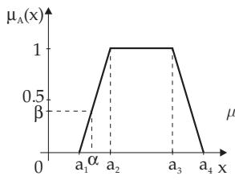
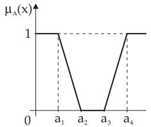
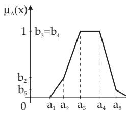
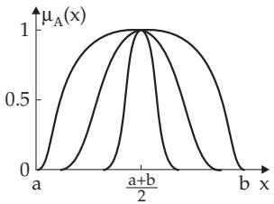
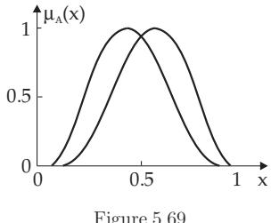
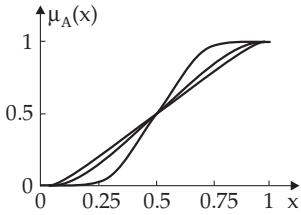
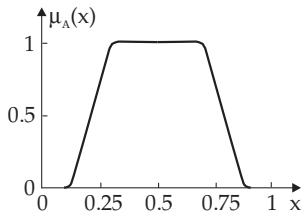

#### 5.9.1 Basic Notions of Fuzzy Logic

##### 5.9.1.1 Interpretation of Fuzzy Sets

Real situations are very often uncertain or vague in a number of ways. The word “fuzzy” also means some uncertainty, and the name of fuzzy logic is based on this meaning. Basically there are to distinguish two types of fuzziness: vagueness and uncertainty. There are two concepts belonging here: The theory of fuzzy sets and the theory of fuzzy measure. In the following practice-oriented introduction the notions, methods, and concepts of fuzzy sets are discussed, which are the basic mathematical tools of multi-valued logic.

1. Notions of Classical and Fuzzy Sets

The classical notion of (crisp) set is two-valued, and the classical Boolean set algebra is isomorphic to two-valued propositional logic. Let X be a fundamental set named the universe. Then for every ${ \overset { - } { A } } \subseteq X$ there exists a function

$$
f _ { A } \colon X \to \{ 0 , 1 \} ,\tag{5.326a}
$$

such that it says for every $x \in X$ whether this element x belongs to the set A or not:

$$
f _ { A } ( x ) = 1 \Leftrightarrow x \in A \quad { \mathrm { a n d } } \quad f _ { A } ( x ) = 0 \Leftrightarrow x \notin A .\tag{5.326b}
$$

The concept of fuzzy sets is based on the idea of considering the membership of an element of the set as a statement, the truth value of which is characterized by a value from the interval [0, 1]. For mathematical modeling of a fuzzy set A a function is necessary whose range is the interval [0, 1] instead of 0,1 , i.e.:

$$
\mu _ { A } \colon X \to [ 0 , 1 ] .\tag{5.327}
$$

In other words: To every element $x \in X$ is to assign a number $\mu _ { A } ( x )$ from the interval $[ 0 , 1 ]$ , which represents the grade of membership of x in A. The mapping $\mu _ { A }$ is called the membership function. The value of the function $\mu _ { A } ( x )$ at the point x is called the grade of membership. The fuzzy sets $A , B , C$ etc. over X are also called fuzzy subsets of X. The set of all fuzzy sets over X is denoted by $F ( X )$

2. Properties of Fuzzy Sets and Further Definitions

The properties below follow directly from the definition:

(E1) Crisp sets can be interpreted as fuzzy sets with grade of membership 0 and 1.

(E2) The set of the arguments x, whose grade of membership is greater than zero, i.e., $\mu _ { A } ( x ) > 0$ , is called the support of the fuzzy set A:

$$
\operatorname { s u p p } ( A ) = \left\{ x \in X \mid \mu _ { A } ( x ) > 0 \right\} .\tag{5.328}
$$

The set $k e r ( A ) = \{ x \in X : \mu _ { A } ( x ) = 1 \}$ is called the kernel or core of A.

(E3) Two fuzzy sets A and B over the universe X are equal if the values of their membership functions are equal:

$$
A = B , { \mathrm { ~ i f ~ } } \mu _ { A } ( x ) = \mu _ { B } ( x ) { \mathrm { ~ h o l d s ~ f o r ~ e v e r y ~ } } x \in X .\tag{5.329}
$$

(E4) Discrete representation or ordered pair representation: If the universe X is finite, i.e.,

$X = \{ x _ { 1 } , x _ { 2 } , . . . , x _ { n } \}$ it is reasonable to define the membership function of the fuzzy set with a table of values. The tabular representation of the fuzzy set A is seen in Table 5.7.

Also it is possible to write

Table 5.7 Tabular representation of a fuzzy set
<table><tr><td rowspan=1 colspan=1>x1</td><td rowspan=1 colspan=1> $x _ { 2 }$ </td><td rowspan=1 colspan=1> $\dots$ </td><td rowspan=1 colspan=1> $x _ { n }$ </td></tr><tr><td rowspan=1 colspan=1> $\overline { { \mu _ { A } ( x _ { 1 } ) } }$ </td><td rowspan=1 colspan=1> $\boxed { \mu _ { A } ( x _ { 2 } ) }$ </td><td rowspan=1 colspan=1></td><td rowspan=1 colspan=1> $\overline { { \mu _ { A } ( x _ { n } ) } }$ </td></tr></table>

$$
A : = \mu _ { A } ( x _ { 1 } ) / x _ { 1 } + \cdots + \mu _ { A } ( x _ { n } ) / x _ { n } = \sum _ { i = 1 } ^ { n } \mu _ { A } ( x _ { i } ) / x _ { i } .\tag{5.330}
$$

In (5.330) the fraction bars and addition signs have only symbolic meaning.

(E5) Ultra-fuzzy set: A fuzzy set, whose membership function itself is a fuzzy set, is called, after Zadeh, an ultra-fuzzy set.

3. Fuzzy Linguistics

Assigning linguistic values, e.g., “small”, “medium” or “big”, to a quantity then it is called a linguistic quantity or linguistic variable. Every linguistic value can be described by a fuzzy set, for example, by the graph of a membership function (5.9.1.2) with a given support (5.328). The number of fuzzy sets (in the case of “small”, “medium”, “big” they are three) depends on the problem.

In 5.9.1.2 the linguistic variable is denoted by x. For example, x can have linguistic values for temperature, pressure, volume, frequency, velocity, brightness, age, wearing, etc., and also medical, electrical, chemical, ecological, etc. variables.

By the membership function $\mu _ { A } ( x )$ of a linguistic variable, the membership degree of a fixed (crisp) value can be determined in the fuzzy set represented by $\mu _ { A } ( x )$ . Namely, the modeling of a $\mathrm { \dot { \hat { \Pi } } h i g \hat { h } ^ { \vec { \prime } } }$ quantity, e.g., the temperature, as a linguistic variable given by a trapezoidal membership function (Fig. 5.65) means that the given temperature α belongs to the fuzzy set “high temperature” with the degree of membership β (also degree of compatibility or degree of truth).

##### 5.9.1.2 Membership Functions on the Real Line

The membership functions can be modeled by functions with values between 0 and 1. They represent the diferent grade of membership for the points of the universe being in the given set.

1. Trapezoidal Membership Functions

Trapezoidal membership functions are widespread. Piecewise (continuously diferentiable) membership functions and their special cases, e.g., the triangle shape membership functions described in the following examples, are very often used. Connecting fuzzy quantities gives smoother output functions if the fuzzy quantities were represented by continuous or piecewise continuous membership functions.

A: Trapezoidal function (Fig. 5.65) corresponding to (5.331).

  
Figure 5.65

$$
\iota _ { A } ( x ) = \left\{ \begin{array} { l l } { 0 } & { x \leq a _ { 1 } , } \\ { } \\ { \frac { x - a _ { 1 } } { a _ { 2 } - a _ { 1 } } } & { a _ { 1 } < x < a _ { 2 } , } \\ { 1 } & { a _ { 2 } \leq x \leq a _ { 3 } , } \\ { } \\ { \frac { a _ { 4 } - x } { a _ { 4 } - a _ { 3 } } } & { a _ { 3 } < x < a _ { 4 } , } \\ { 0 } & { x \geq a _ { 4 } . } \end{array} \right.\tag{5.331}
$$

The graph of this function turns into a triangle function if $a _ { 2 } ~ = ~ a _ { 3 } ~ = ~ a$ and $a _ { 1 } ~ <$ $a \mathrm { ~  ~ { ~ < ~ } ~ } a _ { 4 }$ . Choosing diferent values for $a _ { 1 } , \dotsc , a _ { 4 } \dotsc$ ves symmetrical or asymmetrical trapezoidal functions, a symmetrical triangle function $( a _ { 2 } = a _ { 3 } = a$ and a $a _ { 1 } | = | a _ { 4 } - a | )$ or asymmetrical triangle function $( a _ { 2 } =$ $a _ { 3 } = a { \mathrm { a n d } } | a - a _ { 1 } | \neq | a _ { 4 } -$ a ).

B: Membership function bounded to the left and to the right (Fig. 5.66) corresponding to (5.332):

  
Figure 5.66

$$
\mu _ { A } ( x ) = \left\{ \begin{array} { l l } { 1 } & { x \leq a _ { 1 } , } \\ { \frac { a _ { 2 } - x } { a _ { 2 } - a _ { 1 } } } & { a _ { 1 } < x < a _ { 2 } , } \\ { 0 } & { a _ { 2 } \leq x \leq a _ { 3 } , } \\ { \frac { x - a _ { 3 } } { a _ { 4 } - a _ { 3 } } } & { a _ { 3 } < x < a _ { 4 } , } \\ { 1 } & { a _ { 4 } \leq x . } \end{array} \right.\tag{5.332}
$$

C: Generalized trapezoidal function (Fig. 5.67) corresponding to (5.333).

  
Figure 5.67

$$
\mu _ { A } ( x ) = \left\{ \begin{array} { l l } { 0 } & { x \leq a _ { 1 } , } \\ { b _ { 2 } ( x - a _ { 1 } ) } & { a _ { 1 } < x < a _ { 2 } , } \\ { \frac { ( b _ { 3 } - b _ { 2 } ) ( x - a _ { 2 } ) } { a _ { 3 } - a _ { 2 } } + b _ { 2 } } & { a _ { 2 } \leq x \leq a _ { 3 } , } \\ { b _ { 3 } = b _ { 4 } = 1 } & { a _ { 3 } < x < a _ { 4 } , } \\ { b _ { 4 } - b _ { 5 } ) ( a _ { 4 } - x ) } & { a _ { 4 } < x \leq a _ { 5 } , } \\ { \frac { ( b _ { 4 } ( a _ { 6 } - x ) ) } { a _ { 5 } - a _ { 4 } } + b _ { 5 } } & { a _ { 4 } < x \leq a _ { 5 } , } \\ { \frac { b _ { 5 } ( a _ { 6 } - x ) } { a _ { 6 } - a _ { 5 } } } & { a _ { 6 } < x < a _ { 6 } , } \\ { 0 } & { a _ { 6 } \leq x . } \end{array} \right.\tag{5.333}
$$

2. Bell-Shaped Membership Functions

A: A class of bell-shaped, diferentiable membership functions is given by the function $f ( x )$ from (5.334) by choosing an appropriate $p ( x )$

(5.334)

For $p ( x ) = k ( x - a ) ( b - x )$ and, $\mathrm { e . g . , } k = 1 0$ or $k = 1$ or $k = 0 . 1$ , there is a family of symmetrical curves of diferent

$$
f ( x ) = \left\{ { \begin{array} { l l } { 0 } & { \ x \leq a , } \\ { e ^ { - 1 / p ( x ) } } & { \ a < x < b , } \\ { 0 } & { \ x \geq b . } \end{array} } \right.
$$

width with the membership function $\mu _ { A } ( x ) = f ( x ) \biggl / f \left( \frac { a + b } { 2 } \right)$ , where $1 \left/ f \left( \frac { a + b } { 2 } \right) \right.$ is the normalizing factor (Fig. 5.68). The exterior curve follows with the value $k = 1 0$ and the interior one with $k = 0 . 1$

Asymmetrical membership functions in [0, 1] follow e.g. for $p ( x ) = x ( 1 - x ) ( 2 - x )$ or for $p ( x ) =$ $x ( \overset { \cdot } { 1 } - x ) ( x + 1 ) ( \mathbf { F i g . 5 . 6 9 } )$ , using appropriate normalizing factors. The factor $( 2 - x )$ in the first polynomial results in the shifting of the maximum to the left and it yields an asymmetrical curve shape. Similarly, the factor $( x + 1 )$ in the second polynomial results in a shifting to the right and in an asymmetric form.

  
Figure 5.68

  
Figure 5.69

B: A more flexible class of membership functions can be got by the formula

$$
F _ { t } ( x ) = { \frac { \int _ { a } ^ { x } f \left( t ( u ) \right) d u } { \int _ { a } ^ { b } f \left( t ( u ) \right) d u } } ,\tag{5.335}
$$

where f is defined by (5.334) with $p ( x ) = ( x - a ) ( b - x )$ and t is a transformation on [a, b]. If t is a smooth transformation on $[ a , b ] , \mathrm { i . e . }$ , if t is diferentiable infinitely many times in the interval $[ a , b ]$ then $F _ { t }$ is also smooth, since f is smooth. Requiring t to be either increasing or decreasing and to be smooth, then the transformation t allows to change the shape of the curve of the membership function. In practice, polynomials are especially suitable for transformations. The simplest polynomial is the identity $t ( x ) = x$ on the interval $[ a , b ] = [ 0 , 1 ]$

The next simplest polynomial with the given properties is $\begin{array} { l } { t ( x ) = - { \frac { 2 } { 3 } } c x ^ { 3 } + c x ^ { 2 } + \left( 1 - { \frac { c } { 3 } } \right) } \end{array}$ x with a constant $c \in [ - 6 , 3 ]$ . The choice $c = - 6$ results in the polynomial of maximum curvature, its equation is $q ( x ) = 4 x ^ { 3 } - 6 \dot { x } ^ { 2 } + 3 x$ . Choosing for $q _ { 0 }$ the identity function, i.e., $q _ { 0 } ( x ) = x$ , then can be got recursively further polynomials q by the formula $q _ { i } = q \circ q _ { i - 1 }$ for $i \in \mathbb { N }$ . Substituting the corresponding polynomial transformations $q _ { 0 } , q _ { 1 } , . . .$ −. into (5.335) for t, gives a sequence of smooth functions $F _ { q _ { 0 } } , F _ { q _ { 1 } } ^ { \sim }$ and $F _ { q _ { 2 } } \left( { \bf F i g . 5 . 7 0 } \right)$ , which can be considered as membership functions $\mu _ { A } ( x )$ , where $F _ { q _ { n } }$ converges to a line. The trapezoidal membership function can be approximated by diferentiable functions using the function $F _ { q _ { 2 } }$ , its reflection and a horizontal line (Fig. 5.71).

  
Figure 5.70

  
Figure 5.71

Summary: Imprecise and non-crisp information can be described by fuzzy sets and represented by membership functions $\mu ( x )$

##### 5.9.1.3 Fuzzy Sets

1. Empty and Universal Fuzzy Sets

a) Empty fuzzy set: A set A over X is called empty if $\mu _ { A } ( x ) = 0 \forall x \in X$ holds.

b) Universal fuzzy set: A set is called universal if $\mu _ { A } ( x ) = 1 \forall x \in X$ holds.

2. Fuzzy Subset

If $\mu _ { B } ( x ) \leq \mu _ { A } ( x ) \forall x \in X$ , then B is called a fuzzy subset of A (one writes: $B \subseteq A )$

3. Tolerance Interval and Spread of a Fuzzy Set on the Real Line

If A is a fuzzy set on the real line, then the interval

$$
[ a , b ] = \{ x \in X | \mu _ { A } ( x ) = 1 \} \quad ( a , b \mathrm { c o n s t } , a < b )\tag{5.336}
$$

is called the tolerance interval of the fuzzy set A, and the interval $[ c , d ] = \mathrm { c l } ( \mathrm { s u p p } A ) \ : ( c , d$ const $, c < d )$ is called the spread of A, where cl denotes the closure of the set. (The tolerance interval is sometimes also called the peak of set A.) The tolerance interval and the kernel coincide only if the kernel contains more then one point.

A: In $\mathbf { F i g . 5 . 6 5 } \left[ a _ { 2 } , a _ { 3 } \right]$ is the tolerance interval, and $[ a _ { 1 } , a _ { 4 } ]$ is the spread.

B: $a _ { 2 } = a _ { 3 } = a \left( \mathbf { F i g . \ 5 . 6 5 } \right)$ , gives a triangle-shaped membership function $\mu .$ In that case the triangular fuzzy set has no tolerance, but its kernel is the set $\{ a \}$ . If additionally $a _ { 1 } = a = a _ { 4 }$ holds, too, then a crisp value follows; it is called a singleton. A singleton A has no tolerance, but ker $( A ) =$ $\operatorname { s u p p } ( A ) = \{ a \}$

4. Conversion of Fuzzy Sets on a Continuous and Discrete Universe

Let the universe be continuous, and let a fuzzy set be given on it by its membership function. Discretizing the universe, every discrete point together with its membership value determines a fuzzy singleton.

Conversely, a fuzzy set given on a discrete universe can be converted into a fuzzy set on the continuous universe by interpolating the membership value between the discrete points of the universe.

5. Normal and Subnormal Fuzzy Sets

If A is a fuzzy subset of X, then its height is defined by

$$
H ( A ) : = \operatorname* { m a x } { \{ \mu _ { A } ( x ) | x \in X \} } .\tag{5.337}
$$

A is called a normal fuzzy set if $H ( A ) = 1$ , otherwise it is subnormal.

The notions and methods represented in this paragraph are limited to normal fuzzy sets, but it easy to extend them also to subnormal fuzzy sets.

6. Cut of a Fuzzy Set

The α cut $A ^ { > \alpha }$ or the strong α cut $A ^ { \geq \alpha }$ of a fuzzy set A are the subsets of X defined by

$$
A ^ { > \alpha } = \{ x \in X | \mu _ { A } ( x ) > \alpha \} , \qquad A ^ { \geq \alpha } = \{ x \in X | \mu _ { A } ( x ) \geq \alpha \} , \quad \alpha \in ( 0 , 1 ] .\tag{5.338}
$$

and $A ^ { \geq 0 } = \mathrm { c l } ( A ^ { > 0 } )$ . The α cut and strong α cut are also called α-level set and strong α-level set, respectively.

1. Properties

a) The α cuts of fuzzy sets are crisp sets.

b) The support supp(A) is a special α cut: supp(A) = A>0.

c) The crisp 1 cut $A ^ { \geq 1 } = \{ x \in X | \mu _ { A } ( x ) = 1 \}$ is called the kernel of A.

2. Representation Theorem

To every fuzzy subset A of X can be assigned uniquely the families of its α cuts $( A ^ { > \alpha } ) _ { \alpha \in [ 0 , 1 ) }$ and its strong α cuts $\left( A ^ { \geq \alpha } \right) _ { \alpha \in ( 0 , 1 ] } .$ The α cuts and strong α cuts are monotone families of subsets from X, since:

$$
\alpha < \beta \Rightarrow A ^ { > \alpha } \supseteq A ^ { > \beta } \quad \mathrm { a n d } \quad A ^ { \geq \alpha } \supseteq A ^ { \geq \beta } .\tag{5.339a}
$$

Conversely, if there exist the monotone families $\left( U _ { \alpha } \right) _ { \alpha \in [ 0 , 1 ) } \mathrm { o r } \left( V _ { \alpha } \right) _ { \alpha \in ( 0 , 1 ] }$ of subsets from X, then there are uniquely defined fuzzy sets U and V such that $U ^ { > \alpha } = U _ { \alpha }$ and $V ^ { \geq \alpha } = V _ { \alpha }$ and moreover

$$
\mu _ { U } ( x ) = \operatorname* { s u p } \{ \alpha \in [ 0 , 1 ) ) | x \in U _ { \alpha } \} , \qquad \mu _ { V } ( x ) = \operatorname* { s u p } \{ \alpha \in ( 0 , 1 ] | x \in V _ { \alpha } \} .\tag{5.339b}
$$

7. Similarity of the Fuzzy Sets A and B

1. The fuzzy sets A, B with membership functions $\mu _ { A } , \mu _ { B } \colon X \to [ 0 , 1 ]$ are called fuzzy similar if for every $\alpha \in ( 0 , 1 ]$ there exist numbers $\alpha _ { i }$ with $\alpha _ { i } \in ( 0 , 1 ] ; ( i = 1 , 2 )$ such that:

$$
\operatorname { s u p p } ( \alpha _ { 1 } \mu _ { A } ) _ { \alpha } \subseteq \operatorname { s u p p } ( \mu _ { B } ) _ { \alpha } , \qquad \operatorname { s u p p } ( \alpha _ { 2 } \mu _ { B } ) _ { \alpha } \subseteq \operatorname { s u p p } ( \mu _ { A } ) _ { \alpha } .\tag{5.340}
$$

$( \mu _ { C } ) _ { \alpha }$ represents a fuzzy set with the membership function $( \mu _ { C } ) _ { \alpha } = { \left\{ \begin{array} { l l } { \mu _ { C } ( x ) { \mathrm { ~ i f ~ } } \mu _ { C } ( x ) > \alpha } \\ { 0 { \mathrm { ~ o t h e r w i s e } } } \end{array} \right. }$ and $( \beta \mu _ { C } )$

represents a fuzzy set with the membership function $( \beta \mu _ { C } ) = \left\{ \begin{array} { l l } { \beta \mathrm { ~ i f ~ } \mu _ { C } ( x ) > \beta } \\ { 0 \mathrm { ~ o t h e r w i s e . } } \end{array} \right.$

2. Theorem: Two fuzzy sets A, B with membership functions $\mu _ { A } , \mu _ { B } \colon X \to [ 0 , 1 ]$ are fuzzy-similar if they have the same kernel:

$$
\operatorname { s u p p } ( \mu _ { A } ) _ { 1 } = \operatorname { s u p p } ( \mu _ { B } ) _ { 1 } ,\tag{5.341a}
$$

since the kernel is equal to the 1 cut, i.e.

$$
\mathrm { s u p p } ( \mu _ { A } ) _ { 1 } = \{ x \in X | \mu _ { A } ( x ) = 1 \} .\tag{5.341b}
$$

3. A, B with $\mu _ { A } , \mu _ { B } \colon X \to [ 0 , 1 ]$ are called strongly fuzzy-similar if they have the same support and the same kernel:

$$
\operatorname { s u p p } ( \mu _ { A } ) _ { 1 } = \operatorname { s u p p } ( \mu _ { B } ) _ { 1 } ,
$$

(5.342a)

$$
\operatorname { s u p p } ( \mu _ { A } ) _ { 0 } = \operatorname { s u p p } ( \mu _ { B } ) _ { 0 } .\tag{5.342b}
$$
