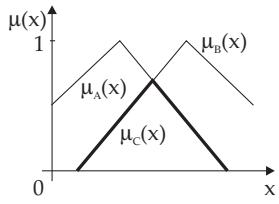
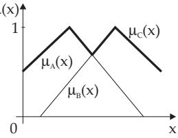
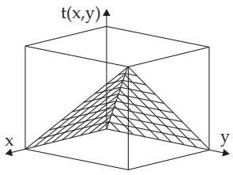
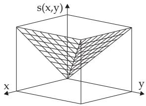

#### 5.9.2 Connections (Aggregations) of Fuzzy Sets

Fuzzy sets can be aggregated by operators. There are several diferent suggestions of how to generalize the usual set operations, such as union, intersection, and complement of fuzzy sets.

##### 5.9.2.1 Concepts for Aggregations of Fuzzy Sets

1. Fuzzy Set Union, Fuzzy Set Intersection

The grade of membership of an arbitrary element $x \in X$ in the sets $A \cup B$ and $A \cap B$ should depend only on the grades of membership $\mu _ { A } ( x )$ and $\mu _ { B } ( x )$ of the element in the two fuzzy sets A and B. The union and intersection of fuzzy sets is defined with the help of two functions

$$
s , t \colon [ 0 , 1 ] \times [ 0 , 1 ] \to [ 0 , 1 ] ,\tag{5.343}
$$

and they are defined in the following way:

$$
\mu _ { A \cup B } ( x ) : = s \left( \mu _ { A } ( x ) , \mu _ { B } ( x ) \right) ,
$$

(5.344)

$$
\mu _ { A \cap B } ( x ) : = t \left( \mu _ { A } ( x ) , \mu _ { B } ( x ) \right) .\tag{5.345}
$$

The grades of membership $\mu _ { A } ( x )$ and $\mu _ { B } ( x )$ are mapped in a new grade of membership. The functions t and s are called the t norm and t conorm; this last one is also called the s norm.

Interpretation: The functions $\mu _ { A \cup B }$ and μA B represent the truth values of membership, which is resulted by the aggregation of the truth values of memberships $\mu _ { A } ( x )$ and $\mu _ { B } ( x )$

2. Definition of the tNorm:

The t norm is a binary operation t in [0, 1]:

$$
t \colon [ 0 , 1 ] \times [ 0 , 1 ] \to [ 0 , 1 ] .\tag{5.346}
$$

It is symmetric, associative, monotone increasing, it has 0 as the zero element and 1 as the neutral element. For $x , y , z , v , w \in [ 0 , 1 ]$ the following properties are valid:

(E1) Commutativity: $t ( x , y ) = t ( y , x )$

(5.347a)

(E2) Associativity: $t ( x , t ( y , z ) ) = t ( t ( x , y ) , z )$

(5.347b)

(E3) Special Operations with Neutral and Zero Elements:

$$
t ( x , 1 ) = x { \mathrm { a n d ~ b e c a u s e ~ o f ~ ( E 1 ) } } ; \quad t ( 1 , x ) = x ; \quad t ( x , 0 ) = t ( 0 , x ) = 0 .\tag{5.347c}
$$

$$
( { \mathrm { E 4 } } ) { \mathrm { ~ M o n o t o n y : ~ } } { \mathrm { ~ I f ~ } } x \leq v { \mathrm { ~ a n d ~ } } y \leq w { \mathrm { , ~ t h e n ~ } } t ( x , y ) \leq t ( v , w ) { \mathrm { ~ i s ~ v a l i d } } .\tag{5.347d}
$$

3. Definition of the sNorm:

The s norm is a binary function in [0, 1]:

$$
s \colon [ 0 , 1 ] \times [ 0 , 1 ] \to [ 0 , 1 ] .\tag{5.348}
$$

It has the following properties:

$$
\mathrm { ( E 1 ) } \mathrm { C o m m u t a t i v i t y : \quad } s ( x , y ) = s ( y , x ) .\tag{5.349a}
$$

$$
( { \mathrm { E 2 } } ) { \mathrm { A s s o c i a t i v i t y : ~ } } s ( x , s ( y , z ) ) = s ( s ( x , y ) , z ) .\tag{5.349b}
$$

$$
\mathrm { ( E 3 ) ~ S p e c i a l ~ O p e r a t i o n s ~ w i t h ~ Z e r o ~ a n d ~ N e u t r a l ~ E l e m e n t s : }
$$

$$
s ( x , 0 ) = s ( 0 , x ) = x ; s ( x , 1 ) = s ( 1 , x ) = 1 .\tag{5.349c}
$$

$$
x \leq v
$$

$$
y \leq w ,
$$

$$
s ( x , y ) \leq s ( v , w )\tag{5.349d}
$$

With the help of these properties a class $T$ of t norms and a class $S$ of s norms can be introduced. Detailed investigations proved that the following relations hold:

$$
\operatorname* { m i n } \{ x , y \} \geq t ( x , y ) \forall t \in T , \forall x , y \in [ 0 , 1 ] \quad { \mathrm { a n d } }\tag{5.349e}
$$

$$
\operatorname* { m a x } \{ x , y \} \leq s ( x , y ) \forall s \in S , \forall x , y \in [ 0 , 1 ] .\tag{5.349f}
$$

##### 5.9.2.2 Practical Aggregation Operations of Fuzzy Sets

1. Intersection of Two Fuzzy Sets

The intersection $A \cap B$ of two fuzzy sets A and B is defined by the minimum operation min $( . , . )$ on their membership functions $\mu _ { A } ( x )$ and $\mu _ { B } ( x )$ . Based on the previous requirements there is:

$$
C : = A \cap B { \mathrm { ~ a n d ~ } } \mu _ { C } ( x ) : = \operatorname* { m i n } \left( \mu _ { A } ( x ) , \mu _ { B } ( x ) \right) \quad \forall x \in X , \quad { \mathrm { w h e r e } } :\tag{5.350a}
$$

$$
\operatorname* { m i n } ( a , b ) : = { \left\{ \begin{array} { l l } { a , { \mathrm { ~ i f ~ } } a \leq b , } \\ { b , { \mathrm { ~ i f ~ } } a > b . } \end{array} \right. }\tag{5.350b}
$$

The intersection operation corresponds to the AND operation of two membership functions (Fig.5.72). The membership function $\mu _ { C } ( x )$ is defined as the minimum value of $\mu _ { A } ( x )$ and $\mu _ { B } ( x )$

2. Union of Two Fuzzy Sets

The union A B of two fuzzy sets is defined by the maximum operation max $( . , . )$ on their membership functions $\mu _ { A } ( x )$ and $\mu _ { B } ( x )$

$$
C : = A \cup B { \mathrm { ~ a n d ~ } } \mu _ { C } ( x ) : = { \mathrm { ~ m a x ~ } } ( \mu _ { A } ( x ) , \mu _ { B } ( x ) ) \quad \forall x \in X , \quad { \mathrm { w h e r e } } :\tag{5.351a}
$$

$$
\operatorname* { m a x } ( a , b ) : = { \left\{ \begin{array} { l l } { a , { \mathrm { i f } } a \geq b , } \\ { b , { \mathrm { i f } } a < b . } \end{array} \right. }\tag{5.351b}
$$

The union corresponds to the logical OR operation. Fig.5.73 illustrates $\mu _ { C } ( x )$ as the maximum value of the membership functions $\mu _ { A } ( x )$ and $\mu _ { B } ( x )$

The t norm $t ( x , y ) = \operatorname* { m i n } \{ x , y \}$ and the s norm $s ( x , y ) = \operatorname* { m a x } \{ x , y \}$ define the intersection and the union of two fuzzy sets, respectively (see (Fig.5.74) and (Fig.5.75)).

Figure 5.72  
  
Figure 5.74

Figure 5.73  
  
Figure 5.75

3. Further Aggregations

Further aggregations are the bounded, the algebraic, and the drastic sum and also the bounded diference, the algebraic and the drastic product (see Table 5.8).

The algebraic sum, e.g., is defined by

$$
C : = A + B { \mathrm { ~ a n d ~ } } \mu _ { C } ( x ) : = \mu _ { A } ( x ) + \mu _ { B } ( x ) - \mu _ { A } ( x ) \cdot \mu _ { B } ( x ) \quad { \mathrm { f o r ~ e v e r y ~ } } x \in X .\tag{5.352a}
$$

Similarly to the union (5.351a,b), this sum also belongs to the class of s norms. They are included in

Table 5.8 t and s norms, $p \in \mathbb { R }$
<table><tr><td rowspan=1 colspan=1>Author</td><td rowspan=1 colspan=1>t norm</td><td rowspan=1 colspan=1>s norm</td></tr><tr><td rowspan=1 colspan=1>Zadeh</td><td rowspan=1 colspan=1>intersection: $t ( x , y ) = \operatorname* { m i n } \{ x , y \}$ </td><td rowspan=1 colspan=1>union: $s ( x , y ) = \operatorname* { m a x } \{ x , y \}$ </td></tr><tr><td rowspan=1 colspan=1>Lukasiewicz</td><td rowspan=1 colspan=1>bounded difference $t _ { b } ( x , y ) = \operatorname* { m a x } \{ 0 , x + y - 1 \}$ </td><td rowspan=1 colspan=1>bounded sum $s _ { b } ( x , y ) = \operatorname* { m i n } \{ 1 , x + y \}$ </td></tr><tr><td rowspan=1 colspan=1></td><td rowspan=1 colspan=1>algebraic product $\underline { { t _ { a } ( x , y ) } } = x y$ </td><td rowspan=1 colspan=1>algebraic sum $s _ { a } ( x , y ) = x + y - x y$ </td></tr><tr><td rowspan=1 colspan=1></td><td rowspan=1 colspan=1>drastic product $t _ { d p } ( x , y ) = { \left\{ \begin{array} { l l } { \operatorname* { m i n } \{ x , y \} , { \mathrm { ~ w h e t h e r ~ } } x = 1 } \\ { \qquad \operatorname { o r } y = 1 } \\ { 0 { \mathrm { ~ o t h e r w i s e } } } \end{array} \right. }$ </td><td rowspan=1 colspan=1>drastic sum $s _ { d s } ( x , y ) = { \left\{ \begin{array} { l l } { \operatorname* { m a x } \{ x , y \} , { \mathrm { w h e t h e r } } \ x = 0 } \\ { \qquad { \mathrm { o r } } \ y = 0 } \\ { 1 \ { \mathrm { o t h e r w i s e } } } \end{array} \right. }$ </td></tr><tr><td rowspan=1 colspan=1>Hamacher $( p \geq 0 )$ </td><td rowspan=1 colspan=1> $t _ { h } ( x , y ) = \frac { x y } { p + ( 1 - p ) ( x + y - x y ) }$ </td><td rowspan=1 colspan=1> $s _ { h } ( x , y ) = \frac { x + y - x y - ( 1 - p ) x y } { 1 - ( 1 - p ) x y }$ </td></tr><tr><td rowspan=1 colspan=1>Einstein</td><td rowspan=1 colspan=1>xa1 $t _ { e } ( x , y ) = \frac { \mathit { a y } } { 1 + ( 1 - x ) ( 1 - y ) }$ </td><td rowspan=1 colspan=1> $\boxed { s _ { e } ( x , y ) = \frac { x + y } { 1 + x y } }$ </td></tr><tr><td rowspan=1 colspan=1>Frank $( p > 0 , p \neq 1 )$ </td><td rowspan=1 colspan=1> $t _ { f } ( x , y ) =$  $\log _ { p } \left[ 1 + { \frac { ( p ^ { x } - 1 ) ( p ^ { y } - 1 ) } { p - 1 } } \right]$ </td><td rowspan=1 colspan=1> $s _ { f } ( x , y ) = 1 -$  $\log _ { p } \left[ 1 + { \frac { ( p ^ { 1 - x } - 1 ) ( p ^ { 1 - y } - 1 ) } { p - 1 } } \right]$ </td></tr><tr><td rowspan=1 colspan=1>Yager $( p > 0 )$ </td><td rowspan=1 colspan=1> $t _ { y a } ( x , y ) = 1 -$  $\operatorname* { m i n } \left( 1 , ( ( 1 - x ) ^ { p } + ( 1 - y ) ^ { p } ) ^ { 1 / p } \right)$ </td><td rowspan=1 colspan=1> $s _ { y a } ( x , y ) = \operatorname* { m i n } \left( 1 , \left( x ^ { p } + y ^ { p } \right) ^ { 1 / p } \right)$ </td></tr><tr><td rowspan=1 colspan=1>Schweizer $( p > 0 )$ </td><td rowspan=1 colspan=1> $t _ { s } ( x , y ) = \operatorname* { m a x } ( 0 , x ^ { - p } + y ^ { - p } - 1 ) ^ { - 1 / p }$ </td><td rowspan=1 colspan=1> $s _ { s } ( x , y ) = 1 -$  $\operatorname* { m a x } { ( 0 , ( 1 - x ) ^ { - p } + ( 1 - y ) ^ { - p } - 1 ) ^ { - 1 / p } }$ </td></tr><tr><td rowspan=1 colspan=1>Dombi $( p > 0 )$ </td><td rowspan=1 colspan=1> $t _ { d o } ( x , y ) =$  $\left\{ 1 + \left[ \left( { \frac { 1 - x } { x } } \right) ^ { p } + \left( { \frac { 1 - y } { y } } \right) ^ { p } \right] ^ { 1 / p } \right\} ^ { - 1 }$ </td><td rowspan=1 colspan=1> $s _ { d o } ( x , y ) = 1 -$  $\left\{ 1 + \left[ \left( { \frac { x } { 1 - x } } \right) ^ { p } + \left( { \frac { y } { 1 - y } } \right) ^ { p } \right] ^ { 1 / p } \right\} ^ { - 1 }$ </td></tr><tr><td rowspan=1 colspan=1>Weber $( p \geq - 1 )$ </td><td rowspan=1 colspan=1> $t _ { w } ( x , y ) = \operatorname* { m a x } ( 0 , ( 1 + p )$  $\cdot ( x + y - 1 ) - p x y )$ </td><td rowspan=1 colspan=1> $s _ { w } ( x , y ) = \operatorname* { m i n } ( 1 , x + y + p x y )$ </td></tr><tr><td rowspan=1 colspan=1>Dubois $( 0 \leq p \leq 1 )$ </td><td rowspan=1 colspan=1> $\overline { { t _ { d u } ( x , y ) = \frac { x y } { \operatorname* { m a x } ( x , y , p ) } } }$ </td><td rowspan=1 colspan=1> $s _ { d u } ( x , y ) =$  $x + y - x y - \operatorname* { m i n } ( x , y , ( 1 - p ) )$  $\operatorname* { m a x } ( ( 1 - x ) , ( 1 - y ) , p )$ </td></tr><tr><td rowspan=1 colspan=3>Remark: For the values of the t and s norms listed in the table, the following ordering is valid: $t _ { d p } \leq t _ { b } \leq t _ { e } \leq t _ { a } \leq t _ { h } \leq t \leq s \leq s _ { h } \leq s _ { a } \leq s _ { e } \leq s _ { b } \leq s _ { d s } .$ </td></tr></table>

the right-hand column of Table 5.8. In Table 5.9 is given a comparision of operations in Boolean logic and fuzzy logic.

Analogously to the notion of the extended sum as a union operation, the intersection can also be extended for example by the bounded, the algebraic, and the drastic product. So, e.g., the algebraic product is defined in the following way:

$$
C : = A \cdot B { \mathrm { ~ a n d ~ } } \mu _ { C } ( x ) : = \mu _ { A } ( x ) \cdot \mu _ { B } ( x ) { \mathrm { ~ f o r ~ e v e r y ~ } } x \in X .\tag{5.352b}
$$

It also belongs to the class of t norms, similarly to the intersection (5.350a,b), and it can be found in the middle column of Table 5.8.

##### 5.9.2.3 Compensatory Operators

Sometimes operators are necessary lying between the t and the s norms; they are called compensatory operators. Examples for compensatory operators are the lambda and the gamma operator.

1. Lambda Operator

$$
\mu _ { A \lambda B } ( x ) = \lambda \left[ \mu _ { A } ( x ) \mu _ { B } ( x ) \right] + ( 1 - \lambda ) \left[ \mu _ { A } ( x ) + \mu _ { B } ( x ) - \mu _ { A } ( x ) \mu _ { B } ( x ) \right] \quad { \mathrm { w i t h } } \quad \lambda \in [ 0 , 1 ] .\tag{5.353}
$$

Case $\lambda = 0$ : Equation (5.353) results in a form known as the algebraic sum (Table 5.8, s norms); it belongs to the OR operators.

Case λ = 1 : Equation (5.353) results in the form known as the algebraic product (Table 5.8, t norms);   
it belongs to the AND operators.

2. Gamma Operator

$$
\mu _ { A \gamma B } ( x ) = \left[ \mu _ { A } ( x ) \mu _ { B } ( x ) \right] ^ { 1 - \gamma } \left[ 1 - ( 1 - \mu _ { A } ( x ) ) \left( 1 - \mu _ { B } ( x ) \right) \right] ^ { \gamma } \quad { \mathrm { w i t h ~ } } \gamma \in [ 0 , 1 ] .\tag{5.354}
$$

Case $\gamma = 1$ : Equation (5.354) results in the representation of the algebraic sum.

Case $\gamma = 0 \colon$ Equation (5.354) results in the representation of the algebraic product.

The application of the gamma operator on fuzzy sets of any numbers is given by

$$
\mu ( x ) = \left[ \prod _ { i = 1 } ^ { n } \mu _ { i } ( x ) \right] ^ { 1 - \gamma } \left[ 1 - \prod _ { i = 1 } ^ { n } ( 1 - \mu _ { i } ( x ) ) \right] ^ { \gamma } ,\tag{5.355}
$$

and with weights $\delta _ { i }$

$$
\mu ( x ) = \left[ \prod _ { i = 1 } ^ { n } \mu _ { i } ( x ) ^ { \delta _ { i } } \right] ^ { 1 - \gamma } \left[ 1 - \prod _ { i = 1 } ^ { n } ( 1 - \mu _ { i } ( x ) ) ^ { \delta _ { i } } \right] ^ { \gamma } \quad { \mathrm { w i t h ~ } } x \in X , \quad \sum _ { i = 1 } ^ { n } \delta _ { i } = 1 , \quad \gamma \in [ 0 , 1 ] .\tag{5.356}
$$

##### 5.9.2.4 Extension Principle

In the previous paragraph there are discussed the possibilities of generalizing the basic set operations for fuzzy sets. Now, the notion of mapping is extended on fuzzy domains. The basis of the concept is the acceptance grade of vague statements. The classical mapping $\bar { \phi } \colon X ^ { n } \to Y$ assigns a crisp function value $\bar { \phi } ( x _ { 1 } , \ldots , x _ { n } ) \in Y$ to the point $( x _ { 1 } , \ldots , x _ { n } ) \in X ^ { n }$ . This mapping can be extended for fuzzy variables as follows: The fuzzy mapping is ${ \hat { \phi } } \colon F ( X ) ^ { n } \to F ( Y )$ , which assigns a fuzzy function value $\hat { \varPhi } ( \mu _ { 1 } , \ldots , \mu _ { n } )$ to the fuzzy vector variables $( x _ { 1 } , \ldots , x _ { n } )$ given by the membership functions $( \mu _ { 1 } , \ldots , \mu _ { n } ) \in F ( X ) ^ { n }$

##### 5.9.2.5 Fuzzy Complement

A function $c \colon [ 0 , 1 ]  [ 0 , 1 ]$ is called a complement function if the following properties are fulfilled for $\forall x , y \in [ 0 , 1 ]$

(EK1) Boundary Conditions: c(0) = 1 and c(1) = 0.

(5.357a)

(EK2) Monotony:

$$
x < y \Rightarrow c ( x ) \geq c ( y ) .\tag{5.357b}
$$

(EK3) Involutivity:

$$
c ( c ( x ) ) = x .\tag{5.357c}
$$

(EK4) Continuity:

$$
c ( x ) { \mathrm { ~ s h o u l d ~ b e ~ c o n t i n u o u s ~ f o r ~ e v e r y ~ } } x \in [ 0 , 1 ] .\tag{5.357d}
$$

A: The most often used complement function is (continuous and involutive):

$$
c ( x ) : = 1 - x .\tag{5.358}
$$

B: Other continuous and involutive complements are the Sugeno complement $c _ { \lambda } ( x ) : = ( 1 - x ) ( 1 +$ $\lambda x ) ^ { - 1 }$ with $\lambda \in ( - 1 , \infty )$ and the Yager complement $c _ { p } ( x ) : = { ( 1 - x ^ { p } ) } ^ { 1 / p }$ with $p \in ( 0 , \infty )$

Table 5.9 Comparison of operations in Boolean logic and in fuzzy logic
<table><tr><td>Operator</td><td>Boolean logic</td><td>Fuzzy logic  $( \mu _ { A } , \mu _ { B } \in [ 0 , 1 ] )$ </td></tr><tr><td>AND</td><td> $C = A \land B$ </td><td> $\mu _ { A \cap B } = \operatorname* { m i n } ( \mu _ { A } , \mu _ { B } )$ </td></tr><tr><td>OR</td><td> $C = A \lor B$ </td><td> $\mu _ { A \cup B } = \operatorname* { m a x } ( \mu _ { A } , \mu _ { B } )$ </td></tr><tr><td>NOT</td><td> $C = \neg A$ </td><td> $\mu _ { A } ^ { C } = 1 - \mu _ { A } ~ ( \mu _ { A } ^ { C }$  as complement of  $\mu _ { A } )$ </td></tr></table>
