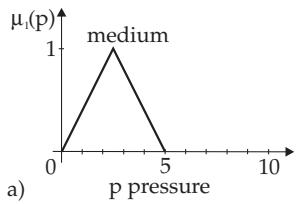
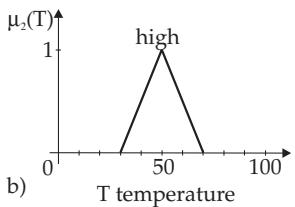
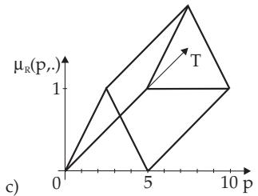
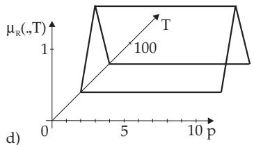
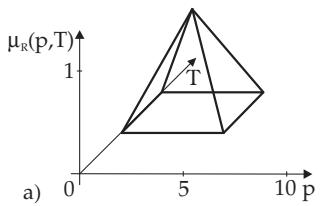
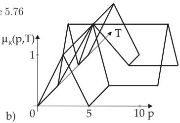

#### 5.9.4 Fuzzy Inference (Approximate Reasoning)

Fuzzy inference is an application of fuzzy relations with the goal of getting fuzzy logical conclusions with respect to vague information (see 5.9.6.3, p. 428). Vague information means here fuzzy information but not uncertain information. Fuzzy inference, also called implication, contains one or more rules, a fact and a consequence. Fuzzy inference, which is called by Zadeh, approximate reasoning, cannot be described by classical logic.

1. Fuzzy Implication, IF THEN Rule

The fuzzy implication contains one IF THEN rule in the simplest case. The IF part is called the premise and it represents the condition. The THEN part is the conclusion. Evaluation happens by $\mu _ { 2 } = \mu _ { 1 } \circ R$ and (5.380).

Interpretation: $\mu _ { 2 }$ is the fuzzy inference image of $\mu _ { 1 }$ under the fuzzy relation R, i.e., a calculation prescription for the IF THEN rule or for a group of rules.

2. Generalized Fuzzy Inference Scheme

The rule $\mathrm { I F } \ A _ { 1 } \ \mathrm { A N D } \ A _ { 2 } \ \mathrm { A N D } \ A _ { 3 } \ldots \ A \mathrm { N D } \ A _ { n }$ THEN B with $A _ { i } \colon \mu _ { i } \colon X _ { i } \to [ 0 , 1 ] ( i = 1 , 2 , \ldots , n )$ and the membership function of the conclusion $B \colon \mu \colon Y  [ 0 , 1 ]$ is described by an $( n + 1 )$ -valued relation

$$
\mathrm { R } \colon { \cal X } _ { 1 } \times { \cal X } _ { 2 } \times \cdots { \cal X } _ { n } \times { \cal Y }  [ 0 , 1 ] .\tag{5.381a}
$$

For the actual input with crisp values $x _ { 1 } ^ { \prime } , x _ { 2 } ^ { \prime } , \ldots , x _ { n } ^ { \prime }$ the rule (5.381a) defines the actual fuzzy output by

$$
\mu _ { B ^ { \prime } } ( y ) = \mu _ { R } ( x _ { 1 } ^ { \prime } , x _ { 2 } ^ { \prime } , \ldots , x _ { n } ^ { \prime } , y ) = \operatorname* { m i n } ( \mu _ { 1 } ( x _ { 1 } ^ { \prime } ) , \mu _ { 2 } ( x _ { 2 } ^ { \prime } ) , \ldots , \mu _ { n } ( x _ { n } ^ { \prime } ) , \mu _ { B } ( y ) ) { \mathrm { ~ w h e r e ~ } } y \in Y . ( x _ { 1 } ^ { \prime } , \mu _ { 2 } , \ldots , x _ { n } ^ { \prime } ) ,\tag{5.381b}
$$

Remark: The quantity min $( \mu _ { 1 } ( x _ { 1 } ^ { \prime } ) , \mu _ { 2 } ( x _ { 2 } ^ { \prime } ) , \dots \mu _ { n } ( x _ { n } ^ { \prime } ) )$ is called the degree of fulfillment, and the quantities $\{ \mu _ { 1 } ( x _ { 1 } ^ { \prime } ) , \mu _ { 2 } ( { \bar { x _ { 2 } ^ { \prime } } } ) , \dots , \mu _ { n } ( { \bar { x _ { n } ^ { \prime } } } ) \}$ represent the fuzzy-valued input quantities.

Forming the fuzzy relations for a connection between the quantities “medium” pressure and “high” temperature (Fig. 5.76): $\tilde { \mu } _ { 1 } ( p , T ) = \mu _ { 1 } ( p ) \forall T \in X _ { 2 }$ with ${ \bar { \mu } } _ { 1 } \colon X _ { 1 } \to [ 0 , 1 ]$ is a cylindrical extension (Fig. 5.76c) of the fuzzy set medium pressure (Fig. 5.76a). Analogously, $\tilde { \mu } _ { 2 } ( p , T ) = \mu _ { 2 } ( T ) \forall p \in$ ${ \dot { X } } _ { 1 }$ with $\mu _ { 2 } : X _ { 2 } \to [ 0 , 1 ]$ is a cylindrical extension (Fig. 5.76d) of the fuzzy set high temperature (Fig. 5.76b), where $\tilde { \mu } _ { 1 } , \tilde { \mu } _ { 2 } \colon G = X _ { 1 } \times X _ { 2 }  [ 0 , 1 ]$

Fig. 5.77a shows the graphic result of the formation of fuzzy relations: In Fig. 5.77b the result of the composition medium pressure AND high temperature with the min operator $\mu _ { R } ( p , T ) = \mathrm { m i n } ( \mu _ { 1 } ( p )$ $\mu _ { 2 } ( { \bar { T } } ) )$ is represented, and (Fig. 5.77b) shows the result of the composition OR with the max operator $\mu _ { R } ( p , T ) = \operatorname* { m a x } ( \mu _ { 1 } ( p ) , \mu _ { 2 } ( T ) )$

Figure 5.76  

  
Figure 5.77
