#### 5.9.6 Knowledge-Based Fuzzy Systems

There are several application possibilities of multi-valued fuzzy logic, based on the unit interval, both in technical and non-technical life. The general concept consists in the fuzzification of quantities and characteristic numbers, in the aggregation them in an appropriate knowledge base with operators, and if necessary, in the defuzzification of the possibly fuzzy result set.

##### 5.9.6.1 Method ofMamdani

The following steps are applied for a fuzzy control process:

1. Rule Base Suppose, for example, for the i-th rule

$\mathrm { R } ^ { i }$ : If e is Ei AND ˙e is $\Delta E ^ { i }$ THEN u is $U ^ { i }$

(5.389)

Here e characterizes the error, ˙e the change of the error and u the change of the (not fuzzy valued) output value. Every quantity is defined on its domain $E , \Delta E$ and U. Let the entire domain be $E \times \Delta E \times U$ The error and the change of the error will be fuzzified on this domain, i.e., they will be represented by fuzzy sets, where linguistic description is used.

2. Fuzzifying Algorithm In general, the error e and its change ˙e are not fuzzy-valued, so they must be fuzzified by a linguistic description. The fuzzy values will be compared with the premisses of the IF THEN rule from the rule base. From this it follows, which rules are active and how large are their weights.

3. Aggregation Module The active rules with their diferent weights will be combined with an algebraic operation and applied to the defuzzification.

4. Decision Module In the defuzzification process a crisp value should be given for the control quantity. With a defuzzification operation, a non-fuzzy-valued quantity is determined from the set of possible values, i.e., a crisp quantity. This quantity expresses how the control parameters of the system should be set up to keep the deviation minimal.

Fuzzy control means that the steps from 1. to 4. are repeated until the goal, the smallest deviation e and its change ˙e, is reached.

##### 5.9.6.2 Method of Sugeno

The Sugeno method is also used for planning of a fuzzy control process. It difers from the Mamdani concept in the rule base and in the defuzzification method. It has the following steps:

1. Rule Base: The rule base consists of rules of the following form:

$R ^ { i }$ : IF $x _ { 1 }$ is $A _ { 1 } ^ { i } \mathrm { \ A N D \ } . . . \mathrm { \ A N D } x _ { k }$ is $A _ { k } ^ { i }$ ,THEN $u _ { i } = p _ { 0 } ^ { i } + p _ { 1 } ^ { i } x _ { 1 } + p _ { 2 } ^ { i } x _ { 2 } + \cdot \cdot \cdot + p _ { k } ^ { i } x _ { k } .$

(5.390)

The notations mean:

$A _ { j }$ : fuzzy sets, which can be determined by membership functions;

$x _ { j } { \mathrm { : } }$ crisp input values as, e.g., the error e and the change of the error $\dot { e } ,$ , which tell us something about the dynamics of the system;

$p _ { j } ^ { i }$ : weights of $\begin{array} { r l } { x _ { j } } & { { } ( j = 1 , 2 , \ldots , k ) } \end{array}$

$u _ { i } \colon$ the output value belonging to the i-th rule $( i = 1 , 2 , \ldots , n )$

2. Fuzzifying Algorithm: $\mathrm { ~ A ~ } \mu _ { i } \in [ 0 , 1 ]$ is calculated for every rule $R ^ { i }$

3. Decision Module: A non-fuzzy-valued quantity is calculated from the weighted mean of $u _ { i }$ , where the weights are $\mu _ { i }$ from the fuzzification:

$$
u = \sum _ { i = 1 } ^ { n } \mu _ { i } u _ { i } \left( \sum _ { i = 1 } ^ { n } \mu _ { i } \right) ^ { - 1 } .\tag{5.391}
$$

Here u is a crisp value.

The defuzzification of the Mamdani method does not work here. The problem is to get the weight parameters $p _ { j } ^ { i }$ available. These parameters can be determined by a mechanical learning method, e.g., by an artificial neuronetwork (ANN).

##### 5.9.6.3 Cognitive Systems

To clarify the method, the following known example will be investigated with the Mamdami method: The regulation of a pendulum that is perpendicular to its moving base (Fig. 5.78). The aim of the control process is to keep a pendulum in balance so that the pendulum rod should stand vertical, i.e., the angular displacement from the vertical direction and the angular velocity should be zero. It must be done by a force F acting at the lower end of the pendulum. This force is the control quantity. The model is based on the activity of a human “control expert” (cognitive problem). The expert formulates its knowledge in linguistic rules. Linguistic rules consist, in general, of a premise, i.e., a specification of the measured values, and a conclusion which gives the appropriate control value.

For every set of values $X _ { 1 } , X _ { 2 } , \ldots , X _ { n }$ for the measured values and $Y$ for the control quantity the appropriate linguistic terms are defined as “approximately zero”, “small positive”, etc. Here “approximately zero” with respect to the measured value $\xi _ { 1 }$ can have a diferent meaning as for the measured value $\xi _ { 2 }$

Inverse Pendulum on a Moving Base (Fig. 5.78)

1. Modeling For the set $X _ { 1 }$ (values of angle) and analogously for the input quantity $X _ { 2 }$ (values of the angular velocity) the seven linguistic terms, negative large (nl), negative medium (nm), negative small (ns), zero $\left( \mathbf { z } \right)$ , positive small (ps), positive medium (pm) and positive large (pl) are chosen.

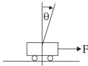

For the mathematical modeling, a fuzzy set must be assigned by graphs to every one of these linguistic terms (Fig. 5.77), as was shown for fuzzy inference (see 5.9.4, p. 425).

Figure 5.78

2. Choice of the Domain of Values

Values of angles: $\theta ( - 9 0 ^ { \circ } < \theta < 9 0 ^ { \circ } ) \colon X _ { 1 } : = [ - 9 0 ^ { \circ } , 9 0 ^ { \circ } ]$

Values of angular velocity: $\dot { \theta } ( - 4 5 ^ { \circ } \mathrm { s } ^ { - 1 } \leq \dot { \theta } \leq 4 5 ^ { \circ } \mathrm { s } ^ { - 1 } ) \colon X _ { 2 } : = [ - 4 5 ^ { \circ } \mathrm { s } ^ { - 1 } , 4 5 ^ { \circ } \mathrm { s } ^ { - 1 } ] .$

Values of force $F \colon ( - 1 0 \mathrm { N } \leq \dot { F } \leq 1 0 \mathrm { N } ) \colon Y : = [ - 1 0 \mathrm { N } , 1 0 \mathrm { N } ]$

The partitioning of the input quantities $X _ { 1 }$ and $X _ { 2 }$ and the output quantity Y is represented graphically in Fig. 5.79. Usually, the initial values are actual measured values, e.g., $\theta = 3 6 ^ { \circ } , \dot { \theta } = - 2 . 2 5 ^ { \circ } \mathrm { s } ^ { - 1 }$

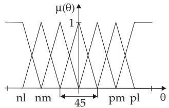  
a)

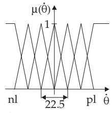  
b)  
Figure 5.79

c)  
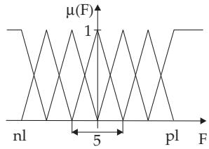

3. Choice of Rules Considering the following table, there are 49 possible rules $( 7 \times 7 )$ but there are only 19 important in practice, so the following two are to be discussed: R1 and R2.

R1: If Θ is positive small (ps) and $\dot { \Theta } \operatorname { z e r o } \left( \operatorname { z } \right)$ , then F is positive small (ps). For the degree offulfillment (also called the weight ofthe rules) of the premise with α = min $\left\{ \mu ^ { ( 1 ) } ( \Theta ) ; \mu ^ { ( 1 ) } ( \dot { \Theta } ) \right\} = \operatorname * { m i n } \{ 0 . 4 ; 0 . 8 \} =$ 0.4 one gets the output set (5.392) by an α cut, hence the output fuzzy set is positive small (ps) in the height $\overset { \cdot } { \alpha } = 0 . 4$ (Fig. 5.80c).

Table: Rule base with 19 practically meaningful rules
<table><tr><td rowspan=1 colspan=1>θ\θ</td><td rowspan=1 colspan=1>nl</td><td rowspan=1 colspan=1>nm</td><td rowspan=1 colspan=1>ns</td><td rowspan=1 colspan=1>Z</td><td rowspan=1 colspan=1>ps</td><td rowspan=1 colspan=1>pm</td><td rowspan=1 colspan=1>pl</td></tr><tr><td rowspan=1 colspan=1>nl</td><td rowspan=1 colspan=1></td><td rowspan=2 colspan=1></td><td rowspan=2 colspan=1>ps</td><td rowspan=2 colspan=1>plpm</td><td rowspan=2 colspan=1></td><td rowspan=2 colspan=1></td><td rowspan=4 colspan=1>pl</td></tr><tr><td rowspan=1 colspan=1>nm</td><td rowspan=1 colspan=1></td></tr><tr><td rowspan=1 colspan=1>ns</td><td rowspan=2 colspan=1>nmnl</td><td rowspan=2 colspan=1>nm</td><td rowspan=2 colspan=1>nsns</td><td rowspan=3 colspan=1>psZns</td><td rowspan=3 colspan=1>psps</td><td rowspan=3 colspan=1>pm</td></tr><tr><td rowspan=1 colspan=1>Z</td></tr><tr><td rowspan=1 colspan=1>ps</td><td rowspan=1 colspan=1></td><td rowspan=1 colspan=1></td><td rowspan=1 colspan=1></td><td rowspan=3 colspan=1></td><td rowspan=3 colspan=1>pm</td></tr><tr><td rowspan=1 colspan=1>pm</td><td rowspan=1 colspan=1></td><td rowspan=1 colspan=1></td><td rowspan=1 colspan=1></td><td rowspan=1 colspan=1>nm</td><td rowspan=2 colspan=1>ns</td></tr><tr><td rowspan=1 colspan=1>pl</td><td rowspan=1 colspan=1></td><td rowspan=1 colspan=1></td><td rowspan=1 colspan=1></td><td rowspan=1 colspan=1>nl</td></tr></table>

$$
\begin{array} { r } { \mu _ { 3 6 ; - 2 . 2 5 } ^ { \mathrm { O u t p u t ( R 1 ) } } ( y ) = \left\{ \begin{array} { l l } { \frac { 2 } { 5 } y } & { \quad 0 \leq y < 1 , } \\ { 0 . 4 } & { \quad 1 \leq y \leq 4 , } \\ { 2 - \frac { 2 } { 5 } y } & { \quad 4 < y \leq 5 , } \\ { 0 } & { \quad \mathrm { o t h e r w i s e } . } \end{array} \right. } \end{array}\tag{5.392}
$$

R2: If Θ is positive medium (pm) and $\dot { \Theta }$ is zero (z), then F is positive medium (pm). For the performance score of the premise follows α = min $\left\{ \mu ^ { ( 2 ) } ( \theta ) ; \mu ^ { ( 2 ) } \dot { \Theta } \right\}$ = min 0.6; $0 . 8 \} = 0 . 6$ , the output set (5.393) analogously to rule R1 (Fig. 5.80f).

$$
\begin{array} { r } { \mu _ { 3 6 ; - 2 . 2 5 } ^ { \mathrm { O u t p u t } ( \mathrm { R } ^ { 2 } ) } ( y ) = \left\{ \begin{array} { l l } { \frac { 2 } { 5 } y - 1 } & { \ : 2 . 5 \leq y < 4 , } \\ { 0 . 6 } & { \ : 4 \leq y \leq 6 , } \\ { 3 - \frac { 2 } { 5 } y } & { \ : 6 < y \leq 7 . 5 , } \\ { 0 } & { \ : \mathrm { o t h e r w i s e } . } \end{array} \right. } \end{array}\tag{5.393}
$$

4. Decision Logic The evaluation of rule $\mathrm { R _ { 1 } }$ with the min operation results in the fuzzy set in Figs. 5.80a–c. The corresponding evaluation for the rule $\mathrm { R _ { 2 } }$ is shown in Figs. 5.80d–f. The control quantity is calculated finally by a defuzzification method from the fuzzy proposition set (Fig. 5.80g). The result is the fuzzy set (Fig. 5.80g) by using the max operation and taking into account the fuzzy sets (Fig. 5.80c) and (Fig. 5.80f).

a) Evaluation of the fuzzy set obtained in this way, which is aggregated by operators (see max-min composition 5.9.3.2, 1., p. 424). The decision logic yields:

$$
\begin{array} { r } { \mu _ { x _ { 1 } , \ldots , x _ { n } } ^ { \mathrm { O u t p u t } } : Y \to [ 0 , 1 ] ; y \to \operatorname* { m a x } _ { \mathrm { r } \in \{ 1 , \ldots , \mathrm { k } \} } \left\{ \operatorname* { m i n } \left\{ \mu _ { i _ { l , r } } ^ { ( 1 ) } ( x _ { 1 } ) , \ldots , \mu _ { i _ { l , r } } ^ { ( n ) } ( x _ { n } ) , \mu _ { i _ { r } } ( y ) \right\} \right\} . } \end{array}\tag{5.394}
$$

b) After taking the maximum (5.395) is obtained for the function graph of the fuzzy set. c) For the other 17 rules results a degree of fulfillment equal to zero for the premise, i.e., it results in fuzzy sets, which are zeros themselves. 5. Defuzzification The decision logic yields no crisp value for the control quantity, but a fuzzy set. That means, by this method, one gets a mapping, which assigns a fuzzy set $\mu _ { x _ { 1 } , \dots , x _ { n } } ^ { \mathrm { O u t p u t } }$ of Y to every tuple $( x _ { 1 } , \ldots , x _ { n } ) \in X _ { 1 } \times$ ${ \bar { X _ { 2 } } } \times \cdots \times X _ { n }$ of the measured values.

$$
\begin{array} { r } { \mu _ { 3 6 ; - 2 . 2 5 } ^ { \mathrm { O u t p u t } } ( y ) = \left\{ \begin{array} { l l } { \frac { 2 } { 5 } y } & { \mathrm { f o r } \quad 0 \leq y < 1 , } \\ { 5 } & { \mathrm { f o r } \quad 1 \leq y < 3 . 5 , } \\ { 0 . 4 } & { \mathrm { f o r } \quad 3 . 5 \leq y < 4 , } \\ { \frac { 2 } { 5 } y - 1 \mathrm { f o r } \quad 3 . 5 \leq y < 4 , } \\ { 0 . 6 } & { \mathrm { f o r } \quad 4 \leq y < 6 , } \\ { 0 . 6 } & { \mathrm { f o r } \quad 6 \leq y \leq 7 . 5 , } \\ { 3 - \frac { 2 } { 5 } y \mathrm { f o r } } & { 6 \leq y \leq 7 . 5 , } \\ { 0 } & { \mathrm { f o r } \quad \mathrm { o t h e r w i s e } . } \end{array} \right. } \end{array}\tag{5.395}
$$

Defuzzification means that there is to determine a control quantity using defuzzification methods. The center of gravity method and the maximum criterion method result in the value for control quantity F = 3.95 or $\bar { F } = 5 . 0$

e)  
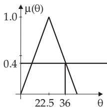  
positive smalla)

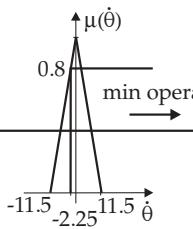  
b)

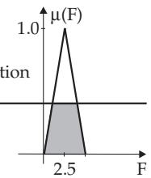  
positive smallc)

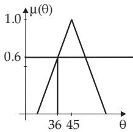  
d) positive medium

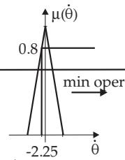

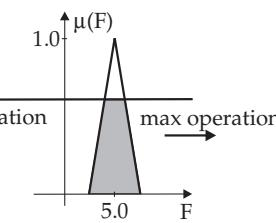  
positive mediumf)

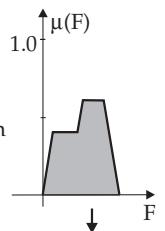  
g) control quantity  
Figure 5.80

6. Remarks

1. The “knowledge-based” trajectories should lie in the rule base so that the endpoint is in the center of the smallest rule deviation.

2. By defuzzification an iteration process is introduced, which leads finally to the center of the partition space, i.e., which results in a zero control quantity.

3. Every non-linear domain of characteristics can be approximated with arbitrary accuracy by the choice of appropriate parameters on a compact domain.

##### 5.9.6.4 Knowledge-Based Interpolation Systems

1. Interpolation Mechanism

Interpolation mechanisms can be built up with the help of fuzzy logic. Fuzzy systems are systems

to process fuzzy information. With them it is possible to approximate and interpolate functions. A simple fuzzy system, by which this property can be investigated , is the Sugeno controller. It has n input variables $\xi _ { 1 } , \ldots , \xi _ { n }$ and defines the value of the output variable $y$ by rules $\mathrm { R } _ { 1 } , \ldots , \mathrm { R } _ { n }$ in the form

$$
\mathrm { R } _ { i } \colon \ \mathrm { I F } \xi _ { 1 } \mathrm { \ i s ~ } A _ { 1 } ^ { ( i ) } \ \mathrm { a n d } \ \cdots \ \mathrm { a n d } \xi _ { n } \mathrm { \ i s } \ A _ { n } ^ { ( i ) } , \mathrm { T H E N \ i s } \ y = f _ { i } ( \xi _ { 1 } , \ldots , \xi _ { n } ) \quad ( i = 1 , 2 , \ldots , n ) .\tag{5.396}
$$

The fuzzy sets $A _ { j } ^ { ( 1 ) } , \ldots , A _ { j } ^ { ( k ) }$ always partition the input sets $X _ { j }$ . The conclusions $f _ { i } ( \xi _ { 1 } , \dots , \xi _ { n } )$ of the rules are singletons, which can depend on the input variables $\bar { \xi _ { 1 } } , \ldots , \xi _ { n }$

By a simple choice of the conclusions the expensive defuzzification can be omitted and the output value y will be calculated as a weighted sum. To do this, the controller calculates a degree of fulfillment $\alpha _ { i }$ for every rule $\mathrm { R } _ { i }$ with a t norm from the membership grades of the single inputs and determines the output value

$$
y = \frac { \sum _ { i = 1 } ^ { N } \alpha _ { i } f _ { i } ( \xi _ { 1 } , \dots , \xi _ { n } ) } { \sum _ { i = 1 } ^ { N } \alpha _ { i } } .\tag{5.397}
$$

2. Restriction to the One-Dimensional Case

For fuzzy systems with only one input $x = \xi _ { 1 }$ , fuzzy sets represented by triangular functions are often used which are cut at the height 0.5. Such fuzzy sets satisfy the following three conditions:

1. For every rule $\mathrm { R } _ { i }$ there is an input $x _ { i } ,$ , for which only one rule is fulfilled. For this input $x _ { i } ,$ , the output is calculated by $f _ { i } .$ By this, the output of the fuzzy system is fixed at N nodes $x _ { 1 } , \ldots , x _ { N }$ . Actually, the fuzzy system interpolates the nodes $x _ { 1 } , \ldots , x _ { N }$ . The requirement that at the node $x _ { i }$ only one rule $\mathrm { R } _ { i }$ holds, is suficient for an exact interpolation, but it is not necessary. For two rules $\mathrm { R _ { 1 } }$ and $\mathrm { R _ { 2 } }$ , as they will be considered below, this requirement means that $\alpha _ { 1 } ( x _ { 2 } ) = \dot { \alpha } _ { 2 } ( x _ { 1 } ) = 0$ holds. To fulfill the first condition, $\alpha _ { 1 } ( x _ { 2 } ) = \alpha _ { 2 } ( x _ { 1 } ) = 0$ must hold. This is a suficient condition for an exact interpolation of the nodes.

2. There are at most two rules fulfilled between two consecutive nodes. If $x _ { 1 }$ and $x _ { 2 }$ are two such nodes with rules $\mathrm { R _ { 1 } }$ and $\mathrm { R _ { 2 } }$ , then for inputs $x \in [ x _ { 1 } , x _ { 2 } ]$ the output $y$ is

$$
y = { \frac { \alpha _ { 1 } ( x ) f _ { 1 } ( x ) + \alpha _ { 2 } ( x ) f _ { 2 } ( x ) } { \alpha _ { 1 } ( x ) + \alpha _ { 2 } ( x ) } } = f _ { 1 } ( x ) + g ( x ) \left[ f _ { 2 } ( x ) - f _ { 1 } ( x ) \right] { \mathrm { ~ w i t h ~ } } g : = { \frac { \alpha _ { 2 } ( x ) } { \alpha _ { 1 } ( x ) + \alpha _ { 2 } ( x ) } } .\tag{5.398}
$$

The actual shape of the interpolation curve between $x _ { 1 }$ and $x _ { 2 }$ is determined by the function $g .$ The shape depends only on the satisfaction grades $\alpha _ { 1 }$ and α , which are the values of the membership functions $\mu _ { _ { A _ { i } ^ { ( 1 ) } } }$ and ${ \mu } _ { A _ { i } ^ { ( 2 ) } }$ at the point x, i.e., $\alpha _ { 1 } = \mu _ { A ^ { ( 1 ) } } ( x )$ and $\alpha _ { 2 } = \mu _ { A ^ { ( 2 ) } } ( x )$ are valid, or in short form $\alpha _ { 1 } = \mu _ { 1 } ( x )$ and $\alpha _ { 2 } = \mu _ { 2 } ( x )$ . The shape of the curve depends only on the relation $\mu _ { 1 } / \mu _ { 2 }$ of the membership functions.

3. The membership functions are positive, so the output y is a convex combination of the conclusions $f _ { i } .$ For the given and for the general case hold (5.399) and (5.400), respectively:

$$
\operatorname* { m i n } ( f _ { 1 } , f _ { 2 } ) \leq y \leq \operatorname* { m a x } ( f _ { 1 } , f _ { 2 } ) ,
$$

$$
\operatorname* { m i n } _ { i \epsilon \{ 1 , 2 , . . . , N \} } f _ { i } \leq y \leq _ { i \epsilon \{ 1 , 2 , . . . , N \} } f _ { i } .\tag{5.400}
$$

For constant conclusions, the terms $f _ { 1 }$ and $f _ { 2 }$ cause only a translation and stretching of the shape of the curve $g .$ If the conclusions are dependent on the input variables, then the shape of the curve is diferently perturbed in diferent sections. Consequently, another output function can be found.

Applying linearly dependent conclusions and membership functions with constant sum for the input $x ,$ then the output is $y = c \sum _ { i = 1 } ^ { N } \alpha _ { i } ( x ) f _ { i } ( x )$ with $\alpha _ { i }$ depending on x and a constant $c ,$ so that the interpolation functions are polynomials of second degree. These polynomials can be used for the construction of an interpolation method with polynomials of second degree.

In general, choosing polynomials of n-th degree, an interpolation polynomial of $( n + 1 )$ -th degree is obtained as a conclusion. In this sense fuzzy systems are rule-based interpolation systems besides conventional interpolation methods interpolating locally by polynomials, e.g., with splines.
