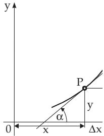
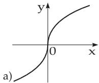
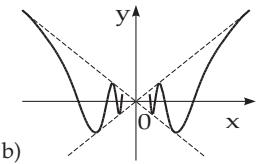
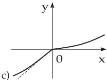
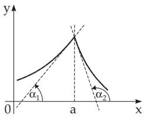

### 6.1 Differentiation of Functions of One Variable

1. Diferential Quotient or Derivative of a Function

The diferential quotient of a function $y = f ( x )$ at $x _ { 0 }$ is equal to $\operatorname* { l i m } _ { \Delta x \to 0 } { \frac { f ( x _ { 0 } + \Delta x ) - f ( x _ { 0 } ) } { \Delta x } }$ if this limit exists and is finite. The derivative function of a function $y = f ( x )$ with respect to the variable x is another function of x denoted by the symbols $y ^ { \prime } , \dot { y } , D y , \frac { d y } { d x } , f ^ { \prime } ( x ) , D f ( x ) , \mathrm { o r } \frac { d f ( x ) } { d x }$ , and its value for every x is equal to the limit of the quotient of the increment of the function $\Delta y$ and the corresponding increment $\Delta x$ for $\Delta x  0 .$ if this limit exists:

  
Figure 6.1

$$
f ^ { \prime } ( x ) = \operatorname* { l i m } _ { \Delta x \to 0 } { \frac { f ( x + \Delta x ) - f ( x ) } { \Delta x } } .\tag{6.1}
$$

2. Geometric Representation of the Derivative If $y = f ( x )$ is represented as a curve in a Cartesian coordinate system as in Fig. 6.1, and if the x-axis and the y-axis have the same unit, then

$$
f ^ { \prime } ( x ) = \tan \alpha\tag{6.2}
$$

is valid. The angle α between the x-axis and the tangent line of the curve at the considered point defines the angular coeficient or slope ofthe tangent (see 3.6.1.2, 2., p. 245). The angle is measured from the positive x-axis to the tangent in a counterclockwise direction, and it is called the angle ofslope or angle ofinclination.

3. Diferentiability

From the definition of the derivative it obviously follows that $f ( x )$ is diferentiable with respect to x for the values of x where the diferential quotient (6.1) has a finite value. The domain of the derivative function is a subset (proper or trivial) of the domain of the original function. If the function is continuous at x but the derivative does not exist, then perhaps there is no determined tangent line at that point, or the tangent line is perpendicular to the x-axis. In this last case the limit in (6.1) is infinity. For this case is used the notation $f ^ { \prime } ( x ) = +$ or .

  
Figure 6.2 igu

A: $f ( x ) = { \sqrt [ 3 ] { x } } \colon f ^ { \prime } ( x ) = { \frac { 1 } { 3 { \sqrt [ 3 ] { x ^ { 2 } } } } } , \ f ^ { \prime } ( 0 ) = \infty$ . At the point 0 the limit (6.1) tends to infinity, so the derivative does not exist at the point 0 (Fig. 6.2a).

B: $f ( x ) = x \sin { \frac { 1 } { x } } { \mathrm { ~ f o r ~ } } x \neq 0$ . At the point $x = 0$ the function $f ( x )$ is not defined, but it has zero limit, so one writes $f ( 0 ) = 0$ . However the limit (6.1) does not exist at $x = 0 \ ( \mathbf { F i g } . 6 . 2 \mathbf { b } )$

\- Springer-Verlag Berlin Heidelberg 2015 I.N. Bronshtein et al., Handbook of Mathematics, DOI 10.1007/978-3-662-46221-8\_6

4. Left-Hand and Right-Hand Diferentiability

  
Figure 6.3

If the limit (6.1) does not exist for a value $x = a$ , but the left-hand limit or the right-hand limit exists, this limit is called the left-hand derivative or right-hand derivative respectively. If both exist, the curve has two tangents here:

$$
f ^ { \prime } ( a - 0 ) = \tan \alpha _ { 1 } , \qquad f ^ { \prime } ( a + 0 ) = \tan \alpha _ { 2 } .\tag{6.3}
$$

Geometrically this means that the curve has a knee (Fig. 6.2c, Fig. 6.3).

${ \overline { { \mathbf { \alpha } } } } \operatorname { f } ( x ) = { \frac { x } { 1 + e ^ { \frac { 1 } { x } } } }$ for $x \neq 0$ . For $x = 0$ the function is not defined,

but it has zero limit at $x = 0$ , so one writes $f ( x ) = 0 ,$ . At the point

$x = 0$ there is no limit of type (6.1), but there is a left-hand and a right-hand limit $f ^ { \prime } ( - 0 ) = 1$ and $f ^ { \prime } ( + 0 ) = 0 , \mathrm { i . e . }$ ., the curve has a knee here (Fig. 6.2c).

#### 本节包含的小节

- [6.1.1 Differential Quotient](<6.1.1 Differential Quotient.md>)
- [6.1.2 Rules of Differentiation for Functions of One Variable](<6.1.2 Rules of Differentiation for Functions of One Variable.md>)
- [6.1.3 Derivatives ofHigher Order](<6.1.3 Derivatives ofHigher Order.md>)
- [6.1.4 Fundamental Theorems of Differential Calculus](<6.1.4 Fundamental Theorems of Differential Calculus.md>)
- [6.1.5 Determination of the Extreme Values and Inflection Points](<6.1.5 Determination of the Extreme Values and Inflection Points.md>)
