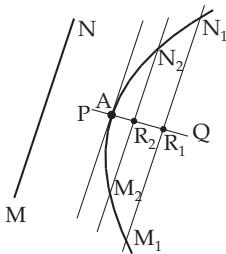
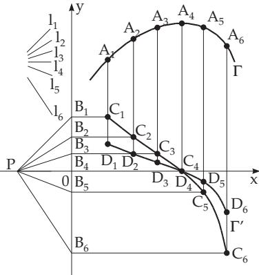

#### 6.1.2 Rules of Differentiation for Functions of One Variable

##### 6.1.2.1 Derivatives of the Elementary Functions

The elementary functions have a derivative on all their domains except perhaps some points, as represented in Fig. 6.2.

A summary of the derivatives of elementary functions can be found in Table 6.1. Further derivatives of elementary functions can be found by reversing the results of the indefinite integrals in Table 8.1.

Remark: In practice, it is often useful to transform the function into a more convenient form to perform diferentiation, e.g., to transform it into a sum where parentheses are removed (see 1.1.6.1, p. 11) or to separate the integral rational part of the expression (see 1.1.7, p. 14) or to take the logarithm of the expression (see 1.1.4.3, p. 9).

$$
\begin{array} { l } { { \mathrm {  ~ { \cal ~ A } : } y = \displaystyle \frac { 2 - 3 \sqrt { x } + 4 \sqrt { \overline { { x } } } + x ^ { 2 } } { x } = \displaystyle \frac { 2 } { x } - 3 x ^ { - \frac { 1 } { 2 } } + 4 x ^ { - \frac { 2 } { 3 } } + x ; \displaystyle \frac { d y } { d x } = - 2 x ^ { - 2 } + \frac { 3 } { 2 } x ^ { - \frac { 3 } { 2 } } - \frac { 8 } { 3 } x ^ { - \frac { 5 } { 3 } } + 1 . } } \\ { { \mathrm {  ~ { \cal ~ B } : } y = \displaystyle \ln \sqrt \frac { x ^ { 2 } + 1 } { x ^ { 2 } - 1 } = \displaystyle \frac { 1 } { 2 } \ln ( x ^ { 2 } + 1 ) - \frac { 1 } { 2 } \ln ( x ^ { 2 } - 1 ) ; \displaystyle \frac { d y } { d x } = \displaystyle \frac { 2 x } { 2 } \left( \frac { 2 x } { x ^ { 2 } + 1 } \right) - \displaystyle \frac { 1 } { 2 } \left( \frac { 2 x } { x ^ { 2 } - 1 } \right) = - \displaystyle \frac { 2 x } { x ^ { 4 } - 1 } . } } \end{array}
$$

##### 6.1.2.2 Basic Rules of Differentiation

Assume $u , v , w$ , and y are functions of the independent variable x, and $u ^ { \prime } , v ^ { \prime } , w ^ { \prime }$ , and $y ^ { \prime }$ are the derivatives with respect to x. The diferential is denoted by du, dv, dw, and dy (see 6.2.1.3, p. 446). The basic rules of diferentiation, which are explained separately, are summarized in Table 6.2, p. 439.

1. Derivative of a Constant Function

The derivative of a constant function c is the zero function:

$$
c ^ { \prime } = 0 .\tag{6.4}
$$

2. Derivative of a Scalar Multiple

A constant factor c can be factored out from the diferential sign:

$$
( c u ) ^ { \prime } = c u ^ { \prime } , \quad d ( c u ) = c d u .\tag{6.5}
$$

3. Derivative of a Sum

If the functions u, v, w, etc. are diferentiable one by one, their sum and diference is also diferentiable, and equal to the sum or diference of the derivatives:

$$
( u + v - w ) ^ { \prime } = u ^ { \prime } + v ^ { \prime } - w ^ { \prime } ,\tag{6.6a}
$$

$$
d ( u + v - w ) = d u + d v - d w .\tag{6.6b}
$$

It is possible that the summands are not diferentiable separately, but their sum or diference is. Then the derivative must be calculated by definition formula (6.1).

Table 6.1 Derivatives of elementary functions in the intervals on which they are defined and the occurring numerators are not equal to zero
<table><tr><td>Function</td><td>Derivative</td><td>Function</td><td>Derivative</td></tr><tr><td>C (constant)</td><td>0</td><td>sec x</td><td>sin x  $\overline { { \cos ^ { 2 } x } }$ </td></tr><tr><td>x</td><td>1</td><td>cosec x</td><td> $- \cos x$ </td></tr><tr><td> $x ^ { n } \left( n \in \mathbb { R } \right)$ </td><td> $n x ^ { n - 1 }$ </td><td>arcsin x (|x| &lt; 1)</td><td> $\overline { { \sin _ { 1 } ^ { 2 } x } }$ </td></tr><tr><td> $\frac { 1 } { x } \quad ( x \neq 0 )$ </td><td> $- { \frac { 1 } { x ^ { 2 } } } \ \left( x \neq 0 \right)$ </td><td> $\operatorname { a r c c o s } x ( | x | < 1 )$ </td><td> $\overline { { \sqrt { 1 - x ^ { 2 } } } }$ </td></tr><tr><td></td><td></td><td></td><td> $- { \frac { 1 } { \sqrt { 1 - x ^ { 2 } } } }$ </td></tr><tr><td> ${ \frac { 1 } { x ^ { n } } } \ \left( x \neq 0 \right)$ </td><td> $- { \frac { n } { x ^ { n + 1 } } }$ </td><td>arctan x</td><td> $\frac { 1 } { 1 + x ^ { 2 } }$ </td></tr><tr><td> $\sqrt { x } \left( x > 0 \right)$ </td><td> $\frac { 1 } { 2 { \sqrt { x } } }$ </td><td>arccot x</td><td> $- { \frac { 1 } { 1 + x ^ { 2 } } }$ </td></tr><tr><td> ${ \sqrt [ n ] { x } } \ ( n \in \mathbb { R } , \ n \not = 0 , \ x > 0 )$ </td><td> $\frac { 1 } { n { \sqrt [ n ] { x ^ { n - 1 } } } }$ </td><td> $\operatorname { a r c s e c } x \ ( x > 1 )$ </td><td> $\frac { 1 } { x { \sqrt { x ^ { 2 } - 1 } } }$ </td></tr><tr><td> $e ^ { x }$ </td><td> $e ^ { x }$ </td><td> $\operatorname { a r c c o s e c } x \ ( x > 1 )$ </td><td> $\overline { { x \sqrt { x ^ { 2 } - 1 } } }$ </td></tr><tr><td> $e ^ { b x } ( b \in \mathbb { R } )$ </td><td> $ b e ^ { b x }$ </td><td>sinh x</td><td>cosh x</td></tr><tr><td> $a ^ { x } ( a > 0 )$ </td><td> $a ^ { x } \ln a$ </td><td>cosh x</td><td>sinh x</td></tr><tr><td> $a ^ { b x } ( b \in \mathbb { R } , \ a > 0 )$ </td><td> $b a ^ { b x } \ln a$ </td><td>tanh x</td><td> $\frac { 1 } { \cosh ^ { 2 } x }$ </td></tr><tr><td>ln x (x &gt; 0)</td><td>1-a</td><td> $\operatorname { c o t h } x \ \left( x \neq 0 \right)$ </td><td> $- { \frac { 1 } { \sinh ^ { 2 } x } }$ </td></tr><tr><td> $\log _ { a } x \ ( a > 0 , a \neq 1 , x > 0 )$ </td><td> ${ \frac { 1 } { x } } \log _ { a } e = { \frac { 1 } { x \ln a } }$ </td><td>Arsinh x</td><td> $\frac { 1 } { \sqrt { 1 + x ^ { 2 } } }$ </td></tr><tr><td> $\lg x \left( x > 0 \right)$ </td><td> $\frac { 1 } { x } \lg e \approx \frac { 0 . 4 3 4 3 } { x }$ </td><td> $\operatorname { A r c o s h } x ( x > 1 )$ </td><td> $\frac { 1 } { \sqrt { x ^ { 2 } - 1 } \ }$ </td></tr><tr><td>sin x</td><td>COS x</td><td> ${ \mathrm { A r t a n h } } x ( | x | < 1 )$ </td><td> $\frac { 1 } { 1 - x ^ { 2 } }$ </td></tr><tr><td>COS x</td><td> $- \sin x$ </td><td> $\operatorname { A r c o t h } x ( | x | > 1 )$ </td><td> $- { \frac { 1 } { x ^ { 2 } - 1 } }$ </td></tr><tr><td> $( x \neq ( 2 k + 1 ) \frac { \pi } { 2 } , k \in \mathbb { Z } )$  tan x</td><td> ${ \frac { 1 } { \cos ^ { 2 } x } } = \sec ^ { 2 } x$ </td><td> $[ f ( x ) ] ^ { n } ( n \in \mathbb { R } )$ </td><td></td></tr><tr><td></td><td></td><td></td><td> $\frac { f ^ { \prime } ( x ) } { f ( x ) }$ </td></tr><tr><td>cot x  $( x \neq k \pi , \ k \in \mathbb { Z } )$ </td><td> ${ \frac { - 1 } { \sin ^ { 2 } x } } = - \sec ^ { 2 } x$ </td><td> $\ln f ( x ) \quad ( f ( x ) > 0 )$ </td><td> $n [ f ( x ) ] ^ { n - 1 } f ^ { \prime } ( x )$ </td></tr></table>

4. Derivative of a Product

If two, three, or n functions are diferentiable one by one, then their product is diferentiable, and can be calculated as follows:

a) Derivative of the Product of Two Functions:

$$
( u v ) ^ { \prime } = u ^ { \prime } v + u v ^ { \prime } , \quad d ( u v ) = v d u + u d v .\tag{6.7a}
$$

It is possible that the terms are not diferentiable separately, but their product is. Then the derivative must be calculated by definition formula (6.1).

b) Derivative of the Product of Three Functions:

$$
\begin{array} { r } { \left( u v w \right) ^ { \prime } = u ^ { \prime } v w + u v ^ { \prime } w + u v w ^ { \prime } , \quad d ( u v w ) = v w d u + u w d v + u v d w . } \end{array}\tag{6.7b}
$$

c) Derivative of the Product of n Functions:

$$
( u _ { 1 } u _ { 2 } \cdot \cdot \cdot u _ { n } ) ^ { \prime } = \sum _ { i = 1 } ^ { n } u _ { 1 } u _ { 2 } \cdot \cdot \cdot u _ { i } ^ { \prime } \cdot \cdot \cdot u _ { n } .\tag{6.7c}
$$

A: $y = x ^ { 3 }$ cos x, $y ^ { \prime } = 3 x ^ { 2 }$ cos $x - x ^ { 3 }$ sin x.

B: $y = x ^ { 3 } e ^ { x } \cos x , \quad y ^ { \prime } = 3 x ^ { 2 } e ^ { x } \cos x + x ^ { 3 } e ^ { x } \cos x - x ^ { 3 } e ^ { x } \sin x$

5. Derivative of a Quotient

If both u and v are diferentiable, and $v ( x ) \neq 0$ , their ratio is also diferentiable:

$$
\begin{array} { r l } { \displaystyle \left( \frac { u } { v } \right) ^ { \prime } = \frac { v u ^ { \prime } - u v ^ { \prime } } { v ^ { 2 } } , \quad \displaystyle d \left( \frac { u } { v } \right) = \frac { v d u - u d v } { v ^ { 2 } } . } & { } \\ { \displaystyle y = \tan x = \frac { \sin x } { \cos x } , \quad \displaystyle y ^ { \prime } = \frac { ( \cos x ) ( \sin x ) ^ { \prime } - ( \sin x ) ( \cos x ) ^ { \prime } } { \cos ^ { 2 } x } = \frac { \cos ^ { 2 } x + \sin ^ { 2 } x } { \cos ^ { 2 } x } = \frac { 1 } { \cos ^ { 2 } x } . } & { } \end{array}\tag{6.8}
$$

6. Chain Rule

The composite function (see 2.1.5.5, 2., p. 61) $y = u ( v ( x ) )$ has the derivative

$$
{ \frac { d y } { d x } } = u ^ { \prime } ( v ) v ^ { \prime } ( x ) = { \frac { d u } { d v } } { \frac { d v } { d x } } ,\tag{6.9}
$$

where the functions $u = u ( v )$ and $v = v ( x )$ must be diferentiable functions with respect to their own variables. $u ( v )$ is called the exterior function, and $v ( x )$ is called the interior function. According to this, $\frac { d u } { d v }$ is the exterior derivative and $\frac { d v } { d x }$ is the interior derivative. It is possible that the functions u and v are not diferentiable separately, but the composite function is. Then one gets the derivative by the definition formula (6.1).

Similarly one has to proceed if there is a longer $\mathrm { ^ { 4 } c h a i n ^ { 3 } , i . e . }$ , in the case of a composite function of several intermediate variables. For example for $y = u ( v ( w ( x ) ) )$ :

$$
y ^ { \prime } = { \frac { d y } { d x } } = { \frac { d u } { d v } } { \frac { d v } { d w } } { \frac { d w } { d x } } .\tag{6.10}
$$

$$
\mathbf { A } \colon y = e ^ { \sin ^ { 2 } x } , \quad { \frac { d y } { d x } } = { \frac { d \left( e ^ { \sin ^ { 2 } x } \right) } { d \left( \sin ^ { 2 } x \right) } } { \frac { d \left( \sin ^ { 2 } x \right) } { d \left( \sin x \right) } } { \frac { d \left( \sin x \right) } { d x } } = e ^ { \sin ^ { 2 } x } 2 \sin x \cos x .
$$

$$
\mathbf { B } \colon y = e ^ { \tan { \sqrt { x } } } ; { \frac { d y } { d x } } = { \frac { d \left( e ^ { \tan { \sqrt { x } } } \right) } { d \left( \tan { \sqrt { x } } \right) } } { \frac { d \left( \tan { \sqrt { x } } \right) } { d \left( { \sqrt { x } } \right) } } { \frac { d \left( { \sqrt { x } } \right) } { d x } } = e ^ { \tan { \sqrt { x } } } { \frac { 1 } { \cos ^ { 2 } { \sqrt { x } } } } { \frac { 1 } { 2 { \sqrt { x } } } } .
$$

7. Logarithmic Diferentiation

If $y ( x ) > 0$ holds, one can calculate the derivative y starting with the function ln $y ( x )$ , whose derivative (considering the chain rule) is

$$
\frac { d ( \ln y ( x ) ) } { d x } = \frac { 1 } { y ( x ) } y ^ { \prime } .\tag{6.11}
$$

From this rule

$$
y ^ { \prime } = y ( x ) { \frac { d ( \ln y ( x ) ) } { d x } }\tag{6.12}
$$

follows.

Remark 1: With the help of logarithmic diferentiation it is possible to simplify some diferentiation problems, and there are functions such that this is the only way to calculate the derivative, for instance, when the function has the form

$$
y = u ( x ) ^ { v ( x ) } \mathrm { ~ w i t h ~ } u ( x ) > 0 .\tag{6.13}
$$

The logarithmic diferentiation of this equality follows from the formula (6.12)

$$
y ^ { \prime } = y { \frac { d \left( \ln u ^ { v } \right) } { d x } } = y { \frac { d ( v \ln u ) } { d x } } = u ^ { v } \left( v ^ { \prime } \ln u + { \frac { v u ^ { \prime } } { u } } \right) .\tag{6.14}
$$

$$
y = ( 2 x + 1 ) ^ { 3 x } , \ln y = 3 x \ln ( 2 x + 1 ) , \quad { \frac { y ^ { \prime } } { y } } = 3 \ln ( 2 x + 1 ) + { \frac { 3 x \cdot 2 } { 2 x + 1 } } ;
$$

$$
y ^ { \prime } = 3 \left( 2 x + 1 \right) ^ { 3 x } \Bigl ( \ln ( 2 x + 1 ) + \frac { 2 x } { 2 x + 1 } \Bigr ) .
$$

Remark 2: Logarithmic diferentiation is often used in the case to diferentiate a product of several functions.

$$
\equiv { \mathrm { A } } { \mathrm { : } } \quad y = { \sqrt { x ^ { 3 } e ^ { 4 x } \sin { x } } } , \quad \ln y = { \frac { 1 } { 2 } } ( 3 \ln x + 4 x + \ln \sin x ) ,
$$

$$
{ \frac { y ^ { \prime } } { y } } = { \frac { 1 } { 2 } } \left( { \frac { 3 } { x } } + 4 + { \frac { \cos x } { \sin x } } \right) , \quad y ^ { \prime } = { \frac { 1 } { 2 } } { \sqrt { x ^ { 3 } e ^ { 4 x } \sin x } } \left( { \frac { 3 } { x } } + 4 + \cot x \right) .
$$

B: $y = u v , \quad \ln y = \ln u + \ln v , \quad { \frac { y ^ { \prime } } { y } } = { \frac { 1 } { u } } u ^ { \prime } + { \frac { 1 } { v } } v ^ { \prime } .$ . From this identity it follows that $y ^ { \prime } = ( u v ) ^ { \prime } =$ $\boldsymbol { v } \boldsymbol { u } ^ { \prime } + \boldsymbol { u } \boldsymbol { v } ^ { \prime } ,$ so one gets the formula for the derivative of a product (6.7a) (under the assumption $u , v > 0 )$ C: $y = \frac { u } { v } , \ln y = \ln u - \ln v , \frac { y ^ { \prime } } { y } = \frac { 1 } { u } u ^ { \prime } - \frac { 1 } { v } v ^ { \prime } .$ From this identity it follows that $y ^ { \prime } = \left( { \frac { u } { v } } \right) ^ { \prime } =$ ${ \frac { u ^ { \prime } } { v } } - { \frac { u v ^ { \prime } } { v ^ { 2 } } } = { \frac { v u ^ { \prime } - u v ^ { \prime } } { v ^ { 2 } } }$ , which is the formula for the derivative of a quotient (6.8) (under the assumption $u , v > 0 )$

8. Derivative of the Inverse Function

If $y = \varphi ( x )$ is the inverse function of the original function $y = f ( x )$ , then both forms $y = f ( x )$ and $x = \varphi ( y )$ are equivalent. For every corresponding value of x and y such that f is diferentiable with respect to $x ,$ and $\varphi$ is diferentiable with respect to $y , \mathrm { e . g . }$ , none of the derivatives is equal to zero, between the derivatives of $f$ and its inverse function $\varphi$ is valid the following relation:

$$
f ^ { \prime } ( x ) = { \frac { 1 } { \varphi ^ { \prime } ( y ) } } \quad { \mathrm { o r } } \quad { \frac { d y } { d x } } = { \frac { 1 } { \frac { d x } { d y } } } .\tag{6.15}
$$

The function $y = f ( x ) = \arcsin x { \mathrm { f o r } } - 1 < x < 1$ is equivalent to the function $x = \varphi ( y ) = \sin y$ for $- \pi / 2 < y < \pi / 2$ . From (6.15) it follows that

$( \arcsin x ) ^ { \prime } = { \frac { 1 } { ( \sin y ) ^ { \prime } } } = { \frac { 1 } { \cos y } } = { \frac { 1 } { \sqrt { 1 - \sin ^ { 2 } y } } } = { \frac { 1 } { \sqrt { 1 - x ^ { 2 } } } }$ , because cos y $\neq 0$ for $- \pi / 2 < y < \pi / 2$

9. Derivative of an Implicit Function

Suppose the function $y = f ( x )$ is given in implicit form by the equation $F ( x , y ) = 0$ . Considering the rules of diferentiation for functions of several variables (see 6.2, p. 445) calculating the derivative with respect to x gives

$$
{ \frac { \partial F } { \partial x } } + { \frac { \partial F } { \partial y } } y ^ { \prime } = 0 \quad { \mathrm { a n d ~ s o } } \quad y ^ { \prime } = - { \frac { F _ { x } } { F _ { y } } } ,\tag{6.16}
$$

if the partial derivative $F _ { y }$ difers from zero.

The equation ${ \frac { x ^ { 2 } } { a ^ { 2 } } } + { \frac { y ^ { 2 } } { b ^ { 2 } } } = 1$ of an ellipse with semi-axes a and b can be written in the form $F ( x , y ) =$ ${ \frac { x ^ { 2 } } { a ^ { 2 } } } + { \frac { y ^ { 2 } } { b ^ { 2 } } } - 1 = 0$ . For the slope of the tangent line at the point of the ellipse $( x , y )$ one gets according to (6.16)

$$
y ^ { \prime } = - { \frac { 2 x } { a ^ { 2 } } } \Big / { \frac { 2 y } { b ^ { 2 } } } = - { \frac { b ^ { 2 } } { a ^ { 2 } } } { \frac { x } { y } } .
$$

10. Derivative of a Function Given in Parametric Form   
If a function $y = f ( x )$ is given in parametric form $x = x ( t ) , y = y ( t )$ , then the derivative $y ^ { \prime }$ can be   
calculated by the formula

$$
{ \frac { d y } { d x } } = f ^ { \prime } ( x ) = { \frac { \dot { y } } { \dot { x } } }\tag{6.17}
$$

with the help of the derivatives ${ \dot { y } } ( t ) = { \frac { d y } { d t } } { \mathrm { ~ a n d ~ } } { \dot { x } } ( t ) = { \frac { d x } { d t } }$ with respect to the variable $t ,$ if of course $\dot { { \boldsymbol x } } ( t ) \neq 0$ holds.

Polar Coordinate Representation: If a function is given with polar coordinates (see 3.5.2.2, 3., p. 192) $\rho = \rho ( \varphi )$ , then the parametric form is

$$
x = \rho ( \varphi ) \cos \varphi , \quad y = \rho ( \varphi ) \sin \varphi\tag{6.18}
$$

with the angle $\varphi$ as a parameter. For the slope $y ^ { \prime }$ of the tangent of the curve (see 3.6.1.2, 2., p. 245 or 6.1.1, 2., p. 432) one gets from (6.17)

$$
y ^ { \prime } = { \frac { { \dot { \rho } } \sin \varphi + \rho \cos \varphi } { { \dot { \rho } } \cos \varphi - \rho \sin \varphi } } \quad { \mathrm { w h e r e ~ } } { \dot { \rho } } = { \frac { d \rho } { d \varphi } } .\tag{6.19}
$$

Remarks:

1. The derivatives ˙x, $\dot { y }$ are the components of the tangent vector at the point $( x ( t ) , y ( t ) )$ of the curve.

2. It is often useful to consider the complex relation:

$$
x ( t ) + \mathrm { i } y ( t ) = z ( t ) , \quad \dot { x } ( t ) + \mathrm { i } \dot { y } ( t ) = \dot { z } ( t ) .\tag{6.20}
$$

Circular Movement: $z ( t ) = r e ^ { \mathrm { i } \omega t } \quad ( r , \omega$ const), $\begin{array} { r } { \dot { z } ( t ) = r \mathrm { i } \omega e ^ { \mathrm { i } \omega t } = r \omega e ^ { \mathrm { i } ( \omega t + \frac { \pi } { 2 } ) } } \end{array}$ . The tangent vector runs ahead by a phase-shift $\pi / 2$ with respect to the position vector.

11. Graphical Diferentiation

If a diferentiable function $y = f ( x )$ is represented by its curve Γ in the Cartesian coordinate system in an interval $a < x < b$ , then the curve $\Gamma ^ { \prime }$ of its derivative can be constructed approximately. The construction of a tangent estimated by eye is pretty inaccurate. However, if the direction of the tangent MN (Fig. 6.4) is given, then one can determine the point of contact A more precisely.

1. Construction of the Point of Contact of a Tangent

One draws two secants $\overline { { M _ { 1 } N } } _ { 1 }$ and $\overline { { M _ { 2 } N } } _ { 2 }$ parallel to the direction MN of the tangent so that the curve is intersected in points being not far from each other. Then there are to be determine the midpoints of the secants, and a straight line through them must be drawn. This line $P Q$ intersects the curve at the point A, which is approximately the point, where the tan-

Figure 6.4

gent has the given direction MN. To check the accuracy, one draws a third line close to and parallel to the first two lines, and the line PQ should intersect it at the midpoint.

2. Construction of the Derivative Curve

a) Choose some directions $l _ { 1 } , l _ { 2 } , \ldots , l _ { n }$ which could be the directions of some tangents of the curve $y = f ( x )$ in the considered interval as in Fig. 6.5, and determine the corresponding points of contact $A _ { 1 } , A _ { 2 } , \ldots , A _ { n }$ , where the tangents themselves must not be constructed.

b) Choose a point P, a “pole”, on the negative side of the x-axis, where the longer the segment $\bar { P } O = a$ , the flatter the curve is.

c) Draw the lines through the pole P parallel to the directions $l _ { 1 } , l _ { 2 } , \ldots l _ { n }$ , and denote their intersection points with the y-axis by $B _ { 1 } , B _ { 2 } , \ldots B _ { n }$

d) Construct the horizontal lines $B _ { 1 } C _ { 1 } , B _ { 2 } C _ { 2 } , \ldots , B _ { n } C _ { n }$ through the points $B _ { 1 } , B _ { 2 } , \ldots , B _ { n }$ to the intersection points $C _ { 1 } , C _ { 2 } , \ldots , C _ { n }$ with the orthogonal lines from the points $A _ { 1 } , A _ { 2 } , \ldots , A _ { n }$

e) Connect the points $C _ { 1 } , C _ { 2 } , \ldots , C _ { n }$ with the help of a curved ruler. The resulting curve satisfies the equation $y = a f ^ { \prime } ( x )$ . If the segment a is chosen so that it corresponds to the unit length on the y-axis, then the curve one gets is the curve of the derivative. Otherwise, one has to multiply the ordinates of $C _ { 1 } , C _ { 2 } , \ldots , C _ { n }$ by the factor $1 / a$ . The points $D _ { 1 } , D _ { 2 } , \ldots , D _ { n }$ given in Fig. 6.5 are on the correctly scaled curve $\Gamma ^ { \prime }$ of the derivative.

  
Figure 6.5
