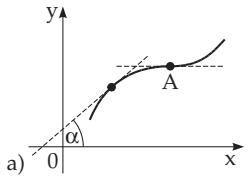
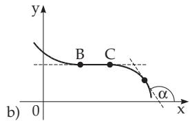
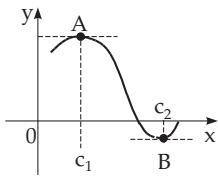
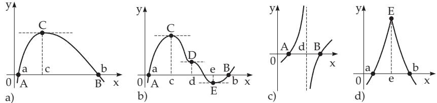
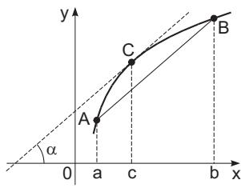

#### 6.1.4 Fundamental Theorems of Differential Calculus

##### 6.1.4.1 Monotonicity

If a function $f ( x )$ is defined and continuous in a connected interval, and if it is diferentiable at every interior point of this interval, then the relations

$f ^ { \prime } ( x ) \geq 0$ for a monotone increasing function,

(6.26a)

$f ^ { \prime } ( x ) \leq 0$ for a monotone decreasing function

(6.26b)

are necessary and suficient. If the function is strictly monotone increasing or decreasing, then the derivative function $f ^ { \prime } ( x )$ must not be identically zero on any subinterval of the given interval. In Fig. 6.6b this condition is not fulfilled on the segment $\overline { { B C } }$

The geometrical meaning of monotonicity is that the curve of an increasing function never falls for increasing values of the argument, i.e., it either rises or runs horizontally $( \mathrm { F i g . 6 . 6 a ) }$ . Therefore the tangent line at any point of the curve forms an acute angle with the positive x-axis or it is parallel to it. For monotonically decreasing functions (Fig. 6.6b) analogous statements are valid. If the function is strictly monotone, then the tangent can be parallel to the x-axis only at some single points, e.g., at the point A in Fig. 6.6a, i.e., not on a subinterval such as $\overline { { B C } }$ in Fig. 6.6b.

  
Figure 6.6

  
Figure 6.7

##### 6.1.4.2 Fermat’s Theorem

If a function $y = f ( x )$ is defined on a connected interval, and it has a maximum or a minimum value at an interior point $x = c$ of this interval (Fig. 6.7), i.e., if for every x in this interval

$$
f ( c ) > f ( x )
$$

$$
f ( c ) < f ( x ) ,\tag{6.27b}
$$

holds, and if the derivative exists at the point $c ,$ then the derivative must be equal to zero there:

$$
f ^ { \prime } ( c ) = 0 .\tag{6.27c}
$$

The geometrical meaning of the Fermat theorem is that if a function satisfies the assumptions of the theorem, then its curve has tangents parallel to the x-axis at A and B (Fig. 6.7).

The Fermat theorem gives only a necessary condition for the existence of a maximum or minimum value at a point. From Fig. 6.6a it is obvious that having a zero derivative is not suficient to give an extreme value: At the point A, $f ^ { \prime } ( x ) = 0$ holds, but there is no maximum or minimum here.

To have an extreme value diferentiability is not a necessary condition. The function in Fig. 6.8d has a maximum at e, but the derivative does not exist here.

##### 6.1.4.3 Rolle’s Theorem

If a function $y = f ( x )$ is continuous on the closed interval $[ a , b ]$ , and diferentiable on the open interval (a, b), and

$$
f ( a ) = 0 , \quad f ( b ) = 0 \quad ( a < b )\tag{6.28a}
$$

hold, then there exists at least one point c between a and b such that

$$
f ^ { \prime } ( c ) = 0 \quad ( a < c < b )\tag{6.28b}
$$

holds. The geometrical meaning of Rolle’s theorem is that if the graph of a function $y = f ( x )$ which is continuous on the interval $( a , b )$ intersects the x-axis at two points A and B, and it has a non-vertical tangent at every point, then there is at least one point C between A and B such that the tangent is parallel to the x-axis here (Fig. 6.8a). It is possible, that there are several such points in this inter-

  
Figure 6.8

val, e.g., the points $C , D ,$ and E in Fig. 6.8b. The properties of continuity and diferentiability are important in the theorem: in Fig. 6.8c the function is not continuous at $x = d$ and in Fig. 6.8d the function is not diferentiable at $x = e$ . In both cases $f ^ { \prime } ( x ) \neq 0$ holds everywhere where the derivative exists.

##### 6.1.4.4 Mean Value Theorem of Differential Calculus

If a function $y = f ( x )$ is continuous on the closed interval $[ a , b ]$ and diferentiable on the open interval $( a , b )$ , then there is at least one point c between a and b which satisfies the following relation:

  
Figure 6.9

$$
{ \frac { f ( b ) - f ( a ) } { b - a } } = f ^ { \prime } ( c ) \quad ( a < c < b )\tag{6.29a}
$$

holds. Substituting $b = a + h$ , and Θ means a number between 0 and 1, then the theorem can be written in the form

$$
f ( a + h ) = f ( a ) + h f ^ { \prime } ( a + \theta h ) \quad ( 0 < \theta < 1 ) .\tag{6.29b}
$$

1. Geometrical Meaning The geometrical meaning of the theorem is that if a function $y = f ( x )$ satisfies the conditions of the theorem, then its graph has at least one point C between A and B such that the tangent line at this point is parallel to the line segment between A and B (Fig. 6.9). There can be several such points (Fig. 6.8b).

That the properties of continuity and diferentiability are important can be shown in examples and also as can be observed in $\mathbf { F i g . 6 . 8 c , d }$

2. Applications The mean value theorem has several useful applications.

A: This theorem can be used to prove some inequalities in the form

$$
| f ( b ) - f ( a ) | < K | b - a | ,\tag{6.30}
$$

where K is an upper bound of $\left| f ^ { \prime } ( x ) \right|$ for every x in the interval $[ a , b ]$

B: How accurate is the value of $f ( \pi ) = \frac { 1 } { 1 + \pi ^ { 2 } }$ if π is replaced by the approximate value $\overline { { \pi } } = 3 . 1 4 \overset { \cdot } { . }$ We have: $| f ( \pi ) - f ( \pi ) | = \left| { \frac { 2 c } { ( 1 + c ^ { 2 } ) ^ { 2 } } } \right| | \pi - \bar { \pi } | \leq 0 . 0 5 3 \cdot 0 . 0 0 1 6 = 0 . 0 0 0 0 8 5$ , which means $\frac { 1 } { 1 + \pi ^ { 2 } }$ is between $0 . 0 9 2 0 8 4 \pm 0 . 0 0 0 0 8 5$

##### 6.1.4.5 Taylor’s Theorem of Functions of One Variable

If a function $y = f ( x )$ is continuously diferentiable (it has continuous derivatives) $n - 1$ times on the interval $[ a , a + h ]$ , and if also the n-th derivative exists in the interior of the interval, then the Taylor

formula or Taylor expansion is

$$
f ( a + h ) = f ( a ) + { \frac { h } { 1 ! } } f ^ { \prime } ( a ) + { \frac { h ^ { 2 } } { 2 ! } } f ^ { \prime \prime } ( a ) + \cdots + { \frac { h ^ { n - 1 } } { ( n - 1 ) ! } } f ^ { ( n - 1 ) } ( a ) + { \frac { h ^ { n } } { n ! } } f ^ { ( n ) } ( a + \theta h )\tag{6.31}
$$

with $0 < \Theta < 1$ . The quantity h can be positive or negative. The mean value theorem (6.29b) is a special case of the Taylor formula for $n = 1$

##### 6.1.4.6 Generalized Mean Value Theorem of Differential Calculus (Cauchy’s Theorem)

If two functions $y = f ( x )$ and $y = \varphi ( x )$ are continuous on the closed interval $[ a , b ]$ and they are differentiable at least in the interior of the interval, and $\varphi ^ { \prime } ( x )$ is never equal to zero in this interval, then there exists at least one value c between a and b such tha

$$
{ \frac { f ( b ) - f ( a ) } { \varphi ( b ) - \varphi ( a ) } } = { \frac { f ^ { \prime } ( c ) } { \varphi ^ { \prime } ( c ) } } \quad ( a < c < b ) .\tag{6.32}
$$

The geometrical meaning of the generalized mean value theorem corresponds to that of the first mean value theorem. Supposing, e.g., that the curve in Fig.6.9 is given in parametric form $x = \varphi ( t )$ $y =$ $f ( t )$ , where the points A and B belong to the parameter values $t = a$ and $t = b$ respectively. Then for the point C

$$
\tan \alpha = { \frac { f ( b ) - f ( a ) } { \varphi ( b ) - \varphi ( a ) } } = { \frac { f ^ { \prime } ( c ) } { \varphi ^ { \prime } ( c ) } }\tag{6.33}
$$

is valid. For $\varphi ( x ) ~ = ~ x$ the generalized mean value theorem is simplified into the first mean value theorem.
