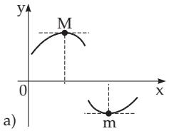
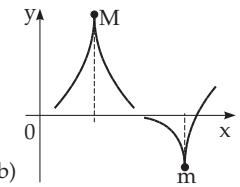
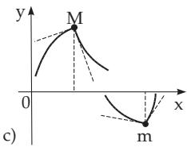
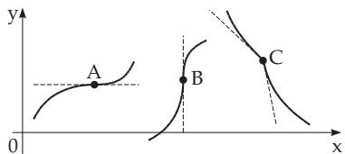
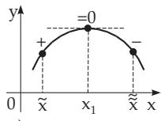
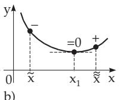
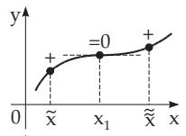
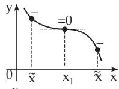
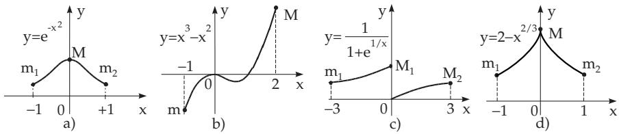

#### 6.1.5 Determination of the Extreme Values and Inflection Points

##### 6.1.5.1 Maxima and Minima

The substitution value $f ( x _ { 0 } )$ of a function $f ( x )$ is called the relative maximum (M) or relative minimum (m) if one of the inequalities

$$
\begin{array} { r l } { f ( x _ { 0 } + h ) < f ( x _ { 0 } ) } & { { } \mathrm { ( f o r ~ m a x i m u m ) } , } \\ { f ( x _ { 0 } + h ) > f ( x _ { 0 } ) } & { { } \mathrm { ( f o r ~ m i n i m u m ) } } \end{array}\tag{6.34a}
$$

(6.34b)

holds for arbitrary positive or negative values of h small enough. At a relative maximum the value $f ( x _ { 0 } )$ is greater than the values in the neighborhood, and similarly, at a minimum it is smaller. The relative maxima and minima are called relative or local extrema. The greatest or the smallest value of a function in an interval is called the global or absolute maximum or global or absolute minimum in this interval.

  
Figure 6.10

##### 6.1.5.2 Necessary Conditions for the Existence of a Relative Extreme Value

A function can have a relative maximum or minimum only at the points where its derivative is equal to zero or does not exist. That is: At the points of the graph of the function corresponding to the relative extrema the tangent line is whether parallel to the x-axis (Fig. 6.10a) or parallel to the y-axis

(Fig. 6.10b) or does not exist (Fig. 6.10c). Anyway, these are not suficient conditions, $\mathrm { e . g . }$ , at the points A, $B , C$ in Fig. 6.11 these conditions are obviously fulfilled, but there are no extreme values of the function.

If a continuous function has relative extreme values, then maxima and minima follow alternately, that means, between two neighboring maxima there is a minimum, and conversely.

##### 6.1.5.3 Determination of the Relative Extreme Values and the Inflection Points of a Differentiable Explicit Function y = f(x)

  
Figure 6.11

Since $f ^ { \prime } ( x ) = 0$ is a necessary condition where the derivative exists, after determining the derivative $f ^ { \prime } ( x )$ , first one calculates all the real roots $x _ { 1 } , x _ { 2 } , \ldots , x _ { i } , \ldots , x _ { n }$ of the equation $f ^ { \prime } ( x ) = 0$ Then each of them has to be checked , $\mathrm { e . g . } , x _ { i }$ with one of the following methods.

1. Method of Sign Change

For values $x _ { - }$ and $x _ { + }$ , which are slightly smaller and greater than $x _ { i } ,$ , and for which between $x _ { i }$ and x and $x _ { + }$ no more roots or points of discontinuity of $f ^ { \prime } ( x )$ exist, one

checks the sign of $f ^ { \prime } ( x )$ . When during the transition from $f ^ { \prime } ( x _ { - } )$ to $f ^ { \prime } ( x _ { + } )$ the sign of $f ^ { \prime } ( x )$ changes from $^ { 6 6 } + ^ { 9 9 }$ to $\tilde { \left. 6 6 \_ 9 \right|} $ , then there is a relative maximum of the function $f ( x )$ at $x = x _ { i }$ (Fig. 6.12a); if it changes from ${ } ^ { \mathfrak { a } } - { } ^ { \mathfrak { p } } \ { } _ { \mathrm { t o } } \ { } ^ { \mathfrak { a } } + { } ^ { \mathfrak { n } }$ , then there is a relative minimum there $( \mathbf { F i g . 6 . 1 2 b } )$ . If the derivative does not change its sign $( \mathbf { F i g . 6 . 1 2 c , d } )$ , then there is no extremum at $x = x _ { i } .$ , but it has an inflection point with a tangent parallel to the x-axis.

2. Method of Higher Derivatives

If a function has higher derivatives at $x = x _ { i }$ , then one can substitute, $\mathrm { e . g . }$ , the root $x _ { i }$ into the second derivative $f ^ { \prime \prime } ( x )$ . If $f ^ { \prime \prime } ( x _ { i } ) < 0$ holds, then there is a relative maximum at $x _ { i } ,$ and if $f ^ { \prime \prime } ( x _ { i } ) > 0$ holds, a relative minimum. If $f ^ { \prime \prime } ( x _ { i } ) = 0$ holds, then $x _ { i }$ must be substituted into the third derivative $f ^ { \prime \prime \prime } ( x )$ If $f ^ { \prime \prime \prime } ( x _ { i } ) \ne 0$ holds, then there is no extremum at $x = x _ { i }$ but an inflection point. If stil $f ^ { \prime \prime \prime } ( x _ { i } ) \stackrel { \cdot } { = } 0$ holds, then one substitutes it into the forth derivative, etc. If the first non-zero derivative at $x = x _ { i }$ is an even one, then $f ( x )$ has an extremum here: If the derivative is positive, then there is minimum, if it is negative, then there is a maximum. If the first non-zero derivative is an odd one, then there is no extremum there (actually, there is an inflection point).

a)  

  
c)  
Figure 6.12

  
d)

3. Further Conditions for Extreme Points and Determination of Inflection Points If a continuous function is increasing below $x _ { 0 }$ and decreasing after, then it has a maximum there; if it is decreasing below and increasing after, then it has a minimum there. Checking the sign change of the derivative is a useful method even if the derivative does not exist at certain points as in Fig. 6.10b,c and Fig. 6.11. If the first derivative exists at a point where the function has an inflection point, then the first derivative has an extremum there. So, to find the inflection points with the help of derivatives, one has to do the same investigation for the derivative function as one has done for the original function to find its extrema.

Remark: For non-continuous functions, and sometimes also for certain diferentiable functions the determination of extrema needs individual ideas. It is possible that a function has an extremum so that the first derivative exists and it is equal to zero, but the second derivative does not exist, and the first one has infinitely many roots in an arbitrary neighborhood of the considered point, so it is meaningless to say it changes its sign there. For instance $f ( x ) = x ^ { 2 } ( 2 + \sin \left( 1 / x \right) )$ for $x \neq 0$ and $f ( 0 ) = \bar { 0 }$

##### 6.1.5.4 Determination of Absolute Extrema

The considered interval of the independent variable is divided into subintervals such that in these intervals the function has a continuous derivative. The absolute extreme values are among the relative extreme values, or at the endpoints of the subintervals, if their endpoints belong to them. For noncontinuous functions or for non-closed intervals it is possible that no maximum or minimum exists on the considered interval.

Examples of the Determination of Extrema:

A: $y = e ^ { - x ^ { 2 } }$ , interval [ 1, +1]. Greatest value at $x = 0$ , smallest at the endpoints (Fig. 6.13a).

B: $y = x ^ { 3 } - x ^ { 2 }$ , interval $[ - 1 , + 2 ]$ . Greatest value at $x = + 2$ , smallest at $x = - 1$ , at the ends of the interval (Fig. 6.13b).

C: $y = { \frac { 1 } { 1 + e ^ { \frac { 1 } { x } } } }$ , interval $[ - 3 , + 3 ] , x \neq 0$ . There is no maximum or minimum. Relative minimum at $x = - 3$ , relative maximum at $x = 3$ . If one defines y = 1 for $x = 0$ , then there will be an absolute maximum at $x = 0 \ ( \mathbf { F i g . 6 . 1 3 c } )$

D: $y = 2 - x ^ { \frac { 2 } { 3 } }$ , interval [ 1, +1]. Greatest value at $x = 0 \ ( \mathbf { F i g . 6 . 1 3 d }$ , the derivative is not finite).

##### 6.1.5.5 Determination of the Extrema of Implicit Functions

If the function is given in the implicit form $F ( x , y ) = 0$ , and the function F itself and also its partia derivatives $F _ { x } , F _ { y }$ are continuous, then its maxima and minima can be determined in the following way: 1. Solution of the Equation System $F ( x , y ) = 0 , F _ { x } ( x , y ) = 0$ and substitution of the resulting values $( x _ { 1 } , y _ { 1 } ) , ( x _ { 2 } , y _ { 2 } ) , \ldots , ( x _ { i } , y _ { i } ) , \ldots .$ in $F _ { y }$ and $F _ { x x }$

2. Sign Comparison for $F _ { y }$ and ${ \cal F } _ { x x }$ at the Point $( x _ { i } , y _ { i } )$ : When they have diferent signs, the function $y = f ( x )$ has a minimum at $x _ { i } ;$ when $F _ { y }$ and $F _ { x x }$ have the same sign, then it has a maximum at $x _ { i }$ . If either $F _ { y }$ or $F _ { x x }$ vanishes at $( x _ { i } , y _ { i } )$ , then one needs further and rather complicated investigation.

  
Figure 6.13
