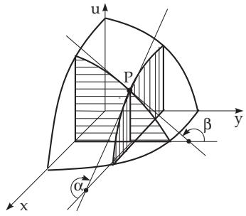
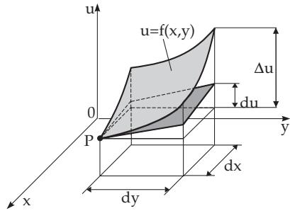

#### 6.2.1 Partial Derivatives

##### 6.2.1.1 Partial Derivative of a Function

The partial derivative of a function $u = f ( x _ { 1 } , x _ { 2 } , \ldots , x _ { i } , \ldots , x _ { n } )$ with respect to one of its n variables, e.g., with respect to $x _ { 1 }$ is defined by

$$
{ \frac { \partial u } { \partial x _ { 1 } } } = \operatorname* { l i m } _ { \Delta x _ { 1 }  0 } { \frac { f ( x _ { 1 } + \Delta x _ { 1 } , x _ { 2 } , x _ { 3 } , \dots , x _ { n } ) - f ( x _ { 1 } , x _ { 2 } , x _ { 3 } , \dots , x _ { n } ) } { \Delta x _ { 1 } } } ,\tag{6.35}
$$

so only one of the n variables is changing, the other $n - 1$ are considered as constants. The symbols for the partial derivatives are $\frac { \partial u } { \partial x } , u _ { x } ^ { \prime } , \frac { \partial f } { \partial x } , f _ { x } ^ { \prime }$ . A function of n variables can have n first-order partial derivatives: ${ \frac { \partial u } { \partial x _ { 1 } } } , { \frac { \partial u } { \partial x _ { 2 } } } , { \frac { \partial u } { \partial x _ { 3 } } } , \ldots , { \frac { \partial u } { \partial x _ { n } } }$ . The calculation of the partial derivatives can be done following the same rules as there are for the functions of one variable.

$$
\mid u = \frac { x ^ { 2 } y } { z } , \quad \frac { \partial u } { \partial x } = \frac { 2 x y } { z } , \quad \frac { \partial u } { \partial y } = \frac { x ^ { 2 } } { z } , \quad \frac { \partial u } { \partial z } = - \frac { x ^ { 2 } y } { z ^ { 2 } } { . }
$$

##### 6.2.1.2 Geometrical Meaning for Functions of Two Variables

If a function $u = f ( x , y )$ is represented as a surface in a Cartesian coordinate system, and this surface is intersected through its point P by a plane parallel to the x, u plane (Fig. 6.14), then holds

$$
\frac { \partial u } { \partial x } = \tan \alpha ,\tag{6.36a}
$$

where α is the angle between the positive x-axis and the tangent line of the intersection curve at $P ,$ which is the same as the angle between the positive x-axis and the perpendicular projection of the tangent line into the x, u plane. Here, α is measured starting at the x-axis, and the positive direction is counterclockwise if looking toward the positive half of the y-axis. Analogously to $\alpha , \beta$ is defined with a plane parallel to the y, u plane:

$$
\frac { \partial u } { \partial y } = \tan \beta .\tag{6.36b}
$$

The derivative with respect to a given direction, the so-called directional derivative, and derivative with respect to volume, will be discussed in vector analysis (see 13.2.1, p. 708 and p. 709).

  
Figure 6.14

  
Figure 6.15

##### 6.2.1.3 Differentials of x and f(x)

1. The Diferential dx of an Independent Variable x is equal to the increment $\Delta x , { \mathrm { i . e . } }$ .,

$$
d x = \Delta x\tag{6.37a}
$$

for an arbitrary value of $\Delta x$

2. The Diferential dy of a Function $y = f ( x )$ of One Variable x is defined for a given value of x and for a given value of the diferential dx as the product

$$
d y = f ^ { \prime } ( x ) d x .\tag{6.37b}
$$

3. The Increment of a Function $y = f ( x )$ for $x + \Delta x$ is the diference

$$
\Delta y = f ( x + \Delta x ) - f ( x ) .\tag{6.37c}
$$

4. Geometrical Meaning of the Diferential

If the function is represented by a curve in a Cartesian coordinate system, then dy is the increment of the ordinate of the tangent line for the change of x by a given increment dx (Fig. 6.1). In an analogous way $\Delta y$ is the increment of the ordinate of the curve.

##### 6.2.1.4 Basic Properties of the Differential

1. Invariance

Independently of whether x is an independent variable or a function of a further variable t

$$
d y = f ^ { \prime } ( x ) d x\tag{6.38}
$$

is valid.

2. Order of Magnitude

If dx is an arbitrarily small value, then $d y$ and $\Delta y = y ( x + \Delta x ) - y ( x )$ are also arbitrarily small, but of equivalent amounts, i.e., $\operatorname* { l i m } _ { \Delta x \to 0 } { \frac { \Delta y } { d y } } = 1$ . Consequently, the diference between them is also arbitrarily small, but of higher order than dx, dy and $\Delta x$ (except if $d y = 0 \mathrm { { h o l d s } ) }$ . Therefore, one gets the relation

$$
\operatorname* { l i m } _ { \Delta x \to 0 } { \frac { \Delta y } { d y } } = 1 , \quad \Delta y \approx d y = f ^ { \prime } ( x ) d x ,\tag{6.39}
$$

which allows to reduce the calculation of a small increment to the calculation of its diferential. This formula is frequently used for approximate calculations (see 6.1.4.4, p. 442 and 16.4.2.1, 2., p. 855).

##### 6.2.1.5 Partial Differential

For a function of several variables $u = f ( x , y , \dots )$ one can form the partial diferential with respect to one of its variables, e.g., with respect to x, which is defined by the equality

$$
d _ { x } u = d _ { x } f = { \frac { \partial u } { \partial x } } d x .\tag{6.40}
$$
