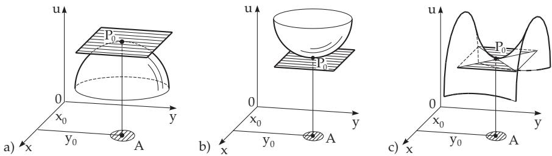

#### 6.2.5 Extreme Values of Functions of Several Variables

##### 6.2.5.1 Definition of a Relative Extreme Value

A function $u = f ( x _ { 1 } , x _ { 2 } , \ldots , x _ { i } , \ldots , x _ { n } )$ has a relative extreme value at a point $P _ { 0 } ( x _ { 1 0 } , x _ { 2 0 } , \dots , x _ { i 0 } , \dots ,$ $x _ { n 0 } )$ , if there is a number  such that for every point $P ( x _ { 1 } , x _ { 2 } , \ldots , x _ { n } )$ belonging to the domain $x _ { 1 0 } - \epsilon <$ $x _ { 1 } < x _ { 1 0 } + \epsilon , x _ { 2 0 } - \epsilon < x _ { 2 } < x _ { 2 0 } + \epsilon , \ldots , x _ { n 0 } - \epsilon < x _ { n } < x _ { n 0 } + \epsilon$ and to the domain of the function but diferent from $P _ { 0 } .$ , then for a maximum the inequality

$$
f ( x _ { 1 } , x _ { 2 } , \ldots , x _ { n } ) < f ( x _ { 1 0 } , x _ { 2 0 } , \ldots , x _ { n 0 } )\tag{6.68a}
$$

holds, and for a minimum the inequality

$$
f ( x _ { 1 } , x _ { 2 } , \ldots , x _ { n } ) > f ( x _ { 1 0 } , x _ { 2 0 } , \ldots , x _ { n 0 } )\tag{6.68b}
$$

holds. Using the terminology of several dimensional spaces (see 2.18.1, p. 118) a function has a relative maximum or a relative minimum at a point if it is greater or smaller there than at the neighboring points.

##### 6.2.5.2 Geometric Representation

In the case of a function of two variables, represented in a Cartesian coordinate system as a surface (see 2.18.1.2, p. 119), the relative extreme value geometrically means that the applicate (see 3.5.3.1, 3., p. 210) of the surface in the point A is greater or smaller than the applicate of the surface in any other point in a suficiently small neighborhood of A (Fig. 6.16).

If the surface has a relative extremum at the point $P _ { 0 }$ which is an interior point of its domain, and if the surface has a tangent plane at this point, then the tangent plane is parallel to the x, y plane (Fig. 6.16a,b). This property is necessary but not suficient for a maximum or minimum at a point

  
Figure 6.16

$P _ { 0 }$ . For example Fig. 6.16c shows a surface having a horizontal tangent plane at $P _ { 0 }$ , but there is a saddle point here and not an extremum.

##### 6.2.5.3 Determination of Extreme Values of Differentiable Functions of Two Variables

If $u = f ( x , y )$ is given, then one solves the system of equations $f _ { x } = 0 , f _ { y } = 0$ . The resulting pairs of values $( x _ { 1 } , y _ { 1 } ) , ( x _ { 2 } , y _ { 2 } ) , . .$ . can be substituted into the second derivatives

$$
A = \frac { \partial ^ { 2 } f } { \partial x ^ { 2 } } , \quad B = \frac { \partial ^ { 2 } f } { \partial x \partial y } , \quad C = \frac { \partial ^ { 2 } f } { \partial y ^ { 2 } } .\tag{6.69}
$$

Depending on the expression

$$
\Delta = { \left| \begin{array} { l l } { A } & { B } \\ { B } & { C } \end{array} \right| } = A C - B ^ { 2 } = [ f _ { x x } f _ { y y } - ( f _ { x y } ) ^ { 2 } ] _ { x = x _ { i } , y = y _ { i } } \quad ( i = 1 , 2 , \ldots )\tag{6.70}
$$

it can be decided whether an extreme value exists and of what kind it is:

1. In the case $\Delta > 0$ the function $f ( x , y )$ has an extreme value at $( x _ { i } , y _ { i } )$ , and for $f _ { x x } \ < \ 0$ it is a maximum, for $f _ { x x } > 0$ it is a minimum (suficient condition).

2. In the case $\Delta < 0$ the function $f ( x , y )$ does not have an extremum.

3. In the case $\Delta = 0$ , one needs further investigation.

6.2.5.4 Determination of the Extreme Values of a Function of n Variables If $u = f ( x _ { 1 } , x _ { 2 } , . ~ . ~ . ~ , x _ { n } )$ is given, then first it is to find a solution $( x _ { 1 0 } , x _ { 2 0 } , \ldots , x _ { n 0 } )$ of the system of the n equations

$$
f _ { x _ { 1 } } = 0 , f _ { x _ { 2 } } = 0 , . . . , f _ { x _ { n } } = 0 ,\tag{6.71}
$$

because it is a necessary condition for an extreme value. (6.71) is not a suficient condition. Therefore one prepares a matrix of the second-order partial derivatives such that $a _ { i j } = { \frac { \partial ^ { 2 } f } { \partial x _ { i } \partial x _ { j } } }$ . Then it is to substitute a solution of the system of equations (6.71) into the terms, and to prepare the sequence of left upper subdeterminants $( a _ { 1 1 } , a _ { 1 1 } a _ { 2 2 } - a _ { 1 2 } a _ { 2 1 } , . . . )$ . Then there are the following cases:

1. The signs of the subdeterminants follow the rule $- , + , - , + , \ldots$ then there is a maximum there.

2. The signs of the subdeterminants follow the rule $+ , + , + , + , \ldots$ then there is a minimum there.

3. There are some zero values among the subdeterminants, but the signs of the non-zero subdeterminants coincide with the signs of the corresponding positions of one of the first two cases. Then further investigation is required: Usually one checks the values of the function in a close neighborhood of $x _ { 1 0 } , x _ { 2 0 } , \ldots , x _ { n 0 }$

4. The signs of the subdeterminants does not follow the rules given in cases 1. and 2.: There is no extremum at that point.

The case of two variables is of course a special case of the case of n variables, (see [6.4]).

##### 6.2.5.4 Determination of the Extreme Values of a Function of Two Variables

##### 6.2.5.5 Solution of Approximation Problems

Several diferent approximation problems can be solved with the help of the determination of the extreme values of functions of several variables, e.g., fitting problems or mean squares problems.

Problems to solve:

Determination of Fourier coeficients (see 7.4.1.2, p. 475, 19.6.4.1, p. 992).

Determination of the coeficients and parameters of approximation functions (see 19.6.2, p. 984 f).

Determination of an approximate solution of an overdetermined linear system of equations (see 19.2.1.3, p. 958).

Methods: For these problems the following methods are used:

Gaussian least squares method (see, e.g., 19.6.2, p. 984).

Least squares method (see 19.6.2.2, p. 985).

Approximation in mean square (continuous and discrete) (see, e.g., 19.6.2, p.984).

Calculus of observations (or fitting) (see 19.6.2, p. 984) and regression (see 16.3.4.2, 1., p. 841).

##### 6.2.5.6 Extreme Value Problem with Side Conditions

To determine are the extreme values of a function $u = f ( x _ { 1 } , x _ { 2 } , . . . , x _ { n } )$ of n variables with the side conditions

$$
\varphi ( x _ { 1 } , x _ { 2 } , \ldots , x _ { n } ) = 0 , \psi ( x _ { 1 } , x _ { 2 } , \ldots , x _ { n } ) = 0 , \ldots , \chi ( x _ { 1 } , x _ { 2 } , \ldots , x _ { n } ) = 0 .\tag{6.72a}
$$

Because of the conditions, the variables are not independent, and if the number of conditions is $k ,$ obviously $k < n$ must hold. One possibility to determine the extreme values of u is to express k variables with the others from the system of equations of the conditions, to substitute them into the original function. Then the result is an extreme value problem without conditions for $n - k$ variables. The other way is the Lagrange multiplier method. Introducing k undefined multipliers $\lambda , \mu , \ldots , \kappa ,$ and composing the Lagrange function (Lagrangian) of $n + k$ variables $x _ { 1 } , x _ { 2 } , \ldots , x _ { n } , \lambda , \mu , \ldots , \kappa$ gives:

$$
\begin{array} { l } { \phi \left( x _ { 1 } , x _ { 2 } , \ldots , x _ { n } , \lambda , \mu , \ldots , \kappa \right) } \\ { = f ( x _ { 1 } , x _ { 2 } , \ldots , x _ { n } ) + \lambda \varphi ( x _ { 1 } , x _ { 2 } , \ldots , x _ { n } ) + \mu \psi ( x _ { 1 } , x _ { 2 } , \ldots , x _ { n } ) + \cdot \cdot \cdot \cdot } \\ { \qquad + \kappa \chi ( x _ { 1 } , x _ { 2 } , \ldots , x _ { n } ) . } \end{array}\tag{6.72b}
$$

The necessary condition for an extremum of the function $\varPhi$ is a system of $n + k$ equations (6.71) with the unknowns $x _ { 1 } , x _ { 2 } , \ldots , x _ { n } , \lambda , \mu , \ldots , \kappa \colon$

$$
\varphi = 0 , \psi = 0 , \ldots , \chi = 0 , \phi _ { x _ { 1 } } = 0 , \phi _ { x _ { 2 } } = 0 , \ldots , \phi _ { x _ { n } } = 0\tag{6.72c}
$$

The necessary condition for an extremum of the function $f$ at the point $P _ { 0 } ( x _ { 1 0 } , x _ { 2 0 } , . . . , x _ { n 0 } )$ with the side conditions (6.72a) is that the system of values $x _ { 1 0 } , x _ { 2 0 } , \ldots , x _ { n 0 }$ must fulfill the equations (6.72c). So it is to look for the extremum points of $f$ among the solutions $x _ { 1 0 } , x _ { 2 0 } , \ldots , x _ { n 0 }$ of the system of equations (6.72c). To determine whether there are really extreme values at these points fulfilling the necessary conditions requires further investigations, for which the general rules are fairly complicated. Usually one uses some appropriate and individual calculations depending on the function $f$ to prove if there is an extremum, or not. Often approximation calculations are helpful, i.e., the comparison with values of the function in the neighborhood of $P _ { 0 }$

The extreme value of the function $u = f ( x , y )$ with the side condition $\varphi ( x , y ) = 0$ will be determined from the three equations

$$
\varphi ( x , y ) = 0 , ~ \frac { \partial } { \partial x } [ f ( x , y ) + \lambda \varphi ( x , y ) ] = 0 , ~ \frac { \partial } { \partial y } [ f ( x , y ) + \lambda \varphi ( x , y ) ] = 0 .\tag{6.73}
$$

There are three unknowns, $x , y , \lambda .$ . Since the three equations (6.73) are only necessary but not suficient conditions for the existence of an extremum, further investigation is needed whether there is an extremum at the solution of this system. A mathematical criterion is rather complicated (see [6.3], [6.8]); comparisons of the values of the function at points in the close neighborhood are often useful.
