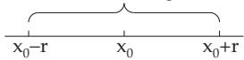

### 7.3 Function Series

#### 7.3.1 Definitions

1. Function Series is a series whose terms are functions of the same variable x:

$$
f _ { 1 } ( x ) + f _ { 2 } ( x ) + \cdots + f _ { n } ( x ) + \cdots = \sum _ { n = 1 } ^ { \infty } f _ { n } ( x ) .\tag{7.74}
$$

2. Partial Sum $S _ { n } ( x )$ is the sum of the first n terms of the series (7.74):

$$
S _ { n } ( x ) = f _ { 1 } ( x ) + f _ { 2 } ( x ) + \cdots + f _ { n } ( x ) = \sum _ { k = 1 } ^ { n } f _ { k } ( x ) .\tag{7.75}
$$

3. Domain of Convergence of a function series (7.74) is the set of values of $x = a$ for which all the functions $f _ { n } ( x )$ are defined and the series of constant terms

$$
f _ { 1 } ( a ) + f _ { 2 } ( a ) + \cdots + f _ { n } ( a ) + \cdots = \sum _ { n = 1 } ^ { \infty } f _ { n } ( a )\tag{7.76}
$$

is convergent, i.e., for which the limit of the partial sums $S _ { n } ( a )$ exists:

$$
\operatorname* { l i m } _ { n \to \infty } S _ { n } ( a ) = \operatorname* { l i m } _ { n \to \infty } \sum _ { k = 1 } ^ { n } f _ { k } ( a ) = S ( a ) .\tag{7.77}
$$

4. The Sum of the Series $( 7 . 7 4 )$ is the function $S ( x )$ , and one says that the series converges to the function $S ( x )$ . The values for $x = a$ are the points of convergence.

5. Remainder $R _ { n } ( x )$ is the diference between the sum $S ( x )$ of a convergent function series and its partial sum $S _ { n } ( x )$

$$
R _ { n } ( x ) = S ( x ) - S _ { n } ( x ) = f _ { n + 1 } ( x ) + f _ { n + 2 } ( x ) + \cdots + f _ { n + m } ( x ) + \cdots .\tag{7.78}
$$

#### 7.3.2 Uniform Convergence

##### 7.3.2.1 Definition, Weierstrass Theorem

According to the definition of the limit of a sequence of numbers (see 7.1.2, p. 458 and 7.2.1.1, 2., p. 459) the series (7.74) converges for all values x of a domain to $S ( x )$ if for an arbitrary $\varepsilon > 0$ there is an integer $N ( x )$ such that $| S ( \check { x } ) - S _ { n } ( x ) | < \varepsilon$ holds for every $n > \dot { N } ( x )$ . For function series there are to be distinguished between two cases:

1. Uniformly Convergent Series

If there is a number N such that for every x in the domain of convergence of the series $( 7 . 7 4 ) , | S ( x ) -$ $S _ { n } ( x ) \vert < \varepsilon$ holds for every $n > N$ , then the series is called uniformly convergent on this domain.

2. Non-Uniform Convergence of Series

If there is no such number N which holds for every value of x in the domain of convergence, i.e., there are such values of ε for which there is at least one x in the domain of convergence such that $| S ( x ) - S _ { n } ( x ) | > \varepsilon$ holds for arbitrarily large values of $n _ { \mathrm { : } }$ , then the series is non-uniformly convergent.

A : The series $1 + { \frac { x } { 1 ! } } + { \frac { x ^ { 2 } } { 2 ! } } + \cdots + { \frac { x ^ { n } } { n ! } } + \cdots = e ^ { x }$

(7.79a)

(see Table 21.5, p. 1059) is convergent for every value of x. The convergence is uniform for every bounded interval of x, and for every $| x | < a$ using the remainder of the Maclaurin formula (see 7.3.3.3, 2., p. 472) the inequality

$$
| S ( x ) - S _ { n } ( x ) | = \left| { \frac { x ^ { n + 1 } } { ( n + 1 ) ! } } e ^ { \theta x } \right| < { \frac { a ^ { n + 1 } } { ( n + 1 ) ! } } e ^ { a } \qquad ( 0 < \theta < 1 )\tag{7.79b}
$$

is valid. Since $( n + 1 ) !$ increases faster than $a ^ { n + 1 }$ in n, the expression on the right-hand side of the inequality, which is independent of x, will be less than ε for suficiently large n . The series is not uniformly convergent on the whole numerical axis: For any large n there will be a value of x such that

$\left| { \frac { x ^ { n + 1 } } { ( n + 1 ) ! } } e ^ { \theta x } \right|$ is greater than a previously given ε.

$$
x + x ( 1 - x ) + x ( 1 - x ) ^ { 2 } + \cdots + x ( 1 - x ) ^ { n } + \cdots ,\tag{7.80a}
$$

is convergent for every x in [0, 1], because corresponding to the d’Alembert ratio test (see 7.2.2.2, p. 461)

$$
\rho = \operatorname* { l i m } _ { n \to \infty } \left| { \frac { a _ { n + 1 } } { a _ { n } } } \right| = | 1 - x | < 1 { \mathrm { ~ i s ~ v a l i d ~ f o r ~ } } 0 < x \leq 1 { \mathrm { ~ ( f o r ~ } } x = 0 \ S = 0 { \mathrm { ~ h o l d s ) } } .\tag{7.80b}
$$

The convergence is non-uniform, because

$$
S ( x ) - S _ { n } ( x ) = x [ ( 1 - x ) ^ { n + 1 } + ( 1 - x ) ^ { n + 2 } + \cdots ] = ( 1 - x ) ^ { n + 1 }\tag{7.80c}
$$

is valid and for every n there is an x such that $( 1 - x ) ^ { n + 1 }$ is close enough to 1, i.e., it is not smaller than ε. In the interval $a \leq x \leq 1$ with $0 < a < 1$ the series is uniformly convergent.

3. Weierstrass Criterion for Uniform Convergence

The series (7.81a) is uniformly convergent in a given domain if there is a convergent series of constant positive terms (7.81b) such that for every x in this domain the inequality (7.81c) is valid.

$$
f _ { 1 } ( x ) + f _ { 2 } ( x ) + \cdot \cdot \cdot + f _ { n } ( x ) + \cdot \cdot \cdot \qquad \quad ( 7 . 8 1 \mathrm { a } ) \qquad \quad c _ { 1 } + c _ { 2 } + \cdot \cdot \cdot + c _ { n } + \cdot \cdot \cdot\tag{7.81b}
$$

$$
| f _ { n } ( x ) | \leq c _ { n }\tag{7.81c}
$$

(7.81b) is called a majorant of the series (7.81a).

##### 7.3.2.2 Properties of Uniformly Convergent Series

1. Continuity

If the functions $f _ { 1 } ( x ) , f _ { 2 } ( x ) , \cdot \cdot \cdot , f _ { n } ( x ) , \cdot \cdot \cdot$ are continuous in a domain and the series $f _ { 1 } ( x ) + f _ { 2 } ( x ) + \cdot \cdot \cdot +$ $f _ { n } ( x ) + \cdots$ is uniformly convergent in this domain, then the sum $S ( x )$ is continuous in the same domain.

If the series is not uniformly convergent in a domain, then the sum $S ( x )$ may have discontinuities in this domain.

A: The sum of the series (7.80a) is discontinuous: $S ( x ) = 0$ for $x = 0$ and $S ( x ) = 1$ for $x > 0$

B: The sum of the series (7.79a) is a continuous function: The series is non-uniformly convergent on the whole numerical axis. But it is uniformly convergent in every finite interval.

2. Integration and Diferentiation of Uniformly Convergent Series

In the domain [a, b] of uniform convergence it is allowed to integrate the series term-by-term. It is also allowed to diferentiate term-by-term if the result is a uniformly convergent series. That is:

$$
\int _ { x _ { 0 } } ^ { x } \sum _ { n = 1 } ^ { \infty } f _ { n } ( t ) d t = \sum _ { n = 1 } ^ { \infty } \int _ { x _ { 0 } } ^ { x } f _ { n } ( t ) d t \quad { \mathrm { f o r } } x _ { 0 } , x \in [ a , b ] ,\tag{7.82a}
$$

$$
\left( \sum _ { n = 1 } ^ { \infty } f _ { n } ( x ) \right) ^ { \prime } = \sum _ { n = 1 } ^ { \infty } f _ { n } ^ { \prime } ( x ) \qquad { \mathrm { ~ f o r ~ } } x \in [ a , b ] .\tag{7.82b}
$$

#### 7.3.3 Power series

##### 7.3.3.1 Definition, Convergence

1. Definition

The most important function series are the power series of the form

$$
\begin{array} { l } { { a _ { 0 } + a _ { 1 } x + a _ { 2 } x ^ { 2 } + \cdots + a _ { n } x ^ { n } + \cdots = \displaystyle \sum _ { n = 0 } ^ { \infty } a _ { n } x ^ { n } \quad \mathrm { o r } } } \\ { { \nonumber } } \\ { { a _ { 0 } + a _ { 1 } ( x - x _ { 0 } ) + a _ { 2 } ( x - x _ { 0 } ) ^ { 2 } + \cdots + a _ { n } ( x - x _ { 0 } ) ^ { n } + \cdots = \displaystyle \sum _ { n = 0 } ^ { \infty } a _ { n } ( x - x _ { 0 } ) ^ { n } , } } \end{array}\tag{7.83a}
$$

(7.83b)

where the coeficients $a _ { i }$ and the center of expansion $x _ { 0 }$ are constant numbers.

2. Absolute Convergence and Radius of Convergence

A power series is convergent either only for $x = x _ { 0 }$ or for all values of x or there is a number $r > 0$ , the radius of convergence, such that the series is absolutely convergent for $| x - x _ { 0 } | < r$ and divergent for $\left| x - x _ { 0 } \right| > r ( \mathbf { F i g . 7 . 1 } )$ . The radius ofconvergence can be calculated by the formulas

$$
r = \operatorname* { l i m } _ { n \to \infty } \left| { \frac { a _ { n } } { a _ { n + 1 } } } \right| \quad { \mathrm { o r } } \quad r = { \frac { 1 } { \operatorname* { l i m } _ { n \to \infty } { \sqrt [ { n } ] { | a _ { n } | } } } }\tag{7.84}
$$

domain of convergence  
  
Figure 7.1

if the limits exist. If these limits do not exist, then one has to take the limit superior (lim) instead of the usual limit (see [7.6], Vol. I). At the endpoints $x = + r$ and $x = - r$ for the series (7.83a) and $x = x _ { 0 } + r$ and $x = x _ { 0 } - r$ for the series (7.83b) the series can be either convergent or divergent.

3. Uniform Convergence

A power series is uniformly convergent on every subinterval $| x - x _ { 0 } | \leq r _ { 0 } < r$ of the domain of convergence (theorem ofAbel).

$$
{ \textbf { H o r t h e s e r i e s } } 1 + { \frac { x } { 1 } } + { \frac { x ^ { 2 } } { 2 } } + \cdot \cdot \cdot + { \frac { x ^ { n } } { n } } + \cdot \cdot \cdot { \textbf { h o l d s } } { \frac { 1 } { r } } = \operatorname* { l i m } _ { n \to \infty } { \frac { n + 1 } { n } } = 1 , { \mathrm { ~ i . e . , ~ } } r = 1 .\tag{7.85}
$$

Consequently the series is absolutely convergent in $- 1 < x < + 1$ , for $x = - 1$ it is conditionally convergent (see series (7.34), p. 462) and for $x = 1$ it is divergent (see the harmonic series (7.16), p. 459).

According to the theorem of Abel the series is uniformly convergent in every interval $[ - r _ { 1 } , + r _ { 1 } ]$ , where $r _ { 1 }$ is an arbitrary number between 0 and 1.

##### 7.3.3.2 Calculations with Power Series

1. Sum and Product

Convergent power series can be added, multiplied, and multiplied by a constant factor term-by-term inside of their common domain of convergence. The product of two power series is

$$
\left( \sum _ { n = 0 } ^ { \infty } a _ { n } x ^ { n } \right) \cdot \left( \sum _ { n = 0 } ^ { \infty } b _ { n } x ^ { n } \right) = a _ { 0 } b _ { 0 } + ( a _ { 0 } b _ { 1 } + a _ { 1 } b _ { 0 } ) x + ( a _ { 0 } b _ { 2 } + a _ { 1 } b _ { 1 } + a _ { 2 } b _ { 0 } ) x ^ { 2 }
$$

$$
+ ( a _ { 0 } b _ { 3 } + a _ { 1 } b _ { 2 } + a _ { 2 } b _ { 1 } + a _ { 3 } b _ { 0 } ) x ^ { 3 } + \cdots .\tag{7.86}
$$

2. First Terms of Some Powers of Power Series:

$$
\begin{array} { r l } & { \quad S = a + b x + c x ^ { 2 } + d x ^ { 3 } + e x ^ { 4 } + f x ^ { 5 } + \cdots , } \\ & { \quad S ^ { 2 } = a ^ { 2 } + 2 a b x + ( b ^ { 2 } + 2 a c ) x ^ { 2 } + 2 ( a d + b c ) x ^ { 3 } + ( c ^ { 2 } + 2 a e + 2 b d ) x ^ { 4 } } \\ & { \qquad + 2 ( a f + b e + c d ) x ^ { 5 } + \cdots , } \end{array}\tag{7.87}
$$

$$
{ \begin{array} { r l } & { { \sqrt { S } } = S ^ { \frac { 1 } { 2 } } = a ^ { \frac { 1 } { 2 } } \left[ 1 + { \frac { 1 } { 2 } } { \frac { b } { a } } x + \left( { \frac { 1 } { 2 } } { \frac { c } { a } } - { \frac { 1 } { 8 } } { \frac { b ^ { 2 } } { a ^ { 2 } } } \right) x ^ { 2 } + \left( { \frac { 1 } { 2 } } { \frac { d } { a } } - { \frac { 1 } { 4 } } { \frac { b c } { a ^ { 2 } } } + { \frac { 1 } { 1 6 } } { \frac { b ^ { 3 } } { a ^ { 3 } } } \right) x ^ { 3 } \right. } \\ & { \qquad \left. + \left( { \frac { 1 } { 2 } } { \frac { e } { a } } - { \frac { 1 } { 4 } } { \frac { b d } { a ^ { 2 } } } - { \frac { 1 } { 8 } } { \frac { c ^ { 2 } } { a ^ { 2 } } } + { \frac { 3 } { 1 6 } } { \frac { b ^ { 2 } c } { a ^ { 3 } } } - { \frac { 5 } { 1 2 8 } } { \frac { b ^ { 4 } } { a ^ { 4 } } } \right) x ^ { 4 } + \cdots \right] } \end{array} }\tag{7.88}
$$

$$
( a > 0 ) ,\tag{7.89}
$$

$$
\begin{array} { l } { \displaystyle \frac { 1 } { \sqrt { S } } = S ^ { - \frac { 1 } { 2 } } = a ^ { - \frac { 1 } { 2 } } [ 1 - \frac { 1 } { 2 } \frac { b } { a } x + ( \frac { 3 } { 8 } \frac { b ^ { 2 } } { a ^ { 2 } } - \frac { 1 } { 2 } \frac { c } { a } ) x ^ { 2 } + ( \frac { 3 } { 4 } \frac { b c } { a ^ { 2 } } - \frac { 1 } { 2 } \frac { d } { a } - \frac { 5 } { 1 6 } \frac { b ^ { 3 } } { a ^ { 3 } } ) x ^ { 3 }  } \\ { \displaystyle \qquad + ( \frac { 3 } { 4 } \frac { b d } { a ^ { 2 } } + \frac { 3 } { 8 } \frac { c ^ { 2 } } { a ^ { 2 } } - \frac { 1 } { 2 } \frac { e } { a } - \frac { 1 5 } { 1 6 } \frac { b ^ { 2 } c } { a ^ { 3 } } + \frac { 3 5 } { 1 2 8 } \frac { b ^ { 4 } } { a ^ { 4 } } ) x ^ { 4 } + \cdots ] \qquad ( a > 0 ) , } \end{array}\tag{7.90}
$$

$$
\begin{array} { c } { { \displaystyle \frac 1 S = S ^ { - 1 } = a ^ { - 1 } \left[ 1 - \frac b a x + \left( \frac { b ^ { 2 } } { a ^ { 2 } } - \frac c a \right) x ^ { 2 } + \left( \frac { 2 b c } { a ^ { 2 } } - \frac d a - \frac { b ^ { 3 } } { a ^ { 3 } } \right) x ^ { 3 } \right. } } \\ { { \displaystyle \left. + \left( \frac { 2 b d } { a ^ { 2 } } + \frac { c ^ { 2 } } { a ^ { 2 } } - \frac e a - 3 \frac { b ^ { 2 } c } { a ^ { 3 } } + \frac { b ^ { 4 } } { a ^ { 4 } } \right) x ^ { 4 } + \cdot \cdot \cdot \right] } } \end{array}\tag{7.91}
$$

$$
\begin{array} { c } { { \displaystyle \frac { 1 } { S ^ { 2 } } = S ^ { - 2 } = a ^ { - 2 } \left[ 1 - 2 \frac { b } { a } x + \left( 3 \frac { b ^ { 2 } } { a ^ { 2 } } - 2 \frac { c } { a } \right) x ^ { 2 } + \left( 6 \frac { b c } { a ^ { 2 } } - 2 \frac { d } { a } - 4 \frac { b ^ { 3 } } { a ^ { 3 } } \right) x ^ { 3 } \right. } } \\ { { \displaystyle \left. + \left( 6 \frac { b d } { a ^ { 2 } } + 3 \frac { c ^ { 2 } } { a ^ { 2 } } - 2 \frac { e } { a } - 1 2 \frac { b ^ { 2 } c } { a ^ { 3 } } + 5 \frac { b ^ { 4 } } { a ^ { 4 } } \right) x ^ { 4 } + \cdots \right] } } \end{array}\tag{(a = 0) .}
$$

(7.92)

3. Quotient of Two Power Series

$$
\sum _ { n = 0 } ^ { \infty } { a _ { n } x ^ { n } } = { \frac { a _ { 0 } } { b _ { 0 } } } { \frac { 1 + \alpha _ { 1 } x + \alpha _ { 2 } x ^ { 2 } + \cdots } { 1 + \beta _ { 1 } x + \beta _ { 2 } x ^ { 2 } + \cdots } } = { \frac { a _ { 0 } } { b _ { 0 } } } [ 1 + ( \alpha _ { 1 } - \beta _ { 1 } ) x + ( \alpha _ { 2 } - \alpha _ { 1 } \beta _ { 1 } + { \beta _ { 1 } } ^ { 2 } - \beta _ { 2 } ) x ^ { 2 } \cdots ]  \\  \sum _ { n = 0 } ^ { \infty } { b _ { n } x ^ { n } } \quad \quad + ( \alpha _ { 3 } - \alpha _ { 2 } \beta _ { 1 } - \alpha _ { 1 } \beta _ { 2 } - \beta _ { 3 } - { \beta _ { 1 } } ^ { 3 } + \alpha _ { 1 } { \beta _ { 1 } } ^ { 2 } + 2 \beta _ { 1 } \beta _ { 2 } ) x ^ { 3 } + \cdots \vert \qquad ( b _ { 0 } \neq 0 ) . \quad\tag{7.93}
$$

One gets this formula by considering the quotient (7.93) as a series with unknown coeficients, and after multiplying by the numerator the unknown coeficients follow by coeficient comparison.

4. Inverse of a Power Series

If the series

$$
y = f ( x ) = a x + b x ^ { 2 } + c x ^ { 3 } + d x ^ { 4 } + e x ^ { 5 } + f x ^ { 6 } + \cdot \cdot \cdot \quad ( a \ne 0 )\tag{7.94a}
$$

is given, then its inverse is the series

$$
x = \varphi ( y ) = A y + B y ^ { 2 } + C y ^ { 3 } + D y ^ { 4 } + E y ^ { 5 } + F y ^ { 6 } + \cdot \cdot \cdot .\tag{7.94b}
$$

Taking powers of y and comparing the coeficients yields

$$
A = \frac { 1 } { a } , \quad B = - \frac { b } { a ^ { 3 } } , \quad C = \frac { 1 } { a ^ { 5 } } ( 2 b ^ { 2 } - a c ) , \quad D = \frac { 1 } { a ^ { 7 } } ( 5 a b c - a ^ { 2 } d - 5 b ^ { 3 } ) ,
$$

$$
E = { \frac { 1 } { a ^ { 9 } } } ( 6 a ^ { 2 } b d + 3 a ^ { 2 } c ^ { 2 } + 1 4 b ^ { 4 } - a ^ { 3 } e - 2 1 a b ^ { 2 } c ) ,\tag{7.94c}
$$

$$
F = \frac { 1 } { a ^ { 1 1 } } ( 7 a ^ { 3 } b e + 7 a ^ { 3 } c d + 8 4 a b ^ { 3 } c - a ^ { 4 } f - 2 8 a ^ { 2 } b ^ { 2 } d - 2 8 a ^ { 2 } b c ^ { 2 } - 4 2 b ^ { 5 } ) .
$$

The convergence of the inverse series must be checked in every case individually.

##### 7.3.3.3 Taylor Series Expansion, Maclaurin Series

There is a collection of power series expansions of the most important elementary functions in Table 21.5, p. 1057. Usually, one gets them by Taylor expansion.

1. Taylor Series of Functions of One Variable

If a function $f ( x )$ has all derivatives at $x = a$ , then it can often be represented with the Taylor formula as a power series (see 6.1.4.5, p. 443).

a) First Form of the Representation:

$$
f ( x ) = f ( a ) + { \frac { x - a } { 1 ! } } f ^ { \prime } ( a ) + { \frac { ( x - a ) ^ { 2 } } { 2 ! } } f ^ { \prime \prime } ( a ) + \cdots + { \frac { ( x - a ) ^ { n } } { n ! } } f ^ { ( n ) } ( a ) + \cdots .\tag{7.95a}
$$

This representation (7.95a) is correct only for the x values for which the remainder $R _ { n } = f ( x ) - S _ { n }$ tends to zero if $n \to \infty$ . This notion of the remainder is not identical to the notion of the remainder given in 7.3.1, p. 467 in general, only in the case if the expressions (7.95b) can be used.

There are the following formulas for the remainder:

$$
R _ { n } = { \frac { ( x - a ) ^ { n + 1 } } { ( n + 1 ) ! } } f ^ { ( n + 1 ) } ( \xi ) \quad ( a < \xi < x { \mathrm { ~ o r ~ } } x < \xi < a ) \quad ( \mathrm { L a g r a n g e ~ f o r m u l a } ) ,\tag{7.95b}
$$

$$
R _ { n } = { \frac { 1 } { n ! } } { \intop _ { a } ^ { x } } ( x - t ) ^ { n } f ^ { ( n + 1 ) } ( t ) d t \qquad \mathrm { ( I n t e g r a l f o r m u l a ) } .\tag{7.95c}
$$

b) Second Form of the Representation:

$$
f ( a + h ) = f ( a ) + { \frac { h } { 1 ! } } f ^ { \prime } ( a ) + { \frac { h ^ { 2 } } { 2 ! } } f ^ { \prime \prime } ( a ) + \cdots + { \frac { h ^ { n } } { n ! } } f ^ { ( n ) } ( a ) + \cdots .\tag{7.96a}
$$

The expressions for the remainder are:

$$
R _ { n } = \frac { h ^ { n + 1 } } { ( n + 1 ) ! } f ^ { ( n + 1 ) } ( a + \theta h ) \qquad ( 0 < \theta < 1 ) ,\tag{7.96b}
$$

$$
R _ { n } = { \frac { 1 } { n ! } } \int _ { 0 } ^ { h } ( h - t ) ^ { n } f ^ { ( n + 1 ) } ( a + t ) d t .\tag{7.96c}
$$

2. Maclaurin Series

The power series expansion of a function $f ( x )$ is called a Maclaurin series if it is a special case of the Taylor series with $a = 0$ . It has the form

$$
f ( x ) = f ( 0 ) + { \frac { x } { 1 ! } } f ^ { \prime } ( 0 ) + { \frac { x ^ { 2 } } { 2 ! } } f ^ { \prime \prime } ( 0 ) + \cdots + { \frac { x ^ { n } } { n ! } } f ^ { ( n ) } ( 0 ) + \cdots .\tag{7.97a}
$$

with the remainder

$$
R _ { n } = \frac { x ^ { n + 1 } } { ( n + 1 ) ! } f ^ { ( n + 1 ) } ( \theta x ) \quad ( 0 < \theta < 1 ) , \quad ( 7 . 9 7 \mathrm { b } ) \quad R _ { n } = \frac { 1 } { n ! } \int _ { 0 } ^ { x } ( x - t ) ^ { n } f ^ { ( n + 1 ) } ( t ) d t .\tag{7.97c}
$$

The convergence of the Taylor series and Maclaurin series can be proven either by examining the remainder $R _ { n }$ or determining the radius of convergence (see 7.3.3.1, p. 469). In the second case it can happen that although the series is convergent, the sum $\dot { S ( x ) }$ is not equal to $f ( x )$ . This holds for instance for the function $\begin{array} { r } { f ( \overset { \smile } { x } ) = \exp ( - \frac { 1 } { x ^ { 2 } } ) } \end{array}$ for $x \neq 0$ , and $f ( 0 ) \stackrel { \cdot } { = } 0$ . The terms of its Maclaurin series are all identically zero, e.g., $S ( x ) = 0 \neq f ( x )$

#### 7.3.4 Approximation Formulas

Considering only a neighborhood small enough of the center of the expansion, one can introduce rational approximation formulas for several functions with the help of the Taylor expansion. The first few terms of some functions are shown in Table 7.3. The data about accuracy are given by estimating the remainder. Further possibilities for approximate representation of functions, e.g., by interpolation and fitting polynomials or spline functions, can be found in 19.6, p. 982 and 19.7, p. 996. Important series expansions see Table21.5, p. 1057.

#### 7.3.5 Asymptotic Power Series

Even divergent series can be useful for calculation of function values. Some asymptotic power series with respect to $\frac { 1 } { x }$ are considered next to calculate the values of functions for large values of x .

##### 7.3.5.1 Asymptotic Behavior

Two functions $f ( x )$ and $g ( x )$ , defined for $x _ { 0 } < x < \infty$ , are called asymptotically equal for $x \to \infty$ if

$$
\operatorname* { l i m } _ { x \to \infty } { \frac { f ( x ) } { g ( x ) } } = 1 \qquad \quad ( { \mathrm { 7 . 9 8 a } } ) \qquad \quad { \mathrm { o r } } \quad f ( x ) = g ( x ) + o ( g ( x ) ) \quad { \mathrm { f o r } } \quad x \to \infty\tag{7.98b}
$$

hold. Here, $o ( g ( x ) )$ is the Landau symbol “little $\mathrm { o } ^ { \mathfrak { N } }$ (see 2.1.4.9, p. 57). If (7.98a) or (7.98b) is fulfilled, then one writes also $f ( x ) \sim g ( x )$

$$
\mathbf { A } \colon \sqrt { x ^ { 2 } + 1 } \sim x . \qquad \mathbf { B } \colon e ^ { \frac { 1 } { x } } \sim 1 . \qquad \mathbf { U } \colon \frac { 3 x + 2 } { 4 x ^ { 3 } + x + 2 } \sim \frac { 3 } { 4 x ^ { 2 } } .
$$

##### 7.3.5.2 Asymptotic Power Series

1. Notion of Asymptotic Series

A series $\scriptstyle \sum _ { \nu = 0 } ^ { \infty } { \frac { a _ { \nu } } { x ^ { \nu } } }$ is called an asymptotic power series of the function $f ( x )$ defined for $x > x _ { 0 }$ if

$$
f ( x ) = \sum _ { \nu = 0 } ^ { n } { \frac { a _ { \nu } } { x ^ { \nu } } } + O \left( { \frac { 1 } { x ^ { n + 1 } } } \right)\tag{7.99}
$$

holds for every $n = 0 , 1 , 2 , \ldots$ . Here, $O \left( { \frac { 1 } { x ^ { n + 1 } } } \right)$ is the Landau symbol “big $\mathrm { O ^ { \circ } }$ . For (7.99) one also writes $f ( x ) \approx \sum _ { \nu = 0 } ^ { \infty } { \frac { a _ { \nu } } { x ^ { \nu } } }$

Table 7.3 Approximation formulas for some frequently used functions
<table><tr><td rowspan=3 colspan=1>Approximateformula</td><td rowspan=3 colspan=1>Nextterm</td><td rowspan=1 colspan=7>Tolerance interval for x with an error of</td></tr><tr><td rowspan=1 colspan=2>0.1%</td><td rowspan=1 colspan=2>1%</td><td rowspan=1 colspan=3>10%</td></tr><tr><td rowspan=1 colspan=1>from</td><td rowspan=1 colspan=1>to</td><td rowspan=1 colspan=1>from</td><td rowspan=1 colspan=1>to</td><td rowspan=1 colspan=2>from</td><td rowspan=1 colspan=1>to</td></tr><tr><td rowspan=2 colspan=1>sin x ≈ x</td><td rowspan=2 colspan=1> $x ^ { 3 }$  $_ 6$ </td><td rowspan=2 colspan=1>-0.077-4.4°</td><td rowspan=2 colspan=1>0.0774.4°</td><td rowspan=1 colspan=1>-0.245</td><td rowspan=1 colspan=1>0.245</td><td rowspan=1 colspan=2>-0.786</td><td rowspan=1 colspan=1>0.786</td></tr><tr><td rowspan=1 colspan=1>-14.0°</td><td rowspan=1 colspan=1>14.0°</td><td rowspan=1 colspan=2>-45.0°</td><td rowspan=1 colspan=1>45.0°</td></tr><tr><td rowspan=2 colspan=1>sin $x \approx x - { \frac { x ^ { 3 } } { 6 } }$ </td><td rowspan=2 colspan=1> $+ \frac { x ^ { 5 } } { 1 2 0 }$ </td><td rowspan=2 colspan=1>-0.580-33.2°</td><td rowspan=2 colspan=1>0.58033.2°</td><td rowspan=1 colspan=1>-1.005</td><td rowspan=1 colspan=1>1.005</td><td rowspan=2 colspan=2>-1.632-93.5°</td><td rowspan=2 colspan=1>1.63293.5°</td></tr><tr><td rowspan=1 colspan=1>-57.6°</td><td rowspan=1 colspan=1>57.6°</td><td rowspan=1 colspan=1>-93.</td></tr><tr><td rowspan=2 colspan=1> $\cos x \approx 1$ </td><td rowspan=2 colspan=1> $- { \frac { x ^ { 2 } } { 2 } }$ </td><td rowspan=2 colspan=1>-0.045-2.6°</td><td rowspan=2 colspan=1>0.0452.6°</td><td rowspan=1 colspan=1>-0.141</td><td rowspan=1 colspan=1>0.141</td><td rowspan=1 colspan=2>-0.415</td><td rowspan=1 colspan=1></td></tr><tr><td rowspan=1 colspan=1>-8.1°</td><td rowspan=1 colspan=1>8.1°</td><td rowspan=1 colspan=2>-25.8°</td><td rowspan=1 colspan=1>25.8°</td></tr><tr><td rowspan=2 colspan=1> $\cos x \approx 1 - { \frac { x ^ { 2 } } { 2 } }$ </td><td rowspan=2 colspan=1> $+ { \frac { x ^ { 4 } } { 2 4 } }$ </td><td rowspan=2 colspan=1>-0.386-22.1°</td><td rowspan=2 colspan=1>0.38622.1°</td><td rowspan=1 colspan=1>-0.662</td><td rowspan=1 colspan=1>0.662</td><td rowspan=2 colspan=2>-1.036-59.3°</td><td rowspan=2 colspan=1>1.03659.3°</td></tr><tr><td rowspan=1 colspan=1>-37.9°</td><td rowspan=1 colspan=1>37.9°</td></tr><tr><td rowspan=1 colspan=1>tan x ≈ x</td><td rowspan=1 colspan=1> $+ { \frac { x ^ { 3 } } { 3 } }$ </td><td rowspan=1 colspan=1>-0.054-3.1°</td><td rowspan=1 colspan=1>0.0543.1°</td><td rowspan=1 colspan=1>-0.172-9.8°</td><td rowspan=1 colspan=1>0.1729.8°</td><td rowspan=1 colspan=2>-0.517-29.6°</td><td rowspan=1 colspan=1>0.51729.6°</td></tr><tr><td rowspan=1 colspan=1> $\tan x \approx x + { \frac { x ^ { 3 } } { 3 } }$ </td><td rowspan=1 colspan=1> $+ \frac { 2 } { 1 5 } x ^ { 5 }$ </td><td rowspan=1 colspan=1>-0.293-16.8°</td><td rowspan=1 colspan=1>0.29316.8°</td><td rowspan=1 colspan=1>-0.519-29.7°</td><td rowspan=1 colspan=1>0.51929.7°</td><td rowspan=1 colspan=2>-0.895-51.3°</td><td rowspan=1 colspan=1>0.89551.3°</td></tr><tr><td rowspan=1 colspan=1> ${ \sqrt { a ^ { 2 } + x } } \approx a + { \frac { x } { 2 a } }$  $= { \frac { 1 } { 2 } } \left( a + { \frac { a ^ { 2 } + x } { a } } \right)$ </td><td rowspan=1 colspan=1> $- { \frac { x ^ { 2 } } { 8 a ^ { 3 } } }$ </td><td rowspan=1 colspan=1> $- 0 . 0 8 5 a ^ { 2 }$ </td><td rowspan=1 colspan=1> $0 . 0 9 3 a ^ { 2 }$ </td><td rowspan=1 colspan=1> $- 0 . 2 4 7 a ^ { 2 }$ </td><td rowspan=1 colspan=1> $0 . 3 2 8 a ^ { 2 }$ </td><td rowspan=1 colspan=2> $- 0 . 6 0 7 a ^ { 2 }$ </td><td rowspan=1 colspan=1> $1 . 5 4 5 a ^ { 2 }$ </td></tr><tr><td rowspan=1 colspan=1> ${ \frac { 1 } { \sqrt { a ^ { 2 } + x } } } \approx { \frac { 1 } { a } } - { \frac { x } { 2 a ^ { 3 } } }$ </td><td rowspan=1 colspan=1> $+ { \frac { 3 x ^ { 2 } } { 8 a ^ { 5 } } }$ </td><td rowspan=1 colspan=1> $- 0 . 0 5 1 a ^ { 2 }$ </td><td rowspan=1 colspan=1> $0 . 0 5 2 a ^ { 2 }$ </td><td rowspan=1 colspan=1> $- 0 . 1 5 7 a ^ { 2 }$ </td><td rowspan=1 colspan=1> $0 . 1 6 6 a ^ { 2 }$ </td><td rowspan=1 colspan=2> $- 0 . 4 8 8 a ^ { 2 }$ </td><td rowspan=1 colspan=1> $0 . 5 3 0 a ^ { 2 }$ </td></tr><tr><td rowspan=1 colspan=1> ${ \frac { 1 } { a + x } } \approx { \frac { 1 } { a } } - { \frac { x } { a ^ { 2 } } }$ </td><td rowspan=1 colspan=1> $+ { \frac { x ^ { 2 } } { a ^ { 3 } } }$ </td><td rowspan=1 colspan=1>-0.031a</td><td rowspan=1 colspan=1>0.031a</td><td rowspan=1 colspan=1>-0.099a</td><td rowspan=1 colspan=1>0.099a</td><td rowspan=1 colspan=2>-0.301a</td><td rowspan=1 colspan=1>0.301a</td></tr><tr><td rowspan=1 colspan=1> $e ^ { x } \approx 1 + x$ </td><td rowspan=1 colspan=1> $+ { \frac { x ^ { 2 } } { 2 } }$ </td><td rowspan=1 colspan=1>-0.045</td><td rowspan=1 colspan=1>0.045</td><td rowspan=1 colspan=1>-0.134</td><td rowspan=1 colspan=1>0.148</td><td rowspan=1 colspan=2>-0.375</td><td rowspan=1 colspan=1>0.502</td></tr><tr><td rowspan=1 colspan=1> $\ln ( 1 + x ) \approx x$ </td><td rowspan=1 colspan=1> $\cdot { \frac { x ^ { 2 } } { 2 } }$ </td><td rowspan=1 colspan=1>-0.002</td><td rowspan=1 colspan=1>0.002</td><td rowspan=1 colspan=1>-0.020</td><td rowspan=1 colspan=1>0.020</td><td rowspan=1 colspan=2>-0.176</td><td rowspan=1 colspan=1>0.230</td></tr></table>

2. Properties of Asymptotic Power Series

a) Uniqueness: If for a function f(x) the asymptotic power series exists, then it is unique, but a function is not uniquely determined by an asymptotic power series.

b) Convergence: Convergence is not required for an asymptotic power series.

A: $e ^ { \frac { 1 } { x } } \approx \sum _ { \nu = 0 } ^ { \infty } { \frac { 1 } { \nu ! x ^ { \nu } } }$ is an asymptotic series, which is convergent for every x with $\vert x \vert > x _ { 0 } \left( x _ { 0 } > 0 \right)$

B: The integral $f ( x ) = \int _ { 0 } ^ { \infty } { \frac { e ^ { - x t } } { 1 + t } } d t \ \left( x > 0 \right)$ is convergent for $x > 0$ and repeated partial integration results in the representation $f ( x ) = { \frac { 1 } { x } } - { \frac { 1 ! } { x ^ { 2 } } } + { \frac { 2 ! } { x ^ { 3 } } } - { \frac { 3 ! } { x ^ { 4 } } } \pm \cdots + ( - 1 ) ^ { n - 1 } { \frac { ( n - 1 ) ! } { x ^ { n } } } + R _ { n } ( x )$ with $R _ { n } ( x ) = ( - 1 ) ^ { n } { \frac { n ! } { x ^ { n } } } \int _ { 0 } ^ { \infty } { \frac { e ^ { - x t } } { ( 1 + t ) ^ { n + 1 } } } d t$ . Because of $\left| R _ { n } ( x ) \right| \leq { \frac { n ! } { x ^ { n } } } \int _ { 0 } ^ { \infty } e ^ { - x t } \ d t \quad = { \frac { n ! } { x ^ { n + 1 } } }$ one gets

$R _ { n } ( x ) = O \left( { \frac { 1 } { x ^ { n + 1 } } } \right)$ , and with this estimation

$$
\int _ { 0 } ^ { \infty } { \frac { e ^ { - x t } } { 1 + t } } d t \approx \sum _ { \nu = 0 } ^ { \infty } ( - 1 ) ^ { \nu } { \frac { \nu ! } { x ^ { \nu + 1 } } } .\tag{7.100}
$$

The asymptotic power series (7.100) is divergent for every x, because the absolute value of the quotient of the $( n + 1 )$ -th and of the n-th terms has the value $\frac { n } { x }$ . However, this divergent series can be used for a reasonably good approximation of $f ( x )$ . For instance, for $x = 1 0$ with the partial sums $S _ { 4 } ( 1 0 )$ and $S _ { 5 } ( 1 0 )$ the estimation $0 . 0 9 1 5 2 < \int _ { 0 } ^ { \infty } { \frac { e ^ { - 1 0 t } } { 1 + t } } d t < 0 . 0 9 1 6 4$ holds.
