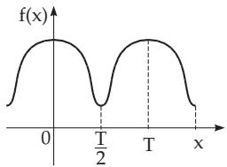
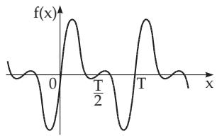
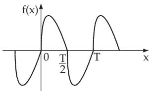
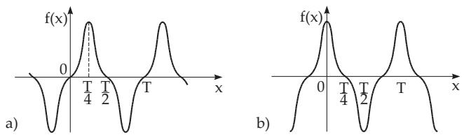
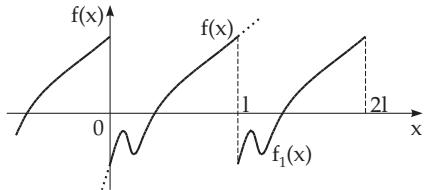
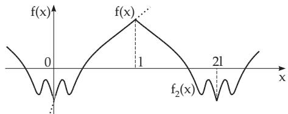
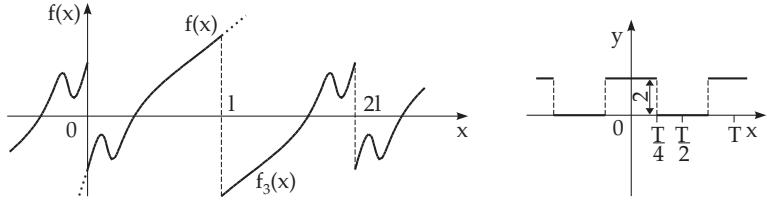

### 7.4 Fourier Series

#### 7.4.1 Trigonometric Sum and Fourier Series

##### 7.4.1.1 Basic Notions

1. Fourier Representation of Periodic Functions

Often it is necessary or useful to represent a given periodic function $f ( x )$ with period T exactly or approximatively by a sum of trigonometric functions of the form

$$
\begin{array} { c } { { s _ { n } ( x ) = \displaystyle { \frac { a _ { 0 } } { 2 } + a _ { 1 } \cos \omega x + a _ { 2 } \cos 2 \omega x + \cdot \cdot \cdot + a _ { n } \cos n \omega x } } } \\ { { + b _ { 1 } \sin \omega x + b _ { 2 } \sin 2 \omega x + \cdot \cdot \cdot + b _ { n } \sin n \omega x . } } \end{array}\tag{7.101}
$$

This is called the Fourier expansion. Here the frequency is $\omega = { \frac { 2 \pi } { T } }$ . In the case $T = 2 \pi$ holds $\omega = 1$

One can get the best approximation of $f ( x )$ in the sense given on 7.4.1.2, p. 475 by an approximation function $s _ { n } ( x )$ , where the coeficients $a _ { k }$ and $b _ { k } \ ( k = 0 , 1 , 2 , \ldots , n )$ are the Fourier coeficients of the given function. They are determined with the Euler formulas

$$
a _ { k } = \frac { 2 } { T } \int f ( x ) \cos k \omega x d x = \frac { 2 } { T } \intop _ { x _ { 0 } } ^ { x _ { 0 } + T } f ( x ) \cos k \omega x d x = \frac { 2 } { T } \intop _ { 0 } ^ { T / 2 } \left[ f ( x ) + f ( - x ) \right] \cos k \omega x d x ,\tag{7.102a}
$$

and

$$
b _ { k } = \frac { 2 } { T } \int _ { 0 } ^ { T } f ( x ) \sin k \omega x d x = \frac { 2 } { T } \intop _ { x _ { 0 } } ^ { x _ { 0 } + T } f ( x ) \sin k \omega x d x = \frac { 2 } { T } \intop _ { 0 } ^ { T / 2 } \left[ f ( x ) - f ( - x ) \right] \sin k \omega x d x ,\tag{7.102b}
$$

or approximatively with the help of methods ofharmonic analysis (see 19.6.4, p. 992).

2. Fourier Series

If there is a system of x values such that the sequence of functions $s _ { n } ( x )$ tends to a limit $s ( x )$ for $n  \infty ,$ then for the given function exists a convergent Fourier series for these x values. This can be written in the form

$$
\begin{array} { l } { { s ( x ) = { \frac { a _ { 0 } } { 2 } } + a _ { 1 } \cos \omega x + a _ { 2 } \cos 2 \omega x + \cdot \cdot \cdot + a _ { n } \cos n \omega x + \cdot \cdot \cdot + } } \\ { { \nonumber } } \\ { { \qquad + b _ { 1 } \sin \omega x + b _ { 2 } \sin 2 \omega x + \cdot \cdot \cdot + b _ { n } \sin n \omega x + \cdot \cdot \cdot . } } \end{array}\tag{7.103a}
$$

and also in the form

$$
s ( x ) = { \frac { a _ { 0 } } { 2 } } + A _ { 1 } \sin ( \omega x + \varphi _ { 1 } ) + A _ { 2 } \sin ( 2 \omega x + \varphi _ { 2 } ) + \cdots + A _ { n } \sin ( n \omega x + \varphi _ { n } ) + \cdots ,\tag{7.103b}
$$

where in the second case:

$$
A _ { k } = \sqrt { { a _ { k } } ^ { 2 } + { b _ { k } } ^ { 2 } } , \quad \tan \varphi _ { k } = \frac { a _ { k } } { b _ { k } } .\tag{7.103c}
$$

3. Complex Representation of the Fourier Series

In many cases the complex form is very useful:

$$
s ( x ) = \sum _ { k = - \infty } ^ { + \infty } c _ { k } e ^ { \mathrm { i } k \omega x } ,\tag{7.104a}
$$

$$
c _ { k } = { \frac { 1 } { T } } \int _ { 0 } ^ { T } f ( x ) e ^ { - \mathrm { i } k \omega x } d x = { \left\{ \begin{array} { l l } { { \displaystyle { \frac { 1 } { 2 } } a _ { 0 } } } & { { \mathrm { f o r ~ } } k = 0 , } \\ { { \displaystyle { \frac { 1 } { 2 } } ( a _ { k } - \mathrm { i } b _ { k } ) } } & { { \mathrm { f o r ~ } } k > 0 , } \\ { { \displaystyle { \frac { 1 } { 2 } } ( a _ { - k } + \mathrm { i } b _ { - k } ) } } & { { \mathrm { f o r ~ } } k < 0 . } \end{array} \right. }\tag{7.104b}
$$

##### 7.4.1.2 Most Important Properties of the Fourier Series

1. Least Mean Squares Error of a Function

If a function f(x) over the interval $\left[ 0 , T \right] \ \left( T = { \frac { 2 \pi } { \omega } } \right)$ is approximated by a trigonometric sum

$$
s _ { n } ( x ) = { \frac { a _ { 0 } } { 2 } } + \sum _ { k = 1 } ^ { n } a _ { k } \cos k \omega x + \sum _ { k = 1 } ^ { n } b _ { k } \sin k \omega x ,\tag{7.105a}
$$

also called the Fourier sum, then the mean square error (see 19.6.2.1, p. 984, and 19.6.4.1, 2., p. 993)

$$
F = { \frac { 1 } { T } } \int _ { 0 } ^ { T } [ f ( x ) - s _ { n } ( x ) ] ^ { 2 } d x\tag{7.105b}
$$

is smallest if one defines $a _ { k }$ and $b _ { k }$ as the Fourier coeficients (7.102a,b) of the given function.

2. Convergence of a Function in the Mean, Parseval Equation

The Fourier series converges over the interval [0, T] $( T = \frac { 2 \pi } { \omega } )$ in mean to the given function, i.e.,

$$
\int _ { 0 } ^ { T } [ f ( x ) - s _ { n } ( x ) ] ^ { 2 } d x \to 0 \quad { \mathrm { f o r } } \quad n \to \infty\tag{7.106a}
$$

holds, if the function is bounded and in the interval $0 < x < T$ it is piecewise continuous. A consequence of the convergence in the mean is the Parseval equation:

$$
{ \frac { 2 } { T } } \int _ { 0 } ^ { T } [ f ( x ) ] ^ { 2 } d x = { \frac { a _ { 0 } ^ { 2 } } { 2 } } + \sum _ { k = 1 } ^ { \infty } ( { a _ { k } } ^ { 2 } + { b _ { k } } ^ { 2 } ) .\tag{7.106b}
$$

3. Dirichlet Conditions

If the function $f ( x )$ satisfies the Dirichlet conditions, i.e.,

a) the interval of definition can be decomposed into a finite number of intervals where the function $f ( x )$ is continuous and monotone, and

b) at every point of discontinuity of $f ( x )$ the values $f ( x + 0 )$ and $f ( x - 0 )$ are defined,

then the Fourier series of this function is convergent. At the points where $f ( x )$ is continuous the sum is equal to $f ( x )$ , at the points of discontinuity the sum is equal to $\frac { f ( x - 0 ) + f ( x + 0 ) } { 2 }$

4. Asymptotic Behavior of the Fourier Coeficients

If a periodic function $f ( x )$ and its derivatives up to k-th order are continuous, then for $n \to \infty$ both expressions $a _ { n } n ^ { k + 1 }$ and $\grave { b } _ { n } \boldsymbol { n } ^ { k + 1 }$ tend to zero.

  
Figure 7.2

  
Figure 7.3

  
Figure 7.4  
7.4.2 Determination ofCoeficients for Symmetric Functions

#### 7.4.2 Determination of Coefficients for Symmetric Functions

##### 7.4.2.1 Different Kinds of Symmetries

1. Symmetry of the First Kind

If the periodic function $f ( x )$ with the period $T$ is an even function, i.e., if f(x) = f( x) (Fig. 7.2), then its Fourier coefficients are

$$
a _ { k } = \frac { 4 } { T } \intop _ { 0 } ^ { T / 2 } f ( x ) \cos k \frac { 2 \pi x } { T } d x , \quad b _ { k } = 0 \qquad ( k = 0 , 1 , 2 , \ldots ) .\tag{7.107}
$$

2. Symmetry of the Second Kind

If the periodic function $f ( x )$ with the period $T$ is an odd function, i.e., if f(x) = f( x) (Fig. 7.3), then its Fourier coeficients are

$$
a _ { k } = 0 , \quad b _ { k } = { \frac { 4 } { T } } \int _ { 0 } ^ { T / 2 } f ( x ) \sin k { \frac { 2 \pi x } { T } } d x \qquad ( k = 0 , 1 , 2 , \ldots ) .\tag{7.108}
$$

3. Symmetry of the Third Kind

If for a periodic function with the period $T$ holds $f ( x + T / 2 ) = - f ( x ) \ ( { \bf F i g . \ 7 . 4 } )$ , then the Fourier coeficients are

$$
a _ { 2 k + 1 } = \frac { 4 } { T } \intop _ { 0 } ^ { T / 2 } f ( x ) \cos ( 2 k + 1 ) \frac { 2 \pi x } { T } d x , \quad a _ { 2 k } = 0 ,\tag{7.109a}
$$

$$
b _ { 2 k + 1 } = \frac { 4 } { T } \int _ { 0 } ^ { T / 2 } f ( x ) \sin ( 2 k + 1 ) \frac { 2 \pi x } { T } d x , \quad b _ { 2 k } = 0 \quad ( k = 0 , 1 , 2 , \ldots ) .\tag{7.109b}
$$

4. Symmetry of the Fourth Kind

If the periodic function $f ( x )$ with the period $T$ is odd and also the symmetry of the third kind is satisfied (Fig. 7.5a), then the Fourier coeficients are

$$
a _ { k } = b _ { 2 k } = 0 , \quad b _ { 2 k + 1 } = \frac { 8 } { T } \intop _ { 0 } ^ { T / 4 } f ( x ) \sin ( 2 k + 1 ) \frac { 2 \pi x } { T } d x \quad ( k = 0 , 1 , 2 , \ldots ) .\tag{7.110}
$$

If the function $f ( x )$ is even and also the symmetry of the third kind is satisfied (Fig.7.5b), then the Fourier coeficients are

$$
b _ { k } = a _ { 2 k } = 0 , \quad a _ { 2 k + 1 } = \frac { 8 } { T } \intop _ { 0 } ^ { T / 4 } f ( x ) \cos ( 2 k + 1 ) \frac { 2 \pi x } { T } d x \quad ( k = 0 , 1 , 2 , \ldots ) .\tag{7.111}
$$

  
Figure 7.5

  
Figure 7.6

  
Figure 7.7

##### 7.4.2.2 Forms of the Expansion into a Fourier Series

Every function $f ( x )$ , satisfying the Dirichlet conditions in an interval $0 \le x \le l$ (see 7.4.1.2, 3., p. 475), can be expanded in this interval into a convergent series of the following forms:

$$
\begin{array} { r l r } {  { { \bf 1 . } } } & { } & { f _ { 1 } ( x ) = \displaystyle \frac { a _ { 0 } } { 2 } + a _ { 1 } \cos \frac { 2 \pi x } { l } + a _ { 2 } \cos 2 \frac { 2 \pi x } { l } + \cdot \cdot \cdot + a _ { n } \cos n \frac { 2 \pi x } { l } + \cdot \cdot \cdot } \\ & { } & { + b _ { 1 } \sin \displaystyle \frac { 2 \pi x } { l } + b _ { 2 } \sin 2 \frac { 2 \pi x } { l } + \cdot \cdot \cdot + b _ { n } \sin n \frac { 2 \pi x } { l } + \cdot \cdot \cdot . } \end{array}\tag{7.112a}
$$

The period of the function $f _ { 1 } ( x )$ is $T = l ;$ in the interval $0 ~ < ~ x ~ < ~ l$ the function $f _ { 1 } ( x )$ coincides with the function $f ( x )$ at the points of continuity $\left( \mathrm { F i g . } 7 . 6 \right)$ . At the points of discontinuity $f _ { 1 } ( x ) =$ $\frac { 1 } { 2 } [ f ( x - 0 ) + f ( x + 0 ) ]$ holds. The coeficients of the expansion are determined with the Euler formulas (7.102a,b) for $\omega = \frac { 2 \pi } { l }$

$$
{ \bf 2 . } \quad f _ { 2 } ( x ) = { \frac { a _ { 0 } } { 2 } } + a _ { 1 } \cos { \frac { \pi x } { l } } + a _ { 2 } \cos { 2 } { \frac { \pi x } { l } } + \cdots + a _ { n } \cos { n { \frac { \pi x } { l } } } + \cdots .\tag{7.112b}
$$

The period of the function $f _ { 2 } ( x )$ is $T = 2 l ;$ in the interval $0 \le x \le l$ the function $f _ { 2 } ( x )$ has a symmetry of the first kind and it coincides with the function $f ( x ) \ ( \mathbf { F i g . 7 . 7 } )$ . The coeficients of the expansion of $f _ { 2 } ( x )$ are determined by the formulas for the case of symmetry of the first kind with $T = 2 l$

$$
3 . \quad f _ { 3 } ( x ) = b _ { 1 } \sin { \frac { \pi x } { l } } + b _ { 2 } \sin 2 { \frac { \pi x } { l } } + \cdots + b _ { n } \sin n { \frac { \pi x } { l } } + \cdots .\tag{7.112c}
$$

The period of the function $f _ { 3 } ( x )$ is $T = 2 l ;$ in the interval $0 < x < l$ the function $f _ { 3 } ( x )$ has a symmetry of the second kind and it coincides with the function $f ( x ) \left( { \bf F i g . 7 . 8 } \right)$ . The coeficients of the expansion are determined by the formulas for the case of symmetry of the second kind with $T = 2 l$

#### 7.4.3 Determination of the Fourier Coefficients with Numerical Methods

If the periodic function $f ( x )$ is a complicated one or in the interval $0 \leq x < T$ its values are known only for a discrete system $x _ { k } = { \frac { k T } { N } }$ with $k = 0 , 1 , 2 , \ldots , N - 1$ , then the Fourier coeficients have to be

  
Figure 7.8  
Figure 7.9

approximated. Furthermore, e.g., also the number of measurements N can be a very large number. In these cases one uses the methods of numerical harmonic analysis (see 19.6.4, p. 992).

#### 7.4.4 Fourier Series and Fourier Integrals

1. Fourier integral

If the function f(x) satisfies the Dirichlet conditions (see 7.4.1.2, 3., p. 475) in an arbitrarily finite interval and, moreover, the integral $\int _ { - \infty } ^ { + \infty } | f ( x ) |$ dx is convergent (see 8.2.3.2, 1., p. 507), then the following formula holds (Fourier integral):

$$
f ( x ) = { \frac { 1 } { 2 \pi } } \intop _ { - \infty } ^ { + \infty } e ^ { \mathrm { i } \omega x } d \omega \intop _ { - \infty } ^ { + \infty } f ( t ) e ^ { - \mathrm { i } \omega t } d t = { \frac { 1 } { \pi } } \intop _ { 0 } ^ { \infty } d \omega \intop _ { - \infty } ^ { + \infty } f ( t ) \cos \omega ( t - x ) d t .\tag{7.113a}
$$

At the points of discontinuity can be used the substitution

$$
f ( x ) = { \frac { 1 } { 2 } } [ f ( x - 0 ) + f ( x + 0 ) ] .\tag{7.113b}
$$

2. Limiting Case of a Non-Periodic Function

The formula (7.113a) can be regarded as the expansion of a non-periodic function $f ( x )$ into a trigonometric series in the interval $( - l , + l )$ for $l  \infty$

With Fourier series expansion a periodic function with period $T$ is represented as the sum of harmonic vibrations with frequency $\omega _ { n } = n \frac { 2 \pi } { T }$ with $n = 1 , 2 , \ldots$ . and with amplitude $A _ { n }$ . This representation is based on a discrete frequency spectrum.

With the Fourier integral the non-periodic function $f ( x )$ is represented as the sum of infinitely many harmonic vibrations with continuously varying frequency $\omega .$ . The Fourier integral gives an expansion of the function $f ( x )$ into a continuous frequency spectrum. Here the frequency $\omega$ corresponds to the density $g ( \omega )$ of the spectrum:

$$
g ( \omega ) = \frac { 1 } { 2 \pi } \intop _ { - \infty } ^ { + \infty } f ( t ) e ^ { - \mathrm { i } \omega t } d t .\tag{7.113c}
$$

The Fourier integral has a simpler form if $f ( x )$ is either a) even or b) odd:

a)

$$
f ( x ) = { \frac { 2 } { \pi } } \intop _ { 0 } ^ { \infty } \cos { \omega x } d \omega \intop _ { 0 } ^ { \infty } f ( t ) \cos { \omega t } d t ,\tag{7.114a}
$$

b)

$$
f ( x ) = { \frac { 2 } { \pi } } \intop _ { 0 } ^ { \infty } \sin \omega x d \omega \intop _ { 0 } ^ { \infty } f ( t ) \sin \omega t d t .\tag{7.114b}
$$

The density of the spectrum of the even function $f ( x ) = e ^ { - | x | }$ and the representation of this function are

$$
g ( \omega ) = \frac { 2 } { \pi } \int _ { 0 } ^ { \infty } e ^ { - t } \cos \omega t d t = \frac { 2 } { \pi } \frac { 1 } { \omega ^ { 2 } + 1 } \quad ( 7 . 1 1 5 \mathrm { a } ) \quad \quad \mathrm { a n d } \quad e ^ { - | x | } = \frac { 2 } { \pi } \int _ { 0 } ^ { \infty } \frac { \cos \omega x } { \omega ^ { 2 } + 1 } d \omega .\tag{7.115b}
$$

#### 7.4.5 Remarks on theTable of Some Fourier Expansions

In Table 21.6, p. 1062 there are given the Fourier expansions of some simple functions, which are defined in a certain interval and then they are periodically extended. The shapes of the curves of the expanded functions are graphically represented.

1. Application of Coordinate Transformations

Many of the simplest periodic functions can be reduced to a function represented in Table 21.6 either by changing the scale (unit of measure) of the coordinate axis or by translation of the origin.

A function $f ( x ) = f ( - x )$ defined by the relations

$$
y = \left\{ \begin{array} { c l } { { \mathrm { 2 } } } & { { \quad \mathrm { f o r } \ 0 < x < \frac { T } { 4 } , } } \\ { { \mathrm { 0 } } } & { { \quad \mathrm { f o r } \ \frac { T } { 4 } < x < \frac { T } { 2 } } } \end{array} \right.\tag{7.116a}
$$

(Fig. 7.9), can be transformed into the form 5 given in Table 21.6, by substituting $a = 1$ and introducing the new variables $Y = y - 1$ and $X = \frac { 2 \pi x } { T } + \frac { \pi } { 2 } .$ By the substitution of the variables in series 5, because sin $( 2 n + 1 ) \left( { \frac { 2 \pi x } { T } } + { \frac { \pi } { 2 } } \right) = ( - 1 ) ^ { n } \cos ( 2 n + 1 ) { \frac { 2 \pi x } { T } }$ one gets for the function (7.116a) the expression

$$
y = 1 + { \frac { 4 } { \pi } } \left( \cos { \frac { 2 \pi x } { T } } - { \frac { 1 } { 3 } } \cos 3 { \frac { 2 \pi x } { T } } + { \frac { 1 } { 5 } } \cos 5 { \frac { 2 \pi x } { T } } - \cdots \right) .\tag{7.116b}
$$

2. Using the Series Expansion of Complex Functions

Many of the formulas given in Table 21.6 for the expansion of functions into trigonometric series can be derived from power series expansion of functions of a complex variable.

The expansion of the function

$$
{ \frac { 1 } { 1 - z } } = 1 + z + z ^ { 2 } + \cdots \qquad ( | z | < 1 )\tag{7.117}
$$

yields for

$$
z = a e ^ { \mathrm { i } \varphi }\tag{7.118}
$$

after separating the real and imaginary parts

$$
\begin{array} { r l r } { \displaystyle 1 + a \cos \varphi + a ^ { 2 } \cos 2 \varphi + \cdots + a ^ { n } \cos n \varphi + \cdots = \frac { 1 - a \cos \varphi } { 1 - 2 a \cos \varphi + a ^ { 2 } } , } & \\ { \displaystyle a \sin \varphi + a ^ { 2 } \sin 2 \varphi + \cdots + a ^ { n } \sin n \varphi + \cdots = \frac { a \sin \varphi } { 1 - 2 a \cos \varphi + a ^ { 2 } } } & { \mathrm { f o r ~ } | a | < 1 . } \end{array}\tag{7.119}
$$
