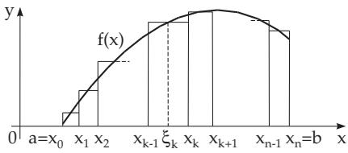
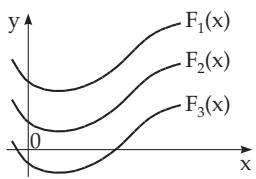
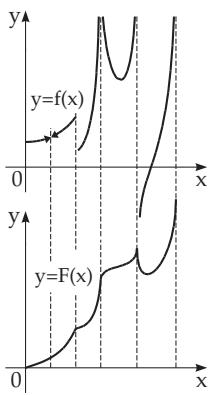

#### 8.1.1 Primitive Function or Antiderivative

1. Definition

Consider a function $y \ = \ f ( x )$ given on an interval $[ a , b ] . \ F ( x )$ is called a primitive function or antiderivative of $f ( x )$ if $F ( x )$ is diferentiable everywhere on $[ a , b ]$ and its derivative is $f ( \dot { x } )$

$$
F ^ { \prime } ( x ) = f ( x ) .\tag{8.1}
$$

Because under diferentiation of $F ( x ) + C \ \left( C \ \mathrm { c o n s t } \right)$ the additive constant disappears, a function has infinitely many primitive functions, if it has any. The diference of two primitive function is a constant. So, the graphs of all primitive functions $F _ { 1 } ( x ) , F _ { 2 } ( x ) , \dots , F _ { n } ( x )$ can be got by parallel translation of a particular primitive function in the direction of the ordinate axis (Fig. 8.2).

  
Figure 8.1

  
Figure 8.2

  
Figure 8.3

2. Existence

Every function continuous on an interval $[ a , b ]$ has a primitive function on this interval. If there are some discontinuities, then one decomposes the interval into subintervals in which the original function is continuous (Fig. 8.3). The given function $y = f ( x )$ is in the upper part of the figure; the function

$y = F ( x )$ in the lower part is a primitive function of it on the considered intervals.

##### 8.1.1.1 Indefinite Integrals

The indefinite integral of a given function f(x) is the set of primitive functions

$$
F ( x ) + C = \int f ( x ) d x .\tag{8.2}
$$

The function $f ( x )$ under the integral sign is called the integrand, x is the integration variable, and C is the integration constant. It is also a usual notation, especially in physics, to put the diferential dx right after the integral sign and so before the function $f ( \bar { x } )$

Table 8.1 Basic Integrals
<table><tr><td rowspan=1 colspan=1>Powers</td><td rowspan=1 colspan=1>Exponential Functions</td></tr><tr><td rowspan=1 colspan=1> $\int x ^ { n } d x = { \frac { x ^ { n + 1 } } { n + 1 } } \quad ( n \neq - 1 )$  $\int { \frac { d x } { x } } = \ln | x |$ </td><td rowspan=1 colspan=1> $\int e ^ { x } d x = e ^ { x }$  $\int a ^ { x } d x = { \frac { a ^ { x } } { \ln a } }$                $( a > 0 , a \neq 1 )$ </td></tr><tr><td rowspan=1 colspan=1>Trigonometric Functions</td><td rowspan=1 colspan=1>Hyperbolic Functions</td></tr><tr><td rowspan=1 colspan=1> $\int \sin { x } d x = - \cos { x }$  $\int \cos { x } d x = \sin { x }$  $\int \tan { x } d x = - \ln { \mid } \cos { x } |$  $\int \cot { x } d x = \ln { \left| \sin { x } \right| }$  $\int { \frac { d x } { \cos ^ { 2 } x } } = \tan x$  $\int { \frac { d x } { \sin ^ { 2 } x } } = - \cot x$ </td><td rowspan=1 colspan=1> $\int \sinh x d x = \cosh x$  $\int \cosh x d x = \sinh x$  $\int \operatorname { t a n h } x d x = \ln | \cosh x |$  $\int \coth x d x = \ln | \sinh x |$  $\int { \frac { d x } { \cosh ^ { 2 } x } } = \operatorname { t a n h } x$  $\int { \frac { d x } { \sinh ^ { 2 } x } } = - \coth x$ </td></tr><tr><td rowspan=1 colspan=1>Fractional Rational Functions</td><td rowspan=1 colspan=1>Irrational Functions</td></tr><tr><td rowspan=1 colspan=1> $\int { \frac { d x } { a ^ { 2 } + x ^ { 2 } } } = { \frac { 1 } { a } } \arctan { \frac { x } { a } }$  $\int { \frac { d x } { a ^ { 2 } - x ^ { 2 } } } = { \frac { 1 } { a } } \mathrm { A r t a n h } { \frac { x } { a } } = { \frac { 1 } { 2 a } } \ln \left| { \frac { a + x } { a - x } } \right|$  $( | x | < a , a > 0 )$  $\int { \frac { d x } { x ^ { 2 } - a ^ { 2 } } } = - { \frac { 1 } { a } } \mathrm { A r c o t h } { \frac { x } { a } } = { \frac { 1 } { 2 a } } \ln \left| { \frac { x - a } { x + a } } \right|$  $( | x | > a , a > 0 )$ </td><td rowspan=1 colspan=1> $\int { \frac { d x } { \sqrt { a ^ { 2 } - x ^ { 2 } } } } = \arcsin { \frac { x } { a } }$      $( \ | x | < a , a > 0 )$  $\int { \frac { d x } { \sqrt { a ^ { 2 } + x ^ { 2 } } } } = \operatorname { A r s i n h } { \frac { x } { a } } = \ln \left| x + { \sqrt { x ^ { 2 } + a ^ { 2 } } } \right|$  $( a > 0 )$  $\int { \frac { d x } { \sqrt { x ^ { 2 } - a ^ { 2 } } } } = \operatorname { A r c o s h } { \frac { x } { a } } = \ln \left| x + { \sqrt { x ^ { 2 } - a ^ { 2 } } } \right|$  $( \mathbf { \nabla } | x | > a , a > 0 )$ </td></tr></table>

##### 8.1.1.2 Integrals of Elementary Functions

1. Basic Integrals

The integration of elementary functions in analytic form is reduced to a sequence of basic integrals. These basic integrals can be got from the derivatives of well-known elementary functions, since indefinite integration means the determination of a primitive function $F ( x )$ of the function $f ( x )$

The collection of integrals given in Table 8.1 comes from reversing the diferentiation formulas in Table 6.1, p. 434 (Derivatives of elementary functions). The integration constant C is omitted.

2. General Case

For the solution of integration problems, one tries to reduce the given integral by algebraic and trigonometric transformations, or by using the integration rules to basic integrals. The integration methods given in section 8.1.2 make it possible in many cases to integrate those functions which have an elementary primitive function. The results of some integrations are collected in Table 21.7, p. 1065 (Indefinite integrals). The following remarks are very useful in integration:

a) The integration constant is mostly omitted. Exceptions are some integrals, which in diferent forms can be represented with diferent arbitrary constants.

b) If in the primitive function there is an expression containing ln $f ( x )$ , then one has to consider always ln $| f ( x ) |$ instead of it.

c) If the primitive function is given by a power series, then the function cannot be integrated in an elementary fashion.

A wide collection of integrals and their solutions are given in [8.1] and [8.2].
