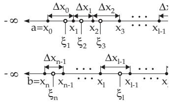
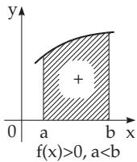
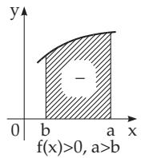
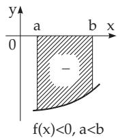
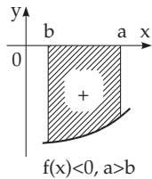
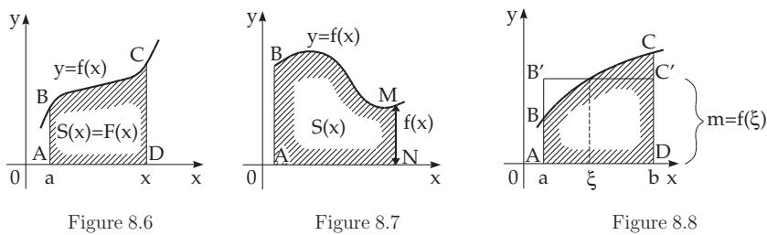
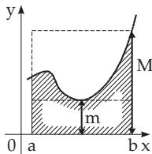
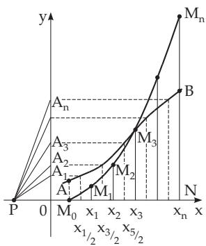

#### 8.2.1 Basic Notions, Rules and Theorems

##### 8.2.1.1 Definition and Existence of the Definite Integral

1. Definition of the Definite Integral

The definite integral of a bounded function $y = f \left( x \right)$ defined on a finite closed interval $[ a , b ]$ is a number, which is defined as a limit of a sum, where either $a < b$ can hold (case A) or $a > b$ can hold (case B). In a generalization of the notion of the definite integral (see 8.2.3, p. 506) in the following sections also functions are considered, which are defined on an arbitrary connected domain of the real line, e.g., on an open or half-open interval, on a half-axis or on the whole numerical axis, or on a domain which is only piecewise connected, i.e., everywhere, except finitely many points. These types of integrals belong to improper integrals (see 8.2.3, 1., p. 506).

2. Definite Integral as the Limit of a Sum

The notion of the definite integral is obtained by the limit given in the following procedure (see Fig. 8.1, p. 480):

  
Figure 8.4

1. Step: The interval $[ a , b ]$ is decomposed into n subintervals by the choice of $n - 1$ arbitrary points $x _ { 1 } , x _ { 2 } , \ldots , x _ { n - 1 }$ so that one of the following cases occurs:

$$
a = x _ { 0 } < x _ { 1 } < x _ { 2 } < \cdots < x _ { i } < \cdots < x _ { n - 1 } < x _ { n } = b \qquad ( { \mathrm { c a s e ~ A } } ) \quad { \mathrm { o r } } \quad\tag{8.37a}
$$

$$
a = x _ { 0 } > x _ { 1 } > x _ { 2 } > \cdots > x _ { i } > \cdots > x _ { n - 1 } > x _ { n } = b \qquad \mathrm { ( c a s e ~ B ) } .\tag{8.37b}
$$

2. Step: A point $\xi _ { i }$ is chosen in the inside or on the boundary of each subinterval as in Fig. 8.4:

$$
x _ { i - 1 } \leq \xi _ { i } \leq x _ { i } \quad ( { \mathrm { i n ~ c a s e ~ A } } ) \qquad { \mathrm { o r } } \qquad x _ { i - 1 } \geq \xi _ { i } \geq x _ { i } \quad ( { \mathrm { i n ~ c a s e ~ B } } ) .\tag{8.37c}
$$

3. Step: The value $f \left( \xi _ { i } \right)$ of the function $f \left( x \right)$ at the chosen point is multiplied by the corresponding diference $\Delta x _ { i - 1 } = x _ { i } - x _ { i - 1 } , { \mathrm { i . e . } }$ ., by the length of the subinterval taken with a positive sign in case A and taken with negative sign in case B. This step is represented in Fig. 8.1, p. 480 for the case A.

4. Step: Then all the n products $f \left( \xi _ { i } \right) \Delta x _ { i - 1 }$ are added.

5. Step: The limit of the obtained integral approximation sum or Riemann sum

$$
\sum _ { i = 1 } ^ { n } f \left( \xi _ { i } \right) \Delta x _ { i - 1 }\tag{8.38}
$$

is calculated if the length of each subinterva $\Delta x _ { i - 1 }$ tends to zero and consequently their number n tends to . Based on this, one can also denote $\Delta x _ { i - 1 }$ as an infinitesimal quantity.

If this limit exists independently of the choice of the numbers $x _ { i }$ and $\xi _ { i } ,$ then it is called the definite Riemann integral of the considered function on the given interval. One writes

$$
\int _ { a } ^ { b } f ( x ) d x = \operatorname* { l i m } _ { \stackrel { \Delta x _ { i - 1 }  0 } { n  \infty } } \sum _ { i = 1 } ^ { n } f ( \xi _ { i } ) \Delta x _ { i - 1 } .\tag{8.39}
$$

The endpoints of the interval are called limits of integration and the interval $[ a , b ]$ is the integration interval; a is the lower limit, b is the upper limit of integration; x is called the integration variable and f(x) is called the integrand.

3. Existence of the Definite Integral

The definite integral of a continuous function on $[ a , b ]$ is always defined, i.e., the limit (8.39) always exists and is independent of the choice of the numbers $x _ { i }$ and $\dot { \xi } _ { i } .$ Also for a bounded function having only a finite number of discontinuities on the interval [a, b] the definite integral exists. The function whose definite integral exists on a given interval is called an integrable function on this interval.

##### 8.2.1.2 Properties of Definite Integrals

The most important properties of definite integrals explained in the following section are presented in Table 8.5, p. 496.

1. Fundamental Theorem of Integral Calculus

If the integrand $f ( x )$ is continuous on the interval $[ a , b ]$ , and $F \left( x \right)$ is a primitive function, then

$$
\int _ { a } ^ { b } f \left( x \right) d x = \int _ { a } ^ { b } F ^ { \prime } ( x ) d x = F \left( x \right) | _ { a } ^ { b } = F \left( b \right) - F \left( a \right)\tag{8.40}
$$

holds, i.e., the calculation of a definite integral is reduced to the calculation of the corresponding indefinite integral, to the determination of the antiderivative:

$$
F \left( x \right) = \int f \left( x \right) d x + C .\tag{8.41}
$$

Remark: There are integrable functions which do not have any primitive function, but one will see that, if a function is continuous, it has a primitive function.

2. Geometric Interpretation and Rule of Signs

1. Area under a Curve Let $f \left( x \right) \geq 0$ for all x in $[ a , b ]$ . Then the sum (8.38) can be considered as the total area of the rectangles (Fig. 8.1), p. 480, which approximate the area under the curve $y = f \left( x \right)$ Therefore the limit of this sum and together with it the definite integral is equal to the area of the region A, which is bounded by the curve $y = f \left( x \right)$ , the x-axis, and the parallel lines $x = a$ and $x = b \colon$

$$
A = \int _ { a } ^ { b } f ( x ) d x \quad ( a < b { \mathrm { ~ a n d ~ } } f ( x ) \geq 0 { \mathrm { ~ f o r ~ } } a \leq x \leq b ) .\tag{8.42}
$$

2. Sign Rule If a function $y \ = \ f ( x )$ is piecewise positive or negative in the integration interval (Fig. 8.5), then the integrals over the corresponding subintervals, that is, the area parts, have positive or negative values, so the integration over the total interval yields the sum of signed areas. In Fig. 8.5a–d four cases are represented with the diferent possibilities of the sign of the area.

  
a)

b)  

  
c)

  
d)  
Figure 8.5

A: $\int _ { 0 } ^ { \pi } \sin { x } d x$ (read: Integral from $x = 0 \mathrm { ~ t o ~ } x = \pi ) = ( - \cos x | _ { 0 } ^ { \pi } = ( - \cos \pi + \cos 0 ) = 2 .$

B: $\int _ { 0 } ^ { 2 \pi } \sin { x } d x$ (read: Integral from $x = 0 \mathrm { ~ t o ~ } x = 2 \pi ) = ( - \cos | _ { 0 } ^ { 2 \pi } = ( - \cos 2 \pi + \cos 0 ) = 0 .$

3. Variable Upper Limit

1. Particular Integral If the upper limit is considered as variable (Fig. 8.6, region $A B C D )$ , then there is an area function in the form

$$
S ( x ) = \int _ { a } ^ { x } f ( t ) d t \quad ( a < b { \mathrm { ~ a n d ~ } } f ( x ) \geq 0 { \mathrm { ~ f o r ~ } } x \geq a ) .\tag{8.43}
$$

This integral is called a particular integral.

To avoid accidently confusing the variable upper limit x with the variable of the integrand, often the integration variable is denoted by t instead of x as in (8.43).

2. Diferentiation ofthe Definite Integral with Respect to the Upper Limit A definite integral with a variable upper limit $\int _ { a } ^ { x } f ( t ) d t$ , if this integral exists, is a continuous function $F ( x )$ of the upper limit. If $f ( x )$ is continuous, then $F ( x )$ is diferentiable with respect to x, i.e., it is a primitive function of the integrand. So, if $f ( x )$ is continuous on $[ a , b ]$ , and $x \in ( a , \bar { b } )$ holds

$$
F ^ { \prime } ( x ) = f ( x ) \qquad { \mathrm { o r } } \qquad { \frac { d } { d x } } { \int _ { a } ^ { x } { f ( t ) d t } } = f ( x ) .\tag{8.44}
$$

The geometrical meaning of this theorem is that the derivative of the variable area $S ( x )$ is equal to the length of the segment NM (Fig. 8.7). Here, the area, just as the length of the segment, is considered according to the sign rule (Fig. 8.5).

4. Decomposition of the Integration Interval

The interval of integration $[ a , b ]$ can be decomposed into subintervals. The value of the definite integral over the complete interval is

$$
\int _ { a } ^ { b } f ( x ) d x = \int _ { a } ^ { c } f ( x ) d x + \int _ { c } ^ { b } f ( x ) d x .\tag{8.45}
$$

This is called the interval rule. If the integrand has finitely many jumps, then the interval can be decomposed into subintervals such that on these subintervals the integrand will already be continuous. Then the integral can be calculated according to the above formula as the sum of the integrals on the subintervals.

At the endpoints of the subintervals the function must be defined by its corresponding left or right-sided limit, if it exists. If it does not, then the integral is an improper integral (see 8.2.3.3, 1., p. 509).

Remark: The formula above is valid also in the case if c is outside of the interval $[ a , b ]$ if one can suppose that the integrals on the right-hand side exist.

##### 8.2.1.3 Further Theorems about the Limits of Integration

1. Independence of the Notation of the Integration Variable

The value of a definite integral is independent of the notation of the integration variable:

$$
\int _ { a } ^ { b } f ( x ) d x = \int _ { a } ^ { b } f ( u ) d u = \int _ { a } ^ { b } f ( t ) d t .\tag{8.46}
$$

Table 8.5 Important Properties of Definite Integrals
<table><tr><td rowspan=1 colspan=1>Property</td><td rowspan=1 colspan=1>Formula</td></tr><tr><td rowspan=1 colspan=1>Fundamental theorem ofthe integral calculus $( f ( x )$ is continuous)</td><td rowspan=1 colspan=1> $\int _ { a } ^ { b } f ( x ) d x ~ = F ( x ) { \big | } _ { a } ^ { b } = F ( b ) - F ( a )$  with $F ( x ) = \int f ( x ) d x + C \mathrm { o r } F ^ { \prime } ( x ) = f ( x )$ </td></tr><tr><td rowspan=1 colspan=1>Interchange rule</td><td rowspan=1 colspan=1> $\int _ { a } ^ { b } f ( x ) d x = - \int _ { b } ^ { a } f ( x ) d x$ </td></tr><tr><td rowspan=1 colspan=1>Equal integration limits</td><td rowspan=1 colspan=1> $\int _ { a } ^ { a } f ( x ) d x = 0$ </td></tr><tr><td rowspan=1 colspan=1>Interval rule</td><td rowspan=1 colspan=1> $\int _ { a } ^ { b } f ( x ) d x = \int _ { a } ^ { c } f ( x ) d x + \int _ { c } ^ { b } f ( x ) d x$ </td></tr><tr><td rowspan=1 colspan=1>Independence of the notationof the integration variable</td><td rowspan=1 colspan=1> $\int _ { a } ^ { b } f ( x ) d x = \int _ { a } ^ { b } f ( u ) d u = \int _ { a } ^ { b } f ( t ) d t$ </td></tr><tr><td rowspan=1 colspan=1>Differentiation with respect tothe upper limit</td><td rowspan=1 colspan=1> ${ \frac { d } { d x } } \intop _ { a } ^ { x } f ( t ) d t = f ( x ) { \mathrm { ~ w i t h ~ } } f ( x ) { \mathrm { ~ c o n t i n u o u s } }$ </td></tr><tr><td rowspan=1 colspan=1>Mean value theoremof the integral calculus</td><td rowspan=1 colspan=1> $\int _ { a } ^ { b } f ( x ) d x = ( b - a ) f ( \xi ) \quad ( a < \xi < b )$ </td></tr></table>

2. Equal Integration Limits

If the lower and upper limits are equal, then the value of the integral is equal to zero:

$$
\int _ { a } ^ { a } f ( x ) d x = 0 .\tag{8.47}
$$

3. Interchange of the Integration Limits

After interchanging the limits, the integral changes the sign (interchange rule):

$$
\int _ { a } ^ { b } f ( x ) d x = - \int _ { b } ^ { a } f ( x ) d x .\tag{8.48}
$$

4. Mean Value Theorem and Mean Value

1. Mean Value Theorem If a function $f ( x )$ is continuous on the interval $[ a , b ]$ , then there is at least one value ξ in this interval such that in the case A with $a < \xi < b$ and in the case B with $a > \xi > b$ (see 8.2.1.1, 2., p. 494)

$$
\intop _ { a } ^ { b } f ( x ) d x = ( b - a ) f ( \xi )\tag{8.49}
$$

is valid.

The geometric meaning of this theorem is that between the points a and b there exists at least one point

$\xi$ such that the area of the figure ABCD is equal to the area of the rectangle $A B ^ { \prime } C ^ { \prime } D$ in Fig. 8.8. The value

$$
m = { \frac { 1 } { b - a } } \int f ( x ) d x\tag{8.50}
$$

is called the mean value or the arithmetic average ofthe function $f ( x )$ in the interval $[ a , b ]$

2. Generalized Mean Value Theorem If the functions $f ( x )$ and $\varphi ( x )$ are continuous on the closed interval $[ a , b ]$ , and $\varphi ( x )$ does not change its sign in this interval, then there exists at least one point ξ such that

$$
\int _ { a } ^ { b } f ( x ) \varphi ( x ) d x = f ( \xi ) \int _ { a } ^ { b } \varphi ( x ) d x \qquad ( a < \xi < b )\tag{8.51}
$$

is valid.

5. Estimation of the Definite Integral

The value of a definite integral lies between the values of the products of the infimum m and the supremum M of the function on the interval $[ a , b ]$ multiplied by the length of the interval:

$$
m ( b - a ) \leq \intop _ { a } ^ { b } f ( x ) d x \leq M ( b - a ) \left( a < b , f ( x ) \geq 0 \right) .\tag{8.52}
$$

If f is continuous, then m is the minimum and M is the maximum of the function. It is easy to recognize the geometrical interpretation of this theorem in Fig. 8.9.

Figure 8.9

##### 8.2.1.4 Evaluation of the Definite Integral

1. Principal Method

The principal method of calculating a definite integral is based on the fundamental theorem of integral calculus, i.e., the calculation of the indefinite integral (see 8.2.1.2, 1., p. 495), e.g., using Table 21.7 p. 1065. Before substituting the limits it must be ckecked if there is an improper integral.

Nowadays computer algebra systems can be used to determine analytically the indefinite and definite integrals (see Chapter 20).

2. Transformation of Definite Integrals

In many cases, definite integrals can be calculated by appropriate transformations, with the help of the substitution method or partial integration.

A: Using the substitution method for $I = \int _ { 0 } ^ { a } { \sqrt { a ^ { 2 } - x ^ { 2 } } } d x$

First one substitutes: $x = \varphi ( t ) = a \sin t , \ t = \psi ( x ) = \arcsin { \frac { x } { a } } , \ \psi ( 0 ) = 0 , \ \psi ( a ) = { \frac { \pi } { 2 } } .$

$$
I = \int _ { 0 } ^ { a } { \sqrt { a ^ { 2 } - x ^ { 2 } } } d x = \int _ { \arcsin 0 } ^ { \arcsin 1 } a ^ { 2 } { \sqrt { 1 - \sin ^ { 2 } t } } \cos t d t = a ^ { 2 } \int _ { 0 } ^ { \frac { \pi } { 2 } } \cos ^ { 2 } t d t = a ^ { 2 } \int _ { 0 } ^ { \frac { \pi } { 2 } } { \frac { 1 } { 2 } } ( 1 + \cos 2 t ) d t .
$$

With the further substitution $t = \varphi ( z ) = { \frac { z } { 2 } } , \ z = \psi ( t ) = 2 t , \ \psi ( 0 ) = 0 , \ \psi ( { \frac { \pi } { 2 } } ) = \pi$ the value

$I = { \frac { a ^ { 2 } } { 2 } } t | _ { 0 } ^ { \frac { \pi } { 2 } } + { \frac { a ^ { 2 } } { 4 } } \int _ { 0 } ^ { \pi } \cos z d z = { \frac { \pi a ^ { 2 } } { 4 } } + { \frac { a ^ { 2 } } { 4 } } \sin z | _ { 0 } ^ { \pi } = { \frac { \pi a ^ { 2 } } { 4 } }$ is obtained.

B: Method of partial integration: $\int _ { 0 } ^ { 1 } x e ^ { x } d x = [ x e ^ { x } ] _ { 0 } ^ { 1 } - \int _ { 0 } ^ { 1 } e ^ { x } d x = e - ( e - 1 ) = 1 .$

3. Method for Calculation of More Dificult Integrals

If the determination of an indefinite integral is too dificult and complicated, or it is not possible to express it in terms of elementary functions, then there are still some further ideas to determine the value of the integral in several cases. Here the integration of functions with complex variables is mentioned (see the examples on p. 754–757) or the theorem about the diferentiation of an integral with respect to a parameter (see 8.2.4, p. 512):

$$
{ \frac { d } { d t } } \int _ { a } ^ { b } f ( x , t ) d x = \int _ { a } ^ { b } { \frac { \partial f ( x , t ) } { \partial t } } d x .\tag{8.53}
$$

$I \ = \ \int _ { 0 } ^ { 1 } { \frac { x - 1 } { \ln x } } d x$ . Introducing the parameter t: $F ( t ) = \int _ { 0 } ^ { 1 } \frac { x ^ { t } - 1 } { \ln x } d x ; F ( 0 ) = 0 ; F ( 1 ) = I .$ Using (8.53) for $F ( t ) \colon { \frac { d F } { d t } } = \int _ { 0 } ^ { 1 } { \frac { \partial } { \partial t } } \left\lceil { \frac { x ^ { t } - 1 } { \ln x } } \right\rceil d x = \int _ { 0 } ^ { 1 } { \frac { x ^ { t } \ln x } { \ln x } } d x = \int _ { 0 } ^ { 1 } x ^ { t } d x = \left. { \frac { 1 } { t + 1 } } x ^ { t + 1 } \right| _ { 0 } ^ { 1 } = { \frac { 1 } { t + 1 } }$ Integration: $F ( t ) - F ( 0 ) = \int _ { 0 } ^ { t } { \frac { d \tau } { \tau + 1 } } = \ln ( \tau + 1 ) | _ { 0 } ^ { t } = \ln ( t + 1 )$ . Result: $I = F ( 1 ) = \ln 2 .$

4. Integration by Series Expansion

If the integrand f(x) can be expanded into a uniformly convergent series

$$
f ( x ) = \varphi _ { 1 } ( x ) + \varphi _ { 2 } ( x ) + \cdots + \varphi _ { n } ( x ) + \cdots\tag{8.54}
$$

in the integration interval [a, b], then the integral can be written in the form

$$
\int f ( x ) d x = \int \varphi _ { 1 } ( x ) d x + \int \varphi _ { 2 } ( x ) d x + \cdots + \int \varphi _ { n } ( x ) d x + \cdots .\tag{8.55}
$$

In this way the definite integral can be represented as a convergent numerical series:

$$
\int _ { a } ^ { b } f ( x ) d x = \int _ { a } ^ { b } \varphi _ { 1 } ( x ) d x + \int _ { a } ^ { b } \varphi _ { 2 } ( x ) d x + \cdots + \int _ { a } ^ { b } \varphi _ { n } ( x ) d x + \cdots .\tag{8.56}
$$

When the functions $\varphi _ { k } ( x )$ are easy to integrate, ${ \mathrm { i f } } , { \mathrm { e . g . } } , f ( x )$ can be expanded in a power series, which is uniformly convergent in the interval $[ a , b ]$ , then the integral $\int _ { a } ^ { b } f ( x )$ dx can be calculated to arbitrary accuracy.

Calculate the integral $I = \int _ { 0 } ^ { 1 / 2 } e ^ { - x ^ { 2 } }$ dx with an accuracy of 0.0001. The series $e ^ { - x ^ { 2 } } = 1 - { \frac { x ^ { 2 } } { 1 ! } } +$ ${ \frac { x ^ { 4 } } { 2 ! } } - { \frac { x ^ { 6 } } { 3 ! } } + { \frac { x ^ { 8 } } { 4 ! } } - \cdot \cdot \cdot$ is uniformly convergent in any finite interval according to the Abel theorem (see 7.3.3.1, p. 469), so $\int e ^ { - x ^ { 2 } } d x = x \left( 1 - { \frac { x ^ { 2 } } { 1 ! \cdot 3 } } + { \frac { x ^ { 4 } } { 2 ! \cdot 5 } } - { \frac { x ^ { 6 } } { 3 ! \cdot 7 } } + { \frac { x ^ { 8 } } { 4 ! \cdot 9 } } - \cdots \right)$ holds. With this result it follows that $I = \int _ { 0 } ^ { 1 / 2 } e ^ { - x ^ { 2 } } d x = { \frac { 1 } { 2 } } \left( 1 - { \frac { 1 } { 2 ^ { 2 } \cdot 1 ! \cdot 3 } } + { \frac { 1 } { 2 ^ { 4 } \cdot 2 ! \cdot 5 } } - { \frac { 1 } { 2 ^ { 6 } \cdot 3 ! \cdot 7 } } + { \frac { 1 } { 2 ^ { 8 } \cdot 4 ! \cdot 9 } } - \cdots \right)$ $= { \frac { 1 } { 2 } } \left( 1 - { \frac { 1 } { 1 2 } } + { \frac { 1 } { 1 6 0 } } - { \frac { 1 } { 2 6 8 8 } } + { \frac { 1 } { 5 5 2 9 6 } } - \cdot \cdot \cdot \right)$ . To achieve the accuracy 0.0001 for the calculation of the integral it is enough to consider the first four terms, according to the theorem of Leibniz about alternating series (see 7.2.3.3, 1., p. 463):

$$
I \approx { \frac { 1 } { 2 } } ( 1 - 0 . 0 8 3 3 3 + 0 . 0 0 6 2 5 - 0 . 0 0 0 3 7 ) = { \frac { 1 } { 2 } } \cdot 0 . 9 2 2 5 5 = 0 . 4 6 1 2 7 , \ \int _ { 0 } ^ { 1 / 2 } e ^ { - x ^ { 2 } } d x = 0 . 4 6 1 3 .
$$

5. Graphical Integration

Graphical integration is a graphical method to integrate a function $y = f ( x )$ which is given by a curve AB (Fig. 8.10), i.e., to calculate graphically the integral $\int _ { a } ^ { b } f ( x ) d x$ , the area of the region $M _ { 0 } A B N$ :

  
Figure 8.10

1. The interval $\overline { { M _ { 0 } N } }$ is divided by the points $x _ { 1 / 2 } , x _ { 1 } , x _ { 3 / 2 } , x _ { 2 } , \dotsc , x _ { n - 1 } , x _ { n - 1 / 2 }$ into 2n equal parts, where the result is more accurate if there are more points of division.

2. At the points of division $x _ { 1 / 2 } , x _ { 3 / 2 } , \dotsc , x _ { n - 1 / 2 }$ one draws vertical lines intersecting the curve. The ordinate values of the segments are denoted on the y-axis by ${ \overline { { O A _ { 1 } } } } , { \overline { { O A _ { 2 } } } } , \dots , { \overline { { O A _ { n } } } }$

3. A segment $\overline { { O P } }$ of arbitrary length is placed on the negative x-axis, and $P$ is connected with the points $A _ { 1 } , A _ { 2 } , \ldots , A _ { n }$

4. Through the point $M _ { 0 }$ a line segment is drawn parallel to $P A _ { 1 }$ to the intersection point with the line $x = x _ { 1 }$ ; this is the segment $\overline { { M _ { 0 } M _ { 1 } } }$ . Through the point $M _ { 1 }$ the segment $\overline { { M _ { 1 } M _ { 2 } } }$ is drawn parallel to $P A _ { 2 }$ to the intersection with the line $x = x _ { 2 }$ , etc., until the last point $M _ { n }$ is reached with the abscissa $x _ { n }$

The integral is numerically equal to the product of the length of $\overline { { O P } }$ and the length of $\overrightarrow { N M _ { n } }$

$$
\int _ { a } ^ { b } f ( x ) d x \approx { \overline { { O P } } } \cdot { \overline { { N M _ { n } } } } .\tag{8.57}
$$

By a suitable choice of the arbitrary segment $\overline { { O P } }$ the extent of the graph can be influenced; the smaller the graph is wanted, the longer the segment $\overline { { O P } }$ should be chosen . $\mathrm { I f } \overline { { O P } } = 1$ , then $\int _ { a } ^ { b } f ( x ) d x = { \overline { { N M _ { n } } } }$ and the broken line $M _ { 0 } , M _ { 1 } , M _ { 2 } , \ldots , M _ { n }$ represents approximately the graph of a primitive function of f(x), i.e., one of the functions given by the indefinite integral $\int f ( x ) d x$

6. Planimeter and Integraph

A planimeter is a tool to find the area bounded by a closed plane curve, thus also to compute a definite integral of a function $y = f ( x )$ given by the curve. Special types of planimeter can evaluate not only y dx, but also $\int y ^ { 2 }$ dx and $\int y ^ { 3 } d x$

An integraph is a device which can be used to draw the graph of a primitive function $Y = \int _ { a } ^ { x } f ( t )$ dt if the graph of a function $y = f ( x )$ is given (see [19.30]).

7. Numerical Integration

If the integrand of a definite integral is too complicated, or the corresponding indefinite integral cannot be expressed by elementary functions, or the values of the function are known only at discrete points, e.g., from a table of values, then the so-called quadrature formulas or other methods of numerical mathematics are used (see 19.3.1, p. 963).
