#### 8.2.2 Applications of Definite Integrals

##### 8.2.2.1 General Principle for Applications of the Definite Integral

1. The quantity A to be determined is decomposed into a large number of very small quantities, i.e., into infinitesimal quantities:

$$
A = a _ { 1 } + a _ { 2 } + \cdots + a _ { n } .\tag{8.58}
$$

2. Every one of these infinitesimal quantities $a _ { i }$ is replaced by a quantity $\tilde { a } _ { i } .$ , which difers only very slightly in value from $a _ { i }$ , but which can be integrated by known formulas. Here the error $\alpha _ { i } = a _ { i } - \tilde { a } _ { i }$ should be an infinitesimal quantity of higher order than $a _ { i }$ and $\tilde { a } _ { i }$

3. Representation of $\tilde { a } _ { i }$ by a variable x and a function $f ( x )$ so that $\tilde { a } _ { i }$ has the form $f ( x _ { i } ) \Delta x _ { i }$

4. Evaluation of the desired quantity as the limit of the sum

$$
A = \operatorname* { l i m } _ { n \to \infty } \sum _ { i = 1 } ^ { n } { \tilde { a } } _ { i } = \operatorname* { l i m } _ { n \to \infty } \sum _ { i = 1 } ^ { n } f ( x _ { i } ) \Delta x _ { i } = \int _ { a } ^ { b } f ( x ) d x ,\tag{8.59}
$$

where $\Delta x _ { i } \geq 0$ holds for every i. The lower and upper limit for x is denoted by a and b.

Evaluating the volume V of a pyramid with base area S and height $H \ ( \mathbf { F i g . 8 . 1 1 a - c } )$

a) Decomposition of the required volume V by plane sections into frustums (Fig. 8.11a): $V = v _ { 1 } +$ $v _ { 2 } + \cdots + v _ { n }$

b) Replacing every frustum by a prism, whose volume is $\tilde { v } _ { i } .$ , with the same height and with a base area of the top base of the frustum (Fig. 8.11b). The diference of their volumes is an infinitesimal quantity of higher order than $v _ { i }$

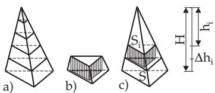  
Figure 8.11

c) Representation of the volume $\tilde { v } _ { i }$ in the form $\tilde { v } _ { i } = S _ { i } \Delta h _ { i }$ where $h _ { i } \ ( \mathbf { F i g . 8 . 1 1 c } )$ is the distance of the top surface from the vertex of the pyramid. Since $S _ { i } : S = \tilde { h } _ { i } ^ { 2 } : H ^ { 2 }$ one can write: $\tilde { v } _ { i } = \frac { S h _ { i } ^ { 2 } } { H ^ { 2 } } \Delta h _ { i }$

d) Calculation of the limit of the sum

$$
V = \operatorname* { l i m } _ { n \to \infty } \sum _ { i = 1 } ^ { n } { \tilde { v } } _ { i } = \operatorname* { l i m } _ { n \to \infty } \sum _ { i = 1 } ^ { n } { \frac { S h _ { i } ^ { 2 } } { H ^ { 2 } } } \Delta h _ { i } = \int _ { 0 } ^ { H } { \frac { S h ^ { 2 } } { H ^ { 2 } } } d h = { \frac { S H } { 3 } } .
$$

##### 8.2.2.2 Applications in Geometry

1. Area of Planar Figures

1. Area of a Curvilinear Trapezoid Between B and C (Fig. 8.12a) if the curve is given by an equation in explicit form $( y = f ( x )$ and $a \leq x \leq b )$ or in parametric form $( x = x ( t ) , \ y = y ( t ) , \ t _ { 1 } \leq$ $t \leq t _ { 2 } )$

$$
S _ { \mathrm { A B C D } } = \int _ { a } ^ { b } f ( x ) d x = \int _ { t _ { 1 } } ^ { t _ { 2 } } y ( t ) x ^ { \prime } ( t ) d t \left( f ( x ) \geq 0 ; x ( t _ { 1 } ) = a ; x ( t _ { 2 } ) = b ; y ( t ) \geq 0 \right) .\tag{8.60a}
$$

2. Area of a Curvilinear Trapezoid Between G and H (Fig. 8.12b) if the curve is given by an equation in explicit form $( x = g ( y )$ and $\alpha \leq y \leq \beta )$ or in parametric form $( x = x ( t ) , \ y = y ( t ) , \ t _ { 1 } \leq$ $t \leq t _ { 2 } )$ :

$$
S _ { \mathrm { E F G H } } = \int _ { \alpha } ^ { \beta } g ( y ) d y = \int _ { t _ { 1 } } ^ { t _ { 2 } } x ( t ) y ^ { \prime } ( t ) d t \left( g ( y ) \geq 0 ; y ( t _ { 1 } ) = \alpha ; y ( t _ { 2 } ) = \beta ; x ( t ) \geq 0 \right) .\tag{8.60b}
$$

3. Area of a Curvilinear Sector (Fig. 8.12c), bounded by a curve between K and L, which is given by an equation in polar coordinates $( \rho = \rho ( \varphi ) , \varphi _ { 1 } \leq \varphi \leq \varphi _ { 2 } )$

$$
S _ { \mathrm { O K L } } = \frac { 1 } { 2 } \int _ { \varphi _ { 1 } } ^ { \varphi _ { 2 } } \rho ^ { 2 } d \varphi .\tag{8.60c}
$$

Areas of more complicated figures can be calculated by partition of the area into simple parts, or by line integrals (see 8.3, p. 515) or by double integrals (see 8.4.1, p. 524).

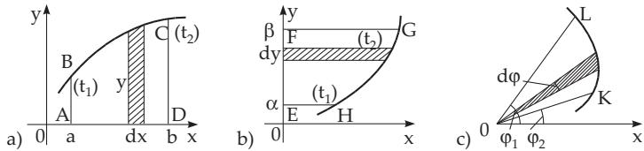  
Figure 8.12

2. Arc-length of Plane Curves

1. Arc-length of a Curve Between Two Points (I) A and B, given in explicit form $( y = f ( x )$ or $x = g ( y ) )$ or in parametric form $( x = x ( t ) , y = y ( t ) )$ (Fig. 8.13a) can be calculated by the integrals:

$$
L _ { \widehat { A B } } = \int _ { a } ^ { b } { \sqrt { 1 + [ f ^ { \prime } ( x ) ] ^ { 2 } } } d x = \int _ { a } ^ { \beta } { \sqrt { [ g ^ { \prime } ( y ) ] ^ { 2 } + 1 } } d y = \int _ { t _ { 1 } } ^ { t _ { 2 } } { \sqrt { [ x ^ { \prime } ( t ) ] ^ { 2 } + [ y ^ { \prime } ( t ) ] ^ { 2 } } } d t .\tag{8.61a}
$$

With the diferential of the arc-length dl one gets

$$
L = \int d l \quad \quad \mathrm { w i t h } \quad \quad d l ^ { 2 } = d x ^ { 2 } + d y ^ { 2 } .\tag{8.61b}
$$

The perimeter of the ellipse with the help of (8.61a): With the substitutions $x = x ( t ) = a$ sin t, $y =$ y(t) = b cos t it follows that $L _ { \widehat { A B } } \ = \ \int _ { t _ { 1 } } ^ { t _ { 2 } } \sqrt { a ^ { 2 } - ( a ^ { 2 } - b ^ { 2 } ) \sin ^ { 2 } t } d t \ = \ a \int _ { t _ { 1 } } ^ { t _ { 2 } } \sqrt { 1 - e ^ { 2 } \sin ^ { 2 } t } d t$ , where $e = \sqrt { a ^ { 2 } - b ^ { 2 } } / a$ is the numerical eccentricity of the ellipse.

Since $x = 0$ , y = b and x = a, y = 0 the limits of the integral in the first quadrant are $t _ { 1 } = 0$ and $t _ { 2 } = \pi / 2$ so, for the perimeter of the ellipse holds $L _ { \widehat { A B } } = 4 a \int _ { 0 } ^ { \pi / 2 } \sqrt { 1 - e ^ { 2 } \sin ^ { 2 } t } d t = a E ( k , \frac { \pi } { 2 } )$ with $k = e$ . The value of the integral $E ( k , \frac { \pi } { 2 } )$ is given in Table 21.9 (see example in 8.1.4.3, p. 491).

2. Arc-length of a Curve Between Two Points (II) C and D, given in polar coordinates $( \rho = \rho ( \varphi ) )$ (Fig. 8.13b):

$$
L { \widehat { _ { C D } } } = \int _ { \varphi _ { 1 } } ^ { \varphi _ { 2 } } { \sqrt { \rho ^ { 2 } + \left( { \frac { d \rho } { d \varphi } } \right) ^ { 2 } } } d \varphi .\tag{8.61c}
$$

With the diferential of the arc-length dl one gets

$$
L = \int d l \quad { \mathrm { w i t h } } \quad d l ^ { 2 } = \rho ^ { 2 } d \varphi ^ { 2 } + d \rho ^ { 2 } .\tag{8.61d}
$$

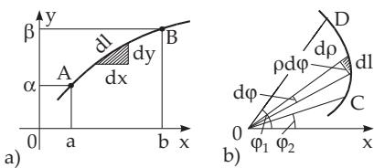  
Figure 8.13

3. Surface Area of a Body of Revolution (see also First Guldin Rule, p. 506)

1. The area of the surface of a body given by rotating the graph of the function $y = f ( x ) \geq 0$ around the x-axis (Fig. 8.14a) is:

$$
S = 2 \pi \intop _ { a } ^ { b } y d l = 2 \pi \intop _ { a } ^ { b } y ( x ) { \sqrt { 1 + \left( { \frac { d y } { d x } } \right) ^ { 2 } } } d x .\tag{8.62a}
$$

2. The area of the surface of a body given by rotating $x = f ( y ) \geq 0$ around the y-axis (Fig. 8.14b) is:

$$
S = 2 \pi \intop _ { \alpha } ^ { \beta } x d l = 2 \pi \intop _ { \alpha } ^ { \beta } x ( y ) { \sqrt { \left( 1 + { \frac { d x } { d y } } \right) ^ { 2 } } } d y .\tag{8.62b}
$$

3. To calculate the area of more complicated surfaces see the application of double integrals in 8.4.1.3, p. 527 and the application of surface integrals of the first kind, 8.5.1.3, p. 535. General formulas for the calculation of surface areas with double integrals are given in Table 8.9 (Applications of double integrals), p. 528.

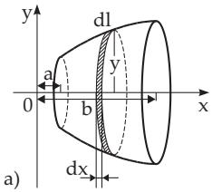

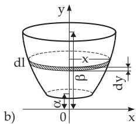  
Figure 8.14

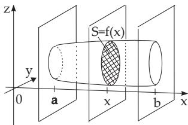  
Figure 8.15

4. Volume (see also Second Guldin Rule, p. 506)

1. The volume of a rotationally symmetric body given by rotation around the x-axis (Fig. 8.14a) is:

$$
V = \pi \int _ { a } ^ { b } y ^ { 2 } d x .\tag{8.63a}
$$

2. The volume of a rotationally symmetric body given by rotation around the y-axis (Fig. 8.14b) is:

$$
V = \pi \int _ { a } ^ { b } x ^ { 2 } d y .\tag{8.63b}
$$

3. The volume of a body, whose section perpendicular to the x-axis (Fig. 8.15) has an area given by the function $S = f ( x )$ , is:

$$
V = \int _ { a } ^ { b } f ( x ) d x .\tag{8.64a}
$$

Calculation of the volume of an ellipsoid of revolution centered at the origin. Since the ellipsoid of revolution $x ^ { 2 } / a ^ { 2 } + y ^ { 2 } / b ^ { 2 } + z ^ { 2 } / c ^ { 2 } = \overset { \cdot } { \mathrm { 1 } }$ (see (3.412), 3.5.3.13,2., p. 224 and Fig.8.16) with $a = c$ arises by rotating the ellipse $y ^ { 2 } / \dot { b } ^ { 2 } + z ^ { 2 } / c ^ { 2 } = 1$ about the y-axis, the area of the circle shaped crosssections being parallel to the x, z-plane is $S = f ( y ) = \pi z ^ { 2 } = \pi c ^ { 2 } ( 1 - y ^ { 2 } / b ^ { 2 } )$ , so by integration $V =$ $2 \pi c ^ { 2 } \ : \int _ { 0 } ^ { b } ( 1 - y ^ { 2 } / b ^ { 2 } ) d y = ( 4 / 3 ) \pi b c ^ { 2 }$

4. Cavalieri Principle If in the interval $[ a , b ]$ there exists in addition to a cross-sectional area function $S = f ( x )$ a second cross-sectional area function ${ \overline { { S } } } = { \overline { { f } } } ( x )$ which has the same value for every x as f(x), then the volumes V according to (8.64a) and $\overline { V }$ according to (8.64b) are equal:

$$
\overline { { V } } = \int _ { a } ^ { b } \overline { { f } } ( x ) = V .\tag{8.64b}
$$

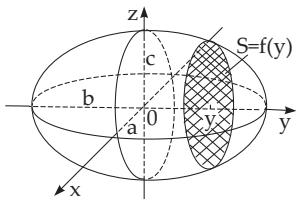  
Figure 8.16

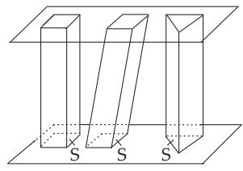  
Figure 8.17

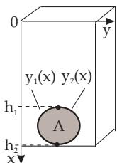  
Figure 8.18

The original Cavalieri’s principle tells: If two bodies are bounded below and above by two parallel planes and in these planes and in every plane being parallel to these ones their cross-sectional areas are equal to each other, then the volumes of these bodies are also equal (Fig.8.17).

5. Tables General formulas to calculate volumes with multiple integrals are given in Table 8.9 (Applications of double integrals, see p. 528) and Table 8.11 (Applications of triple integrals, see p. 533).

##### 8.2.2.3 Applications in Mechanics and Physics

1. Distance Traveled by a Point

The distance traveled by a moving point during the time from $t _ { 0 }$ until T with a time-dependent velocity $v = f ( t )$ is

$$
s = \int _ { t _ { 0 } } ^ { T } v d t .\tag{8.65}
$$

2. Work

The work in moving a body in a force field depends of the direction of motion. Here it is supposed that the direction of the field and the direction of the movement are constant and coincide along the x-axis. If the magnitude of the force $\vec { F }$ is changing, i.e., $| \vec { F } | = f ( x )$ , then the work W necessary to move the body from the point $x = a$ to the point $x = b$ along the x-axis is

$$
W = \int _ { a } ^ { b } f ( x ) d x .\tag{8.66}
$$

In the general case, when the direction of the force field and the direction of the movement are not coincident, the work is calculated as a line integral (see (8.130), p. 522) of the scalar product of the force and the variation of the position vector at every point ofr along the given path.

3. Gravitational and Lateral Pressure

In a fluid at rest in the gravitational field of the Earth with a density  and gravitational acceleration $g$ (see Table 21.2, p. 1053) the gravitational pressure p and the lateral pressure $p _ { s }$ are distinguished. The gravitational pressure p at a depth x under the surface of the fluid (see Fig.8.18) is

$$
p = \varrho g x .\tag{8.67a}
$$

The lateral pressure $p _ { s }$ acting e.g. on a cover plate (surface area A) of a side opening of a container (see Fig.8.18), is caused by the pressure force F acting in all directions. The diferential pressure force dF acting perpendicular on a side surface-element dA in depth x under the surface of the fluid is

$$
\begin{array} { r } { d F = \varrho g x d A = \varrho g x y ( x ) d x . } \end{array}\tag{8.67b}
$$

Integration and division by A yields

$$
p _ { s } = { \frac { \varrho g } { A } } \int _ { h _ { 1 } } ^ { h _ { 2 } } x ( y _ { 2 } ( x ) - y _ { 1 } ( x ) ) d x = \varrho g x _ { C } .\tag{8.67c}
$$

Functions $y _ { 1 } ( x )$ and $y _ { 2 } ( x )$ describe the left and right boundaries of the cover plate and $x _ { \mathrm { C } }$ is the $x -$ coordinate of its center of mass (see center of gravity of planar figures paragraph 5., p. 505).

Remark: The center of mass of the cover plate usually does not coincide with the point of impact of pressure force F since the lateral pressure force is proportional to x .

4. Moments of Inertia

1. Moment of Inertia of an Arc The moment of inertia of a homogeneous curve segment $y = f ( x )$ with constant density  in the interval $[ a , b ]$ with respect to the y-axis (Fig. 8.19a) is:

$$
I _ { y } = \varrho \int _ { a } ^ { b } x ^ { 2 } d l = \varrho \int _ { a } ^ { b } x ^ { 2 } \sqrt { 1 + ( y \prime ) ^ { 2 } } d x .\tag{8.68}
$$

If the density is a function $\varrho ( x )$ , then its analytic expression is in the integrand.

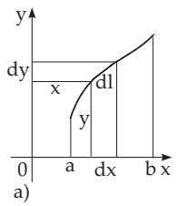

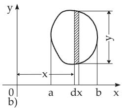

2. Moment ofInertia ofa Planar Figure The moment of inertia of a planar figure with a homogeneous density $\varrho$ with respect to the y-axis, where y is the length of the cut parallel to the y-axis (Fig. 8.19b), is:

$$
I _ { y } = \varrho \int _ { a } ^ { b } x ^ { 2 } y d x .\tag{8.69}
$$

Figure 8.19  
(See also Table 8.9, (Applications of the Double Integral), p. 528.) If the density is position dependent, then its analytic expression must be in the integrand.  
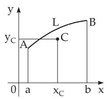  
a)

b)  
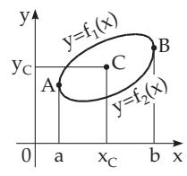

c)  
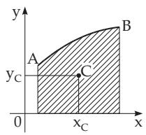

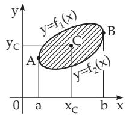  
d)  
Figure 8.20

5. Center of Gravity, Guldin Rules

1. Center of Gravity of an Arc Segment The center of gravity $C$ of an arc segment of a homogeneous plane curve $y = f ( x )$ in the interval $[ a , b ]$ with a length L (Fig. 8.20a) considering (8.61a), p. 502, has the coordinates:

$$
x _ { C } = \frac { \displaystyle \int _ { a } ^ { b } x \sqrt { 1 + y ^ { \prime 2 } } d x } { L } , \qquad \quad \quad y _ { C } = \frac { \displaystyle \int _ { a } ^ { b } y \sqrt { 1 + y ^ { \prime 2 } } d x } { L } .\tag{8.70}
$$

2. Center of Gravity of a Closed Curve The center of gravity C of a closed curve $y \ = \ f ( x )$ (Fig. 8.20b) with the equations $y _ { 1 } = f _ { 1 } ( x )$ for the upper part and ${ \dot { y } } _ { 2 } = f _ { 2 } ( x )$ for the lower part, and with a length L has the coordinates:

$$
x _ { C } = \frac { \displaystyle { \int } ^ { b } x ( \sqrt { 1 + ( y _ { 1 } ^ { \prime } ) ^ { 2 } } + \sqrt { 1 + ( y _ { 2 } ^ { \prime } ) ^ { 2 } } ) d x } { L } , \qquad y _ { C } = \frac { \displaystyle { \int } ^ { b } ( y _ { 1 } \sqrt { 1 + ( y _ { 1 } ^ { \prime } ) ^ { 2 } } + y _ { 2 } \sqrt { 1 + ( y _ { 2 } ^ { \prime } ) ^ { 2 } } ) d x } { L } .\tag{8.71}
$$

3. First Guldin Rule Suppose a plane curve segment is rotated around an axis which lies in the plane of the curve and does not intersect the curve. Choosing it as the x-axis the surface area $S _ { \mathrm { r o t } }$ of the body generated by the rotated curve segment is the product of the perimeter of the circle drawn by the center of gravity at a distance $r _ { C }$ from the axis of rotation, i.e., $2 \pi r _ { C }$ , and the length of the curve segment $L ;$

$$
S _ { \mathrm { r o t } } = L \cdot 2 \pi r _ { C } .\tag{8.72}
$$

4. Center ofGravity ofa Trapezoid The center of gravity C of a homogeneous trapezoid bounded above by a curve segment between the points of the curve A and B (Fig. 8.20c), with an area S of the trapezoid, and with the equation $y = f ( x )$ of the curve segment AB, has the coordinates:

$$
\begin{array} { r l r } { \displaystyle { x _ { C } = \frac { a } { S } , \qquad } } & { { } \displaystyle { y _ { C } = \frac { \frac { b } { 2 } \int y ^ { 2 } d x } { S } . } } \end{array}\tag{8.73}
$$

5. Center of Gravity of an Arbitrary Planar Figure The center of gravity C of an arbitrary planar figure (Fig. 8.20d) with area S, bounded above and below by the curve segments with the equations $y _ { 1 } = f _ { 1 } ( x )$ and ${ \dot { y } } _ { 2 } = f _ { 2 } ( x )$ , has the coordinates

$$
x _ { C } = { \frac { \displaystyle { \int _ { a } ^ { b } } x ( y _ { 1 } - y _ { 2 } ) d x } { S } } , \qquad y _ { C } = { \frac { \displaystyle { \frac { 1 } { 2 } } { \int _ { a } ^ { b } } ( y _ { 1 } ^ { 2 } - y _ { 2 } ^ { 2 } ) d x } { S } } .\tag{8.74}
$$

Formulas to calculate the center of gravity with multiple integrals are given in Table 8.9 (Applications of double integrals, p. 528) and in Table 8.11 (Applications of triple integrals, p. 533).

6. Second Guldin Rule Suppose a plane figure is rotated around an axis which is in the plane of the figure and does not intersect it. Choosing it as the x-axis the volume V of the body generated by the rotated figure is equal to the product of the perimeter of the circle drawn by the center of gravity under the rotation, i.e., $2 \pi r _ { C }$ , and the area of the figure S:

$$
V _ { \mathrm { r o t } } = S \cdot 2 \pi r _ { C } .\tag{8.75}
$$
