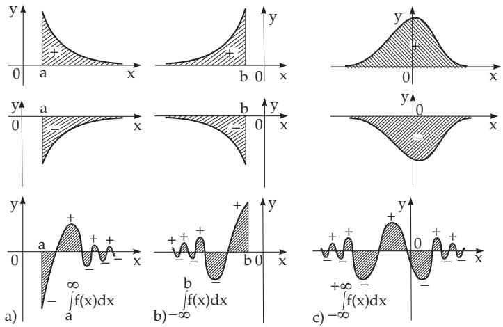
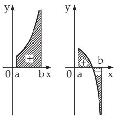
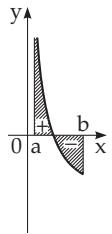
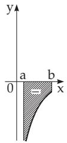
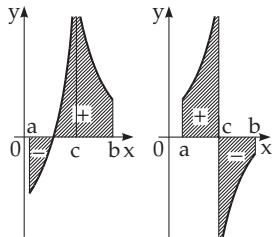

#### 8.2.3 Improper Integrals, Stieltjes and Lebesgue Integrals

##### 8.2.3.1 Generalization of the Notion of the Integral

The notion of the definite integral (see 8.2.1.1, p. 493), as a Riemann integral (see 8.2.1.1, 2., p. 494), was introduced under the assumptions that the function $f ( x )$ is bounded, and the interval [a, b] is closed and finite. Both assumptions can be relaxed in the generalizations of the Riemann integral. Some of them are mentioned in the following section.

1. Improper Integrals

These are the generalization of the integral to unbounded functions and to unbounded intervals. In the next paragraphs integrals with infinite integration limits and integrals with unbounded integrands are discussed.

2. Stieltjes Integral for Functions of One Variable

Considering two finite functions $f ( x )$ and $g ( x )$ defined on the finite interval $[ a , b ]$ and decomposing the interval into subintervals, just as with the Riemann integral, but instead of the Riemann sum (8.38)

the following sum is constructed:

$$
\sum _ { i = 1 } ^ { n } f ( \xi _ { i } ) [ g ( x _ { i } ) - g ( x _ { i - 1 } ) ] .\tag{8.76}
$$

If the limit of (8.76) exists, when the length of the subintervals tends to zero, and it is independent of the choice of the points $x _ { i }$ and $\xi _ { i } .$ , then this limit is called a definite Stieltjes integral (see also [8.8]).

For $g ( x ) = x$ the Stieltjes integral becomes the Riemann integral.

3. Lebesgue Integral

Another generalization of the integral notion is connected with measure theory (see 12.9, p. 693), where the measure of a set, measure spaces, and measurable functions are introduced. In functional analysis the Lebesgue integral is defined (see 12.9.3.2, p. 696) based on these notions (see [8.6]). The generalization with comparison to the Riemann integral is, e.g., the domain of integration can be a rather general subset of $\mathbb { R } ^ { n }$ and it is partitioned into measurable subsets.

There are diferent notations for the generalizations of the integrals (see [8.8]).

##### 8.2.3.2 Integrals with Infinite Integration Limits

1. Definitions

a) If the integration domain is the closed half-axis $[ a , + \infty )$ , and if the integrand is defined there, then the integral is by definition

$$
\int _ { a } ^ { + \infty } f ( x ) d x = \operatorname* { l i m } _ { B \to \infty } \intop _ { a } ^ { B } f ( x ) d x .\tag{8.77}
$$

If the limit exists, then the integral is called a convergent improper integral. If the limit does not exist, then the improper integral (8.77) is divergent.

b) If the domain of a function is the closed half-axis $( - \infty , b ]$ or the whole real axis $( - \infty , + \infty )$ , then one defines analogously the improper integrals

$$
\int _ { - \infty } ^ { b } f ( x ) d x = \operatorname* { l i m } _ { A \to - \infty } \int _ { A } ^ { b } f ( x ) d x , \qquad ( 8 . 7 8 \mathrm { a } ) \qquad \int _ { - \infty } ^ { + \infty } f ( x ) d x = \operatorname* { l i m } _ { A \to - \infty } \int _ { A } ^ { B } f ( x ) d x .\tag{8.78b}
$$

c) At the limits of (8.78b) the numbers A and B tend to infinity independently of each other. If the limit (8.78b) does not exist, but the limit

$$
\operatorname* { l i m } _ { A \to \infty } \int f ( x ) d x ,\tag{8.78c}
$$

exists, then this limit (8.78c) is called the principal value of the improper integral, or Cauchy’s principal value.

Remark: An obviously necessary but not suficient condition for the convergence of the integral (8.77) is $\operatorname* { l i m } _ { x \to \infty } f ( x ) = 0$

2. Geometrical Meaning of Integrals with Infinite Limits

The integrals (8.77), (8.78a) and (8.78b) give the area of the figures represented in Fig. 8.21.

$$
\equiv \mathrm { A } \mathrm { : } \int _ { 1 } ^ { \infty } { \frac { d x } { x } } = \operatorname* { l i m } _ { B \to \infty } \int _ { 1 } ^ { B } { \frac { d x } { x } } = \operatorname* { l i m } _ { B \to \infty } \ln B = \infty { \mathrm { ( d i v e r g e n t ) } } .
$$

$$
\mathbf { B } \colon \int _ { 2 } ^ { \infty } { \frac { d x } { x ^ { 2 } } } = \operatorname* { l i m } _ { B \to \infty } \int _ { 2 } ^ { B } { \frac { d x } { x ^ { 2 } } } = \operatorname* { l i m } _ { B \to \infty } \left( { \frac { 1 } { 2 } } - { \frac { 1 } { B } } \right) = { \frac { 1 } { 2 } } \left( { \mathrm { c o n v e r g e n t } } \right) .
$$

C: +∞ dx 2 = lim  B dx 2 = lim [arctan B − arctan A] = π π = π (convergent). →−∞B + →−∞B +

  
Figure 8.21

3. Suficient Criteria for Convergence

If the direct calculation of the limits (8.77), (8.78a) and (8.78b) is complicated, or if only the convergence or divergence of an improper integral is the question, then one of the following suficient criteria can be used. Here, only the integral (8.77) is considered. The integral (8.78a) can be transformed into (8.77) by substitution of x by x:

$$
\int _ { - \infty } ^ { a } f ( x ) d x = \int _ { - a } ^ { + \infty } f ( - x ) d x .\tag{8.79}
$$

The integral (8.78b) can be decomposed into the sum of two integrals of type (8.77) and (8.78a):

$$
\int _ { - \infty } ^ { + \infty } f ( x ) d x = \int _ { - \infty } ^ { c } f ( x ) d x + \int _ { c } ^ { + \infty } f ( x ) d x ,\tag{8.80}
$$

where c is an arbitrary number.

Criterion 1: If f is integrable in any finite interval of $[ a , \infty )$ , and if the integral

$$
\int _ { a } ^ { + \infty } \mid f ( x ) \mid d x\tag{8.81}
$$

is convergent, then also the integral (8.77) is convergent. In this case the integral (8.77) is called absolutely convergent, and the function f(x) is absolute integrable on the half-axis $[ a , + \infty )$

Criterion 2: If for the functions $f ( x )$ and $\varphi ( x )$

$$
f ( x ) > 0 , \varphi ( x ) > 0 \mathrm { a n d } f ( x ) \leq \varphi ( x ) \mathrm { f o r } a \leq x < + \infty\tag{8.82a}
$$

hold, then from the convergence of the integral

$$
\int _ { a } ^ { + \infty } \varphi ( x ) d x \qquad \mathrm { ( 8 . 8 2 b ) } \qquad \mathrm { t h e ~ c o n v e r g e n c e ~ o f ~ t h e ~ i n t e g r a l } \quad \int _ { a } ^ { + \infty } f ( x ) d x\tag{8.82c}
$$

follows, and conversely, from the divergence of the integral (8.82c) the divergence of the integral (8.82b) follows.

Criterion 3: Substituting (8.83a) and considering that for $a > 0 , \alpha > 1$ the integral (8.83b)

$$
\varphi ( x ) = { \frac { 1 } { x ^ { \alpha } } } , \quad \quad ( 8 . 8 3 \mathrm { a } ) \qquad \int _ { a } ^ { + \infty } { \frac { d x } { x ^ { \alpha } } } = { \frac { 1 } { ( \alpha - 1 ) a ^ { \alpha - 1 } } } \quad ( a > 0 , \alpha > 1 ) \quad \quad\tag{8.83b}
$$

is convergent and has the value of the right-hand side, and the integral of the left-hand side is divergent for $\alpha \leq 1$ , then one can deduce a further convergence criterion from the second one:

If $f ( x )$ in $a \leq x <$ is a positive function, and there exists a number $\alpha > 1$ such that for all x large enough

$$
f ( x ) x ^ { \alpha } < k < \infty \quad ( k > 0 , \mathrm { c o n s t } )\tag{8.83c}
$$

holds, then the integral (8.77) is convergent; if $f ( x )$ is positive and there exists a number $\alpha \leq 1$ such that

$$
f ( x ) x ^ { \alpha } > c > 0 \quad ( c > 0 , \mathrm { c o n s t } )\tag{8.83d}
$$

holds from a certain point $x ,$ then the integral (8.77) is divergent.

$\int _ { 0 } ^ { + \infty } { \frac { x ^ { 3 / 2 } d x } { 1 + x ^ { 2 } } }$ . Substituting $\alpha = { \frac { 1 } { 2 } } , \operatorname { g i v e s } { \frac { x ^ { 3 / 2 } } { 1 + x ^ { 2 } } } x ^ { 1 / 2 } = { \frac { x ^ { 2 } } { 1 + x ^ { 2 } } } \to 1$ . The integral is divergent.

4. Relations Between Improper Integrals and Infinite Series

If $x _ { 1 } , x _ { 2 } , \ldots , x _ { n } , \ldots$ . is an arbitrary, unlimited increasing infinite sequence, i.e., if

$$
a < x _ { 1 } < x _ { 2 } < \cdots < x _ { n } < \cdots \quad { \mathrm { w i t h } } \quad \operatorname* { l i m } _ { n \to + \infty } x _ { n } = \infty ,\tag{8.84a}
$$

and if the function $f ( x )$ is positive for $a \leq x < \infty$ , then the problem of convergence of the integral (8.77) can be reduced to the problem of convergence of the series

$$
\int _ { a } ^ { x _ { 1 } } f ( x ) d x + { \overset { x _ { 2 } } { \int } } f ( x ) d x + \cdots + { \overset { x _ { n } } { \int } } f ( x ) d x + \cdots .\tag{8.84b}
$$

If the series (8.84b) is convergent, then the integral (8.77) is also convergent, and it is equal to the sum of the series (8.84b). If the series (8.84b) is divergent, then the integral (8.77) is also divergent. So the convergence criteria for series can be used for improper integrals, and conversely, in the integral criterion for series (see 7.2.2.4, p. 462) one can use the improper integrals to investigate the convergence of infinite series.

##### 8.2.3.3 Integrals with Unbounded Integrand

1. Definitions

1. Right Open Interval For a function $f ( x )$ , which has a domain $[ a , b )$ open on the right, and at the point b it has the improper limit $\operatorname* { l i m } _ { x \to b - 0 } f ( x ) = \infty$ , the definition of the improper integral is the following:

$$
\int _ { a } ^ { b } f ( x ) d x = \operatorname* { l i m } _ { \varepsilon \to + 0 } \int _ { a } ^ { b - \varepsilon } f ( x ) d x .\tag{8.85}
$$

If this limit exists and is finite, then the improper integral (8.85) exists, and is called a convergent improper integral. If the limit does not exist or it is not finite, then the integral is called a divergent improper integral.

2. Left Open Interval For a function $f ( x )$ , which has a domain open on the left $( a , b ]$ , and at the point a it has the limit $\operatorname* { l i m } _ { x \to a + 0 } f ( x ) = \infty$ , the definition of the improper integral analogously to (8.85) is

$$
\int _ { a } ^ { b } f ( x ) d x = \operatorname* { l i m } _ { \varepsilon \to + 0 } \intop _ { a + \varepsilon } ^ { b } f ( x ) d x .\tag{8.86}
$$

3. Two Half-Open Continuous Intervals For a function $f ( x )$ , which is defined on the interval $[ a , b ]$ except at an interior point c with $a < c < b ,$ i.e., for a function $f ( x )$ defined on the half-open intervals $[ a , c )$ and $( c , b ]$ , or is defined on the interval $[ a , b ]$ , but at the interior point c it has an infinite limit at least from one side $\operatorname* { l i m } _ { x \to c + 0 } f ( x ) = \infty \mathrm { o r } \operatorname* { l i m } _ { x \to c - 0 } \dot { f } ( x ) = \infty$ , the definition of the improper integral is

$$
\int _ { a } ^ { b } f ( x ) d x = \operatorname* { l i m } _ { \varepsilon \to + 0 } \int _ { a } ^ { c - \varepsilon } f ( x ) d x + \operatorname* { l i m } _ { \delta \to + 0 } \int _ { c + \delta } ^ { b } f ( x ) d x .\tag{8.87a}
$$

Here the numbers $\varepsilon$ and $\delta$ tend to zero independently of each other. If the limit (8.87a) does not exist, but the limit

$$
\operatorname* { l i m } _ { \varepsilon \to + 0 } \left\{ \int _ { a } ^ { c - \varepsilon } f ( x ) d x + \int _ { c + \varepsilon } ^ { b } f ( x ) d x \right\}\tag{8.87b}
$$

does, then the limit (8.87b) is called the principal value of the improper integral or Cauchy’s principal value.

2. Geometrical Meaning

The geometrical meaning of the integrals of unbounded functions (8.85), (8.86), and (8.87a) is to find the area of the figures bounded, e.g., from one side by a vertical asymptote as represented in Fig.8.22.

  
a) s. (8.85)

  
b) s. (8.86)

  
c) s. (8.87a)  
Figure 8.22

A: $\int _ { 0 } ^ { b } { \frac { d x } { \sqrt { x } } }$ : Case (8.86), singular point at $x = 0$

$$
\int _ { 0 } ^ { b } { \frac { d x } { \sqrt { x } } } = \operatorname* { l i m } _ { \varepsilon \to + 0 } \int _ { \varepsilon } ^ { b } { \frac { d x } { \sqrt { x } } } = \operatorname* { l i m } _ { \varepsilon \to + 0 } ( 2 { \sqrt { b } } - 2 { \sqrt { \varepsilon } } ) = 2 { \sqrt { b } } \quad ( { \mathrm { c o n v e r g e n t } } ) .
$$

B: $\int _ { 0 } ^ { \pi / 2 } \tan x d x$ : Case (8.85), singular point at $x = \frac { \pi } { 2 }$

$$
\int _ { 0 } ^ { \pi / 2 } \tan x d x = \operatorname* { l i m } _ { \varepsilon \to + 0 } \int _ { 0 } ^ { \pi / 2 - \varepsilon } \tan x d x = \operatorname* { l i m } _ { \varepsilon \to + 0 } \left[ \ln \cos 0 - \ln \cos \left( { \frac { \pi } { 2 } } - \varepsilon \right) \right] = \infty \quad { \mathrm { ( d i v e r g e n t ) } } .
$$

C: $\int _ { - 1 } ^ { 8 } { \frac { d x } { \sqrt [ { 3 } ] { x } } }$ : Case (8.87a), singular point at $x = 0$

$$
\int _ { - 1 } ^ { 8 } \frac { \dot { d x } } { \sqrt { x } } = \operatorname * { l i m } _ { \varepsilon  + 0 } \int _ { - 1 } ^ { - \varepsilon } \frac { d x } { \sqrt [ 3 ] { x } } + \operatorname * { l i m } _ { \delta  + 0 } \int _ { \delta } ^ { 8 } \frac { d x } { \sqrt [ 3 ] { x } } = \operatorname * { l i m } _ { \varepsilon  + 0 } \frac { 3 } { 2 } ( \varepsilon ^ { 2 / 3 } - 1 ) + \operatorname * { l i m } _ { \delta  + 0 } \frac { 3 } { 2 } ( 4 - \delta ^ { 2 / 3 } ) = \frac { 9 } { 2 } ( \mathrm { c o n v e r g e n t } ) .
$$

D: $\int _ { - 2 } ^ { 2 } { \frac { 2 x d x } { x ^ { 2 } - 1 } }$ : Case (8.87a), singular point at $x = \pm 1$

$$
{ \begin{array} { r l } & { \displaystyle \int _ { - 2 } ^ { 2 } { \frac { 2 x d x } { x ^ { 2 } - 1 } } = \operatorname* { l i m } _ { \varepsilon \to + 0 } \int _ { - 2 } ^ { - 1 - \varepsilon } + \operatorname* { l i m } _ { \stackrel { \nu \to + 0 } { \nu \to + 0 } } \int _ { - 1 + \delta } ^ { 1 - \nu } + \operatorname* { l i m } _ { \gamma \to + 0 } \int _ { 1 + \gamma } ^ { 2 } } \\ & { = \displaystyle \operatorname* { l i m } _ { \varepsilon \to + 0 } \ln | x ^ { 2 } - 1 | \mid { \frac { - 1 - \varepsilon } { 1 - 2 } } + \cdot \cdot \cdot = \operatorname* { l i m } _ { \varepsilon \to + 0 } [ \ln | 1 + 2 \varepsilon + \varepsilon ^ { 2 } - 1 | - \ln 3 ] + \cdot \cdot \cdot = \infty \quad { \mathrm { ( d i v e r g e n t ) } } . } \end{array} }
$$

3. The Application of the Fundamental Theorem of Integral Calculus

1. Warning The calculation of improper integrals of type (8.87a) with the incorrect use of the formula

$$
\int _ { a } ^ { b } f ( x ) d x = F ( x ) \mid _ { a } ^ { b } \quad { \mathrm { w i t h } } \quad F ^ { \prime } ( x ) = f ( x )\tag{8.88}
$$

(see 8.2.1.2,1., p. 495) usually results in mistakes if the singular points in the interval $[ a , b ]$ are not taken into consideration.

E: Using formally the fundamental theorem one gets for the example D

$$
\int _ { - 2 } ^ { 2 } { \frac { 2 x d x } { x ^ { 2 } - 1 } } = \ln | x ^ { 2 } - 1 | | _ { - 2 } ^ { 2 } = \ln 3 - \ln 3 = 0 ,
$$

though this integral is divergent.

2. General Rule The fundamental theorem of integral calculus can be used for (8.87a) only if the primitive function of $f ( x )$ can be defined to be continuous at the singular point.

F: In example D the function ln $| x ^ { 2 } - 1 |$ is discontinuous at $x = \pm 1$ , so the conditions are not fulfilled. Considering example C, the function $y = { \frac { 3 } { 2 } } x ^ { 2 / 3 }$ is such a primitive function of $\frac { 1 } { \sqrt [ 3 ] { x } }$ on the intervals $[ a , 0 )$ and $( 0 , b ]$ which can be defined continuously at $x = 0$ , so the fundamental theorem can be used in example C:

$$
\int _ { - 1 } ^ { 8 } { \frac { d x } { \sqrt [ 3 ] { x } } } = { \frac { 3 } { 2 } } x ^ { 2 / 3 } | _ { - 1 } ^ { 8 } = { \frac { 3 } { 2 } } ( 8 ^ { 2 / 3 } - ( - 1 ) ^ { 2 / 3 } ) = { \frac { 9 } { 2 } } .
$$

4. Suficient Conditions for the Convergence of an Improper Integral with Unbounded Integrand $\operatorname* { l i m } _ { x \to b - 0 } f ( x ) = { \bar { \infty } }$

1. If the improper integral $\int _ { a } ^ { b } { \left| { f ( x ) } \right| }$ dx converges, then the improper integral $\int _ { a } ^ { b } f ( x )$ dx also converges. In this case it is called an absolutely convergent integral and the function $f ( x )$ is an absolutely integrable function on the considered interval.

2. If the function $f ( x )$ is positive in the interval $[ a , b )$ , and there is a number $\alpha < 1$ such that for the values of all x close enough to b

$$
f ( x ) ( b - x ) ^ { \alpha } < \infty\tag{8.89a}
$$

holds, then the integral (8.87a) is convergent. But, if the function $f ( x )$ is positive in the interval $[ a , b )$ and there is a number $\alpha > 1$ such that for the values of x close enough to b

$$
f ( x ) ( b - x ) ^ { \alpha } > c > 0 \quad ( c \operatorname { c o n s t } )\tag{8.89b}
$$

holds, then the integral (8.87a) is divergent.
