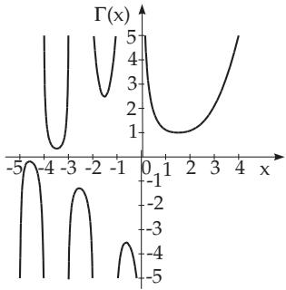

#### 8.2.5 Integration by Series Expansion, Special Non-Elementary Functions

It is not always possible to express an integral by elementary functions, even if the integrand is an elementary function. In many cases one can express these non-elementary integrals by series expansions. If the integrand can be expanded into a uniformly convergent series in the interval $[ a , b ]$ , then one gets also a uniformly convergent series for the integral $\int _ { a } ^ { x } f ( t )$ dt by integrating it term by term.

1. Sine Integral $( | x | < \infty$ , see also 14.4.3.2, 2., p. 756)

$$
\begin{array} { l } { \displaystyle \mathrm { S i } \left( x \right) = \int \frac { x } { 0 } \frac { \sin t } { t } d t = \frac { \pi } { 2 } - \int \frac { \sin t } { x } d t } \\ { = x - \displaystyle \frac { x ^ { 3 } } { 3 \cdot 3 ! } + \frac { x ^ { 5 } } { 5 \cdot 5 ! } - + \cdots + \frac { ( - 1 ) ^ { n } x ^ { 2 n + 1 } } { ( 2 n + 1 ) \cdot ( 2 n + 1 ) ! } + \cdots . } \end{array}\tag{8.95}
$$

2. Cosine Integral $( 0 < x < \infty )$

$$
\begin{array} { l } { \displaystyle \operatorname { C i } ( x ) = - \int _ { x } ^ { \infty } \frac { \cos t } { t } d t = C + \ln x - \int _ { 0 } ^ { x } \frac { 1 - \cos t } { t } d t } \\ { = C + \ln x - \displaystyle \frac { x ^ { 2 } } { 2 \cdot 2 ! } + \frac { x ^ { 4 } } { 4 \cdot 4 ! } - + \cdot \cdot \cdot + \frac { ( - 1 ) ^ { n } x ^ { 2 n } } { 2 n \cdot ( 2 n ) ! } + \cdot \cdot \cdot \quad \mathrm { w i t h } } \end{array}\tag{8.96a}
$$

$$
C = - \int _ { 0 } ^ { \infty } e ^ { - t } \ln t d t = 0 . 5 7 7 2 1 5 6 6 5 \ldots \qquad { \mathrm { ( E u l e r ~ c o n s t a n t ) } } .\tag{8.96b}
$$

3. Integral Logarithm $( 0 < x < 1$ , for $1 < x < \infty$ as Cauchy Principal Value)

$$
\operatorname { L i } ( x ) = \int _ { 0 } ^ { x } { \frac { d t } { \ln t } } = C + \ln \left| \ln x \right| + \ln x + { \frac { ( \ln x ) ^ { 2 } } { 2 \cdot 2 ! } } + \cdot \cdot \cdot + { \frac { ( \ln x ) ^ { n } } { n \cdot n ! } } + \cdot \cdot \cdot .\tag{8.97}
$$

4. Exponential Integral $( - \infty < x < 0$ , for $0 < x < \infty$ as Cauchy Principal Value)

$$
\mathrm { E i } \left( x \right) = \intop _ { - \infty } ^ { x } { \frac { e ^ { t } } { t } } d t = C + \ln \left| x \right| + x + { \frac { x ^ { 2 } } { 2 \cdot 2 ! } } + \cdots + { \frac { x ^ { n } } { n \cdot n ! } } + \cdots .\tag{8.98a}
$$

Ei $( \ln x ) = \operatorname { L i } \left( x \right)$

(8.98b)

5. Gauss Error Integral and Error Function

The Gauss error integral is defined for the domain $| x | < \infty$ and it is denoted by $\varPhi .$ . The following definitions and relations are valid:

$$
\varPhi ( x ) = \frac { 1 } { \sqrt { 2 \pi } } \int e ^ { - \frac { t ^ { 2 } } { 2 } } d t ,
$$

$$
( 8 . 9 9 \mathrm { a } ) \qquad \operatorname * { l i m } _ { x  \infty } \varPhi ( x ) = 1 ,\tag{8.99b}
$$

$$
\varPhi _ { 0 } ( x ) = \frac { 1 } { \sqrt { 2 \pi } } \int _ { 0 } ^ { x } e ^ { - \frac { t ^ { 2 } } { 2 } } d t = \varPhi ( x ) - \frac { 1 } { 2 } .\tag{8.99c}
$$

The function $\varPhi ( x )$ is the distribution function of the standard normal distribution (see 16.2.4.2, p. 819) and its values are tabulated in Table 21.17, p. 1133.

The error function erf $( x )$ , often used in statistics (see also 16.2.4.2, p. 819), has a strong relation with the Gauss error integral:

$$
\operatorname { e r f } { ( x ) } = { \frac { 2 } { \sqrt { \pi } } } \int _ { 0 } ^ { x } e ^ { - t ^ { 2 } } d t = 2 \varPhi _ { 0 } ( x { \sqrt { 2 } } ) , \qquad \mathrm { ( 8 . 1 0 0 a ) } \qquad \operatorname* { l i m } _ { x \to \infty } \operatorname { e r f } { ( x ) } = 1 ,\tag{8.100b}
$$

$$
\operatorname { e r f } \left( x \right) = { \frac { 2 } { \sqrt { \pi } } } \left( x - { \frac { x ^ { 3 } } { 1 ! \cdot 3 } } + { \frac { x ^ { 5 } } { 2 ! \cdot 5 } } - + \cdot \cdot \cdot + { \frac { ( - 1 ) ^ { n } x ^ { 2 n + 1 } } { n ! \cdot ( 2 n + 1 ) } } + \cdot \cdot \cdot \right) ,\tag{8.100c}
$$

$$
\int _ { 0 } ^ { x } \operatorname { e r f } \left( t \right) d t = x \operatorname { e r f } \left( x \right) + \frac { 1 } { \sqrt { \pi } } \left( e ^ { - x ^ { 2 } } - 1 \right) , \mathrm { ~ } \left( 8 . 1 0 0 \mathrm { d } \right) \quad \quad \frac { d \operatorname { e r f } \left( x \right) } { d x } = \frac { 2 } { \sqrt { \pi } } e ^ { - x ^ { 2 } } .\tag{8.100e}
$$

6. Gamma Function and Factorial

1. Definition The gamma function, the Euler integral of the second kind (8.91), is an extension of the notion of factorial for arbitrary numbers x, even complex numbers, except zero and the negative integers. The curve of the function $\dot { \boldsymbol { T } } ( \boldsymbol { x } )$ is represented in Fig. 8.23. Its values are given in Table 21.10, p. 1105. It can be defined in two ways:

$$
\displaystyle { \Gamma ( x ) = \int _ { 0 } ^ { \infty } e ^ { - t } t ^ { x - 1 } d t \quad ( x > 0 ) \quad \mathrm { o r } }\tag{8.101a}
$$

$$
\begin{array} { c } { { r ( x ) = \displaystyle \operatorname* { l i m } _ { n  \infty } \frac { n ^ { x } \cdot n ! } { x ( x + 1 ) ( x + 2 ) \ldots ( x + n ) } } } \\ { { ( x \ne 0 , - 1 , - 2 , \ldots ) . } } \end{array}\tag{8.101b}
$$

  
Figure 8.23

2. Properties of the Gamma Function

$$
\begin{array} { r } { T ( x + 1 ) = x { \cal T } ( x ) , } \end{array}\tag{8.102a}
$$

$$
\begin{array} { l } { { T ( n + 1 ) = n ! \quad ( n = 0 , 1 , 2 , . . . ) , } } \end{array}\tag{8.102b}
$$

$$
\stackrel { \_ } { \ / } ( x ) \stackrel { \_ } { \ / } ( 1 - x ) = \frac { \pi } { \sin \pi x } \quad ( x \ne 0 , \pm 1 , \pm 2 , \ldots ) ,\tag{8.102c}
$$

$$
T \left( { \frac { 1 } { 2 } } \right) = 2 \int _ { 0 } ^ { \infty } e ^ { - t ^ { 2 } } d t = { \sqrt { \pi } } ,\tag{8.102d}
$$

$$
T \left( n + { \frac { 1 } { 2 } } \right) = { \frac { ( 2 n ) ! { \sqrt { \pi } } } { n ! 2 ^ { 2 n } } } \qquad ( n = 0 , 1 , 2 , \ldots ) ,\tag{8.102e}
$$

$$
T \left( - n + { \frac { 1 } { 2 } } \right) = { \frac { ( - 1 ) ^ { n } n ! 2 ^ { 2 n } { \sqrt { \pi } } } { ( 2 n ) ! } } ~ ( n = 0 , 1 , 2 , \ldots ) .\tag{8.102f}
$$

The formulas (8.102a) and (8.102c) are also valid for complex arguments z, but only if Re $( z ) > 0$ holds.

3. Generalization of the Notion of Factorial The notion of factorial, defined until now only for positive integers n (see 1.1.6.4, 3., p. 13), leads to the function

$$
x ! = T ( x + 1 )\tag{8.103a}
$$

as its extension for arbitrary real numbers. The following equalities are valid:

$$
{ \mathrm { F o r ~ p o s i t i v e ~ i n t e g e r s ~ } } x ; \quad x ! = 1 \cdot 2 \cdot 3 \cdot \cdot x , \quad ( { \mathrm { 8 . 1 0 3 b } } ) \quad { \mathrm { f o r ~ } } x = 0 \colon \ 0 ! = T ( 1 ) = 1 ,\tag{8.103c}
$$

for negative integers x: x! = ,

$$
( 8 . 1 0 3 \mathrm { d } ) \quad \mathrm { f o r } x = \frac { 1 } { 2 } : \bigg ( \frac { 1 } { 2 } \bigg ) ! = \Gamma \left( \frac { 3 } { 2 } \right) = \frac { \sqrt { \pi } } { 2 } ,\tag{8.103e}
$$

$$
{ \mathrm { f o r ~ } } x = - { \frac { 1 } { 2 } } : \left( - { \frac { 1 } { 2 } } \right) ! = T \left( { \frac { 1 } { 2 } } \right) = { \sqrt { \pi } } , \quad ( 8 . 1 0 3 { \mathrm { \bf f } } ) { \mathrm { f o r ~ } } x = - { \frac { 3 } { 2 } } : \left( - { \frac { 3 } { 2 } } \right) ! = T \left( - { \frac { 1 } { 2 } } \right) = - 2 { \sqrt { \pi } }\tag{8.103g}
$$

An approximate determination of a factorial can be performed for numbers $> 1 0$ , also for fractions n with the Stirling formula:

$$
n ! \approx \left( { \frac { n } { e } } \right) ^ { n } { \sqrt { 2 \pi n } } \left( 1 + { \frac { 1 } { 1 2 n } } + { \frac { 1 } { 2 8 8 n ^ { 2 } } } + \cdots \right) ,\tag{8.103h}
$$

$$
\ln ( n ! ) \approx \left( n + { \frac { 1 } { 2 } } \right) \ln n - n + \ln { \sqrt { 2 \pi } } .\tag{8.103i}
$$

7. Elliptic Integrals

For the complete elliptic integrals (see 8.1.4.3, 2., p. 490) the following series expansions are valid:

$$
K = \int _ { 0 } ^ { \frac { \pi } { 2 } } \frac { d \vartheta } { \sqrt { 1 - k ^ { 2 } \sin ^ { 2 } \vartheta } } = \frac { \pi } { 2 } \left[ 1 + \left( \frac { 1 } { 2 } \right) ^ { 2 } k ^ { 2 } + \left( \frac { 1 \cdot 3 } { 2 \cdot 4 } \right) ^ { 2 } k ^ { 4 } + \left( \frac { 1 \cdot 3 \cdot 5 } { 2 \cdot 4 \cdot 6 } \right) ^ { 2 } k ^ { 6 } + \cdots \right] { , } k ^ { 2 } < 1 ,\tag{8.104}
$$

$$
E = \int _ { 0 } ^ { \frac { \pi } { 2 } } { \sqrt { 1 - k ^ { 2 } \sin ^ { 2 } \vartheta } } d \vartheta = { \frac { \pi } { 2 } } \left[ 1 - \left( { \frac { 1 } { 2 } } \right) ^ { 2 } { \frac { k ^ { 2 } } { 1 } } - \left( { \frac { 1 \cdot 3 } { 2 \cdot 4 } } \right) ^ { 2 } { \frac { k ^ { 4 } } { 3 } } - \left( { \frac { 1 \cdot 3 \cdot 5 } { 2 \cdot 4 \cdot 6 } } \right) ^ { 2 } { \frac { k ^ { 6 } } { 5 } } - \cdots \right] ,
$$

$$
k ^ { 2 } < 1 .\tag{8.105}
$$

The numerical values of the elliptic integrals are given in Table 21.9, p. 1103.
