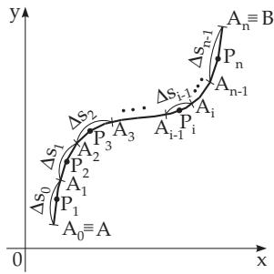
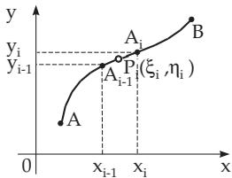
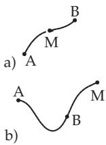
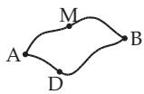
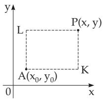
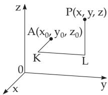

### 8.3 Line Integrals

The notion of the integral can be generalized in diferent ways. While the domain of an ordinary definite integral is an interval on the numerical axis, for a line integral, the domain of integration is a segment of a planar or space curve. The curve, i.e., the path of integration can also be closed; it is called also

circuit integral and it gives the circulation of the function along the curve. There are distinguished line integrals of the first type, of the second type, or of general type.

#### 8.3.1 Line Integrals ofthe First Type

##### 8.3.1.1 Definitions

The line integral ofthe first type or integral over an arc is the definite integral

$$
\int _ { ( C ) } f ( x , y ) d s ,\tag{8.106}
$$

where $f ( x , y )$ is a function of two variables defined on a connected domain and the integration is performed over an arc $\boldsymbol { C } \equiv \stackrel { \widehat { A } \boldsymbol { B } } { = }$ of a plane curve given by its equation. The considered arc is in the same domain, and it is called the path ofintegration. The numerical value of the line integral of the first type can be determined in the following way (Fig. 8.24):

  
Figure 8.24

1. Decomposing the rectifiable arc segment $A B$ into n elementary parts by points $A _ { 1 } , A _ { 2 } , \ldots , A _ { n - 1 }$ chosen arbitrarily, starting at the initial point $A \equiv A _ { 0 }$ and finishing at the endpoint $B \equiv A _ { n }$

2. Choosing arbitrary points $P _ { i }$ inside or at the end of the elementary arcs $\overset { \triangledown } { A _ { i - 1 } } A _ { i }$ , with coordinates $\xi _ { i }$ and $\eta _ { i }$

3. Multiplying the values of the function $f ( \xi _ { i } , \eta _ { i } )$ at the chosen points with the arc-length $\stackrel { \frown } { A _ { i - 1 } A _ { i } = }$ $\Delta s _ { i - 1 }$ which should be taken positive. (Since the arc is rectifiable, $\Delta s _ { i - 1 }$ is finite.)

4. Adding the n products $f ( \xi _ { i } , \eta _ { i } ) \Delta s _ { i - 1 }$

5. Evaluating the limit of the sum

$$
\sum _ { i = 1 } ^ { n } f ( \xi _ { i } , \eta _ { i } ) \Delta s _ { i - 1 }\tag{8.107a}
$$

as the arc-length of every elementary curve segment $\Delta s _ { i - 1 }$ tends to zero, while n obviously tends to $\infty .$ If the limit of (8.107a) exists and is independent of the choice of the points $A _ { i }$ and $P _ { i } ,$ then this limit is called the line integral ofthe first type, and the function $f ( x , y )$ is called integrable along the curve $C { : }$

$$
\int _ { ( C ) } f ( x , y ) d s = \operatorname* { l i m } _ { { \stackrel { \Delta s _ { i } \to 0 } { n \to \infty } } } \sum _ { i = 1 } ^ { n } f ( \xi _ { i } , \eta _ { i } ) \Delta s _ { i - 1 } .\tag{8.107b}
$$

Analogously the line integral of the first type can be defined for a function $f ( x , y , z )$ of three variables, whose path of integration is a curve segment of a space curve:

$$
\int _ { ( C ) } f ( x , y , z ) d s = \operatorname* { l i m } _ { { \stackrel { \Delta s _ { i } \to 0 } { n \to \infty } } } \sum _ { i = 1 } ^ { n } f ( \xi _ { i } , \eta _ { i } , \zeta _ { i } ) \Delta s _ { i - 1 } .\tag{8.107c}
$$

##### 8.3.1.2 Existence Theorem

The line integral of the first type (8.107b) or (8.107c) exists if the function $f ( x , y )$ or $f ( x , y , z )$ is continuous along the continuous arc segment $C ,$ , and the curve has a tangent which varies continuously. In other words: The above limits exist and are independent of the choice of $A _ { i }$ and $P _ { i }$ . In this case, the functions $f ( x , y )$ or $f ( x , y , z )$ are called integrable along the curve $C .$

##### 8.3.1.3 Evaluation of the Line Integral of the First Type

The calculation of the line integral of the first type can be done by reducing it to a definite integral.

1. The Equation of the Path of Integration is Given in Parametric Form If the defining equations of the path are $x = x ( t )$ and $y = y ( t )$ , then

$$
\int _ { ( C ) } f ( x , y ) d s = \int _ { t _ { 0 } } ^ { T } f [ x ( t ) , y ( t ) ] { \sqrt { [ x ^ { \prime } ( t ) ] ^ { 2 } + [ y ^ { \prime } ( t ) ] ^ { 2 } } } d t\tag{8.108a}
$$

holds, and in the case of a space curve $x = x ( t ) , y = y ( t )$ , and $z = z ( t )$

$$
\int _ { ( C ) } f ( x , y , z ) d s = \int _ { t _ { 0 } } ^ { T } f [ x ( t ) , y ( t ) , z ( t ) ] { \sqrt { [ x ^ { \prime } ( t ) ] ^ { 2 } + [ y ^ { \prime } ( t ) ] ^ { 2 } + [ z ^ { \prime } ( t ) ] ^ { 2 } } } d t ,\tag{8.108b}
$$

where $t _ { 0 }$ is the value of the parameter t at the point A and $T$ is the parameter value at B . The points A and B are chosen so that $t _ { 0 } < T$ holds.

2. The Equation of the Path of Integration is Given in Explicit Form $\mathbf { y } = \mathbf { y } ( \mathbf { x } )$ Substituting $t = x$ one gets from (8.108a) for the planar case

$$
\int _ { ( C ) } f ( x , y ) d s = \int _ { a } ^ { b } f [ x , y ( x ) ] { \sqrt { 1 + [ y ^ { \prime } ( x ) ] ^ { 2 } } } d x ,\tag{8.109a}
$$

and from (8.108b) for the three dimensional case

$$
\int _ { ( C ) } f ( x , y , z ) d s = \int _ { a } ^ { b } f [ x , y ( x ) , z ( x ) ] { \sqrt { 1 + [ y ^ { \prime } ( x ) ] ^ { 2 } + [ z ^ { \prime } ( x ) ] ^ { 2 } } } d x .\tag{8.109b}
$$

Here a and b are the abscissae of the points A and B , where the relation $a < b$ must be fulfilled. Then one considers x as a parameter if every point corresponds to exactly one point on the projection of the curve segment C onto the x-axis, i.e., every point of the curve is uniquely determined by the value of its abscissa. If this condition does not hold, then the curve segment has to be partitioned into subsegments having this property. The line integral along the whole segment is equal to the sum of the line integrals along the subsegments.

##### 8.3.1.4 Application of the Line Integral of the First Type

Some applications of the line integral of the first type are given in Table 8.6. The curve elements ds needed for the calculations of the line integrals are given for diferent coordinate systems in Table 8.7.

#### 8.3.2 Line Integrals of the Second Type

##### 8.3.2.1 Definitions

A line integral of the second type or an integral over a projection onto the x-, y- or z-axis is $\mathrm { e . g . }$ , the definite integral

$$
\int _ { ( C ) } f ( x , y ) d x
$$

(8.110a)

$$
\mathrm { o r } \quad \int _ { ( C ) } f ( x , y , z ) d x ,\tag{8.110b}
$$

where $f ( x , y )$ or $f ( x , y , z )$ are two or three variable functions defined on a connected domain, and the integration is done over a projection of a plane or space curve $C \equiv \widehat { A B }$ (given by its equation) onto the $x \mathrm { - } , y \mathrm { - } , \mathrm { o r } z \mathrm { - } \mathrm { a x i s }$ . The path of integration is in the same domain.

The line integral of the second type one gets similarly to the line integral of the first type, but in the third step the values of the function $f ( \xi _ { i } , \eta _ { i } )$ or $f ( \xi _ { i } , \eta _ { i } , \zeta _ { i } )$ are not multiplied by the arc-length of the elementary curve segments $\overset { \triangledown } { A _ { i - 1 } A _ { i } }$ , but by its projections onto a coordinate axis (Fig. 8.25).

Table 8.6 Line Integrals of the First Type
<table><tr><td rowspan=1 colspan=1>Length of a curve segment C</td><td rowspan=1 colspan=1> $L = \int _ { ( C ) } d s$ </td></tr><tr><td rowspan=1 colspan=1>Mass of an inhomogeneouscurve segment C</td><td rowspan=1 colspan=1> $M = \int _ { ( C ) } \varrho d s$   $( \varrho = f ( x , y , z )$ density function)</td></tr><tr><td rowspan=1 colspan=1>Center of gravity coordinates</td><td rowspan=1 colspan=1> $x _ { C } = \ \frac { 1 } { L } \int \ d x \ d y \ d z \ d z ~ x \ d y ~ y _ { C } = \ \frac { 1 } { L } \int \ d y \ d y \ d z \ d z ~ y _ { C } = \ \frac { 1 } { L } \int \ d z \ d z \ d z d s$ </td></tr><tr><td rowspan=1 colspan=1>Moments of inertia of a planecurve in the x, y plane</td><td rowspan=1 colspan=1> $I _ { x } = \int _ { \stackrel { ( C ) } { ( C ) } } x ^ { 2 } \varrho d s , \quad I _ { y } = \int _ { \stackrel { ( } { C } ) } y ^ { 2 } \varrho d s$ </td></tr><tr><td rowspan=1 colspan=1>Moments of inertia of aspace curve with respectto the coordinate axes</td><td rowspan=1 colspan=1> $\begin{array} { c c } { \displaystyle { I _ { x } = \int _ { ( } ^ { } y ^ { 2 } + z ^ { 2 } ) \varrho d s , \quad I _ { y } = \int _ { ( } ^ { } ( x ^ { 2 } + z ^ { 2 } ) \varrho d s , } } \\ { \displaystyle { ( c ) } } \end{array}$  $I _ { z } = \int _ { ( C ) } ( x ^ { 2 } + y ^ { 2 } ) \varrho d s$ </td></tr><tr><td rowspan=1 colspan=2>In the case of homogeneous curves $\varrho = 1$ is substituted.</td></tr></table>

Table 8.7 Curve Elements
<table><tr><td rowspan=1 colspan=1>Plane curve inthe x, y plane</td><td rowspan=1 colspan=1>Cartesian coordinates $x , y = y ( x )$ Polar coordinates $\varphi , \rho = \rho ( \varphi )$  $x = \rho ( \varphi ) \cos \varphi , y = \rho ( \varphi ) \sin \varphi$ Parametric form in Cartesiancoordinates $x = x ( t ) , y = y ( t )$ </td><td rowspan=1 colspan=1> $d s = \sqrt { 1 + [ y ^ { \prime } ( x ) ] ^ { 2 } } d x$  $d s = \sqrt { \rho ^ { 2 } ( \varphi ) + [ \rho ^ { \prime } ( \varphi ) ] ^ { 2 } } d \varphi$  $d s = \sqrt { [ x ^ { \prime } ( t ) ] ^ { 2 } + [ y ^ { \prime } ( t ) ] ^ { 2 } } d t$ </td></tr><tr><td rowspan=1 colspan=1>Space curve</td><td rowspan=1 colspan=1>Parametric form in Cartesiancoordinates $\begin{array} { r } { x = x ( t ) , y = y ( t ) , z = z ( t ) } \end{array}$ </td><td rowspan=1 colspan=1> $d s = \sqrt { [ x ^ { \prime } ( t ) ] ^ { 2 } + [ y ^ { \prime } ( t ) ] ^ { 2 } + [ z ^ { \prime } ( t ) ] ^ { 2 } } d t$ </td></tr></table>

1. Projection onto the x-Axis

With $\operatorname* { P r } _ { x } \ A _ { i - 1 } A _ { i } { = } x _ { i } - x _ { i - 1 } = \Delta x _ { i - 1 } \ { \mathrm { ~ o n e ~ g e t s } }$

$$
\int _ { ( C ) } f ( x , y ) d x = \operatorname* { l i m } _ { { \underset { n  \infty } { \operatorname* { i n } } }  0 } \sum _ { i = 1 } ^ { n } f ( \xi _ { i } , \eta _ { i } ) \Delta x _ { i - 1 } ,\tag{8.111}
$$

(8.112a)

$$
\int _ { ( C ) } f ( x , y , z ) d x = \operatorname* { l i m } _ { \stackrel { \Delta x _ { i - 1 }  0 } { n  \infty } } \sum _ { i = 1 } ^ { n } f ( \xi _ { i } , \eta _ { i } , \zeta _ { i } ) \Delta x _ { i - 1 } .\tag{8.112b}
$$

  
Figure 8.25

2. Projection onto the y-Axis

$$
\int _ { ( C ) } f ( x , y ) d y = \operatorname* { l i m } _ { { \underset { n  \infty } { \operatorname* { i n } } }  0 } \sum _ { i = 1 } ^ { n } f ( \xi _ { i } , \eta _ { i } ) \Delta y _ { i - 1 } ,\tag{8.113a}
$$

$$
\int _ { ( C ) } f ( x , y , z ) d y = \operatorname* { l i m } _ { { \underset { n  \infty } { \operatorname* { l i m } } }  0 } \sum _ { i = 1 } ^ { n } f ( \xi _ { i } , \eta _ { i } , \zeta _ { i } ) \Delta y _ { i - 1 } .\tag{8.113b}
$$

3. Projection onto the $z { \mathrm { - } } \mathbf { A }$ xis

$$
\int _ { ( C ) } f ( x , y , z ) d z = \operatorname* { l i m } _ { \stackrel { \Delta z _ { i - 1 } \to 0 } { n \to \infty } } \sum _ { i = 1 } ^ { n } f ( \xi _ { i } , \eta _ { i } , \zeta _ { i } ) \Delta z _ { i - 1 } .\tag{8.114}
$$

##### 8.3.2.2 Existence Theorem

The line integral of the second type in the form (8.112a), (8.113a), (8.112b), (8.113b) or (8.114) exists if the function $f ( x , y )$ or $f ( x , y , z )$ and also the curve are continuous along the arc segment $C ,$ and the curve has a continuously varying tangent there.

##### 8.3.2.3 Calculation of the Line Integral of the Second Type

The calculation of the line integral of the second type can be done by reducing it to a definite integral. 1. The Path of Integration is Given in Parametric Form

With the parametric equations of the path of integration

$$
x = x ( t ) , \quad y = y ( t ) \quad { \mathrm { a n d ~ ( f o r ~ a ~ s p a c e ~ c u r v e ) } } \quad z = z ( t )\tag{8.115}
$$

we get the following formulas:

For (8.112a)

$$
\intop _ { ( C ) } f ( x , y ) d x = \intop _ { t _ { 0 } } ^ { T } f [ x ( t ) , y ( t ) ] x ^ { \prime } ( t ) d t .\tag{8.116a}
$$

For (8.113a)

$$
\intop _ { ( C ) } f ( x , y ) d y = \intop _ { t _ { 0 } } ^ { T } f [ x ( t ) , y ( t ) ] y ^ { \prime } ( t ) d t .\tag{8.116b}
$$

For (8.112b)

$$
\int _ { ( C ) } f ( x , y , z ) d x = \intop _ { t _ { 0 } } ^ { T } f [ x ( t ) , y ( t ) , z ( t ) ] x ^ { \prime } ( t ) d t .\tag{8.116c}
$$

For (8.113b)

$$
\int _ { ( C ) } f ( x , y , z ) d y = \int _ { t _ { 0 } } ^ { T } f [ x ( t ) , y ( t ) , z ( t ) ] y ^ { \prime } ( t ) d t .\tag{8.116d}
$$

For (8.114)

$$
\int _ { ( C ) } f ( x , y , z ) d z = \intop _ { t _ { 0 } } ^ { T } f [ x ( t ) , y ( t ) , z ( t ) ] z ^ { \prime } ( t ) d t .\tag{8.116e}
$$

Here, $t _ { 0 }$ and $T$ are the values of the parameter t for the initial point A and the endpoint B of the arc segment. In contrast to the line integral of the first type, here we do not require the inequality $t _ { 0 } < T$ Remark: In the case of reversion of the path of the integral, i.e., interchanging the points A and B , the sign of the integral changes.

2. The Path of Integration is Given in Explicit Form

In the case of a plane or space curve with the equations

$$
y = y ( x ) \qquad { \mathrm { o r } } \qquad y = y ( x ) , \ z = z ( x )\tag{8.117}
$$

as the path of integration, with the abscissae a and b of the points A and B, where the condition $a < b$ is no longer necessary, the abscissa x takes the place of the parameter t in the formulas (8.112a) – (8.114).

#### 8.3.3 Line Integrals of GeneralType

##### 8.3.3.1 Definition

A line integral ofgeneral type is the sum of the integrals of the second type along all the projections of a curve. If two functions $\mathring { P ( x , y ) }$ and $Q ( x , y )$ of two variables, or three functions $P ( x , y , z ) , \overleftarrow { Q } ( x , y , z )$

and $R ( x , y , z )$ of three variables, are given along the given curve segment C, and the corresponding line integrals of the second type exist, then the following formulas are valid for a planar or for a space curve.

1. Planar Curve

$$
\int _ { ( C ) } ( P d x + Q d y ) = \int _ { ( C ) } P d x + \intop _ { ( C ) } Q d y .\tag{8.118a}
$$

2. Space Curve

$$
\int _ { ( C ) } ( P d x + Q d y + R d z ) = \int _ { ( C ) } P d x + \int _ { ( C ) } Q d y + \int _ { ( C ) } R d z .\tag{8.118b}
$$

The vector representation of the line integral of general type and an application of it in mechanics will be discussed in the chapter about vector analysis (see 13.3.1.1, p. 719).

##### 8.3.3.2 Properties of the Line Integral of General Type 1. The Decomposition of the Path of the Integral

by a point M, which is on the curve, and it can even be outside of $\widehat { A B }$ (Fig. 8.26), results in the decomposition of the integral into two parts:

$$
\int _ { A B } ( P d x + Q d y ) = \underbrace { \int _ { \widehat { \cal A } \widehat { \cal A } } ( P d x + Q d y ) } _ { \widehat { A M } } + \underbrace { \int _ { \widehat { \cal A } \widehat { \cal B } } ( P d x + Q d y ) . } _ { M B } .
$$

  
Figure 8.26

(8.119)

2. The Reverse of the Sense of the Path of Integration changes the sign of the integral:

$$
\int _ { A B } ( P d x + Q d y ) = - \int _ { \widehat { B A } } ( P d x + Q d y ) . ^ { * }\tag{8.120}
$$

3. Dependence on the Path

In general, the value of the line integral is dependent not only on the initial and endpoints but also on the path of integration (Fig. 8.27):

$$
\int _ { A M B } ( P d x + Q d y ) \neq \underbrace { \int _ { \widehat { A } } ( P d x + Q d y ) . ^ { * } } _ { A D B }\tag{8.121}
$$

  
Figure 8.27

A: $I = \int _ { ( C ) } ( x y d x + y z d y + z x d z )$ , where C is one turn of the helix x = a cos t, y = a sin $t , z = b t$

(see Helix on p. 260) from $t _ { 0 } = 0 \mathrm { t o } T = 2 \pi$

$$
I = \int _ { 0 } ^ { 2 \pi } ( - a ^ { 3 } \sin ^ { 2 } t \cos t + a ^ { 2 } b t \sin t \cos t + a b ^ { 2 } t \cos t ) d t = - { \frac { \pi a ^ { 2 } b } { 2 } } .
$$

B: $I = \int _ { ( C ) } [ y ^ { 2 } d x + ( x y - x ^ { 2 } ) d y ]$ , where C is the arc of the parabola $y ^ { 2 } = 9 x$ between the points

$$
A ( 0 , 0 ) \mathrm { a n d } B ( 1 , 3 ) \colon I = \int _ { 0 } ^ { 3 } \left[ \frac { 2 } { 9 } y ^ { 3 } + \left( \frac { y ^ { 3 } } { 9 } - \frac { y ^ { 4 } } { 8 1 } \right) \right] d y = 6 \frac { 3 } { 2 0 } .
$$

##### 8.3.3.3 Integral Along a Closed Curve

1. Notion of the Integral Along a Closed Curve A circuit integral or the circulation along a curve is a line integral along a closed path of integration $C$ , i.e., the initial point A and the end point B coincide. The following notation is used:

$$
\begin{array} { l } { { \begin{array} { l } { { \oint \left( P d x + Q d y \right) \qquad \mathrm { o r } \qquad \oint \left( P d x + Q d y + R d z \right) . } } \\ { { ( C ) } } \end{array} } } \end{array}\tag{8.122}
$$

In general, this integral difers from zero. But it is equal to zero if the conditions (8.127) are satisfied, or if the integration is performed in a conservative field (see 13.3.1.6, p. 721). (See also zero-valued circulation, 13.3.1.6, p. 721.)

2. The Calculation of the Area S of a Plane Figure is a typical example of the application of the integral along a closed curve in the form

$$
S = { \frac { 1 } { 2 } } \oint _ { ( C ) } ( x d y - y d x ) ,\tag{8.123}
$$

where C is the boundary curve of the plane figure. The integral is positive if the path is oriented counterclockwise.

#### 8.3.4 Independence of the Line Integral of the Path of Integration

The condition for independence of a line integral of the path of integration is also called integrability of the total diferential.

##### 8.3.4.1 Two-Dimensional Case

If the line integral

$$
\int _ { ( C ) } [ P ( x , y ) d x + Q ( x , y ) d y ]\tag{8.124}
$$

with continuous functions P and Q defined on a simple connected domain depends only on the initial point A and the endpoint B of the path of integration, and does not depend on the curve connecting these points, i.e., for arbitrary A and B and arbitrary paths of integration ACB and ADB (Fig. 8.27) the equality

$$
\int _ { A C B } ( P d x + Q d y ) = \underbrace { \int _ { \vphantom { A D B } } ( P d x + Q d y ) } _ { A D B }\tag{8.125}
$$

holds, then it is a necessary and suficient condition for the existence of a function $U ( x , y )$ of two variables, whose total diferential is the integrand of the line integral:

$$
P d x + Q d y = d U , \qquad \mathrm { ( 8 . 1 2 6 a ) }
$$

$$
{ \mathrm { i . e . , } } \quad P = { \frac { \partial U } { \partial x } } , \quad Q = { \frac { \partial U } { \partial y } } .\tag{8.126b}
$$

The function $U ( x , y )$ is a primitive function of the total diferential (8.126a). In physics, the primitive function $U ( x , y )$ means the potential in a vector field (see 13.3.1.6, 4., p. 722).

##### 8.3.4.2 Existence of a Primitive Function

A necessary and suficient criterion for the existence of the primitive function, the integrability condition for the expression $P d x + Q d y$ , is the equality of the partial derivatives

$$
{ \frac { \partial P } { \partial y } } = { \frac { \partial Q } { \partial x } } ,\tag{8.127}
$$

where also the continuity of the partial derivatives is required.

##### 8.3.4.3 Three-Dimensional Case

The condition of independence of the line integral

$$
\int [ P ( x , y , z ) d x + Q ( x , y , z ) d y + R ( x , y , z ) d z ]\tag{8.128}
$$

of the path of integration analogously to the two-dimensional case is the existence of a primitive function $U ( x , y , z )$ for which

$$
P d x + Q d y + R d z = d U ,\tag{8.129a}
$$

holds, i.e.,

$$
P = { \frac { \partial U } { \partial x } } , \quad Q = { \frac { \partial U } { \partial y } } , \quad R = { \frac { \partial U } { \partial z } } .\tag{8.129b}
$$

The integrability condition is now that the three equalities for the partial derivatives

$$
{ \frac { \partial Q } { \partial z } } = { \frac { \partial R } { \partial y } } , \quad { \frac { \partial R } { \partial x } } = { \frac { \partial P } { \partial z } } , \quad { \frac { \partial P } { \partial y } } = { \frac { \partial Q } { \partial x } }\tag{8.129c}
$$

should be simultaneously satisfied, provided that the partial derivatives are continuous.

The work W (see also 8.2.2.3, 2., p. 504) is defined as the scalar product of force $\vec { F } ( \vec { r } )$ and displacement s. In a conservative field the work depends only on the place ${ \vec { r } } ,$ but not on the velocity v. With $\vec { F } = P \vec { e } _ { x } + Q \vec { e } _ { y } + R \vec { e } _ { z } =$ gradV and ${ \vec { d s } } = d x { \vec { e } } _ { x } + d y { \vec { e } } _ { y } + d z { \vec { e } } _ { z }$ the relations (8.129a), (8.129b) are satisfied for the potential $\begin{array} { r } { V ( \vec { r } ) } \end{array}$ , and (8.129c) is valid. Independently of the path between the points $P _ { 1 }$ and $P _ { 2 }$ holds:

$$
W = \int _ { P _ { 1 } } ^ { P _ { 2 } } { \vec { F } } ( { \vec { r } } ) \cdot { \vec { d s } } = \int _ { P _ { 1 } } ^ { P _ { 2 } } [ P d x + Q d y + R d z ] = V ( P _ { 2 } ) - V ( P _ { 1 } ) .\tag{8.130}
$$

##### 8.3.4.4 Determination of the Primitive Function

1. Two-Dimensional Case (Fig.8.28)

If the integrability condition (8.127) is satisfied, then along an arbitrary path of integration connecting an arbitrary fixed point $A ( x _ { 0 } , y _ { 0 } )$ with the variable point $\bar { P ( x , y ) }$ and passing through the domain where (8.127) is valid, the primitive function $U ( x , y )$ is equal to the line integral

$$
U = \int _ { \widehat { A P } } ( P d x + Q d y ) .\tag{8.131}
$$

In practice, it is convenient to choose a path of integration parallel to the coordinate axes, i.e., one of the segments AKP or ALP, if they are inside the domain where (8.127) is valid. There exist two formulas for the calculation of the primitive function $U ( x , y )$ and the total diferential $P d x + Q d y { \mathrm { : } }$

$$
U = U ( x _ { 0 } , y _ { 0 } ) + \intop _ { \frac { \textstyle + \int } { \cal A K } } + \intop _ { \overline { { { \cal K P } } } } = C + \intop _ { x _ { 0 } } ^ { x } P ( \xi , y _ { 0 } ) d \xi + \intop _ { y _ { 0 } } ^ { y } Q ( x , \eta ) d \eta ,\tag{8.132a}
$$

$$
U = U ( x _ { 0 } , y _ { 0 } ) + \intop \frac { 1 } { \frac { d L } { d L } } + \intop \frac { 1 } { \frac { d P } { L P } } = C + \intop _ { y _ { 0 } } ^ { y } Q ( x _ { 0 } , \eta ) d \eta + \intop _ { x _ { 0 } } ^ { x } P ( \xi , y ) d \xi .\tag{8.132b}
$$

Here C is an arbitrary constant.

  
Figure 8.28

  
Figure 8.29

2. Three-Dimensional Case (Fig. 8.29)

If the condition (8.129c) is satisfied, the primitive function can be calculated for the path of integration $A K L P$ with the formulas

$$
\begin{array} { l } { \displaystyle { U = U ( x _ { 0 } , y _ { 0 } , z _ { 0 } ) + \underbrace { \int + \int } _ { A K } + \underbrace { \int + \int } _ { K L } } } \\ { \displaystyle { \phantom { \sum } _ { \begin{array} { c } { y } \\ { z _ { 0 } } \end{array} } } } \\ { \displaystyle { = \int _ { x _ { 0 } } P ( \xi , y _ { 0 } , z _ { 0 } ) d \xi + \int _ { y _ { 0 } } Q ( x , \eta , z _ { 0 } ) d \eta + \int _ { z _ { 0 } } ^ { z } R ( x , y , \xi ) d \xi + C \quad ( C \ \mathrm { a r b i t r a r y \ c o n s t a n t } ) . } } \end{array}\tag{8.133}
$$

For the other five possibilities of a path of integration with the segments being parallel to the coordinate axes one gets five further formulas.

$\mathbf { A } \colon { \mathit { P } } d x { \mathit { + } } Q d y = { \mathit { - } } { \frac { y d x } { x ^ { 2 } + y ^ { 2 } } } { + } { \frac { x d y } { x ^ { 2 } + y ^ { 2 } } }$ . The condition (8.129c) is satisfied: $\frac { \partial P } { \partial y } = \frac { \partial Q } { \partial x } = \frac { y ^ { 2 } - x ^ { 2 } } { ( x ^ { 2 } + y ^ { 2 } ) ^ { 2 } }$ Application of the formula (8.132b) and the substitution of $x _ { 0 } ~ = ~ 0 , ~ y _ { 0 } ~ = ~ 1 ~ ( x _ { 0 } ~ = ~ 0 , ~ y _ { 0 } ~ = ~ 0$ may not be chosen since the functions P and Q are discontinuous at the point $( 0 , 0 ) )$ resulting in $U = \int _ { 1 } ^ { y } \frac { 0 \cdot d \eta } { 0 ^ { 2 } + \eta ^ { 2 } } + \int _ { 0 } ^ { x } \frac { - y d \xi } { \xi ^ { 2 } + y ^ { 2 } } + U ( 0 , 1 ) = - \arctan \frac { x } { y } + C = \arctan \frac { y } { x } + C _ { 1 } .$

B: $P d x + Q d y + R d z = z \left( { \frac { 1 } { x ^ { 2 } y } } - { \frac { 1 } { x ^ { 2 } + z ^ { 2 } } } \right) d x + { \frac { z } { x y ^ { 2 } } } d y + \left( { \frac { x } { x ^ { 2 } + z ^ { 2 } } } - { \frac { 1 } { x y } } \right)$ dz. The relations (8.129c) are satisfied. Application of the formula (8.133) and substitution of $x _ { 0 } = 1 , \ y _ { 0 } = 1 , \ z _ { 0 } = 0$ result in $U = \int _ { 1 } ^ { x } 0 \cdot d \xi + \int _ { 1 } ^ { y } 0 \cdot d \eta + \int _ { 0 } ^ { z } \left( { \frac { x } { { x } ^ { 2 } + { \zeta } ^ { 2 } } } - { \frac { 1 } { x y } } \right) d \zeta + C = \arctan { \frac { z } { x } } - { \frac { z } { x y } } + C .$

##### 8.3.4.5 Zero-Valued Integral Along a Closed Curve

The integral along a closed curve, i.e., the line integral $P d x + Q d y$ is equal to zero, if the relation (8.127) is satisfied, and if there is no point inside the curve where even one of the functions $P , \ Q , \ { \frac { \partial P } { \partial y } }$ or $\frac { \partial Q } { \partial x }$ is discontinuous or not defined.

Remark: The value of the integral can be equal to zero also without this conditions, but then one gets this value only after performing the corresponding calculations.
