### 8.4 Multiple Integrals

The notion of the integral can be extended to higher dimensions. If the domain of integration is a region in the plane or on a surface in space, then the integral is called a surface integral, if the domain is a part of space, then it is called a volume integral. Furthermore, for the diferent special applications there are other special notations.

#### 8.4.1 Double Integrals

##### 8.4.1.1 Notion of the Double Integral

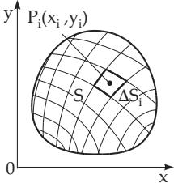  
Figure 8.30

1. Definition

The double integral of a function of two variables $u = f ( x , y )$ over a planar domain S in the x, y plane is denoted by

$$
\int _ { S } f ( x , y ) d S = \int _ { S } f ( x , y ) d y d x .\tag{8.134}
$$

It is a number, if it exists, and it is defined in the following way (Fig. 8.30):

1. Decomposition of the domain S into n elementary domains $\Delta \boldsymbol { S } _ { i }$

2. Choosing an arbitrary point $P _ { i } ( x _ { i } , y _ { i } )$ in the interior or on the boundary of every elementary domain.

3. Multiplication of the value of the function $u = f ( x _ { i } , y _ { i } )$ at this point by the area $\Delta \boldsymbol { S } _ { i }$ of the corresponding elementary domain.

4. Summation of these products $f ( x _ { i } , y _ { i } ) \Delta S _ { i }$

5. Calculation of the limit of the sum

$$
\sum _ { i = 1 } ^ { n } f ( x _ { i } , y _ { i } ) \Delta S _ { i }\tag{8.135a}
$$

as the diameter of the elementary domains tends to zero, consequently $\Delta \boldsymbol { S } _ { i }$ tends to zero, and so n tends to $\infty .$ . (The diameter of a set of points is the supremum of the distances between the points of the set.) The requirement $\Delta S$ tends to zero is not enough, because, e.g., in the case of a rectangle the area can be close to zero also if only one side is small and the other is not, so the considered points could be far from each other. If this limit exists independently of the partition of the domain S into elementary domains and also of the choice of the points $P _ { i } ( x _ { i } , y _ { i } )$ , then it is called the double integra of the function $u = f ( x , y )$ over the domain S, the domain of integration, and one writes:

$$
\int _ { S } f ( x , y ) d S = \operatorname* { l i m } _ { { \underset { n  \infty } { \infty } } } \sum _ { i = 1 } ^ { n } f ( x _ { i } , y _ { i } ) \Delta S _ { i } .\tag{8.135b}
$$

2. Existence Theorem

If the function $f ( x , y )$ is continuous on the domain of integration including the boundary, then the dou-

ble integral (8.135b) exists. (This condition is suficient but not necessary.)

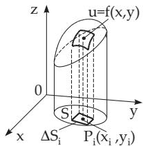

3. Geometrical Meaning

The geometrical meaning of the double integral is the volume of a solid whose base is the domain in the x, y plane, whose side is a cylindrical surface with generators parallel to the z-axis, and it is bounded above by the surface defined by $u ^ { \mathsf { ^ { \prime } } } = f ( x , y )$ (Fig. 8.31). Every term $f ( x _ { i } , y _ { i } ) \Delta \bar { S } _ { i }$ of the sum (8.135b) corresponds to an elementary cell of a prism with base $\Delta \boldsymbol { S } _ { i }$ and with altitude $f ( x _ { i } , y _ { i } )$ . The sign of the volume is positive or negative, according to whether the considered part of the surface $u = f ( x , y )$ is above or under the x, y plane. If the surface intersects the $x , y \mathrm { { p l a n e } }$

Figure 8.31

then the volume is the algebraic sum of the positive and negative parts.

If the value of the function is identically 1 $( f ( x , y ) \equiv 1 )$ , then the volume has the numerical value of the area of the domain S in the x, y plane.

##### 8.4.1.2 Evaluation of the Double Integral

The evaluation of the double integral is reduced to the evaluation of a repeated integral, i.e., to the evaluation of two consecutive integrals.

1. Evaluation in Cartesian Coordinates

If the double integral exists, then one can consider any type of partition of the domain of integration, such as a partition into rectangles. After dividing the domain of integration into infinitesimal rectangles by coordinate lines (Fig. 8.32a) it follows the calculation of the sum of all diferentials $f ( x , y ) d S$ starting with all the rectangles along every vertical stripe, then along every horizontal stripe. (The interior sum is an integral approximation sum with respect to the variable $y ,$ the exterior one with respect to x.) If the integrand is continuous, then this repeated integral is equal to the double integral on this domain. The analytic notation is:

$$
\intop _ { S } f ( x , y ) d S = \intop _ { a } ^ { b } [ \intop _ {  \sigma _ { 1 } ( x )  } ^ {  _ { 2 } ( x ) } f ( x , y ) d y ] d x = \intop _ { a } ^ { b } \intop _ { \varphi _ { 1 } ( x ) } ^ { \varphi _ { 2 } ( x ) } f ( x , y ) d y d x .\tag{8.136a}
$$

Here $y = \varphi _ { 2 } ( x )$ and $y = \varphi _ { 1 } ( x )$ are the equations of the upper and lower boundary curves $( \widehat { A B } ) _ { \mathrm { a b o v e } }$ and $\left( A B \right) _ { \mathrm { b e l o w } }$ of the surface region $S \left( \varphi _ { 1 } \leq \varphi _ { 2 } ; \varphi _ { 1 } , \varphi _ { 2 } \right.$ continuous). Here a and b are the abscissae of the points of the curves to the very left and to the very right. The elementary area in Cartesian coordinates is

$$
d S = d x d y .\tag{8.136b}
$$

(The area of the rectangle is $\Delta x \Delta y$ independently of the value of x.) For the first integration x is

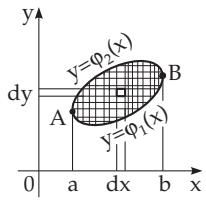  
a)

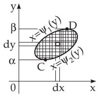  
b)  
Figure 8.32

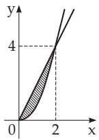  
Figure 8.33

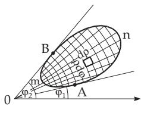  
Figure 8.34

handled as a constant. The square brackets in (8.136a) can be omitted, since according to the notation the interior integral is referred to the interior integration variable, the exterior integral is referred to the second variable. In (8.136a) the diferential signs dx and $d y$ are at the end of the integrand. It is also usual to put these signs right after the corresponding integral signs, in front of the integrand. The summation can be performed in reversed order, too, (Fig. 8.32b). If the integrand is continuous, then it results also in the double integral:

$$
\int _ { S } f ( x , y ) d S = \int _ { \alpha } ^ { \beta } \int _ { ( y 1 ( y ) } ^ { \prime } f ( x , y ) d x d y .\tag{8.136c}
$$

Calculation of $A = \int _ { S } x y ^ { 2 } d S$ , where $S$ is the surface region between the parabola $y = x ^ { 2 }$ and the line $y = 2 x \ ( \mathbf { F i g . 8 . 3 3 } ) \mathrm { ~ a s ~ } A = \int _ { 0 } ^ { 2 } \int _ { x ^ { 2 } } ^ { 2 x } x y ^ { 2 } d y d x = \int _ { 0 } ^ { 2 } x d x \left[ \frac { y ^ { 3 } } { 3 } \right] _ { x ^ { 2 } } ^ { 2 x } = \frac { 1 } { 3 } \int _ { 0 } ^ { 2 } ( 8 x ^ { 4 } - x ^ { 7 } ) d x = \frac { 3 2 } { 5 } \mathrm { ~ o r ~ } \ M = 5 .$ $A = \int _ { 0 } ^ { 4 } \int _ { y / 2 } ^ { \sqrt { y } } x y ^ { 2 } d x d y = \int _ { 0 } ^ { 2 } y ^ { 2 } d y \left[ { \frac { x ^ { 2 } } { 2 } } \right] _ { y / 2 } ^ { \sqrt { y } } = { \frac { 1 } { 2 } } \int _ { 0 } ^ { 4 } y ^ { 2 } \left( y - { \frac { y ^ { 2 } } { 4 } } \right) d y = { \frac { 3 2 } { 5 } } .$

2. Evaluation in Polar Coordinates

The integration domain is divided by coordinate lines into elementary parts bounded by the arcs of two concentric circles and two segments of rays issuing from the pole (Fig. 8.34). The area of the

elementary domain in polar coordinates has the form

$$
d S = \rho d \rho d \varphi .\tag{8.137a}
$$

(The area of an elementary part determined by the same $\Delta \rho$ and $\Delta \varphi$ is obviously smaller being close to the origin, and larger far from it.) With an integrand given in polar coordinates $w = f ( \bar { \rho } , \varphi )$ a summation is to be performed first along each sector, then with respect to all sectors:

$$
\int _ { S } f ( \rho , \varphi ) d S = \int _ { \varphi _ { 1 } } ^ { \varphi _ { 2 } \rho _ { 2 } ( \varphi ) } f ( \rho , \varphi ) \rho d \rho d \varphi .\tag{8.137b}
$$

Here $\rho ~ = ~ \rho _ { 1 } ( \varphi )$ and $\rho ~ = ~ \rho _ { 2 } ( \varphi )$ are the equations of the interior and the exterior boundary curves $( \dot { A } m \dot { B } )$ and $( \overset { \cdot } { A n } \overset { \cdot } { B } )$ of the surface S and $\varphi _ { 1 }$ and $\varphi _ { 2 }$ are the infimum and supremum of the polar angles of the points of the domain. The reverse order of integration is seldom used.

Calculation of the special integral $A = \int _ { S } \rho \sin ^ { 2 } \varphi d S$ , where S is the surface of the half-circle with

Figure 8.35  
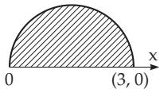

$$
{ \begin{array} { r l } & { \rho = 3 \cos \varphi \ ( 0 \leq \varphi \leq \pi / 2 ) \ ( { \mathrm { s e e ~ } } \mathbf { F } \mathbf { i g } . 8 . 3 5 ) \colon } \\ & { A = \int _ { 0 } ^ { \pi / 2 } \int _ { 0 } ^ { 3 \cos \varphi } \rho ^ { 2 } \sin ^ { 2 } \varphi d \rho d \varphi = \int _ { 0 } ^ { \pi / 2 } \sin ^ { 2 } \varphi d \varphi \left[ { \frac { \rho ^ { 3 } } { 3 } } \right] _ { 0 } ^ { 3 \cos \varphi } } \\ & { = 9 \int _ { 0 } ^ { \pi / 2 } \sin ^ { 2 } \varphi \cos ^ { 3 } \varphi d \varphi = { \frac { 6 } { 5 } } . } \end{array} }
$$

3. Evaluation with Arbitrary Curvilinear Coordinates u and v

The coordinates are defined by the relations

$$
x = x ( u , v ) , \quad y = y ( u , v )
$$

(see 3.6.3.1, p. 261). The domain of integration is partitioned by coordinate lines u = const and v = const into infinitesimal surface elements (Fig. 8.36) and the integrand is expressed by the coordinates u and v. Performing the summation along one strip, e.g., along $v =$ const, then over all strips, yields

(8.138)

$$
\int _ { S } f ( u , v ) d S = \int _ { u _ { 1 } } ^ { u _ { 2 } } \int _ { v _ { 1 } ( u ) } ^ { v _ { 2 } ( u ) } f ( u , v ) | D | d v d u .\tag{8.139}
$$

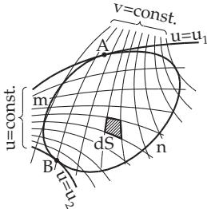  
Figure 8.36

Here $v = v _ { 1 } ( u )$ and $v = v _ { 2 } ( u )$ are the equations of the boundary

curves $A m B$ and AnB of the surface S. $u _ { 1 }$ and $u _ { 2 }$ denote the infimum and the supremum of the values of u of the points belonging to the surface S. D denotes the absolute value of the Jacobian determinant (functional determinant)

$$
D = \frac { D ( x , y ) } { D ( u , v ) } = \left| \frac { \partial x } { \partial u } \frac { \partial x } { \partial v } \right| .\tag{8.140a}
$$

The area of the elementary domain dS in curvilinear coordinates can be easily expressed:

$$
d S = \left| D \right| d v d u .\tag{8.140b}
$$

The formula (8.137b) is a special case of (8.139) for the polar coordinates $x = \rho \cos \varphi , \ y = \rho$ sin $\varphi$ . The functional determinant here i $D = \rho .$

The curvilinear coordinates are chosen so that the limits of integration in the formula (8.139) are as simple as possible, and also the integrand is not very complicated.

Calculation of $A = \int _ { S } f ( x , y )$ dS for the case when S is the inte

rior of an asteroid (see 2.13.4, p. 104), with $x = a \cos ^ { 3 } t , \ y = a \sin ^ { 3 } t$ (Fig. 8.37). First the curvilinear coordinates u and v as $x =$ u $\cos ^ { 3 } v , y = u \sin ^ { 3 }$ v are introduced whose coordinate lines $u = c _ { 1 }$ represents a family of similar asteroids with equations $x = c _ { 1 } \cos ^ { 3 } \tau$ v and $y = c _ { 1 } \sin ^ { 3 } v$ . The coordinate lines $v = c _ { 2 }$ are rays with the equations $y = k x$ , where $k = \tan ^ { 3 } c _ { 2 }$ holds. This gives

$$
D = \left| \frac { \cos ^ { 3 } v - 3 u \cos ^ { 2 } v \sin v } { \sin ^ { 3 } v } \right| = 3 u \sin ^ { 2 } v \cos ^ { 2 } v ,
$$

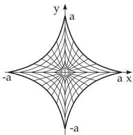

$$
A = \int _ { 0 } ^ { a } \int _ { 0 } ^ { 2 \pi } f ( x ( u , v ) , y ( u , v ) ) 3 u \sin ^ { 2 } v \cos ^ { 2 } v d v d u .
$$

Figure 8.37  
Tabelle 8.8 Plane Elements of Area
<table><tr><td rowspan=1 colspan=1>Coordinates</td><td rowspan=1 colspan=1>Element of Area</td></tr><tr><td rowspan=1 colspan=1>Cartesian coordinates $x , y$ </td><td rowspan=1 colspan=1> $d S = d y d x$ </td></tr><tr><td rowspan=1 colspan=1>Polar coordinates $\rho , \varphi$ </td><td rowspan=1 colspan=1> $d S = \rho d \rho d \varphi$ </td></tr><tr><td rowspan=1 colspan=1>Arbitrary curvilinear coordinates $u , v$ </td><td rowspan=1 colspan=1> $d S = | D | d u d v$   (D Jacobian determinant)</td></tr></table>

##### 8.4.1.3 Applications of the Double Integral

Some applications of the double integral are collected in Table 8.9, p. 528. The required areas of elementary domains in Cartesian and polar coordinates are given in Table 8.8.

#### 8.4.2 Triple Integrals

The triple integral is an extension of the notion of the integral into three-dimensional domains. It also is called volume integral.

##### 8.4.2.1 Notion of the Triple Integral

1. Definition

One defines the triple integral of a function $f ( x , y , z )$ of three variables over a three-dimensional domain V analogously to the definition of the double integral. One writes:

$$
\int _ { V } f ( x , y , z ) d V = \iiint f ( x , y , z ) d z d y d x .\tag{8.141}
$$

The volume V (Fig. 8.38) is partitioned into elementary volumes $\Delta V _ { i }$ . Then the products $f ( x _ { i } , y _ { i } , z _ { i } )$ $\Delta V _ { i }$ are formed, where the point $P _ { i } ( x _ { i } , y _ { i } , z _ { i } )$ is inside the elementary volume or it is on the boundary. The triple integral is the limit of the sum of these products with all the elementary volumes in which the volume V is partitioned, then the diameter of every elementary volume tends to zero, i.e., their number tends to . The triple integral exists only if the limit is independent of the partition into elementary volumes and the choice of the points $P _ { i } ( x _ { i } , y _ { i } , z _ { i } )$ . Then holds:

$$
\int _ { V } f ( x , y , z ) d V = \operatorname* { l i m } _ { { \stackrel { \Delta V _ { i } \to 0 } { n \to \infty } } } \sum _ { i = 1 } ^ { n } f ( x _ { i } , y _ { i } , z _ { i } ) \Delta V _ { i } .\tag{8.142}
$$

Table 8.9 Applications of the Double Integral
<table><tr><td rowspan=1 colspan=1>General Formula</td><td rowspan=1 colspan=1>Cartesian Coordinates</td><td rowspan=1 colspan=1>Polar Coordinates</td></tr><tr><td rowspan=1 colspan=3>1. Area of a plane figure:</td></tr><tr><td rowspan=1 colspan=1> $S = \int _ { S } d S$ </td><td rowspan=1 colspan=1> $ = \iint d y d x$ </td><td rowspan=1 colspan=1> $= \iint \rho d \rho d \varphi$ </td></tr><tr><td rowspan=1 colspan=3>2. Surface:</td></tr><tr><td rowspan=1 colspan=1> $S _ { O } = \int _ { S } { \frac { d S } { \cos \gamma } }$ </td><td rowspan=1 colspan=1> $= \iint { \sqrt { 1 + \left( { \frac { \partial z } { \partial x } } \right) ^ { 2 } + \left( { \frac { \partial z } { \partial y } } \right) ^ { 2 } } } d y d x$ </td><td rowspan=1 colspan=1> $= \iint { \sqrt { \rho ^ { 2 } + \rho ^ { 2 } \left( { \frac { \partial z } { \partial \rho } } \right) ^ { 2 } + \left( { \frac { \partial z } { \partial \varphi } } \right) ^ { 2 } } } d \rho d \varphi$ </td></tr><tr><td rowspan=1 colspan=3>3. Volume of a cylinder:</td></tr><tr><td rowspan=1 colspan=1> $V = \int _ { S } z d S$ </td><td rowspan=1 colspan=1> $= \iint z d y d x$ </td><td rowspan=1 colspan=1> $= \iint z \rho d \rho d \varphi$ </td></tr><tr><td rowspan=1 colspan=3>4. Moment of inertia of a plane figure, with respect to the x-axis:</td></tr><tr><td rowspan=1 colspan=1> $I _ { x } = \int _ { S } y ^ { 2 } d S$ </td><td rowspan=1 colspan=1> $\left| { \begin{array} { r l } \end{array} } \right| = \iint y ^ { 2 } d y d x$ </td><td rowspan=1 colspan=1> $= \iint \rho ^ { 3 } \sin ^ { 2 } \varphi d \rho d \varphi$ </td></tr><tr><td rowspan=1 colspan=3>5. Moment of inertia of a plane figure, with respect to the pole 0:</td></tr><tr><td rowspan=1 colspan=1> $I _ { 0 } = \int _ { S } \rho ^ { 2 } d S$ </td><td rowspan=1 colspan=1> $= \iint ( x ^ { 2 } + y ^ { 2 } ) d y d x$ </td><td rowspan=1 colspan=1> $= \iint \rho ^ { 3 } d \rho d \varphi$ </td></tr><tr><td rowspan=1 colspan=3>6. Mass of a plane figure with the density function ρ:</td></tr><tr><td rowspan=1 colspan=1> $M = \int _ { S } \varrho d S$ </td><td rowspan=1 colspan=1>二 $) \int \varrho d y d x$ </td><td rowspan=1 colspan=1>二 $\iint \varrho \rho d \rho d \varphi$ </td></tr><tr><td rowspan=1 colspan=3>7. Coordinates of the center of gravity of a homogeneous plane figure:</td></tr><tr><td rowspan=1 colspan=2> $x _ { C } = { \frac { S } { S } }$        $= { \frac { \iint x d y d x } { \iint d y d x } }$  $y _ { C } = { \frac { \displaystyle \int y d S } { \displaystyle S } }$        $= { \frac { \iint y d y d x } { \iint d y d x } }$ </td><td rowspan=1 colspan=1> $= { \frac { \iint \rho ^ { 2 } \cos \varphi d \rho d \varphi } { \iint \rho d \rho d \varphi } }$  $= { \frac { \iint \rho ^ { 2 } \sin \varphi d \rho d \varphi } { \iiint \rho d \rho d \varphi } }$ </td></tr></table>

2. Existence Theorem

The existence theorem for the triple integral is a perfect analogue of the existence theorem for the double integral.

##### 8.4.2.2 Evaluation of the Triple Integral

The evaluation of triple integrals is reduced to repeated evaluation of three ordinary integrals. If the triple integral exists, then one can consider any partition of the domain of integration.

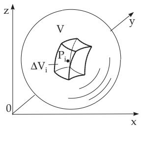  
Figure 8.38

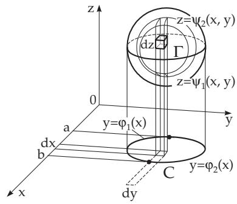  
Figure 8.39

1. Evaluation in Cartesian Coordinates

The domain of integration can be considered as a volume V here. A decomposition of the domain is formed by coordinate surfaces, in this case by planes, into infinitesimal parallelepipeds, i.e., their diameter is an infinitesimal quantity (Fig. 8.39). Then one performs the summation of all the products $f ( x , y , z ) d V$ , starting the summation along the vertical columns, i.e., summation with respect to z, then in all columns of one slice, i.e., summation with respect to y, and finally in all such slices, i.e., summation with respect to x. Every single sum for any column is an approximation sum of an integral, and if the diameter of the parallelepipeds tends to zero, then the sums tend to the corresponding integrals, and if the integrand is continuous, then this repeated integral is equal to the triple integral. Analytically:

$$
{ \begin{array} { r l } & { \int f ( x , y , z ) d V = \int _ { a } ^ { b } \left\{ \int _ { \varphi _ { 1 } ( x ) } ^ { \varphi _ { 2 } ( x ) } \left[ \int _ { \psi _ { 1 } ( x , y ) } ^ { \psi _ { 2 } ( x , y ) } f ( x , y , z ) d z \right] d y \right\} d x } \\ & { \qquad = \int _ { a } ^ { b } \int _ { \left( \int \right) } ^ { \varphi _ { 2 } ( x ) } \int _ { \left( f \left( x , y , z \right) d z d y d x . \right. } } \end{array} }\tag{8.143a}
$$

Here $z = \psi _ { 1 } ( x , y )$ and $z = \psi _ { 2 } ( x , y )$ are the equations of the lower and upper part of the surface bounding the domain of integration $V$ (see limiting curve Γ in Fig. 8.39); dx dy dz is the elementary volume in the Cartesian coordinate system. $y = \varphi _ { 1 } ( x )$ and $y = \varphi _ { 2 } ( x )$ are the functions describing the lower and upper part of the curve $C$ which is the boundary line of the projection of the volume onto the x, y plane, and $x = a$ and $x = b$ are the extreme values of the x coordinates of the points of the volume under consideration (and also the projection under consideration). There are the following postulates for the domain of integration: The functions $\varphi _ { 1 } ( x )$ and $\varphi _ { 2 } ( x )$ are defined and continuous in the interval $a \leq x \leq b ,$ and they satisfy the inequality $\varphi _ { 1 } ( x ) \leq \varphi _ { 2 } ( x )$ . The functions $\psi _ { 1 } ( x , y )$ and $\psi _ { 2 } ( x , y )$ are defined and continuous on the domain $a \leq x \leq b , \varphi _ { 1 } ( x ) \leq y \leq \varphi _ { 2 } ( x )$ , and also $\psi _ { 1 } ( x , y ) \leq \psi _ { 2 } ( x , y ) $ holds. In this way, every point $( x , y , z )$ in $V$ satisfies the relations

$$
a \leq x \leq b , \qquad \varphi _ { 1 } ( x ) \leq y \leq \varphi _ { 2 } ( x ) , \qquad \psi _ { 1 } ( x , y ) \leq z \leq \psi _ { 2 } ( x , y ) .\tag{8.143b}
$$

Just as with double integrals, the order of integration can be changed, then the limiting functions will change in the same sense. (Formally: the limits of the outermost integral must be constants, and any limit may contain variables only of exterior integrals.)

Calculate the integral $I = \int _ { V } ( y ^ { 2 } + z ^ { 2 } )$ dV for a pyramid bounded by the coordinate planes and the plane $x + y + z = 1$

$$
I = \int _ { 0 } ^ { 1 } \int _ { 0 } ^ { 1 - x } \int _ { 0 } ^ { 1 - x - y } ( y ^ { 2 } + z ^ { 2 } ) d z d y d x = \int _ { 0 } ^ { 1 } \left\{ \int _ { 0 } ^ { 1 - x } \left[ \int _ { 0 } ^ { 1 - x - y } ( y ^ { 2 } + z ^ { 2 } ) d z \right] d y \right\} d x = \frac { 1 } { 3 0 } .
$$

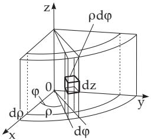  
Figure 8.40

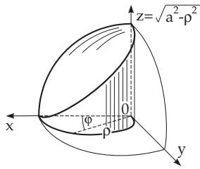  
Figure 8.41

2. Evaluation in Cylindrical Coordinates

The domain of integration is decomposed into infinitesimal elementary cells by coordinate surfaces ρ = const, ϕ = const, z = const (Fig. 8.40). The volume of an elementary domain in cylindrical coordinates (Table 8.10, p. 532) is

$$
d V = \rho d z d \rho d \varphi .\tag{8.144a}
$$

After defining the integrand by cylindrical coordinates $f ( \rho , \varphi , z )$ the integral is:

$$
\int _ { V } f ( \rho , \varphi , z ) d V = \int _ { \varphi _ { 1 } } \int _ { \rho _ { 1 } ( \varphi ) } \int _ { z _ { 1 } ( \rho , \varphi ) } f ( \rho , \varphi , z ) \rho d z d \rho d \varphi .\tag{8.144b}
$$

Calculate the integral $I = \int _ { V } d V$ for a solid (Fig. 8.41) bounded by the x, y plane, the $x , z$ plane,

the cylindrical surface $x ^ { 2 } + y ^ { 2 } = a x$ and the sphere $x ^ { 2 } + y ^ { 2 } + z ^ { 2 } = a ^ { 2 } ; z _ { 1 } = 0 , z _ { 2 } = { \sqrt { a ^ { 2 } - x ^ { 2 } - y ^ { 2 } } } =$

$$
\sqrt { a ^ { 2 } - \rho ^ { 2 } } ; \qquad \rho _ { 1 } = 0 , \ \rho _ { 2 } = a \cos \varphi ; \qquad \varphi _ { 1 } = 0 , \ \varphi _ { 2 } = \frac { \pi } { 2 } . \ I = \int _ { 0 } ^ { \pi / 2 } \int _ { 0 } ^ { a \cos \varphi } \int _ { 0 } ^ { \sqrt { a ^ { 2 } - \rho ^ { 2 } } } \rho d z d \rho d \varphi = \frac { \pi } { 2 } .
$$

$\int _ { 0 } ^ { \pi / 2 } \left\{ \int _ { 0 } ^ { a \cos \varphi } \left[ \int _ { 0 } ^ { \sqrt { a ^ { 2 } - \rho ^ { 2 } } } d z \right] \rho d \rho \right\} d \varphi = { \frac { a ^ { 3 } } { 1 8 } } ( 3 \pi - 4 )$ . Since $f ( \rho , \varphi , z ) = 1$ , the integral is equal to

⎩the volume of the solid.

3. Evaluation in Spherical Coordinates

The domain of integration is decomposed into infinitesimal elementary cells by coordinate surfaces r = const, ϕ = const, ϑ = const $( \mathbf { F i g . 8 . 4 2 } )$ . The volume of an elementary domain in spherical coordinates (see Table 8.10, p. 532) is

$$
d V = r ^ { 2 } \sin \vartheta d r d \vartheta d \varphi .\tag{8.145a}
$$

For the integrand $f ( r , \varphi , \vartheta )$ in spherical coordinates, the integral is:

$$
\intop _ { V } f ( r , \varphi , \vartheta ) d V = \intop _ { \varphi _ { 1 } } ^ { \varphi _ { 2 } } \intop _ { \vartheta _ { 1 } ( \varphi ) } ^ { \vartheta _ { 2 } ( \varphi ) r _ { 2 } ( \vartheta , \varphi ) } f ( r , \varphi , \vartheta ) r ^ { 2 } \sin \vartheta d r d \vartheta d \varphi .\tag{8.145b}
$$

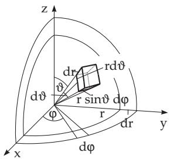  
Figure 8.42

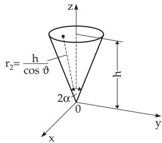  
Figure 8.43

Calculate the integral $I = \int _ { V } { \frac { \cos \vartheta } { r ^ { 2 } } } d V$ for a cone whose vertex is at the origin, and its symmetry axis

is the z-axis. The angle at the vertex is 2α, the altitude of the cone is h (Fig. 8.43). Consequently holds: $r _ { 1 } = 0 , r _ { 2 } = \frac { h } { \cos \vartheta } ; \quad \vartheta _ { 1 } = 0 , \vartheta _ { 2 } = \alpha ; \quad \varphi _ { 1 } = 0 , \varphi _ { 2 } = 2 \pi .$

$$
\begin{array} { l } { { I = \displaystyle \int _ { 0 } ^ { 2 \pi } \int _ { 0 } ^ { \alpha } \int _ { 0 } ^ { h / \cos \vartheta } \displaystyle \frac { \cos \vartheta } { r ^ { 2 } } r ^ { 2 } \sin \vartheta d r d \vartheta d \varphi = \displaystyle \int _ { 0 } ^ { 2 \pi } \left\{ \displaystyle \int _ { 0 } ^ { \alpha } \cos \vartheta \sin \vartheta \left[ \displaystyle \int _ { 0 } ^ { h / \cos \vartheta } d r \right] d \vartheta \right\} d \varphi } } \\ { { \displaystyle \quad = 2 \pi h \left( 1 - \cos \alpha \right) . } } \end{array}
$$

4. Evaluation in Arbitrary Curvilinear Coordinates u, v, w

The coordinates are defined by the equations

$$
x = x ( u , v , w ) , \qquad y = y ( u , v , w ) , \qquad z = z ( u , v , w )\tag{8.146}
$$

(see 3.6.3.1, p. 261). The domain of integration is decomposed into infinitesimal elementary cells by the coordinate surfaces u = const, v = const, w = const. The volume ofan elementary domain in arbitrary coordinates (see Table 8.10, p. 532) is:

dV = D du dv dw,

with

$$
D = \left| \begin{array} { c } { \displaystyle \frac { \partial x } { \partial u } \frac { \partial x } { \partial v } \frac { \partial x } { \partial w } } \\ { \displaystyle \frac { \partial y } { \partial u } \frac { \partial y } { \partial v } \frac { \partial y } { \partial w } } \\ { \displaystyle \frac { \partial z } { \partial u } \frac { \partial z } { \partial v } \frac { \partial z } { \partial w } } \end{array} \right| ,\tag{8.147a}
$$

i.e., D is the Jacobian determinant. For the integrand $f ( u , v , w )$ in curvilinear coordinates $u , v , w ,$ , the integral is:

$$
\int _ { V } f ( u , v , w ) d V = \int _ { u _ { 1 } } ^ { u _ { 2 } v _ { 2 } ( u ) w _ { 2 } ( u , v ) } f ( u , v , w ) | D | d w d v d u .\tag{8.147b}
$$

Remark: The formulas (8.144b) and (8.145b) are special cases of (8.147b).

For cylindrical coordinates $D = \rho$ holds, for spherical coordinates $\dot { D } = r ^ { 2 }$ sin ϑ is valid.

If the integrand is continuous, then one can change the order of integration in any coordinate system. A curvilinear coordinate system is chosen such that the determination of the limits of the integral (8.147b), and also the calculation of the integral, should be as easy as possible.

##### 8.4.2.3 Applications of the Triple Integral

Some applications of the triple integral are collected in Table 8.11, p. 533. The elementary areas corresponding to diferent coordinates are given in Table 8.8, p. 527. The elementary volumes corre-

sponding to diferent coordinates are given in Table 8.10.

Table 8.10 Elementary volumes
<table><tr><td rowspan=1 colspan=1>Coordinates</td><td rowspan=1 colspan=1>Elementary Volume</td></tr><tr><td rowspan=1 colspan=1>Cartesian coordinates x, $y , z$ </td><td rowspan=1 colspan=1> $d V = d x d y d z$ </td></tr><tr><td rowspan=1 colspan=1>Cylindrical coordinates $\rho , \varphi , z$ </td><td rowspan=1 colspan=1> $d V = \rho d \rho d \varphi d z$ </td></tr><tr><td rowspan=1 colspan=1>Spherical coordinates r $\vartheta , \varphi$ </td><td rowspan=1 colspan=1> $d V = r ^ { 2 } \sin \vartheta d r d \vartheta d \varphi$ </td></tr><tr><td rowspan=1 colspan=1>Arbitrary curvilinear coordinates u, v, w</td><td rowspan=1 colspan=1> $d V = | D | d u d v d w$  (D Jacobian determinant)</td></tr></table>
