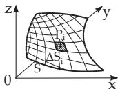
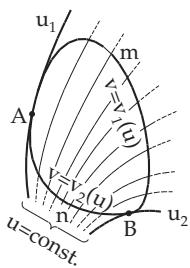
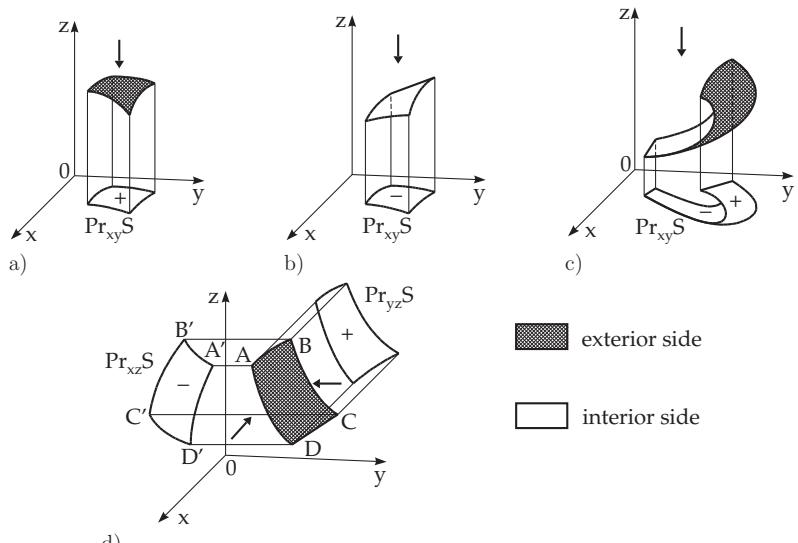
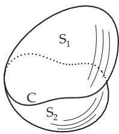

### 8.5 Surface Integrals

There are distinguished surface integrals of the first type, of the second type, and of general type, analogously to the three diferent line integrals (see 8.3, p. 515).

#### 8.5.1 Surface Integral of the First Type

The surface integral or integral over a surface in space is the generalization of the double integral, similarly as the line integral of the first type (see 8.3.1, p. 516) is a generalization of the ordinary integral.

##### 8.5.1.1 Notion of the Surface Integral of the First Type

1. Definition

The surface integral ofthe first type of a function $u = f ( x , y , z )$ of three variables defined in a connected

domain is the integral

  
Figure 8.44

$$
\int _ { S } f ( x , y , z ) d S ,\tag{8.148a}
$$

over a region $S$ of a surface. The numerical value of the surface integral of the first kind is defined in the following way (see Fig. 8.44):

1. Decomposition of the region S in an arbitrary way into n elementary regions $\Delta { \cal { S } } _ { i }$

2. Choosing an arbitrary point $P _ { i } ( x _ { i } , y _ { i } , z _ { i } )$ inside or on the boundary of each elementary region $\Delta \boldsymbol { S } _ { i }$

3. Multiplication of the value $f ( x _ { i } , y _ { i } , z _ { i } )$ of the function at this point by the area $\Delta S _ { i }$ of the corresponding elementary region.

4. Summation of the products $f ( x _ { i } , y _ { i } , z _ { i } ) \Delta S _ { i }$

5. Determination of the limit of the sum

$$
\sum _ { i = 1 } ^ { n } f ( x _ { i } , y _ { i } , z _ { i } ) \Delta S _ { i }\tag{8.148b}
$$

as the diameter of each elementary region tends to zero, so $\Delta \boldsymbol { S } _ { i }$ tends to zero, hence, their number n tends to $\infty$ (see 8.4.1.1, 1., p. 524).

If this limit exists and is independent of the particular decomposition of the region S into elementary regions and also of the choice of the points $P _ { i } ( x _ { i } , y _ { i } , z _ { i } )$ , then it is called the surface integral ofthe first type of the function $u = f ( x , y , z )$ over the region S, and one writes:

$$
\int _ { S } f ( x , y , z ) d S = \operatorname* { l i m } _ { { \underset { n  \infty } { \infty } } \atop { \mathrm { \scriptsize { \it ~ a p } } } \atop { \mathrm { \scriptsize { \it { \omega } } } } } \sum _ { i = 1 } ^ { n } f ( x _ { i } , y _ { i } , z _ { i } ) \Delta S _ { i } .\tag{8.148c}
$$

2. Existence Theorem

If the function $f ( x , y , z )$ is continuous on the domain, and the functions defining the surface have continuous derivatives here, the surface integral of the first type exists.

Table 8.11 Applications of the Triple Integral
<table><tr><td>General Formula</td><td>Cartesian Coordinates</td><td>Cylindrical Coordinates</td><td>Spherical Coordinates</td></tr><tr><td colspan="4">1. Volume of a solid</td></tr><tr><td> $V = \int _ { V } d V = { }$ </td><td> $\iiint d z d y d x$ </td><td> $\iiint \rho d z d \rho d \varphi$ </td><td> $\iiint r ^ { 2 } \sin \vartheta d r d \vartheta d \varphi$ </td></tr><tr><td colspan="4">2. Axial moment of inertia of a solid with respect to the z-axis</td></tr><tr><td> $I _ { z } = \int _ { v } \rho ^ { 2 } V =$ </td><td> $\iiint ( x ^ { 2 } + y ^ { 2 } ) d z d y d x$ </td><td> $\iiint \rho ^ { 3 } d z d \rho d \varphi$ </td><td> $\iiint r ^ { 4 } \sin ^ { 3 } \vartheta d r d \vartheta d \varphi$ </td></tr><tr><td colspan="4">3. Mass of a solid with the density function ρ</td></tr><tr><td> $M = \int _ { V } \varrho d V =$ </td><td> $\iiint \varrho d z d y d x$ </td><td> $\iiint \varrho \rho d z d \rho d \varphi$ </td><td> $\iiint \varrho r ^ { 2 } \sin \vartheta d r d \vartheta d \varphi$ </td></tr><tr><td colspan="4">4. Coordinates of the center of a homogeneous solid</td></tr><tr><td rowspan="4"> $\ x _ { C } = { \frac { \displaystyle \int x d V } { \displaystyle V } } =$   $y _ { C } = { \frac { \displaystyle \int y d V } { \displaystyle V } } =$ </td><td> $\iiint x d z d y d x$ </td><td> $\iiint \rho ^ { 2 } \cos \varphi d \rho d \varphi d z$ </td><td rowspan="4"> $\iiint r ^ { 3 } \sin ^ { 2 } \vartheta \cos \varphi d r d \vartheta d \varphi$   $\iiint r ^ { 2 } \sin \vartheta d r d \vartheta d \varphi$   $\iiint r ^ { 3 } \sin ^ { 2 } \vartheta \sin \varphi d r d \vartheta d \varphi$ </td></tr><tr><td> $\iiint d z d y d x$ </td><td> $\iiint \rho d \rho d \varphi d z$ </td></tr><tr><td> $\frac { \iiint y d z d y d x } { \iiint d z d y d x }$ </td><td> $\iiint \rho ^ { 2 } \sin \varphi d \rho d \varphi d z$  ∬ρdρdφ dz</td></tr><tr><td> $\iiint z d z d y d x$ </td><td> $\iiint r ^ { 2 } \sin \vartheta d r d \vartheta d \varphi$   $\iiint \rho z d \rho d \varphi d z$   $\iiint r ^ { 3 } \sin \vartheta \cos \vartheta d r d \vartheta d \varphi$ </td></tr><tr><td rowspan="2"> $z _ { C } = \frac { \displaystyle \int z d V } { \displaystyle V } =$ </td><td> $\iiint d z d y d x$ </td><td> $\iiint \rho d \rho d \varphi d z$ </td></tr><tr><td></td><td> $\iiint r ^ { 2 } \sin \vartheta d r d \vartheta d \varphi$ </td></tr></table>

##### 8.5.1.2 Evaluation of the Surface Integral of the First Type

The evaluation of the surface integral of the first type is reduced to the evaluation of a double integral over a planar domain (see 8.4.1, p. 524).

1. Explicit Representation of the Surface

If the surface S is given by the equation

$$
z = z ( x , y )\tag{8.149}
$$

in explicit form, then

$$
\intop _ { S } f ( x , y , z ) d S = \intop _ { S ^ { \prime } } f [ x , y , z ( x , y ) ] \sqrt { 1 + p ^ { 2 } + q ^ { 2 } } d x d y ,\tag{8.150a}
$$

is valid, where $S ^ { \prime }$ is the projection of S onto the x, y plane and $p$ and $q$ are the partial derivatives $p = { \frac { \partial z } { \partial x } } , \ q = { \frac { \partial z } { \partial y } }$ . Here one assumes that to every point of the surface S there corresponds a unique

point in $S ^ { \prime }$ in the x, y plane, i.e., the points of the surface are defined uniquely by their coordinates. If it does not hold, one decomposes S into several parts each of which satisfies the condition. Then the integral on the total surface can be calculated as the algebraic sum of the integrals over these parts of $S$

The equation (8.150a) can be written in the form

$$
\int _ { S } f ( x , y , z ) d S = \int _ { S _ { x y } } f [ x , y , z ( x , y ) ] { \frac { d S _ { x y } } { \cos \gamma } } ,\tag{8.150b}
$$

since the equation of the surface normal of (8.149) has the form ${ \frac { X - x } { p } } = { \frac { Y - y } { q } } = { \frac { Z - z } { - 1 } }$ (see Table 3.29, p. 264), since for the angle between the direction of the normal and the z-axis, cos $\gamma =$ $\frac { 1 } { \sqrt { 1 + p ^ { 2 } + q ^ { 2 } } }$ holds. In evaluating a surface integral of the first type, this angle $\gamma$ is always considered as an acute angle, so cos $\gamma > 0$ always holds.

2. Parametric Representation of the Surface

If the surface S is given in parametric form by the equations

  
Figure 8.45

$$
\begin{array} { r l r } {  { x = x ( u , v ) , \qquad y = y ( u , v ) , \qquad z = z ( u , v ) , } } \\ & { } & { \big ( \mathrm { F i g . ~ } 8 . 4 5 \big ) , \mathrm { t h e n } } \\ & { } & { \displaystyle \int _ { S } f ( x , y , z ) d S } \\ & { } & { \displaystyle = \iint f [ x ( u , v ) , y ( u , v ) , z ( u , v ) ] \sqrt { E G - F ^ { 2 } } d u d v , } \end{array}\tag{8.151a}
$$

(8.151b)

where the functions E, F, and G are the quantities given in 3.6.3.3, 1., p. 263. The elementary region in parametric form is

$$
{ \sqrt { E G - F ^ { 2 } } } d u d v = d S ,\tag{8.151c}
$$

and $\Delta$ is the domain of the parameters u and v corresponding to the given surface region. The evaluation is performed by a repeated integration with respect to v and u:

$$
\int _ { S } \phi ( u , v ) d S = \int _ { u _ { 1 } } ^ { u _ { 2 } } \int _ { v _ { 1 } ( u ) } ^ { v _ { 2 } ( u ) } \phi ( u , v ) { \sqrt { E G - F ^ { 2 } } } d v d u , \quad \phi = f [ x ( u , v ) , y ( u , v ) , z ( u , v ) ] .\tag{8.151d}
$$

Here $u _ { 1 }$ and $u _ { 2 }$ are coordinates of the extreme coordinate lines $u \ = \mathrm { c o n s t }$ enclosing the region $S$ (Fig. 8.45), and $\boldsymbol { v } ~ = ~ v _ { 1 } ( u )$ and $ { \boldsymbol { v } } \ = \  { \boldsymbol { v } } _ { 2 } ( u )$ are the equations of the curves $A \widehat { m } B$ and $\widehat { A n B }$ of the boundary of S.

Remark: The formula (8.150a) is a special case of (8.151b) for

$$
u = x , \quad v = y , \quad E = 1 + p ^ { 2 } , \quad F = p q , \quad G = 1 + q ^ { 2 } .\tag{8.152}
$$

3. Elementary Regions of Curved Surfaces

The elementary regions of curved surfaces are given in Table 8.12.

Table 8.12 Elementary Regions of Curved Surfaces
<table><tr><td rowspan=1 colspan=1>Coordinates</td><td rowspan=1 colspan=1>Elementary Region</td></tr><tr><td rowspan=1 colspan=1>Cartesian coordinates x, $y , z = z ( x , y )$ </td><td rowspan=1 colspan=1> $d S = \sqrt { 1 + ( \frac { \partial z } { \partial x } ) ^ { 2 } + ( \frac { \partial z } { \partial y } ) ^ { 2 } } d x d y$ </td></tr><tr><td rowspan=1 colspan=1>Cylindrical lateral surface,R (const. radius), coordinates $\varphi , z$ </td><td rowspan=1 colspan=1> $d S = R d \varphi d z$ </td></tr><tr><td rowspan=1 colspan=1>Spherical surface R (const. radius),coordinates θ $\underline { { \varphi } }$ </td><td rowspan=1 colspan=1> $d S = R ^ { 2 } \sin \vartheta d \vartheta d \varphi$ </td></tr><tr><td rowspan=1 colspan=1>Arbitrary curvilinear coordinates $u , v$ (E, F, G see differential of arc, p. 263)</td><td rowspan=1 colspan=1> $d S = { \sqrt { E G - F ^ { 2 } } } d u d v$ </td></tr></table>

##### 8.5.1.3 Applications of the Surface Integral of the First Type

1. Surface Area of a Curved Surface

$$
S = \int _ { S } d S .\tag{8.153}
$$

2. Mass of an Inhomogeneous Curved Surface S

With the coordinate-dependent density $\varrho = f ( x , y , z )$ it follows:

$$
M _ { S } = \int _ { S } \varrho \ : d S .\tag{8.154}
$$

#### 8.5.2 Surface Integral of the Second Type

The surface integral of the second type, also called an integral over a projection, is a generalization of the notion of double integral similarly to the surface integral of the first type.

##### 8.5.2.1 Notion of the Surface Integral of the Second Type

1. Notion of an Oriented Surface

A surface usually has two sides, and one of them can be chosen arbitrarily as the exterior one. If the exterior side is fixed, it is called an oriented surface. Surfaces for which one can not define two sides are not discussed here (see [8.7]).

2. Projection of an Oriented Surface onto a Coordinate Plane

Projecting a bounded part S of an oriented surface onto a coordinate plane, e.g., onto the x,y plane, one can consider this projection $P r _ { x y } S$ as positive or negative in the following way (Fig. 8.46):

a) If the x, y plane is looked at from the positive direction of the z-axis, and one sees the positive side of the surface S, where the exterior part is considered to be positive, then the projection $\hat { P r } _ { x y } S$ has a positive sign, otherwise it has a negative sign (Fig. 8.46 a,b). b) If one part of the surface shows its positive side and the other part its negative side, then the projection $P r _ { x y } \bar { S }$ is regarded as the algebraic sum of the positive and negative projections (Fig. 8.46c).

The Fig. 8.46d shows the projections $P r _ { x z } S$ and $P r _ { y z } S$ of a surface $S ;$ one of them is positive the other one is negative.

The projection of a closed oriented surface is equal to zero.

  
Figure 8.46

3. Definition of the Surface Integral of the Second Type over a Projection onto a Coordinate Plane

The surface integral ofthe second type of a function $f ( x , y , z )$ of three variables defined in a connected domain is the integral

$$
\int _ { S } f ( x , y , z ) d x d y ,\tag{8.155}
$$

over the projection of an oriented surface S onto the x, y plane, where S is in the same domain where the function is defined, and if there is a one-to-one correspondence between the points of the surface and its projection. The numerical value of the integral is obtained in the same way as the surface integral of the first type except that in the third step the function value $f ( x _ { i } , y _ { i } , z _ { i } )$ is not multiplied by the elementary region $\Delta \hat { S } _ { i }$ , but by its projection $P r _ { x y } \Delta S _ { i }$ , oriented according to 8.5.2.1, 2., p. 535 on the x, y plane. Then holds:

$$
\intop _ { S } f ( x , y , z ) d x d y = \operatorname* { l i m } _ { { \Delta S _ { i }  0 } \atop { n  \infty } } \sum _ { i = 1 } ^ { n } f ( x _ { i } , y _ { i } , z _ { i } ) P r _ { x y } { \Delta S _ { i } } .\tag{8.156a}
$$

Defining analogously the surface integrals of the second type over the projections of the oriented surface S onto the $y , z$ plane and onto the z, x plane one gets:

$$
\intop _ { S } f ( x , y , z ) d y d z = \operatorname* { l i m } _ { \underset { n  \infty } { \operatorname { a s } }  0 } \sum _ { i = 1 } ^ { n } f ( x _ { i } , y _ { i } , z _ { i } ) P r _ { y z } \Delta S _ { i } ,\tag{8.156b}
$$

$$
\intop _ { S } f ( x , y , z ) d z d x = \operatorname* { l i m } _ { { \Delta S _ { i }  0 } \atop { n  \infty } } \sum _ { i = 1 } ^ { n } f ( x _ { i } , y _ { i } , z _ { i } ) P r _ { z x } { \Delta S _ { i } } .\tag{8.156c}
$$

4. Existence Theorem for the Surface Integral of the Second Type

The surface integral of the second type (8.156a,b,c) exists if the function $f ( x , y , z )$ is continuous and the equations defining the surface are continuous and have continuous derivatives.

##### 8.5.2.2 Evaluation of Surface Integrals of the Second Type

The principal method is to reduce it to the evaluation of double integrals.

1. Surface Given in Explicit Form

If the surface S is given by the equation

$$
z = \varphi ( x , y )\tag{8.157}
$$

in explicit form, then the integral (8.156a) is calculated by the formula

$$
\intop _ { S } f ( x , y , z ) d x d y = \intop _ { P r _ { x y } S } f [ x , y , \varphi ( x , y ) ] d S _ { x y } ,\tag{8.158a}
$$

where $S _ { x y } = P r _ { x y } S$ . The surface integral of the function $f ( x , y , z )$ over the projections of the surface S onto the other coordinate planes is calculated similarly:

$$
\int _ { S } f ( x , y , z ) d y d z = \int _ { P r _ { y z } S } f [ \psi ( y , z ) , y , z ] d S _ { y z } ,\tag{8.158b}
$$

where one substitutes $x = \psi ( y , z )$ , the equation of the surface S solved for $x ,$ and $\begin{array} { r } { S _ { y z } = P r _ { y z } S } \end{array}$

$$
\intop _ { S } f ( x , y , z ) d z d x = \intop _ { P r _ { z x } S } f [ x , \chi ( z , x ) , z ] d S _ { z x } ,\tag{8.158c}
$$

where one substitutes $y = \chi ( z , x )$ , the equation of the surface $S$ solved for $y ,$ and $S _ { z x } = P r _ { z x } S$ . If the orientation of the surface is changed, i.e., if interchanging the exterior and interior sides, then the integral over the projection changes its sign.

2. Surface Given in Parametric Form

If the surface is given by the equations

$$
x = x ( u , v ) , \qquad y = y ( u , v ) , \qquad z = z ( u , v )\tag{8.159}
$$

in parametric form, one calculates the integrals (8.156a,b,c) with help of the following formulas:

$$
\intop _ { S } f ( x , y , z ) d x d y = \intop _ { \Delta } f [ x ( u , v ) , y ( u , v ) , z ( u , v ) ] { \frac { D ( x , y ) } { D ( u , v ) } } d u d v ,\tag{8.160a}
$$

$$
\intop _ { S } f ( x , y , z ) d y d z = \intop _ { \Delta } f [ x ( u , v ) , y ( u , v ) , z ( u , v ) ] \frac { D ( y , z ) } { D ( u , v ) } d u d v ,\tag{8.160b}
$$

$$
\intop _ { S } f ( x , y , z ) d z d x = \intop _ { \Delta } f [ x ( u , v ) , y ( u , v ) , z ( u , v ) ] { \frac { D ( z , x ) } { D ( u , v ) } } d u d v .\tag{8.160c}
$$

Here the expressions $\frac { D ( x , y ) } { D ( u , v ) } , \frac { D ( y , z ) } { D ( u , v ) } , \frac { D ( z , x ) } { D ( u , v ) }$ are the Jacobian determinants of pairs of functions x, y, z with respect to the variables u and $v ; \Delta$ is the domain of u and v corresponding to the surface S.

#### 8.5.3 Surface Integral in General Form

##### 8.5.3.1 Notion of the Surface Integral in General Form

${ \mathrm { I f } } P ( x , y , z ) , Q ( x , y , z ) , R ( x , y , z )$ are three functions of three variables defined in a connected domain and S is an oriented surface contained in this domain, the sum of the integrals of the second type taken

over the projections on the three coordinate planes is called the surface integral in general form:

$$
\int _ { s } \left( P d y d z + Q d z d x + R d x d y \right) = \int _ { s } P d y d z + \int _ { s } Q d z d x + \int _ { s } R d x d y .\tag{8.161}
$$

The formula reducing the surface integral to a double integral is:

$$
\int _ { s } \left( P d y d z + Q d z d x + R d x d y \right) = \int _ { \Delta } \left[ P \frac { D ( y , z ) } { D ( u , v ) } + Q \frac { D ( z , x ) } { D ( u , v ) } + R \frac { D ( x , y ) } { D ( u , v ) } \right] d u d v ,\tag{8.162}
$$

where the quantities $\frac { D ( x , y ) } { D ( u , v ) } , \frac { D ( y , z ) } { D ( u , v ) } , \frac { D ( z , x ) } { D ( u , v ) }$ , and $\Delta$ have the same meaning, as above.

Remark: The surface integral of vector-valued functions is discussed in the chapter about the theory of vector fields (see 13.3.2. p. 722).

##### 8.5.3.2 Properties of the Surface Integrals

1. If the domain of integration, i.e., the surface S, is decomposed into two parts $S _ { 1 }$ and $S _ { 2 }$ (see Fig.   
8.47), then

$$
\begin{array} { r l r } {  { \int ( P d y d z + Q d z d x + R d x d y ) = } } & { } & { \int ( P d y d z + Q d z d x + R d x d y ) } \\ & { \stackrel { S } { = } } & { \int ( P d y d z + Q d z d x + R d x d y ) . } \\ & { } & { + \int ( P d y d z + Q d z d x + R d x d y ) . } \end{array}\tag{8.163}
$$

2. If the orientation of the surface is reversed, i.e., the exterior and interior sides are interchanged, the integral changes its sign:

$$
\int _ { S ^ { + } } ( P d y d z + Q d z d x + R d x d y ) = - \int _ { S ^ { - } } ( P d y d z + Q d z d x + R d x d y ) ,\tag{8.164}
$$

where $S ^ { + }$ and $S ^ { - }$ denote the same surface with diferent orientation.

3. A surface integral depends, in general, on the line bounding the surface region S as well as on the surface itself. Thus the integrals taken over two diferent non-closed surface regions $S _ { 1 }$ and $S _ { 2 }$ spanned by the same closed curve C are, in general, not equal (Fig. 8.47):

$$
\begin{array} { c } { { \displaystyle \int ( P d y d z + Q d z d x + R d x d y ) } } \\ { { \displaystyle } } \\ { { \displaystyle \neq \int ( P d y d z + Q d z d x + R d x d y ) . } } \\ { { \displaystyle } } \\ { { S _ { 2 } } } \end{array}
$$

(8.165)

Figure 8.47

4. An application of the surface integral is the calculation of the volume V of a solid bounded by a closed surface S . The integral can be expressed and calculated in the form

$$
V = { \frac { 1 } { 3 } } \int _ { S } ( x d y d z + y d z d x + z d x d y ) ,\tag{8.166}
$$

$$
V = \int _ { s } \ x d y d z \ { \mathrm { o r } } \ V = \int _ { s } \ y d z d x \ { \mathrm { o r } } \ V = \int _ { s } \ z d x d y \ { \mathrm { o r } }\tag{8.167a}
$$

$$
V = { \frac { 1 } { 3 } } \int _ { S } ( x d y d z + y d z d x + z d x d y )\tag{8.167b}
$$

where S is oriented so that its exterior side is positive.

Calculation of the volume V of a sphere with surface $S$ according to $x ^ { 2 } + y ^ { 2 } + z ^ { 2 } = R ^ { 2 }$ : Using spherical coordinates $x = R$ sin ϑ cos $\varphi , y = R$ sin ϑ sin $\varphi , z = R$ cos ϑ $( 0 \leq \vartheta \leq \pi , 0 \leq \varphi \leq 2 \pi )$ and the Jacobian determinant as in (8.160a)

$$
{ \frac { D ( x , y ) } { D ( \vartheta , \varphi ) } } = \left| { x _ { \vartheta } } \ { x _ { \varphi } } \right| = R ^ { 2 } \cos { \vartheta } \sin { \vartheta }\tag{8.168a}
$$

follows from the third integral in (8.167a)

$$
V = \int _ { \varphi = 0 } ^ { 2 \pi } \int _ { \vartheta = 0 } ^ { \pi } R ^ { 3 } \cos ^ { 2 } \vartheta \sin \vartheta d \vartheta d \varphi = 2 \pi R _ { \vartheta } ^ { 3 } \intop _ { 0 } ^ { \pi } \cos ^ { 2 } \vartheta \sin \vartheta d \vartheta = \frac { 4 } { 3 } \pi R _ { \vartheta } ^ { 3 } .\tag{8.168b}
$$
