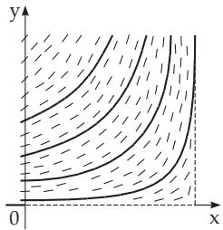
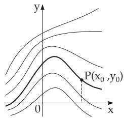

##### 9.1.1.1 Existence Theorems, Direction Field

1. Existence of a Solution

In accordance with the Cauchy existence theorem the diferential equation

$$
y ^ { \prime } = f ( x , y )\tag{9.2}
$$

\- Springer-Verlag Berlin Heidelberg 2015 I.N. Bronshtein et al., Handbook of Mathematics, DOI 10.1007/978-3-662-46221-8\_9

540

has at least one solution in a neighborhood of $x _ { 0 }$ such that it takes the value $y _ { 0 }$ at $x = x _ { 0 }$ if the function $f ( x , y )$ is continuous in a neighborhood G of the point $( x _ { 0 } , y _ { 0 } )$ . For example, $G$ can be selected as the region given by $| x - x _ { 0 } | < a$ and $| y - y _ { 0 } | < b$ with some a and b.

2. Lipschitz Condition

The Lipschitz condition with respect to y is satisfied by $f ( x , y )$ if

$$
| f ( x , y _ { 1 } ) - f ( x , y _ { 2 } ) | \leq N | y _ { 1 } - y _ { 2 } |\tag{9.3}
$$

holds for all $( x , y _ { 1 } )$ and $( x , y _ { 2 } )$ from G, where N is independent of $x , y _ { 1 }$ , and $y _ { 2 }$ . If this condition is satisfied, then the diferential equation (9.2) has a unique solution through $( x _ { 0 } , y _ { 0 } )$ The Lipschitz condition is obviously satisfied if $\scriptstyle { f ( x , y ) }$ has a bounded partial derivative $\partial \stackrel { \smile } { f } / \partial \stackrel { \smile } { y }$ in this neighborhood. In 9.1.1.4, p. 546 there are examples in which the assumptions of the Cauchy existence theorem are not satisfied.

3. Direction Field

If the graph of a solution $y = \varphi ( x )$ of the diferential equation $y ^ { \prime } = f ( x , y )$ goes through the point $P ( x , y )$ , then the slope $d y / d x$ of the tangent line of the graph at this point can be determined from the diferential equation. So, at every point $( x , y )$ the diferential equation defines the slope of the tangent line of the solution passing through the considered point. The collection of these directions (Fig. 9.1) forms the direction field. An element of the direction field is a point together with the direction associated to it. Integration of a first-order diferential equation geometrically means to connect the elements of a direction field into an integral curve, whose tangents have the same slopes at all points as the corresponding elements of the direction field.

  
Figure 9.1

  
Figure 9.2

4. Vertical Directions

If a vertical direction can be found in a direction field, e.a., if the function $f ( x , y )$ has a pole, then one can change the role of the independent and dependent variables and consider the diferential equation

$$
{ \frac { d x } { d y } } = { \frac { 1 } { f ( x , y ) } }\tag{9.4}
$$

as an equivalent equation to (9.2). In the region where the conditions of the existence theorems are fulfilled for the diferential equations (9.2) or (9.4), there exists a unique integral curve (Fig. 9.2) through every point $P ( x _ { 0 } , y _ { 0 } )$

5. General Solution

The set of all integral curves of (9.2) can be characterized by one parameter and it can be given by the equation

$$
F ( x , y , C ) = 0\tag{9.5a}
$$

of the corresponding one-parameter family of curves. The parameter $C ,$ an arbitrary constant, can be chosen freely and it is a necessary part of the general solution of every first-order diferential equation.

A particular solution $y = \varphi ( x )$ , which satisfies the condition $y _ { 0 } = \varphi ( x _ { 0 } )$ , can be obtained from the general solution (9.5a) if C is expressed from the equation

$$
F ( x _ { 0 } , y _ { 0 } , C ) = 0 .\tag{9.5b}
$$
