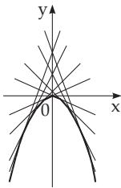
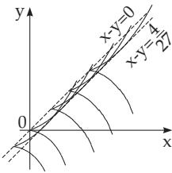

##### 9.1.1.3 Implicit Differential Equations

1. Solution in Parametric Form

Given a diferential equation in implicit form

$$
F ( x , y , y ^ { \prime } ) = 0 .\tag{9.14}
$$

There are n integral curves passing through a point $P ( x _ { 0 } , y _ { 0 } )$ if the following conditions hold:

a) The equation $F ( x _ { 0 } , y _ { 0 } , p ) = 0 ~ ( p = d y / d x )$ has n real roots $p _ { 1 } , \ldots , p _ { n }$ at the point $P ( x _ { 0 } , y _ { 0 } )$

b) The function $F ( x , y , p )$ and its first partial derivatives are continuous at $x = x _ { 0 } , y = y _ { 0 } , p = p _ { i } ;$ furthermore $\partial { \cal F } / \partial p \neq 0$

If the original equation can be solved with respect to $y ^ { \prime } .$ , then it yields n equations of the explicit forms discussed above. Solving these equations one gets n families of integral curves. If the equation can be written in the form $x = \varphi ( y , y ^ { \prime } )$ or $y = \psi ( x , y ^ { \prime } )$ , then putting $y ^ { \prime } = p$ and considering p as an auxiliary variable, after diferentiation with respect to y or x one obtains an equation for $d p / { \bar { d y } }$ or $d p / d x$ which is solved with respect to the derivative. A solution of this equation together with the original equation (9.14) determines a desired solution in parametric form.

To get the solution of the diferential equation $x = y y ^ { \prime } + y ^ { \prime 2 }$ , one substitutes $y ^ { \prime } = p$ and gets $x =$ $p y + p ^ { 2 }$ . Diferentiation with respect to y and substituting ${ \frac { d x } { d y } } = { \frac { 1 } { p } }$ results in $\frac { 1 } { p } = p + ( y + 2 p ) \frac { d p } { d y }$ or ${ \frac { d y } { d p } } - { \frac { p y } { 1 - p ^ { 2 } } } = { \frac { 2 p ^ { 2 } } { 1 - p ^ { 2 } } }$ . Solving this equation for y one obtains $y = - p + { \frac { C + \arcsin p } { \sqrt { 1 - p ^ { 2 } } } } \ ( C \ \mathrm { c o n s t } )$ Substitution into the initial equation gives the solution for x in parametric form.

2. Lagrange Diferential Equation

The Lagrange diferential equation is the equation

$$
a ( y ^ { \prime } ) x + b ( y ^ { \prime } ) y + c ( y ^ { \prime } ) = 0 .\tag{9.15a}
$$

The solution can be determined by the method given above. If for $p = p _ { 0 }$ holds

$$
a ( p ) + b ( p ) p = 0 ,
$$

(9.15b)

is a singular solution of (9.15a).

$$
\mathrm { t h e n } a ( p _ { 0 } ) x + b ( p _ { 0 } ) y + c ( p _ { 0 } ) = 0\tag{9.15c}
$$

3. Clairaut Diferential Equation

The Clairaut diferential equation is the special case of the Lagrange diferential equation if

$$
a ( p ) + b ( p ) p \equiv 0 ,\tag{9.16a}
$$

and so it can be transformed into the form

$$
y = y ^ { \prime } x + f ( y ^ { \prime } ) .\tag{9.16b}
$$

The general solution is

$$
y = C x + f ( C ) .\tag{9.16c}
$$

Besides the general solution, the Clairaut diferential equation also has a singular solution, which can be obtained by eliminating the constant C from the equations

$$
y = C x + f ( C )
$$

$$
( 9 . 1 6 \mathrm { d } ) \qquad \mathrm { a n d } \quad 0 = x + f ^ { \prime } ( C ) ,\tag{9.16e}
$$

The second equation can be obtained by diferentiating the first one with respect to C. Geometrically, the singular solution is the envelope (see 3.6.1.7, p. 255) of the solution family of lines (Fig. 9.3).

Solution of the diferential equation $y = x y ^ { \prime } + y ^ { \prime 2 }$ . The general solution is $y = C x + C ^ { 2 }$ . The singular solution one gets with the help of the equation $x + 2 C = 0$ to eliminate $C ,$ and hence $x ^ { 2 } + 4 y = 0$ Fig. 9.3 shows this case.

  
Figure 9.3

  
Figure 9.4
