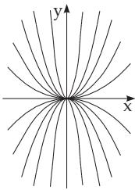
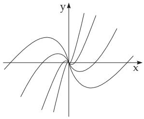
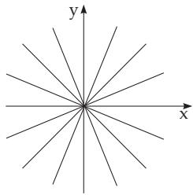
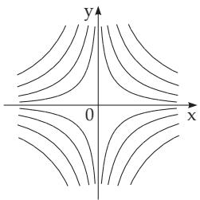
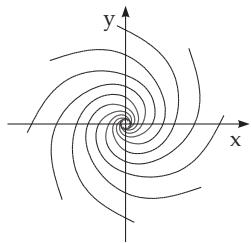
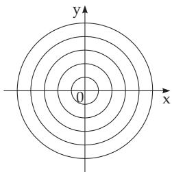

##### 9.1.1.4 Singular Integrals and Singular Points

1. Singular element

An element $( x _ { 0 } , y _ { 0 } , y _ { 0 } ^ { \prime } )$ is called a singular element of the diferential equation, if in addition to the diferential equation

$$
F ( x , y , y ^ { \prime } ) = 0\tag{9.17a}
$$

it also satisfies the equation

$$
\frac { \partial F } { \partial y ^ { \prime } } = 0 .\tag{9.17b}
$$

2. Singular Integral

An integral curve from singular elements is called a singular integral curve; the equation

$$
\varphi ( x , y ) = 0\tag{9.17c}
$$

of a singular integral curve is called a singular integral. The envelopes of the integral curves are singular integral curves (Fig. 9.3); they consist of the singular elements.

The uniqueness of the solution (see 9.1.1.1, 1., p. 540) usually fails at the points of a singular integral curve.

3. Determination of Singular Integrals

Usually one cannot obtain singular integrals for any values of the arbitrary constants of the general solution. To determine the singular solution of a diferential equation (9.17a) with $p = y ^ { \prime }$ one has to

introduce the equation

$$
\frac { \partial F } { \partial p } = 0\tag{9.17d}
$$

and to eliminate $p .$ . If the obtained relation is a solution of the given diferential equation, then it is a singular solution. The equation of this solution should be transformed into a form which does not contain multiple-valued functions, in particular no radicals where the complex values should also be considered.

Radicals are expressions obtained by nesting algebraic equations (see 2.2.1, p. 62). If the equation of the family of integral curves is known, i.e., the general solution of the given diferential equation is known, then one can determine the envelope of the family of curves, the singular integral, with the methods of diferential geometry (see 3.6.1.7, p. 255).

Solution of the diferential equation $x - y - { \frac { 4 } { 9 } } y ^ { \prime 2 } + { \frac { 8 } { 2 7 } } y ^ { \prime 3 } = 0$ . Substituting $y ^ { \prime } = p ,$ , the calculation of the additional equation with (9.17d) yields $- \frac { 8 } { 9 } p + \frac { 8 } { 9 } p ^ { 2 } = 0$ . Elimination of $p$ results in equation a) $x - y = 0$ and b) $x - y = { \frac { 4 } { 2 7 } }$ , where a) is not a solution, b) is a solution, a special case of the general solution $( y - C ) ^ { 2 } = ( x - C ) ^ { 3 }$ . The integral curves of a) and b) are shown in Fig. 9.4.

4. Singular Points of a Diferential Equation

Singular points of a diferential equation are the points where the right side of the diferential equation y = f(x, y) (9.18a)

is not defined. This is the case, e.g., in the diferential equations of the following forms:

1. Diferential Equation with a Fraction of Linear Functions

$$
{ \frac { d y } { d x } } = { \frac { a x + b y } { c x + e y } } \qquad ( a e - b c \neq 0 )\tag{9.18b}
$$

has an isolated singularpoint at (0, 0), since the assumptions of the existence theorem are fulfilled almost at every point arbitrarily close to (0, 0) but not at this point itself. The conditions are not fulfilled at the points where $c x + e y = 0$ . One can force the fulfillment of the conditions at these points exchanging the role of the variables and considering the equation

$$
{ \frac { d x } { d y } } = { \frac { c x + e y } { a x + b y } } .\tag{9.18c}
$$

The behavior of the integral curve in the neighborhood of a singular point depends on the roots of the characteristic equation

$$
\lambda ^ { 2 } - ( b + c ) \lambda + b c - a e = 0 .\tag{9.18d}
$$

The following cases can be distinguished:

Case 1: If the roots are real and they have the same sign, then the singular point is a branch point. The integral curves in a neighborhood of the singular point pass through it and if the roots of the characteristic equation do not coincide, they have a common tangent except for one. If the roots coincide, then either all integral curves have the same tangent, or there is a unique integral curve passing through the singular point in each direction.

A: For the diferential equation ${ \frac { d y } { d x } } = { \frac { 2 y } { x } }$ the characteristic equation is $\lambda ^ { 2 } - 3 \lambda + 2 = 0 , \lambda _ { 1 } = 2$ $\lambda _ { 2 } = 1$ . The integral curves have the equation $y = C x ^ { 2 } \left( \mathbf { F i g . 9 . 5 } \right)$ . The general solution also contains the line $x = 0$ considering the form $x ^ { 2 } = C _ { 1 } y$

B: The characteristic equation for ${ \frac { d y } { d x } } = { \frac { x + y } { x } } { \mathrm { ~ i s ~ } } \lambda ^ { 2 } - 2 \lambda + 1 = 0 , \lambda _ { 1 } = \lambda _ { 2 } = 1$ . The integral curves

are y = x ln x + Cx (Fig. 9.6). The singular point is a so-called node.

C: The characteristic equation for ${ \frac { d y } { d x } } = { \frac { y } { x } } { \mathrm { ~ i s ~ } } \lambda ^ { 2 } - 2 \lambda + 1 = 0 , \lambda _ { 1 } = \lambda _ { 2 } = 1$ . The integral curves are $y = C \ x \ ( \mathbf { F i g . 9 . 7 } )$ . The singular point is a so-called ray point.

  
Figure 9.5

  
Figure 9.6

  
Figure 9.7

Case 2: If the roots are real and they have diferent signs, the singular point is a saddle point, and two of the integral curves pass through it.

D: The characteristic equation for $\frac { d y } { d x } = - \frac { y } { x } \mathrm { { i s } } \lambda ^ { 2 } - 1 = 0 , \lambda _ { 1 } = + 1 , \lambda _ { 2 } = - 1$ . The integral curves are x $y = C \left( \mathbf { F i g . 9 . 8 } \right)$ . For C = 0 the particular solutions $x = 0 , y = 0$ hold.

Case 3: If the roots are conjugate complex numbers with a non-zero real part $( \mathrm { R e } ( \lambda ) \neq 0 )$ , then the singular point is a spiral point which is also called a focal point, and the integral curves wind about this singular point.

E: The characteristic equation for ${ \frac { d y } { d x } } = { \frac { x + y } { x - y } } { \mathrm { ~ i s ~ } } \lambda ^ { 2 } - 2 \lambda + 2 = 0 , \lambda _ { 1 } = 1 + { \mathrm { i } } , \lambda _ { 2 } = 1 - { \mathrm { i } }$ . The integral curves in polar coordinates are $r = C e ^ { \varphi } \left( \mathbf { F i g . 9 . 9 } \right)$

  
Figure 9.8

  
Figure 9.9

  
Figure 9.10

Case 4: If the roots are pure imaginary numbers, then the singular point is a central point, or center, which is surrounded by the closed integral curves.

F: The characteristic equation for $\frac { d y } { d x } = - \frac { x } { y } \mathrm { i s } \lambda ^ { 2 } + 1 = 0 , \lambda _ { 1 } = \mathrm { i } , \lambda _ { 2 } = - \mathrm { i }$ . The integral curves are $x ^ { 2 } + y ^ { 2 } = C \ ( { \bf F i g . 9 . 1 0 } )$

2. Diferential Equation with the Ratio of Two Arbitrary Functions

$$
{ \frac { d y } { d x } } = { \frac { P ( x , y ) } { Q ( x , y ) } }\tag{9.19a}
$$

has the singular points for the values of the variables where

$$
P ( x , y ) = Q ( x , y ) = 0 .\tag{9.19b}
$$

If P and Q are continuous functions and they have continuous partial derivatives, (9.19a) can be written in the form

$$
\frac { d y } { d x } = \frac { a ( x - x _ { 0 } ) + b ( y - y _ { 0 } ) + P _ { 1 } ( x , y ) } { c ( x - x _ { 0 } ) + e ( y - y _ { 0 } ) + Q _ { 1 } ( x , y ) } .\tag{9.19c}
$$

Here $x _ { 0 }$ and $y _ { 0 }$ are the coordinates of the singular point and $P _ { 1 } ( x , y )$ and $Q _ { 1 } ( x , y )$ are infinitesimals of a higher order than the distance of the point $( x , y )$ from the singular point $( x _ { 0 } , y _ { 0 } )$ . With these assumptions the type of a singular point of the given diferential equation is the same as that of the approximate equation obtained by omitting the terms $P _ { 1 }$ and $Q _ { 1 }$ , with the following exceptions:

a) If the singular point of the approximate equation is a center, the singular point of the original equation is either a center or a focal point.

b) If $a e - b c = 0 , { \mathrm { i . e . , } } { \frac { a } { c } } = { \frac { b } { e } } { \mathrm { o r } } a = c = 0 { \mathrm { o r } } a = b = 0$ , then the type of singular point should be determined by examining the terms of higher order.
