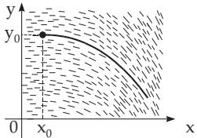

##### 9.1.1.5 Approximation Methods for Solution of First-Order Differential Equations

1. Successive Approximation Method of Picard

The integration of the diferential equation

$$
y ^ { \prime } = f ( x , y )
$$

with the initial condition $y = y _ { 0 }$ for $x = x _ { 0 }$ results in the fixed-point problem

(9.20a)

$$
y = y _ { 0 } + \intop _ { x _ { 0 } } ^ { x } f ( x , y ) d x .\tag{9.20b}
$$

Substituting another function $y _ { 1 } ( x )$ instead of y into the right-hand side of (9.20b), then the result will be a new function $y _ { 2 } ( x )$ , which is diferent from $y _ { 1 } ( x ) , \mathrm { i f } y _ { 1 } ( x )$ is not already a solution of (9.20a). Substituting $y _ { 2 } ( x )$ instead of $y$ into the right-hand side of (9.20b) gives a function $y _ { 3 } ( x )$ . If the conditions of the existence theorem are fulfilled (see 9.1.1.1, 1., p. 540), the sequence of functions $y _ { 1 } , y _ { 2 } , y _ { 3 } , \ldots$ converges to the desired solution in a certain interval containing the point $x _ { 0 }$

This Picard method ofsuccessive approximation is an iteration method (see 19.1.1, p. 949).

Solve the diferential equation $y ^ { \prime } = e ^ { x } - y ^ { 2 }$ with initial values $x _ { 0 } = 0 , y _ { 0 } = 0$ . Rewriting the equation in integral form and using the successive approximation method with an initial approximation

$$
y _ { 0 } ( x ) \equiv 0 { \mathrm { ~ g i v e s : ~ } } y _ { 1 } = \int _ { 0 } ^ { x } e ^ { x } d x = e ^ { x } - 1 , \quad y _ { 2 } = \int _ { 0 } ^ { x } \left[ e ^ { x } - ( e ^ { x } - 1 ) ^ { 2 } \right] d x = 3 e ^ { x } - { \frac { 1 } { 2 } } e ^ { 2 x } - x - { \frac { 5 } { 2 } } , { \mathrm { ~ e t c . } }
$$

2. Solution by Series Expansion

The Taylor series expansion of the solution of a diferential equation (see 7.3.3.3, 1., p. 471) can be given in the form

$$
y = y _ { 0 } + ( x - x _ { 0 } ) { y _ { 0 } } ^ { \prime } + { \frac { ( x - x _ { 0 } ) ^ { 2 } } { 2 } } { y _ { 0 } } ^ { \prime \prime } + \cdot \cdot \cdot + { \frac { ( x - x _ { 0 } ) ^ { n } } { n ! } } { y _ { 0 } } ^ { ( n ) } + \cdot \cdot \cdot\tag{9.21}
$$

if the values $y _ { 0 } ^ { \prime } , y _ { 0 } ^ { \prime \prime } , . . . , y _ { 0 } ^ { ( n ) } , . . .$ of all derivatives of the solution function are known at the initial value $x _ { 0 }$ of the independent variable. The values of the derivatives can be determined by successively diferentiating the original equation and substituting the initial conditions. If the diferential equation can be diferentiated infinitely many times, the obtained series will be convergent in a certain neighborhood of the initial value of the independent variable. This method can be used also for n-th order diferential equations.

Remark: The above result is the Taylor series of the function, which may not represent the function

itself (see 7.3.3.3, 1., p. 471).

It is often useful to substitute the solution by an infinite series with unknown coeficients, and to determine them by comparing coeficients.

A: To solve the diferential equation $y ^ { \prime } = e ^ { x } - y ^ { 2 } , x _ { 0 } = 0 , y _ { 0 } = 0$ one can consider the series $y = a _ { 1 } x + a _ { 2 } x ^ { 2 } + a _ { 3 } x ^ { 3 } + \cdot \cdot \cdot + a _ { n } x ^ { n } + \cdot \cdot \cdot .$ Substituting this into the equation considering the formula (7.88), p. 470 for the square of the series gives

$$
a _ { 1 } + 2 a _ { 2 } x + 3 a _ { 3 } x ^ { 2 } + \cdot \cdot \cdot + [ a _ { 1 } { } ^ { 2 } x ^ { 2 } + 2 a _ { 1 } a _ { 2 } x ^ { 3 } + ( a _ { 2 } { } ^ { 2 } + 2 a _ { 1 } a _ { 3 } ) x ^ { 4 } + \cdot \cdot \cdot ] = 1 + x + { \frac { x ^ { 2 } } { 2 } } + { \frac { x ^ { 3 } } { 6 } } + \cdot \cdot \cdot \cdot
$$

Comparing coeficients gives: $a _ { 1 } = 1 , 2 a _ { 2 } = 1 , 3 a _ { 3 } + { a _ { 1 } } ^ { 2 } = { \frac { 1 } { 2 } } , 4 a _ { 4 } + 2 a _ { 1 } a _ { 2 } = { \frac { 1 } { 6 } } ,$ etc. Solving these equations successively and substituting the coeficient values into the series representation yields $y = x + { \frac { x ^ { 2 } } { 2 } } - { \frac { x ^ { 3 } } { 6 } } - { \frac { 5 } { 2 4 } } x ^ { 4 } + \cdot \cdot \cdot .$

B: The same diferential equation with the same initial conditions can also be solved in the following way: Substituting $x = 0$ into the equation, gives ${ y _ { 0 } } ^ { \prime } = 1$ and successive diferentiation yields $y ^ { \prime \prime } = e ^ { x } - 2 y y ^ { \prime } , y _ { 0 } ^ { \prime \prime } = 1 , y ^ { \prime \prime } = e ^ { x } - 2 y ^ { \prime 2 } - 2 y y ^ { \prime \prime } , y _ { 0 } ^ { \prime \prime } = - 1 , y ^ { ( 4 ) } = e ^ { x } - 6 y ^ { \prime } y ^ { \prime \prime } - 2 y y ^ { \prime \prime } , y _ { 0 } ^ { ( 4 ) } = - 5 , e t c$

From the Taylor theorem (see 7.3.3.3, 1., p. 471) follows the solution $y = x + { \frac { x ^ { 2 } } { 2 ! } } - { \frac { x ^ { 3 } } { 3 ! } } - { \frac { 5 x ^ { 4 } } { 4 ! } } + \cdot \cdot \cdot .$

  
Figure 9.11

3. Graphical Solution of Diferential Equations

The graphical integration of a diferential equation is a method, which is based on the direction field (see 9.1.1.1, 3., p. 541). The integral curve in Fig. 9.11 is represented by a broken line which starts at the given initial point and is composed of short line segments. The directions of the line segments are always the same as the direction of the direction field at the starting point of the line segment. This is also the endpoint of the previous line segment.

4. Numerical Solution of Diferential Equations

The numerical solutions of diferential equations will be discussed in detail in 19.4, p. 969. Numerical methods are used to determine a solution of a diferential equation, if the equation $y ^ { \prime } = f ( x , y )$ does not belong to the special cases discussed above whose analytic solutions are known, or if the function $f ( x , y )$ is too complicated. This can happen if $f ( x , y )$ is non-linear in y.
