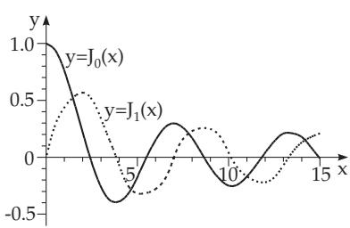
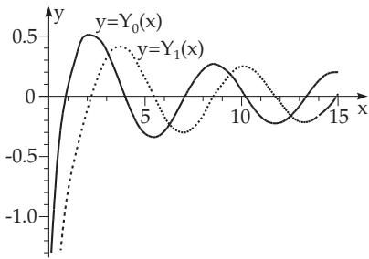
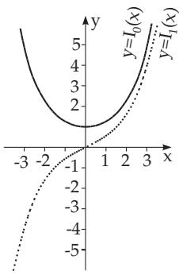
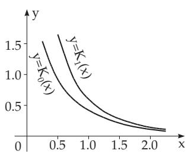
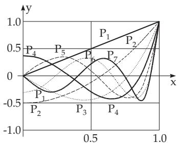

##### 9.1.2.6 Linear Second-Order Differential Equations

Many special diferential equations belong to this class, which often occur in practical applications. Several of them are discussed in this paragraph. For more details of representation, properties and solution methods see [9.15].

1. General Methods

1. Solving the Inhomogeneous Diferential Equation by the Help of the Superposition Principle

$$
y ^ { \prime \prime } + p ( x ) y ^ { \prime } + q ( x ) y = F ( x ) .\tag{9.49a}
$$

To get the general solution of an inhomogeneous diferential equation it is enough to add a particular solution of the inhomogeneous equation to the general solution of the corresponding homogeneous equation.

$$
F ( x ) \equiv 0
$$

$$
y = C _ { 1 } y _ { 1 } + C _ { 2 } y _ { 2 } .\tag{9.49b}
$$

Here $y _ { 1 }$ and $y _ { 2 }$ are two linearly independent particular solutions of (9.49a) (see 9.1.2.3, 2., p. 553). If a particular solution $y _ { 1 }$ is already known, then the second one $y _ { 2 }$ can be determined by the equation (9.34) of Liouville. From (9.34) follows:

$$
{ \left| \begin{array} { l l } { y _ { 1 } } & { y _ { 2 } } \\ { y _ { 1 } } & { y _ { 2 } } ^ { \prime } { \prime } \right|} \end{array}   = y _ { 1 } y _ { 2 } ^ { \prime } - y _ { 1 } ^ { \prime } y _ { 2 } = y _ { 1 } ^ { 2 } { \frac { y _ { 1 } y _ { 2 } ^ { \prime } - y _ { 1 } ^ { \prime } y _ { 2 } } { y _ { 1 } ^ { 2 } } } = y _ { 1 } ^ { 2 } \left( { \frac { y _ { 2 } } { y _ { 1 } } } \right) ^ { \prime } = A \exp \left( - \int p ( x ) d x \right)\tag{9.49c}
$$

giving

$$
y _ { 2 } = A y _ { 1 } \int { \frac { \exp \left( - \int p d x \right) } { { y _ { 1 } } ^ { 2 } } } d x\tag{9.49d}
$$

where A can be chosen arbitrarily.

b) A particular solution of the inhomogeneous equation can be determined by the formula

$$
y = { \frac { 1 } { A } } { \overset { x } { \int } } F ( \xi ) \exp \left( \int p ( \xi ) d \xi \right) [ y _ { 2 } ( x ) y _ { 1 } ( \xi ) - y _ { 1 } ( x ) y _ { 2 } ( \xi ) ] d \xi ,\tag{9.49e}
$$

where $y _ { 1 }$ and $y _ { 2 }$ are two particular solutions of the corresponding homogeneous diferential equation. $\mathbf { c } ) \mathrm { A }$ particular solution of the inhomogeneous diferential equation can be determined also by variation of constants (see 9.1.2.3, 6., p. 554).

2. Solving the Inhomogeneous Diferential Equation by the Method ofUndetermined Coeficients

$$
s ( x ) y ^ { \prime \prime } + p ( x ) y ^ { \prime } + q ( x ) y = F ( x )\tag{9.50a}
$$

If the functions ${ \mathfrak { s } } ( x ) , { \mathfrak { p } } ( x ) , { \mathfrak { q } } ( x )$ and $F ( x )$ are polynomials or functions which can be expanded into a convergent power series around $x _ { 0 }$ in a certain domain, where $s ( x _ { 0 } ) \neq 0$ , then the solutions of this differential equation can also be expanded into a similar series, and these series are convergent in the same domain. Here they should be determined by the method of undetermined coeficients: The solution to be looking for as a series has the form

$$
y = a _ { 0 } + a _ { 1 } ( x - x _ { 0 } ) + a _ { 2 } ( x - x _ { 0 } ) ^ { 2 } + \cdot \cdot \cdot ,\tag{9.50b}
$$

and it has to be substituted into the diferential equation (9.50a). Equating corresponding coeficients (of the same powers of $\left( x - x _ { 0 } \right) )$ results in equations to determine the coeficients $a _ { 0 } , a _ { 1 } , a _ { 2 } , \dotsc .$ To solve the diferential equation $y ^ { \prime \prime } + x y = 0$ one substitutes $y = a _ { 0 } + a _ { 1 } x + a _ { 2 } x ^ { 2 } + a _ { 3 } x ^ { 3 } + \cdots ,$ $y ^ { \prime } = a _ { 1 } + 2 a _ { 2 } x + 3 a _ { 3 } x ^ { 2 } + \cdot \cdot \cdot$ , and $y ^ { \prime \prime } = 2 a _ { 2 } + 6 a _ { 3 } x + \cdot \cdot \cdot$ getting 2a = 0, 6a + $a _ { 0 } ~ = ~ 0 , \ldots .$ The solution of these equations is $a _ { 2 } = 0 , a _ { 3 } = - { \frac { a _ { 0 } } { 2 \cdot 3 } } , a _ { 4 } = - { \frac { a _ { 1 } } { 3 \cdot 4 } } , a _ { 5 } = 0 , \dots .$ , so the solution is $y = a _ { 0 } \left( 1 - { \frac { x ^ { 3 } } { 2 \cdot 3 } } + { \frac { x ^ { 6 } } { 2 \cdot 3 \cdot 5 \cdot 6 } } - \cdots \right) + a _ { 1 } \left( x - { \frac { x ^ { 4 } } { 3 \cdot 4 } } + { \frac { x ^ { 7 } } { 3 \cdot 4 \cdot 6 \cdot 7 } } - \cdots \right)$

3. The Homogeneous Diferential Equation

$$
x ^ { 2 } y ^ { \prime \prime } + x p ( x ) y ^ { \prime } + q ( x ) y = 0\tag{9.51a}
$$

can be solved by the method of undetermined coeficients if the functions $p ( x )$ and $q ( x )$ can be expanded as a convergent power series of x. The solutions have the form

$$
y = x ^ { r } ( a _ { 0 } + a _ { 1 } x + a _ { 2 } x ^ { 2 } + \cdot \cdot \cdot ) ,\tag{9.51b}
$$

whose exponent r can be determined from the defining equation

$$
r ( r - 1 ) + p ( 0 ) r + q ( 0 ) = 0 .\tag{9.51c}
$$

If the roots of this equation are diferent and their diference is not an integer number, then one gets two linearly independent solutions of (9.51a). Otherwise the method of undetermined coeficients results only one solution. Then with the help of (9.49b) one can get a second solution or at least one can find a form which gives a second solution with the method of undetermined coeficients.

For the Bessel diferential equation (9.52a) one gets only one solution with the method of the undetermined coeficients in the form $y _ { 1 } = \sum _ { k = 0 } ^ { \infty } a _ { k } x ^ { n + 2 k } \ ( a _ { 0 } \neq 0 )$ , which coincides with $J _ { n } ( x )$ up to a constant factor. Since exp $\left( - \int p d x \right) = \frac { 1 } { x }$ one finds a second solution by using formula (9.49d)

$$
y _ { 2 } = A y _ { 1 } \int { \frac { d x } { x \cdot x ^ { 2 n } \left( \sum a _ { k } x ^ { 2 k } \right) ^ { 2 } } } = A y _ { 1 } \int { \frac { \sum _ { k = 0 } ^ { \infty } c _ { k } x ^ { 2 k } } { x ^ { 2 n + 1 } } } d x = B y _ { 1 } \ln x + x ^ { - n } \sum _ { k = 0 } ^ { \infty } d _ { k } x ^ { 2 k } .
$$

The determination of the unknown coeficients $c _ { k }$ and $d _ { k }$ is dificult from the $a _ { k } \mathrm { ^ { \prime } s }$ . But this last expression can be used to get the solution with the method of undetermined coeficients. Obviously this form is a series expansion of the function $Y _ { n } ( x ) \ ( 9 . 5 3 \mathrm { c } )$

2. Bessel Diferential Equation

$$
x ^ { 2 } y ^ { \prime \prime } + x y ^ { \prime } + ( x ^ { 2 } - n ^ { 2 } ) y = 0 .\tag{9.52a}
$$

1. The Defining Equation is in this case

$$
r ( r - 1 ) + r - n ^ { 2 } \equiv r ^ { 2 } - n ^ { 2 } = 0 ,\tag{9.52b}
$$

so, $r = \pm n$ . Substituting

$$
y = x ^ { n } ( a _ { 0 } + a _ { 1 } x + \cdot \cdot \cdot )\tag{9.52c}
$$

into this equation and equating the coeficients of $x ^ { n + k }$ to zero gives

$$
k ( 2 n + k ) a _ { k } + a _ { k - 2 } = 0 .\tag{9.52d}
$$

For $k = 1$ follows $( 2 n + 1 ) a _ { 1 } = 0$ . For the values $k = 2 , 3 , \ldots$ . one obtains

$$
a _ { 2 m + 1 } = 0 \quad ( m = 1 , 2 , \ldots ) , \quad a _ { 2 } = - \frac { a _ { 0 } } { 2 ( 2 n + 2 ) } ,
$$

$$
a _ { 4 } = { \frac { a _ { 0 } } { 2 \cdot 4 \cdot ( 2 n + 2 ) ( 2 n + 4 ) } } , \cdot \cdot \cdot , \quad a _ { 0 } \mathrm { i s ~ a r b i t r a r y } .\tag{9.52e}
$$

2. Bessel or Cylindrical Functions The series obtained above for $a _ { 0 } = { \frac { 1 } { 2 ^ { n } I ( n + 1 ) } }$ , where $\varGamma$ is the gamma function (see 8.2.5, 6., p. 514), is a particular solution of the Bessel diferential equation (9.52a) for integer values of n. It defines the Bessel or cylindrical function of the first kind of index n

$$
{ \begin{array} { l } { \displaystyle { J _ { n } ( x ) = { \frac { x ^ { n } } { 2 ^ { n } T ( n + 1 ) } } \left( 1 - { \frac { x ^ { 2 } } { 2 ( 2 n + 2 ) } } + { \frac { x ^ { 4 } } { 2 \cdot 4 \cdot ( 2 n + 2 ) ( 2 n + 4 ) } } - \cdots \right) } } \\ { \displaystyle { = \sum _ { k = 0 } ^ { \infty } { \frac { ( - 1 ) ^ { k } \left( { \frac { x } { 2 } } \right) ^ { n + 2 k } } { k ! T ( n + k + 1 ) } } . } } \end{array} }\tag{9.53a}
$$

The graphs of functions $J _ { 0 }$ and $J _ { 1 }$ are shown in Fig. 9.12.

The general solution of the Bessel diferential equation for non-integer n has the form

$$
y = C _ { 1 } J _ { n } ( x ) + C _ { 2 } J _ { - n } ( x ) ,\tag{9.53b}
$$

where $J _ { - n } ( x )$ is defined by the infinite series obtained from the series representation of $J _ { n } ( x )$ by replacing n with n. For integer $n _ { : }$ , holds $J _ { - n } ( x ) = ( - 1 ) ^ { n } J _ { n } ( x )$ . In this case, the term $J _ { - n } ( x )$ in the general solution should be replaced with the Bessel function of the second kind

$$
Y _ { n } ( x ) = \operatorname* { l i m } _ { m  n } { \frac { J _ { m } ( x ) \cos { m \pi } - J _ { - m } ( x ) } { \sin { m \pi } } } ,\tag{9.53c}
$$

which is also called the Weber function. For the series expansion of $Y _ { n } ( x )$ see, e.g., [9.15]. The graphs of the functions $Y _ { 0 }$ and $Y _ { 1 }$ are shown in Fig. 9.13.

  
Figure 9.12  
Figure 9.13

3. Bessel Functions with Imaginary Variables In some applications one uses Bessel functions with pure imaginary variables. In this case it is to be considered the product $\mathrm { i } ^ { - n } J _ { n } ( \mathrm { i } x )$ which will be denoted by $I _ { n } ( x )$

$$
I _ { n } ( x ) = \mathrm { i } ^ { - n } J _ { n } ( \mathrm { i } x ) = { \frac { \left( { \frac { x } { 2 } } \right) ^ { n } } { { \cal T } ( n + 1 ) } } + { \frac { \left( { \frac { x } { 2 } } \right) ^ { n + 2 } } { 1 ! { \cal T } ( n + 2 ) } } + { \frac { \left( { \frac { x } { 2 } } \right) ^ { n + 4 } } { 2 ! { \cal T } ( n + 3 ) } } + \cdots .\tag{9.54a}
$$

The functions $I _ { n } ( x )$ are solutions of the diferential equation

$$
x ^ { 2 } y ^ { \prime \prime } + x y ^ { \prime } - ( x ^ { 2 } + n ^ { 2 } ) y = 0 .\tag{9.54b}
$$

A second solution of this diferential equation is the MacDonald function

$$
K _ { n } ( x ) = { \frac { \pi } { 2 } } { \frac { I _ { - n } ( x ) - I _ { n } ( x ) } { \sin n \pi } } .\tag{9.54c}
$$

If n converges to an integer number, this expression also converges.

The functions $I _ { n } ( x )$ and $K _ { n } ( x )$ are called modified Bessel functions. The graphs of functions $I _ { 0 }$ and $I _ { 1 }$ are shown in Fig. 9.14; the graphs of functions $K _ { 0 }$ and $\dot { K _ { 1 } }$ are illustrated in Fig. 9.15. The values of functions $J _ { 0 } ( x ) , ^ { - } J _ { 1 } ( x ) , { \dot { Y } } _ { 0 } ( x ) , { \dot { Y _ { 1 } } } ( x ) , I _ { 0 } ( x ) , I _ { 1 } ( x ) , { \dot { K } } _ { 0 } ( x ) , { \dot { K _ { 1 } } } ( x )$ are given in Table 21.11, p. 1106.

  
Figure 9.14

  
Figure 9.15

  
Figure 9.16  
4. Important Formulas for the Bessel Functions $J _ { n } ( x )$

$$
J _ { n - 1 } ( x ) + J _ { n + 1 } ( x ) = \frac { 2 n } { x } J _ { n } ( x ) , \quad \frac { d J _ { n } ( x ) } { d x } = - \frac { n } { x } J _ { n } ( x ) + J _ { n - 1 } ( x ) .\tag{9.55a}
$$

The formulas (9.55a) are also valid for the Weber functions $Y _ { n } ( x )$

$$
I _ { n - 1 } ( x ) - I _ { n + 1 } ( x ) = \frac { 2 n I _ { n } ( x ) } { x } , \quad \frac { d I _ { n } ( x ) } { d x } = I _ { n - 1 } ( x ) - \frac { n } { x } I _ { n } ( x ) ,\tag{9.55b}
$$

$$
K _ { n + 1 } ( x ) - K _ { n - 1 } ( x ) = \frac { 2 n K _ { n } ( x ) } { x } , \quad \frac { d K _ { n } ( x ) } { d x } = - K _ { n - 1 } ( x ) - \frac { n } { x } K _ { n } ( x ) .\tag{9.55c}
$$

For integer numbers n the following formulas are valid:

$$
J _ { 2 n } ( x ) = { \frac { 2 } { \pi } } \intop _ { 0 } ^ { \pi / 2 } \cos ( x \sin \varphi ) \cos 2 n \varphi d \varphi ,\tag{9.55d}
$$

$$
J _ { 2 n + 1 } ( x ) = { \frac { 2 } { \pi } } \intop _ { 0 } ^ { \pi / 2 } \sin ( x \sin \varphi ) \sin ( 2 n + 1 ) \varphi d \varphi\tag{9.55e}
$$

or, in complex form,

$$
J _ { n } ( x ) = { \frac { - ( \mathrm { i } ) ^ { n } } { \pi } } \int _ { 0 } ^ { \pi } e ^ { \mathrm { i } x \cos \varphi } \cos n \varphi d \varphi .\tag{9.55f}
$$

The functions $J _ { n + 1 / 2 } ( x )$ can be expressed by using elementary functions. In particular,

$$
J _ { 1 / 2 } ( x ) = { \sqrt { \frac { 2 } { \pi x } } } \sin x ,
$$

(9.56a)

$$
J _ { - 1 / 2 } ( x ) = { \sqrt { \frac { 2 } { \pi x } } } \cos x .\tag{9.56b}
$$

By applying the recursion formulas (9.55a)–(9.55f) the expression for $J _ { n + 1 / 2 } ( x )$ for arbitrary integer n can be given. For large values of x the following asymptotic formulas are valid:

$$
J _ { n } ( x ) = \sqrt { \frac { 2 } { \pi x } } \left[ \cos { \left( x - \frac { n \pi } { 2 } - \frac { \pi } { 4 } \right) } + O \left( \frac { 1 } { x } \right) \right] ,\tag{9.57a}
$$

$$
I _ { n } ( x ) = \frac { e ^ { x } } { \sqrt { 2 \pi x } } \left[ 1 + O \left( \frac { 1 } { x } \right) \right] ,\tag{9.57b}
$$

$$
Y _ { n } ( x ) = \sqrt { \frac { 2 } { \pi x } } \left[ \sin { \left( x - \frac { n \pi } { 2 } - \frac { \pi } { 4 } \right) } + O \left( \frac { 1 } { x } \right) \right] ,\tag{9.57c}
$$

$$
K _ { n } ( x ) = \sqrt { \frac { \pi } { 2 x } } e ^ { - x } \left[ 1 + O \left( \frac { 1 } { x } \right) \right] .\tag{9.57d}
$$

The expression $O \left( { \frac { 1 } { x } } \right)$ means an infinitesimal quantity of the same order as $\frac { 1 } { x }$ (see the Landau symbol, 2.1.4.9, p. 57).

For further properties of the Bessel functions see [21.1].

5. Important Formulas for the Spherical Bessel Functions Spherical Bessel functions of the first and second kind $j _ { l } ( z )$ and $n _ { l } ( z )$ follow from the Bessel functions of the first and second kind $J _ { n } ( z )$ (9.53a)and $Y _ { n } ( z ) \ ( 9 . 5 3 \mathrm { c } )$ for half odd order index $n = { \frac { 1 } { 2 } } , { \frac { 3 } { 2 } } , . .$ . as in $j _ { l } ( z ) = \sqrt { \frac { \pi } { 2 z } } J _ { l + \frac { 1 } { 2 } } ( z )$ and $n _ { l } ( z ) = \sqrt { \frac { \pi } { 2 z } } Y _ { l + \frac { 1 } { 2 } } ( z )$ with $l = 0 , 1 , 2 , \ldots$ . They occur as regular or singular solutions of the potential free radial Schroedinger equation (see 9.2.4.6,3., (9.137b), p. 599) with $V ( r ) = 0 , E = { \frac { \hbar ^ { 2 } k ^ { 2 } } { 2 m } } , z = k r$ and $s _ { l } ( z ) = R _ { l } ( r )$ :

$$
z \frac { d ^ { 2 } } { d z ^ { 2 } } [ z s _ { l } ( z ) ] + [ z ^ { 2 } - l ( l + 1 ) ] s _ { l } ( z ) = 0 , \quad s _ { l } ( z ) = j _ { l } ( z ) \mathrm { o r } n _ { l } ( z ) .\tag{9.58a}
$$

They also occur in the quantum mechanical scattering theory, where the $n _ { l } ( z )$ are called the spherical von Neumann functions. By the help of the Rayleigh formulas

$$
j _ { l } ( z ) = ( - z ) ^ { l } \left( \frac { d } { z d z } \right) ^ { l } \frac { \sin { z } } { z } , \quad n _ { l } ( z ) = ( - z ) ^ { l } \left( \frac { d } { z d z } \right) ^ { l } ( - 1 ) \frac { \cos { z } } { z }\tag{9.58b}
$$

follows, so

$$
j _ { 0 } ( z ) = \frac { \sin z } z , \quad j _ { 1 } ( z ) = \frac { \sin z - z \cos z } { z ^ { 2 } } , \cdots ,\tag{9.58c}
$$

$$
n _ { 0 } ( z ) = - \frac { \cos z } { z } , \quad n _ { 1 } ( z ) = - \frac { \cos z + z \sin z } { z ^ { 2 } } , \cdots .\tag{9.58d}
$$

Complex spherical functions are used with $\varPhi _ { m } ( \varphi ) = \mathrm { e } ^ { \mathrm { i } m \varphi }$ in the form $Y _ { L } ( \vec { \mathbf { e } } ) = \Theta _ { l } ^ { m } ( \vartheta ) \Phi _ { m } ( \varphi )$ , e.g. in 9.2.4.6, (9.136e), p. 599. In the combined index $L = ( l , m ) \ l = 0 , 1 , 2 , . .$ . denotes the quantum number of the orbital angular momentum. The magnetic quantum number m is restricted to the $2 l + 1$ values $m = - l , - l + 1 , \cdots , + l .$ With the abbreviations

$$
j _ { L } ( k \vec { \bf r } ) = j _ { l } ( k r ) Y _ { L } ( \vec { \bf e } _ { r } ) , \quad n _ { L } ( k \vec { \bf r } ) = n _ { l } ( k r ) Y _ { L } ( \vec { \bf e } _ { r } ) , \quad \vec { \bf e } _ { r } = \frac { \vec { \bf r } } { r }\tag{9.59a}
$$

one gets the Kasterinian formulas

$$
\mathrm { i } ^ { l } j _ { L } ( k \vec { \bf r } ) = Y _ { L } \left( \frac { \nabla } { \mathrm { i } k } \right) \frac { \sin k r } { k r } , \quad \mathrm { i } ^ { l } n _ { L } ( k \vec { \bf r } ) = Y _ { L } \left( \frac { \nabla } { \mathrm { i } k } \right) ( - 1 ) \frac { \cos k r } { k r } ,\tag{9.59b}
$$

where denotes the nabla operator (s. 13.2.6.1, S. 715). The expansion of a plane wave in terms of spherical or Bessel functions gives

$$
\mathrm { e } ^ { \mathrm { i } \overrightarrow { \mathbf { k } } \overrightarrow { \mathbf { r } } } = 4 \pi \sum _ { L } \mathrm { i } ^ { l } j _ { L } ( k \overrightarrow { \mathbf { r } } ) Y _ { L } ^ { * } ( \overrightarrow { \mathbf { e } } _ { k } ) , \quad \overrightarrow { \mathbf { e } } _ { k } = \frac { \overrightarrow { \mathbf { k } } } { k } , \quad \sum _ { L } \cdot \cdot \cdot = \sum _ { l = 0 } ^ { \infty } \sum _ { m = - l } ^ { + l } \cdot \cdot \cdot \ .\tag{9.59c}
$$

There are the following addition theorems

$$
\mathrm { i } ^ { l } j _ { L } ( k ( \vec { \bf r } _ { 1 } + \vec { \bf r } _ { 2 } ) ) = 4 \pi \sum _ { L _ { 1 } , L _ { 2 } } C _ { L L _ { 1 } L _ { 2 } } \mathrm { i } ^ { l _ { 1 } + l _ { 2 } } j _ { L _ { 1 } } ( k \vec { \bf r } _ { 1 } ) j _ { L _ { 2 } } ^ { * } ( k \vec { \bf r } _ { 2 } ) , \quad r _ { 1 , 2 } = \mathrm { a r b i t r a r i l y } ,\tag{9.59d}
$$

$$
\mathrm { i } ^ { l } n _ { L } ( k ( \vec { \bf r } _ { 1 } + \vec { \bf r } _ { 2 } ) ) = 4 \pi \sum _ { L _ { 1 } , L _ { 2 } } C _ { L L _ { 1 } L _ { 2 } } \mathrm { i } ^ { l _ { 1 } + l _ { 2 } } n _ { L _ { 1 } } ( k \vec { \bf r } _ { 1 } ) j _ { L _ { 2 } } ^ { * } ( k \vec { \bf r } _ { 2 } ) , \quad r _ { 1 } > r _ { 2 }\tag{9.59e}
$$

with the Clebsch-Gordan coeficients (see 5.3.4.7, p. 345)

$$
C _ { L L _ { 1 } L _ { 2 } } = \int d ^ { 2 } e Y _ { L } ( { \vec { \bf e } } ) Y _ { L _ { 1 } } ^ { * } ( { \vec { \bf e } } ) Y _ { L _ { 2 } } ^ { * } ( { \vec { \bf e } } ) .\tag{9.59f}
$$

For further details see [21.1], [9.28] until [9.31].

3. Legendre Diferential Equation

Restricting the investigations in this book to the case of real variables and integer parameters $n =$ $0 , 1 , 2 , \ldots$ . the Legendre diferential equation has the form

$$
( 1 - x ^ { 2 } ) y ^ { \prime \prime } - 2 x y ^ { \prime } + n ( n + 1 ) y = 0 \quad { \mathrm { o r } } \quad ( ( 1 - x ^ { 2 } ) y ^ { \prime } ) ^ { \prime } + n ( n + 1 ) y = 0 .\tag{9.60a}
$$

1. Legendre Polynomials or Spherical Harmonics of the First Kind are the particular solutions of the Legendre diferential equation for integer n, which can be expanded into the power series $y = \sum _ { \nu = 0 } ^ { \infty } a _ { \nu } x ^ { \nu }$ . The method of undetermined coeficients yields the polynomials

$$
P _ { n } ( x ) = { \frac { ( 2 n ) ! } { 2 ^ { n } ( n ! ) ^ { 2 } } } \left[ x ^ { n } - { \frac { n ( n - 1 ) } { 2 ( 2 n - 1 ) } } x ^ { n - 2 } + { \frac { n ( n - 1 ) ( n - 2 ) ( n - 3 ) } { 2 \cdot 4 ( 2 n - 1 ) ( 2 n - 3 ) } } x ^ { n - 4 } - + \cdot \cdot \cdot \right] ,
$$

$$
( | x | < \infty ; n = 0 , 1 , 2 , . . . ) .\tag{9.60b}
$$

$$
P _ { n } ( x ) = F \left( n + 1 , - n , 1 ; \frac { 1 - x } { 2 } \right) = \frac { 1 } { 2 ^ { n } n ! } \frac { d ^ { n } ( x ^ { 2 } - 1 ) ^ { n } } { d x ^ { n } } ,\tag{9.60c}
$$

where F denotes the hypergeometric series (see 4., p. 567). The first eight polynomials have the following simple form (see 21.12, p. 1108):

$$
P _ { 0 } ( x ) = 1 ,
$$

$$
( 9 . 6 0 \mathrm { d } ) \qquad P _ { 1 } ( x ) = x ,\tag{9.60e}
$$

$$
P _ { 2 } ( x ) = \frac { 1 } { 2 } ( 3 x ^ { 2 } - 1 ) ,
$$

(9.60f)

$$
P _ { 3 } ( x ) = \frac { 1 } { 2 } ( 5 x ^ { 3 } - 3 x ) ,\tag{9.60g}
$$

$$
P _ { 4 } ( x ) = \frac { 1 } { 8 } ( 3 5 x ^ { 4 } - 3 0 x ^ { 2 } + 3 ) ,
$$

(9.60h)

$$
P _ { 5 } ( x ) = \frac { 1 } { 8 } ( 6 3 x ^ { 5 } - 7 0 x ^ { 3 } + 1 5 x ) ,\tag{9.60i}
$$

$$
P _ { 6 } ( x ) = { \frac { 1 } { 1 6 } } ( 2 3 1 x ^ { 6 } - 3 1 5 x ^ { 4 } + 1 0 5 x ^ { 2 } - 5 ) , ( 9 . 6 0 { \mathrm { j } } ) \quad P _ { 7 } ( x ) = { \frac { 1 } { 1 6 } } ( 4 2 9 x ^ { 7 } - 6 9 3 x ^ { 5 } + 3 1 5 x ^ { 3 } - 3 5 x )\tag{.(9.60k}
$$

The graphs of $P _ { n } ( x )$ for the values from $n = 1$ to $n = 7$ are represented in Fig. 9.16. The numerical values can be calculated easily by pocket calculators or from function tables.

2. Properties of the Legendre Polynomials of the First Kind

a) Integral Representation:

$$
P _ { n } ( x ) = { \frac { 1 } { \pi } } \intop _ { 0 } ^ { \pi } ( x \pm \cos \varphi { \sqrt { x ^ { 2 } - 1 } } ) ^ { n } d \varphi = { \frac { 1 } { \pi } } \intop _ { 0 } ^ { \pi } { \frac { d \varphi } { ( x \pm \cos \varphi { \sqrt { x ^ { 2 } - 1 } } ) ^ { n + 1 } } } .\tag{9.61a}
$$

The signs can be chosen arbitrarily in both equations.

b) Recursion Formulas:

$$
( n + 1 ) P _ { n + 1 } ( x ) = ( 2 n + 1 ) x P _ { n } ( x ) - n P _ { n - 1 } ( x ) \quad ( n \geq 1 ; P _ { 0 } ( x ) = 1 , P _ { 1 } ( x ) = x ) ,\tag{9.61b}
$$

$$
( x ^ { 2 } - 1 ) \frac { d P _ { n } ( x ) } { d x } = n [ x P _ { n } ( x ) - P _ { n - 1 } ( x ) ] \quad ( n \geq 1 ) .\tag{9.61c}
$$

c) Orthogonality Relation:

$$
\int _ { - 1 } ^ { 1 } P _ { n } ( x ) P _ { m } ( x ) d x = { \left\{ \begin{array} { l l } { 0 } & { { \mathrm { f o r ~ } } m \neq n , } \\ { { \cfrac { 2 } { 2 n + 1 } } } & { { \mathrm { f o r ~ } } m = n . } \end{array} \right. }\tag{9.61d}
$$

d) Root Theorem: All the n roots of $P _ { n } ( x )$ are real and single and are in the interval ( 1, 1).

e) Generating Function: The Legendre polynomial of the first kind can be represented as the power series expansion of the function

$$
{ \frac { 1 } { \sqrt { 1 - 2 r x + r ^ { 2 } } } } = \sum _ { n = 0 } ^ { \infty } P _ { n } ( x ) r ^ { n } .\tag{9.61e}
$$

For further properties of the Legendre polynomials of the first kind see [21.1].

3. Legendre Functions or Spherical Harmonics of the Second Kind A second particular solution $Q _ { n } ( x )$ can be got, which is valid for $| x | > 1$ and linearly independent of $P _ { n } ( x )$ , see (9.61a), by

the power series expansion $\sum _ { \nu = - \infty } ^ { - ( n + 1 ) } b _ { \nu } x ^ { \nu } ;$

$$
\begin{array} { l } { { Q _ { n } ( x ) = \displaystyle \frac { 2 ^ { n } ( n ! ) ^ { 2 } } { ( 2 n + 1 ) ! } x ^ { - ( n + 1 ) } F \left( \frac { n + 1 } { 2 } , \frac { n + 2 } { 2 } , \frac { 2 n + 3 } { 2 } ; \frac { 1 } { x ^ { 2 } } \right) } } \\ { { \ = \displaystyle \frac { 2 ^ { n } ( n ! ) ^ { 2 } } { ( 2 n + 1 ) ! } \left[ x ^ { - ( n + 1 ) } + \frac { ( n + 1 ) ( n + 2 ) } { 2 ( 2 n + 3 ) } x ^ { - ( n + 3 ) } \right. } } \\ { { \ \left. + \ \frac { ( n + 1 ) ( n + 2 ) ( n + 3 ) ( n + 4 ) } { 2 \cdot 4 \cdot ( 2 n + 3 ) ( 2 n + 5 ) } x ^ { - ( n + 5 ) } + \cdots \right] . } } \end{array}\tag{9.62a}
$$

The representation of $Q _ { n } ( x )$ valid for $| x | < 1$ is:

$$
Q _ { n } ( x ) = \frac { 1 } { 2 } P _ { n } ( x ) \ln \frac { 1 + x } { 1 - x } - \sum _ { k = 1 } ^ { n } \frac { 1 } { k } P _ { k - 1 } ( x ) P _ { n - k } ( x ) .\tag{9.62b}
$$

The spherical harmonics of the first and second kind are also called the associated Legendre functions (see also 9.2.4.6, 4., (9.138c), p. 600).

4. Hypergeometric Diferential Equation

The hypergeometric diferential equation is the equation

$$
x ( 1 - x ) \frac { d ^ { 2 } y } { d x ^ { 2 } } + [ \gamma - ( \alpha + \beta + 1 ) x ] \frac { d y } { d x } - \alpha \beta y = 0 ,\tag{9.63a}
$$

where $\alpha , \beta , \gamma$ are parameters. It contains several important special cases.

a) For $\alpha = n + 1 , \beta = - n , \gamma = 1$ , and $x = { \frac { 1 - z } { 2 } }$ it is the Legendre diferential equation.

b) $\operatorname { I f } \gamma \neq 0$ or $\gamma$ is not a negative integer, it has the hypergeometric series or hypergeometric function as a particular solution :

$$
\begin{array} { l } { { F ( \alpha , \beta , \gamma ; x ) = 1 + \displaystyle \frac { \alpha \cdot \beta } { 1 \cdot \gamma } x + \displaystyle \frac { \alpha ( \alpha + 1 ) \beta ( \beta + 1 ) } { 1 \cdot 2 \cdot \gamma ( \gamma + 1 ) } x ^ { 2 } + \cdots } } \\ { { + \displaystyle \frac { \alpha ( \alpha + 1 ) \ldots ( \alpha + n ) \beta ( \beta + 1 ) \ldots ( \beta + n ) } { 1 \cdot 2 \cdot \cdot ( n + 1 ) \cdot \gamma ( \gamma + 1 ) \ldots ( \gamma + n ) } x ^ { n + 1 } + \cdots , } } \end{array}\tag{9.63b}
$$

which is absolutely convergent for $| x | < 1$ . The convergence for $x \ = \ \pm 1$ depends on the value of $\delta = \gamma - \alpha - \beta .$ . For $x = 1$ it is convergent if $\delta > 0$ , it is divergent if $\delta \leq 0$ . For $x = - 1$ it is absolutely convergent if $\delta < 0$ , it is conditionally convergent for $- 1 < \delta \leq 0$ , and it is divergent for $\delta \leq - 1$

c) For $2 - \gamma \neq 0$ or not equal to a negative integer it has a particular solution

$$
y = x ^ { 1 - \gamma } F ( \alpha + 1 - \gamma , \beta + 1 - \gamma , 2 - \gamma , x ) .\tag{9.63c}
$$

d) In some special cases the hypergeometric series can be reduced to elementary functions, e.g.,

$$
F ( 1 , \beta , \beta ; x ) = F ( \alpha , 1 , \alpha ; x ) = { \frac { 1 } { 1 - x } } , \quad ( 9 . 6 4 \mathrm { a } ) \qquad F ( - n , \beta , \beta ; - x ) = ( 1 + x ) ^ { n } ,\tag{9.64b}
$$

$$
F ( 1 , 1 , 2 ; - x ) = \frac { \ln ( 1 + x ) } { x } ,
$$

$$
( 9 . 6 4 \mathrm { c } ) \qquad F \left( { \frac { 1 } { 2 } } , { \frac { 1 } { 2 } } , { \frac { 3 } { 2 } } ; x ^ { 2 } \right) = { \frac { \arcsin x } { x } } ,\tag{9.64d}
$$

$$
\operatorname* { l i m } _ { \beta \to \infty } F \left( 1 , \beta , 1 ; \frac { x } { \beta } \right) = e ^ { x } .\tag{9.64e}
$$

5. Laguerre Diferential Equation

Restricting the investigation to integer parameters $( n = 0 , 1 , 2 , \ldots )$ and real variables, the Laguerre diferential equation has the form

$$
x y ^ { \prime \prime } + ( \alpha + 1 - x ) y ^ { \prime } + n y = 0 .\tag{9.65a}
$$

Particular solutions are the Laguerre polynomials

$$
L _ { n } ^ { ( \alpha ) } ( x ) = \frac { e ^ { x } x ^ { - \alpha } } { n ! } \frac { d ^ { n } } { d x ^ { n } } ( e ^ { - x } x ^ { n + \alpha } ) = \sum _ { k = 0 } ^ { n } \binom { n + \alpha } { n - k } \frac { ( - x ) ^ { k } } { k ! } .\tag{9.65b}
$$

The recursion formula for $n \geq 1$ is:

$$
( n + 1 ) L _ { n + 1 } ^ { ( \alpha ) } ( x ) = ( - x + 2 n + \alpha + 1 ) L _ { n } ^ { ( \alpha ) } ( x ) - ( n + \alpha ) L _ { n - 1 } ^ { ( \alpha ) } ( x ) ,\tag{9.65c}
$$

$$
L _ { 0 } ^ { ( \alpha ) } ( x ) = 1 , \quad L _ { 1 } ^ { ( \alpha ) } = 1 + \alpha - x .\tag{9.65d}
$$

An orthogonality relation for $\alpha > - 1$ holds:

$$
\int _ { 0 } ^ { \infty } e ^ { - x } x ^ { \alpha } L _ { m } ^ { ( \alpha ) } ( x ) L _ { n } ^ { ( \alpha ) } ( x ) d x = \left\{ \begin{array} { l l } { 0 } & { \mathrm { f o r ~ } m \neq n , } \\ { \left( n + \alpha \right) \Gamma ( 1 + \alpha ) } & { \mathrm { f o r ~ } m = n . } \end{array} \right.\tag{9.65e}
$$

Γ denotes the gamma function (see 8.2.5, 6., p. 514).

6. Hermite Diferential Equation

Two defining equations are often used in the literature:

a) Defining Equation of Type 1:

$$
y ^ { \prime \prime } - x y ^ { \prime } + n y = 0 \quad ( n = 0 , 1 , 2 , \ldots ) .\tag{9.66a}
$$

b) Defining Equation of Type 2:

$$
y ^ { \prime \prime } - 2 x y ^ { \prime } + n y = 0 \quad ( n = 0 , 1 , 2 , \ldots ) .\tag{9.66b}
$$

Particular solutions are the Hermite polynomials, $H e _ { n } ( x )$ for the defining equation of type 1, and $H _ { n } ( x )$ for the defining equation of type 2.

a) Hermite Polynomials for Defining Equation of Type 1:

$$
{ \begin{array} { r l } & { H e _ { n } ( x ) = ( - 1 ) ^ { n } \exp \left( { \frac { x ^ { 2 } } { 2 } } \right) { \frac { d ^ { n } } { d x ^ { n } } } \exp \left( - { \frac { x ^ { 2 } } { 2 } } \right) } \\ & { \qquad = x ^ { n } - { \binom { n } { 2 } } x ^ { n - 2 } + 1 \cdot 3 { \binom { n } { 4 } } x ^ { n - 4 } - 1 \cdot 3 \cdot 5 { \binom { n } { 6 } } x ^ { n - 6 } + \cdots \quad ( n \in \mathbb { N } ) . } \end{array} }\tag{9.66c}
$$

For $n \geq 1$ the following recursion formulas are valid:

$$
H e _ { n + 1 } ( x ) = x H e _ { n } ( x ) - n H e _ { n - 1 } ( x ) , ~ ( 9 . 6 6 \mathrm { d } ) \qquad H e _ { 0 } ( x ) = 1 , \quad H e _ { 1 } ( x ) = x .\tag{9.66e}
$$

The orthogonality relation is:

$$
\int _ { - \infty } ^ { + \infty } \exp \left( - { \frac { x ^ { 2 } } { 2 } } \right) H e _ { m } ( x ) H e _ { n } ( x ) d x = { \left\{ \begin{array} { l l } { 0 } & { { \mathrm { f o r ~ } } m \neq n , } \\ { n ! { \sqrt { 2 \pi } } } & { { \mathrm { f o r ~ } } m = n . } \end{array} \right. }\tag{9.66f}
$$

b) Hermite Polynomials for Defining Equation of Type 2:

$$
H _ { n } ( x ) = ( - 1 ) ^ { n } \exp \left( x ^ { 2 } \right) { \frac { d ^ { n } } { d x ^ { n } } } \exp \left( - x ^ { 2 } \right) \quad ( n \in \mathbb { N } ) .\tag{9.66g}
$$

The relation with the Hermite polynomials for defining equation of type 1 is the following:

$$
H e _ { n } ( x ) = 2 ^ { - n / 2 } H _ { n } \left( { \frac { x } { \sqrt { 2 } } } \right) \quad ( n \in \mathbb { N } ) .\tag{9.66h}
$$
