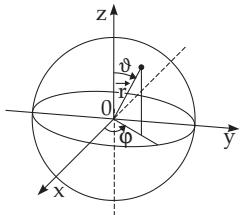

##### 9.2.4.6 Particle Movement in a Symmetric Central Field

1. Formulation of the Problem

The considered particle moves in a central symmetric potential $V ( r )$ . This model reproduces the movement of an electron in the electrostatic field of a positively charged nucleus. Since this is a spherically symmetric problem, it is reasonable to use spherical coordinates (Fig. 9.20). The following relations hold:

  
Figure 9.20

$$
\begin{array} { l l l } { { r = \sqrt { x ^ { 2 } + y ^ { 2 } + z ^ { 2 } } , } } & { { x = r \sin \vartheta \cos \varphi , } } \\ { { \displaystyle \vartheta = \operatorname { a r c c o s } \displaystyle \frac { z } { r } , } } & { { y = r \sin \vartheta \sin \varphi , \ } } \\ { { \displaystyle \varphi = \arctan \displaystyle \frac { y } { x } , } } & { { z = r \cos \vartheta , } } \end{array}\tag{9.135a}
$$

where r is the absolute value of the radius vector, ϑ is the angle between the radius vector and the z-axis (polar angle) and $\varphi$ is the angle between the projection of the radius vector onto the x, y plane and the x-axis (azimuthal angle). For the Laplace operator

$$
\Delta \varPsi = \frac { \partial ^ { 2 } \varPsi } { \partial r ^ { 2 } } + \frac { 2 } { r } \frac { \partial \varPsi } { \partial r } + \frac { 1 } { r ^ { 2 } } \frac { \partial ^ { 2 } \varPsi } { \partial \vartheta ^ { 2 } } + \frac { \cos \vartheta } { r ^ { 2 } \sin \vartheta } \frac { \partial \varPsi } { \partial \vartheta } + \frac { 1 } { r ^ { 2 } \sin ^ { 2 } \vartheta } \frac { \partial ^ { 2 } \varPsi } { \partial \varphi ^ { 2 } } ,\tag{9.135b}
$$

holds, so the time-independent Schroedinger equation is:

$$
{ \frac { 1 } { r ^ { 2 } } } { \frac { \partial } { \partial r } } \left( r ^ { 2 } { \frac { \partial \varPsi } { \partial r } } \right) + { \frac { 1 } { r ^ { 2 } \sin \vartheta } } { \frac { \partial } { \partial \vartheta } } \left( \sin \vartheta { \frac { \partial \varPsi } { \partial \vartheta } } \right) + { \frac { 1 } { r ^ { 2 } \sin ^ { 2 } \vartheta } } { \frac { \partial ^ { 2 } \varPsi } { \partial \varphi ^ { 2 } } } + { \frac { 2 m } { \hbar ^ { 2 } } } [ E - V ( r ) ] \varPsi = 0 .\tag{9.135c}
$$

2. Solution

Looking for a solution in the form

$$
\varPsi ( r , \vartheta , \varphi ) = R _ { l } ( r ) Y _ { l } ^ { m } ( \vartheta , \varphi ) ,\tag{9.136a}
$$

where $R _ { l }$ is the radial wave function depending only on $r ,$ and $Y _ { l } ^ { m } ( \vartheta , \varphi )$ is the wave function depending on both angles. Substituting (9.136a) in (9.135c) gives

$$
\begin{array} { l } { { \displaystyle \frac { 1 } { r ^ { 2 } } \frac { \partial } { \partial r } \left( r ^ { 2 } \frac { \partial R _ { l } } { \partial r } \right) Y _ { l } ^ { m } + \frac { 2 m } { \hbar ^ { 2 } } [ E - V ( r ) ] R _ { l } Y _ { l } ^ { m } } } \\ { = - \left\{ \frac { 1 } { r ^ { 2 } \sin \vartheta } \frac { \partial } { \partial \vartheta } \left( \sin \vartheta \frac { \partial Y _ { l } ^ { m } } { \partial \vartheta } \right) R _ { l } + \frac { 1 } { r ^ { 2 } \sin ^ { 2 } \vartheta } \frac { \partial ^ { 2 } Y _ { L } ^ { m } } { \partial \varphi ^ { 2 } } R _ { l } \right\} . } \end{array}\tag{9.136b}
$$

Dividing by $R _ { l } Y _ { l } ^ { m }$ and multiplying by $r ^ { 2 }$ gives

$$
\frac { 1 } { R _ { l } } \frac { d } { d r } \left( r ^ { 2 } \frac { d R _ { l } } { d r } \right) + \frac { 2 m r ^ { 2 } } { \hbar ^ { 2 } } [ E - V ( r ) ] = - \frac { 1 } { Y _ { l } ^ { m } } \left\{ \frac { 1 } { \sin \vartheta } \frac { \partial } { \partial \vartheta } \left( \sin \vartheta \frac { \partial Y _ { l } ^ { m } } { \partial \vartheta } \right) + \frac { 1 } { \sin ^ { 2 } \vartheta } \frac { \partial ^ { 2 } Y _ { l } ^ { m } } { \partial \varphi ^ { 2 } } \right\} .\tag{9.136c}
$$

Equation (9.136c) can be satisfied if the expression on the left-hand side depending only on $r$ and expression on the right-hand side depending only on $\vartheta$ and $\varphi$ are equal to a constant, i.e., both sides being independent of each other are equal to the same constant. From the partial diferential equation two ordinary diferential equations follow. If the constant is chosen equal to $l ( l + 1 )$ , then the so-called radial equation results depending only on $r$ and the potential $V ( r )$

$$
\frac { 1 } { R \ i r ^ { 2 } } \frac { d } { d r } \left( r ^ { 2 } \frac { d R \ i } { d r } \right) + \frac { 2 m } { \hbar ^ { 2 } } \left[ E - V ( r ) - \frac { l ( l + 1 ) \hbar ^ { 2 } } { 2 m r ^ { 2 } } \right] = 0 .\tag{9.136d}
$$

To find a solution for the angle-dependent part also in the separated form

$$
Y _ { l } ^ { m } ( \vartheta , \varphi ) = \Theta ( \vartheta ) \varPhi ( \varphi )\tag{9.136e}
$$

one substitutes (9.136e) into (9.136c) giving

$$
\sin ^ { 2 } \vartheta \left\{ \frac { 1 } { \theta \sin \vartheta } \frac { d } { d \vartheta } \left( \sin \vartheta \frac { d \theta } { d \vartheta } \right) + l ( l + 1 ) \right\} = - \frac { 1 } { \varPhi } \frac { d ^ { 2 } \varPhi } { d \varphi ^ { 2 } } .\tag{9.136f}
$$

If the separation constant is chosen as $m ^ { 2 }$ in a reasonable way, then the so-called polar equation is

$$
{ \frac { 1 } { \theta \sin \vartheta } } { \frac { d } { d \vartheta } } \left( \sin \vartheta { \frac { d \Theta } { d \vartheta } } \right) + l ( l + 1 ) - { \frac { m ^ { 2 } } { \sin ^ { 2 } \vartheta } } = 0\tag{9.136g}
$$

and the azimuthal equation is

$$
\frac { d ^ { 2 } \varPhi } { d \varphi ^ { 2 } } + m ^ { 2 } \varPhi = 0 .\tag{9.136h}
$$

Both equations are potential-independent, so they are valid for every central symmetric potential. There are three requirements for (9.136a): It should tend to zero for $r  \infty$ , it should be one-valued and quadratically integrable on the surface of the sphere.

3. Solution of the Radial Equation

Beside the potential $V ( r )$ the radial equation (9.136d) also contains the separation constant $l ( l + 1 )$ Substituting

$$
u _ { l } ( r ) = r \cdot R _ { l } ( r ) ,\tag{9.137a}
$$

since the square of the function $u _ { l } ( r )$ gives the last required probability $| u _ { l } ( r ) | ^ { 2 } d r = | R _ { l } ( r ) | ^ { 2 } r ^ { 2 } d r$ of the presence of the particle in a spherical shell between r and $r + d r$ . The substitution leads to the one-dimensional Schroedinger equation

$$
{ \frac { d ^ { 2 } u _ { l } ( r ) } { d r ^ { 2 } } } + { \frac { 2 m } { \hbar ^ { 2 } } } \left[ E - V ( r ) - { \frac { l ( l + 1 ) \hbar ^ { 2 } } { 2 m r ^ { 2 } } } \right] u _ { l } ( r ) = 0 .\tag{9.137b}
$$

This one contains the efective potential

$$
V _ { \mathrm { e f f } } = V ( r ) + V _ { l } ( l ) ,\tag{9.137c}
$$

which has two parts. The rotation energy

$$
V _ { l } ( l ) = V _ { \mathrm { r o t } } ( l ) = \frac { l ( l + 1 ) \hbar ^ { 2 } } { 2 m r ^ { 2 } }\tag{9.137d}
$$

is called the centrifugal potential.

The physical meaning of l as the orbital angular momentum follows from analogy with the classical rotation energy

$$
E _ { r o t } = { \frac { 1 } { 2 } } \theta \vec { \omega } ^ { 2 } = { \frac { ( \theta \vec { \omega } ) ^ { 2 } } { 2 \theta } } = { \frac { \vec { l } ^ { 2 } } { 2 \theta } } = { \frac { \vec { l } ^ { 2 } } { 2 m r ^ { 2 } } }\tag{9.137e}
$$

a rotating particle with moment of inertia $\varTheta = \mu r ^ { 2 }$ and orbital angular momentum $\vec { l } = \Theta \vec { \omega }$

$$
\vec { l } ^ { 2 } = l ( l + 1 ) \hbar ^ { 2 } , \quad \left| \vec { l } ^ { 2 } \right| = \hbar \sqrt { l ( l + 1 ) } .\tag{9.137f}
$$

4. Solution of the polar equation

The polar equation (9.136g), containing both separation constants $l ( l + 1 )$ and $m ^ { 2 }$ , is a Legendre diferential equation (9.60a), p. 565. Its solution is denoted by $\Theta _ { l } ^ { m } ( \vartheta )$ , and it can be determined by a power series expansion. Finite, single-valued and continuous solutions exist only for $l ( l + 1 ) = 0 , 2 , \bar { 6 } , 1 \bar { 2 }$ One gets for l and m:

$$
l = 0 , 1 , 2 , \ldots , \quad | m | \leq l .\tag{9.138a}
$$

So, m can take the (2l + 1) values

$$
- l , ( - l + 1 ) , ( - l + 2 ) , \ldots , ( l - 2 ) , ( l - 1 ) , l .\tag{9.138b}
$$

For m $\neq 0$ one gets the corresponding Legendre polynomials, which are defined in the following way:

$$
P _ { l } ^ { m } ( \cos \vartheta ) = \frac { ( - 1 ) ^ { m } } { 2 ^ { l } l ! } ( 1 - \cos ^ { 2 } \vartheta ) ^ { m / 2 } \frac { d ^ { l + m } ( \cos ^ { 2 } \vartheta - 1 ) ^ { l } } { ( d \cos \vartheta ) ^ { l + m } } .\tag{9.138c}
$$

As a special case $( l = 0 , m = n$ , cos $\vartheta = x )$ follow the Legendre polynomials of the first kind (9.60c), p. 566. Their normalization results in the equation

$$
\Theta _ { l } ^ { m } ( \vartheta ) = \sqrt { \frac { 2 l + 1 } { 2 } \cdot \frac { ( l - m ) ! } { ( l + m ) ! } \cdot P _ { l } ^ { m } ( \cos \vartheta ) = N _ { l } ^ { m } P _ { l } ^ { m } ( \cos \vartheta ) } .\tag{9.138d}
$$

5. Solution of the Azimuthal Equation

Since the motion of the particle in the potential field $V ( r )$ is independent of the azimuthal angle even in the case of the physical assignment of a space direction, e.g., by a magnetic field, the general solution $\varPhi = \alpha e ^ { \mathrm { i } m \varphi } + \beta e ^ { - \mathrm { i } m \varphi }$ can be specified by fixing

$$
\varPhi _ { m } ( \varphi ) = A e ^ { \pm \mathrm { i } m \varphi } ,\tag{9.139a}
$$

because in this case $| \varPhi _ { m } | ^ { 2 }$ is independent of $\varphi$ . The requirement for uniqueness is

$$
\varPhi _ { m } ( \varphi + 2 \pi ) = \varPhi _ { m } ( \varphi ) ,\tag{9.139b}
$$

so m can take on only the values $0 , \pm 1 , \pm 2 , . .$

It follows from the normalization

$$
\int _ { 0 } ^ { 2 \pi } | \phi | ^ { 2 } d \varphi = 1 = | A | ^ { 2 } \int _ { 0 } ^ { 2 \pi } d \varphi = 2 \pi | A | ^ { 2 }\tag{9.139c}
$$

that

$$
\phi _ { m } ( \varphi ) = \frac { 1 } { \sqrt { 2 \pi } } e ^ { \mathrm { i } m \varphi } \quad ( m = 0 , \pm 1 , \pm 2 , \ldots ) .\tag{9.139d}
$$

The quantum number m is called the magnetic quantum number.

6. Complete Solution for the Dependency of the Angles

In accordance with (9.136e), the solutions for the polar and the azimuthal equations should be multiplied by each other:

$$
Y _ { l } ^ { m } ( \vartheta , \varphi ) = \theta ( \vartheta ) \varPhi ( \varphi ) = \frac { 1 } { \sqrt { 2 \pi } } N _ { l } ^ { m } P _ { l } ^ { m } ( \cos \vartheta ) e ^ { \mathrm { i } m \varphi } .\tag{9.140a}
$$

The functions $Y _ { l } ^ { m } ( \vartheta , \varphi )$ are the so-called surface spherical harmonics.

When the radius vector r is reflected with respect to the origin $( \vec { \bf r }  - \vec { \bf r } )$ , the angle ϑ becomes $\pi - \vartheta$ and $\varphi$ becomes $\varphi + \pi$ , so the sign of $Y _ { l } ^ { m }$ may change:

$$
Y _ { l } ^ { m } ( \pi - \vartheta , \varphi + \pi ) = ( - 1 ) ^ { l } Y _ { l } ^ { m } ( \vartheta , \varphi ) .\tag{9.140b}
$$

Then for the parity of the considered wave function holds

$$
P = ( - 1 ) ^ { l } .\tag{9.141a}
$$

7. Parity

The parity property serves the characterization of the behavior of the wave function under space inversion $\vec { \textbf { r } }  \ - \vec { \textbf { r } } ( \mathrm { s e e } \ 4 . 3 . 5 . 1 , \ 1 . , \ \mathrm { p } . \ 2 8 7 )$ . It is performed by the inversion or parity operator P: $\mathbf { P } \varPsi ( \vec { \mathbf { r } } , t ) = \varPsi ( - \vec { \mathbf { r } } , t )$ . Denoting the eigenvalue of the operator by $P ,$ then applying P twice it must yield $\mathbf { P } \mathbf { P } \varPsi ( \vec { \mathbf { r } } , t ) = P P \varPsi ( \vec { \mathbf { r } } , t ) = \varPsi ( \vec { \mathbf { r } } , t )$ , the original wave function. So:

$$
P ^ { 2 } = 1 , \quad P = \pm 1 .\tag{9.141b}
$$

It is called an even wave function if its sign does not change under space inversion, and it is called an odd wave function if its sign changes.
