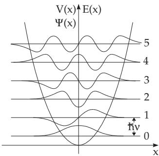

##### 9.2.4.7 Linear Harmonic Oscillator

1. Formulation of the Problem

Harmonic oscillation occurs when the drag forces in the oscillator satisfy Hooke’s law $F = - k x$ . For the frequency of the oscillation, for the frequency of the oscillation circuit and for the potential energy the following formulas are valid:

$$
\nu = { \frac { 1 } { 2 \pi } } { \sqrt { \frac { k } { m } } } , \left( 9 . 1 4 2 \mathrm { a } \right) \qquad \omega = { \sqrt { \frac { k } { m } } } , \qquad \left( 9 . 1 4 2 \mathrm { b } \right) \qquad E _ { \mathrm { p o t } } = { \frac { 1 } { 2 } } k x ^ { 2 } = { \frac { \omega ^ { 2 } } { 2 } } x ^ { 2 } .\tag{9.142c}
$$

Substituting into (9.114a), the Schroedinger equation becomes

$$
{ \frac { d ^ { 2 } \varPsi } { d x ^ { 2 } } } + { \frac { 2 m } { \hbar ^ { 2 } } } \left[ E - { \frac { \omega ^ { 2 } } { 2 } } m x ^ { 2 } \right] \varPsi = 0 .\tag{9.143a}
$$

With the substitutions

$$
y = x \sqrt { \frac { m \omega } { \hbar } } ,\tag{9.143b}
$$

$$
\lambda = { \frac { 2 E } { \hbar \omega } } ,\tag{9.143c}
$$

where $\lambda$ is a parameter and not the wavelength, (9.143a) can be transformed into the simpler form of the Weber diferential equation

$$
\frac { d ^ { 2 } \varPsi } { d y ^ { 2 } } + ( \lambda - y ^ { 2 } ) \varPsi = 0 .\tag{9.143d}
$$

2. Solution

A solution of the Weber diferential equation can be got in the form

$$
\varPsi ( y ) = e ^ { - y ^ { 2 } / 2 } H ( y ) .\tag{9.144a}
$$

Diferentiation shows that

$$
\frac { d ^ { 2 } \varPsi } { d y ^ { 2 } } = e ^ { - y ^ { 2 } / 2 } \left[ \frac { d ^ { 2 } H } { d y ^ { 2 } } - 2 y \frac { d H } { d y } + ( y ^ { 2 } - 1 ) H \right] .\tag{9.144b}
$$

Substitution into (9.143d) yields

$$
\frac { d ^ { 2 } H } { d y ^ { 2 } } - 2 y \frac { d H } { d y } + ( \lambda - 1 ) H = 0 .\tag{9.144c}
$$

The determination of a solution is convenient in the form of a series:

$$
H = \sum _ { i = 0 } ^ { \infty } a _ { i } y ^ { i } \quad \mathrm { w i t h } \quad { \frac { d H } { d y } } = \sum _ { i = 1 } ^ { \infty } i a _ { i } y ^ { i - 1 } , \frac { d ^ { 2 } H } { d y ^ { 2 } } = \sum _ { i = 2 } ^ { \infty } i ( i - 1 ) a _ { i } y ^ { i - 2 } .\tag{9.145a}
$$

Substitution of (9.145a) into (9.144c) results in

$$
\sum _ { i = 2 } ^ { \infty } i ( i - 1 ) a _ { i } y ^ { i - 2 } - \sum _ { i = 1 } ^ { \infty } 2 i a _ { i } y ^ { i } + \sum _ { i = 0 } ^ { \infty } i ( \lambda - 1 ) a _ { i } y ^ { i } = 0 .\tag{9.145b}
$$

Comparing the coeficients of $y ^ { j }$ leads to the recursion formula

$$
( j + 2 ) ( j + 1 ) a _ { j + 2 } = [ 2 j - ( \lambda - 1 ) ] a _ { j } \quad ( j = 0 , 1 , 2 , \ldots ) .\tag{9.145c}
$$

The coeficients $a _ { j }$ for even powers of $y$ begin from $a _ { 0 }$ , the coeficients for odd powers begin from $a _ { 1 }$ $\mathrm { S o } , a _ { 0 }$ and $a _ { 1 }$ can be chosen arbitrarily.

3. Physical Solutions

The determination of the probability of the presence of a particle in the diferent states can be performed by a quadratically integrable wave function $\varPsi ( x )$ and by an eigenfunction which has physical meaning, $\mathrm { i . e . }$ , normalizable and for large values of y it tends to zero.

The exponential function $\exp ( - y ^ { 2 } / 2 )$ in (9.144a) guarantees that the solution $\varPsi ( y )$ tends to zero for $y  \infty$ if the function $H ( y )$ is a polynomial. To get a polynomial, the coeficients $a _ { j }$ in (9.145a), starting from a certain n, must vanish for every $j > n \colon a _ { n } \neq 0 , a _ { n + 1 } = a _ { n + 2 } = a _ { n + 3 } = \cdot . . . = 0$ . The recursion formula (9.145c) with $j = n$ is

$$
a _ { n + 2 } = \frac { 2 n - ( \lambda - 1 ) } { ( n + 2 ) ( n + 1 ) } a _ { n } .\tag{9.146a}
$$

$a _ { n + 2 } = 0$ can be satisfied for $a _ { n } \neq 0$ only if

$$
2 n - ( \lambda - 1 ) = 0 , \quad \lambda = \frac { 2 E } { \hbar \omega } = 2 n + 1 .\tag{9.146b}
$$

The coeficients $a _ { n + 2 } , a _ { n + 4 } , . . .$ . vanish for this choice of λ. Also $a _ { n - 1 } = 0$ must hold to make the coefi cients $a _ { n + 1 } , a _ { n + 3 } , \ldots .$ equal to zero.

One gets the Hermite polynomials from the second defining equation (see 9.1.2.6, 6., p. 568) for the special choice of $a _ { n } = 2 ^ { n } , a _ { n - 1 } = 0$ The first six of them are:

$$
\begin{array} { l l } { { H _ { 0 } ( y ) = 1 , } } & { { H _ { 3 } ( y ) = - 1 2 y + 8 y ^ { 3 } , } } \\ { { H _ { 1 } ( y ) = 2 y , } } & { { H _ { 4 } ( y ) = 1 2 - 4 8 y ^ { 2 } + 1 6 y ^ { 4 } , } } \\ { { H _ { 2 } ( y ) = - 2 + 4 y ^ { 2 } , \quad } } & { { H _ { 5 } ( y ) = 1 2 0 y - 1 6 0 y ^ { 3 } + 3 2 y ^ { 5 } . } } \end{array}\tag{9.146c}
$$

The solution $\varPsi ( y )$ for the vibration quantum number n is

$$
\varPsi _ { n } = N _ { n } e ^ { - y ^ { 2 } / 2 } H _ { n } ( y ) ,\tag{9.147a}
$$

where $N _ { n }$ is the normalizing factor. One gets it from the normalization condition $\int { \varPsi _ { n } } ^ { 2 } d y = 1$ as

$$
N _ { n } ^ { ~ 2 } = { \frac { 1 } { 2 ^ { n } n ! } } { \sqrt { \frac { \alpha } { \pi } } } \quad { \mathrm { w i t h } } \quad { \sqrt { \alpha } } = { \frac { y } { x } } = { \sqrt { \frac { m \omega } { \hbar } } } \quad ( { \mathrm { s e e ~ ( 9 . 1 4 3 b ) , ~ p . ~ } } 6 0 1 ) .\tag{9.147b}
$$

From the terminating condition of the series (9.143c)

$$
E _ { n } = \hbar \omega \left( n + { \frac { 1 } { 2 } } \right) \quad ( n = 0 , 1 , 2 , . . . )\tag{9.147c}
$$

follows for the eigenvalues of the vibration energy. The spectrum of the energy levels is equidistant. The sum-

mand $+ 1 / 2$ in the parentheses means that in contrast to the classical case the quantum mechanical oscillator has energy even in the deepest energetic level with $n = 0$ , which is known as the zero-point vibration energy.

Fig. 9.21 shows a graphical representation of the equidistant spectra of the energy states, the corresponding wave functions from $\varPsi _ { 0 }$ to $\varPsi _ { 5 }$ and also the function of the potential energy (9.142c). The points of the parabola of the potential energy represent the reversal points of the classical oscillator, which are calculated from the energy $E = { \frac { 1 } { 2 } } m \omega ^ { 2 } a ^ { 2 }$ as the amplitude $a = { \frac { 1 } { \omega } } { \sqrt { \frac { 2 E } { m } } }$ . The quantum mechanical probability of finding a particle in the interval $( x , x + d x )$ is given by $d w _ { q u } = | \varPsi ( x ) | ^ { 2 }$ dx. It is diferent from zero also outside of these points. So for, e.g.,

  
Figure 9.21

$n = 1$ , hence for $E = ( 3 / 2 ) \hbar \omega ,$ , according to $d w _ { q u } = 2 \sqrt { \frac { \lambda } { \pi } } e ^ { - \lambda x ^ { 2 } } d x$ , the maximum of the probability of presence is at

$$
x _ { m a x , q u } = \frac { \pm 1 } { \sqrt { \lambda } } = \pm \sqrt { \frac { \hbar } { m \omega } } .\tag{9.147d}
$$

For a corresponding classical oscillator, this is

$$
x _ { m a x , k l } = \pm a = \pm \sqrt { \frac { 2 E } { m \omega ^ { 2 } } } = \pm \sqrt { \frac { 3 \hbar } { m \omega } } .\tag{9.147e}
$$

For large quantum numbers n the quantum mechanical probability density function approaches the classical one in its mean value.
