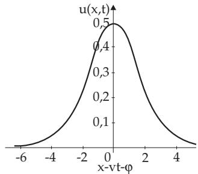
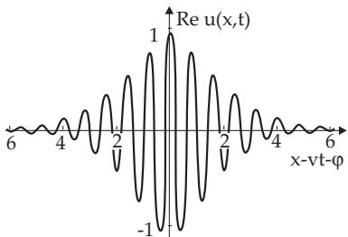
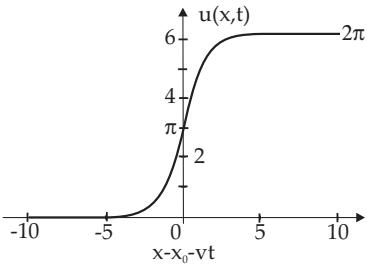

#### 9.2.5 Non-Linear Partial Differential Equations: Solitons, Periodic Patterns and Chaos

##### 9.2.5.1 Formulation of the Physical-Mathematical Problem

1. Notion of Solitons

Solitons, also called solitary waves, from the viewpoint of physics, are pulses, or also localized disturbances of a non-linear medium or field; the energy related to such propagating pulses or disturbances is concentrated in a narrow spatial region. They occur:

in solids, e.g., in inharmonic lattices, in Josephson contacts, in glass fibres and in quasi-one-dimensional conductors,

in fluids as surface waves or spin waves,

in plasmas as Langmuir solitons,

in linear molecules,

in classical and quantum field theory.

Solitons have both particle and wave properties; they are localized during their evolution, and the domain of the localization, or the point around which the wave is localized, travels as a free particle; in particular it can also be at rest. A soliton has a permanent wave structure: based on a balance between nonlinearity and dispersion, the form of this structure does not change.

Mathematically, solitons are special solutions of certain non-linear partial diferential equations occurring in physics, engineering and applied mathematics. Their special features are the absence of any dissipation and also that the non-linear terms cannot be handled by perturbation theory. Dissipative solitons are in non-conservative systems.

2. Important Examples of Equations with Soliton Solutions

a) Korteweg de Vries (KdV) Equation

$$
u _ { t } + 6 u u _ { x } + u _ { x x x } = 0 ,\tag{9.148}
$$

$$
\mathrm { i } u _ { t } + u _ { x x } \pm 2 | u | ^ { 2 } u = 0 ,\tag{9.149}
$$

c) Sine-Gordon (SG) Equation

$$
u _ { t t } - u _ { x x } + \sin u = 0 .\tag{9.150}
$$

The subscripts x and t denote partial derivatives, $\mathrm { e . g . , } u _ { x x } = \partial ^ { 2 } u / \partial x ^ { 2 } .$

In these equations the one-dimensional case is considered, i.e., u has the form $u = u ( x , t )$ , where x is the spatial coordinate and t is the time. The equations are given in a scaled form, i.e., the two independent variables x and t are here dimensionless quantities. In practical applications, they must be multiplied by quantities having the corresponding dimensions and being characteristic of the given problem. The same holds for the velocity.

3. Interaction between Solitons

If two solitons, moving with diferent velocities, collide, they appear again after the interaction as if they had not collided. Every soliton asymptotically keeps its form and velocity; there is only a phase shift. Two solitons can interact without disturbing each other asymptotically. This is called an elastic interaction which is equivalent to the existence of an N-soliton solution, where N $( N = 1 , 2 , 3 , . . . )$ is the number of solitons. Solving an initial value problem with a given initial pulse $u ( x , 0 )$ that disaggregate into solitons, the number of solitons does not depend on the shape of the pulse but on its total amount $\textstyle \int _ { - \infty } ^ { + \infty } u ( x , 0 )$ dx.

4. Periodic Patterns and Non-Linear Waves

Such non-linear phenomena occur in several classic dissipative systems (i.e. friction or damping systems), when an external impact or force is suficiently large. E.g., if there is a layer of fluid in the gravitational field, and it is heated from below, the diference of temperature between the upper and lower surface corresponds to an external force. The higher temperature of the lower layer reduces its density and makes it lighter than the upper part, so the layering becomes unstable. At a suficiently large temperature diference this unstable layering turns spontaneously into periodically arranged convection cells. It is called the bifurcation from the state of thermal conductivity (without convection) into the well ordered Rayleigh-B´enard convection. Taking away the external force results because of dissipation into damping of the waves (here the cellular convection). Strengthening of the external force drives the ordered convection into a turbulent convection and into chaos (see 17.3, p. 892). Also in chemical reactions similar phenomena can occur. Important examples for equations describing such phenomena are:

a) Ginsburg-Landau (GL) Equation

$$
u _ { t } - u - ( 1 + \mathrm { i } b ) u _ { x x } + ( 1 + \mathrm { i } c ) | u | ^ { 2 } u = 0 ,\tag{9.151}
$$

b) Kuramoto-Sivashinsky (KS) Equation

$$
u _ { t } + u _ { x x } + u _ { x x x x } + u _ { x } ^ { 2 } = 0 .\tag{9.152}
$$

In contrast to the dissipation-less KdV, NLS, SG, equations, the equations (9.151) and (9.152) are nonlinear dissipative equations, which have, besides spatiotemporal periodic solutions, also spatiotemporal disordered (chaotic) solutions. Appearance of spatiotemporal patterns or structures is characteristic which turn into chaos.

5. Dissipative Solitons

Solitary (isolated) wave phenomena in non-conservative systems often are called dissipative solitons. Contrary to the conservative systems, in which the solitons usually form families of solutions with at least one continuously changing parameter, dissipative solitons can be found at single points of the parameter space, at which a balance is formed between dispersion and nonlinearity from one side and energy or particle flow and dissipation from the other side. This property leads to a special kind of stability of dissipative solitons, although they are not solutions of integrable wave equations. Dissipative solitons are described among others by the complex Ginsburg-Landau equation. They occur ,e.g., in non-linear optic cavitations, in optic semiconductor amplifiers and in reaction-difusion systems (see also [9.16]).

6. Non-Linear Evolution Equations

Evolution equations describe the evolution of a physical quantity in time. Examples are the wave equation (see 9.2.3.2, p. 590), the heat equation (see 9.2.3.3, p. 591) and the Schroedinger equation (see 9.2.4.1, 1., p. 592). The solutions of the evolution equations are called evolution functions.

In contrast to linear evolution equations, the non-linear evolution equations (9.148), (9.149), and (9.150) contain non-linear terms like $u \partial u / \partial x$ $| u | ^ { 2 } u ,$ , sin u and $u _ { x } ^ { 2 }$ . These equations are (with the exception of (9.151)) parameter-free. From the viewpoint of physics non-linear evolution equations describe structure formations like solitons (dispersive structures) as well as periodic patterns and non-linear waves (dissipative structures).

##### 9.2.5.2 Korteweg de Vries Equation (KdV)

1. Occurrence

The KdV equation is used in the discussion of

surface waves in shallow water,

inharmonic vibrations in non-linear lattices,

problems of plasma physics and

non-linear electric networks.

2. Equation and Solutions

The KdV equation for the evolution function u is

$$
u _ { t } + 6 u u _ { x } + u _ { x x x } = 0 .\tag{9.153}
$$

It has the soliton solution

$$
u ( x , t ) = \frac { v } { 2 \cosh ^ { 2 } \left[ \frac { 1 } { 2 } \sqrt { v } ( x - v t - \varphi ) \right] } .\tag{9.154}
$$

Figure 9.22

This KdV soliton is uniquely defined by the two dimensionless parameters v $( v > 0 )$ and $\varphi .$ . In Fig. 9.22 v = 1 is chosen. A typical non-linear efect is that the velocity of the soliton v determines the amplitude and the width of the soliton: KdV solitons with larger amplitude and smaller width move faster than those with smaller amplitude and larger width (taller waves travel faster than shorter ones). The soliton phase $\varphi$ describes the position of the maximum of the soliton at time $t = 0$

Equation (9.153) also has N-solitons solutions. Such an N-soliton solution can be represented asymptotically for $t \to \pm \infty$ by the linear superposition of one-soliton solutions:

$$
u ( x , t ) \sim \sum _ { n = 1 } ^ { N } u _ { n } ( x , t ) .\tag{9.155}
$$

Here every evolution function $u _ { n } ( x , t )$ is characterized by a velocity $v _ { n }$ and a phase $\varphi _ { n } ^ { \pm }$ . The initial phases $\varphi _ { n } ^ { - }$ before the interaction or collision difer from the final phases after the collision $\varphi _ { n } ^ { + }$ , while the velocities $v _ { 1 } , v _ { 2 } , \dotsc , v _ { N }$ have no changes, i.e., it is an elastic interaction.

For N = 2, (9.153) has a two-soliton solution. It cannot be represented for a finite time by a linear superposition, and with $k _ { n } = { \frac { 1 } { 2 } } { \sqrt { v } } _ { n }$ and $\alpha _ { n } = \frac { 1 } { 2 } \sqrt { v _ { n } } ( x - v _ { n } t - \varphi _ { n } ) ( n = 1 , 2 )$ it has the form:

$$
u ( x , t ) = 8 \frac { k _ { 1 } ^ { 2 } e ^ { \alpha _ { 1 } } + k _ { 2 } ^ { 2 } e ^ { \alpha _ { 2 } } + ( k _ { 1 } - k _ { 2 } ) ^ { 2 } e ^ { ( \alpha _ { 1 } + \alpha _ { 2 } ) } \left[ 2 + \displaystyle \frac { 1 } { ( k _ { 1 } + k _ { 2 } ) ^ { 2 } } \left( k _ { 1 } ^ { 2 } e ^ { \alpha _ { 1 } } + k _ { 2 } ^ { 2 } e ^ { \alpha _ { 2 } } \right) \right] } { \left[ 1 + e ^ { \alpha _ { 1 } } + e ^ { \alpha _ { 2 } } + \left( \displaystyle \frac { k _ { 1 } - k _ { 2 } } { k _ { 1 } + k _ { 2 } } \right) ^ { 2 } e ^ { ( \alpha _ { 1 } + \alpha _ { 2 } ) } \right] ^ { 2 } } .\tag{9.156}
$$

Equation (9.156) describes two non-interacting solitons for $t \to - \infty$ asymptotically with velocities $v _ { 1 } = 4 k _ { 1 } ^ { 2 }$ and $v _ { 2 } = 4 k _ { 2 } ^ { 2 }$ , which transform after their mutual interaction again into two non-interacting solitons with the same velocities for $t \to + \infty$ asymptotically.

The non-linear evolution equation

$$
w _ { t } + 6 ( w _ { x } ) ^ { 2 } + w _ { x x x } = 0\tag{9.157a}
$$

where $w = { \frac { F _ { x } } { F } }$ has the following properties:

$$
F ( x , t ) = 1 + e ^ { \alpha } , \quad \alpha = { \frac { 1 } { 2 } } { \sqrt { v } } ( x - v t - \varphi )\tag{9.157b}
$$

it has a soliton solution and

b) for

$$
F ( x , t ) = 1 + e ^ { \alpha _ { 1 } } + e ^ { \alpha _ { 2 } } + \left( \frac { k _ { 1 } - k _ { 2 } } { k _ { 1 } + k _ { 2 } } \right) ^ { 2 } e ^ { ( \alpha _ { 1 } + \alpha _ { 2 } ) }\tag{9.157c}
$$

it has a two-soliton solution. With $2 w _ { x } = u$ the KdV equation (9.153) follows from (9.157a). Equation (9.156) and the expression w following from (9.157c) are examples of a non-linear superposition.

If the term $+ 6 u u _ { x }$ is replaced by $- 6 u u _ { x }$ in (9.153), then the right-hand side of (9.154) has to be multiplied by ( 1). In this case the notation antisoliton is used.

##### 9.2.5.3 Non-Linear Schroedinger Equation (NLS)

1. Occurrence

The NLS equation occurs

in non-linear optics, where the refractive index n depends on the electric field strength $\vec { \bf E } ,$ as, e.g., for the Kerr efect, where $n ( \vec { \bf E } ) = n _ { 0 } + n _ { 2 } | \vec { \bf E } | ^ { 2 }$ with $n _ { 0 } , n _ { 2 } = \mathrm { c o n s t a n t h o l d s } ,$ and

in the hydrodynamics of self-gravitating discs which allow us to describe galactic spiral arms.

2. Equation and Solution

The NLS equation for the evolution function u and its solution are:

$$
\mathrm { ~ i ~ } u _ { t } + u _ { x x } \pm 2 | u | ^ { 2 } u = 0 , \quad \mathrm { ~ } ( 9 . 1 5 8 )
$$

$$
u ( x , t ) = 2 \eta \frac { \exp \left( - \mathrm { i } [ 2 \xi x + 4 ( \xi ^ { 2 } - \eta ^ { 2 } ) t - \chi ] \right) } { \cosh [ 2 \eta ( x + 4 \xi t - \varphi ) ] } .\tag{9.159}
$$

Here $\boldsymbol { u } ( \boldsymbol { x } , t )$ is complex. The NLS soliton is characterized by the four dimensionless parameters $\eta , \xi , \varphi ,$

and $\chi .$ The envelope of the wave packet moves with the velocity $v = - 4 \xi$ ; the phase velocity of the wave packet is $2 ( \eta ^ { 2 } - \xi ^ { 2 } ) / \xi$

In contrast to the KdV soliton (9.154), the amplitude and the velocity can be chosen independently of each other. Fig. 9.23 displays the real part of (9.159) with $\eta ~ = ~ 1 / 2$ and $\xi = 4$

The solutions of the form (9.159) often are called light solitons; they solve the focusing NLS equation (9.158) for the case $" + "$ . The defocusing NLS equation $\left( \mathrm { c a s e } ^ { 3 9 } - \mathrm { } ^ { 3 9 } \right)$ gives solitons, for which $| { \bf \dot { \boldsymbol { u } } } | ^ { 2 }$ at the position of the

  
Figure 9.23

solitons is reduced in comparison to a constant background $| u ( x \to \pm \infty ) | = \eta$ . Such dark solitons have the form

$$
u ( x , t ) = \left( \mathrm { i } \frac { v } { 2 } + \sqrt { \eta ^ { 2 } - \frac { v ^ { 2 } } { 4 } } \operatorname { t a n h } \left[ \sqrt { \eta ^ { 2 } - \frac { v ^ { 2 } } { 4 } } ( x - v t ) \right] \right) \cdot \exp \left[ - \mathrm { i } \left( 2 \eta ^ { 2 } t + \chi \right) \right] .\tag{9.160}
$$

They depend on the three parameters η , v and χ and propagate with the velocity $v < 2 \eta$ on a background with trivial (flat) phase (see [9.26], [9.23]).

A general solution has in addition a phase gradient, which can be interpreted as velocity c of the background, relative to which the soliton is moving. Then the solution has the following form:

$$
u ( x , t ) = \left( { \mathrm { i } } { \frac { v } { 2 } } + { \sqrt { \eta ^ { 2 } - { \frac { v ^ { 2 } } { 4 } } } } \right) \operatorname { t a n h } \left[ { \sqrt { \eta ^ { 2 } - { \frac { v ^ { 2 } } { 4 } } } } ( x - v t - c t ) \right] \exp \left[ - { \mathrm { i } } \left( 2 \eta ^ { 2 } t + \chi - { \frac { c } { 2 } } x + { \frac { c ^ { 2 } } { 4 } } t \right) \right] .\tag{9.161}
$$

Beside of these exponential positioned soliton waves also periodic solutions of the NLS equation exist, which can be interpreted as wave packets of solitons. Such solutions can be find demanding stationarity and by integration of the remaining ordinary diferential equation. Generally such solutions are elliptic Jacobian-functions (see 14.6.2, p. 763). Some relevant solutions see [9.17].

In the case of N interacting solitons, one can characterize them by 4N arbitrary chosen parameters: $\begin{array} { r l } { \eta _ { n } , \xi _ { n } , \varphi _ { n } , \chi _ { n } } & { { } ( n = 1 , 2 , \ldots , N ) } \end{array}$

If the solitons have diferent velocities, the N-soliton solution splits asymptotically for t into a sum of N individual solitons of the form (9.159).

##### 9.2.5.4 Sine-Gordon Equation (SG)

1. Occurrence

The SG equation is obtained from the Bloch equation for spatially inhomogeneous quantum mechanical two-level systems. It describes the propagation of

ultra-short pulses in resonant laser media (self-induced transparency), the magnetic flux in large surface Josephson contacts, i.e., in tunnel contacts between two superconductors and

spin waves in superfluid helium $3 \ : ( ^ { 3 } \mathrm { H e } )$

The soliton solution of the SG equation can be illustrated by a mechanical model of pendula and springs. The evolution function goes continuously from 0 to a constant value c. The SG solitons are often called kink solitons. If the evolution function changes from the constant value c to 0, it describes a so-called antikink soliton. Walls of domain structures can be described with this type of solutions.

2. Equation and Solution

The SG equation for the evolution function u is

$$
u _ { t t } - u _ { x x } + \sin u = 0 .\tag{9.162}
$$

It has the following soliton solutions:

1. Kink Soliton

$$
u ( x , t ) = 4 \arctan e ^ { \gamma ( x - x _ { 0 } - v t ) } ,\tag{9.163}
$$

where $\gamma = \frac { 1 } { \sqrt { 1 - v ^ { 2 } } }$ and 1 < v < +1.

The kink soliton (9.163) for $v = 1 / 2$ is given in Fig. 9.24. The kink soliton is determined by two dimensionless parameters v and $x _ { 0 }$ . The velocity is independent of the amplitude. The time and the position derivatives are ordi-

  
Figure 9.24

nary localized solitons:

$$
- \frac { u _ { t } } { v } = u _ { x } = \frac { 2 \gamma } { \cosh \gamma ( x - x _ { 0 } - v t ) } .\tag{9.164}
$$

2. Antikink Soliton

$$
u ( x , t ) = 4 \arctan e ^ { - \gamma ( x - x _ { 0 } - v t ) } .\tag{9.165}
$$

3. Kink-Antikink Soliton One gets a static kink-antikink soliton from (9.163, 9.165) with v = 0:

$$
u ( x , t ) = 4 \arctan e ^ { \pm ( x - x _ { 0 } ) } .\tag{9.166}
$$

Further solutions of (9.162) are:

4. Kink-Kink Collision

$$
u ( x , t ) = 4 \arctan \left[ v \frac { \sinh \gamma x } { \cosh \gamma v t } \right] .\tag{9.167}
$$

5. Kink-Antikink Collision

$$
u ( x , t ) = 4 \arctan \left[ \frac { 1 } { v } \frac { \sinh \gamma v t } { \cosh \gamma x } \right] .\tag{9.168}
$$

6. Double or Breather Soliton, also called Kink-Antikink Doublet

$$
u ( x , t ) = 4 \arctan \left[ \frac { \sqrt { 1 - \omega ^ { 2 } } } { \omega } \frac { \sin \omega t } { \cosh \sqrt { 1 - \omega ^ { 2 } } x } \right] .\tag{9.169}
$$

Equation (9.169) represents a stationary wave, whose envelope is modulated by the frequency ω.

7. Local Periodic Kink Lattice

$$
u ( x , t ) = 2 \arcsin \left[ \pm \mathrm { s n } \left( \frac { x - v t } { k \sqrt { 1 - v ^ { 2 } } } , k \right) \right] + \pi .\tag{9.170a}
$$

The relation between the wavelength λ and the lattice constant k is

$$
\begin{array} { r } { \lambda = 4 K ( k ) k \sqrt { 1 - v ^ { 2 } } . } \end{array}\tag{9.170b}
$$

For k = 1, i.e., for $\lambda \to \infty$ , one gets

$$
u ( x , t ) = 4 \arctan e ^ { \pm \gamma ( x - v t ) } ,\tag{9.170c}
$$

which is the kink soliton (9.163) and the antikink soliton (9.165) again, with $x _ { 0 } = 0$

Remark: sn x is a Jacobian elliptic function with parameter k and quarter-period K (see 14.6.2, p. 763):

$$
\operatorname { s n } x = \sin \varphi ( x , k ) ,\tag{9.171a}
$$

$$
x = \begin{array} { c } { { \displaystyle { \int } } } \\ { { 0 } } \end{array} \frac { d q } { \sqrt { ( 1 - q ^ { 2 } ) ( 1 - k ^ { 2 } q ^ { 2 } ) } } , ~ \mathrm { ( 9 . 1 7 1 b ) }
$$

$$
K ( k ) = \int _ { 0 } ^ { \pi / 2 } { \frac { d \Theta } { \sqrt { 1 - k ^ { 2 } \sin ^ { 2 } \Theta } } } .\tag{9.171c}
$$

Equation (9.171b) comes from (14.104a), p. 763, by the substitution of sin $\psi = q .$ . The series expansion of the complete elliptic integral is given as equation (8.104), in 8.2.5, 7., p. 515.

##### 9.2.5.5 Further Non-linear Evolution Equations with Soliton Solutions

1. Modified KdV Equation

$$
u _ { t } \pm 6 u ^ { 2 } u _ { x } + u _ { x x x } = 0 .\tag{9.172}
$$

The even more general equation (9.173) has the soliton (9.174) as solution.

$$
u _ { t } + u ^ { p } u _ { x } + u _ { x x x } = 0 , ( 9 . 1 7 3 )
$$

$$
u ( x , t ) = \left[ \frac { { \displaystyle \frac { 1 } { 2 } | v | } ( p + 1 ) ( p + 2 ) } { { \displaystyle \cosh ^ { 2 } \left( \frac { 1 } { 2 } p \sqrt { | v | } ( x - v t - \varphi ) \right] } } \right] ^ { \frac { 1 } { p } } .\tag{9.174}
$$

2. Sinh-Gordon Equation

$$
u _ { t t } - u _ { x x } + \sinh u = 0 .\tag{9.175}
$$

3. Boussinesq Equation

$$
u _ { x x } - u _ { t t } + ( u ^ { 2 } ) _ { x x } + u _ { x x x x } = 0 .\tag{9.176}
$$

This equation occurs in the description of non-linear electric networks as a continuous approximation of the charge-voltage relation.

4. Hirota Equation

$$
u _ { t } + \mathrm { i } 3 \alpha | u | ^ { 2 } u _ { x } + \beta u _ { x x } + \mathrm { i } \sigma u _ { x x x } + \delta | u | ^ { 2 } u = 0 , \qquad \alpha \beta = \sigma \delta .\tag{9.177}
$$

5. Burgers Equation

$$
u _ { t } - u _ { x x } + u u _ { x } = 0 .\tag{9.178}
$$

This equation occurs when modeling turbulence. With the Hopf-Cole transformation it is transformed into the difusion equation, i.e., into a linear diferential equation.

6. Kadomzev-Pedviashwili Equation

The equation

$$
( u _ { t } + 6 u u _ { x } + u _ { x x x } ) _ { x } = u _ { y y }\tag{9.179a}
$$

has the soliton

$$
u ( x , y , t ) = 2 \frac { \partial ^ { 2 } } { \partial x ^ { 2 } } \ln \left[ \frac { 1 } { k ^ { 2 } } + \left| x + \mathrm { i } k y - 3 k ^ { 2 } t \right| ^ { 2 } \right]\tag{9.179b}
$$

as its solution. The equation (9.179a) is an example of a soliton equation with a higher number of independent variables, e.g., with two spatial variables.

Remark: The CD-ROM to the 7th, 8th and 9th German editions of this handbook (see [22.8]) contains more non-linear evolution equations. Furthermore there is shown the application of the Fourier transformation and of the inverse scattering theory to solve linear partial diferential equations.
