### 2. Functions

The diferentiation of a given function can be performed in a simplified manner with the operator D.   
With D[f[x], x], the derivative of the function f at the argument x will be determined.

D belongs to a group of diferential operations, which are enumerated in Table 20.12.

Table 20.12 Operations of diferentiation
<table><tr><td> $\overline { { \mathbb { D } [ f [ x ] , \{ x , n \} ] } }$   ${ \tt D } [ f , \{ x _ { 1 } , n _ { 1 } \} , \{ x _ { 2 } , n _ { 2 } \} , \cdot \cdot \cdot ]$  Dt[f]</td><td>yields the n-th derivative of function  $f ( x )$  with respect to x multiple derivatives,  $n _ { i } { \mathrm { - } } \mathrm { t h }$  derivative with respect to  $x _ { i }$   $( i = 1 , 2 , \cdots )$  the complete differential of the function f  $\textstyle { \frac { d f } { d x } }$ </td></tr><tr><td>the complete differential</td></tr></table>

A : In[1] : = D[Sqrt[x<sup>3</sup> Exp[4x] Sin[x]], x]

$$
\mathcal { O } u t [ \mathcal { I } ] = \frac { \mathrm { E } ^ { 4 x } x ^ { 3 } \mathsf { C o s } [ x ] + 3 \mathrm { E } ^ { 4 x } x ^ { 2 } \mathsf { S i n } [ \mathbf { x } ] + 4 \mathrm { E } ^ { 4 x } x ^ { 3 } \mathsf { S i n } [ x ] } { 2 \sqrt { \mathrm { E } ^ { 4 x } x ^ { 3 } \mathsf { S i n } [ x ] } }
$$

$$
\mathbf { B } : \thinspace T n [ t ] : = \mathbb { D } [ ( 2 x + 1 ) ^ { 3 x } , x ] \longrightarrow \thinspace O u t [ t ] \thinspace = ( 1 + 2 x ) ^ { 3 x } \left( { \frac { 6 x } { 1 + 2 x } } + 3 \mathrm { L o g } \left[ 1 + 2 \mathbf { x } \right] \right)
$$

The command Dt results in the complete derivative or complete diferential.

$$
\equiv \mathrm { \bf ~ C } : \ : T n [ 1 ] : = \mathrm { D t } [ x ^ { 3 } + y ^ { 3 } ] \ : \longrightarrow \ : \ : O u t \ : [ 1 ] = 3 x ^ { 2 } \mathrm { D t } [ x ] + 3 y ^ { 2 } \mathrm { D t } [ y ]
$$

$$
\equiv \mathrm { ~ D : ~ } T n [ 1 ] : = \mathrm { D t } [ x ^ { 3 } + y ^ { 3 } , x ] \longrightarrow { \cal O } u t [ t ] = 3 x ^ { 2 } + 3 y ^ { 2 } \mathrm { D t } [ y , x ]
$$

In this last example, Mathematica supposes $y$ to be a function of $x ,$ which is not known, so it writes the second part of the derivative in a symbolic way. The preferable forms of writing are: $\mathsf { D } [ x [ t ^ { 3 } ] + y [ t ] ^ { 3 } , t ]$ and $\mathsf { D } [ x ^ { \hat { 3 } } + y [ x ] ^ { 3 } , x ]$ showing explicitly the independent variables.

If Mathematica finds a symbolic function while calculating a derivative, it leaves it in this general form, and expresses its derivative by $f ^ { \prime } { } .$

$$
| \textbf { E } \colon { \bar { I } } n [ t ] : = \mathbb { D } [ x \mathbf { \Delta } \mathbf { f } [ x ] ^ { 3 } , x ] \ \longrightarrow \ { \cal O } u t { \bar { } } { \bar { I } } { \bar { I } } = \mathbf { f } [ x ] ^ { 3 } + 3 x \mathbf { f } [ x ] ^ { 2 } \mathbf { f } ^ { \prime } [ x ]
$$

Mathematica knows the rules for diferentiation of products and quotients, it knows the chain rule, and it can apply these rules formally:

$$
{ \bf I } \ { \bf F } : \ T n [ { \boldsymbol { \imath } } { \boldsymbol { \jmath } } : = { \mathbb { D } } [ { \bf f } [ { \bf u } [ { \boldsymbol { x } } ] ] , \ x ] \ \longrightarrow \ { \boldsymbol { \cal O } } u t [ { \boldsymbol { \imath } } { \boldsymbol { \jmath } } ] = { \bf f ^ { \prime } } [ { \bf u } [ { \boldsymbol { x } } ] ] \ { \bf u ^ { \prime } } [ { \boldsymbol { x } } ]
$$

G : $I n [ { \boldsymbol { \mathit { 1 } } } ] : = \mathrm { D } [ \mathrm { u } [ { \boldsymbol { x } } ] / \mathbf { v } [ { \boldsymbol { x } } ] , { \boldsymbol { x } } ] \ \longrightarrow \ { \boldsymbol { \mathit { 0 u t } } } [ { \boldsymbol { \mathit { 1 } } } ] = { \frac { \mathrm { u } ^ { \prime } [ { \boldsymbol { x } } ] } { \mathrm { v } [ { \boldsymbol { x } } ] } } - { \frac { \mathrm { u } [ { \boldsymbol { x } } ] \ \mathrm { v } ^ { \prime } [ { \boldsymbol { x } } ] } { \mathrm { v } [ { \boldsymbol { x } } ] ^ { 2 } } }$

20.3.4.2 Indefinite Integrals

With the command Integrate $[ f , x ]$ , Mathematica tries to determine the indefinite integral $\int f ( x ) d x$

If Mathematica knows the integral, it gives it without the integration constant. Mathematica supposes that every expression not containing the integration variable does not depend on it.

In general, Mathematica finds an indefinite integral, if there exists one which can be expressed in closed form by elementary functions, such as rational functions, exponential and logarithmic functions, trigonometric and their inverse functions, etc. If Mathematica cannot find the integral, then it returns the original input. Mathematica knows some special functions which are defined by non-elementary integrals, such as the elliptic functions, and some others.

To demonstrate the possibilities of Mathematica, some examples will be shown, which are discussed in 8.1, p. 480f.

1. Integration of Rational Functions

(see also 8.1.3.3, p. 485f.)

$$
\mathbf { A } : I n [ { 1 } ] : = { \mathrm { I n t e g r a t e } } [ ( 2 x + 3 ) / ( x ^ { 3 } + x ^ { 2 } - 2 x ) , x ]
$$

$$
o u t [ 1 ] = \frac { 5 } { 3 } \mathrm { L o g } [ - 1 + x ] - \frac { 3 \mathrm { L o g } [ x ] } { 2 } - \frac { 1 } { 6 } \mathrm { L o g } [ 2 + x ]
$$

B : In[1] : = Integrate $[ ( x ^ { 3 } + 1 ) / ( x ( x - 1 ) ^ { 3 } ) ,$ , x]

$$
O u t [ 1 ] = - \frac { 1 } { ( - 1 + x ) ^ { 2 } } - \frac { 1 } { - 1 + x } + 2 \mathsf { L o g } [ - 1 + x ] - \mathsf { L o g } [ x ]\tag{20.35}
$$

On the monitor can be seen in the left corner of the next cell a plus sign. Clicking on it one may choose either the free-from input or the Wolfram-Alpha query. If one types the integral into one of these then there is given the possibility to have a look at all the details of the process of integration.

2. Integration of Trigonometric Functions

(see also 8.1.5, p. 491f.)

A: The example A in 8.1.5.2, p. 492, with the integral $\int \sin ^ { 2 } x \cos ^ { 5 }$ x dx is calculated (substitution is done by the program automatically, if needed):

$$
I n [ 1 ] : = { \mathrm { I n t e g r a t e } } [ { \mathrm { S i n } } [ x ] ^ { 2 } { \mathrm { C o s } } [ x ] ^ { 5 } , x ]
$$

$$
O u t [ 1 ] = \frac { 5 \mathrm { { S i n } [ \it { x } ] } } { 6 4 } - \frac { 1 } { 1 9 2 } \mathrm { { S i n } [ 3 \it { x } ] } - \frac { 3 } { 3 2 0 } \mathrm { { S i n } [ 5 \it { x } ] } - \frac { 1 } { 4 4 8 } \mathrm { { S i n } [ 7 \it { x } ] }
$$

B: The example B in 8.1.5.2, p. 492, with the integral $\int { \frac { \sin x } { \sqrt { \cos x } } }$ dx is calculated:

$$
{ \cal I } n [ t ] : = \mathrm { I n t e g r a t e } [ \mathrm { S i n } [ x ] / \mathrm { S q r t } [ \mathrm { C o s } [ x ] ] , x ] \longrightarrow { \cal O } u t [ t ] = - 2 \sqrt { \mathrm { C o s } [ x ] } .
$$

Remark: In the case of non-elementary integrals Mathematica may do nothing.

$$
\ln [ 1 ] : = \int x ^ { x } \mathrm { { d } x \longrightarrow \partial } { a } t [ 1 ] = \int \mathrm { { x } ^ { x } \mathrm { { d } x \mathrm { \Omega } } }
$$

20.3.4.3 Definite Integrals and Multiple Integrals

1. Definite Integrals

With the command Integrate $[ f , \{ x , x _ { a } , x _ { e } \} ]$ , Mathematica can evaluate the definite integral of the function $f ( x )$ with a lower limit $x _ { a }$ and upper limit $x _ { e }$

$$
\mathrm { ~ A : } \ T n [ { \cal I } ] : = \mathrm { I n t e g r a t e } [ \mathrm { E x p } [ - x ^ { 2 } ] , \left\{ x , 0 , \mathrm { I n f i n i t y } \right\} ] \longrightarrow \ { \cal O } u t [ t { \cal I } = \frac { \sqrt { \pi } } { 2 } ] .
$$

(see Table 21.8, p. 1098, No. 25 for $a = 1 )$

B: If the input is

$$
I n [ 1 ] : = \mathrm { I n t e g r a t e } [ \frac { 1 } { x ^ { 2 } } , \{ x , - 1 , 1 \} ] \qquad \mathrm { o n e ~ g e t s }
$$

$$
O u t ( { \it 1 } \bar { { z } } \mathrm { { / } } \bar { { z } } \mathrm { { / } } \bar { { z } } \mathrm { { / } } \bar { { z } } \mathrm { { / } } \bar { { z } } \mathrm { { / } } \bar { { z } } \mathrm { { / } } \bar { { z } } \mathrm { { / } } \bar { { z } } \mathrm { { / } } \bar { { z } } \mathrm { { / } } \bar { { z } } \mathrm { { / } } \bar { { z } } \mathrm { { / } } \bar { { z } } \mathrm { { / } } \bar { { z } } \mathrm { { / } } \bar { { z } } \mathrm { { / } } \bar { { z } } \mathrm { { / } } \bar { { z } } \mathrm { { / } } \bar { { z } } \mathrm { { / } } \bar { { z } } \mathrm { { / } } \bar { { z } } \mathrm { { / } } \bar { { z } } \mathrm { { / } } \bar { { z } } \mathrm { { / } } \bar { { z } } \mathrm { { / } } \bar { { z } } \mathrm { { / } } \bar { { z } } \mathrm { { / } } \bar { { z } } \mathrm { { / } } \bar { { z } } \mathrm { { / } } \bar { { z } } \mathrm { { / } } \bar { { z } } \mathrm { { / } } \bar { { z } } \mathrm { { / } } \bar { { z } } \mathrm { { / } } \bar { { z } } \mathrm { { / } } \bar { { z } } \mathrm { { / } } \bar { { z } } \mathrm { { / } } \bar { { z } } \mathrm { { / } } \bar { { z } } \mathrm { { / } } \bar { { z } } \mathrm { { / } } \bar { { z } } \mathrm { { / } } \bar { { z } } \mathrm { { / } } \bar { { z } } \mathrm { { / } } \bar { { z } } \mathrm { { / } } \bar { { z } } \mathrm { { / } } \bar { { z } } \mathrm { { / } } \bar { { z } } \mathrm { { / } } \bar { { z } } \mathrm { { / } } \bar { { z } } \mathrm { { / } } \bar { { z } }
$$

In the calculation of definite integrals one should be careful. If the properties of the integrand are not known, then it is recommended to ask for a graphical representation of the function in the considered domain before integration.

2. Multiple Integrals

Definite double integrals can be called by the command

$$
\mathtt { I n t e g r a t e } [ \mathbf { f } \left[ x , y \right] , \left\{ x , x _ { a } , x _ { e } \right\} , \left\{ y , y _ { a } , y _ { e } \right\} ]\tag{20.36}
$$

The evaluation is performed from right to left, so, first the integration is evaluated with respect to y. The limits $y _ { a }$ and $y _ { e }$ can be functions of $x ,$ which are substituted into the primitive function. Then the integral is evaluated with respect to x.

For the integral A, which calculates the area between a parabola and a line intersecting it twice, in 8.4.1.2, p. 524, one gets

$$
\bar { I n } [ I ] : = \mathrm { { I n t e g r a t e } } [ x ~ y ^ { 2 } , \{ x , 0 , 2 \} , \{ y , x ^ { 2 } , 2 x \} ] \longrightarrow \ O u t [ I ] = \frac { 3 2 } { 5 } .
$$

Also in this case, it is important to be careful with the discontinuities of the integrand. The domain of integration can also be specified with inequalities: Integrate[Boole $[ x ^ { 2 } + y ^ { 2 } \leq \tilde { 1 } , \{ x , - 1 , 1 \} , \{ y , - 1 , 1 \} ] ]$ gives π.

20.3.4.4 Solution ofDiferential Equations

Mathematica can handle ordinary diferential equations symbolically if the solution can be given in closed form. In this case, Mathematica gives the solution in general. The commands discussed here are listed in Table 20.13.

The solutions (see 9.1, p. 540) are represented as general solutions with the arbitrary constants $C [ i ]$ Initial values and boundary conditions can be introduced in the part of the list which contains the equation or equations. In this case a special solution is returned. As examples, two diferential equations are solved here from 9.1.1.2, p. 542.

$$
I n [ \boldsymbol { \boldsymbol { \mathit { 1 } } } \boldsymbol { \mathit { 1 } } ] : = \mathrm { D S o l v e } [ \boldsymbol { \boldsymbol { y } } ^ { \prime } [ \boldsymbol { \boldsymbol { x } } ] - \boldsymbol { y } [ \boldsymbol { \boldsymbol { x } } ] \ \mathrm { T a n } [ \boldsymbol { \boldsymbol { x } } ] = = \mathrm { C o s } [ \boldsymbol { \boldsymbol { x } } ] , \boldsymbol { y } , \boldsymbol { x } ]
$$

A: The solution of the diferential equation $y ^ { \prime } ( x ) - y ( x )$ tan $x = \cos x $ is to be determined.

Mathematica solves this equation, and gives the solution as a pure function with the integrations constant C[1].

Table 20.13 Commands to solve diferential equations
<table><tr><td> $\overline { { \mathsf { D S o l v e } [ d e q , y [ x ] , x ] } }$ </td><td>solves the differential equation for  $y [ x ]$  (if it is possible);  $y [ x ]$  may be given in implicit form</td></tr><tr><td> $\mathtt { D S o l v e } [ d e q , y , x ]$ </td><td>gives the solution of the differential equation in the form of a</td></tr><tr><td> $\mathtt { D S o l v e } [ \{ d e q _ { 1 } , d e q _ { 2 } , \ldots \} , y , x ]$ </td><td>pure function solves a system of ordinary differential equations</td></tr></table>

$$
{ \cal O } u t ( t { \cal J } = \{ \{ y  \mathrm { { \cal { F } } u n c t i o n } [ { \bf x } , { \cal { C } } [ 1 ] \mathrm { { \cal ~ S e c } } [ { \bf x } ] + \mathrm { { \cal { S } } e c } [ { \bf x } ] ( \frac { x } { 2 } + \frac { 1 } { 4 } \mathrm { { \cal { S } } i n } [ 2 { \bf { x } } ] ) ] \} \} \} _ { \mathrm { { \cal { H } } } } ^ { \mathrm { { } } } ) .
$$

If it is required to get the solution value $y [ x ]$ , then Mathematica gives

$$
T n [ 2 { \cal { I } } : = y [ x ] / \cdot \stackrel { \triangledown } { \boldsymbol { \mathcal { I } } } 0 1 \longrightarrow \left. O u t \right. [ 2 { \cal { J } } = \left\{ \mathrm { C } [ 1 ] \mathrm { S e c } [ x ] + \mathrm { S e c } [ x ] \left( \frac { x } { 2 } + \frac { 1 } { 4 } \mathrm { S i n } [ 2 x ] \right) \right\}
$$

One also could make the substitution for other quantities, e.g., for $y ^ { \prime } [ x ] \mathrm { o r } y [ 1 ]$ . The advantage of using pure functions is obvious here.

B: The solution of the diferential equation $y ^ { \prime } ( x ) x ( x - y ( x ) ) + y ^ { 2 } ( x ) = 0 { \mathrm { ~ ( s e e ~ } } 9 . 1 . 1 . 2 , \mathbf { 2 . } , \mathbf { p . } 5 4 2 { \mathrm { ) } }$ is to be determined.

$$
I n [ { \cal { 1 } } ] : = \mathrm { D S o l v e } [ y ^ { \prime } [ x ] ~ x ( x - y [ x ] ) + y [ x ] ^ { \wedge } 2 = = 0 , y [ x ] , x ]
$$

$$
0 u t [ 1 ] = \left\{ \left\{ y [ x ] \ \longrightarrow \ - \mathrm { x } \mathrm { P r o d u c t L o g } [ - \frac { E ^ { - \mathrm { C } [ 1 ] } } { x } ] \right\} \right\}
$$

Here ProductLog[z] gives the principal solution for w in $z = w e ^ { w }$ . The solution of this diferentia equation was given in implicit form (see 9.1.1.2, 2., p. 542)

If Mathematica cannot solve a diferential equation it returns the input without any comment. In such cases, or also, if the symbolic solution is too complicated, the solutions can be found by numerical solutions (see 19.8.4.2, 5., p. 1018). Also in the case of symbolic solutions of diferential equations, like in the evaluation of indefinite integrals, the eficiency of Mathematica should not be overestimated. If the result cannot be expressed as an algebraic expression of elementary functions, the only way is to find a numerical solution.

Remark: Mathematica can solve some partial diferential equations both symbolically and numerically, as well, even on complicated multidimensional domains.

20.4 Graphics with Mathematica

By providing routines for graphical representation of mathematical relations such as the graphs of functions, space curves, and surfaces in three-dimensional space, modern computer algebra systems provide extensive possibilities for combining and manipulating formulas, especially in analysis, vector calculus, and diferential geometry, and they provide immeasurable help in engineering designing. Graphics is a special strength of Mathematica.

20.4.1 Basic Elements ofGraphics

Mathematica builds graphical objects from built-in graphics primitives. These are objects such as points (Point), lines (Line) and polygons (Polygon) and properties of these objects such as thickness and color.

Mathematica has several options to specify the environment for graphics and how the graphical objects should be represented.

With the command Graphics[list], where list is a list of graphics primitives, Mathematica is called to generate a graphic from the listed objects. The object list can follow a list of options about the appearance of the representation.

With the input

$$
\begin{array} { r } { I n [ t ] : = g = \mathtt { G r a p h i c s } [ \{ \mathtt { L i n e } [ \{ \{ 0 , 0 \} , \{ 5 , 5 \} , \{ 1 0 , 3 \} \} ] , \mathtt { C i r c l e } [ \{ 5 , 5 \} , 4 ] , } \end{array}\tag{20.37a}
$$

$$
\mathtt { T e x t } [ \mathtt { S t y l e } [ \mathrm { ^ { \circ } E x a m p l e ^ { \gamma } } , \mathrm { ^ { \circ } H e l v e t i c a ^ { \gamma } } , \mathrm { B o l d } , \mathrm { 2 5 } ] , \{ 5 , 6 \} ] \} , \mathtt { A s p e c t R a t i o - > A u t o m a t i c } ]\tag{20.37b}
$$

a graphic is built from the following elements:

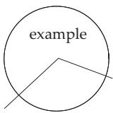  
Figure 20.1

a) Broken line of two line segments starting at the point (0, 0) through the point (5, 5) to the point (10, 3).

b) Circle with the center at (5, 5) and radius 4.

c) Text with the content “Example”, written in Helvetica font, boldface (the text appears centered with respect to the reference point (5, 6)). With the call Show[g], Mathematica displays the figure (Fig. 20.1).

Certain options might be previously specified. Here the option AspectRatio is set to Automatic.

By default Mathematica makes the ratio of the height to the width of the graph 1 : GoldenRatio (see e.g. 3.5.2.3,3., p. 194). It corresponds to a relation between the extension in the x direction to the one in $1 : 1 / 1 . 6 1 8 = 1 : 0 . 6 1 8$ . With this option the circle would be deformed into an ellipse. The value of the option Automatic ensures that the representation is not deformed.

20.4.2 Graphics Primitives

Mathematica provides the two-dimensional graphic objects enumerated in Table 20.14.

Besides these objects Mathematica provides further primitives to control the appearance of the representation, the graphics commands. They specify how graphic objects should be represented. The commands are listed in Table 20.15.

There is a wide scale of colors to choose from but their definitions are not discussed here.

Table 20.14 Two-dimensional graphic objects  
Point[ x, y ] point at position x, y   
$\mathtt { L i n e } [ \{ { \hat { x } } _ { 1 } , y _ { 1 }  \hat { \} } , \{ x _ { 2 } , y _ { 2 } \} , . . . \} ]$ broken line through the given points   
Rectangle $[ \{ x _ { l u } , y _ { l u } \} , \{ x _ { r o } , \bar { y _ { r o } } \} ]$ shaded rectangle with the given coordinates left-down, right-up   
$\mathtt { P o l y g o n } [ \{ \{ x _ { 1 } , y _ { 1 } \} , \{ x _ { 2 } , y _ { 2 } \} , . . . \} ]$ shaded polygon with the given vertices   
$\mathtt { C i r c l e } [ \{ x , y \} , r ]$ circle with radius r around the center x, y   
$\mathtt { C i r c l e [ \{ \xi , y \} , \vec { r _ { \cdot } } \{ \alpha _ { 1 } , \alpha _ { 2 } \} ] }$ circular arc with the given angles as limits   
$\mathtt { C i r c l e } [ \{ x , y \} , \{ a , b \} ]$ ellipse with half-axes a and b   
$\mathtt { C i r c l e } [ \{ x , y \} , \{ a , b \} , \{ \alpha _ { 1 } , \alpha _ { 2 } \} ]$ elliptic arc   
$\mathtt { D i s k } [ \{ { \overset { . } { x } } , y \} , { \overset { . } { r } } ] , \mathtt { D i s k } [ \{ x , y \} , \{ { \overset { . } { a } } , b \} ]$ shaded circle or ellipse   
$\operatorname { T e x t } [ i e x t , \overbrace { \{ x , y \} } ]$ writes text centered to the point x, y

Table 20.15 Graphics commands
<table><tr><td>PointSize[a]</td><td>a dot is drawn with radius a as a fraction of the total picture</td></tr><tr><td>AbsolutePointSize[b]</td><td>denotes the absolute radius b of the dot (measured in American pt (0.3515 mm))</td></tr><tr><td>Thickness[a]</td><td>draws lines with relative thickness a</td></tr><tr><td>AbsoluteThickness[b]</td><td>draws lines with absolute thickness b (also in pt)</td></tr><tr><td>Dashing  $\left\{ a _ { 1 } , a _ { 2 } , a _ { 3 } , . . . \right\} ]$ </td><td>draws a line as a sequence of stripes with the given length (in</td></tr><tr><td>AbsoluteDashing  $\left. b _ { 1 } , b _ { 2 } , \ldots \right. ]$ </td><td>relative measure)</td></tr><tr><td></td><td>the same as the previous one but in absolute measure</td></tr><tr><td>GrayLevel[p]</td><td>specifies the level of shade  $( p = 0$  is for black, p = 1 is for white)</td></tr></table>

20.4.3 Graphical Options

Mathematica provides several graphical options which have an influence on the appearance of the entire picture. Table 20.16 gives a selection of the most important commands. For a detailed explanation, see [20.16].

Table 20.16 Some graphical options  
AspectRatio > w sets the ratio w of hei ht and width. determines   
w from the absolute coordinates; the default setting is   
w = 1 : GoldenRatio   
Axes > True draws coordinate axes   
Axes > False does not draw coordinate axes   
Axes > True, False shows only the x-axis   
Frame > True shows frames   
GridLines > Automatic shows grid lines   
AxesLabel $ \{ x _ { s y m b o l } , y _ { s y m b o l } \}$ denotes axes with the given symbols   
Ticks > Automatic denotes scalin marks automaticall with the can be   
suppressed   
$\mathrm { T i c k s }  \{ \{ x _ { 1 } , x _ { 2 } , . . . \} , \{ y _ { 1 } , y _ { 2 } , . . . \} \}$ scaling marks are placed at the given nodes

20.4.4 Syntax ofGraphical Representation

20.4.4.1 Building Graphic Objects

If a graphic object is to be built from primitives, then first a list of the corresponding objects with their global definition should be given in the form

$$
\{ o b j e c t _ { 1 } , o b j e c t _ { 2 } , . . . \} ,\tag{20.38a}
$$

where the objects themselves can be lists of graphic objects. Let object1 be, e.g.,

$$
I n [ t ] : = o 1 = \{ \mathrm { C i r c l e } [ \{ 5 , 5 \} , \{ 5 , 3 \} ] , \mathrm { L i n e } [ \{ \{ 0 , 5 \} , \{ 1 0 , 5 \} \} ] \}
$$

and corresponding to it

$$
I n [ 2 ] : = o 2 = \{ { \tt C i r c l e } [ \{ 5 , 5 \} , 3 ] \}
$$

as in Fig.20.1. If a graphic object, e.g., o2, is to be provided with certain graphical commands, then it should be written into one list with the corresponding command

$$
I n [ 3 ] : = o 3 = \{ \mathrm { T h i c k n e s s } [ 0 . 0 1 ] , o 2 \}
$$

This command is valid for all objects in the corresponding braces, and also for nested ones, but not for the objects outside of the braces of the list.

From the generated objects two diferent graphic lists are defined:

$$
I n [ 4 ] : = g 1 = { \mathrm { G r a p h i c s } } [ \{ o 1 , o 2 \} ] ; g 2 = { \mathrm { G r a p h i c s } } [ \{ o 1 , o 3 \} ]
$$

which difers only in the second object by the thickness of the circle. The call

$$
\mathtt { S h o w } [ g 1 ] \ \mathrm { ~ a n d ~ } \ \mathtt { S h o w } [ g 2 , \mathtt { A x e s } \ \to \ \mathtt { T r u e } ]\tag{20.38b}
$$

givs the pictures represented in Fig. 20.2.

In the call of the picture in Fig. 20.2b, the option Axes > True was activated. This results in the representation of the axes with marks on them chosen by Mathematica and with the corresponding scaling.

20.4.4.2 Graphical Representation of Functions

Mathematica has special commands for the graphical representation of functions. With

$$
\mathbb { P } 1 \mathrm { o t } [ \mathbf { f } \left[ x \right] , \left\{ x , x _ { m i n } , x _ { m a x } \right\} ]\tag{20.39}
$$

the function f is represented graphically in the domain between $x = x _ { m i n }$ and $x = x _ { m a x }$ . Mathematica produces a function table by internal algorithms and reproduces the graphics following from this table by graphics primitives.


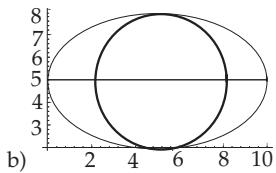  
Figure 20.2

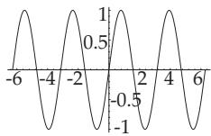  
Figure 20.3

If the function $x \mapsto$ sin 2x is to be graphically represented in the domain between 2π and 2π, then the input is

$$
I n [ 1 ] : = \mathrm { P l o t } [ \mathrm { S i n } [ 2 x ] , \{ x , - \mathrm { 2 P i } , \mathrm { 2 P i } \} ] .
$$

Mathematica produces the curve shown in Fig. 20.3.

It is obvious that Mathematica uses certain default graphical options in the representation as mentioned in 20.4.1, p. 1045. So, the axes are automatically drawn, they are scaled and denoted by the corresponding x and y values. In this example, the influence of the default AspectRatio can be seen. The ratio of the total width to the total height is 1 : 0.618.

With the command InputForm[%] the whole representation of the graphic objects can be shown. For the previous example one gets:

Graphics[ , , Directive[Opacity[1.], RGBColor[0.368417, 0.506779, 0.709798],

<sub>AbsoluteThickness[1.6]], Line[ -6.283185050723043, 2.5645654335783057\*</sub>−<sup>7</sup> ,

<sub>..., 6.283185050723043, -2.5645654335783057\*</sub>−<sup>7</sup> <sub>], DisplayFunction -> Identity,</sub>

AspectRatio -> GoldenRatio<sup>(</sup>−<sup>1)</sup>, Axes -> True, True , AxesLabel -> None, None ,

AxesOrigin -> 0, 0 , DisplayFunction :> Identity,

Frame -> False, False , False, False , FrameLabel -> None, None ,

None, None , FrameTicks -> Automatic, Automatic , Automatic, Automatic ,

GridLines -> None, None , GridLinesStyle -> Directive[GrayLevel[0.5, 0.4]],

Method -> "DefaultBoundaryStyle" -> Automatic, "ScalingFunctions" -> None ,

PlotRange -> -2\*Pi, 2\*Pi , -0.9999996654606427, 0.9999993654113022 ,

PlotRangeClipping -> True, PlotRangePadding -> Scaled[0.02], Scaled[0.02] ,

Scaled[0.05], Scaled[0.05] , Ticks -> Automatic, Automatic ]

Consequently, the graphic object consists of a few sublists. The first one contains the graphics primitive Line (slightly modified), with which the internal algorithm connects the calculated points of the curve by lines. The second sublist contains the options needed by the given graphic. These are the default options. If the picture is to be altered at certain positions, then the new settings in the Plot command must be set after the main input. With

$$
I n [ 2 ] : = { \mathrm { P l o t } } [ { \mathrm { S i n } } [ 2 x ] , \{ x , - 2 { \mathrm { P i } } , 2 { \mathrm { P i } } \} , { \mathrm { A s p e c t R a t i o - } } 1 ]\tag{20.40}
$$

the representation would be done with equal length of axes x and y.

It is possible to give several options at the same time after each other.With the input

$$
\mathrm { P l o t } [ \{ f _ { 1 } [ x ] , f _ { 2 } [ x ] , \ldots \} , \{ x , x _ { m i n } , x _ { m a x } \} ]\tag{20.41}
$$

several functions are shown in the same graphic. With the command

Show[plot, options]

(20.42)

an earlier picture can be renewed with other options.With

$$
\mathtt { S h o w } [ \mathtt { G r a p h i c s A r r a y } [ l i s t ] ] ,\tag{20.43}
$$

(with list as lists of graphic objects) pictures can be placed next to each other, under each other, or they can be arranged in matrix form.

20.4.5 Two-Dimensional Curves

A series of curves from the chapter on functions and their representations (see 2.1, p. 48f.) is shown as examples.

20.4.5.1 Exponential Functions

A family of curves with several exponential functions (see 2.6.1, p. 72) is generated by Mathematica (Fig. 20.4a) with the following input:

$$
I n [ 1 ] : = \mathbf { f } [ x _ { - } ] : = 2 ^ { \wedge } x ; \mathbf { g } [ x _ { - } ] : = 1 0 ^ { \wedge } x ;
$$

$$
I n [ 2 J : = \mathtt { h } [ x _ { - } ] : = ( 1 / 2 ) ^ { \wedge } x ; \mathtt { j } [ x _ { - } ] : = ( 1 / \mathtt { E } ) ^ { \wedge } x ; \mathtt { k } [ x _ { - } ] : = ( 1 / 1 0 ) ^ { \wedge } x ;
$$

These are the definitions of the considered functions. There is no need to define the function $e ^ { x }$ , since it is built into Mathematica. In the second step the following graphics are generated:

$$
I n [ 3 J : = p 1 = \mathbb { P } ] \circ \mathbf { 1 } [ \{ \mathbf { f } [ x ] , \mathbf { h } [ x ] \} , \{ x , - 4 , 4 \} , P l o t S t y l e \sim \mathbb { D } \mathrm { a s h i n g } [ \{ 0 . 0 1 , 0 . 0 2 \} ] ]
$$

$$
I n [ 4 ] : = p 2 = \mathrm { P l o t } [ \{ \mathrm { E x p } [ x ] , \mathrm { j } [ x ] \} , \{ x , - 4 , 4 \} ]
$$

$$
T n [ S ] : = p 3 = \mathbb { P } { \mathrm { 1 o t } } \big [ \{ \mathbf { g } [ x ] , \mathbf { k } [ x ] \} , \{ x , - 4 , 4 \} , \mathbb { P } { \mathrm { 1 o t } } \mathbb { S } \mathbf { t } \mathbf { y } { \mathrm { 1 e } } \to \mathbb { D } { \mathrm { a s h i n g } } \big [ \{ 0 . 0 0 5 , 0 . 0 2 , 0 . 0 1 , 0 . 0 2 \} \big ] \big ]
$$

The whole picture (Fig. 20.4a) can be obtained by:

$$
\begin{array} { r } { I n [ 6 7 : = { \mathrm { S h o w } } [ \{ p 1 , p 2 , p 3 \} , { \mathrm { P l o t R a n g e } }  \{ 0 , 1 8 \} , { \mathrm { A s p e c t R a t i o } }  1 . 2 ] } \end{array}
$$

The question of how to write text on the curves is not discussed here. This is possible with the graphics primitive Text.

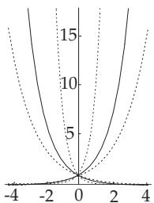  
a)

  
Figure 20.4

20.4.5.2 Function y = x + Arcoth x

Considering the properties of the function Arcoth x discussed in 2.10, p. 93, the function $y = x +$ Arcoth x can be graphically represented in the following way:

$$
I n [ 1 ] : = f 1 = \mathrm { P l o t } [ x + \mathrm { A r c C o t h } [ x ] , \{ x , 1 . 0 0 0 0 0 0 0 0 0 0 5 , 7 \} ]
$$

$$
I n [ 2 J : = f 2 = { \mathsf { P l o t } } [ x + { \mathsf { A r c C o t h } } [ x ] , \{ x , - 7 , - 1 . 0 0 0 0 0 0 0 0 0 0 5 \} ]
$$

$$
I n [ 3 ] : = { \mathrm { S h o w } } [ \{ f 1 , f 2 \} , { \mathrm { P l o t R a n g e } } \to \{ - 1 0 , 1 0 \} , { \mathrm { A s p e c t R a t i o } } \to 1 . 2 , { \mathrm { T i c k s } } \to { \mathrm { V o l o t R a t i o } } { \mathrm { R a t i o } } ] { \mathrm { } } ,
$$

$$
\{ \{ \{ - 6 , - 6 \} , \{ - 1 , - 1 \} , \{ 1 , 1 \} , \{ 6 , 6 \} \} , \{ \{ 2 . 5 , 2 . 5 \} , \{ 1 0 , 1 0 \} \} \} , \mathtt { A x e s o r i g i n - > 0 , 0 } \}
$$

The high precision of the x values in the close neighborhood of 1 and 1 was chosen to get suficiently large function values for the required domain of y. The result is shown in Fig. 20.4b.

(20.44a)

20.4.5.3 Bessel Functions (see 9.1.2.6, 2., p. 562)

With the calls

In[1] := bj0 = Plot[ BesselJ[0, z], BesselJ[2, z], Bessel ${ \cal J } [ 4 , z ] \} ] , \{ z , 0 , 1 0 \}$ , PlotLabel >

$$
I n [ 2 ] : = b j 1 = \mathtt { P l o t } [ \{ \mathtt { B e s s e l J } [ 1 , z ]\tag{20.44b}
$$

the graphics of the Bessel function $J _ { n } ( z )$ for $n = 0 , 2 .$ 4 and $n = 1 , 3 ,$ 5 are generated, which are then represented by the call

$$
I n [ 3 ] : = { \mathrm { G r a p h i c s R o w } } [ \{ b j 0 , b j 1 \} ] ]
$$

next to each other in Fig. 20.5.

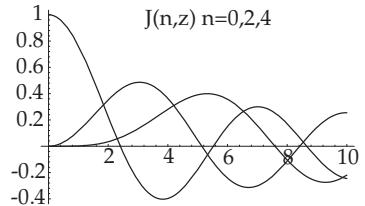

b)  
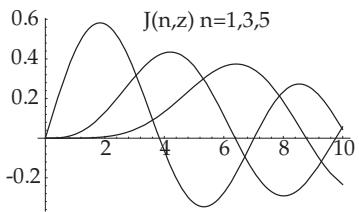  
Figure 20.5

20.4.6 Parametric Representation ofCurves

Mathematica has a special graphics command, with which curves given in parametric form can be graphically represented. This command is:

$$
\mathtt { P a r a m e t r i c P l o t } [ \{ f _ { x } ( t ) , f _ { y } ( t ) \} , \{ t , t _ { 1 } , t _ { 2 } \} ] .\tag{20.45}
$$

It provides the possibility of showing several curves in one graphic. A list of several curves must be given in the command. With the option AspectRatio > Automatic, Mathematica shows the curves in their natural forms.

The parametric curves in Fig. 20.6 are the Archimedean spiral (see 2.14.1, p. 105) and the logarithmic spiral (see 2.14.3, p. 106). They are represented with the input

In[1] := ParametricPlot[ t Cos[t], t Sin[t] , t, 0, 3Pi , AspectRatio > Automatic] and

$$
\begin{array} { r l } & { I n [ 2 \bar { \jmath } : = \mathrm { P a r a m e t r i c P l o t } [ \{ \mathrm { E x p } [ 0 . 1 t ] \mathrm { C o s } [ t ] , \mathrm { E x p } [ 0 . 1 t ] \mathrm { S i n } [ t ] \} , \{ t , 0 , 3 \mathrm { P i } \} , } \\ & { \quad \quad \quad \mathrm { A s p e c t R a t i o - > \mathrm { A u t o m a t i c } } ] } \end{array}
$$

With

In[3] := ParametricPlot[ t 2 Sin[t], 1 2 Cos[t] , t, Pi, 11Pi , AspectRatio > 0.3] a trochoid (see 2.13.2, p. 102) is generated (Fig. 20.7).

  
Figure 20.6

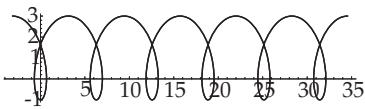  
Figure 20.7

20.4.7 Representation ofSurfaces and Space Curves

Mathematica provides the possibility of representing three-dimensional graphics primitives.

Similarly to the two-dimensional case, three-dimensional graphics can be generated by applying diferent options. The objects can be represented and observed from diferent viewpoints and from diferent perspectives. Also the representation of curved surfaces in three-dimensional space, i.e., the graphical representation of functions of two variables, is possible. Furthermore it is possible to represent curves in three-dimensional space, e.g., if they are given in parametric form. For a detailed description of three-dimensional graphics primitives see [20.5], [20.16]. The introduction of these representations is similar to the two-dimensional case.

20.4.7.1 Graphical Representation of Surfaces

The command Plot3D in its basic form requires the definition of a function of two variables and the domain of these two variables:

$$
\mathtt { P l o t 3 D } [ \mathtt { f } [ x , y ] , \{ x , x _ { a } , x _ { e } \} , \{ y , y _ { a } , y _ { e } \} ]\tag{20.46}
$$

All options have the default setting.

For the function $z = x ^ { 2 } + y ^ { 2 }$ , with the input

$$
I n [ t ] : = \mathbb { P } \mathrm { 1 o t 3 D } [ x ^ { 2 } + y ^ { 2 } , \{ x , - 5 , 5 \} , \{ y , - 5 , 5 \} , \mathbb { P } \mathrm { 1 o t R a n g e } \to \{ 0 , 2 5 \} ]
$$

we get Fig. 20.8a, while Fig. 20.8b is generated by the command

$$
I n [ 2 J : = \mathbb { P } \mathsf { I o t } 3 \mathsf { D } [ ( 1 - \mathbb { S } \mathsf { i n } [ x ] ) ( 2 - \mathsf { C o s } [ 2 \ y ] ) , \{ x , - 2 , 2 \} , \{ y , - 2 , 2 \} ]
$$

For the paraboloid, the option PlotRange is given with the required z values, because the solid is cut at $z = 2 5$

20.4.7.2 Options for 3D Graphics

The number of options for 3D graphics is large. In Table 20.17, only a few are enumerated, where options known from 2D graphics are not included. They can be applied in a similar sense. The option ViewPoint has special importance, by which very diferent observational perspectives can be chosen.

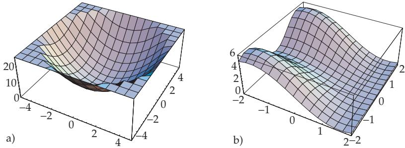  
Figure 20.8

20.4.7.3 Three-Dimensional Objects in Parametric Representation

Similarly to 2D graphics, three-dimensional objects given in parametric representation can also be represented. With

$$
\mathrm { P a r a m e t r i c P l o t 3 D } [ \{ f _ { x } [ t , u ] , f _ { y } [ t , u ] , f _ { z } [ t , u ] \} , \{ t , t _ { a } , t _ { e } \} , \{ u , u _ { a } , u _ { e } \} ]\tag{20.47}
$$

a parametrically given surface is represented, with

$$
\mathtt { P a r a m e t r i c P l o t 3 D } [ \{ f _ { x } [ t ] , f _ { y } [ t ] , f _ { z } [ t ] \} , \{ t , t _ { a } , t _ { e } \} ]\tag{20.48}
$$

a three-dimensional curve is generated parametrically.

Table 20.17 Options for 3D graphics
<table><tr><td>Boxed ViewPoint</td><td>default setting is True; it draws a three-dimensional frame around the surface HiddenSurface sets the non-transparency of the surface; default setting is True specifies the point  $( x , y , z )$  in space, from where the surface is observed. De- fault values are  $\{ 1 . 3 , - 2 . 4 , 2 \}$ </td></tr></table>

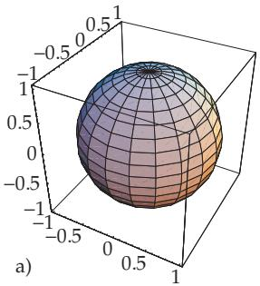

  
Figure 20.9

The objects in Fig. 20.9a and Fig. 20.9b are represented with the commands

$$
\begin{array} { r l } & { T n [ 3 ] : = \mathtt { P a r a m e t r i c P l o t 3 D } [ \{ \mathsf { C o s } [ t ] \mathsf { C o s } [ u ] , \mathsf { S i n } [ t ] \mathsf { C o s } [ u ] , \mathsf { S i n } [ u ] \} , \{ t , 0 , 2 \mathsf { P i } \} } \\ & { \qquad \{ u , - \mathsf { P i } / 2 , \mathsf { P i } / 2 \} ] } \end{array}\tag{20.49a}
$$

$$
I n [ 4 ] : = { \mathrm { P a r a m e t r i c P l o t 3 D } } [ \{ \complement \complement [ t ] , \ S \bot \setminus [ t ] , t / 4 \} , \{ t , 0 , 2 0 \} ]\tag{20.49b}
$$

Mathematica provides further commands by which density, and contour diagrams, bar charts and sector diagrams, and also a combination of diferent types of diagrams, can be generated.

The representation of the Lorenz attractor (see 17.2.4.3, p. 887) can easily be generated by Mathematica.

There is a series of recent developments most of which are not to be shown in a book. One can easily build a GUI (graphical user interface) to utilize interactive properties of the program. Most of the calculations are parallelized automatically, but functions such as Parallelize and ParallelMap provides the user to create his/her own parallel programs. The extremely fast graphic cards can be programmed at a very high level (as opposed to other languages) using such functions as CUDALink, OpenCLFunctionLoad etc. An extremely useful example of dynamic interactivity tool is Manipulate which in the simplest case shows you the parameter dependence of a family of curves. Working in the cloud or using the computer Raspberry Pi (which comes a free Mathematica license) should also not be unmentioned.

21 Tables

21.1 Frequently Used Mathematical Constants

<table><tr><td rowspan=1 colspan=1>πeC</td><td rowspan=1 colspan=1>3,141592654... $2 , 7 1 8 2 8 1 8 2 8 \ldots$  $0 . 5 7 7 2 1 5 6 6 5 \ldots$ </td><td rowspan=1 colspan=1>Ludolf constant $( \pi )$ Euler constant $( e )$ Euler constant (C)</td><td rowspan=1 colspan=1> $1 \%$  $1 \textdegree \_ \_$  $\sqrt { 2 }$ </td><td rowspan=1 colspan=1>0,010,0011,4142136...</td><td rowspan=1 colspan=1>percentper mil</td></tr><tr><td rowspan=1 colspan=1> $\lg e = M$ lg2</td><td rowspan=1 colspan=1> $0 , 4 3 4 2 9 4 4 8 2 \ldots$  $0 { , } 3 0 1 0 3 0 . . .$ </td><td rowspan=1 colspan=1>ln 10 = M−1 = 2,302585093 . . . $\ln 2 = 0 , 6 9 3 1 4 7 2 . . .$ </td><td rowspan=1 colspan=1> $\sqrt { 3 }$  $\sqrt { 1 0 }$ </td><td rowspan=1 colspan=1> $1 , 7 3 2 0 5 0 8 . . .$  $3 , 1 6 2 2 7 7 7 \ldots$ </td><td rowspan=1 colspan=1></td></tr></table>

21.2 Important Natural Constants

This table contains values of constants, recommended in [21.19], [21.20], [21.21]. In parenthesis is given the standard uncertainty of the last two digits. The note (fixed) indicates that this value is fixed by definition.

Fundamental constants   
Avogadro constant $\begin{array} { r l } { \overline { { N _ { \mathrm { A } } } } } & { { } = 6 , 0 2 2 1 4 1 2 9 ( 2 7 ) { \cdot } 1 0 ^ { 2 3 } / \mathrm { m o l } } \end{array}$   
velocity of light in vacuum $\begin{array} { r l r } { c _ { 0 } } & { { } } & { = 2 9 9 7 9 2 4 5 8 \mathrm { m / s } ( \mathrm { f i x e d } ) } \end{array}$   
gravitation constant $\begin{array} { r l } { G } & { { } = 6 , 6 7 3 8 4 ( 8 0 ) { \cdot } 1 0 ^ { - 1 1 } \mathrm { m } ^ { 3 } / ( \mathrm { k g } \mathrm { s } ^ { 2 } ) } \end{array}$   
fundamental electric charge $e$ $= 1 , 6 0 2 1 7 6 5 6 5 ( 3 5 ) { \cdot } 1 0 ^ { - 1 9 } \mathrm { C }$   
fine structure constant $\begin{array} { r l r } { \alpha } & { { } } & { = \mu _ { 0 } c _ { 0 } e ^ { 2 } / ( 2 h ) = 7 , 2 9 7 3 5 2 5 6 9 8 ( 2 4 ) \cdot 1 0 ^ { - 3 } } \end{array}$   
Sommerfeld constant $\begin{array} { r l } { \alpha ^ { - 1 } } & { { } = 1 3 7 , 0 3 5 9 9 9 0 7 4 ( 4 4 ) } \end{array}$   
Planck constant $\begin{array} { r l r } { h } & { { } } & { = 6 { , } 6 2 6 0 6 9 5 7 ( 2 9 ) { \cdot } 1 0 ^ { - 3 4 } \mathrm { J s } = 4 { , } 1 3 5 6 6 7 5 1 6 ( 9 1 ) { \cdot } 1 0 ^ { - 1 5 } \mathrm { e V s } } \end{array}$   
Planck quantum $h / ( 2 \pi )$ $\hbar$ $= 1 , 0 5 4 5 7 1 7 2 \dot { 6 } ( 4 7 ) { \cdot } 1 0 ^ { - 3 4 } \mathrm { J s }$   
$= 6 , 5 8 2 1 1 9 2 8 ( \mathrm { i } 5 ) { \cdot } 1 0 ^ { - 1 6 } \mathrm { e V s }$

```latex
Electromagnetic constants
spec. fund. electric charge $\begin{array} { r l } { - e / m _ { \mathrm { e } } } & { { } = - 1 , 7 5 8 8 2 0 0 8 8 ( 3 9 ) { \cdot } 1 0 ^ { 1 1 } \mathrm { C k g } ^ { - 1 } } \end{array}$
permeability of free space $\begin{array} { r l } { \mu _ { 0 } } & { { } = 4 \pi \cdot 1 0 ^ { - 7 } \mathrm { N / A } ^ { 2 } = 1 2 , 5 6 6 3 7 0 6 1 4 \cdot 1 0 ^ { - 7 } \mathrm { V s / A m \ ( f i x e d ) } } \end{array}$
permittivity of vacuum $\begin{array} { r l r } { \varepsilon _ { 0 } } & { { } } & { = 1 / ( \mu _ { 0 } c _ { 0 } ^ { 2 } ) = 8 , 8 5 4 1 8 7 8 1 7 \cdot 1 0 ^ { - 1 2 } \ \mathrm { A s / V m } \ ( \mathbf { f } \mathbf { x } \mathbf { e } \mathbf { d } ) } \end{array}$
quantum of magnetic flux $\begin{array} { r l } { \varPhi _ { 0 } } & { { } = \dot { h / ( 2 e ) } = 2 , 0 6 7 8 3 3 7 5 8 ( 4 6 ) \cdot 1 0 ^ { - 1 5 } \mathrm { W b } } \end{array}$
Josephson constant $\begin{array} { r l } { K _ { \mathrm { J } } } & { { } = 2 e / h = 4 8 3 5 9 7 , 8 7 0 ( 1 1 ) { \cdot } 1 0 ^ { 9 } \mathrm { H z / V } } \end{array}$
$\mathrm { v . }$ Klitzing constant $\begin{array} { r l } { R _ { \mathrm { K } } } & { { } = h / e ^ { 2 } = 2 5 8 1 2 , 8 0 7 4 4 3 4 ( 8 4 ) \Omega } \end{array}$
quantum of conductance $\begin{array} { r l } { G _ { 0 } } & { { } = 2 e / h = 7 , 7 4 8 0 9 1 7 3 4 6 ( 2 5 ) { \cdot } 1 0 ^ { - 5 } \mathrm { S } } \end{array}$
character. impedance (vacuum) $\begin{array} { r l } { Z _ { 0 } } & { { } = 3 7 6 , 7 3 0 3 1 3 4 6 1 \ \Omega \ ( \mathrm { { f i x e d } } ) } \end{array}$
Faraday constant $\begin{array} { r l } { \dot { F } } & { { } = e N _ { \mathrm { A } } = 9 6 4 8 5 , 3 3 6 5 ( 2 1 ) \mathrm { A } \mathrm { \dot { s } / m o l } } \end{array}$
```

```latex
Constants in physical chemistry, thermodynamics, mechanics
Boltzmann constant $\overline { { k } }$ = $\overline { { R _ { 0 } / N _ { \mathrm { A } } } } = 1 { , } 3 8 0 6 4 8 8 ( 1 3 ) { \cdot } 1 0 ^ { - 2 3 } \mathrm { J / K }$
$= 8 . 6 1 7 3 3 2 4 ( 7 8 ) { \cdot } 1 0 ^ { - 5 } \mathrm { e V / K }$
universal gas constant, molar $\begin{array} { r l } { R _ { 0 } } & { { } = N _ { \mathrm { A } } k = 8 , 3 1 4 4 6 2 1 ( 7 5 ) \mathrm { J / ( m o l ~ K ) } } \end{array}$
molar volume of inert gas $\begin{array} { r l } { V _ { \mathrm { m } _ { 0 } } } & { { } = R _ { 0 } T _ { 0 } / p _ { 0 } = 2 2 , 7 1 0 9 5 3 ( 2 1 ) { \cdot } 1 0 ^ { - 3 } \mathrm { \ ' m } ^ { 3 } / \mathrm { m o l } } \end{array}$
$( T _ { 0 } = 2 7 3 , 1 5 \mathrm { K } , p _ { 0 } = 1 0 0 \mathrm { k P a }$
molar volume of inert gas $\begin{array} { r l } { V _ { \mathrm { m _ { 1 } } } } & { { } = R _ { 0 } T _ { 0 } / p _ { 0 } = 2 2 , 4 1 3 9 6 8 ( 2 0 ) { \cdot } 1 0 ^ { - 3 } \mathrm { m ^ { 3 } / m o l } } \end{array}$
$( T _ { 0 } = 2 7 3 , 1 5 \mathrm { K } , p _ { 1 } = 1 0 \bar { 1 } , 3 2 5 \mathrm { k P a }$
Loschmidt constant $( T _ { 0 } , p _ { 0 } )$ $\begin{array} { r l } { n _ { 0 0 } } & { { } = N _ { \mathrm { A } } / V _ { \mathrm { m 0 } } = 2 , 6 5 1 6 4 6 2 ( 2 4 ) { \cdot } 1 0 ^ { 2 5 } / \mathrm { m ^ { 3 } } } \end{array}$
Loschmidt constant $( T _ { 0 } , p _ { 1 } )$ $\begin{array} { r l } { n _ { 0 1 } } & { { } = N _ { \mathrm { A } } / V _ { \mathrm { m 1 } } ^ { \mathrm { ~ - ~ } } = 2 , 6 8 6 7 8 0 5 ( 2 4 ) \cdot 1 0 ^ { 2 5 } / \mathrm { m ^ { 3 } } } \end{array}$
standard acceleration of gravity (earth, $\begin{array} { r l r } { g _ { \mathrm { n } } } & { { } } & { = 9 , 8 0 6 6 5 \mathrm { m s ^ { - 2 } \ ( f i x e d ) } } \end{array}$
$4 5 ^ { \circ }$ geographic latitude, sea level)
```

<table><tr><td colspan="3">Atomic electron shell and atomic nucleus</td></tr><tr><td>atomic mass unit u</td><td> $m _ { \mathrm { u } }$ </td><td> $= ( 1 0 ^ { - 3 } \mathrm { k g / m o l } ) / N _ { \mathrm { A } } = \textstyle { \frac { 1 } { 1 2 } } m _ { \mathrm { a t o m } } ( ^ { 1 2 } \mathrm { C } )$   $= 1 , 6 6 0 5 3 8 9 2 1 ( 7 3 ) { \cdot } 1 0 ^ { - 2 7 } \ \mathrm { k g }$ </td></tr><tr><td>quantum of circulation (electron) s</td><td></td><td> $= h / ( 2 m _ { \mathrm { e } } ) = 3 , 6 3 6 9 4 7 5 5 2 0 ( 2 4 ) { \cdot } 1 0 ^ { - 4 } \mathrm { m } ^ { 2 } / \mathrm { s }$ </td></tr><tr><td>Bohr radius</td><td> $a _ { 0 }$ </td><td> $= \hbar ^ { 2 } / ( E _ { 0 } ( e ) e ^ { 2 } ) = r _ { e } / \alpha ^ { 2 } = 0 , 5 2 9 1 7 7 2 1 0 9 2 ( 1 7 ) \cdot 1 0 ^ { - 1 0 }$  m</td></tr><tr><td>classical electron radius</td><td></td><td> $\begin{array} { r l r } { r _ { \mathrm { e } } } & { { } } & { = \alpha ^ { 2 } a _ { 0 } = 2 , 8 1 7 9 4 0 3 2 6 7 ( 2 7 ) \cdot 1 0 ^ { - 1 5 } \mathrm { m } } \end{array}$ </td></tr><tr><td>Thomson cross-section</td><td></td><td> $\begin{array} { r l r } { \sigma _ { 0 } } & { { } } & { = 8 \pi r _ { \mathrm { e } } ^ { 2 } / 3 = 0 , 6 6 5 2 4 5 8 7 \dot { 3 } 4 ( 1 3 ) \cdot 1 0 ^ { - 2 8 } \mathrm { m ^ { 2 } } } \end{array}$ </td></tr><tr><td>Bohr magneton</td><td> $\mu _ { \mathrm { B } }$ </td><td> $= e \hbar / ( 2 m _ { e } ) = 9 2 7 , 4 0 0 9 6 8 ( 2 0 ) { \cdot } 1 0 ^ { - 2 6 } \mathrm { J / T }$   $= 5 { , } 7 8 8 3 8 1 8 0 6 6 ( 3 8 ) { \cdot } 1 0 ^ { - 5 } \mathrm { e V / T }$ </td></tr><tr><td>nuclear magneton</td><td> $\mu _ { \mathrm { k } }$ </td><td> $= e \hbar / ( 2 m _ { p } ) = 5 , 0 5 0 7 8 3 5 3 ( \mathrm { 1 1 } ) { \cdot } 1 0 ^ { - 2 7 } \mathrm { J / T }$ </td></tr><tr><td>nuclear radius</td><td> $R$ </td><td> $= 3 . 1 5 2 4 5 1 2 6 0 5 ( 2 2 ) { \cdot } 1 0 ^ { - 8 } \mathrm { e V / T }$   $= r _ { 0 } A ^ { 1 / 3 } ; r _ { 0 } = ( 1 , 2 \dots 1 , 4 ) \mathrm { f m } ; 1 \le A \le 2 5 0 \mathrm { : }$ </td></tr><tr><td>rest energy</td><td></td><td> $9 \mathrm { f m } \geq R \geq r _ { 0 }$ </td></tr><tr><td>atomic mass unit</td><td></td><td> $\begin{array} { r l } { E _ { 0 } ( u ) } & { { } = 9 3 1 , 4 9 4 0 6 1 ( \mathrm { 2 1 } ) \mathrm { M e V } } \end{array}$ </td></tr><tr><td>electron</td><td></td><td> $\begin{array} { r l } { E _ { 0 } ( e ) } & { { } = 0 , 5 1 0 9 9 8 9 2 8 ( \mathrm { 1 1 } ) \mathrm { M e V } } \end{array}$ </td></tr><tr><td>proton</td><td></td><td> $\begin{array} { r l } { E _ { 0 } ( p ) } & { { } = 9 3 8 , 2 7 2 0 4 6 ( \mathrm { 2 1 } ) \mathrm { M e V } } \end{array}$ </td></tr><tr><td>neutron</td><td></td><td> $\begin{array} { r l } { E _ { 0 } ( \bar { n } ) } & { { } = 9 3 9 , 5 6 5 3 7 9 ( 2 1 ) \mathrm { M e V } } \end{array}$ </td></tr><tr><td>rest mass</td><td></td><td></td></tr><tr><td>electron</td><td></td><td> $\begin{array} { r l r } { m _ { \mathrm { e } } } & { { } } & { = 9 , 1 0 9 3 8 2 9 1 ( 4 0 ) \cdot 1 0 ^ { - 3 1 } \mathrm { k g } = 5 , 4 8 5 7 9 9 0 9 4 6 ( 2 2 ) \cdot 1 0 ^ { - 4 } \mathrm { u } } \end{array}$ </td></tr><tr><td>proton</td><td> $m _ { \mathrm { p } }$ </td><td> $= 1 . 6 7 2 6 2 1 7 1 ( 2 9 ) \cdot 1 0 ^ { - 2 7 } \mathrm { k g } = 1 8 3 6 , 1 5 2 6 7 2 6 1 ( 8 5 ) m _ { \mathrm { e } }$   $1 , 0 0 7 2 7 6 4 6 6 8 1 2 ( 9 0 ) \mathrm { ~ u ~ }$ </td></tr><tr><td>neutron</td><td> $m _ { \mathrm { n } }$ </td><td> $1 , 6 7 4 9 2 7 3 5 1 ( 7 4 ) \cdot 1 0 ^ { - 2 7 } \mathrm { k g } = 1 8 3 8 , 6 8 3 6 5 9 8 ( 1 3 ) m _ { \mathrm { e } }$ </td></tr><tr><td>magnetic moment</td><td></td><td> $= 1 , 0 0 8 6 6 4 9 1 5 6 0 ( 5 5 ) \mathrm { ~ u ~ }$ </td></tr><tr><td>electron</td><td> $\mu _ { \mathrm { e } }$ </td><td> $- 1 , 0 0 1 1 5 9 6 5 2 1 8 5 9 ( 4 1 ) \mu _ { \mathrm { B } }$   $= - 9 2 8 , 4 7 6 4 1 2 ( 8 0 ) { \cdot } 1 0 ^ { - 2 6 } \ \mathrm { J / T }$ </td></tr><tr><td>proton</td><td> $\mu _ { \mathrm { p } }$ </td><td> $= + 2 , 7 9 2 8 4 7 3 5 6 ( 2 3 ) \mu _ { \mathrm { k } } = \mathrm { { i } } , 4 1 0 6 0 6 7 1 ( 1 2 ) { \cdot } 1 0 ^ { - 2 6 } \mathrm { { J } / T }$ </td></tr><tr><td>neutron</td><td> $\mu _ { \mathrm { n } }$ </td><td> $= - 1 , 9 1 3 0 4 2 7 2 ( 4 5 ) \mu _ { \mathrm { k } } = 0 , 9 6 6 2 3 6 4 7 ( 2 3 ) { \cdot } 1 0 ^ { - 2 6 } \mathrm { J / T }$ </td></tr></table>

21.3 Metric Prefixes

<table><tr><td rowspan=1 colspan=1>Prefix</td><td rowspan=1 colspan=1>Factor</td><td rowspan=1 colspan=1>Abbrevation</td><td rowspan=1 colspan=1>Prefix</td><td rowspan=1 colspan=1>Factor</td><td rowspan=1 colspan=1>Abbrevation</td></tr><tr><td rowspan=1 colspan=1>Yocto</td><td rowspan=1 colspan=1> $1 0 ^ { - 2 4 }$ </td><td rowspan=1 colspan=1>y</td><td rowspan=1 colspan=1>Deka</td><td rowspan=1 colspan=1> $1 0 ^ { 1 }$ </td><td rowspan=1 colspan=1>da</td></tr><tr><td rowspan=1 colspan=1>Zepto</td><td rowspan=1 colspan=1> $1 0 ^ { - 2 1 }$ </td><td rowspan=1 colspan=1>Z</td><td rowspan=1 colspan=1>Hekto</td><td rowspan=1 colspan=1> $1 0 ^ { 2 }$ </td><td rowspan=1 colspan=1>h</td></tr><tr><td rowspan=1 colspan=1>Atto</td><td rowspan=1 colspan=1> $1 0 ^ { - 1 8 }$ </td><td rowspan=1 colspan=1>a</td><td rowspan=1 colspan=1>Kilo</td><td rowspan=1 colspan=1> $1 0 ^ { 3 }$ </td><td rowspan=1 colspan=1>k</td></tr><tr><td rowspan=3 colspan=1>FemtoPicoNano</td><td rowspan=1 colspan=1> $1 0 ^ { - 1 5 }$ </td><td rowspan=1 colspan=1>f</td><td rowspan=1 colspan=1>Mega</td><td rowspan=1 colspan=1> $1 0 ^ { 6 }$ </td><td rowspan=1 colspan=1>M</td></tr><tr><td rowspan=2 colspan=1> $1 0 ^ { - 1 2 }$  $1 0 ^ { - 9 }$ </td><td rowspan=2 colspan=1>pn</td><td rowspan=1 colspan=1>Giga</td><td rowspan=2 colspan=1> $1 0 ^ { 9 }$  $1 0 ^ { 1 2 }$ </td><td rowspan=3 colspan=1>GTP</td></tr><tr><td rowspan=1 colspan=1>Tera</td></tr><tr><td rowspan=1 colspan=1>Mikro</td><td rowspan=1 colspan=1> $1 0 ^ { - 6 }$ </td><td rowspan=1 colspan=1>µ</td><td rowspan=1 colspan=1>Peta</td><td rowspan=1 colspan=1> $1 0 ^ { 1 5 }$ </td></tr><tr><td rowspan=1 colspan=1>Milli</td><td rowspan=1 colspan=1> $1 0 ^ { - 3 }$ </td><td rowspan=1 colspan=1>m</td><td rowspan=1 colspan=1>Exa</td><td rowspan=1 colspan=1> $1 0 ^ { 1 8 }$ </td><td rowspan=1 colspan=1>E</td></tr><tr><td rowspan=1 colspan=1>Zenti</td><td rowspan=1 colspan=1> $1 0 ^ { - 2 }$ </td><td rowspan=1 colspan=1>C</td><td rowspan=1 colspan=1>Zetta</td><td rowspan=1 colspan=1> $1 0 ^ { 2 1 }$ </td><td rowspan=1 colspan=1>Z</td></tr><tr><td rowspan=1 colspan=1>Dezi</td><td rowspan=1 colspan=1> $1 0 ^ { - 1 }$ </td><td rowspan=1 colspan=1>d</td><td rowspan=1 colspan=1>Yotta</td><td rowspan=1 colspan=1> $1 0 ^ { 2 4 }$ </td><td rowspan=1 colspan=1>Y</td></tr></table>

10<sup>3</sup> = 1000. 10−<sup>3</sup> = 0, 001. 10<sup>3</sup> m = 1 km 1 μm = 10−<sup>6</sup> m. 1 nm = 10−<sup>9</sup> m.  
Remark: The metric system is built up by adding prefixes which are the same for every kind of measure. These prefixes should be used in steps of powers with base 10 and exponent 3: milli-, micro-, nano-; ruther than in the smaller steps hecto-, deca-, deci-. The British system, unlike the metric one, is not built up in 10’s e. g.: $1 1 \mathrm { b } = 1 6 \mathrm { o z } = 7 0 0 0$ grains.

21.4 International System ofPhysical Units (SI Units)

Further information about physical units see [21.8], [21.4], [21.15].
<table><tr><td colspan="4">SI Base Units</td></tr><tr><td>length time mass thermodynamic temperature electric current</td><td>m S kg K A</td><td>meter second kilogram kelvin</td><td></td></tr><tr><td>amount of substance luminous intensity Additional SI Units</td><td>mol cd</td><td> $( 1 \dot { \mathrm { m o l } } = \mathrm { N _ { A } }$  candela</td><td>particles,  $\mathrm { N _ { A } }$  = AVOGADRO-constant)</td></tr><tr><td colspan="4">plain angle</td></tr><tr><td>solid angle</td><td>rad sr</td><td>radian steradian</td><td> $\alpha = l / r , 1 \mathrm { r a d } = 1 \mathrm { m } / 1 \mathrm { m }$   $\Omega = \dot { S } / r ^ { 2 } , 1 \mathrm { s r } = 1 \mathrm { m } ^ { 2 } / 1 \mathrm { m } ^ { 2 }$ </td></tr><tr><td colspan="4">Examples of SI derived units with special names and symbols</td></tr><tr><td>frequency force pressure, tension energy, work,</td><td>Hz N Pa</td><td>Hertz Newton Pascal</td><td> $1 \mathrm { H e r t z } = 1 / \mathrm { s }$   $1 \mathrm { N } = 1 \mathrm { k g } \mathrm { { \dot { m } } / \mathrm { s ^ { 2 } } }$   $1 \mathrm { P a } = 1 \mathrm { \tilde { N } } / \mathrm { \tilde { m } ^ { 2 } } = 1 \mathrm { k g } / ( \mathrm { m s ^ { 2 } } )$ </td></tr><tr><td>quantity of heat power electric charge</td><td>kWh W C</td><td>kilowatt hour Watt Coulomb</td><td> $1 \mathrm { J } = 1 \mathrm { N } \mathrm { \dot { m } = 1 \mathrm { k g } m ^ { 2 } / \dot { s } ^ { 2 } }$   $1 \mathrm { k W h } = 3 , 6 { \cdot } 1 0 ^ { 6 } \mathrm { \bar { J } }$   $1 \mathrm { W } = 1 \mathrm { N } \mathrm { m } / \mathrm { s } = 1 \mathrm { J } / \mathrm { s } = 1 \mathrm { k g } \mathrm { m } ^ { 2 } / \mathrm { s } ^ { 3 }$ </td></tr><tr><td>electric voltage electric capacitance</td><td>V F</td><td>Volt</td><td> $1 \mathrm { C } = 1 \mathrm { A s }$   $1 \mathrm { V } = 1 \mathrm { W } / \mathrm { A } = 1 \mathrm { k g } \mathrm { m } ^ { 2 } / ( \mathrm { A s } ^ { 3 } )$ </td></tr><tr><td>electric resistance</td><td>Ω</td><td>Farad Ohm</td><td> $1 \mathrm { F } = 1 \mathrm { C } / \mathrm { V } = 1 \mathrm { A } ^ { 2 } \mathrm { s } ^ { 2 } / \mathrm { J } = 1 \mathrm { A } ^ { 2 } \mathrm { s } ^ { 4 } / ( \mathrm { k g } \mathrm { m } ^ { 2 } )$   $1 \Omega = 1 \mathrm { V } / \mathrm { A } = 1 \mathrm { k g } \mathrm { m } ^ { \dot { 2 } } / ( \mathrm { A } ^ { 2 } \mathrm { s } ^ { 3 } )$ </td></tr><tr><td>electric conductance</td><td>S</td><td></td><td></td></tr><tr><td></td><td></td><td>Siemens</td><td> $1 \mathrm { S } = 1 / \dot { \Omega } = 1 \mathrm { A } ^ { 2 } \mathrm { s } ^ { 3 } / ( \dot { \mathrm { k g } } \mathrm { m } ^ { 2 } )$ </td></tr><tr><td>magnetic flux</td><td>Wb</td><td>Weber</td><td> $1 \mathrm { W b } \stackrel { \cdot } { = } 1 \mathrm { V s } = 1 \mathrm { k g } \mathrm { m } ^ { 2 } / ( \mathrm { A s } ^ { 2 } )$ </td></tr><tr><td></td><td></td><td></td><td></td></tr><tr><td>magnetic flux density</td><td>T</td><td>Tesla</td><td> $1 \mathrm { T } = 1 \mathrm { W b } / \mathrm { m } ^ { 2 } = 1 \mathrm { k g } / ( \mathrm { A s } ^ { 2 } )$ </td></tr><tr><td>inductance</td><td>H</td><td>Henry</td><td> $1 \mathrm { H } = 1 \mathrm { W b } / \mathrm { A } = 1 \mathrm { k g } \mathrm { \tilde { m } } ^ { 2 } / ( \mathrm { A } ^ { 2 } \mathrm { s } ^ { 2 } )$ </td></tr><tr><td></td><td></td><td></td><td></td></tr><tr><td>luminous flux</td><td>lm</td><td>Lumen</td><td> $1 \ln = 1 { \mathrm { c d } } \operatorname { s r }$ </td></tr><tr><td>illuminance</td><td>lx</td><td>Lux</td><td> $\mathrm { 1 ~ l x = 1 \ : c d \ : s r / m ^ { 2 } }$ </td></tr></table>

<table><tr><td rowspan=1 colspan=6>Further derived SI units without special names</td></tr><tr><td rowspan=1 colspan=3>speed, velocity</td><td rowspan=1 colspan=1> $\mathrm { m } / \mathrm { s }$ </td><td rowspan=7 colspan=1>accelerationangular accelerationangular momentummoment of inertiaenergyvolumeparticle number densitymagnetic fieldstrengthspecific heat capacityenthalpy</td><td rowspan=7 colspan=1> $\overline { { \mathrm { m } / \mathrm { s } ^ { 2 } } }$  $\mathrm { r a d / s ^ { 2 } }$  $\mathrm { k g } \mathrm { { \dot { m } } ^ { 2 } / s }$  $\mathrm { k g } \mathrm { m } ^ { 2 }$  $\ddot { \mathrm { W } } { \mathrm { s } }$  $\mathrm { m ^ { 3 } }$  $\mathrm { m ^ { - 3 } }$  $\mathrm { A } / \mathrm { m }$  $\mathrm { J / ( K k g ) }$ J</td></tr><tr><td rowspan=1 colspan=3>angular velocity</td><td rowspan=2 colspan=1> $\mathrm { r a d / s }$  $\mathrm { k g } \mathrm { m } / \mathrm { s }$ </td></tr><tr><td rowspan=1 colspan=3>momentum</td></tr><tr><td rowspan=1 colspan=2>torque</td><td rowspan=1 colspan=2>torqueaction</td><td rowspan=1 colspan=1> $\mathrm { N m }$  $\mathrm { J } _ { \mathrm { S } }$ </td></tr><tr><td rowspan=2 colspan=3>area</td><td rowspan=2 colspan=1> $\mathrm { m ^ { 2 } }$  $\mathrm { k g / m ^ { 3 } }$ </td></tr><tr><td rowspan=1 colspan=1>density</td></tr><tr><td rowspan=1 colspan=3>electric fieldstrengthheat capacityentropy</td><td rowspan=1 colspan=1>ieldstrength</td><td rowspan=1 colspan=1> $\mathrm { V / m }$  $\mathrm { J } / \mathrm { K }$  $\mathrm { J } / \mathrm { K }$ </td></tr></table>

<table><tr><td rowspan=1 colspan=4>Further derived SI units with special names and symbols</td></tr><tr><td rowspan=1 colspan=1>activitydose equivalentabsorbed dose</td><td rowspan=1 colspan=1>Bq $\operatorname { S v }$  $\mathrm { G y }$ </td><td rowspan=1 colspan=1>BecquerelSievertGray</td><td rowspan=1 colspan=1> $\overline { { \mathrm { B q } = 1 \mathrm { s } ^ { - 1 } } }$  $\mathrm { S v } = \mathrm { J } \mathrm { k g } ^ { - 1 }$  $\mathrm { G y = J \ k g ^ { - 1 } }$ </td></tr></table>

<table><tr><td colspan="4">Some units outside the SI accepted for use with the SI</td></tr><tr><td>area</td><td>ar</td><td> $\mathrm { A r }$ </td><td> $\overline { { 1 \mathrm { a r } = 1 0 0 \mathrm { m } ^ { 2 } } }$ </td></tr><tr><td>area</td><td>b</td><td>barn</td><td> $1 \mathrm { b a r n } = 1 0 ^ { - 2 8 } \mathrm { m } ^ { 2 }$ </td></tr><tr><td>volume</td><td>1</td><td>litre</td><td> $\mathrm { 1 1 = 1 0 ^ { - 3 } m ^ { 3 } }$ </td></tr><tr><td>velocity</td><td> $\mathrm { { k m / h } }$ </td><td></td><td> $\mathrm { 1 k m / h = 0 { , } 2 7 7 7 7 8 m / s }$ </td></tr><tr><td>mass</td><td>u</td><td>unified atomic mass unit</td><td> $1 \mathrm { u } = 1 , 6 6 0 5 6 5 5 \cdot 1 0 ^ { - 2 7 } \mathrm { k g }$ </td></tr><tr><td>energy</td><td>t  $\mathrm { e V }$ </td><td>metric ton electronvolt</td><td> $\mathrm { 1 t = 1 0 0 0 k g }$   $1 \mathrm { e V } = 1 , 6 0 \tilde { 2 } 1 7 6 5 6 5 ( 3 5 )$ </td></tr><tr><td></td><td></td><td></td><td> $\cdot 1 0 ^ { - 1 9 } \mathrm { { N m } }$ </td></tr><tr><td>focal power pressure</td><td>dpt bar</td><td>diopter Bar</td><td> $1 \mathrm { d p t } = 1 / \mathrm { m }$   $1 \mathrm { b a r } = 1 \dot { 0 } ^ { 5 } \mathrm { P a }$ </td></tr><tr><td>plain angle</td><td>mmHg</td><td>mmHg column (Torr)</td><td> $\mathrm { 1 m m H g = 1 3 3 , 3 2 2 P a }$ </td></tr><tr><td></td><td>grad minute second</td><td> $1 ^ { \circ } = \bar { \pi } / 1 8 0 \mathrm { r a d }$   $1 ^ { \prime } = ( 1 / 6 0 ) ^ { \circ } = \pi / 1 0 8 0 0 { \mathrm { r a d } }$   $1 ^ { \prime \prime } = ( 1 / 6 0 ) ^ { \prime } = \pi / 6 4 8 0 0 0 { \mathrm { r a d } }$ </td><td> $1 ^ { \circ } = 0 , \bar { 0 1 } 7 4 5 3 2 9 3 \dots { \mathrm { r a d } }$   $\mathrm { 1 ^ { \prime } = 0 0 0 2 9 0 8 8 8 \dots \mathrm { r a d } }$   $1 ^ { \prime \prime } = 0 0 0 0 0 4 8 4 8 \ldots { \mathrm { r a d } }$ </td></tr><tr><td rowspan="5">time</td><td>min</td><td>minute</td><td> $1 \mathrm { { m i n } = 6 0 \mathrm { { s } } }$ </td></tr><tr><td>h</td><td>hour</td><td> $1 \mathrm { { h } = 3 , 6 { \cdot } 1 0 ^ { 3 } \mathrm { { s } } }$ </td></tr><tr><td>d</td><td>day</td><td> $1 \mathrm { d } = 8 { , } 6 4 { \cdot } 1 0 ^ { 4 } \mathrm { s }$ </td></tr><tr><td>a</td><td></td><td></td></tr><tr><td></td><td>year</td><td> $1 { \mathrm { a } } = 3 6 5 { \mathrm { d } } = 8 7 6 0 { \mathrm { h } }$ </td></tr><tr><td colspan="4">Some units outside the SI currently accepted for use with the SI</td></tr><tr><td>length</td><td>ua</td><td></td><td> $\overline { { 1 \mathrm { A E } = 1 4 9 , 5 9 7 8 7 0 { \cdot } 1 0 ^ { 9 } \mathrm { m } } }$ </td></tr><tr><td rowspan="10"></td><td> $\mathrm { p c }$ </td><td>astronomical unit</td><td> $\mathrm { 1 p c = 3 0 , 8 5 7 { \cdot } 1 0 ^ { 1 5 } m }$ </td></tr><tr><td> $\mathrm { l y }$ </td><td>parsec</td><td></td></tr><tr><td></td><td>light year</td><td> $\mathrm { 1 \dot { L } j = 9 , 4 6 0 4 4 7 6 3 { \cdot } 1 0 ^ { 1 5 } m }$ </td></tr><tr><td>Å</td><td>Ångstrøm</td><td> $1 \textup { \AA } = 1 0 ^ { - 1 0 } \mathrm { m }$ </td></tr><tr><td>sm</td><td>nautical (intern.) mile</td><td> $\mathrm { 1 s m = 1 8 5 2 m }$ </td></tr><tr><td>bbl</td><td>U.S. barrel petroleum</td><td> $\mathrm { 1 b b l = 0 , 1 5 8 9 8 8 m ^ { 3 } }$ </td></tr><tr><td>gon</td><td>gon</td><td> $1 ^ { \mathrm { g } } = 0 , 5 \pi \cdot 1 0 ^ { - 2 } \mathrm { r a d }$ </td></tr><tr><td></td><td>gon minute</td><td> $1 ^ { \mathrm { c } } = 0 , 5 \pi \cdot 1 0 ^ { - 4 } \mathrm { r a d }$ </td></tr><tr><td></td><td>gon second</td><td> $1 ^ { \mathrm { c c } } = 0 , 5 \pi \cdot 1 0 ^ { - 6 } \mathrm { r a d }$ </td></tr><tr><td>kn</td><td>knot</td><td> $1 \ \mathrm { k n } = \mathrm { 1 s m / h } = 0 { , } 5 1 4 4 \mathrm { m / s }$ </td></tr><tr><td>velocity energy</td><td>cal</td><td>calory</td><td> $1 \mathrm { c a l } = 4 , 1 \dot { 8 } 6 8 \mathrm { J }$ </td></tr><tr><td></td><td></td><td></td><td> $1 \mathrm { \ a t m = 1 , 0 1 3 2 5 { \cdot } 1 0 ^ { 5 } P a }$ </td></tr><tr><td>pressure</td><td>atm</td><td>standard atmosphere</td><td></td></tr><tr><td>activity</td><td>Ci</td><td>Curie</td><td> $1 \mathrm { C i } = 3 , 7 \cdot 1 0 ^ { 1 0 } \mathrm { B q }$ </td></tr></table>

$$
\mathrm { P a = 1 N m ^ { - 2 } = 1 0 ^ { - 5 } b a r = 7 , 5 2 \cdot 1 0 ^ { - 3 } T o r r = 9 , 8 6 9 2 3 \cdot 1 0 ^ { - 6 } a t m ; }
$$

1 atm = 760 Torr = 101325 Pa ; 1 Torr = 133,32 Pa = 1mmHg ; 1 bar = 0,987 atm = 760,06 Torr .   
About units accepted only in some EU states see [21.15].

21.5 Important Series Expansions

<table><tr><td>Function</td><td>Series Expansion</td><td>Convergence Region</td></tr><tr><td> $( a \pm x ) ^ { m }$ </td><td>Algebraic Functions Binomial Series  $a ^ { m } \left( 1 \pm \frac { x } { a } \right) ^ { m }$  After transforming to the form one gets the following series:</td><td> $| x | \le a$   $\begin{array} { c } { \operatorname { f o r } m > 0 } \\ { \left| x \right| < a } \end{array}$   $\mathrm { f o r } m < 0$ </td></tr><tr><td> $( 1 \pm x ) ^ { m }$ </td><td>Binomial Series with Positive Exponents  $1 \pm m x + { \frac { m ( m - 1 ) } { 2 ! } } x ^ { 2 } \pm { \frac { m ( m - 1 ) ( m - 2 ) } { 3 ! } } x ^ { 3 } + \cdot \cdot \cdot$ </td><td></td></tr><tr><td> $( m > 0 )$ </td><td> $+ \ ( \pm 1 ) ^ { n } \frac { m ( m - 1 ) \ldots ( m - n + 1 ) } { n ! } x ^ { n } + \cdot \cdot \cdot$ </td><td> $| x | \le 1$ </td></tr><tr><td>(1 ± x)1</td><td> $1 \pm { \frac { 1 } { 4 } } x - { \frac { 1 \cdot 3 } { 4 \cdot 8 } } x ^ { 2 } \pm { \frac { 1 \cdot 3 \cdot 7 } { 4 \cdot 8 \cdot 1 2 } } x ^ { 3 } - { \frac { 1 \cdot 3 \cdot 7 \cdot 1 1 } { 4 \cdot 8 \cdot 1 2 \cdot 1 6 } } x ^ { 4 } \pm \cdot \cdot \cdot$ </td><td> $| x | \le 1$ </td></tr><tr><td>(1 ± x)−</td><td> $1 \pm { \frac { 1 } { 3 } } x - { \frac { 1 \cdot 2 } { 3 \cdot 6 } } x ^ { 2 } \pm { \frac { 1 \cdot 2 \cdot 5 } { 3 \cdot 6 \cdot 9 } } x ^ { 3 } - { \frac { 1 \cdot 2 \cdot 5 \cdot 8 } { 3 \cdot 6 \cdot 9 \cdot 1 2 } } x ^ { 4 } \pm \cdot \cdot \cdot$ </td><td>|x| ≤ 1</td></tr><tr><td> $( 1 \pm x ) ^ { \frac { 1 } { 2 } }$ </td><td> $1 \pm { \frac { 1 } { 2 } } x - { \frac { 1 \cdot 1 } { 2 \cdot 4 } } x ^ { 2 } \pm { \frac { 1 \cdot 1 \cdot 3 } { 2 \cdot 4 \cdot 6 } } x ^ { 3 } - { \frac { 1 \cdot 1 \cdot 3 \cdot 5 } { 2 \cdot 4 \cdot 6 \cdot 8 } } x ^ { 4 } \pm \cdot \cdot \cdot$ </td><td>|x| ≤ 1</td></tr><tr><td> $( 1 \pm x ) ^ { \frac { 3 } { 2 } }$ </td><td> $1 \pm { \frac { 3 } { 2 } } x + { \frac { 3 \cdot 1 } { 2 \cdot 4 } } x ^ { 2 } \mp { \frac { 3 \cdot 1 \cdot 1 } { 2 \cdot 4 \cdot 6 } } x ^ { 3 } + { \frac { 3 \cdot 1 \cdot 1 \cdot 3 } { 2 \cdot 4 \cdot 6 \cdot 8 } } x ^ { 4 } \mp \cdot \cdot \cdot$ </td><td> $| x | \le 1$ </td></tr><tr><td> $( 1 \pm x ) ^ { \frac { 5 } { 2 } }$ </td><td> $1 \pm { \frac { 5 } { 2 } } x + { \frac { 5 \cdot 3 } { 2 \cdot 4 } } x ^ { 2 } \pm { \frac { 5 \cdot 3 \cdot 1 } { 2 \cdot 4 \cdot 6 } } x ^ { 3 } - { \frac { 5 \cdot 3 \cdot 1 \cdot 1 } { 2 \cdot 4 \cdot 6 \cdot 8 } } x ^ { 4 } \mp \cdot \cdot \cdot$ </td><td> $| x | \le 1$ </td></tr><tr><td> $( 1 \pm x ) ^ { - m }$ </td><td>Binomial Series with Negative Exponents  $1 \mp m x + \frac { m ( m + 1 ) } { 2 ! } x ^ { 2 } \mp \frac { m ( m + 1 ) ( m + 2 ) } { 3 ! } x ^ { 3 } + \cdot \cdot \cdot$ </td><td></td></tr><tr><td>(m &gt; 0)</td><td> $+ \ ( \mp 1 ) ^ { n } \frac { m ( m + 1 ) \ldots ( m + n - 1 ) } { n ! } x ^ { n } + \cdot \cdot \cdot$ </td><td> $| x | < 1$ </td></tr><tr><td>(1 ± x)−1</td><td> $1 \mp { \frac { 1 } { 4 } } x + { \frac { 1 \cdot 5 } { 4 \cdot 8 } } x ^ { 2 } \mp { \frac { 1 \cdot 5 \cdot 9 } { 4 \cdot 8 \cdot 1 2 } } x ^ { 3 } + { \frac { 1 \cdot 5 \cdot 9 \cdot 1 3 } { 4 \cdot 8 \cdot 1 2 \cdot 1 6 } } x ^ { 4 } \mp \cdot \cdot \cdot$ </td><td>|x| &lt; 1</td></tr><tr><td>(1 ± x)−1</td><td> $1 \mp { \frac { 1 } { 3 } } x + { \frac { 1 \cdot 4 } { 3 \cdot 6 } } x ^ { 2 } \mp { \frac { 1 \cdot 4 \cdot 7 } { 3 \cdot 6 \cdot 9 } } x ^ { 3 } + { \frac { 1 \cdot 4 \cdot 7 \cdot 1 0 } { 3 \cdot 6 \cdot 9 \cdot 1 2 } } x ^ { 4 } \mp \cdot \cdot \cdot$ </td><td>|x| &lt; 1</td></tr><tr><td>(1 ± x)−</td><td> $1 \mp { \frac { 1 } { 2 } } x + { \frac { 1 \cdot 3 } { 2 \cdot 4 } } x ^ { 2 } \mp { \frac { 1 \cdot 3 \cdot 5 } { 2 \cdot 4 \cdot 6 } } x ^ { 3 } + { \frac { 1 \cdot 3 \cdot 5 \cdot 7 } { 2 \cdot 4 \cdot 6 \cdot 8 } } x ^ { 4 } \mp \cdot \cdot \cdot$ </td><td>|x| &lt; 1</td></tr><tr><td>(1 ± x)−1</td><td> $1 \mp x + x ^ { 2 } \mp x ^ { 3 } + x ^ { 4 } \mp \cdot \cdot \cdot$ </td><td>|x| &lt; 1</td></tr><tr><td>(1 ± x)− 2</td><td> $1 \mp { \frac { 3 } { 2 } } x + { \frac { 3 \cdot 5 } { 2 \cdot 4 } } x ^ { 2 } \mp { \frac { 3 \cdot 5 \cdot 7 } { 2 \cdot 4 \cdot 6 } } x ^ { 3 } + { \frac { 3 \cdot 5 \cdot 7 \cdot 9 } { 2 \cdot 4 \cdot 6 \cdot 8 } } x ^ { 4 } \mp \cdot \cdot \cdot$ </td><td>|x| &lt; 1</td></tr><tr><td></td><td></td><td></td></tr><tr><td></td><td></td><td>|x| &lt; 1</td></tr><tr><td></td><td></td><td></td></tr><tr><td></td><td></td><td></td></tr><tr><td></td><td></td><td></td></tr><tr><td> $( 1 \pm x ) ^ { - 2 }$ </td><td></td><td></td></tr><tr><td></td><td></td><td></td></tr><tr><td></td><td></td><td></td></tr><tr><td></td><td> $1 \mp 2 x + 3 x ^ { 2 } \mp 4 x ^ { 3 } + 5 x ^ { 4 } \mp \cdot \cdot \cdot$ </td><td></td></tr><tr><td></td><td></td><td></td></tr><tr><td></td><td></td><td></td></tr><tr><td></td><td></td><td></td></tr><tr><td></td><td></td><td></td></tr><tr><td></td><td></td><td></td></tr><tr><td></td><td></td><td></td></tr><tr><td></td><td></td><td></td></tr><tr><td></td><td></td><td></td></tr><tr><td></td><td></td><td></td></tr><tr><td></td><td></td><td></td></tr><tr><td></td><td></td><td></td></tr><tr><td></td><td></td><td></td></tr><tr><td></td><td></td><td></td></tr><tr><td></td><td></td><td></td></tr><tr><td></td><td></td><td></td></tr><tr><td></td><td></td><td></td></tr><tr><td></td><td></td><td></td></tr><tr><td></td><td></td><td></td></tr><tr><td></td><td></td><td></td></tr><tr><td></td><td></td><td></td></tr><tr><td></td><td></td><td></td></tr><tr><td></td><td></td><td></td></tr><tr><td></td><td></td><td></td></tr><tr><td></td><td></td><td></td></tr><tr><td></td><td></td><td></td></tr><tr><td></td><td></td><td></td></tr><tr><td></td><td></td><td></td></tr><tr><td></td><td></td><td></td></tr><tr><td></td><td></td><td></td></tr><tr><td></td><td></td><td></td></tr></table>

<table><tr><td>Function</td><td>Series Expansion</td><td></td><td>Convergence Region</td></tr><tr><td> $( 1 \pm x ) ^ { - \frac { 5 } { 2 } }$ </td><td></td><td> $1 \mp { \frac { 5 } { 2 } } x + { \frac { 5 \cdot 7 } { 2 \cdot 4 } } x ^ { 2 } \mp { \frac { 5 \cdot 7 \cdot 9 } { 2 \cdot 4 \cdot 6 } } x ^ { 3 } + { \frac { 5 \cdot 7 \cdot 9 \cdot 1 1 } { 2 \cdot 4 \cdot 6 \cdot 8 } } x ^ { 4 } \mp \cdots$ </td><td> $| x | < 1$ </td></tr><tr><td> $( 1 \pm x ) ^ { - 3 }$ </td><td></td><td> $1 \mp { \frac { 1 } { 1 \cdot 2 } } ( 2 \cdot 3 x \mp 3 \cdot 4 x ^ { 2 } + 4 \cdot 5 x ^ { 3 } \mp 5 \cdot 6 x ^ { 4 } + \cdot \cdot \cdot )$ </td><td> $| x | < 1$ </td></tr><tr><td> $( 1 \pm x ) ^ { - 4 }$   $( 1 \pm x ) ^ { - 5 }$ </td><td></td><td> $1 \mp { \frac { 1 } { 1 \cdot 2 \cdot 3 } } ( 2 \cdot 3 \cdot 4 x \mp 3 \cdot 4 \cdot 5 x ^ { 2 }$   $+ 4 \cdot 5 \cdot 6 x ^ { 3 } \mp 5 \cdot 6 \cdot 7 x ^ { 4 } + \cdot \cdot \cdot )$   $1 \mp { \frac { 1 } { 1 \cdot 2 \cdot 3 \cdot 4 } } ( 2 \cdot 3 \cdot 4 \cdot 5 x \mp 3 \cdot 4 \cdot 5 \cdot 6 x ^ { 2 }$ </td><td> $| x | < 1$ </td></tr><tr><td></td><td></td><td> $+ 4 \cdot 5 \cdot 6 \cdot 7 x ^ { 3 } \mp 5 \cdot 6 \cdot 7 \cdot 8 x ^ { 4 } + \cdot \cdot \cdot )$ </td><td> $| x | < 1$ </td></tr><tr><td>sin x  $\sin ( x + a )$ </td><td></td><td>Trigonometric Functions  $x - { \frac { x ^ { 3 } } { 3 ! } } + { \frac { x ^ { 5 } } { 5 ! } } - \cdots + ( - 1 ) ^ { n } { \frac { x ^ { 2 n + 1 } } { ( 2 n + 1 ) ! } } \pm \cdots$ </td><td> $| x | < \infty$ </td></tr><tr><td></td><td></td><td> $\sin a + x \cos a - { \frac { x ^ { 2 } \sin a } { 2 ! } } - { \frac { x ^ { 3 } \cos a } { 3 ! } }$   $+ { \frac { x ^ { 4 } \sin a } { 4 ! } } + \cdots + { \frac { x ^ { n } \sin \left( a + { \frac { n \pi } { 2 } } \right) } { n ! } } \cdot \cdot \cdot$ </td><td> $| x | < \infty$ </td></tr><tr><td>COS x  $\cos ( x + a )$ </td><td></td><td> $1 - { \frac { x ^ { 2 } } { 2 ! } } + { \frac { x ^ { 4 } } { 4 ! } } - { \frac { x ^ { 6 } } { 6 ! } } + \cdot \cdot \cdot + ( - 1 ) ^ { n } { \frac { x ^ { 2 n } } { ( 2 n ) ! } } \pm$ </td><td> $| x | < \infty$ </td></tr><tr><td></td><td></td><td> $\cos a - x \sin a - { \frac { x ^ { 2 } \cos a } { 2 ! } } + { \frac { x ^ { 3 } \sin a } { 3 ! } }$   $+ { \frac { x ^ { 4 } \cos a } { 4 ! } } - \cdot \cdot \cdot + { \frac { x ^ { n } \cos \left( a + { \frac { n \pi } { 2 } } \right) } { n ! } } \pm \cdot \cdot \cdot$ </td><td> $| x | < \infty$ </td></tr><tr><td>tan x</td><td></td><td> $x + { \frac { 1 } { 3 } } x ^ { 3 } + { \frac { 2 } { 1 5 } } x ^ { 5 } + { \frac { 1 7 } { 3 1 5 } } x ^ { 7 } + { \frac { 6 2 } { 2 8 3 5 } } x ^ { 9 } + \cdots$   $+ \frac { 2 ^ { 2 n } ( 2 ^ { 2 n } - 1 ) B _ { n } } { ( 2 n ) ! } x ^ { 2 n - 1 } + \cdot \cdot \cdot$ </td><td> $| x | < \frac \pi 2$ </td></tr><tr><td>cot x</td><td> ${ \frac { 1 } { x } } - \left[ { \frac { x } { 3 } } + { \frac { x ^ { 3 } } { 4 5 } } + { \frac { 2 x ^ { 5 } } { 9 4 5 } } + { \frac { x ^ { 7 } } { 4 7 2 5 } } + \cdots \right.$ </td><td> $+ { \frac { 2 ^ { 2 n } B _ { n } } { ( 2 n ) ! } } x ^ { 2 n - 1 } + \cdot \cdot \cdot \Biggr ]$ </td><td> $0 < | x | < \pi$ </td></tr><tr><td>sec x</td><td></td><td> $1 + { \frac { 1 } { 2 } } x ^ { 2 } + { \frac { 5 } { 2 4 } } x ^ { 4 } + { \frac { 6 1 } { 7 2 0 } } x ^ { 6 } + { \frac { 2 7 7 } { 8 0 6 4 } } x ^ { 8 } + \cdot \cdot \cdot$   $+ { \frac { E _ { n } } { ( 2 n ) ! } } x ^ { 2 n } + \cdots$ </td><td> $| x | < \frac \pi 2$ </td></tr></table>

<table><tr><td>Function</td><td colspan="2">Series Expansion</td><td></td><td>Convergence Region</td><td></td></tr><tr><td>cosec x</td><td></td><td></td><td> ${ \frac { 1 } { x } } + { \frac { 1 } { 6 } } x + { \frac { 7 } { 3 6 0 } } x ^ { 3 } + { \frac { 3 1 } { 1 5 1 2 0 } } x ^ { 5 } + { \frac { 1 2 7 } { 6 0 4 8 0 0 } } x ^ { 7 } + \cdots$  2(22n−1 − 1) X Bnx2n−1 (2n)!</td><td></td><td> $0 < | x | < \pi$ </td></tr><tr><td> $e ^ { x }$ </td><td></td><td></td><td>Exponential Functions  $1 + { \frac { x } { 1 ! } } + { \frac { x ^ { 2 } } { 2 ! } } + { \frac { x ^ { 3 } } { 3 ! } } + \cdots + { \frac { x ^ { n } } { n ! } } + \cdots$ </td><td></td><td> $| x | < \infty$ </td></tr><tr><td> $a ^ { x } = e ^ { x \ln a }$ </td><td></td><td></td><td> $1 + { \frac { x \ln a } { 1 ! } } + { \frac { ( x \ln a ) ^ { 2 } } { 2 ! } } + { \frac { ( x \ln a ) ^ { 3 } } { 3 ! } } + \cdots + { \frac { ( x \ln a ) ^ { n } } { n ! } } + \cdot \cdot \cdot$ </td><td></td><td> $| x | < \infty$ </td></tr><tr><td> $\frac { x } { e ^ { x } - 1 }$ </td><td></td><td></td><td> $1 - { \frac { x } { 2 } } + { \frac { B _ { 1 } x ^ { 2 } } { 2 ! } } - { \frac { B _ { 2 } x ^ { 4 } } { 4 ! } } + { \frac { B _ { 3 } x ^ { 6 } } { 6 ! } } - \cdot \cdot \cdot$ </td><td> $+ ( - 1 ) ^ { n + 1 } { \frac { B _ { n } x ^ { 2 n } } { ( 2 n ) ! } } \pm \cdot \cdot \cdot$ </td><td> $| x | < 2 \pi$ </td></tr><tr><td></td><td></td><td></td><td>Logarithmic Functions</td><td></td><td></td></tr><tr><td>ln x</td><td>2</td><td></td><td> $[ { \frac { x - 1 } { x + 1 } } + { \frac { ( x - 1 ) ^ { 3 } } { 3 ( x + 1 ) ^ { 3 } } } + { \frac { ( x - 1 ) ^ { 5 } } { 5 ( x + 1 ) ^ { 5 } } } + \cdot \cdot \cdot$ </td><td> $+ { \frac { ( x - 1 ) ^ { 2 n + 1 } } { ( 2 n + 1 ) ( x + 1 ) ^ { 2 n + 1 } } } + \cdot \cdot \cdot \Biggr ]$ </td><td> $x > 0$ </td></tr><tr><td>ln x</td><td></td><td></td><td> $( x - 1 ) - { \frac { ( x - 1 ) ^ { 2 } } { 2 } } + { \frac { ( x - 1 ) ^ { 3 } } { 3 } } - { \frac { ( x - 1 ) ^ { 4 } } { 4 } } + \cdot \cdot \cdot$ </td><td> $+ ( - 1 ) ^ { n + 1 } { \frac { ( x - 1 ) ^ { n } } { n } } \pm \cdot \cdot \cdot$ </td><td> $0 < x \le 2$ </td></tr><tr><td>ln x</td><td></td><td></td><td></td><td> ${ \frac { x - 1 } { x } } + { \frac { ( x - 1 ) ^ { 2 } } { 2 x ^ { 2 } } } + { \frac { ( x - 1 ) ^ { 3 } } { 3 x ^ { 3 } } } + \cdots + { \frac { ( x - 1 ) ^ { n } } { n x ^ { n } } } + \cdots$ </td><td> $x > { \frac { 1 } { 2 } }$ </td></tr><tr><td> $\ln { \left( 1 + x \right) }$ </td><td></td><td></td><td> $x - { \frac { x ^ { 2 } } { 2 } } + { \frac { x ^ { 3 } } { 3 } } - { \frac { x ^ { 4 } } { 4 } } + \cdots + ( - 1 ) ^ { n + 1 } { \frac { x ^ { n } } { n } } \pm \cdot \cdot \cdot$ </td><td></td><td> $- 1 < x \leq 1$ </td></tr><tr><td>ln (1 − x)</td><td></td><td></td><td></td><td> $- \left[ x + { \frac { x ^ { 2 } } { 2 } } + { \frac { x ^ { 3 } } { 3 } } + { \frac { x ^ { 4 } } { 4 } } + { \frac { x ^ { 5 } } { 5 } } + \cdots + { \frac { x ^ { n } } { n } } + \cdots \right]$ </td><td> $- 1 \leq x < 1$ </td></tr><tr><td></td><td></td><td></td><td></td><td> $2 \left[ x + { \frac { x ^ { 3 } } { 3 } } + { \frac { x ^ { 5 } } { 5 } } + { \frac { x ^ { 7 } } { 7 } } + \cdots + { \frac { x ^ { 2 n + 1 } } { 2 n + 1 } } + \cdots \right]$ </td><td></td></tr><tr><td> $\ln \left( { \frac { 1 + x } { 1 - x } } \right)$ </td><td></td><td></td><td></td><td></td><td> $| x | < 1$ </td></tr></table>

<table><tr><td>Function</td><td></td><td>Series Expansion</td><td></td><td>Convergence Region</td></tr><tr><td> $\ln \left( { \frac { x + 1 } { x - 1 } } \right)$  =2 Arcoth x</td><td></td><td></td><td> $2 \left[ { \frac { 1 } { x } } + { \frac { 1 } { 3 x ^ { 3 } } } + { \frac { 1 } { 5 x ^ { 5 } } } + { \frac { 1 } { 7 x ^ { 7 } } } + \cdots + { \frac { 1 } { ( 2 n + 1 ) x ^ { 2 n + 1 } } } + \cdots \right]$ </td><td> $| x | > 1$ </td></tr><tr><td>ln |sin x|</td><td></td><td></td><td> $\ln | x | - { \frac { x ^ { 2 } } { 6 } } - { \frac { x ^ { 4 } } { 1 8 0 } } - { \frac { x ^ { 6 } } { 2 8 3 5 } } - \cdots - { \frac { 2 ^ { 2 n - 1 } B _ { n } x ^ { 2 n } } { n ( 2 n ) ! } } - \cdot \cdot \cdot$ </td><td> $0 < | x | < \pi$ </td></tr><tr><td>ln cos x</td><td> $- { \frac { x ^ { 2 } } { 2 } } - { \frac { x ^ { 4 } } { 1 2 } } - { \frac { x ^ { 6 } } { 4 5 } } - { \frac { 1 7 x ^ { 8 } } { 2 5 2 0 } } - \cdot \cdot \cdot$ </td><td></td><td> $- { \frac { 2 ^ { 2 n - 1 } ( 2 ^ { 2 n } - 1 ) B _ { n } x ^ { 2 n } } { n ( 2 n ) ! } } - \cdot \cdot \cdot$ </td><td> $| x | < { \frac { \pi } { 2 } }$ </td></tr><tr><td>ln |tan x|</td><td></td><td> $\ln | x | + { \frac { 1 } { 3 } } x ^ { 2 } + { \frac { 7 } { 9 0 } } x ^ { 4 } + { \frac { 6 2 } { 2 8 3 5 } } x ^ { 6 } + \cdot \cdot \cdot$ </td><td> $+ \frac { 2 ^ { 2 n } ( 2 ^ { 2 n - 1 } - 1 ) B _ { n } } { n ( 2 n ) ! } x ^ { 2 n } + \cdot \cdot \cdot$ </td><td> $0 < | x | < { \frac { \pi } { 2 } }$ </td></tr><tr><td>arcsin x</td><td></td><td> $x + { \frac { x ^ { 3 } } { 2 \cdot 3 } } + { \frac { 1 \cdot 3 x ^ { 5 } } { 2 \cdot 4 \cdot 5 } } + { \frac { 1 \cdot 3 \cdot 5 x ^ { 7 } } { 2 \cdot 4 \cdot 6 \cdot 7 } } + \cdot \cdot \cdot$ </td><td> $+ { \frac { 1 \cdot 3 \cdot 5 \cdot \cdot \cdot ( 2 n - 1 ) x ^ { 2 n + 1 } } { 2 \cdot 4 \cdot 6 \cdot \cdot \cdot ( 2 n ) ( 2 n + 1 ) } } + \cdot \cdot \cdot$ </td><td> $| x | < 1$ </td></tr><tr><td>arccos x</td><td></td><td></td><td> ${ \frac { \pi } { 2 } } - [ x + { \frac { x ^ { 3 } } { 2 \cdot 3 } } + { \frac { 1 \cdot 3 x ^ { 5 } } { 2 \cdot 4 \cdot 5 } } + { \frac { 1 \cdot 3 \cdot 5 x ^ { 7 } } { 2 \cdot 4 \cdot 6 \cdot 7 } } + \cdot \cdot \cdot$   $+ \frac { 1 \cdot 3 \cdot 5 \cdot \cdot \cdot ( 2 n - 1 ) x ^ { 2 n + 1 } } { 2 \cdot 4 \cdot 6 \cdot \cdot \cdot ( 2 n ) ( 2 n + 1 ) } + \cdot \cdot \cdot$ </td><td> $| x | < 1$ </td></tr><tr><td>arctan x</td><td></td><td></td><td> $x - { \frac { x ^ { 3 } } { 3 } } + { \frac { x ^ { 5 } } { 5 } } - { \frac { x ^ { 7 } } { 7 } } + \cdots + ( - 1 ) ^ { n } { \frac { x ^ { 2 n + 1 } } { 2 n + 1 } } \pm \cdots$ </td><td> $| x | < 1$ </td></tr><tr><td>arctan x</td><td></td><td></td><td> $\pm { \frac { \pi } { 2 } } - { \frac { 1 } { x } } + { \frac { 1 } { 3 x ^ { 3 } } } - { \frac { 1 } { 5 x ^ { 5 } } } + { \frac { 1 } { 7 x ^ { 7 } } } - \cdot \cdot \cdot$ </td><td></td></tr><tr><td>arccot x</td><td></td><td> ${ \frac { \pi } { 2 } } - \left[ x - { \frac { x ^ { 3 } } { 3 } } + { \frac { x ^ { 5 } } { 5 } } - { \frac { x ^ { 7 } } { 7 } } + \cdots + ( - 1 ) ^ { n } { \frac { x ^ { 2 n + 1 } } { 2 n + 1 } } \pm \cdots \right]$ </td><td> $+ ( - 1 ) ^ { n + 1 } { \frac { 1 } { ( 2 n + 1 ) x ^ { 2 n + 1 } } } \pm \cdot \cdot \cdot$ </td><td> $| x | > 1$   $| x | < 1$ </td></tr></table>

<table><tr><td>Function</td><td colspan="6">Series Expansion</td></tr><tr><td>sinh x cosh x</td><td></td><td></td><td> $1 + { \frac { x ^ { 2 } } { 2 ! } } + { \frac { x ^ { 4 } } { 4 ! } } + { \frac { x ^ { 6 } } { 6 ! } } + \cdot \cdot \cdot + { \frac { x ^ { 2 n } } { ( 2 n ) ! } } + \cdot \cdot \cdot$ </td><td>Hyperbolic Functions  $x + { \frac { x ^ { 3 } } { 3 ! } } + { \frac { x ^ { 5 } } { 5 ! } } + { \frac { x ^ { 7 } } { 7 ! } } + \cdots + { \frac { x ^ { 2 n + 1 } } { ( 2 n + 1 ) ! } } + \cdots$ </td><td></td><td>Region  $| x | < \infty$   $| x | < \infty$ </td></tr><tr><td>tanh x</td><td></td><td></td><td></td><td> $x - { \frac { 1 } { 3 } } x ^ { 3 } + { \frac { 2 } { 1 5 } } x ^ { 5 } - { \frac { 1 7 } { 3 1 5 } } x ^ { 7 } + { \frac { 6 2 } { 2 8 3 5 } } x ^ { 9 } - \cdots$ </td><td> $+ \frac { ( - 1 ) ^ { n + 1 } 2 ^ { 2 n } ( 2 ^ { 2 n } - 1 ) } { ( 2 n ) ! } B _ { n } x ^ { 2 n - 1 } \pm \cdot \cdot \cdot$ </td><td> $| x | < { \frac { \pi } { 2 } }$ </td></tr><tr><td>coth x</td><td></td><td></td><td></td><td> ${ \frac { 1 } { x } } + { \frac { x } { 3 } } - { \frac { x ^ { 3 } } { 4 5 } } + { \frac { 2 x ^ { 5 } } { 9 4 5 } } - { \frac { x ^ { 7 } } { 4 7 2 5 } } + \cdots$ </td><td> $+ \frac { ( - 1 ) ^ { n + 1 } 2 ^ { 2 n } } { ( 2 n ) ! } B _ { n } x ^ { 2 n - 1 } \pm \cdot \cdot \cdot$ </td><td> $0 < | x | < \pi$ </td></tr><tr><td>sech x</td><td></td><td></td><td></td><td> $1 - { \frac { 1 } { 2 ! } } x ^ { 2 } + { \frac { 5 } { 4 ! } } x ^ { 4 } - { \frac { 6 1 } { 6 ! } } x ^ { 6 } + { \frac { 1 3 8 5 } { 8 ! } } x ^ { 8 } - \cdot \cdot \cdot$ </td><td></td><td></td></tr><tr><td>cosech x</td><td></td><td> ${ \frac { 1 } { x } } - { \frac { x } { 6 } } + { \frac { 7 x ^ { 3 } } { 3 6 0 } } - { \frac { 3 1 x ^ { 5 } } { 1 5 1 2 0 } } +$ </td><td></td><td></td><td> $+ { \frac { ( - 1 ) ^ { n } } { ( 2 n ) ! } } E _ { n } x ^ { 2 n } \pm \cdot \cdot \cdot$ </td><td> $| x | < { \frac { \pi } { 2 } }$ </td></tr><tr><td>Arsinh x</td><td></td><td></td><td></td><td>Area Functions</td><td> $+ \frac { 2 ( - 1 ) ^ { n } ( 2 ^ { 2 n - 1 } - 1 ) } { ( 2 n ) ! } B _ { n } x ^ { 2 n - 1 } + \cdot \cdot \cdot$   $x - { \frac { 1 } { 2 \cdot 3 } } x ^ { 3 } + { \frac { 1 \cdot 3 } { 2 \cdot 4 \cdot 5 } } x ^ { 5 } - { \frac { 1 \cdot 3 \cdot 5 } { 2 \cdot 4 \cdot 6 \cdot 7 } } x ^ { 7 } + \cdot \cdot \cdot$ </td><td> $0 < | x | < \pi$ </td></tr><tr><td>Arcosh x</td><td></td><td></td><td></td><td></td><td> $+ ( - 1 ) ^ { n } \cdot { \frac { 1 \cdot 3 \cdot 5 \cdot \cdot \cdot ( 2 n - 1 ) } { 2 \cdot 4 \cdot 6 \cdot \cdot \cdot 2 n ( 2 n + 1 ) } } x ^ { 2 n + 1 } \pm \cdot \cdot \cdot$   $\pm [ \ln ( 2 x ) - { \frac { 1 } { 2 \cdot 2 x ^ { 2 } } } - { \frac { 1 \cdot 3 } { 2 \cdot 4 \cdot 4 x ^ { 4 } } } - { \frac { 1 \cdot 3 \cdot 5 } { 2 \cdot 4 \cdot 6 x ^ { 6 } } } - \cdots \cdot$ </td><td> $| x | < 1$  x &gt; 1</td></tr><tr><td>Artanh x</td><td></td><td></td><td></td><td></td><td> $x + { \frac { x ^ { 3 } } { 3 } } + { \frac { x ^ { 5 } } { 5 } } + { \frac { x ^ { 7 } } { 7 } } + \cdots + { \frac { x ^ { 2 n + 1 } } { 2 n + 1 } } + \cdots$ </td><td> $| x | < 1$ </td></tr><tr><td></td><td></td><td></td><td></td><td></td><td></td><td></td></tr><tr><td>Arcoth x</td><td></td><td></td><td></td><td></td><td> ${ \frac { 1 } { x } } + { \frac { 1 } { 3 x ^ { 3 } } } + { \frac { 1 } { 5 x ^ { 5 } } } + { \frac { 1 } { 7 x ^ { 7 } } } + \cdots + { \frac { 1 } { ( 2 n + 1 ) x ^ { 2 n + 1 } } } + \cdots$ </td><td> $| x | > 1$ </td></tr></table>

21.6 Fourier Series

1. y = x for 0< $x < 2 \pi$

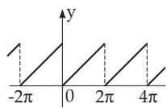

$$
y = \pi - 2 \left( { \frac { \sin x } { 1 } } + { \frac { \sin 2 x } { 2 } } + { \frac { \sin 3 x } { 3 } } + \cdots \right)
$$

2. $y = x \mathrm { f o r } 0 { \le } x \le \pi$

y = 2π x for $\pi < x \le 2 \pi$


$$
y = { \frac { \pi } { 2 } } - { \frac { 4 } { \pi } } \left( \cos x + { \frac { \cos 3 x } { 3 ^ { 2 } } } + { \frac { \cos 5 x } { 5 ^ { 2 } } } + \cdots \right)
$$

3. $y = x { \mathrm { ~ f o r ~ } } - \pi < x < \pi$

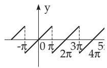

$$
y = 2 \left( { \frac { \sin x } { 1 } } - { \frac { \sin 2 x } { 2 } } + { \frac { \sin 3 x } { 3 } } - \cdots \right)
$$

4. $y = x { \mathrm { ~ f o r - } } { \frac { \pi } { 2 } } \leq x \leq { \frac { \pi } { 2 } }$

$$
y = \pi - x \mathrm { f o r } \frac { \pi } { 2 } \leq x \leq \frac { 3 \pi } { 2 }
$$

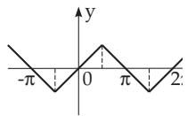

$$
y = { \frac { 4 } { \pi } } \left( \sin x - { \frac { \sin 3 x } { 3 ^ { 2 } } } + { \frac { \sin 5 x } { 5 ^ { 2 } } } - \cdots \right)
$$

5. $y = a \mathrm { f o r } 0 < x < \pi$

y = a for $\pi < x < 2 \pi$


$$
y = { \frac { 4 a } { \pi } } \left( \sin x + { \frac { \sin 3 x } { 3 } } + { \frac { \sin 5 x } { 5 } } + \cdots \right)
$$

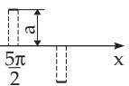

6. $y = 0$ for $0 \leq x < \alpha$ and for $\pi - \alpha < x \leq \pi + \alpha \mathrm { a n d } 2 \pi - \alpha < x \leq 2 \pi$

y = a for $\alpha < x < \pi - \alpha$

y = a for π + α < x 2π α


$$
y = { \frac { 4 a } { \pi } } \left( \cos \alpha \sin x + { \frac { 1 } { 3 } } \cos 3 \alpha \sin 3 x \right.
$$

<sup>1</sup><sub>5</sub> cos 5α sin 5x + · · ·

7. $y = { \frac { a x } { \alpha } } { \mathrm { ~ f o r } } - a \leq x \leq a$

$$
y = a \mathrm { f o r } \alpha \leq x \leq \pi - \alpha
$$

$$
y = { \frac { a ( \pi - x ) } { \alpha } } \operatorname { f o r } \pi - \alpha \leq x \leq \pi + \alpha
$$

$$
y = { \frac { 4 } { \pi } } { \frac { a } { \alpha } } \left( \sin \alpha \sin x + { \frac { 1 } { 3 ^ { 2 } } } \sin 3 \alpha \sin 3 x \right.
$$

$$
y = - a { \mathrm { ~ f o r ~ } } \pi + \alpha \leq x \leq 2 \pi - \alpha
$$

$$
+ { \frac { 1 } { 5 ^ { 2 } } } \sin 5 \alpha \sin 5 x + \cdot \cdot \cdot \cdot )
$$


Especially, for $\alpha = \frac { \pi } { 3 }$ holds: <sub>y = 6</sub>√<sub>3a</sub> sin x <sup>1</sup>2 <sup>sin</sup> <sup>5x</sup> <sup>+ 1</sup>2 <sup>sin</sup> <sup>7x</sup> − <sup>1</sup><sub>11</sub>2 sin 11x + · · · π<sup>2</sup>

8. $y = x ^ { 2 }$ for $- \pi \leq x \leq \pi$


$$
y = { \frac { \pi ^ { 2 } } { 3 } } - 4 \left( { \frac { \cos x } { 1 } } - { \frac { \cos 2 x } { 2 ^ { 2 } } } + { \frac { \cos 3 x } { 3 ^ { 2 } } } - \cdot \cdot \cdot \right)
$$

9. $y = x ( \pi - x ) { \mathrm { ~ f o r ~ } } 0 \leq x \leq \pi$

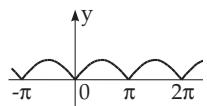

$$
y = { \frac { \pi ^ { 2 } } { 6 } } - \left( { \frac { \cos 2 x } { 1 ^ { 2 } } } + { \frac { \cos 4 x } { 2 ^ { 2 } } } + { \frac { \cos 6 x } { 3 ^ { 2 } } } + \cdots \right)
$$

10. $y = x ( \pi - x ) { \mathrm { ~ f o r ~ } } 0 \leq x \leq \pi$

$$
y = ( \pi - x ) ( 2 \pi - x ) \ \mathrm { f o r } \ \pi \leq x \leq 2 \pi
$$


$$
y = { \frac { 8 } { \pi } } \left( \sin x + { \frac { 1 } { 3 ^ { 3 } } } \sin 3 x + { \frac { 1 } { 5 ^ { 3 } } } \sin 5 x + \cdots \right)
$$

11. $y = \sin x$ for $0 \leq x \leq \pi$

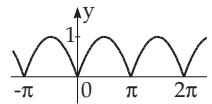

$$
y = { \frac { 2 } { \pi } } - { \frac { 4 } { \pi } } \left( { \frac { \cos 2 x } { 1 \cdot 3 } } + { \frac { \cos 4 x } { 3 \cdot 5 } } + { \frac { \cos 6 x } { 5 \cdot 7 } } + \cdots \right)
$$

12. $y = \cos x$ for $0 < x < \pi$


$$
y = { \frac { 4 } { \pi } } \left( { \frac { 2 \sin 2 x } { 1 \cdot 3 } } + { \frac { 4 \sin 4 x } { 3 \cdot 5 } } + { \frac { 6 \sin 6 x } { 5 \cdot 7 } } + \cdots \right)
$$

13. $y = \sin x$ for $0 \leq x \leq \pi$

y = 0 for $\pi \leq x \leq 2 \pi$


$$
\begin{array} { r } { y = { \frac { 1 } { \pi } } + { \frac { 1 } { 2 } } \sin x - { \frac { 2 } { \pi } } \left( { \frac { \cos 2 x } { 1 \cdot 3 } } + { \frac { \cos 4 x } { 3 \cdot 5 } } \right. } \\ { \left. + { \frac { \cos 6 x } { 5 \cdot 7 } } + \cdot \cdot \cdot \right) } \end{array}
$$

14. $y = \cos u x { \mathrm { ~ f o r ~ } } - \pi \leq x \leq \pi$

$$
y = { \frac { 2 u \sin u \pi } { \pi } } \left[ { \frac { 1 } { 2 u ^ { 2 } } } - { \frac { \cos x } { u ^ { 2 } - 1 } } + { \frac { \cos 2 x } { u ^ { 2 } - 4 } } - { \frac { \cos 3 x } { u ^ { 2 } - 9 } } + \cdot \cdot \cdot \right]
$$

(u arbitrary, but not integer number)

15. $y = \sin u x { \mathrm { ~ f o r ~ } } - \pi < x < \pi$

$$
y = { \frac { 2 \sin u \pi } { \pi } } \left( { \frac { \sin x } { 1 - u ^ { 2 } } } - { \frac { 2 \sin 2 x } { 4 - u ^ { 2 } } } + { \frac { 3 \sin 3 x } { 9 - u ^ { 2 } } } + \cdot \cdot \cdot \right)
$$

(u arbitrary, but not integer number)

16. $y = x \cos x { \mathrm { f o r } } - \pi < x < \pi$

$$
y = - { \frac { 1 } { 2 } } \sin x + { \frac { 4 \sin 2 x } { 2 ^ { 2 } - 1 } } - { \frac { 6 \sin 3 x } { 3 ^ { 2 } - 1 } } + { \frac { 8 \sin 4 x } { 4 ^ { 2 } - 1 } } - \cdots
$$

17. $y = - \ln \left( 2 \sin { \frac { x } { 2 } } \right) { \mathrm { f o r ~ } } 0 < x \leq \pi$

$$
y = \cos x + { \frac { 1 } { 2 } } \cos 2 x + { \frac { 1 } { 3 } } \cos 3 x + \cdot \cdot \cdot
$$

18. $y = \ln \left( 2 \cos { \frac { x } { 2 } } \right) { \mathrm { f o r ~ } } 0 \leq x < \pi$

$$
y = \cos x - { \frac { 1 } { 2 } } \cos 2 x + { \frac { 1 } { 3 } } \cos 3 x - \cdot \cdot \cdot
$$

19. $y = { \frac { 1 } { 2 } } \ln \cot { \frac { x } { 2 } } \mathrm { f o r } 0 < x < \pi$

$$
y = \cos x + { \frac { 1 } { 3 } } \cos 3 x + { \frac { 1 } { 5 } } \cos 5 x + \cdot \cdot \cdot
$$

21.7 Indefinite Integrals

(For instructions on using these tables see 8.1.1.2, 2., p. 482).

21.7.1 Integral Rational Functions

21.7.1.1 Integrals with $X = a x + b$

$$
\boxed { \mathrm { N o t a t i o n } ; X = a x + b }
$$

1. $\int X ^ { n } d x = { \frac { 1 } { a ( n + 1 ) } } X ^ { n + 1 } \qquad ( n \neq - 1 ) ;$

$$
( \mathrm { f o r } n = - 1 \quad \mathrm { s e e } \mathrm { N o } . 2 ) .
$$

2. $\int { \frac { d x } { X } } = { \frac { 1 } { a } } \ln X .$

3. $\int x X ^ { n } d x = { \frac { 1 } { a ^ { 2 } ( n + 2 ) } } X ^ { n + 2 } - { \frac { b } { a ^ { 2 } ( n + 1 ) } } X ^ { n + 1 }$

$$
( n \neq - 1 , \neq - 2 ) ; \qquad ( \mathrm { f o r } \ n = - 1 , = - 2 \quad \mathrm { s e e } \ N o . \ 5 \ \mathrm { u n d } \ 6 ) .
$$

$$
4 . \int x ^ { m } X ^ { n } d x = { \frac { 1 } { a ^ { m + 1 } } } \int ( X - b ) ^ { m } X ^ { n } d X \qquad ( n \neq - 1 , \neq - 2 , \ldots , \neq - m ) .
$$

The integral is used for $m < n$ or for integer m and fractional $n ;$ in these cases $( X - b ) ^ { m }$ is expanded by the binomial theorem (see 1.1.6.4, p. 12).

5 $\int { \frac { x d x } { X } } = { \frac { x } { a } } - { \frac { b } { a ^ { 2 } } } \ln X .$

6. $\int { \frac { x d x } { X ^ { 2 } } } = { \frac { b } { a ^ { 2 } X } } + { \frac { 1 } { a ^ { 2 } } } \ln X .$

7. $\int { \frac { x d x } { X ^ { 3 } } } = { \frac { 1 } { a ^ { 2 } } } \left( - { \frac { 1 } { X } } + { \frac { b } { 2 X ^ { 2 } } } \right)$

$$
8 . \ \int { \frac { x d x } { X ^ { n } } } = { \frac { 1 } { a ^ { 2 } } } \left( { \frac { - 1 } { ( n - 2 ) X ^ { n - 2 } } } + { \frac { b } { ( n - 1 ) X ^ { n - 1 } } } \right) \qquad ( n \neq 1 , \neq 2 ) .
$$

$$
9 . \int { \frac { x ^ { 2 } d x } { X } } = { \frac { 1 } { a ^ { 3 } } } \left( { \frac { 1 } { 2 } } X ^ { 2 } - 2 b X + b ^ { 2 } \ln X \right)
$$

$$
{ \bf 1 0 } . \int { \frac { x ^ { 2 } d x } { X ^ { 2 } } } = { \frac { 1 } { a ^ { 3 } } } \left( X - 2 b \ln X - { \frac { b ^ { 2 } } { X } } \right) .
$$

$$
{ \bf 1 1 . } \ \int { \frac { x ^ { 2 } d x } { X ^ { 3 } } } = { \frac { 1 } { a ^ { 3 } } } \left( \ln X + { \frac { 2 b } { X } } - { \frac { b ^ { 2 } } { 2 X ^ { 2 } } } \right) .
$$

$$
1 2 . \ \int { \frac { x ^ { 2 } d x } { X ^ { n } } } = { \frac { 1 } { a ^ { 3 } } } \left[ { \frac { - 1 } { ( n - 3 ) X ^ { n - 3 } } } + { \frac { 2 b } { ( n - 2 ) X ^ { n - 2 } } } - { \frac { b ^ { 2 } } { ( n - 1 ) X ^ { n - 1 } } } \right] \qquad ( n \neq 1 , \neq 2 , \neq 3 ) .
$$

$$
1 3 . \ \int { \frac { x ^ { 3 } d x } { X } } = { \frac { 1 } { a ^ { 4 } } } \left( { \frac { X ^ { 3 } } { 3 } } - { \frac { 3 b X ^ { 2 } } { 2 } } + 3 b ^ { 2 } X - b ^ { 3 } \ln X \right) .
$$

14. $\int { \frac { x ^ { 3 } d x } { X ^ { 2 } } } = { \frac { 1 } { a ^ { 4 } } } \left( { \frac { X ^ { 2 } } { 2 } } - 3 b X + 3 b ^ { 2 } \ln X + { \frac { b ^ { 3 } } { X } } \right)$

15. $\int { \frac { x ^ { 3 } d x } { X ^ { 3 } } } = { \frac { 1 } { a ^ { 4 } } } \left( X - 3 b \ln X - { \frac { 3 b ^ { 2 } } { X } } + { \frac { b ^ { 3 } } { 2 X ^ { 2 } } } \right)$

16. $\int { \frac { x ^ { 3 } d x } { X ^ { 4 } } } = { \frac { 1 } { a ^ { 4 } } } \left( \ln X + { \frac { 3 b } { X } } - { \frac { 3 b ^ { 2 } } { 2 X ^ { 2 } } } + { \frac { b ^ { 3 } } { 3 X ^ { 3 } } } \right)$

$$
\int { \frac { x ^ { 3 } d x } { X ^ { n } } } = { \frac { 1 } { a ^ { 4 } } } \left[ { \frac { - 1 } { ( n - 4 ) X ^ { n - 4 } } } + { \frac { 3 b } { ( n - 3 ) X ^ { n - 3 } } } - { \frac { 3 b ^ { 2 } } { ( n - 2 ) X ^ { n - 2 } } } + { \frac { b ^ { 3 } } { ( n - 1 ) X ^ { n - 1 } } } \right]
$$

$$
( n \neq 1 , \neq 2 , \neq 3 , \neq 4 ) .
$$

18. $\int { \frac { d x } { x X } } = - { \frac { 1 } { b } } \ln { \frac { X } { x } } .$

19. $\int { \frac { d x } { x X ^ { 2 } } } = - { \frac { 1 } { b ^ { 2 } } } \left( \ln { \frac { X } { x } } + { \frac { a x } { X } } \right)$

20. $\int { \frac { d x } { x X ^ { 3 } } } = - { \frac { 1 } { b ^ { 3 } } } \left( \ln { \frac { X } { x } } + { \frac { 2 a x } { X } } - { \frac { a ^ { 2 } x ^ { 2 } } { 2 X ^ { 2 } } } \right)$

21. $\int { \frac { d x } { x X ^ { n } } } = - { \frac { 1 } { b ^ { n } } } \left[ \ln { \frac { X } { x } } - \sum _ { i = 1 } ^ { n - 1 } { \binom { n - 1 } { i } } { \frac { ( - a ) ^ { i } x ^ { i } } { i X ^ { i } } } \right] \qquad ( n \geq 1 ) .$

22. $\int { \frac { d x } { x ^ { 2 } X } } = - { \frac { 1 } { b x } } + { \frac { a } { b ^ { 2 } } } \ln { \frac { X } { x } } .$

23. $\int { \frac { d x } { x ^ { 2 } X ^ { 2 } } } = - a \left[ { \frac { 1 } { b ^ { 2 } X } } + { \frac { 1 } { a b ^ { 2 } x } } - { \frac { 2 } { b ^ { 3 } } } \ln { \frac { X } { x } } \right] .$

24. $\int { \frac { d x } { x ^ { 2 } X ^ { 3 } } } = - a \left[ { \frac { 1 } { 2 b ^ { 2 } X ^ { 2 } } } + { \frac { 2 } { b ^ { 3 } X } } + { \frac { 1 } { a b ^ { 3 } x } } - { \frac { 3 } { b ^ { 4 } } } \ln { \frac { X } { x } } \right] .$

dx 1 n n ( a)<sup>i</sup>x<sup>i</sup>−<sup>1</sup> <sup>X</sup> na ln <sup>X</sup> 25. + (n  2). x<sup>2</sup>X<sup>n</sup> b<sup>n+1</sup> <sub>i=2</sub> i (i 1)X<sup>i</sup>−<sup>1</sup> x x

26. $\int { \frac { d x } { x ^ { 3 } X } } = - { \frac { 1 } { b ^ { 3 } } } \left[ a ^ { 2 } \ln { \frac { X } { x } } - { \frac { 2 a X } { x } } + { \frac { X ^ { 2 } } { 2 x ^ { 2 } } } \right] ,$

$$
\int { \frac { d x } { x ^ { 3 } X ^ { 2 } } } = - { \frac { 1 } { b ^ { 4 } } } \left[ 3 a ^ { 2 } \ln { \frac { X } { x } } + { \frac { a ^ { 3 } x } { X } } + { \frac { X ^ { 2 } } { 2 x ^ { 2 } } } - { \frac { 3 a X } { x } } \right] .
$$

dx 1 6a2 ln <sup>X</sup> <sub>+</sub> 4a<sup>3</sup>x a<sup>4</sup>x<sup>2</sup> <sub>+</sub> X<sup>2</sup> 4aX 28. = x<sup>3</sup>X<sup>3</sup> b<sup>5</sup> X 2X<sup>2</sup> 2x<sup>2</sup> . x x

$$
\int { \frac { d x } { x ^ { 3 } X ^ { n } } } = - { \frac { 1 } { b ^ { n + 2 } } } \bigg [ - \sum _ { i = 3 } ^ { n + 1 } \binom { n + 1 } { i } { \frac { ( - a ) ^ { i } x ^ { i - 2 } } { ( i - 2 ) X ^ { i - 2 } } } + { \frac { a ^ { 2 } X ^ { 2 } } { 2 x ^ { 2 } } } - { \frac { ( n + 1 ) a X } { x } } \bigg ]
$$

$$
+ \frac { n ( n + 1 ) a ^ { 2 } } { 2 } \ln \frac { X } { x } \biggr ] \qquad ( n \geq 3 ) .
$$

30. $\int { \frac { d x } { x ^ { m } X ^ { n } } } = - { \frac { 1 } { b ^ { m + n - 1 } } } \sum _ { i = 0 } ^ { m + n - 2 } { \binom { m + n - 2 } { i } } { \frac { X ^ { m - i - 1 } ( - a ) ^ { i } } { ( m - i - 1 ) x ^ { m - i - 1 } } } .$

If the denominators of the terms behind the sum vanish, then such terms should be replaced by

$$
{ \binom { m + n - 2 } { m - 1 } } ( - a ) ^ { m - 1 } \ln { \frac { X } { x } } .
$$

$$
\left\lceil \mathrm { N o t a t i o n } \colon \Delta = b f - a g \right\rceil
$$

31. $\int { \frac { a x + b } { f x + g } } d x = { \frac { a x } { f } } + { \frac { \Delta } { f ^ { 2 } } } \ln ( f x + g ) .$

$$
3 2 . \int { \frac { d x } { ( a x + b ) ( f x + g ) } } = { \frac { 1 } { \Delta } } \ln { \frac { f x + g } { a x + b } } \qquad ( \Delta \neq 0 ) .
$$

$$
3 3 . \ \int { \frac { x d x } { ( a x + b ) ( f x + g ) } } = { \frac { 1 } { \Delta } } \left[ { \frac { b } { a } } \ln ( a x + b ) - { \frac { g } { f } } \ln ( f x + g ) \right] \qquad ( \Delta \neq 0 ) .
$$

$$
3 4 . \ \int { \frac { d x } { ( a x + b ) ^ { 2 } ( f x + g ) } } = { \frac { 1 } { \Delta } } \left( { \frac { 1 } { a x + b } } + { \frac { f } { \Delta } } \ln { \frac { f x + g } { a x + b } } \right) \qquad ( \Delta \neq 0 ) .
$$

$$
3 5 . \ \int { \frac { x d x } { ( a + x ) ( b + x ) ^ { 2 } } } = { \frac { b } { ( a - b ) ( b + x ) } } - { \frac { a } { ( a - b ) ^ { 2 } } } \ln { \frac { a + x } { b + x } } \qquad ( a \neq b ) .
$$

$$
3 6 . \ \int { \frac { x ^ { 2 } d x } { ( a + x ) ( b + x ) ^ { 2 } } } = { \frac { b ^ { 2 } } { ( b - a ) ( b + x ) } } + { \frac { a ^ { 2 } } { ( b - a ) ^ { 2 } } } \ln ( a + x ) + { \frac { b ^ { 2 } - 2 a b } { ( b - a ) ^ { 2 } } } \ln ( b + x ) \qquad ( a \neq b ) .
$$

$$
3 8 . \ \int { \frac { x d x } { ( a + x ) ^ { 2 } ( b + x ) ^ { 2 } } } = { \frac { 1 } { ( a - b ) ^ { 2 } } } \left( { \frac { a } { a + x } } + { \frac { b } { b + x } } \right) - { \frac { a + b } { ( a - b ) ^ { 3 } } } \ln { \frac { a + x } { b + x } }
$$

$$
3 9 . \int { \frac { x ^ { 2 } d x } { ( a + x ) ^ { 2 } ( b + x ) ^ { 2 } } } = { \frac { - 1 } { ( a - b ) ^ { 2 } } } \left( { \frac { a ^ { 2 } } { a + x } } + { \frac { b ^ { 2 } } { b + x } } \right) + { \frac { 2 a b } { ( a - b ) ^ { 3 } } } \ln { \frac { a + x } { b + x } } \qquad ( a \neq b ) .
$$

21.7.1.2 Integrals with $X = a x ^ { 2 } + b x + c$

$$
\boxed { \mathrm { N o t a t i o n } ; \ X = a x ^ { 2 } + b x + c ; \ \Delta = 4 a c - b ^ { 2 } }
$$

$$
\begin{array} { r l r } { \int { \frac { d x } { X } } = { \frac { 2 } { \sqrt { \Delta } } } \arctan { \frac { 2 a x + b } { \sqrt { \Delta } } } } & { } & { ( \mathrm { f o r } ~ \Delta > 0 ) , } \\ { = - { \frac { 2 } { \sqrt { - \Delta } } } \operatorname { A r t a n h } { \frac { 2 a x + b } { \sqrt { - \Delta } } } } & { } & { ( \mathrm { f o r } ~ \Delta < 0 ) , } \\ { = { \frac { 1 } { \sqrt { - \Delta } } } \ln { \frac { 2 a x + b - \sqrt { - \Delta } } { 2 a x + b + \sqrt { - \Delta } } } } & { } & { ( \mathrm { f o r } ~ \Delta < 0 ) . } \end{array}
$$

$$
4 1 . \int { \frac { d x } { X ^ { 2 } } } = { \frac { 2 a x + b } { \Delta X } } + { \frac { 2 a } { \Delta } } \int { \frac { d x } { X } }\tag{see No. 40).}
$$

$$
4 2 . \ \int { \frac { d x } { X ^ { 3 } } } = { \frac { 2 a x + b } { \Delta } } \left( { \frac { 1 } { 2 X ^ { 2 } } } + { \frac { 3 a } { \Delta X } } \right) + { \frac { 6 a ^ { 2 } } { \Delta ^ { 2 } } } \int { \frac { d x } { X } }\tag{see No. 40).}
$$

$$
4 3 . \ \int { \frac { d x } { X ^ { n } } } = { \frac { 2 a x + b } { ( n - 1 ) \Delta X ^ { n - 1 } } } + { \frac { ( 2 n - 3 ) 2 a } { ( n - 1 ) \Delta } } \int { \frac { d x } { X ^ { n - 1 } } } .
$$

$$
4 4 . \ \int { \frac { x d x } { X } } = { \frac { 1 } { 2 a } } \ln X - { \frac { b } { 2 a } } \int { \frac { d x } { X } }\tag{see No. 40).}
$$

$$
4 5 . \int { \frac { x d x } { X ^ { 2 } } } = - { \frac { b x + 2 c } { \Delta X } } - { \frac { b } { \Delta } } \int { \frac { d x } { X } }\tag{see No. 40).}
$$

$$
4 6 . \ \int { \frac { x d x } { X ^ { n } } } = - { \frac { b x + 2 c } { ( n - 1 ) \Delta X ^ { n - 1 } } } - { \frac { b ( 2 n - 3 ) } { ( n - 1 ) \Delta } } \int { \frac { d x } { X ^ { n - 1 } } } .
$$

$$
4 7 . \int { \frac { x ^ { 2 } d x } { X } } = { \frac { x } { a } } - { \frac { b } { 2 a ^ { 2 } } } \ln X + { \frac { b ^ { 2 } - 2 a c } { 2 a ^ { 2 } } } \int { \frac { d x } { X } }\tag{see No. 40).}
$$

$$
4 8 . \int { \frac { x ^ { 2 } d x } { X ^ { 2 } } } = { \frac { ( b ^ { 2 } - 2 a c ) x + b c } { a \Delta X } } + { \frac { 2 c } { \Delta } } \int { \frac { d x } { X } }\tag{see No. 40).}
$$

$$
4 9 . \ \int { \frac { x ^ { 2 } d x } { X ^ { n } } } = { \frac { - x } { ( 2 n - 3 ) a X ^ { n - 1 } } } + { \frac { c } { ( 2 n - 3 ) a } } \int { \frac { d x } { X ^ { n } } } - { \frac { ( n - 2 ) b } { ( 2 n - 3 ) a } } \int { \frac { x d x } { X ^ { n } } }\tag{see No. 43 and 46).}
$$

$$
5 0 . \ \int { \frac { x ^ { m } d x } { X ^ { n } } } = - { \frac { x ^ { m - 1 } } { ( 2 n - m - 1 ) a X ^ { n - 1 } } } + { \frac { ( m - 1 ) c } { ( 2 n - m - 1 ) a } } \int { \frac { x ^ { m - 2 } d x } { X ^ { n } } }
$$

$$
\qquad - { \frac { ( n - m ) b } { ( 2 n - m - 1 ) a } } \int { \frac { x ^ { m - 1 } d x } { X ^ { n } } } \qquad ( m \neq 2 n - 1 ) ; \qquad \quad ( { \mathrm { f o r ~ } } m = 2 n - 1 \operatorname { s e e } \mathrm { ~ N o } . 5 1 ) .
$$

$$
{ \bf 5 1 . } \ \int \frac { x ^ { 2 n - 1 } d x } { X ^ { n } } = \frac { 1 } { a } \int \frac { x ^ { 2 n - 3 } d x } { X ^ { n - 1 } } - \frac { c } { a } \int \frac { x ^ { 2 n - 3 } d x } { X ^ { n } } - \frac { b } { a } \int \frac { x ^ { 2 n - 2 } d x } { X ^ { n } } .
$$

$$
{ \bf 5 2 . } { \int } \frac { d x } { x X } = \frac { 1 } { 2 c } \ln \frac { x ^ { 2 } } { X } - \frac { b } { 2 c } { \int } \frac { d x } { X }\tag{see No. 40).}
$$

$$
{ \bf 5 3 . } \ \int { \frac { d x } { x X ^ { n } } } = { \frac { 1 } { 2 c ( n - 1 ) X ^ { n - 1 } } } - { \frac { b } { 2 c } } \int { \frac { d x } { X ^ { n } } } + { \frac { 1 } { c } } \int { \frac { d x } { x X ^ { n - 1 } } } .
$$

$$
{ \mathfrak { s } } 4 . \ \int { \frac { \ d x } { x ^ { 2 } X } } = { \frac { b } { 2 c ^ { 2 } } } \ln { \frac { X } { x ^ { 2 } } } - { \frac { 1 } { c x } } + \left( { \frac { b ^ { 2 } } { 2 c ^ { 2 } } } - { \frac { a } { c } } \right) \int { \frac { d x } { X } }\tag{see No. 40).}
$$

$$
5 5 . \ \int { \frac { \ d x } { x ^ { m } X ^ { n } } } = - { \frac { 1 } { ( m - 1 ) c x ^ { m - 1 } X ^ { n - 1 } } } - { \frac { ( 2 n + m - 3 ) a } { ( m - 1 ) c } } \int { \frac { \ d x } { x ^ { m - 2 } X ^ { n } } }
$$

$$
- { \frac { ( n + m - 2 ) b } { ( m - 1 ) c } } \int { \frac { d x } { x ^ { m - 1 } X ^ { n } } } \qquad ( m > 1 ) .
$$

$$
{ \bf 5 6 . } \ \int { \frac { d x } { ( f x + g ) X } } = { \frac { 1 } { 2 ( c f ^ { 2 } - g b f + g ^ { 2 } a ) } } \left[ f \ln { \frac { ( f x + g ) ^ { 2 } } { X } } \right]
$$

$$
+ \frac { 2 g a - b f } { 2 ( c f ^ { 2 } - g b f + g ^ { 2 } a ) } \int \frac { d x } { X } \qquad ( \mathrm { s e e ~ N o . ~ } 4 0 ) .
$$

21.7.1.3 Integrals with $X = a ^ { 2 } \pm x ^ { 2 }$

Notation: $X = a ^ { 2 } \pm x ^ { 2 } ,$

$$
Y = \left\{ \begin{array} { l l } { \arctan { \frac { x } { a } } \mathrm { ~ f o r ~ t h e ~ } ^ { \omega } + ^ { \prime } \mathrm { ~ s i g n } , } \\ { \operatorname { A r t a n h } { \frac { x } { a } } = { \frac { 1 } { 2 } } \ln { \frac { a + x } { a - x } } \mathrm { ~ f o r ~ t h e ~ } ^ { \omega } - ^ { \prime } \mathrm { ~ s i g n ~ a n d ~ } | x | < a , } \\ { \operatorname { A r c o t h } { \frac { x } { a } } = { \frac { 1 } { 2 } } \ln { \frac { x + a } { x - a } } \mathrm { ~ f o r ~ t h e ~ } ^ { \omega } - ^ { \prime } \mathrm { ~ s i g n ~ a n d ~ } | x | > a . } \end{array} \right.
$$

If there is a double sign in a formula, then the upper one belongs to $X = a ^ { 2 } + x ^ { 2 }$ and the lower one to $\overset { \cdot } { X } = a ^ { 2 } - x ^ { 2 } , \overset { \cdot } { a } > 0 .$

57. $\int { \frac { d x } { X } } = { \frac { 1 } { a } } Y .$

58. $\int { \frac { d x } { X ^ { 2 } } } = { \frac { x } { 2 a ^ { 2 } X } } + { \frac { 1 } { 2 a ^ { 3 } } } Y .$

59. $\int { \frac { d x } { X ^ { 3 } } } = { \frac { x } { 4 a ^ { 2 } X ^ { 2 } } } + { \frac { 3 x } { 8 a ^ { 4 } X } } + { \frac { 3 } { 8 a ^ { 5 } } } Y .$

60. $\int { \frac { d x } { X ^ { n + 1 } } } = { \frac { x } { 2 n a ^ { 2 } X ^ { n } } } + { \frac { 2 n - 1 } { 2 n a ^ { 2 } } } \int { \frac { d x } { X ^ { n } } } .$

61. $\int { \frac { x d x } { X } } = \pm { \frac { 1 } { 2 } } \ln X .$

62. $\int { \frac { x d x } { X ^ { 2 } } } = \mp { \frac { 1 } { 2 X } } .$

63. $\int { \frac { x d x } { X ^ { 3 } } } = \mp { \frac { 1 } { 4 X ^ { 2 } } } .$

64. $\int { \frac { x d x } { X ^ { n + 1 } } } = \mp { \frac { 1 } { 2 n X ^ { n } } } \qquad ( n \neq 0 ) .$

65. $\int { \frac { x ^ { 2 } d x } { X } } = \pm x \mp a Y .$

66. $\int { \frac { x ^ { 2 } d x } { X ^ { 2 } } } = \mp { \frac { x } { 2 X } } \pm { \frac { 1 } { 2 a } } Y .$

67. $\int { \frac { x ^ { 2 } d x } { X ^ { 3 } } } = \mp { \frac { x } { 4 X ^ { 2 } } } \pm { \frac { x } { 8 a ^ { 2 } X } } \pm { \frac { 1 } { 8 a ^ { 3 } } } Y .$

68. $\int { \frac { x ^ { 2 } d x } { X ^ { n + 1 } } } = \mp { \frac { x } { 2 n X ^ { n } } } \pm { \frac { 1 } { 2 n } } \int { \frac { d x } { X ^ { n } } } \qquad ( n \neq 0 )$

69. $\int { \frac { x ^ { 3 } d x } { X } } = \pm { \frac { x ^ { 2 } } { 2 } } - { \frac { a ^ { 2 } } { 2 } } \ln X .$

70. $\int \frac { x ^ { 3 } d x } { X ^ { 2 } } = \frac { a ^ { 2 } } { 2 X } + \frac { 1 } { 2 } \ln X .$

71. $\int { \frac { x ^ { 3 } d x } { X ^ { 3 } } } = - { \frac { 1 } { 2 X } } + { \frac { a ^ { 2 } } { 4 X ^ { 2 } } }$

72. $\int { \frac { x ^ { 3 } d x } { X ^ { n + 1 } } } = - { \frac { 1 } { 2 ( n - 1 ) X ^ { n - 1 } } } + { \frac { a ^ { 2 } } { 2 n X ^ { n } } } \qquad ( n > 1 ) .$

73. $\int { \frac { d x } { x X } } = { \frac { 1 } { 2 a ^ { 2 } } } \ln { \frac { x ^ { 2 } } { X } } .$

74. $\int { \frac { d x } { x X ^ { 2 } } } = { \frac { 1 } { 2 a ^ { 2 } X } } + { \frac { 1 } { 2 a ^ { 4 } } } \ln { \frac { x ^ { 2 } } { X } } .$

75. $\int { \frac { d x } { x X ^ { 3 } } } = { \frac { 1 } { 4 a ^ { 2 } X ^ { 2 } } } + { \frac { 1 } { 2 a ^ { 4 } X } } + { \frac { 1 } { 2 a ^ { 6 } } } \ln { \frac { x ^ { 2 } } { X } } .$

76. $\int { \frac { d x } { x ^ { 2 } X } } = - { \frac { 1 } { a ^ { 2 } x } } \mp { \frac { 1 } { a ^ { 3 } } } Y .$

$$
{ \sf 7 7 . } \int \frac { d x } { x ^ { 2 } X ^ { 2 } } = - \frac { 1 } { a ^ { 4 } x } \mp \frac { x } { 2 a ^ { 4 } X } \mp \frac { 3 } { 2 a ^ { 5 } } Y .
$$

$$
{ \bf 7 8 . } \int { \frac { d x } { x ^ { 2 } X ^ { 3 } } } = - { \frac { 1 } { a ^ { 6 } x } } \mp { \frac { x } { 4 a ^ { 4 } X ^ { 2 } } } \mp { \frac { 7 x } { 8 a ^ { 6 } X } } \mp { \frac { 1 5 } { 8 a ^ { 7 } } } Y .
$$

$$
{ \bf 7 9 . } { \int } \frac { d x } { x ^ { 3 } X } = - \frac { 1 } { 2 a ^ { 2 } x ^ { 2 } } \mp \frac { 1 } { 2 a ^ { 4 } } \ln \frac { x ^ { 2 } } { X } .
$$

$$
8 0 . \ \int { \frac { d x } { x ^ { 3 } X ^ { 2 } } } = - { \frac { 1 } { 2 a ^ { 4 } x ^ { 2 } } } \mp { \frac { 1 } { 2 a ^ { 4 } X } } \mp { \frac { 1 } { a ^ { 6 } } } \ln { \frac { x ^ { 2 } } { X } } .
$$

$$
{ \bf 8 1 . } \ \int { \frac { d x } { x ^ { 3 } X ^ { 3 } } } = - { \frac { 1 } { 2 a ^ { 6 } x ^ { 2 } } } \mp { \frac { 1 } { a ^ { 6 } X } } \mp { \frac { 1 } { 4 a ^ { 4 } X ^ { 2 } } } \mp { \frac { 3 } { 2 a ^ { 8 } } } \ln { \frac { x ^ { 2 } } { X } } .
$$

82. $\int { \frac { d x } { ( b + c x ) X } } = { \frac { 1 } { a ^ { 2 } c ^ { 2 } \pm b ^ { 2 } } } \left[ c \ln ( b + c x ) - { \frac { c } { 2 } } \ln X \pm { \frac { b } { a } } Y \right] .$

21.7.1.4 Integrals with $X = a ^ { 3 } \pm x ^ { 3 }$

Notation: $a ^ { 3 } \pm x ^ { 3 } = X$ ; if there is a double sign in a formula, the upper sign belongs to $X = a ^ { 3 } + x ^ { 3 }$ , the lower one to $X = a ^ { 3 } - \dot { x } ^ { 3 }$

$$
{ 8 } { 3 } . \ \int { \frac { d x } { X } } = \pm { \frac { 1 } { 6 a ^ { 2 } } } \ln { \frac { ( a \pm x ) ^ { 2 } } { a ^ { 2 } \mp a x + x ^ { 2 } } } + { \frac { 1 } { a ^ { 2 } { \sqrt { 3 } } } } \arctan { \frac { 2 x \mp a } { a { \sqrt { 3 } } } } .
$$

$$
8 4 . \int { \frac { d x } { X ^ { 2 } } } = { \frac { x } { 3 a ^ { 3 } X } } + { \frac { 2 } { 3 a ^ { 3 } } } \int { \frac { d x } { X } }\tag{see No. 83).}
$$

$$
{ 8 5 . } \ \int { \frac { x d x } { X } } = { \frac { 1 } { 6 a } } \ln { \frac { a ^ { 2 } \mp a x + x ^ { 2 } } { ( a \pm x ) ^ { 2 } } } \pm { \frac { 1 } { a { \sqrt { 3 } } } } \arctan { \frac { 2 x \mp a } { a { \sqrt { 3 } } } } .
$$

$$
{ \bf 8 6 . } { \int } \frac { x d x } { X ^ { 2 } } = \frac { x ^ { 2 } } { 3 a ^ { 3 } X } + \frac { 1 } { 3 a ^ { 3 } } { \int } \frac { x d x } { X }\tag{see No. 85).}
$$

$$
8 7 . \int { \frac { x ^ { 2 } d x } { X } } = \pm { \frac { 1 } { 3 } } \ln X .
$$

$$
8 8 . \int { \frac { x ^ { 2 } d x } { X ^ { 2 } } } = \mp { \frac { 1 } { 3 X } } .
$$

$$
8 9 . \ \int { \frac { x ^ { 3 } d x } { X } } = \pm x \mp a ^ { 3 } \int { \frac { d x } { X } }\tag{see No. 83).}
$$

$$
{ \bf 9 0 . } ~ \int { \frac { x ^ { 3 } d x } { X ^ { 2 } } } = \mp { \frac { x } { 3 X } } \pm { \frac { 1 } { 3 } } \int { \frac { d x } { X } }\tag{see No. 83).}
$$

$$
{ \bf 9 1 . } { \bf \int } { \frac { d x } { x X } } = { \frac { 1 } { 3 a ^ { 3 } } } \ln { \frac { x ^ { 3 } } { X } } .
$$

$$
{ \bf 9 2 . } { \int { \frac { d x } { x X ^ { 2 } } } } = { \frac { 1 } { 3 a ^ { 3 } X } } + { \frac { 1 } { 3 a ^ { 6 } } } \ln { \frac { x ^ { 3 } } { X } } .
$$

$$
{ \bf 9 3 . } { \int { \frac { d x } { x ^ { 2 } X } } } = - { \frac { 1 } { a ^ { 3 } x } } \mp { \frac { 1 } { a ^ { 3 } } } { \int { \frac { x d x } { X } } }\tag{see No. 85).}
$$

$$
{ \bf 9 4 . } \ \int { \frac { d x } { x ^ { 2 } X ^ { 2 } } } = - { \frac { 1 } { a ^ { 6 } x } } \mp { \frac { x ^ { 2 } } { 3 a ^ { 6 } X } } \mp { \frac { 4 } { 3 a ^ { 6 } } } \int { \frac { x d x } { X } }\tag{see No. 85).}
$$

95. $\int { \frac { d x } { x ^ { 3 } X } } = - { \frac { 1 } { 2 a ^ { 3 } x ^ { 2 } } } \mp { \frac { 1 } { a ^ { 3 } } } \int { \frac { d x } { X } }$

(see No. 83).

96. $\int { \frac { d x } { x ^ { 3 } X ^ { 2 } } } = - { \frac { 1 } { 2 a ^ { 6 } x ^ { 2 } } } \mp { \frac { x } { 3 a ^ { 6 } X } } \mp { \frac { 5 } { 3 a ^ { 6 } } } \int { \frac { d x } { X } }$

(see No. 83).

21.7.1.5 Integrals with $X = a ^ { 4 } + x ^ { 4 }$

dx 1 <sub>x</sub>2 <sub>+ ax</sub>√<sub>2 + a</sub>2 1 <sub>ax</sub>√<sub>2</sub> 97. ln + arctan a<sup>4</sup> + x<sup>4</sup> <sub>4a</sub>3√<sub>2</sub> <sub>x</sub>2 <sub>ax</sub>√<sub>2 + a</sub>2 <sub>2a</sub>3√<sub>2</sub> a<sup>2</sup> x<sup>2</sup>

98. $\int { \frac { x d x } { a ^ { 4 } + x ^ { 4 } } } = { \frac { 1 } { 2 a ^ { 2 } } } \arctan { \frac { x ^ { 2 } } { a ^ { 2 } } } .$

x<sup>2</sup> dx 1 <sub>x</sub>2 <sub>+ ax</sub>√<sub>2 + a</sub>2 1 <sub>ax</sub>√<sub>2</sub> 99. ln + arctan a<sup>4</sup> + x<sup>4</sup> <sub>4a</sub>√<sub>2</sub> <sub>x</sub>2 <sub>ax</sub>√<sub>2 + a</sub>2 <sub>2a</sub>√<sub>2</sub> a<sup>2</sup> x<sup>2</sup>

100. $\int { \frac { x ^ { 3 } d x } { a ^ { 4 } + x ^ { 4 } } } = { \frac { 1 } { 4 } } \ln ( a ^ { 4 } + x ^ { 4 } ) .$

21.7.1.6 Integrals with $X = a ^ { 4 } - x ^ { 4 }$

101. $\int { \frac { d x } { a ^ { 4 } - x ^ { 4 } } } = { \frac { 1 } { 4 a ^ { 3 } } } \ln { \frac { a + x } { a - x } } + { \frac { 1 } { 2 a ^ { 3 } } } \arctan { \frac { x } { a } } .$

102. $\int { \frac { x d x } { a ^ { 4 } - x ^ { 4 } } } = { \frac { 1 } { 4 a ^ { 3 } } } \ln { \frac { a ^ { 2 } + x ^ { 2 } } { a ^ { 2 } - x ^ { 2 } } } .$

103. $\int { \frac { x ^ { 2 } d x } { a ^ { 4 } - x ^ { 4 } } } = { \frac { 1 } { 4 a } } \ln { \frac { a + x } { a - x } } - { \frac { 1 } { 2 a } } \arctan { \frac { x } { a } } .$

104. $\int { \frac { x ^ { 3 } d x } { a ^ { 4 } - x ^ { 4 } } } = - { \frac { 1 } { 4 } } \ln ( a ^ { 4 } - x ^ { 4 } ) .$

21.7.1.7 Some Cases of Partial Fraction Decomposition

105. ${ \frac { 1 } { ( a + b x ) ( f + g x ) } } \equiv { \frac { 1 } { f b - a g } } \left( { \frac { b } { a + b x } } - { \frac { g } { f + g x } } \right)$

106. ${ \frac { 1 } { ( x + a ) ( x + b ) ( x + c ) } } \equiv { \frac { A } { x + a } } + { \frac { B } { x + b } } + { \frac { C } { x + c } } ,$ , where it holds

$$
A = { \frac { 1 } { ( b - a ) ( c - a ) } } , B = { \frac { 1 } { ( a - b ) ( c - b ) } } , C = { \frac { 1 } { ( a - c ) ( b - c ) } } .
$$

107. $\begin{array} { l } { \displaystyle \frac { 1 } { ( x + a ) ( x + b ) ( x + c ) ( x + d ) } \equiv \frac { A } { x + a } + \frac { B } { x + b } + \frac { C } { x + c } + \frac { D } { x + d } , } \\ { \displaystyle A = \frac { 1 } { ( b - a ) ( c - a ) ( d - a ) } , B = \frac { 1 } { ( a - b ) ( c - b ) ( d - b ) } \mathrm { e t c } . } \end{array}$ where it holds

108. ${ \frac { 1 } { ( a + b x ^ { 2 } ) ( f + g x ^ { 2 } ) } } \equiv { \frac { 1 } { f b - a g } } \left( { \frac { b } { a + b x ^ { 2 } } } - { \frac { g } { f + g x ^ { 2 } } } \right)$

21.7.2 Integrals ofIrrational Functions

21.7.2.1 Integrals with $\sqrt { x }$ and $a ^ { 2 } \pm b ^ { 2 } x$

Notation:

$$
| X = a ^ { 2 } \pm b ^ { 2 } x , Y = \{ \begin{array} { l l } { { \arctan \frac { b \sqrt { x } } { a } } } & { { \mathrm { f o r ~ t h e ~ s i g n ~ ^ { \alpha } + ^ { \gamma } , } } } \\ { { \displaystyle \frac { 1 } { 2 } \ln \frac { a + b \sqrt { x } } { a - b \sqrt { x } } } } & { { \mathrm { f o r ~ t h e ~ s i g n ~ ^ { \alpha } - ^ { \gamma } . } } } \end{array} 
$$

⎪⎩<sub>If there is a double sign in a formula, then the upper one</sub> belongs to $X = a ^ { 2 } + b ^ { 2 } x$ , the lower one to $X = \dot { a } ^ { 2 } - b ^ { 2 } x .$

109. $\int { \frac { { \sqrt { x } } d x } { X } } = \pm { \frac { 2 { \sqrt { x } } } { b ^ { 2 } } } \mp { \frac { 2 a } { b ^ { 3 } } } Y .$

110. $\int { \frac { { \sqrt { x ^ { 3 } } } d x } { X } } = \pm { \frac { 2 } { 3 } } { \frac { \sqrt { x ^ { 3 } } } { b ^ { 2 } } } - { \frac { 2 a ^ { 2 } { \sqrt { x } } } { b ^ { 4 } } } + { \frac { 2 a ^ { 3 } } { b ^ { 5 } } } Y .$

111. $\int { \frac { { \sqrt { x } } d x } { X ^ { 2 } } } = \mp { \frac { \sqrt { x } } { b ^ { 2 } X } } \pm { \frac { 1 } { a b ^ { 3 } } } Y .$

112. $\int { \frac { { \sqrt { x ^ { 3 } } } d x } { X ^ { 2 } } } = \pm { \frac { 2 { \sqrt { x ^ { 3 } } } } { b ^ { 2 } X } } + { \frac { 3 a ^ { 2 } { \sqrt { x } } } { b ^ { 4 } X } } - { \frac { 3 a } { b ^ { 5 } } } Y .$

113. $\int { \frac { d x } { X { \sqrt { x } } } } = { \frac { 2 } { a b } } Y .$

114. $\int { \frac { d x } { X { \sqrt { x ^ { 3 } } } } } = - { \frac { 2 } { a ^ { 2 } { \sqrt { x } } } } \mp { \frac { 2 b } { a ^ { 3 } } } Y .$

115. $\int { \frac { d x } { X ^ { 2 } { \sqrt { x } } } } = { \frac { \sqrt { x } } { a ^ { 2 } X } } + { \frac { 1 } { a ^ { 3 } b } } Y .$

116. $\int { \frac { d x } { X ^ { 2 } { \sqrt { x ^ { 3 } } } } } = - { \frac { 2 } { a ^ { 2 } X { \sqrt { x } } } } \mp { \frac { 3 b ^ { 2 } { \sqrt { x } } } { a ^ { 4 } X } } \mp { \frac { 3 b } { a ^ { 5 } } } Y .$

21.7.2.2 Other Integrals with $\sqrt { x }$

117. $\int { \frac { { \sqrt { x } } d x } { a ^ { 4 } + x ^ { 2 } } } = - { \frac { 1 } { 2 a { \sqrt { 2 } } } } \ln { \frac { x + a { \sqrt { 2 x } } + a ^ { 2 } } { x - a { \sqrt { 2 x } } + a ^ { 2 } } } + { \frac { 1 } { a { \sqrt { 2 } } } } \arctan { \frac { a { \sqrt { 2 x } } } { a ^ { 2 } - x } } .$

dx 1 <sub>x + a</sub>√<sub>2x + a</sub>2 1 <sub>a</sub>√<sub>2x</sub> 118. <sub>(a</sub>4 <sub>+</sub> <sub>x</sub>2<sub>)</sub>√<sub>x</sub> <sub>2a</sub>3√<sub>2</sub> ln <sub>x</sub>  <sub>a</sub>√<sub>2x</sub> <sub>+</sub> <sub>a</sub>2 + <sub>a</sub>3√<sub>2</sub> arctan a<sup>2</sup> x <sup>.</sup>

119. $\int { \frac { { \sqrt { x } } d x } { a ^ { 4 } - x ^ { 2 } } } = { \frac { 1 } { 2 a } } \ln { \frac { a + { \sqrt { x } } } { a - { \sqrt { x } } } } - { \frac { 1 } { a } } \arctan { \frac { \sqrt { x } } { a } } .$

120. $\int { \frac { d x } { ( a ^ { 4 } - x ^ { 2 } ) { \sqrt { x } } } } = { \frac { 1 } { 2 a ^ { 3 } } } \ln { \frac { a + { \sqrt { x } } } { a - { \sqrt { x } } } } + { \frac { 1 } { a ^ { 3 } } } \arctan { \frac { \sqrt { x } } { a } } .$

21.7.2.3 Integrals with $\sqrt { a x + b }$

$$
\boxed { \mathrm { N o t a t i o n } ; X = a x + b }
$$

121. $\int { \sqrt { X } } d x = { \frac { 2 } { 3 a } } { \sqrt { X ^ { 3 } } } .$

122. $\int x { \sqrt { X } } d x = { \frac { 2 ( 3 a x - 2 b ) { \sqrt { X ^ { 3 } } } } { 1 5 a ^ { 2 } } } .$

123. $\int x ^ { 2 } { \sqrt { X } } d x = { \frac { 2 ( 1 5 a ^ { 2 } x ^ { 2 } - 1 2 a b x + 8 b ^ { 2 } ) { \sqrt { X ^ { 3 } } } } { 1 0 5 a ^ { 3 } } } .$

124. $\int { \frac { d x } { \sqrt { X } } } = { \frac { 2 { \sqrt { X } } } { a } } .$

125. $\int { \frac { x d x } { \sqrt { X } } } = { \frac { 2 ( a x - 2 b ) } { 3 a ^ { 2 } } } { \sqrt { X } } .$

126. $\int { \frac { x ^ { 2 } d x } { \sqrt { X } } } = { \frac { 2 ( 3 a ^ { 2 } x ^ { 2 } - 4 a b x + 8 b ^ { 2 } ) { \sqrt { X } } } { 1 5 a ^ { 3 } } } .$

$$
1 2 7 . ~ \int { \frac { d x } { x { \sqrt { X } } } } = { \left\{ \begin{array} { l l } { - { \displaystyle { \frac { 2 } { \sqrt { b } } } } \mathrm { A r c o t h } \sqrt { \frac { X } { b } } = { \frac { 1 } { \sqrt { b } } } \ln { \frac { \sqrt { X } - \sqrt { b } } { \sqrt { X } + \sqrt { b } } } } & { \quad { \mathrm { f o r ~ } } b > 0 , } \\ { { \displaystyle { \frac { 2 } { \sqrt { - b } } } \arctan \sqrt { \frac { X } { - b } } } } & { \quad { \mathrm { f o r ~ } } b < 0 . } \end{array} \right. }
$$

128. $\int { \frac { \sqrt { X } } { x } } d x = 2 { \sqrt { X } } + b \int { \frac { d x } { x { \sqrt { X } } } }$

(see No. 127).

$$
\ 1 2 9 . \ \int { \frac { \ d x } { x ^ { 2 } \sqrt { X } } } = - { \frac { \sqrt { X } } { b x } } - { \frac { a } { 2 b } } \int { \frac { \ d x } { x \sqrt { X } } }\tag{see No. 127).}
$$

$$
1 3 0 . \int { \frac { \sqrt { X } } { x ^ { 2 } } } d x = - { \frac { \sqrt { X } } { x } } + { \frac { a } { 2 } } \int { \frac { d x } { x { \sqrt { X } } } }\tag{see No. 127).}
$$

131. $\int { \frac { d x } { x ^ { n } { \sqrt { X } } } } = - { \frac { \sqrt { X } } { ( n - 1 ) b x ^ { n - 1 } } } - { \frac { ( 2 n - 3 ) a } { ( 2 n - 2 ) b } } \int { \frac { d x } { x ^ { n - 1 } { \sqrt { X } } } } .$

132. $\int { \sqrt { X ^ { 3 } } } d x = { \frac { 2 { \sqrt { X ^ { 5 } } } } { 5 a } } .$

133. $\int x { \sqrt { X ^ { 3 } } } d x = { \frac { 2 } { 3 5 a ^ { 2 } } } \left( 5 { \sqrt { X ^ { 7 } } } - 7 b { \sqrt { X ^ { 5 } } } \right) .$

$$
1 3 4 . \int x ^ { 2 } { \sqrt { X ^ { 3 } } } d x = { \frac { 2 } { a ^ { 3 } } } \left( { \frac { \sqrt { X ^ { 9 } } } { 9 } } - { \frac { 2 b { \sqrt { X ^ { 7 } } } } { 7 } } + { \frac { b ^ { 2 } { \sqrt { X ^ { 5 } } } } { 5 } } \right) .
$$

135. $\int { \frac { \sqrt { X ^ { 3 } } } { x } } d x = { \frac { 2 { \sqrt { X ^ { 3 } } } } { 3 } } + 2 b { \sqrt { X } } + b ^ { 2 } \int { \frac { d x } { x { \sqrt { X } } } }$

(see No. 127).

136. $\int { \frac { x d x } { \sqrt { X ^ { 3 } } } } = { \frac { 2 } { a ^ { 2 } } } \left( { \sqrt { X } } + { \frac { b } { \sqrt { X } } } \right)$

$$
\ 1 3 7 . \int { \frac { x ^ { 2 } d x } { \sqrt { X ^ { 3 } } } } = { \frac { 2 } { a ^ { 3 } } } \left( { \frac { \sqrt { X ^ { 3 } } } { 3 } } - 2 b \sqrt X - { \frac { b ^ { 2 } } { \sqrt X } } \right) .
$$

$$
{ \bf 1 3 8 . } \ \int { \frac { d x } { x \sqrt { X ^ { 3 } } } } = { \frac { 2 } { b \sqrt { X } } } + { \frac { 1 } { b } } \int { \frac { d x } { x \sqrt { X } } }\tag{see No. 127).}
$$

$$
1 4 0 . \int X ^ { \pm n / 2 } d x = \frac { 2 X ^ { ( 2 \pm n ) / 2 } } { a ( 2 \pm n ) } .\tag{see No. 127).}
$$

141. $\int x X ^ { \pm n / 2 } d x = { \frac { 2 } { a ^ { 2 } } } \left( { \frac { X ^ { ( 4 \pm n ) / 2 } } { 4 \pm n } } - { \frac { b X ^ { ( 2 \pm n ) / 2 } } { 2 \pm n } } \right) .$

$$
1 4 2 . \ \int x ^ { 2 } X ^ { \pm n / 2 } d x = { \frac { 2 } { a ^ { 3 } } } \left( { \frac { X ^ { ( 6 \pm n ) / 2 } } { 6 \pm n } } - { \frac { 2 b X ^ { ( 4 \pm n ) / 2 } } { 4 \pm n } } + { \frac { b ^ { 2 } X ^ { ( 2 \pm n ) / 2 } } { 2 \pm n } } \right) .
$$

$$
\mathbf { 1 4 3 . } \ \int { \frac { X ^ { n / 2 } d x } { x } } = { \frac { 2 X ^ { n / 2 } } { n } } + b \int { \frac { X ^ { ( n - 2 ) / 2 } } { x } } d x .
$$

144. $\int \frac { d x } { x X ^ { n / 2 } } = \frac { 2 } { ( n - 2 ) b X ^ { ( n - 2 ) / 2 } } + \frac { 1 } { b } \int \frac { d x } { x X ^ { ( n - 2 ) / 2 } } .$

145. $\int \frac { d x } { x ^ { 2 } X ^ { n / 2 } } = - \frac { 1 } { b x X ^ { ( n - 2 ) / 2 } } - \frac { n a } { 2 b } \int \frac { d x } { x X ^ { n / 2 } } .$

21.7.2.4 Integrals with $\sqrt { a x + b }$ and $\sqrt { f x + g }$

$$
\boxed { \mathrm { N o t a t i o n } ; \ X = a x + b , \ Y = f x + g , \Delta = b f - a g } 
$$

$$
1 4 6 . \ \int { \frac { d x } { \sqrt { X Y } } } = { \left\{ \begin{array} { l l } { - { \cfrac { 2 } { \sqrt { - a f } } } \arctan { \sqrt { - { \frac { f X } { a Y } } } } } & { \qquad { \mathrm { f o r ~ } } a f < 0 , } \\ { { \cfrac { 2 } { \sqrt { a f } } } \operatorname { A r t a n h } { \sqrt { \frac { f X } { a Y } } } } & { \qquad { \mathrm { f o r ~ } } a f > 0 , } \\ { { \cfrac { 2 } { \sqrt { a f } } } \ln \left( { \sqrt { a Y } } + { \sqrt { f X } } \right) } & { \qquad { \mathrm { f o r ~ } } a f > 0 . } \end{array} \right. }
$$

$$
1 4 7 . \int { \frac { x d x } { \sqrt { X Y } } } = { \frac { \sqrt { X Y } } { a f } } - { \frac { a g + b f } { 2 a f } } \int { \frac { d x } { \sqrt { X Y } } }\tag{see No. 146).}
$$

$$
\ 1 4 8 . \ \int { \frac { \ d x } { \sqrt { X } { \sqrt { Y ^ { 3 } } } } } = - { \frac { 2 { \sqrt { X } } } { \Delta { \sqrt { Y } } } } .
$$

$$
1 4 9 . ~ \int { \frac { d x } { Y { \sqrt { X } } } } = { \left\{ \begin{array} { l l } { \displaystyle { \frac { 2 } { \sqrt { - \Delta f } } } \arctan { \frac { f { \sqrt { X } } } { \sqrt { - \Delta f } } } } & { ~ \mathrm { f o r } ~ \Delta f < 0 , } \\ { \displaystyle { \frac { 1 } { \sqrt { \Delta f } } } \ln { \frac { f { \sqrt { X } } - { \sqrt { \Delta f } } } { f { \sqrt { X } } + { \sqrt { \Delta f } } } } } & { ~ \mathrm { f o r } ~ \Delta f > 0 . } \end{array} \right. }
$$

$$
\mathbf { 1 5 0 . } \ \int { \sqrt { X Y } } d x = { \frac { \Delta + 2 a Y } { 4 a f } } { \sqrt { X Y } } - { \frac { \Delta ^ { 2 } } { 8 a f } } \int { \frac { d x } { \sqrt { X Y } } }\tag{see No. 146).}
$$

151. $\int { \sqrt { \frac { Y } { X } } } d x = { \frac { 1 } { a } } { \sqrt { X Y } } - { \frac { \Delta } { 2 a } } \int { \frac { d x } { \sqrt { X Y } } }$

(see No. 146).

152. $\int { \frac { { \sqrt { X } } d x } { Y } } = { \frac { 2 { \sqrt { X } } } { f } } + { \frac { \Delta } { f } } \int { \frac { d x } { Y { \sqrt { X } } } }$

(see No. 149).

153. $\int { \frac { Y ^ { n } d x } { \sqrt { X } } } = { \frac { 2 } { ( 2 n + 1 ) a } } \left( { \sqrt { X } } Y ^ { n } - n \Delta \int { \frac { Y ^ { n - 1 } d x } { \sqrt { X } } } \right)$

154. $\int { \frac { d x } { \sqrt { X } Y ^ { n } } } = - { \frac { 1 } { ( n - 1 ) \Delta } } \left\{ { \frac { \sqrt { X } } { Y ^ { n - 1 } } } + \left( n - { \frac { 3 } { 2 } } \right) a \int { \frac { d x } { \sqrt { X } Y ^ { n - 1 } } } \right\} .$

155. $\int { \sqrt { X } } Y ^ { n } d x = { \frac { 1 } { ( 2 n + 3 ) f } } \left( 2 { \sqrt { X } } Y ^ { n + 1 } + \Delta \int { \frac { Y ^ { n } d x } { \sqrt { X } } } \right)$

(see No. 153).

156. $\int { \frac { { \sqrt { X } } d x } { Y ^ { n } } } = { \frac { 1 } { ( n - 1 ) f } } \left( - { \frac { { \sqrt { X } } } { Y ^ { n - 1 } } } + { \frac { a } { 2 } } \int { \frac { d x } { \sqrt { X } Y ^ { n - 1 } } } \right)$

21.7.2.5 Integrals with $\sqrt { a ^ { 2 } - x ^ { 2 } }$

$$
\boxed { \mathrm { N o t a t i o n } ; X = a ^ { 2 } - x ^ { 2 } }
$$

157. $\int { \sqrt { X } } d x = { \frac { 1 } { 2 } } \left( x { \sqrt { X } } + a ^ { 2 } \arcsin { \frac { x } { a } } \right)$

158. $\int x { \sqrt { X } } d x = - { \frac { 1 } { 3 } } { \sqrt { X ^ { 3 } } } .$

159. $\int x ^ { 2 } { \sqrt { X } } d x = - { \frac { x } { 4 } } { \sqrt { X ^ { 3 } } } + { \frac { a ^ { 2 } } { 8 } } \left( x { \sqrt { X } } + a ^ { 2 } \arcsin { \frac { x } { a } } \right)$

160. $\int x ^ { 3 } { \sqrt { X } } d x = { \frac { \sqrt { X ^ { 5 } } } { 5 } } - a ^ { 2 } { \frac { \sqrt { X ^ { 3 } } } { 3 } } .$

161. $\int { \frac { \sqrt { X } } { x } } d x = { \sqrt { X } } - a \ln { \frac { a + { \sqrt { X } } } { x } } .$

162. $\int { \frac { \sqrt { X } } { x ^ { 2 } } } d x = - { \frac { \sqrt { X } } { x } } - \arcsin { \frac { x } { a } } .$

163. $\int { \frac { \sqrt { X } } { x ^ { 3 } } } d x = - { \frac { \sqrt { X } } { 2 x ^ { 2 } } } + { \frac { 1 } { 2 a } } \ln { \frac { a + { \sqrt { X } } } { x } } .$

164. $\int { \frac { d x } { \sqrt { X } } } = \arcsin { \frac { x } { a } } .$

165. $\int { \frac { x d x } { \sqrt { X } } } = - { \sqrt { X } } .$

166. $\int { \frac { x ^ { 2 } d x } { \sqrt { X } } } = - { \frac { x } { 2 } } { \sqrt { X } } + { \frac { a ^ { 2 } } { 2 } } \arcsin { \frac { x } { a } } .$

167. $\int { \frac { x ^ { 3 } d x } { \sqrt { X } } } = { \frac { \sqrt { X ^ { 3 } } } { 3 } } - a ^ { 2 } { \sqrt { X } } .$

168. $\int { \frac { d x } { x { \sqrt { X } } } } = - { \frac { 1 } { a } } \ln { \frac { a + { \sqrt { X } } } { x } } .$

169. $\int { \frac { d x } { x ^ { 2 } { \sqrt { X } } } } = - { \frac { \sqrt { X } } { a ^ { 2 } x } } .$

170. $\int { \frac { d x } { x ^ { 3 } { \sqrt { X } } } } = - { \frac { \sqrt { X } } { 2 a ^ { 2 } x ^ { 2 } } } - { \frac { 1 } { 2 a ^ { 3 } } } \ln { \frac { a + { \sqrt { X } } } { x } } .$

171. $\int { \sqrt { X ^ { 3 } } } d x = { \frac { 1 } { 4 } } \left( x { \sqrt { X ^ { 3 } } } + { \frac { 3 a ^ { 2 } x } { 2 } } { \sqrt { X } } + { \frac { 3 a ^ { 4 } } { 2 } } \arcsin { \frac { x } { a } } \right)$

172. $\int x { \sqrt { X ^ { 3 } } } d x = - { \frac { 1 } { 5 } } { \sqrt { X ^ { 5 } } } .$

173. $\int x ^ { 2 } { \sqrt { X ^ { 3 } } } d x = - { \frac { x { \sqrt { X ^ { 5 } } } } { 6 } } + { \frac { a ^ { 2 } x { \sqrt { X ^ { 3 } } } } { 2 4 } } + { \frac { a ^ { 4 } x { \sqrt { X } } } { 1 6 } } + { \frac { a ^ { 6 } } { 1 6 } } \arcsin { \frac { x } { a } } .$

174. $\int x ^ { 3 } { \sqrt { X ^ { 3 } } } d x = { \frac { \sqrt { X ^ { 7 } } } { 7 } } - { \frac { a ^ { 2 } { \sqrt { X ^ { 5 } } } } { 5 } } .$

175. $\int { \frac { \sqrt { X ^ { 3 } } } { x } } d x = { \frac { \sqrt { X ^ { 3 } } } { 3 } } + a ^ { 2 } { \sqrt { X } } - a ^ { 3 } \ln { \frac { a + { \sqrt { X } } } { x } } .$

176. $\int { \frac { \sqrt { X ^ { 3 } } } { x ^ { 2 } } } d x = - { \frac { \sqrt { X ^ { 3 } } } { x } } - { \frac { 3 } { 2 } } x { \sqrt { X } } - { \frac { 3 } { 2 } } a ^ { 2 } \arcsin { \frac { x } { a } } .$

177. $\int { \frac { \sqrt { X ^ { 3 } } } { x ^ { 3 } } } d x = - { \frac { \sqrt { X ^ { 3 } } } { 2 x ^ { 2 } } } - { \frac { 3 { \sqrt { X } } } { 2 } } + { \frac { 3 a } { 2 } } \ln { \frac { a + { \sqrt { X } } } { x } } .$

178. $\int { \frac { d x } { \sqrt { X ^ { 3 } } } } = { \frac { x } { a ^ { 2 } { \sqrt { X } } } } .$

179. $\int { \frac { x d x } { \sqrt { X ^ { 3 } } } } = { \frac { 1 } { \sqrt { X } } } .$

180. $\int { \frac { x ^ { 2 } d x } { \sqrt { X ^ { 3 } } } } = { \frac { x } { \sqrt { X } } } - \arcsin { \frac { x } { a } } .$

181. $\int { \frac { x ^ { 3 } d x } { \sqrt { X ^ { 3 } } } } = { \sqrt { X } } + { \frac { a ^ { 2 } } { \sqrt { X } } } .$

182. $\int { \frac { d x } { x { \sqrt { X ^ { 3 } } } } } = { \frac { 1 } { a ^ { 2 } { \sqrt { X } } } } - { \frac { 1 } { a ^ { 3 } } } \ln { \frac { a + { \sqrt { X } } } { x } } .$

183. $\int { \frac { d x } { x ^ { 2 } { \sqrt { X ^ { 3 } } } } } = { \frac { 1 } { a ^ { 4 } } } \left( - { \frac { \sqrt X } { x } } + { \frac { x } { \sqrt X } } \right)$

184. $\int { \frac { d x } { x ^ { 3 } { \sqrt { X ^ { 3 } } } } } = - { \frac { 1 } { 2 a ^ { 2 } x ^ { 2 } { \sqrt { X } } } } + { \frac { 3 } { 2 a ^ { 4 } { \sqrt { X } } } } - { \frac { 3 } { 2 a ^ { 5 } } } \ln { \frac { a + { \sqrt { X } } } { x } } .$

21.7.2.6 Integrals with $\sqrt { x ^ { 2 } + a ^ { 2 } }$

$$
\boxed { \mathrm { N o t a t i o n } ; X = x ^ { 2 } + a ^ { 2 } }
$$

185. $\begin{array} { c } { { \displaystyle { \int \sqrt { X } d x } = \frac { 1 } { 2 } \left( x \sqrt { X } + a ^ { 2 } \operatorname { A r s i n h } \frac { x } { a } \right) + C } } \\ { { = \displaystyle { \frac { 1 } { 2 } \left[ x \sqrt { X } + a ^ { 2 } \ln \left( x + \sqrt { X } \right) \right] } + C _ { 1 } } } \end{array}$

186. $\int x { \sqrt { X } } d x = { \frac { 1 } { 3 } } { \sqrt { X ^ { 3 } } } .$

$$
\begin{array} { c } { { { \displaystyle \int x ^ { 2 } \sqrt { X } d x = \frac { x } { 4 } \sqrt { X ^ { 3 } } - \frac { a ^ { 2 } } { 8 } \left( x \sqrt { X } + a ^ { 2 } \mathrm { A r s i n h } \frac { x } { a } \right) + C } } } \\ { { { \displaystyle = \frac { x } { 4 } \sqrt { X ^ { 3 } } - \frac { a ^ { 2 } } { 8 } \left[ x \sqrt { X } + a ^ { 2 } \mathrm { l n } \left( x + \sqrt { X } \right) \right] + C _ { 1 } . } } } \end{array}
$$

188. $\int x ^ { 3 } { \sqrt { X } } d x = { \frac { \sqrt { X ^ { 5 } } } { 5 } } - { \frac { a ^ { 2 } { \sqrt { X ^ { 3 } } } } { 3 } } .$

189. $\int { \frac { \sqrt { X } } { x } } d x = { \sqrt { X } } - a \ln { \frac { a + { \sqrt { X } } } { x } } .$

190. $\int { \frac { \sqrt { X } } { x ^ { 2 } } } d x = - { \frac { \sqrt { X } } { x } } + \operatorname { A r s i n h } { \frac { x } { a } } + C = - { \frac { \sqrt { X } } { x } } + \ln \left( x + { \sqrt { X } } \right) + C _ { 1 } .$

191. $\int { \frac { \sqrt { X } } { x ^ { 3 } } } d x = - { \frac { \sqrt { X } } { 2 x ^ { 2 } } } - { \frac { 1 } { 2 a } } \ln { \frac { a + { \sqrt { X } } } { x } } .$

192. $\int { \frac { d x } { \sqrt { X } } } = \operatorname { A r s i n h } { \frac { x } { a } } + C = \ln \left( x + { \sqrt { X } } \right) + C _ { 1 } .$

193. $\int { \frac { x d x } { \sqrt { X } } } = { \sqrt { X } } .$

194. <sup>x2</sup> <sup>dx</sup>√ = <sup>x√</sup>X <sub>−</sub> a<sup>2</sup> Arsinh <sup>x</sup> + C = <sup>x√</sup>X <sub>−</sub> <sup>a2 ln</sup> <sup>x</sup> <sup>+</sup> <sup>√X</sup> <sup>+</sup> <sup>C</sup>1<sup>.</sup> 2

195. $\int { \frac { x ^ { 3 } d x } { \sqrt { X } } } = { \frac { \sqrt { X ^ { 3 } } } { 3 } } - a ^ { 2 } { \sqrt { X } } .$

196. $\int { \frac { d x } { x { \sqrt { X } } } } = - { \frac { 1 } { a } } \ln { \frac { a + { \sqrt { X } } } { x } } .$

197. $\int { \frac { d x } { x ^ { 2 } { \sqrt { X } } } } = - { \frac { \sqrt { X } } { a ^ { 2 } x } } .$

198. $\int { \frac { d x } { x ^ { 3 } { \sqrt { X } } } } = - { \frac { \sqrt { X } } { 2 a ^ { 2 } x ^ { 2 } } } + { \frac { 1 } { 2 a ^ { 3 } } } \ln { \frac { a + { \sqrt { X } } } { x } } .$

199. $\begin{array} { l } { { \displaystyle \int \sqrt { X ^ { 3 } } d x = \frac { 1 } { 4 } \left( x \sqrt { X ^ { 3 } } + \frac { 3 a ^ { 2 } x } { 2 } \sqrt { X } + \frac { 3 a ^ { 4 } } { 2 } \operatorname { A r s i n h } \frac { x } { a } \right) + C } } \\ { { \displaystyle \qquad = \frac { 1 } { 4 } \left( x \sqrt { X ^ { 3 } } + \frac { 3 a ^ { 2 } x } { 2 } \sqrt { X } + \frac { 3 a ^ { 4 } } { 2 } \ln \left( x + \sqrt { X } \right) \right) + C _ { 1 } . } } \end{array}$

200. $\int x { \sqrt { X ^ { 3 } } } d x = { \frac { 1 } { 5 } } { \sqrt { X ^ { 5 } } } .$

<sub>201. x2√X3</sub> <sub>dx =</sub> x<sup>√</sup>X5 <sub>a</sub>2<sub>x</sub>√<sub>X3</sub> <sub>a</sub>4<sub>x</sub>√<sub>X</sub> a<sup>6</sup> Arsinh <sup>x</sup> + C 6 24 16 16 a <sub>x</sub>√<sub>X5</sub> <sub>a</sub>2<sub>x</sub>√<sub>X3</sub> <sub>a</sub>4<sub>x</sub>√<sub>X</sub> = <sub>ln</sub> <sub>x</sub> <sub>+</sub> √<sub>X +</sub> <sub>C1 .</sub> 6 24 16 16

202. $\int x ^ { 3 } { \sqrt { X ^ { 3 } } } d x = { \frac { \sqrt { X ^ { 7 } } } { 7 } } - { \frac { a ^ { 2 } { \sqrt { X ^ { 5 } } } } { 5 } } .$

203. $\int { \frac { \sqrt { X ^ { 3 } } } { x } } d x = { \frac { \sqrt { X ^ { 3 } } } { 3 } } + a ^ { 2 } { \sqrt { X } } - a ^ { 3 } \ln { \frac { a + { \sqrt { X } } } { x } } .$

204. $\begin{array} { c } { { \displaystyle { \int \frac { \sqrt { X ^ { 3 } } } { x ^ { 2 } } d x = - \frac { \sqrt { X ^ { 3 } } } { x } + \frac { 3 } { 2 } x \sqrt { X } + \frac { 3 } { 2 } a ^ { 2 } \mathrm { A r s i n h } \frac { x } { a } + C } } } \\ { { = - \displaystyle { \frac { \sqrt { X ^ { 3 } } } { x } + \frac { 3 } { 2 } x \sqrt { X } + \frac { 3 } { 2 } a ^ { 2 } \ln \left( x + \sqrt { X } \right) + C _ { 1 } } } } \end{array}$

205. $\int { \frac { { \sqrt { X ^ { 3 } } } } { x ^ { 3 } } } d x = - { \frac { { \sqrt { X ^ { 3 } } } } { 2 x ^ { 2 } } } + { \frac { 3 } { 2 } } { \sqrt { X } } - { \frac { 3 } { 2 } } a \ln \left( { \frac { a + { \sqrt { X } } } { x } } \right)$

206. $\int { \frac { d x } { \sqrt { X ^ { 3 } } } } = { \frac { x } { a ^ { 2 } { \sqrt { X } } } } .$

207. $\int { \frac { x d x } { \sqrt { X ^ { 3 } } } } = - { \frac { 1 } { \sqrt { X } } } .$

208. $\int { \frac { x ^ { 2 } d x } { \sqrt { X ^ { 3 } } } } = - { \frac { x } { \sqrt { X } } } + \operatorname { A r s i n h } { \frac { x } { a } } + C = - { \frac { x } { \sqrt { X } } } + \ln \left( x + { \sqrt { X } } \right) + C _ { 1 } + C .$

209. $\int { \frac { x ^ { 3 } d x } { \sqrt { X ^ { 3 } } } } = { \sqrt { X } } + { \frac { a ^ { 2 } } { \sqrt { X } } }$

210. $\int { \frac { d x } { x { \sqrt { X ^ { 3 } } } } } = { \frac { 1 } { a ^ { 2 } { \sqrt { X } } } } - { \frac { 1 } { a ^ { 3 } } } \ln { \frac { a + { \sqrt { X } } } { x } } .$

211. $\int { \frac { d x } { x ^ { 2 } { \sqrt { X ^ { 3 } } } } } = - { \frac { 1 } { a ^ { 4 } } } \left( { \frac { \sqrt X } { x } } + { \frac { x } { \sqrt X } } \right)$

212. $\int { \frac { d x } { x ^ { 3 } { \sqrt { X ^ { 3 } } } } } = - { \frac { 1 } { 2 a ^ { 2 } x ^ { 2 } { \sqrt { X } } } } - { \frac { 3 } { 2 a ^ { 4 } { \sqrt { X } } } } + { \frac { 3 } { 2 a ^ { 5 } } } \ln { \frac { a + { \sqrt { X } } } { x } } .$

21.7.2.7 Integrals with

$$
{ \sqrt { x ^ { 2 } - a ^ { 2 } } } \quad \quad { \frac { } { \left[ { \mathrm { N o t a t i o n } } \colon X = x ^ { 2 } - a ^ { 2 } \right] } } \quad \quad 
$$

213. $\begin{array} { l } { \displaystyle \int \sqrt { X } d x = \frac { 1 } { 2 } \left( x \sqrt { X } - a ^ { 2 } \operatorname { A r c o s h } \frac { x } { a } \right) + C } \\ { \displaystyle \qquad = \frac { 1 } { 2 } \left[ x \sqrt { X } - a ^ { 2 } \ln \left( x + \sqrt { X } \right) \right] + C _ { 1 } . } \end{array}$

214. $\int x { \sqrt { X } } d x = { \frac { 1 } { 3 } } { \sqrt { X ^ { 3 } } } .$

.  x<sup>2√</sup>X dx = <sup>x</sup> <sup>√X3</sup> <sup>+</sup> <sup>a</sup>8<sub>√X3</sub> <sub>+ a2</sub> x<sup>√</sup>X  a<sup>2</sup> Arcosh <sup>x</sup> + C 4 a = x <sub>x</sub>√<sub>X</sub>  <sub>a</sub>2 <sub>ln</sub> <sub>x</sub> <sub>+</sub> √<sub>X</sub> <sub>+</sub> <sub>C1.</sub>

216. $\int x ^ { 3 } { \sqrt { X } } d x = { \frac { \sqrt { X ^ { 5 } } } { 5 } } + { \frac { a ^ { 2 } { \sqrt { X ^ { 3 } } } } { 3 } } .$

217. $\int { \frac { \sqrt { X } } { x } } d x = { \sqrt { X } } - a \operatorname { a r c c o s } { \frac { a } { x } } .$

218. $\int { \frac { \sqrt { X } } { x ^ { 2 } } } d x = - { \frac { \sqrt { X } } { x } } + \operatorname { A r c o s h } { \frac { x } { a } } + C = - { \frac { \sqrt { X } } { x } } + \ln \left( x + { \sqrt { X } } \right) + C _ { 1 } .$

219. $\int { \frac { \sqrt { X } } { x ^ { 3 } } } d x = - { \frac { \sqrt { X } } { 2 x ^ { 2 } } } + { \frac { 1 } { 2 a } } \operatorname { a r c c o s } { \frac { a } { x } } .$

220. $\int { \frac { d x } { \sqrt { X } } } = \operatorname { A r c o s h } { \frac { x } { a } } + C = \ln \left( x + { \sqrt { X } } \right) + C _ { 1 } .$

221. $\int { \frac { x d x } { \sqrt { X } } } = { \sqrt { X } } .$

222. $\int { \frac { x ^ { 2 } d x } { \sqrt { X } } } = { \frac { x } { 2 } } { \sqrt { X } } + { \frac { a ^ { 2 } } { 2 } } \operatorname { A r c o s h } { \frac { x } { a } } + C = { \frac { x } { 2 } } { \sqrt { X } } + { \frac { a ^ { 2 } } { 2 } } \ln \left( x + { \sqrt { X } } \right) + C _ { 1 } .$

223. $\int { \frac { x ^ { 3 } d x } { \sqrt { X } } } = { \frac { \sqrt { X ^ { 3 } } } { 3 } } + a ^ { 2 } { \sqrt { X } } .$

224. $\int { \frac { d x } { x { \sqrt { X } } } } = { \frac { 1 } { a } } \operatorname { a r c c o s } { \frac { a } { x } } .$

225. $\int { \frac { d x } { x ^ { 2 } { \sqrt { X } } } } = { \frac { \sqrt { X } } { a ^ { 2 } x } } .$

226. $\int { \frac { d x } { x ^ { 3 } { \sqrt { X } } } } = { \frac { \sqrt { X } } { 2 a ^ { 2 } x ^ { 2 } } } + { \frac { 1 } { 2 a ^ { 3 } } } \operatorname { a r c c o s } { \frac { a } { x } } .$

227.  <sup>√</sup>X<sup>3</sup> dx = <sup>1</sup> -x<sup>√</sup>X3 3a<sup>2</sup>x√<sub>X +</sub> 3a<sup>4</sup> Arcosh <sup>x</sup> + C 2 2 a = 1 -x<sup>√</sup>X3 3a<sup>2</sup>x√<sub>X</sub> <sub>+</sub> 3a<sup>4</sup> <sub>ln</sub> <sub>x</sub> <sub>+</sub> √<sub>X</sub> + C<sub>1</sub>. 2 2

228. $\int x { \sqrt { X ^ { 3 } } } d x = { \frac { 1 } { 5 } } { \sqrt { X ^ { 5 } } } .$

$$
\begin{array} { c } { { { \displaystyle { \int x ^ { 2 } \sqrt { X ^ { 3 } } d x = \frac { x \sqrt { X ^ { 5 } } } { 6 } + \frac { a ^ { 2 } x \sqrt { X ^ { 3 } } } { 2 4 } - \frac { a ^ { 4 } x \sqrt { X } } { 1 6 } + \frac { a ^ { 6 } } { 1 6 } \mathrm { A r c o s h } \frac { x } { a } + C \ } } } } \\ { { { \displaystyle { = \frac { x \sqrt { X ^ { 5 } } } { 6 } + \frac { a ^ { 2 } x \sqrt { X ^ { 3 } } } { 2 4 } - \frac { a ^ { 4 } x \sqrt { X } } { 1 6 } + \frac { a ^ { 6 } } { 1 6 } \mathrm { l n } \left( x + \sqrt { X } \right) + C _ { 1 } . } } } } \end{array}
$$

230. $\int x ^ { 3 } { \sqrt { X ^ { 3 } } } d x = { \frac { \sqrt { X ^ { 7 } } } { 7 } } + { \frac { a ^ { 2 } { \sqrt { X ^ { 5 } } } } { 5 } } .$

231. $\int { \frac { \sqrt { X ^ { 3 } } } { x } } d x = { \frac { \sqrt { X ^ { 3 } } } { 3 } } - a ^ { 2 } { \sqrt { X } } + a ^ { 3 } \operatorname { a r c c o s } { \frac { a } { x } } .$

2. √<sub>X3 dx =</sub> <sup>X32</sup> <sup>+ 32</sup>√ <sub>x</sub>√<sub>X</sub> <sup>3</sup><sub>2</sub>a<sup>2</sup> Arcosh <sup>x</sup><sub>a</sub> + C x<sup>2</sup> 2 a X<sup>3</sup> <sup>3a2</sup> <sup>ln</sup> <sup>x</sup> <sup>+</sup> <sup>√X</sup> <sup>+</sup> <sup>C</sup>1<sup>.</sup> 2 <sub>+</sub> 3<sub>x</sub>√<sub>X</sub>

233. $\int { \frac { \sqrt { X ^ { 3 } } } { x ^ { 3 } } } d x = - { \frac { \sqrt { X ^ { 3 } } } { 2 x ^ { 2 } } } + { \frac { 3 { \sqrt { X } } } { 2 } } - { \frac { 3 } { 2 } } a \operatorname { a r c c o s } { \frac { a } { x } } .$

234. $\int { \frac { d x } { \sqrt { X ^ { 3 } } } } = - { \frac { x } { a ^ { 2 } { \sqrt { X } } } } .$

235. $\int { \frac { x d x } { \sqrt { X ^ { 3 } } } } = - { \frac { 1 } { \sqrt { X } } } .$

236. $\int { \frac { x ^ { 2 } d x } { \sqrt { X ^ { 3 } } } } = - { \frac { x } { \sqrt { X } } } + \operatorname { A r c o s h } { \frac { x } { a } } + C = - { \frac { x } { \sqrt { X } } } + \ln \left( x + { \sqrt { X } } \right) + C _ { 1 } .$

237. $\int { \frac { x ^ { 3 } d x } { \sqrt { X ^ { 3 } } } } = { \sqrt { X } } - { \frac { a ^ { 2 } } { \sqrt { X } } } .$

238. $\int { \frac { d x } { x { \sqrt { X ^ { 3 } } } } } = - { \frac { 1 } { a ^ { 2 } { \sqrt { X } } } } - { \frac { 1 } { a ^ { 3 } } } \operatorname { a r c c o s } { \frac { a } { x } } .$

239. $\int { \frac { d x } { x ^ { 2 } { \sqrt { X ^ { 3 } } } } } = - { \frac { 1 } { a ^ { 4 } } } \left( { \frac { \sqrt X } { x } } + { \frac { x } { \sqrt X } } \right)$

240. $\int { \frac { d x } { x ^ { 3 } { \sqrt { X ^ { 3 } } } } } = { \frac { 1 } { 2 a ^ { 2 } x ^ { 2 } { \sqrt { X } } } } - { \frac { 3 } { 2 a ^ { 4 } { \sqrt { X } } } } - { \frac { 3 } { 2 a ^ { 5 } } } \operatorname { a r c c o s } { \frac { a } { x } } .$

21.7.2.8 Integrals with $\sqrt { a x ^ { 2 } + b x + c }$

Notation: $X = a x ^ { 2 } + b x + c , \Delta = 4 a c - b ^ { 2 } , k = \frac { 4 a } { \Delta } \Bigg |$

$\Bigg ( \frac { 1 } { \sqrt { a } } \ln \Big ( 2 \sqrt { a X } + 2 a x + b \Big ) + C$ for a > 0 , $\int \frac { d x } { \sqrt { X } } = \left\{ \begin{array} { l l } { \displaystyle \frac { \mathrm { v } } { \sqrt { a } } \mathrm { A r s i n h } \frac { 2 a x + b } { \sqrt { \Delta } } + C _ { 1 } } \\ { \displaystyle \frac { 1 } { \sqrt { a } } \mathrm { l n } ( 2 a x + b ) } \\ { \displaystyle - \frac { 1 } { \sqrt { - a } } \arcsin \frac { 2 a x + b } { \sqrt { - \Delta } } } \end{array} \right.$ for a > 0 , Δ > 0 , 241. for a > 0 , Δ = 0 , for a < 0 , Δ < 0 .

242. $\int { \frac { d x } { X { \sqrt { X } } } } = { \frac { 2 ( 2 a x + b ) } { \Delta { \sqrt { X } } } }$

243. $\int { \frac { d x } { X ^ { 2 } { \sqrt { X } } } } = { \frac { 2 ( 2 a x + b ) } { 3 \Delta { \sqrt { X } } } } \left( { \frac { 1 } { X } } + 2 k \right)$

244. $\int \frac { d x } { X ^ { ( 2 n + 1 ) / 2 } } = \frac { 2 ( 2 a x + b ) } { ( 2 n - 1 ) \Delta X ^ { ( 2 n - 1 ) / 2 } } + \frac { 2 k ( n - 1 ) } { 2 n - 1 } \int \frac { d x } { X ^ { ( 2 n - 1 ) / 2 } } .$

$$
\int { \sqrt { X } } d x = { \frac { ( 2 a x + b ) { \sqrt { X } } } { 4 a } } + { \frac { 1 } { 2 k } } \int { \frac { d x } { \sqrt { X } } }\tag{see No. 241).}
$$

$$
\int X { \sqrt { X } } d x = { \frac { ( 2 a x + b ) { \sqrt { X } } } { 8 a } } \left( X + { \frac { 3 } { 2 k } } \right) + { \frac { 3 } { 8 k ^ { 2 } } } \int { \frac { d x } { \sqrt { X } } }\tag{see No. 241).}
$$

$$
2 4 7 . \ \int X ^ { 2 } { \sqrt { X } } d x = { \frac { ( 2 a x + b ) { \sqrt { X } } } { 1 2 a } } \left( X ^ { 2 } + { \frac { 5 X } { 4 k } } + { \frac { 1 5 } { 8 k ^ { 2 } } } \right) + { \frac { 5 } { 1 6 k ^ { 3 } } } \int { \frac { d x } { \sqrt { X } } }\tag{see No. 241).}
$$

$$
2 4 8 . \ \int X ^ { ( 2 n + 1 ) / 2 } d x = { \frac { ( 2 a x + b ) X ^ { ( 2 n + 1 ) / 2 } } { 4 a ( n + 1 ) } } + { \frac { 2 n + 1 } { 2 k ( n + 1 ) } } \int X ^ { ( 2 n - 1 ) / 2 } d x .
$$

$$
2 4 9 . \ \int { \frac { x d x } { \sqrt { X } } } = { \frac { \sqrt { X } } { a } } - { \frac { b } { 2 a } } \int { \frac { d x } { \sqrt { X } } }\tag{see No. 241).}
$$

$$
2 5 0 . \ \int { \frac { x d x } { X { \sqrt { X } } } } = - { \frac { 2 ( b x + 2 c ) } { \Delta { \sqrt { X } } } } .
$$

$$
{ \bf 2 5 1 . } \ \int { \frac { x d x } { X ^ { ( 2 n + 1 ) / 2 } } } = - { \frac { 1 } { ( 2 n - 1 ) a X ^ { ( 2 n - 1 ) / 2 } } } - { \frac { b } { 2 a } } \int { \frac { d x } { X ^ { ( 2 n + 1 ) / 2 } } }\tag{see No. 244).}
$$

$$
2 5 2 . \ \int { \frac { x ^ { 2 } d x } { \sqrt { X } } } = \left( { \frac { x } { 2 a } } - { \frac { 3 b } { 4 a ^ { 2 } } } \right) { \sqrt { X } } + { \frac { 3 b ^ { 2 } - 4 a c } { 8 a ^ { 2 } } } \int { \frac { d x } { \sqrt { X } } }\tag{see No. 241).}
$$

$$
2 5 3 . \int { \frac { x ^ { 2 } d x } { X { \sqrt { X } } } } = { \frac { ( 2 b ^ { 2 } - 4 a c ) x + 2 b c } { a \Delta { \sqrt { X } } } } + { \frac { 1 } { a } } \int { \frac { d x } { \sqrt { X } } }\tag{see No. 241).}
$$

$$
2 5 4 . \int x { \sqrt { X } } d x = { \frac { X { \sqrt { X } } } { 3 a } } - { \frac { b ( 2 a x + b ) } { 8 a ^ { 2 } } } { \sqrt { X } } - { \frac { b } { 4 a k } } \int { \frac { d x } { \sqrt { X } } }\tag{see No. 241).}
$$

$$
2 5 5 . \int x X { \sqrt { X } } d x = { \frac { X ^ { 2 } { \sqrt { X } } } { 5 a } } - { \frac { b } { 2 a } } \int X { \sqrt { X } } d x\tag{see No. 246).}
$$

$$
{ \bf 2 5 6 . } \ \int x X ^ { ( 2 n + 1 ) / 2 } d x = \frac { X ^ { ( 2 n + 3 ) / 2 } } { ( 2 n + 3 ) a } - \frac { b } { 2 a } \int X ^ { ( 2 n + 1 ) / 2 } d x\tag{see No. 248).}
$$

$$
2 5 7 . \int x ^ { 2 } { \sqrt { X } } d x = \left( x - { \frac { 5 b } { 6 a } } \right) { \frac { X { \sqrt { X } } } { 4 a } } + { \frac { 5 b ^ { 2 } - 4 a c } { 1 6 a ^ { 2 } } } \int { \sqrt { X } } d x\tag{see No. 245).}
$$

$$
\Bigg \{ - \frac { 1 } { \sqrt { c } } \ln \left( \frac { 2 \sqrt { c X } } { x } + \frac { 2 c } { x } + b \right) + C \qquad \mathrm { f o r } ~ c > 0 ,
$$

$$
2 5 8 . ~ \int \frac { d x } { x \sqrt { X } } = \left\{ \begin{array} { l l } { { - \displaystyle \frac { 1 } { \sqrt { c } } \mathrm { A r s i n h } \frac { b x + 2 c } { x \sqrt { \Delta } } + C _ { 1 } } } & { { ~ \mathrm { f o r } ~ c > 0 , ~ \Delta > 0 , } } \\ { { - \displaystyle \frac { 1 } { \sqrt { c } } \mathrm { n } \frac { b x + 2 c } { x } } } & { { ~ \mathrm { f o r } ~ c > 0 , ~ \Delta = 0 , } } \\ { { \displaystyle \frac { 1 } { \sqrt { - c } } \mathrm { a r c s i n } \frac { b x + 2 c } { x \sqrt { - \Delta } } } } & { { ~ \mathrm { f o r } ~ c < , ~ \Delta < 0 . } } \end{array} \right.
$$

$$
\mathbf { 2 5 9 . } \ \int { \frac { d x } { x ^ { 2 } { \sqrt { X } } } } = - { \frac { \sqrt { X } } { c x } } - { \frac { b } { 2 c } } \int { \frac { d x } { x { \sqrt { X } } } }\tag{see No. 258).}
$$

$$
2 6 0 . \int { \frac { \sqrt { X } d x } { x } } = { \sqrt { X } } + { \frac { b } { 2 } } \int { \frac { d x } { \sqrt { X } } } + c \int { \frac { d x } { x \sqrt { X } } }\tag{see No. 241 and 258).}
$$

262.

261.

$$
\int { \frac { { \sqrt { X } } d x } { x ^ { 2 } } } = - { \frac { \sqrt { X } } { x } } + a \int { \frac { d x } { \sqrt { X } } } + { \frac { b } { 2 } } \int { \frac { d x } { x { \sqrt { X } } } }\tag{see No. 241 and 258).}
$$

$$
\int { \frac { X ^ { ( 2 n + 1 ) / 2 } } { x } } d x = { \frac { X ^ { ( 2 n + 1 ) / 2 } } { 2 n + 1 } } + { \frac { b } { 2 } } \int X ^ { ( 2 n - 1 ) / 2 } d x + c \int { \frac { X ^ { ( 2 n - 1 ) / 2 } } { x } } d x\tag{see No. 248 and 260).}
$$

$$
2 6 4 . \int { \frac { d x } { \sqrt { 2 a x - x ^ { 2 } } } } = \arcsin { \frac { x - a } { a } } .
$$

$$
2 6 5 . \ \int { \frac { x d x } { \sqrt { 2 a x - x ^ { 2 } } } } = - { \sqrt { 2 a x - x ^ { 2 } } } + a \arcsin { \frac { x - a } { a } } .
$$

$$
2 6 6 . \int { \sqrt { 2 a x - x ^ { 2 } } } d x = { \frac { x - a } { 2 } } { \sqrt { 2 a x - x ^ { 2 } } } + { \frac { a ^ { 2 } } { 2 } } \arcsin { \frac { x - a } { a } } .
$$

$$
\left( a g - b f > 0 \right) ,
$$

21.7.2.9 Integrals with other Irrational Expressions

$$
2 6 8 . \int { \sqrt [ n ] { a x + b } } d x = { \frac { n ( a x + b ) } { ( n + 1 ) a } } { \sqrt [ n ] { a x + b } } .
$$

$$
2 6 9 . \ \int { \frac { d x } { \sqrt [ n ] { a x + b } } } = { \frac { n ( a x + b ) } { ( n - 1 ) a } } { \frac { 1 } { \sqrt [ n ] { a x + b } } } .
$$

$$
2 7 0 . \int { \frac { d x } { x { \sqrt { x ^ { n } + a ^ { 2 } } } } } = - { \frac { 2 } { n a } } \ln { \frac { a + { \sqrt { x ^ { n } + a ^ { 2 } } } } { \sqrt { x ^ { n } } } } .
$$

$$
\mathbf { 2 7 1 . } \ \int { \frac { d x } { x { \sqrt { x ^ { n } - a ^ { 2 } } } } } = { \frac { 2 } { n a } } \operatorname { a r c c o s } { \frac { a } { \sqrt { x ^ { n } } } } .
$$

272. $\int { \frac { { \sqrt { x } } d x } { \sqrt { a ^ { 3 } - x ^ { 3 } } } } = { \frac { 2 } { 3 } } \arcsin { \sqrt { \left( { \frac { x } { a } } \right) ^ { 3 } } } .$

21.7.2.10 Recursion Formulas for an Integral with Binomial Diferential

$$
\begin{array} { r l } { 2 7 3 . } & { \displaystyle \int x ^ { m } ( a x ^ { n } + b ) ^ { p } d x } \\ & { \displaystyle = \frac { 1 } { m + n p + 1 } \left[ x ^ { m + 1 } ( a x ^ { n } + b ) ^ { p } + n p b \int x ^ { m } ( a x ^ { n } + b ) ^ { p - 1 } d x \right] , } \\ & { \displaystyle = \frac { 1 } { b n ( p + 1 ) } \left[ - x ^ { m + 1 } ( a x ^ { n } + b ) ^ { p + 1 } + ( m + n + n p + 1 ) \int x ^ { m } ( a x ^ { n } + b ) ^ { p + 1 } d x \right] , } \\ & { \displaystyle = \frac { 1 } { ( m + 1 ) b } \left[ x ^ { m + 1 } ( a x ^ { n } + b ) ^ { p + 1 } - a ( m + n + n p + 1 ) \int x ^ { m + n } ( a x ^ { n } + b ) ^ { p } d x \right] , } \end{array}
$$

$$
= \frac { 1 } { a ( m + n p + 1 ) } \left[ x ^ { m - n + 1 } ( a x ^ { n } + b ) ^ { p + 1 } - ( m - n + 1 ) b \int x ^ { m - n } ( a x ^ { n } + b ) ^ { p } d x \right] .
$$

21.7.3 Integrals ofTrigonometric Functions

Integrals of functions also containing sin x and cos x together with hyperbolic and exponential functions are in the table of integrals of other transcendental functions (see 21.7.4, p. 1092).

21.7.3.1 Integrals with Sine Function

274. $\int \sin a x d x = - { \frac { 1 } { a } } \cos a x .$

275. $\int \sin ^ { 2 } { a x } d x = { \frac { 1 } { 2 } } x - { \frac { 1 } { 4 a } } \sin 2 a x$

276. $\int \sin ^ { 3 } { a x } d x = - { \frac { 1 } { a } } \cos a x + { \frac { 1 } { 3 a } } \cos ^ { 3 } { a x } .$

277. $\int \sin ^ { 4 } a x d x = { \frac { 3 } { 8 } } x - { \frac { 1 } { 4 a } } \sin 2 a x + { \frac { 1 } { 3 2 a } } \sin 4 a x .$

278. $\int \sin ^ { n } a x d x = - { \frac { \sin ^ { n - 1 } a x \cos a x } { n a } } + { \frac { n - 1 } { n } } \int \sin ^ { n - 2 } a x d x \qquad { \mathrm { ( n ~ i n t e g e r ~ n u m b e r s , ~ > 0 ) } }$

279. $\int x \sin a x d x = { \frac { \sin a x } { a ^ { 2 } } } - { \frac { x \cos a x } { a } } .$

$$
\int x ^ { 2 } \sin a x d x = { \frac { 2 x } { a ^ { 2 } } } \sin a x - \left( { \frac { x ^ { 2 } } { a } } - { \frac { 2 } { a ^ { 3 } } } \right) \cos a x
$$

281.  x<sup>3</sup> sin ax dx = 3x<sup>2</sup> 6 sin ax x<sup>3</sup> 6x cos ax. a<sup>2</sup> a<sup>4</sup> a a<sup>3</sup>

282. $\int x ^ { n } \sin a x d x = - { \frac { x ^ { n } } { a } } \cos a x + { \frac { n } { a } } \int x ^ { n - 1 } \cos a x d x \qquad ( n > 0 ) .$

283. $\int { \frac { \sin a x } { x } } d x = a x - { \frac { ( a x ) ^ { 3 } } { 3 \cdot 3 ! } } + { \frac { ( a x ) ^ { 5 } } { 5 \cdot 5 ! } } - { \frac { ( a x ) ^ { 7 } } { 7 \cdot 7 ! } } + \cdot \cdot \cdot$

The definite integral $\int _ { 0 } ^ { x } { \frac { \sin { t } } { t } }$ dt is called the sine integral (see 8.2.5, 1., p. 513) and it is denoted si(x).

For the calculation of the integral see 14.4.3.2, 2., p. 756. The power series expansion is

$\operatorname { s i } ( x ) = x - { \frac { x ^ { 3 } } { 3 \cdot 3 ! } } + { \frac { x ^ { 5 } } { 5 \cdot 5 ! } } - { \frac { x ^ { 7 } } { 7 \cdot 7 ! } } + \cdots ;$ see 8.2.5, 1., p. 513.

284. $\int { \frac { \sin a x } { x ^ { 2 } } } d x = - { \frac { \sin a x } { x } } + a \int { \frac { \cos a x d x } { x } }$

(see No. 322).

285. $\int { \frac { \sin a x } { x ^ { n } } } d x = - { \frac { 1 } { n - 1 } } { \frac { \sin a x } { x ^ { n - 1 } } } + { \frac { a } { n - 1 } } \int { \frac { \cos a x } { x ^ { n - 1 } } } d x$

(see No. 324).

286. $\int { \frac { d x } { \sin a x } } = \int \cos e c a x d x = { \frac { 1 } { a } } \ln \tan { \frac { a x } { 2 } } = { \frac { 1 } { a } } \ln ( \cos e x \cot a x ) .$

287. $\int { \frac { d x } { \sin ^ { 2 } a x } } = - { \frac { 1 } { a } }$ cot ax.

288. $\int { \frac { d x } { \sin ^ { 3 } a x } } = - { \frac { \cos a x } { 2 a \sin ^ { 2 } a x } } + { \frac { 1 } { 2 a } } \ln \tan { \frac { a x } { 2 } } .$

289. $\int { \frac { d x } { \sin ^ { n } a x } } = - { \frac { 1 } { a ( n - 1 ) } } { \frac { \cos a x } { \sin ^ { n - 1 } a x } } + { \frac { n - 2 } { n - 1 } } \int { \frac { d x } { \sin ^ { n - 2 } a x } } \qquad ( n > 1 ) .$

290. $\int { \frac { x d x } { \sin a x } } = { \frac { 1 } { a ^ { 2 } } } \left( a x + { \frac { ( a x ) ^ { 3 } } { 3 \cdot 3 ! } } + { \frac { 7 ( a x ) ^ { 5 } } { 3 \cdot 5 \cdot 5 ! } } + { \frac { 3 1 ( a x ) ^ { 7 } } { 3 \cdot 7 \cdot 7 ! } } \right.$

$$
+ \frac { 1 2 7 ( a x ) ^ { 9 } } { 3 \cdot 5 \cdot 9 ! } + \cdot \cdot \cdot + \frac { 2 ( 2 ^ { 2 n - 1 } - 1 ) } { ( 2 n + 1 ) ! } B _ { n } ( a x ) ^ { 2 n + 1 } + \cdot \cdot \cdot \Biggr )
$$

$B _ { n }$ denote the Bernoulli numbers (see 7.2.4.2, p. 465).

291. $\int { \frac { x d x } { \sin ^ { 2 } a x } } = - { \frac { x } { a } } \cot a x + { \frac { 1 } { a ^ { 2 } } }$ ln sin ax.

292. x dx<sub>n</sub> <sup>x</sup> <sup>cos</sup> <sup>axn</sup>−<sup>1</sup> <sup>1</sup> 2 n−2 + <sup>n</sup> <sup>−</sup> <sup>2</sup> <sup>x</sup> <sup>dx</sup>sin<sup>n</sup>−<sup>2</sup> ax (n > 2).

293. $\int { \frac { d x } { 1 + \sin a x } } = - { \frac { 1 } { a } } \tan \left( { \frac { \pi } { 4 } } - { \frac { a x } { 2 } } \right)$

294. $\int { \frac { d x } { 1 - \sin a x } } = { \frac { 1 } { a } } \tan \left( { \frac { \pi } { 4 } } + { \frac { a x } { 2 } } \right)$

295. $\int { \frac { x d x } { 1 + \sin a x } } = - { \frac { x } { a } } \tan \left( { \frac { \pi } { 4 } } - { \frac { a x } { 2 } } \right) + { \frac { 2 } { a ^ { 2 } } } \ln \cos \left( { \frac { \pi } { 4 } } - { \frac { a x } { 2 } } \right) .$

296. $\int { \frac { x d x } { 1 - \sin a x } } = { \frac { x } { a } } \cot \left( { \frac { \pi } { 4 } } - { \frac { a x } { 2 } } \right) + { \frac { 2 } { a ^ { 2 } } } \ln \sin \left( { \frac { \pi } { 4 } } - { \frac { a x } { 2 } } \right) .$

$$
\int { \frac { \sin a x d x } { 1 \pm \sin a x } } = \pm x + { \frac { 1 } { a } } \tan \left( { \frac { \pi } { 4 } } \mp { \frac { a x } { 2 } } \right) ,
$$

298. $\int { \frac { d x } { \sin a x ( 1 \pm \sin a x ) } } = { \frac { 1 } { a } } \tan \left( { \frac { \pi } { 4 } } \mp { \frac { a x } { 2 } } \right) + { \frac { 1 } { a } } \ln \tan { \frac { a x } { 2 } } .$

299. $\int { \frac { d x } { ( 1 + \sin a x ) ^ { 2 } } } = - { \frac { 1 } { 2 a } } \tan \left( { \frac { \pi } { 4 } } - { \frac { a x } { 2 } } \right) - { \frac { 1 } { 6 a } } \tan ^ { 3 } \left( { \frac { \pi } { 4 } } - { \frac { a x } { 2 } } \right) .$

300. $\int { \frac { d x } { ( 1 - \sin a x ) ^ { 2 } } } = { \frac { 1 } { 2 a } } \cot \left( { \frac { \pi } { 4 } } - { \frac { a x } { 2 } } \right) + { \frac { 1 } { 6 a } } \cot ^ { 3 } \left( { \frac { \pi } { 4 } } - { \frac { a x } { 2 } } \right) .$

301. $\int { \frac { \sin a x d x } { ( 1 + \sin a x ) ^ { 2 } } } = - { \frac { 1 } { 2 a } } \tan \left( { \frac { \pi } { 4 } } - { \frac { a x } { 2 } } \right) + { \frac { 1 } { 6 a } } \tan ^ { 3 } \left( { \frac { \pi } { 4 } } - { \frac { a x } { 2 } } \right) .$

302. $\int { \frac { \sin a x d x } { ( 1 - \sin a x ) ^ { 2 } } } = - { \frac { 1 } { 2 a } } \cot \left( { \frac { \pi } { 4 } } - { \frac { a x } { 2 } } \right) + { \frac { 1 } { 6 a } } \cot ^ { 3 } \left( { \frac { \pi } { 4 } } - { \frac { a x } { 2 } } \right) .$

303. $\int { \frac { d x } { 1 + \sin ^ { 2 } a x } } = { \frac { 1 } { 2 { \sqrt { 2 } } a } } \arcsin \left( { \frac { 3 \sin ^ { 2 } a x - 1 } { \sin ^ { 2 } a x + 1 } } \right)$

304. $\int { \frac { d x } { 1 - \sin ^ { 2 } a x } } = \int { \frac { d x } { \cos ^ { 2 } a x } } = { \frac { 1 } { a } } \tan a x .$

$$
3 0 5 . \int \sin a x \sin b x d x = { \frac { \sin ( a - b ) x } { 2 ( a - b ) } } - { \frac { \sin ( a + b ) x } { 2 ( a + b ) } } \quad \quad ( | a | \neq | b | ; \quad \quad \quad \mathrm { f o r ~ } | a | = | b | \sec \mathrm { ~ N o . 2 7 5 } ) .
$$

$$
\begin{array} { r l r } { { 3 } 0 6 . } & { \displaystyle \int \displaystyle \frac { d x } { b + c \sin a x } = \displaystyle \frac { 2 } { a \sqrt { b ^ { 2 } - c ^ { 2 } } } \arctan \displaystyle \frac { b \tan a x / 2 + c } { \sqrt { b ^ { 2 } - c ^ { 2 } } } } & { \mathrm { f o r ~ } b ^ { 2 } > c ^ { 2 } ) , } \\ & { \displaystyle = \displaystyle \frac { 1 } { a \sqrt { c ^ { 2 } - b ^ { 2 } } } \ln \displaystyle \frac { b \tan a x / 2 + c - \sqrt { c ^ { 2 } - b ^ { 2 } } } { b \tan a x / 2 + c + \sqrt { c ^ { 2 } - b ^ { 2 } } } } & { \mathrm { f o r ~ } b ^ { 2 } < c ^ { 2 } ) . } \end{array}
$$

$$
3 0 7 . \int { \frac { \sin a x d x } { b + c \sin a x } } = { \frac { x } { c } } - { \frac { b } { c } } \int { \frac { d x } { b + c \sin a x } }\tag{see No. 306).}
$$

$$
3 0 8 . \ \int { \frac { d x } { \sin a x ( b + c \sin a x ) } } = { \frac { 1 } { a b } } \ln \tan { \frac { a x } { 2 } } - { \frac { c } { b } } \int { \frac { d x } { b + c \sin a x } }\tag{see No. 306).}
$$

$$
3 0 9 . \ \int { \frac { d x } { ( b + c \sin a x ) ^ { 2 } } } = { \frac { c \cos a x } { a ( b ^ { 2 } - c ^ { 2 } ) ( b + c \sin a x ) } } + { \frac { b } { b ^ { 2 } - c ^ { 2 } } } \int { \frac { d x } { b + c \sin a x } }\tag{see No. 306).}
$$

$$
3 1 0 . \ \int { \frac { \sin a x d x } { ( b + c \sin a x ) ^ { 2 } } } = { \frac { b \cos a x } { a ( c ^ { 2 } - b ^ { 2 } ) ( b + c \sin a x ) } } + { \frac { c } { c ^ { 2 } - b ^ { 2 } } } \int { \frac { d x } { b + c \sin a x } }\tag{see No. 306).}
$$

$$
3 1 1 . \ \int { \frac { d x } { b ^ { 2 } + c ^ { 2 } \sin ^ { 2 } a x } } = { \frac { 1 } { a b { \sqrt { b ^ { 2 } + c ^ { 2 } } } } } \arctan { \frac { { \sqrt { b ^ { 2 } + c ^ { 2 } } } \tan a x } { b } } \qquad ( b > 0 ) .
$$

$$
{ \begin{array} { r l r l } { { 3 } 1 2 . } & { \int { \frac { d x } { b ^ { 2 } - c ^ { 2 } \sin ^ { 2 } a x } } = { \frac { 1 } { a b { \sqrt { b ^ { 2 } - c ^ { 2 } } } } } \arctan { \frac { \sqrt { b ^ { 2 } - c ^ { 2 } } \tan a x } { b } } } & & { ( b ^ { 2 } > c ^ { 2 } , b > 0 ) , } \\ & { } & & { = { \frac { 1 } { 2 a b { \sqrt { c ^ { 2 } - b ^ { 2 } } } } } \ln { \frac { \sqrt { c ^ { 2 } - b ^ { 2 } } \tan a x + b } { \sqrt { c ^ { 2 } - b ^ { 2 } } \tan a x - b } } } & & { ( c ^ { 2 } > b ^ { 2 } , b > 0 ) . } \end{array} }
$$

21.7.3.2 Integrals with Cosine Function

313. $\int \cos a x d x = { \frac { 1 } { a } } \sin a x$ .

314. $\int \cos ^ { 2 } { a x } d x = { \frac { 1 } { 2 } } x + { \frac { 1 } { 4 a } } \sin 2 a x .$

$$
3 1 5 . \int \cos ^ { 3 } { a x } d x = { \frac { 1 } { a } } \sin a x - { \frac { 1 } { 3 a } } \sin ^ { 3 } { a x } .
$$

$$
{ \bf 3 1 6 . } \ \int \cos ^ { 4 } { a x } d x = { \frac { 3 } { 8 } } x + { \frac { 1 } { 4 a } } \sin 2 a x + { \frac { 1 } { 3 2 a } } \sin 4 a x .
$$

$$
3 1 7 . \int \cos ^ { n } { a x } d x = { \frac { \cos ^ { n - 1 } a x \sin a x } { n a } } + { \frac { n - 1 } { n } } \int \cos ^ { n - 2 } a x d x .
$$

$$
3 1 8 . \ \int x \cos a x d x = { \frac { \cos a x } { a ^ { 2 } } } + { \frac { x \sin a x } { a } } .
$$

$$
3 1 9 . \ \int x ^ { 2 } \cos a x d x = { \frac { 2 x } { a ^ { 2 } } } \cos a x + \left( { \frac { x ^ { 2 } } { a } } - { \frac { 2 } { a ^ { 3 } } } \right) \sin a x .
$$

$$
3 2 0 . \ \int x ^ { 3 } \cos a x d x = \left( { \frac { 3 x ^ { 2 } } { a ^ { 2 } } } - { \frac { 6 } { a ^ { 4 } } } \right) \cos a x + \left( { \frac { x ^ { 3 } } { a } } - { \frac { 6 x } { a ^ { 3 } } } \right) \sin a x .
$$

321. $\int x ^ { n } \cos a x d x = { \frac { x ^ { n } \sin a x } { a } } - { \frac { n } { a } } \int x ^ { n - 1 } \sin a x d x .$

322. $\int { \frac { \cos a x } { x } } d x = \ln ( a x ) - { \frac { ( a x ) ^ { 2 } } { 2 \cdot 2 ! } } + { \frac { ( a x ) ^ { 4 } } { 4 \cdot 4 ! } } - { \frac { ( a x ) ^ { 6 } } { 6 \cdot 6 ! } } + \cdot \cdot \cdot$

The definite integral $\cdot \int _ { x } ^ { \infty } { \frac { \cos t } { t } }$ dt is called the cosine integral (see 14.4.3.2, p. 756) and it is denoted by

$\operatorname { C i } ( x )$ . The power series expansion is Ci(x) = C + ln $x - { \frac { x ^ { 2 } } { 2 \cdot 2 ! } } + { \frac { x ^ { 4 } } { 4 \cdot 4 ! } } - { \frac { x ^ { 6 } } { 6 \cdot 6 ! } } + \cdot \cdot$ see 8.2.5, 2., p. 513;   
C denotes the Euler constant (see 8.2.5, 2., p. 513).

323. $\int { \frac { \cos a x } { x ^ { 2 } } } d x = - { \frac { \cos a x } { x } } - a \int { \frac { \sin a x d x } { x } }$

(see No. 283).

$$
\int { \frac { \cos a x } { x ^ { n } } } d x = - { \frac { \cos a x } { ( n - 1 ) x ^ { n - 1 } } } - { \frac { a } { n - 1 } } \int { \frac { \sin a x d x } { x ^ { n - 1 } } } \qquad ( n \neq 1 )\tag{see No. 285).}
$$

$$
3 2 5 . \ \int { \frac { d x } { \cos a x } } = { \frac { 1 } { a } } \ \operatorname { A r t a n h } ( \sin a x ) = { \frac { 1 } { a } } \ln \tan \left( { \frac { a x } { 2 } } + { \frac { \pi } { 4 } } \right) = { \frac { 1 } { a } } \ln ( \sec a x + \tan a x ) .
$$

326. $\int { \frac { d x } { \cos ^ { 2 } a x } } = { \frac { 1 } { a } } \tan a x .$

$$
\int { \frac { d x } { \cos ^ { 3 } a x } } = { \frac { \sin a x } { 2 a \cos ^ { 2 } a x } } + { \frac { 1 } { 2 a } } \ln \tan \left( { \frac { \pi } { 4 } } + { \frac { a x } { 2 } } \right) .
$$

328. $\int { \frac { d x } { \cos ^ { n } a x } } = { \frac { 1 } { a ( n - 1 ) } } { \frac { \sin a x } { \cos ^ { n - 1 } a x } } + { \frac { n - 2 } { n - 1 } } \int { \frac { d x } { \cos ^ { n - 2 } a x } } \qquad ( n > 1 ) .$

$$
\int { \frac { x d x } { \cos a x } } = { \frac { 1 } { a ^ { 2 } } } \left( { \frac { ( a x ) ^ { 2 } } { 2 } } + { \frac { ( a x ) ^ { 4 } } { 4 \cdot 2 ! } } + { \frac { 5 ( a x ) ^ { 6 } } { 6 \cdot 4 ! } } + { \frac { 6 1 ( a x ) ^ { 8 } } { 8 \cdot 6 ! } } + { \frac { 1 3 8 5 ( a x ) ^ { 1 0 } } { 1 0 \cdot 8 ! } } + \cdots + { \frac { E _ { n } ( a x ) ^ { 2 n + 2 } } { ( 2 n + 2 ) ( 2 n ! ) } } + \cdots \right)
$$

$E _ { n }$ denote the Euler numbers (see 7.2, p. 466).

330. $\int { \frac { x d x } { \cos ^ { 2 } a x } } = { \frac { x } { a } } \tan a x + { \frac { 1 } { a ^ { 2 } } } \ln \cos a x .$

$$
\int { \frac { x d x } { \cos ^ { n } a x } } = { \frac { x \sin a x } { ( n - 1 ) a \cos ^ { n - 1 } a x } } - { \frac { 1 } { ( n - 1 ) ( n - 2 ) a ^ { 2 } \cos ^ { n - 2 } a x } } + { \frac { n - 2 } { n - 1 } } \int { \frac { x d x } { \cos ^ { n - 2 } a x } } \quad ( n > 2 ) .
$$

332. $\int { \frac { d x } { 1 + \cos a x } } = { \frac { 1 } { a } } \tan { \frac { a x } { 2 } } .$

333. $\int { \frac { d x } { 1 - \cos a x } } = - { \frac { 1 } { a } } \cot { \frac { a x } { 2 } } .$

334. $\int { \frac { x d x } { 1 + \cos a x } } = { \frac { x } { a } } \tan { \frac { a x } { 2 } } + { \frac { 2 } { a ^ { 2 } } } \ln \cos { \frac { a x } { 2 } } .$

335. $\int { \frac { x d x } { 1 - \cos a x } } = - { \frac { x } { a } } \cot { \frac { a x } { 2 } } + { \frac { 2 } { a ^ { 2 } } } \ln \sin { \frac { a x } { 2 } } .$

336. $\int { \frac { \cos a x d x } { 1 + \cos a x } } = x - { \frac { 1 } { a } } \tan { \frac { a x } { 2 } } .$

337. $\int { \frac { \cos a x d x } { 1 - \cos a x } } = - x - { \frac { 1 } { a } } \cot { \frac { a x } { 2 } } .$

338. $\int { \frac { d x } { \cos a x ( 1 + \cos a x ) } } = { \frac { 1 } { a } } \ln \tan \left( { \frac { \pi } { 4 } } + { \frac { a x } { 2 } } \right) - { \frac { 1 } { a } } \tan { \frac { a x } { 2 } } .$

$$
3 3 9 . \ \int { \frac { d x } { \cos a x ( 1 - \cos a x ) } } = { \frac { 1 } { a } } \ln \tan \left( { \frac { \pi } { 4 } } + { \frac { a x } { 2 } } \right) - { \frac { 1 } { a } } \cot { \frac { a x } { 2 } } .
$$

$$
{ \bf 3 4 1 . } \ \int \frac { d x } { ( 1 - \cos a x ) ^ { 2 } } = - \frac { 1 } { 2 a } \cot \frac { a x } { 2 } - \frac { 1 } { 6 a } \cot ^ { 3 } \frac { a x } { 2 } .
$$

$$
3 4 2 . \int { \frac { \cos a x d x } { ( 1 + \cos a x ) ^ { 2 } } } = { \frac { 1 } { 2 a } } \tan { \frac { a x } { 2 } } - { \frac { 1 } { 6 a } } \tan ^ { 3 } { \frac { a x } { 2 } } .
$$

$$
{ \bf 3 4 3 . } \ \int { \frac { \cos a x d x } { ( 1 - \cos a x ) ^ { 2 } } } = { \frac { 1 } { 2 a } } \cot { \frac { a x } { 2 } } - { \frac { 1 } { 6 a } } \cot ^ { 3 } { \frac { a x } { 2 } } .
$$

$$
3 4 4 . \int { \frac { d x } { 1 + \cos ^ { 2 } a x } } = { \frac { 1 } { 2 { \sqrt { 2 } } a } } \arcsin \left( { \frac { 1 - 3 \cos ^ { 2 } a x } { 1 + \cos ^ { 2 } a x } } \right) .
$$

$$
3 4 5 . \int { \frac { d x } { 1 - \cos ^ { 2 } a x } } = \int { \frac { d x } { \sin ^ { 2 } a x } } = - { \frac { 1 } { a } } \cot a x .
$$

$$
3 4 6 . \ \int \cos a x \cos b x d x = { \frac { \sin ( a - b ) x } { 2 ( a - b ) } } + { \frac { \sin ( a + b ) x } { 2 ( a + b ) } } \qquad ( \vert a \vert \neq \vert b \vert ) ; \qquad { \mathrm { ( f o r ~ } } \vert a \vert = \vert b \vert { \mathrm { ~ s e e ~ N o . ~ } } 3 1 4 ) .
$$

$$
3 4 7 . \ \int { \frac { d x } { b + c \cos a x } } \ = { \frac { 2 } { a { \sqrt { b ^ { 2 } - c ^ { 2 } } } } } \arctan { \frac { ( b - c ) \tan a x / 2 } { \sqrt { b ^ { 2 } - c ^ { 2 } } } }
$$

$$
3 4 8 . \ \int { \frac { \cos a x d x } { b + c \cos a x } } = { \frac { x } { c } } - { \frac { b } { c } } \int { \frac { d x } { b + c \cos a x } }\tag{see No. 347).}
$$

$$
3 4 9 . \ \int { \frac { d x } { \cos a x ( b + c \cos a x ) } } = { \frac { 1 } { a b } } \ln \tan \left( { \frac { a x } { 2 } } + { \frac { \pi } { 4 } } \right) - { \frac { c } { b } } \int { \frac { d x } { b + c \cos a x } }\tag{see No. 347).}
$$

$$
3 5 0 . \ \int { \frac { d x } { ( b + c \cos a x ) ^ { 2 } } } = { \frac { c \sin a x } { a ( c ^ { 2 } - b ^ { 2 } ) ( b + c \cos a x ) } } - { \frac { b } { c ^ { 2 } - b ^ { 2 } } } \int { \frac { d x } { b + c \cos a x } }\tag{see No. 347).}
$$

$$
3 5 1 . \ \int { \frac { \cos a x d x } { ( b + c \cos a x ) ^ { 2 } } } = { \frac { b \sin a x } { a ( b ^ { 2 } - c ^ { 2 } ) ( b + c \cos a x ) } } - { \frac { c } { b ^ { 2 } - c ^ { 2 } } } \int { \frac { d x } { b + c \cos a x } }\tag{see No. 347).}
$$

$$
3 5 2 . \ \int { \frac { d x } { b ^ { 2 } + c ^ { 2 } \cos ^ { 2 } a x } } = { \frac { 1 } { a b { \sqrt { b ^ { 2 } + c ^ { 2 } } } } } \arctan { \frac { b \tan a x } { \sqrt { b ^ { 2 } + c ^ { 2 } } } } \qquad ( b > 0 ) .
$$

$$
\begin{array} { l l } { { 3 5 3 . ~ \displaystyle \int \displaystyle \frac { d x } { b ^ { 2 } - c ^ { 2 } \cos ^ { 2 } a x } = \displaystyle \frac { 1 } { a b \sqrt { b ^ { 2 } - c ^ { 2 } } } \mathrm { a r c t a n } \displaystyle \frac { b \tan a x } { \sqrt { b ^ { 2 } - c ^ { 2 } } } \qquad } } & { { ~ ( b ^ { 2 } > c ^ { 2 } , ~ b > 0 ) , } } \\ { { \mathrm { } = \displaystyle \frac { 1 } { 2 a b \sqrt { c ^ { 2 } - b ^ { 2 } } } \mathrm { l n } \displaystyle \frac { b \tan a x - \sqrt { c ^ { 2 } - b ^ { 2 } } } { b \tan a x + \sqrt { c ^ { 2 } - b ^ { 2 } } } \qquad } } & { { ~ ( c ^ { 2 } > b ^ { 2 } , ~ b > 0 ) . } } \end{array}
$$

21.7.3.3 Integrals with Sine and Cosine Function

354.  sin ax cos ax dx $= { \frac { 1 } { 2 a } } \sin ^ { 2 } a x .$

355. $\int \sin ^ { 2 } { a x } \cos ^ { 2 } { a x } d x = { \frac { x } { 8 } } - { \frac { \sin 4 a x } { 3 2 a } } .$

356. $\int \sin ^ { n } a x \cos a x d x = { \frac { 1 } { a ( n + 1 ) } } \sin ^ { n + 1 } a x \qquad ( n \neq - 1 ) .$

$$
3 5 7 . \int \sin a x \cos ^ { n } a x d x = - { \frac { 1 } { a ( n + 1 ) } } \cos ^ { n + 1 } a x \qquad ( n \neq - 1 ) .
$$

$$
\begin{array} { r l r } { { 3 5 8 . } } & { { \displaystyle \int \sin ^ { n } a x \cos ^ { m } a x d x = - \frac { \sin ^ { n - 1 } a x \cos ^ { m + 1 } a x } { a ( n + m ) } + \frac { n - 1 } { n + m } \int \sin ^ { n - 2 } a x \cos ^ { m } a x d x } } & \\ { { } } & { { \displaystyle ( \log \mathrm { e r i n g ~ t h e ~ e x p o n e n t ~ } n ; m ~ \mathrm { a n d } ~ n > 0 ) , } } & \\ { { } } & { { \displaystyle = \frac { \sin ^ { n + 1 } a x \cos ^ { m - 1 } a x } { a ( n + m ) } + \frac { m - 1 } { n + m } \int \sin ^ { n } a x \cos ^ { m - 2 } a x d x } } & \\ { { } } & { { \displaystyle ( \log \mathrm { e r i n g ~ t h e ~ e x p o n e n t ~ } m ; m ~ \mathrm { a n d } ~ n > 0 ) . } } & \end{array}
$$

359. $\int { \frac { d x } { \sin a x \cos a x } } = { \frac { 1 } { a } } \ln \tan a x .$

$$
{ \bf 3 6 0 . } \ \int { \frac { d x } { \sin ^ { 2 } a x \cos a x } } = { \frac { 1 } { a } } \left[ \ln \tan \left( { \frac { \pi } { 4 } } + { \frac { a x } { 2 } } \right) - { \frac { 1 } { \sin a x } } \right] .
$$

$$
{ \bf 3 6 1 . } \ \int \frac { d x } { \sin a x \cos ^ { 2 } a x } = \frac { 1 } { a } \left( \ln \tan \frac { a x } { 2 } + \frac { 1 } { \cos a x } \right) .
$$

$$
{ \bf 3 6 2 . } \ \int \frac { d x } { \sin ^ { 3 } a x \cos a x } = \frac { 1 } { a } \left( \ln \tan a x - \frac { 1 } { 2 \sin ^ { 2 } a x } \right) .
$$

$$
{ \bf 3 6 3 . } \ \int \frac { d x } { \sin a x \cos ^ { 3 } a x } = \frac { 1 } { a } \left( \ln \tan a x + \frac { 1 } { 2 \cos ^ { 2 } a x } \right) .
$$

$$
3 6 4 . \int { \frac { d x } { \sin ^ { 2 } a x \cos ^ { 2 } a x } } = - { \frac { 2 } { a } } \cot 2 a x .
$$

$$
3 6 5 . \ \int { \frac { d x } { \sin ^ { 2 } a x \cos ^ { 3 } a x } } = { \frac { 1 } { a } } \left[ { \frac { \sin a x } { 2 \cos ^ { 2 } a x } } - { \frac { 1 } { \sin a x } } + { \frac { 3 } { 2 } } \ln \tan \left( { \frac { \pi } { 4 } } + { \frac { a x } { 2 } } \right) \right] .
$$

$$
3 6 7 . \ \int { \frac { d x } { \sin a x \cos ^ { n } a x } } = { \frac { 1 } { a ( n - 1 ) \cos ^ { n - 1 } a x } } + \int { \frac { d x } { \sin a x \cos ^ { n - 2 } a x } } \qquad ( n \neq 1 ) \quad ( \mathrm { s e e ~ N o . 3 6 1 ~ a n d ~ } 3 6 3 ) .
$$

$$
3 6 8 . \ \int { \frac { d x } { \sin ^ { n } a x \cos a x } } = - { \frac { 1 } { a ( n - 1 ) \sin ^ { n - 1 } a x } } + \int { \frac { d x } { \sin ^ { n - 2 } a x \cos a x } } \qquad ( n \neq 1 ) { \mathrm { ( s e e ~ N o . ~ } } 3 6 0 { \mathrm { ~ a n d ~ } } 3 6 2 ) .
$$

$$
3 6 9 . \ \int { \frac { d x } { \sin ^ { n } a x \cos ^ { m } a x } } = - { \frac { 1 } { a ( n - 1 ) } } \cdot { \frac { 1 } { \sin ^ { n - 1 } a x \cos ^ { m - 1 } a x } } + { \frac { n + m - 2 } { n - 1 } } \int { \frac { d x } { \sin ^ { n - 2 } a x \cos ^ { m } a x } }
$$

$$
m > 0 , n > 1 )
$$

$$
= { \frac { 1 } { a ( m - 1 ) } } \cdot { \frac { 1 } { \sin ^ { n - 1 } a x \cos ^ { m - 1 } a x } } + { \frac { n + m - 2 } { n - 1 } } \int { \frac { d x } { \sin ^ { n } a x \cos ^ { m - 2 } a x } }
$$

(lowering the exponent m; $n > 0 , m > 1 )$

370. $\int { \frac { \sin a x d x } { \cos ^ { 2 } a x } } = { \frac { 1 } { a \cos a x } } = { \frac { 1 } { a } } \sec a x .$

$$
{ \bf 3 7 1 . } \ \int { \frac { \sin a x d x } { \cos ^ { 3 } a x } } = { \frac { 1 } { 2 a \cos ^ { 2 } a x } } + C = { \frac { 1 } { 2 a } } \tan ^ { 2 } a x + C _ { 1 } .
$$

$$
{ \bf 3 7 2 . } ~ \int { \frac { \sin a x d x } { \cos ^ { n } a x } } = { \frac { 1 } { a ( n - 1 ) \cos ^ { n - 1 } a x } } .
$$

$$
{ \bf 3 7 3 . } \ \int \frac { \sin ^ { 2 } a x d x } { \cos a x } = - \frac { 1 } { a } \sin a x + \frac { 1 } { a } \ln \tan \left( \frac { \pi } { 4 } + \frac { a x } { 2 } \right) .
$$

$$
{ \bf 3 7 4 . } \int \frac { \sin ^ { 2 } a x d x } { \cos ^ { 3 } a x } = \frac { 1 } { a } \left[ \frac { \sin a x } { 2 \cos ^ { 2 } a x } - \frac { 1 } { 2 } \ln \tan \left( \frac { \pi } { 4 } + \frac { a x } { 2 } \right) \right] .
$$

$$
3 7 5 . \int { \frac { \sin ^ { 2 } a x d x } { \cos ^ { n } a x } } = { \frac { \sin a x } { a ( n - 1 ) \cos ^ { n - 1 } a x } } - { \frac { 1 } { n - 1 } } \int { \frac { d x } { \cos ^ { n - 2 } a x } } \qquad ( n \neq 1 ) \qquad { \mathrm { ( s e e ~ N o . ~ 3 2 5 , ~ 3 2 6 , 3 2 8 ) } } .
$$

$$
{ \bf 3 7 6 . } \ \int \frac { \sin ^ { 3 } a x d x } { \cos a x } = - \frac { 1 } { a } \left( \frac { \sin ^ { 2 } a x } { 2 } + \ln \cos a x \right) .
$$

$$
{ \bf 3 7 7 . } \int \frac { \sin ^ { 3 } a x d x } { \cos ^ { 2 } a x } = \frac { 1 } { a } \left( \cos a x + \frac { 1 } { \cos a x } \right) .
$$

$$
3 7 8 . \ \int { \frac { \sin ^ { 3 } a x d x } { \cos ^ { n } a x } } = { \frac { 1 } { a } } \left[ { \frac { 1 } { ( n - 1 ) \cos ^ { n - 1 } a x } } - { \frac { 1 } { ( n - 3 ) \cos ^ { n - 3 } a x } } \right] \qquad ( n \neq 1 , \ n \neq 3 ) .
$$

$$
3 7 9 . \int { \frac { \sin ^ { n } a x } { \cos a x } } d x = - { \frac { \sin ^ { n - 1 } a x } { a ( n - 1 ) } } + \int { \frac { \sin ^ { n - 2 } a x d x } { \cos a x } } \qquad ( n \neq 1 ) .
$$

$$
\begin{array} { r l r } { \int { \frac { \sin ^ { n } a x } { \cos ^ { m } a x } } d x = { \frac { \sin ^ { n + 1 } a x } { a ( m - 1 ) \cos ^ { m - 1 } a x } } - { \frac { n - m + 2 } { m - 1 } } \int { \frac { \sin ^ { n } a x } { \cos ^ { m - 2 } a x } } d x } & { } & { ( m \neq 1 ) , } \\ { = - { \frac { \sin ^ { n - 1 } a x } { a ( n - m ) \cos ^ { m - 1 } a x } } + { \frac { n - 1 } { n - m } } \int { \frac { \sin ^ { n - 2 } a x } { \cos ^ { m } a x } } } & { } & { ( m \neq n ) , } \\ { = { \frac { \sin ^ { n - 1 } a x } { a ( m - 1 ) \cos ^ { m - 1 } a x } } - { \frac { n - 1 } { m - 1 } } \int { \frac { \sin ^ { n - 1 } a x d x } { \cos ^ { m - 2 } a x } } } & { } & { ( m \neq 1 ) . } \end{array}
$$

381. $\int { \frac { \cos a x d x } { \sin ^ { 2 } a x } } = - { \frac { 1 } { a \sin a x } } = - { \frac { 1 } { a } } \cos \sec a x$

$$
\ 3 8 2 . \ \int { \frac { \cos a x d x } { \sin ^ { 3 } a x } } = - { \frac { 1 } { 2 a \sin ^ { 2 } a x } } + C = - { \frac { \cot ^ { 2 } a x } { 2 a } } + C _ { 1 } .
$$

$$
3 8 3 . \ \int { \frac { \cos a x d x } { \sin ^ { n } a x } } = - { \frac { 1 } { a ( n - 1 ) \sin ^ { n - 1 } a x } } .
$$

384. $\int { \frac { \cos ^ { 2 } a x d x } { \sin a x } } = { \frac { 1 } { a } } \left( \cos a x + \ln \tan { \frac { a x } { 2 } } \right)$

385. $\int { \frac { \cos ^ { 2 } a x d x } { \sin ^ { 3 } a x } } = - { \frac { 1 } { 2 a } } \left( { \frac { \cos a x } { \sin ^ { 2 } a x } } - \ln \tan { \frac { a x } { 2 } } \right)$

$$
3 8 6 . \ \int { \frac { \cos ^ { 2 } a x d x } { \sin ^ { n } a x } } = - { \frac { 1 } { ( n - 1 ) } } \left( { \frac { \cos a x } { a \sin ^ { n - 1 } a x } } + \int { \frac { d x } { \sin ^ { n - 2 } a x } } \right) \qquad ( n \neq 1 )\tag{see No. 289).}
$$

$$
3 8 7 . \int { \frac { \cos ^ { 3 } a x d x } { \sin a x } } = { \frac { 1 } { a } } \left( { \frac { \cos ^ { 2 } a x } { 2 } } + \ln \sin a x \right) .
$$

388. $\int { \frac { \cos ^ { 3 } a x d x } { \sin ^ { 2 } a x } } = - { \frac { 1 } { a } } \left( \sin a x + { \frac { 1 } { \sin a x } } \right) .$

$$
\int { \frac { \cos ^ { 3 } a x d x } { \sin ^ { n } a x } } = { \frac { 1 } { a } } \left[ { \frac { 1 } { ( n - 3 ) \sin ^ { n - 3 } a x } } - { \frac { 1 } { ( n - 1 ) \sin ^ { n - 1 } a x } } \right] \qquad ( n \neq 1 , n \neq 3 ) .
$$

390. $\int { \frac { \cos ^ { n } a x } { \sin a x } } d x = { \frac { \cos ^ { n - 1 } a x } { a ( n - 1 ) } } + \int { \frac { \cos ^ { n - 2 } a x d x } { \sin a x } } ( n \neq 1 ) .$

$$
\begin{array} { r l } { \displaystyle \int \frac { \cos ^ { n } a x d x } { \sin ^ { m } a x } = - \frac { \cos ^ { n + 1 } a x } { a ( m - 1 ) \sin ^ { m - 1 } a x } - \frac { n - m + 2 } { m - 1 } \int \frac { \cos ^ { n } a x d x } { \sin ^ { m - 2 } a x } \quad } & { ( m \neq 1 ) , } \\ { = \frac { \cos ^ { n - 1 } a x } { a ( n - m ) \sin ^ { m - 1 } a x } + \frac { n - 1 } { m - 1 } \int \frac { \cos ^ { n - 2 } a x d x } { \sin ^ { m } a x } \quad } & { ( m \neq n ) , } \\ { = - \frac { \cos ^ { n - 1 } a x } { a ( m - 1 ) \sin ^ { m - 1 } a x } - \frac { n - 1 } { m - 1 } \int \frac { \cos ^ { n - 2 } a x d x } { \sin ^ { m - 2 } a x } \quad } & { ( m \neq 1 ) . } \end{array}
$$

392. $\int { \frac { d x } { \sin a x ( 1 \pm \cos a x ) } } = \pm { \frac { 1 } { 2 a ( 1 \pm \cos a x ) } } + { \frac { 1 } { 2 a } } \ln \tan { \frac { a x } { 2 } } .$

$$
{ \bf 3 9 3 . } \ \int \frac { d x } { \cos a x ( 1 \pm \sin a x ) } = \mp \frac { 1 } { 2 a ( 1 \pm \sin a x ) } + \frac { 1 } { 2 a } \ln \tan \left( \frac { \pi } { 4 } + \frac { a x } { 2 } \right) .
$$

$$
3 9 4 . \int { \frac { \sin a x d x } { \cos a x ( 1 \pm \cos a x ) } } = { \frac { 1 } { a } } \ln { \frac { 1 \pm \cos a x } { \cos a x } } .
$$

$$
3 9 5 . \ \int { \frac { \cos a x d x } { \sin a x ( 1 \pm \sin a x ) } } = - { \frac { 1 } { a } } \ln { \frac { 1 \pm \sin a x } { \sin a x } } .
$$

$$
3 9 6 . \ \int { \frac { \sin a x d x } { \cos a x ( 1 \pm \sin a x ) } } = { \frac { 1 } { 2 a ( 1 \pm \sin a x ) } } \pm { \frac { 1 } { 2 a } } \ln \tan \left( { \frac { \pi } { 4 } } + { \frac { a x } { 2 } } \right) .
$$

$$
3 9 7 . \int { \frac { \cos a x d x } { \sin a x ( 1 \pm \cos a x ) } } = - { \frac { 1 } { 2 a ( 1 \pm \cos a x ) } } \pm { \frac { 1 } { 2 a } } \ln \tan { \frac { a x } { 2 } } .
$$

$$
3 9 8 . \int { \frac { \sin a x d x } { \sin a x \pm \cos a x } } = { \frac { x } { 2 } } \mp { \frac { 1 } { 2 a } } \ln ( \sin a x \pm \cos a x ) .
$$

$$
\int { \frac { \cos a x d x } { \sin a x \pm \cos a x } } = \pm { \frac { x } { 2 } } + { \frac { 1 } { 2 a } } \ln ( \sin a x \pm \cos a x ) .
$$

400. $\int { \frac { d x } { \sin a x \pm \cos a x } } = { \frac { 1 } { a { \sqrt { 2 } } } } \ln \tan \left( { \frac { a x } { 2 } } \pm { \frac { \pi } { 8 } } \right) .$

401. $\int { \frac { d x } { 1 + \cos a x \pm \sin a x } } = \pm { \frac { 1 } { a } } \ln \left( 1 \pm \tan { \frac { a x } { 2 } } \right) .$

402. $\int { \frac { d x } { b \sin a x + c \cos a x } } = { \frac { 1 } { a { \sqrt { b ^ { 2 } + c ^ { 2 } } } } } \ln \tan { \frac { a x + \theta } { 2 } }$ with sin $\theta = { \frac { c } { \sqrt { b ^ { 2 } + c ^ { 2 } } } }$ and tan $\theta = { \frac { c } { b } } .$

403. $\int { \frac { \sin a x d x } { b + c \cos a x } } = - { \frac { 1 } { a c } } \ln ( b + c \cos a x ) .$

404. $\int { \frac { \cos a x d x } { b + c \sin a x } } = { \frac { 1 } { a c } } \ln ( b + c \sin a x ) .$

$$
4 0 5 . ~ \int { \frac { d x } { b + c \cos a x + f \sin a x } } = \int { \frac { d \left( x + { \frac { \theta } { a } } \right) } { b + { \sqrt { c ^ { 2 } + f ^ { 2 } } } \sin ( a x + \theta ) } }
$$

$$
{ \mathrm { w i t h ~ } } \sin \theta = { \frac { c } { \sqrt { c ^ { 2 } + f ^ { 2 } } } } { \mathrm { ~ a n d ~ } } \tan \theta = { \frac { c } { f } } \qquad { \mathrm { ( s e e ~ N o . ~ 3 0 6 ) . } }
$$

406. $\int { \frac { d x } { b ^ { 2 } \cos ^ { 2 } a x + c ^ { 2 } \sin ^ { 2 } a x } } = { \frac { 1 } { a b c } } \arctan \left( { \frac { c } { b } } \tan a x \right)$

407. $\int { \frac { d x } { b ^ { 2 } \cos ^ { 2 } a x - c ^ { 2 } \sin ^ { 2 } a x } } = { \frac { 1 } { 2 a b c } } \ln { \frac { c \tan a x + b } { c \tan a x - b } } .$

408. $\int \sin a x \cos b x d x = - { \frac { \cos ( a + b ) x } { 2 ( a + b ) } } - { \frac { \cos ( a - b ) x } { 2 ( a - b ) } } \qquad ( a ^ { 2 } \neq b ^ { 2 } ) ; { \mathrm { ~ f o r ~ } } a = b$ (see No. 354).

21.7.3.4 Integrals with Tangent Function

409. $\int \tan a x d x = - { \frac { 1 } { a } } \ln \cos a x .$

410. $\int \tan ^ { 2 } { a x } d x = { \frac { \tan { a x } } { a } } - x .$

411. $\int \tan ^ { 3 } { a x } d x = { \frac { 1 } { 2 a } } \tan ^ { 2 } { a x } + { \frac { 1 } { a } } \ln \cos { a x } .$

412. $\int \tan ^ { n } a x d x = { \frac { 1 } { a ( n - 1 ) } } \tan ^ { n - 1 } a x - \int \tan ^ { n - 2 } a x d x .$

$$
\int x \tan a x d x = { \frac { a x ^ { 3 } } { 3 } } + { \frac { a ^ { 3 } x ^ { 5 } } { 1 5 } } + { \frac { 2 a ^ { 5 } x ^ { 7 } } { 1 0 5 } } + { \frac { 1 7 a ^ { 7 } x ^ { 9 } } { 2 8 3 5 } } + \cdots + { \frac { 2 ^ { 2 n } ( 2 ^ { 2 n } - 1 ) B _ { n } a ^ { 2 n - 1 } x ^ { 2 n + 1 } } { ( 2 n + 1 ) ! } } + \cdots
$$

$B _ { n }$ denote the Bernoulli numbers (see 7.2.4.2, p. 465).

$$
\int { \frac { \tan a x d x } { x } } = a x + { \frac { ( a x ) ^ { 3 } } { 9 } } + { \frac { 2 ( a x ) ^ { 5 } } { 7 5 } } + { \frac { 1 7 ( a x ) ^ { 7 } } { 2 2 0 5 } } + \cdots + { \frac { 2 ^ { 2 n } ( 2 ^ { 2 n } - 1 ) B _ { n } ( a x ) ^ { 2 n - 1 } } { ( 2 n - 1 ) ( 2 n ! ) } } + \cdots
$$

415. $\int { \frac { \tan ^ { n } a x } { \cos ^ { 2 } a x } } d x = { \frac { 1 } { a ( n + 1 ) } } \tan ^ { n + 1 } a x \qquad ( n \neq - 1 ) .$

416. $\int { \frac { d x } { \tan a x \pm 1 } } = \pm { \frac { x } { 2 } } + { \frac { 1 } { 2 a } } \ln ( \sin a x \pm \cos a x ) .$

417. $\int { \frac { \tan a x d x } { \tan a x \pm 1 } } = { \frac { x } { 2 } } \mp { \frac { 1 } { 2 a } } \ln ( \sin a x \pm \cos a x ) .$

21.7.3.5 Integrals with Cotangent Function

418. $\int \cot a x d x = { \frac { 1 } { a } }$ ln sin ax.

419. $\int \cot ^ { 2 } a x d x = - { \frac { \cot a x } { a } } - x .$

420. $\int \cot ^ { 3 } a x d x = - { \frac { 1 } { 2 a } } \cot ^ { 2 } a x - { \frac { 1 } { a } } \ln \sin a x .$

421. $\int \cot ^ { n } a x d x = - { \frac { 1 } { a ( n - 1 ) } } \cot ^ { n - 1 } a x - \int \cot ^ { n - 2 } a x d x \qquad ( n \neq 1 ) .$

422. $\int x \cot a x d x = { \frac { x } { a } } - { \frac { a x ^ { 3 } } { 9 } } - { \frac { a ^ { 3 } x ^ { 5 } } { 2 2 5 } } - \cdots - { \frac { 2 ^ { 2 n } B _ { n } a ^ { 2 n - 1 } x ^ { 2 n + 1 } } { ( 2 n + 1 ) ! } } - \cdots$

$B _ { n }$ denote the Bernoulli numbers (see 7.2.4.2, p. 465).

423. $\int { \frac { \cot a x d x } { x } } = - { \frac { 1 } { a x } } - { \frac { a x } { 3 } } - { \frac { ( a x ) ^ { 3 } } { 1 3 5 } } - { \frac { 2 ( a x ) ^ { 5 } } { 4 7 2 5 } } - \cdots - { \frac { 2 ^ { 2 n } B _ { n } ( a x ) ^ { 2 n - 1 } } { ( 2 n - 1 ) ( 2 n ) ! } } -$

424. $\int { \frac { \cot ^ { n } a x } { \sin ^ { 2 } a x } } d x = - { \frac { 1 } { a ( n + 1 ) } } \cot ^ { n + 1 } a x \qquad ( n \neq - 1 ) .$

425. $\int { \frac { d x } { 1 \pm \cot a x } } = \int { \frac { \tan a x d x } { \tan a x \pm 1 } }$

(see No. 417).

21.7.4 Integrals ofother Transcendental Functions

21.7.4.1 Integrals with Hyperbolic Functions

426. $\int \sinh a x d x = { \frac { 1 } { a } } \cosh a x .$

427. $\int \cosh a x d x = { \frac { 1 } { a } } \sinh a x .$

428. $\int \sinh ^ { 2 } a x d x = { \frac { 1 } { 2 a } } \sinh a x \cosh a x - { \frac { 1 } { 2 } } x .$

429. $\int \cosh ^ { 2 } a x d x = { \frac { 1 } { 2 a } } \sinh a x \cosh a x + { \frac { 1 } { 2 } } x .$

430.  sinh<sup>n</sup> ax dx = 1 sinh<sup>n</sup>−<sup>1</sup> ax cosh ax n  1 sinh<sup>n</sup>−<sup>2</sup> ax dx (for n > 0) , an n 1 sinh<sup>n+1</sup> ax cosh ax n + 2 <sup>sinhn+2</sup> <sup>ax</sup> <sup>dx</sup> <sup>(for</sup> <sup>n <</sup> <sup>0)</sup> <sup>(n</sup> <sup>=</sup> −<sup>1).</sup> a(n + 1) n + 1

$$
{ \begin{array} { r l r l } { { 4 } 3 1 . } & { \int \cosh ^ { n } a x d x } \\ & { = { \frac { 1 } { a n } } \sinh a x \cosh ^ { n - 1 } a x + { \frac { n - 1 } { n } } \int \cosh ^ { n - 2 } a x d x } & & { { \mathrm { ( f o r ~ } } n > 0 { \mathrm { ) } } , } \\ & { = - { \frac { 1 } { a ( n + 1 ) } } \sinh a x \cosh ^ { n + 1 } a x + { \frac { n + 2 } { n + 1 } } \int \cosh ^ { n + 2 } a x d x } & & { { \mathrm { ( f o r ~ } } n < 0 { \mathrm { ) } } ( n \neq - 1 { \mathrm { ) } } . } \end{array} }
$$

432. $\int { \frac { d x } { \sinh a x } } = { \frac { 1 } { a } } \ln \operatorname { t a n h } { \frac { a x } { 2 } } .$

433. $\int { \frac { d x } { \cosh a x } } = { \frac { 2 } { a } } \arctan e ^ { a x } .$

$$
4 3 4 . \int x \sinh a x d x = { \frac { 1 } { a } } x \cosh a x - { \frac { 1 } { a ^ { 2 } } } \sinh a x .
$$

$$
4 3 5 . \int x \cosh a x d x = { \frac { 1 } { a } } x \sinh a x - { \frac { 1 } { a ^ { 2 } } } \cosh a x .
$$

$$
4 3 6 . \int \operatorname { t a n h } a x d x = { \frac { 1 } { a } } \ln \cosh a x .
$$

$$
4 3 7 . \quad \int \coth a x d x = { \frac { 1 } { a } } \ln \sinh a x .
$$

$$
4 3 8 . \int \operatorname { t a n h } ^ { 2 } { a x } d x = x - { \frac { \operatorname { t a n h } a x } { a } } .
$$

$$
4 3 9 . \int \coth ^ { 2 } a x d x = x - { \frac { \coth a x } { a } } .
$$

$$
4 4 0 . \ \int \sinh a x \sinh b x d x = { \frac { 1 } { a ^ { 2 } - b ^ { 2 } } } ( a \sinh b x \cosh a x - b \cosh b x \sinh a x ) \qquad ( a ^ { 2 } \neq b ^ { 2 } ) .
$$

$$
4 4 1 . \ \int \cosh a x \cosh b x d x = { \frac { 1 } { a ^ { 2 } - b ^ { 2 } } } ( a \sinh a x \cosh b x - b \sinh b x \cosh a x ) \qquad ( a ^ { 2 } \neq b ^ { 2 } ) .
$$

$$
4 4 2 . \ \int \cosh a x \sinh b x d x = { \frac { 1 } { a ^ { 2 } - b ^ { 2 } } } ( a \sinh b x \sinh a x - b \cosh b x \cosh a x ) \qquad ( a ^ { 2 } \neq b ^ { 2 } ) .
$$

$$
4 4 3 . \ \int \sinh a x \sin a x d x = { \frac { 1 } { 2 a } } ( \cosh a x \sin a x - \sinh a x \cos a x ) .
$$

$$
4 4 4 . \ \int \cosh a x \cos a x d x = { \frac { 1 } { 2 a } } ( \sinh a x \cos a x + \cosh a x \sin a x ) .
$$

$$
4 4 5 . \ \int \sinh a x \cos a x d x = { \frac { 1 } { 2 a } } ( \cosh a x \cos a x + \sinh a x \sin a x ) .
$$

$$
4 4 6 . \ \int \cosh a x \sin a x d x = { \frac { 1 } { 2 a } } ( \sinh a x \sin a x - \cosh a x \cos a x ) .
$$

21.7.4.2 Integrals with Exponential Functions

447. $\int e ^ { a x } d x = { \frac { 1 } { a } } e ^ { a x } .$

$$
4 4 8 . \int x e ^ { a x } d x = { \frac { e ^ { a x } } { a ^ { 2 } } } ( a x - 1 ) .
$$

$$
4 4 9 . \ \int x ^ { 2 } e ^ { a x } d x = e ^ { a x } \left( { \frac { x ^ { 2 } } { a } } - { \frac { 2 x } { a ^ { 2 } } } + { \frac { 2 } { a ^ { 3 } } } \right) .
$$

450. $\int x ^ { n } e ^ { a x } d x = { \frac { 1 } { a } } x ^ { n } e ^ { a x } - { \frac { n } { a } } \int x ^ { n - 1 } e ^ { a x } d x .$

451. $\int { \frac { e ^ { a x } } { x } } d x = \ln x + { \frac { a x } { 1 \cdot 1 ! } } + { \frac { ( a x ) ^ { 2 } } { 2 \cdot 2 ! } } + { \frac { ( a x ) ^ { 3 } } { 3 \cdot 3 ! } } + \cdot \cdot \cdot$

The definite integral $\int _ { - \infty } ^ { x } { \frac { e ^ { t } } { t } }$ dt is called the exponential function integral (see 8.2.5, 4., p. 514) and it is denoted by $\operatorname { E i } ( x )$ . For $x > 0$ the integrand is divergent at $t = 0 ;$ ; in this case we consider the principal value of the improper integral Ei(x) (see 8.2.5, 4., p. 514).

$$
\int _ { - \infty } ^ { x } { \frac { e ^ { t } } { t } } d t = C + \ln | x | + { \frac { x } { 1 \cdot 1 ! } } + { \frac { x ^ { 2 } } { 2 \cdot 2 ! } } + { \frac { x ^ { 3 } } { 3 \cdot 3 ! } } + \cdots + { \frac { x ^ { n } } { n \cdot n ! } } + \cdots .
$$

C denotes the Euler constant (see 8.2.5, 2., p. 513).

$$
4 5 2 . \ \int { \frac { e ^ { a x } } { x ^ { n } } } d x = { \frac { 1 } { n - 1 } } \left( - { \frac { e ^ { a x } } { x ^ { n - 1 } } } + a \int { \frac { e ^ { a x } } { x ^ { n - 1 } } } d x \right) \qquad ( n \neq 1 ) .
$$

453. $\int { \frac { d x } { 1 + e ^ { a x } } } = { \frac { 1 } { a } } \ln { \frac { e ^ { a x } } { 1 + e ^ { a x } } } .$

$$
4 5 4 . \int { \frac { d x } { b + c e ^ { a x } } } = { \frac { x } { b } } - { \frac { 1 } { a b } } \ln ( b + c e ^ { a x } ) .
$$

$$
4 5 5 . \ \int { \frac { e ^ { a x } d x } { b + c e ^ { a x } } } = { \frac { 1 } { a c } } \ln ( b + c e ^ { a x } ) .
$$

$$
\begin{array} { r l r } { \displaystyle \int \frac { d x } { b e ^ { a x } + c e ^ { - a x } } } & { = \displaystyle \frac { 1 } { a \sqrt { b c } } \arctan \left( e ^ { a x } \sqrt { \frac b c } \right) } & { } & { ( b c > 0 ) , } \\ { \displaystyle } & { = \displaystyle \frac { 1 } { 2 a \sqrt { - b c } } \ln \frac { c + e ^ { a x } \sqrt { - b c } } { c - e ^ { a x } \sqrt { - b c } } } & { } & { ( b c < 0 ) . } \end{array}
$$

$$
4 5 7 . \int { \frac { x e ^ { a x } d x } { ( 1 + a x ) ^ { 2 } } } = { \frac { e ^ { a x } } { a ^ { 2 } ( 1 + a x ) } } .
$$

$$
4 5 8 . \int e ^ { a x } \ln x d x = { \frac { e ^ { a x } \ln x } { a } } - { \frac { 1 } { a } } \int { \frac { e ^ { a x } } { x } } d x ;\tag{see No. 451).}
$$

$$
4 5 9 . \ \int e ^ { a x } \sin b x d x = { \frac { e ^ { a x } } { a ^ { 2 } + b ^ { 2 } } } ( a \sin b x - b \cos b x ) .
$$

$$
4 6 0 . \ \int e ^ { a x } \cos { b x } d x = { \frac { e ^ { a x } } { a ^ { 2 } + b ^ { 2 } } } { \big ( } a \cos { b x } + b \sin { b x } { \big ) } .
$$

$$
{ \begin{array} { r l r l } { { 4 } 6 1 . ~ \int e ^ { a x } \sin ^ { n } x d x = { \frac { e ^ { a x } \sin ^ { n - 1 } x } { a ^ { 2 } + n ^ { 2 } } } ( a \sin x - n \cos x ) } \\ & { } & & { } \\ & { } & { + { \frac { n ( n - 1 ) } { a ^ { 2 } + n ^ { 2 } } } \int e ^ { a x } \sin ^ { n - 2 } x d x ; } & & { { \mathrm { ( s e e ~ N o . ~ } } 4 4 7 { \mathrm { ~ a n d ~ } } 4 5 9 { \mathrm { ) } } . } \end{array} }
$$

$$
\begin{array} { r } { 4 6 2 . \ \int e ^ { a x } \cos ^ { n } x d x = \cfrac { e ^ { a x } \cos ^ { n - 1 } x } { a ^ { 2 } + n ^ { 2 } } ( a \cos x + n \sin x ) } \\ { + \cfrac { n ( n - 1 ) } { a ^ { 2 } + n ^ { 2 } } \int e ^ { a x } \cos ^ { n - 2 } x d x ; } \end{array}\tag{see No. 447 and 460).}
$$

$$
4 6 3 . \ \int x e ^ { a x } \sin b x \ d x = { \frac { x e ^ { a x } } { a ^ { 2 } + b ^ { 2 } } } { \big ( } a \sin b x - b \cos b x { \big ) } - { \frac { e ^ { a x } } { ( a ^ { 2 } + b ^ { 2 } ) ^ { 2 } } } { \big [ } ( a ^ { 2 } - b ^ { 2 } ) \sin b x - 2 a b \cos b x { \big ] } .
$$

$$
4 6 4 . \ \int x e ^ { a x } \cos b x d x = { \frac { x e ^ { a x } } { a ^ { 2 } + b ^ { 2 } } } ( a \cos b x + b \sin b x ) - { \frac { e ^ { a x } } { ( a ^ { 2 } + b ^ { 2 } ) ^ { 2 } } } [ ( a ^ { 2 } - b ^ { 2 } ) \cos b x + 2 a b \sin b x ] .
$$

21.7.4.3 Integrals with Logarithmic Functions

465. $\int \ln x d x = x \ln x - x .$

466. $\int ( \ln x ) ^ { 2 } d x = x ( \ln x ) ^ { 2 } - 2 x \ln x + 2 x .$

467. $\int ( \ln x ) ^ { 3 } d x = x ( \ln x ) ^ { 3 } - 3 x ( \ln x ) ^ { 2 } + 6 x \ln x - 6 x .$

468. $\int ( \ln x ) ^ { n } d x = x ( \ln x ) ^ { n } - n \int ( l n x ) ^ { n - 1 } d x \qquad ( n \neq - 1 ) .$

469. $\int { \frac { d x } { \ln x } } = \ln \ln x + \ln x + { \frac { ( \ln x ) ^ { 2 } } { 2 \cdot 2 ! } } + { \frac { ( \ln x ) ^ { 3 } } { 3 \cdot 3 ! } } + \cdot \cdot \cdot$

The definite integral $\int _ { 0 } ^ { x } { \frac { d t } { \ln t } }$ is called the logarithm integral (see 8.2.5, p. 513) and it is denoted by $\operatorname { L i } ( x )$

For $x \ > \ 1$ the integrand is divergent at $t \ = \ 1$ . In this case we consider the principal value of the improper integral $\operatorname { L i } ( x )$ (see 8.2.5, p. 513).

The relation between the logarithm integral and the exponential function integral (see 8.2.5, p. 514) is: $\operatorname { L i } ( x ) = \operatorname { E i } ( \ln x )$

$$
4 7 0 . ~ \int { \frac { d x } { ( \ln x ) ^ { n } } } = - { \frac { x } { ( n - 1 ) ( \ln x ) ^ { n - 1 } } } + { \frac { 1 } { n - 1 } } \int { \frac { d x } { ( \ln x ) ^ { n - 1 } } } \qquad ( n \neq 1 ) ; \qquad { \mathrm { ( s e e ~ N o . ~ 4 6 9 ) } } .
$$

$$
4 7 1 . \int x ^ { m } \ln x d x = x ^ { m + 1 } \left[ { \frac { \ln x } { m + 1 } } - { \frac { 1 } { ( m + 1 ) ^ { 2 } } } \right] \qquad ( m \neq - 1 ) .
$$

$$
4 7 2 . ~ \int x ^ { m } ( \ln x ) ^ { n } d x = { \frac { x ^ { m + 1 } ( \ln x ) ^ { n } } { m + 1 } } - { \frac { n } { m + 1 } } \int x ^ { m } ( \ln x ) ^ { n - 1 } d x ~ ( m \neq - 1 , ~ n \neq - 1 ; ~ { \mathrm { ( s e e ~ N o . ~ } } 4 7 0 ) .
$$

473. $\int { \frac { ( \ln x ) ^ { n } } { x } } d x = { \frac { ( \ln x ) ^ { n + 1 } } { n + 1 } } .$

$$
4 7 4 . \ \int { \frac { \ln x } { x ^ { m } } } d x = - { \frac { \ln x } { ( m - 1 ) x ^ { m - 1 } } } - { \frac { 1 } { ( m - 1 ) ^ { 2 } x ^ { m - 1 } } } \qquad ( m \neq 1 ) .
$$

$$
4 7 5 . ~ \int { \frac { ( \ln x ) ^ { n } } { x ^ { m } } } d x = - { \frac { ( \ln x ) ^ { n } } { ( m - 1 ) x ^ { m - 1 } } } + { \frac { n } { m - 1 } } \int { \frac { ( \ln x ) ^ { n - 1 } } { x ^ { m } } } d x \qquad { \mathrm { ( } } m \neq 1 { \mathrm { ) } } ; \qquad { \mathrm { ( s e e ~ N o . ~ } } 4 7 4 { \mathrm { ) } } .
$$

$$
4 7 6 . \ \int { \frac { x ^ { m } d x } { \ln x } } = \int { \frac { e ^ { - y } } { y } } d y \qquad { \mathrm { w i t h ~ } } y = - ( m + 1 ) \ln x ; \qquad { \mathrm { ( s e e ~ N o . ~ 4 5 1 ) . } }
$$

$$
4 7 7 . \int { \frac { x ^ { m } d x } { ( \ln x ) ^ { n } } } = - { \frac { x ^ { m + 1 } } { ( n - 1 ) ( \ln x ) ^ { n - 1 } } } + { \frac { m + 1 } { n - 1 } } \int { \frac { x ^ { m } d x } { ( \ln x ) ^ { n - 1 } } } \qquad ( n \neq 1 ) .
$$

478. $\int { \frac { d x } { x \ln x } } = \ln \ln x .$

$$
\int { \frac { d x } { x ^ { n } \ln x } } = \ln \ln x - ( n - 1 ) \ln x + { \frac { ( n - 1 ) ^ { 2 } ( \ln x ) ^ { 2 } } { 2 \cdot 2 ! } } - { \frac { ( n - 1 ) ^ { 3 } ( \ln x ) ^ { 3 } } { 3 \cdot 3 ! } } + \cdot \cdot \cdot .
$$

480. $\int { \frac { d x } { x ( \ln x ) ^ { n } } } = { \frac { - 1 } { ( n - 1 ) ( \ln x ) ^ { n - 1 } } } \qquad ( n \neq 1 ) .$

481. $\int { \frac { d x } { x ^ { p } ( \ln x ) ^ { n } } } = { \frac { - 1 } { x ^ { p - 1 } ( n - 1 ) ( \ln x ) ^ { n - 1 } } } - { \frac { p - 1 } { n - 1 } } \int { \frac { d x } { x ^ { p } ( \ln x ) ^ { n - 1 } } }$ (n = 1).

482. $\int \ln \sin x d x = x \ln x - x - { \frac { x ^ { 3 } } { 1 8 } } - { \frac { x ^ { 5 } } { 9 0 0 } } - \cdots - { \frac { 2 ^ { 2 n - 1 } B _ { n } x ^ { 2 n + 1 } } { n ( 2 n + 1 ) ! } } - \cdots .$

$B _ { n }$ denote the Bernoulli numbers (see 7.2.4.2, p. 465).

483. $\int \ln \cos x d x = - { \frac { x ^ { 3 } } { 6 } } - { \frac { x ^ { 5 } } { 6 0 } } - { \frac { x ^ { 7 } } { 3 1 5 } } - \cdots - { \frac { 2 ^ { 2 n - 1 } ( 2 ^ { 2 n } - 1 ) B _ { n } } { n ( 2 n + 1 ) ! } } x ^ { 2 n + 1 } - \cdots .$

484. $\int \ln \tan x d x = x \ln x - x + { \frac { x ^ { 3 } } { 9 } } + { \frac { 7 x ^ { 5 } } { 4 5 0 } } + \cdots + { \frac { 2 ^ { 2 n } ( 2 ^ { 2 n - 1 } - 1 ) B _ { n } } { n ( 2 n + 1 ) ! } } x ^ { 2 n + 1 } + \cdots .$

485. $\int \sin \ln x d x = { \frac { x } { 2 } } ( \sin \ln x - \cos \ln x ) .$

486. $\int \cos \ln x d x = { \frac { x } { 2 } } ( \sin \ln x + \cos \ln x ) .$

487. $\int e ^ { a x } \ln x d x = { \frac { 1 } { a } } e ^ { a x } \ln x - { \frac { 1 } { a } } \int { \frac { e ^ { a x } } { x } } d x ;$

(see No. 451).

21.7.4.4 Integrals with Inverse Trigonometric Functions

488. $\int \arcsin { \frac { x } { a } } d x = x \arcsin { \frac { x } { a } } + { \sqrt { a ^ { 2 } - x ^ { 2 } } } .$

489. $\int x \arcsin { \frac { x } { a } } d x = \left( { \frac { x ^ { 2 } } { 2 } } - { \frac { a ^ { 2 } } { 4 } } \right) \arcsin { \frac { x } { a } } + { \frac { x } { 4 } } { \sqrt { a ^ { 2 } - x ^ { 2 } } } .$

490. $\int x ^ { 2 } \arcsin { \frac { x } { a } } d x = { \frac { x ^ { 3 } } { 3 } } \arcsin { \frac { x } { a } } + { \frac { 1 } { 9 } } ( x ^ { 2 } + 2 a ^ { 2 } ) { \sqrt { a ^ { 2 } - x ^ { 2 } } } .$

491. $\int { \frac { \arcsin { \frac { x } { a } } d x } { x } } = { \frac { x } { a } } + { \frac { 1 } { 2 \cdot 3 \cdot 3 } } { \frac { x ^ { 3 } } { a ^ { 3 } } } + { \frac { 1 \cdot 3 } { 2 \cdot 4 \cdot 5 \cdot 5 } } { \frac { x ^ { 5 } } { a ^ { 5 } } } + { \frac { 1 \cdot 3 \cdot 5 } { 2 \cdot 4 \cdot 6 \cdot 7 \cdot 7 } } { \frac { x ^ { 7 } } { a ^ { 7 } } } + \cdots .$

492. $\int { \frac { \arcsin { \frac { x } { a } } d x } { x ^ { 2 } } } = - { \frac { 1 } { x } } \arcsin { \frac { x } { a } } - { \frac { 1 } { a } } \ln { \frac { a + { \sqrt { a ^ { 2 } - x ^ { 2 } } } } { x } } .$

493. $\int \operatorname { a r c c o s } { \frac { x } { a } } d x = x \operatorname { a r c c o s } { \frac { x } { a } } - { \sqrt { a ^ { 2 } - x ^ { 2 } } } .$

494. $\int x \operatorname { a r c c o s } { \frac { x } { a } } d x = \left( { \frac { x ^ { 2 } } { 2 } } - { \frac { a ^ { 2 } } { 4 } } \right) \operatorname { a r c c o s } { \frac { x } { a } } - { \frac { x } { 4 } } { \sqrt { a ^ { 2 } - x ^ { 2 } } } .$

495. $\int x ^ { 2 } \operatorname { a r c c o s } { \frac { x } { a } } d x = { \frac { x ^ { 3 } } { 3 } } \operatorname { a r c c o s } { \frac { x } { a } } - { \frac { 1 } { 9 } } ( x ^ { 2 } + 2 a ^ { 2 } ) { \sqrt { a ^ { 2 } - x ^ { 2 } } } .$

496. $\int { \frac { \operatorname { a r c c o s } { \frac { x } { a } } d x } { x } } = { \frac { \pi } { 2 } } \ln x - { \frac { x } { a } } - { \frac { 1 } { 2 \cdot 3 \cdot 3 } } { \frac { x ^ { 3 } } { a ^ { 3 } } } - { \frac { 1 \cdot 3 } { 2 \cdot 4 \cdot 5 \cdot 5 } } { \frac { x ^ { 5 } } { a ^ { 5 } } } - { \frac { 1 \cdot 3 \cdot 5 } { 2 \cdot 4 \cdot 6 \cdot 7 \cdot 7 } } { \frac { x ^ { 7 } } { a ^ { 7 } } } - \cdots .$

497. $\int { \frac { \operatorname { a r c c o s } { \frac { x } { a } } d x } { x ^ { 2 } } } = - { \frac { 1 } { x } } \operatorname { a r c c o s } { \frac { x } { a } } + { \frac { 1 } { a } } \ln { \frac { a + { \sqrt { a ^ { 2 } - x ^ { 2 } } } } { x } } .$

498. $\int \arctan { \frac { x } { a } } d x = x \arctan { \frac { x } { a } } - { \frac { a } { 2 } } \ln ( a ^ { 2 } + x ^ { 2 } ) .$

499. $\int x \arctan { \frac { x } { a } } d x = { \frac { 1 } { 2 } } ( x ^ { 2 } + a ^ { 2 } ) \arctan { \frac { x } { a } } - { \frac { a x } { 2 } } .$

500. $\int x ^ { 2 } \arctan { \frac { x } { a } } d x = { \frac { x ^ { 3 } } { 3 } } \arctan { \frac { x } { a } } - { \frac { a x ^ { 2 } } { 6 } } + { \frac { a ^ { 3 } } { 6 } } \ln ( a ^ { 2 } + x ^ { 2 } ) .$

501. $\int x ^ { n } \arctan { \frac { x } { a } } d x = { \frac { x ^ { n + 1 } } { n + 1 } } \arctan { \frac { x } { a } } - { \frac { a } { n + 1 } } \int { \frac { x ^ { n + 1 } d x } { a ^ { 2 } + x ^ { 2 } } } \qquad ( n \neq - 1 ) .$

502. $\int { \frac { \arctan { \frac { x } { a } } d x } { x } } = { \frac { x } { a } } - { \frac { x ^ { 3 } } { 3 ^ { 2 } a ^ { 3 } } } + { \frac { x ^ { 5 } } { 5 ^ { 2 } a ^ { 5 } } } - { \frac { x ^ { 7 } } { 7 ^ { 2 } a ^ { 7 } } } + \cdots \qquad ( | x | < | a | ) .$

503. $\int { \frac { \arctan { \frac { x } { a } } d x } { x ^ { 2 } } } = - { \frac { 1 } { x } } \arctan { \frac { x } { a } } - { \frac { 1 } { 2 a } } \ln { \frac { a ^ { 2 } + x ^ { 2 } } { x ^ { 2 } } } .$

504. $\int { \frac { \arctan { \frac { x } { a } } d x } { x ^ { n } } } = - { \frac { 1 } { ( n - 1 ) x ^ { n - 1 } } } \arctan { \frac { x } { a } } + { \frac { a } { n - 1 } } \int { \frac { d x } { x ^ { n - 1 } ( a ^ { 2 } + x ^ { 2 } ) } }$ (n = 1).

$$
\int \operatorname { a r c c o t } { \frac { x } { a } } d x = x \operatorname { a r c c o t } { \frac { x } { a } } + { \frac { a } { 2 } } \ln ( a ^ { 2 } + x ^ { 2 } ) .
$$

506. $\int x \operatorname { a r c c o t } { \frac { x } { a } } d x = { \frac { 1 } { 2 } } ( x ^ { 2 } + a ^ { 2 } ) \operatorname { a r c c o t } { \frac { x } { a } } + { \frac { a x } { 2 } } .$

507. $\int x ^ { 2 } \operatorname { a r c c o t } { \frac { x } { a } } d x = { \frac { x ^ { 3 } } { 3 } } \operatorname { a r c c o t } { \frac { x } { a } } + { \frac { a x ^ { 2 } } { 6 } } - { \frac { a ^ { 3 } } { 6 } } \ln ( a ^ { 2 } + x ^ { 2 } ) .$

$$
5 0 8 . ~ \int x ^ { n } \operatorname { a r c c o t } { \frac { x } { a } } d x = { \frac { x ^ { n + 1 } } { n + 1 } } \operatorname { a r c c o t } { \frac { x } { a } } + { \frac { a } { n + 1 } } \int { \frac { x ^ { n + 1 } d x } { a ^ { 2 } + x ^ { 2 } } } \qquad ( n \neq - 1 ) .
$$

509. $\int { \frac { \operatorname { a r c c o t } { \frac { x } { a } } d x } { x } } = { \frac { \pi } { 2 } } \ln x - { \frac { x } { a } } + { \frac { x ^ { 3 } } { 3 ^ { 2 } a ^ { 3 } } } - { \frac { x ^ { 5 } } { 5 ^ { 2 } a ^ { 5 } } } - { \frac { x ^ { 7 } } { 7 ^ { 2 } a ^ { 7 } } } - \cdots .$

510. $\int { \frac { \operatorname { a r c c o t } { \frac { x } { a } } d x } { x ^ { 2 } } } = - { \frac { 1 } { x } } \operatorname { a r c c o t } { \frac { x } { a } } + { \frac { 1 } { 2 a } } \ln { \frac { a ^ { 2 } + x ^ { 2 } } { x ^ { 2 } } } .$

511. $\int { \frac { \operatorname { a r c c o t } { \frac { x } { a } } d x } { x ^ { n } } } = - { \frac { 1 } { ( n - 1 ) x ^ { n - 1 } } } \operatorname { a r c c o t } { \frac { x } { a } } - { \frac { a } { n - 1 } } \int { \frac { d x } { x ^ { n - 1 } ( a ^ { 2 } + x ^ { 2 } ) } }$ <sup>(n</sup> <sup>=</sup> <sup>1).</sup>

21.7.4.5 Integrals with Inverse Hyperbolic Functions

512. $\int \operatorname { A r s i n h } { \frac { x } { a } } d x = x \operatorname { A r s i n h } { \frac { x } { a } } - { \sqrt { x ^ { 2 } + a ^ { 2 } } } .$

513. $\int \operatorname { A r c o s h } { \frac { x } { a } } d x = x \operatorname { A r c o s h } { \frac { x } { a } } - { \sqrt { x ^ { 2 } - a ^ { 2 } } } .$

514. $\int \operatorname { A r t a n h } { \frac { x } { a } } d x = x \operatorname { A r t a n h } { \frac { x } { a } } + { \frac { a } { 2 } } \ln ( a ^ { 2 } - x ^ { 2 } ) .$

515. $\int \operatorname { A r c o t h } { \frac { x } { a } } d x = x \operatorname { A r c o t h } { \frac { x } { a } } + { \frac { a } { 2 } } \ln ( x ^ { 2 } - a ^ { 2 } ) .$

21.8 Definite Integrals

21.8.1 Definite Integrals ofTrigonometric Functions

For natural numbers m, n:

$$
1 . \ { \overset { 2 \pi } { \int } } \sin n x d x = 0 . \quad ( 2 1 . 1 ) \qquad 2 . \ \int \cos n x d x = 0 . \quad ( 2 1 . 2 ) \qquad 3 . \ \int \sin n x \cos m x d x = 0 . \quad \ 0 .\tag{21.3}
$$

$$
4 . \intop _ { 0 } ^ { 2 \pi } \sin { n x } \sin { m x } d x = \left\{ \begin{array} { l l } { 0 \mathrm { ~ f o r ~ } m \neq n , } \\ { \pi \mathrm { ~ f o r ~ } m = n . } \end{array} \right.
$$

$$
{ \bf 5 . } \intop _ { 0 } ^ { 2 \pi } \cos { n x } \cos { m x } d x = \left\{ \begin{array} { l } { { 0 \mathrm { ~ f o r ~ } m \neq n , } } \\ { { \pi \mathrm { ~ f o r ~ } m = n . } } \end{array} \right.\tag{21.5}
$$

$$
\int _ { 0 } ^ { \frac { \pi } { 2 } } \sin ^ { n } x d x = { \left\{ \begin{array} { l l } { { \displaystyle { \frac { 2 } { 3 } } } \ { \frac { 4 } { 5 } } \ { \frac { 6 } { 7 } } \ { \frac { 8 } { 9 } } \cdots { \frac { n - 1 } { n } } { \mathrm { ~ f o r ~ } } n \ { \mathrm { o d d } } , } \\ { { \displaystyle { \frac { \pi } { 2 } } } \ { \frac { 1 } { 2 } } \ { \frac { 3 } { 4 } } \ { \frac { 5 } { 6 } } \cdots { \frac { n - 1 } { n } } { \mathrm { ~ f o r ~ } } n \ { \mathrm { e v e n } } } \end{array} \right. }
$$

$$
( n \geq 2 ) .\tag{21.6}
$$

$$
{ \mathsf { 7 a } } . \ \int _ { 0 } ^ { \pi / 2 } \sin ^ { 2 \alpha + 1 } x \cos ^ { 2 \beta + 1 } x d x = { \frac { { \overset { } { \Gamma } } ( \alpha + 1 ) { \overset { } { \Gamma } } ( \beta + 1 ) } { 2 { \overset { } { \Gamma } } ( \alpha + \beta + 2 ) } } = { \frac { 1 } { 2 } } \mathrm { B } ( \alpha + 1 , \beta + 1 ) .\tag{21.7a}
$$

$\mathrm { B } ( x , y ) = { \frac { T ( x ) T ( y ) } { T ( x + y ) } }$ denotes the beta function or the Euler integral of the first kind, $T ( x )$ denotes the gamma function or the Euler integral ofthe second kind (see 8.2.5, 6., p. 514).

The formula (21.7a) is valid for arbitrary α and $\beta ;$ we use it, e.g., to determine the integrals

$$
\intop _ { 0 } ^ { \pi / 2 } { \sqrt { \sin x } } d x , \quad \intop _ { 0 } ^ { \pi / 2 } { \sqrt [ { 3 } ] { \sin x } } d x , \quad \intop _ { 0 } ^ { \pi / 2 } { \frac { d x } { \sqrt [ { 3 } ] { \cos x } } } \quad { \mathrm { e t c . } }
$$

For positive integer $\alpha , \beta ;$

$$
{ \bf 7 b . } \intop _ { 0 } ^ { \pi / 2 } \sin ^ { 2 \alpha + 1 } x \cos ^ { 2 \beta + 1 } x d x = { \frac { \alpha ! \beta ! } { 2 ( \alpha + \beta + 1 ) ! } } .\tag{21.7b}
$$

$$
\int _ { 0 } ^ { \infty } { \frac { \sin a x } { x } } d x = { \Bigg \{ }  - { \frac { \pi } { 2 } } { \mathrm { f o r } } a > 0 ,\tag{21.8}
$$

$$
9 . \ \int { \frac { \alpha } { \ d x } } \ { \frac { \cos a x d x } { x } } = \infty \qquad ( \alpha \ \mathrm { a r b i t r a r y } ) .\tag{21.9}
$$

$$
1 0 . \ \int _ { 0 } ^ { \infty } { \frac { \tan a x d x } { x } } = \left\{ { \begin{array} { r l } { { \displaystyle { \frac { \pi } { 2 } } } } & { { \mathrm { f o r } \ a > 0 , } } \\ { { \displaystyle - { \frac { \pi } { 2 } } } } & { { \mathrm { f o r } \ a < 0 . } } \end{array} } \right.\tag{21.10}
$$

11. $\int _ { 0 } ^ { \infty } { \frac { \cos a x - \cos b x } { x } } d x = \ln { \frac { b } { a } } .$

(21.11)

$$
1 2 . \ \int _ { 0 } ^ { \infty } { \frac { \sin x \cos a x } { x } } d x = { \left\{ \begin{array} { l l } { { \frac { \pi } { 2 } } } & { { \mathrm { f o r ~ } } | a | < 1 , } \\ { { \frac { \pi } { \pi } } } & { { \mathrm { f o r ~ } } | a | = 1 , } \\ { 4 } & { { \mathrm { f o r ~ } } | a | > 1 . } \end{array} \right. }\tag{21.12}
$$

$$
1 3 . \int { \frac { \sin x } { \sqrt { x } } } d x = \int { \frac { \cos x } { \sqrt { x } } } d x = { \sqrt { \frac { \pi } { 2 } } } .\tag{21.13}
$$

$$
{ \bf 1 } 4 . \ \int _ { 0 } \frac { \infty } { a ^ { 2 } + x ^ { 2 } } d x = \pm \frac { \pi } { 2 } e ^ { - | a b | } \quad ( \mathrm { t h e ~ s i g n ~ i s ~ t h e ~ s a m e ~ a s ~ t h e ~ s i g n ~ o f ~ } b ) .\tag{21.14}
$$

$$
{ \bf 1 5 . } \int _ { 0 } ^ { \infty } { \frac { \cos a x } { 1 + x ^ { 2 } } } d x = { \frac { \pi } { 2 } } e ^ { - | a | } .\tag{21.15}
$$

$$
1 6 . \intop _ { 0 } ^ { \infty } \frac { \sin ^ { 2 } { a x } } { x ^ { 2 } } d x = \frac { \pi } { 2 } | a | .\tag{21.16}
$$

$$
\ 1 7 . \quad \int _ { - \infty } \sin ( x ^ { 2 } ) d x = \int _ { - \infty } ^ { + \infty } \cos ( x ^ { 2 } ) d x = { \sqrt { \frac { \pi } { 2 } } } .\tag{21.17}
$$

$$
\mathbf { 1 8 . } \int _ { 0 } ^ { \pi / 2 } { \frac { \sin { x } d x } { \sqrt { 1 - k ^ { 2 } \sin ^ { 2 } { x } } } } = { \frac { 1 } { 2 k } } \ln { \frac { 1 + k } { 1 - k } } \quad { \mathrm { f o r ~ } } | k | < 1 .\tag{21.18}
$$

$$
\begin{array} { r } { { \bf 1 9 . ~ \displaystyle \int _ { 0 } ^ { \pi / 2 } \frac { \cos x d x } { \sqrt { 1 - k ^ { 2 } \sin ^ { 2 } x } } = \frac { 1 } { k } \arcsin k \quad \mathrm { f o r ~ } | k | < 1 . } } \end{array}\tag{21.19}
$$

$$
{ \bf 2 0 } . \intop _ { 0 } ^ { \pi / 2 } \frac { \sin ^ { 2 } x d x } { \sqrt { 1 - k ^ { 2 } \sin ^ { 2 } x } } = \frac { 1 } { k ^ { 2 } } ( \mathrm { K } - \mathrm { E } ) \quad \mathrm { f o r } | k | < 1 .\tag{21.20}
$$

Here, and in the following, E and K mean complete elliptic integrals (see 8.1.4.3, 2., p. 490):

$\operatorname { E } = \operatorname { E } \left( k , { \frac { \pi } { 2 } } \right) , \operatorname { K } = F \left( k , { \frac { \pi } { 2 } } \right)$ (see also the table of elliptic integrals 21.9, p. 1103).

$$
\int _ { 0 } ^ { \pi / 2 } { \frac { \cos ^ { 2 } x d x } { \sqrt { 1 - k ^ { 2 } \sin ^ { 2 } x } } } = { \frac { 1 } { k ^ { 2 } } } [ \mathrm { E } - ( 1 - k ^ { 2 } ) \mathrm { K } ] .\tag{21.21}
$$

$$
2 2 . \int _ { 0 } ^ { \pi } { \frac { \cos a x d x } { 1 - 2 b \cos x + b ^ { 2 } } } = { \frac { \pi b ^ { a } } { 1 - b ^ { 2 } } } \quad { \mathrm { f o r ~ i n t e g e r ~ } } a \geq 0 , \ \vert b \vert < 1 .\tag{21.22}
$$

21.8.2 Definite Integrals ofExponential Functions

(partially combined with algebraic, trigonometric, and logarithmic functions)

$$
2 3 . \intop _ { 0 } ^ { \infty } { x ^ { n } e ^ { - a x } d x } = \frac { \Gamma ( n + 1 ) } { a ^ { n + 1 } } \quad \mathrm { f o r } \ a > 0 , \ n > - 1 ,\tag{21.23a}
$$

$$
= { \frac { n ! } { a ^ { n + 1 } } } \qquad { \mathrm { f o r ~ } } a > 0 , \ n = 0 , 1 , 2 , \ldots .\tag{21.23b}
$$

Γ(n) denotes the gamma function (see 8.2.5, 6., p. 514); see also the table of the gamma function 21.10, p. 1105).

$$
2 4 . \  \begin{array} { l } { \displaystyle { \begin{array} { l } { \infty } \\ { \displaystyle { \int } x ^ { n } e ^ { - a x ^ { 2 } } d x = { \frac { { \Gamma \left( { \frac { n + 1 } { 2 } } \right) } } { 2 a ^ { \left( { \frac { n + 1 } { 2 } } \right) } } } } \end{array} } } \qquad { \mathrm { ~ f o r ~ } } a > 0 , n > - 1 , \end{array}\tag{21.24a}
$$

$$
= { \frac { 1 \cdot 3 \cdot \cdot \cdot ( 2 k - 1 ) { \sqrt { \pi } } } { 2 ^ { k + 1 } a ^ { k + 1 / 2 } } } \quad { \mathrm { f o r } } \ n = 2 k \ ( k = 1 , 2 , \ldots ) , \ a > 0 ,\tag{21.24b}
$$

$$
= { \frac { k ! } { 2 a ^ { k + 1 } } } \qquad { \mathrm { f o r } } \ n = 2 k + 1 \ ( k = 0 , 1 , 2 , \ldots ) , \ a > 0 .\tag{21.24c}
$$

$$
2 5 . \intop _ { 0 } ^ { \infty } e ^ { - a ^ { 2 } x ^ { 2 } } d x = { \frac { \sqrt { \pi } } { 2 a } } \quad { \mathrm { f o r ~ } } a > 0 .\tag{21.25}
$$

$$
2 6 . \intop _ { 0 } ^ { \infty } x ^ { 2 } e ^ { - a ^ { 2 } x ^ { 2 } } d x = { \frac { \sqrt { \pi } } { 4 a ^ { 3 } } } \quad { \mathrm { f o r ~ } } a > 0 .\tag{21.26}
$$

$$
2 7 . \intop _ { 0 } ^ { \infty } e ^ { - a ^ { 2 } x ^ { 2 } } \cos b x d x = { \frac { \sqrt { \pi } } { 2 a } } \cdot e ^ { - b ^ { 2 } / 4 a ^ { 2 } } \quad { \mathrm { f o r ~ } } a > 0 .\tag{21.27}
$$

$$
{ \bf 2 8 . } \intop _ { 0 } ^ { \infty } { \frac { x d x } { e ^ { x } - 1 } } = { \frac { \pi ^ { 2 } } { 6 } } .\tag{21.28}
$$

$$
{ \bf 2 9 . } \int _ { 0 } ^ { \infty } { \frac { x d x } { e ^ { x } + 1 } } = { \frac { \pi ^ { 2 } } { 1 2 } } .\tag{21.29}
$$

$$
3 0 . \int \frac { e ^ { - a x } \sin x } { x } d x = \operatorname { a r c c o t } a = \arctan \frac { 1 } { a } \quad \mathrm { f o r } a > 0 .\tag{21.30}
$$

$$
3 1 . \intop _ { 0 } ^ { \infty } e ^ { - x } \ln { x } d x = - C \approx - 0 , 5 7 7 2\tag{21.31}
$$

C denotes the Euler constant (see 8.2.5, 2., p. 513).

21.8.3 Definite Integrals ofLogarithmic Functions

(combined with algebraic and trigonometric functions)

$$
3 2 . \ \int \ln | \ln x | \ d x = - C = - 0 , 5 7 7 2 \quad ( { \mathrm { r e d u c e d ~ t o ~ N r . ~ } } 2 1 . 3 1 ) .\tag{21.32}
$$

C is the Euler constant (see 8.2.5, 2., p. 513).

$$
3 3 . \ \int { \frac { \ln x } { x - 1 } } d x = { \frac { \pi ^ { 2 } } { 6 } } \qquad { \mathrm { ( r e d u c e d ~ t o ~ N r . ~ 2 1 . 2 8 ) } } .\tag{21.33}
$$

34. $\int _ { 0 } ^ { 1 } { \frac { \ln x } { x + 1 } } d x = - { \frac { \pi ^ { 2 } } { 1 2 } }$ (reduced to Nr. 21.29).

(21.34)

35. $\int _ { 0 } ^ { 1 } { \frac { \ln { x } } { x ^ { 2 } - 1 } } d x = { \frac { \pi ^ { 2 } } { 8 } }$

(21.35)

36. $\int _ { 0 } ^ { 1 } { \frac { \ln ( 1 + x ) } { x ^ { 2 } + 1 } } d x = { \frac { \pi } { 8 } } \ln 2 .$

(21.36)

$$
3 7 . \ \int \left( { \frac { 1 } { x } } \right) ^ { a } d x = \Gamma ( a + 1 ) \quad { \mathrm { f o r ~ } } ( - 1 < a < \infty ) .\tag{21.37}
$$

Γ(x) denotes the gamma function (see 8.2.5, 6., p. 514; see also the table of the gamma function 21.10, p. 1105).

38. $\intop _ { 0 } ^ { \pi / 2 } \ln \sin { x } d x = \intop _ { 0 } ^ { \pi / 2 } \ln \cos { x } d x = - \frac { \pi } { 2 } \ln 2 .$

39. $\int _ { 0 } ^ { \pi } x \ln \sin x d x = - { \frac { \pi ^ { 2 } \ln 2 } { 2 } }$

40. $\int \limits _ { 0 } ^ { \pi / 2 } \sin x \ln \sin x d x = \ln 2 - 1 .$

$$
4 1 . \ \int _ { 0 } ^ { \pi } \ln ( a \pm b \cos x ) d x = \pi \ln { \frac { a + { \sqrt { a ^ { 2 } - b ^ { 2 } } } } { 2 } } \quad { \mathrm { f o r } } a \geq b .\tag{21.38}
$$

(21.40)

(21.39)

(21.41)

$$
4 2 . \ \int _ { 0 } ^ { \pi } \ln ( a ^ { 2 } - 2 a b \cos x + b ^ { 2 } ) d x = { \left\{ \begin{array} { l l } { 2 \pi \ln a { \mathrm { f o r } } } & { ( a \geq b > 0 ) , } \\ { 2 \pi \ln b { \mathrm { f o r } } } & { ( b \geq a > 0 ) . } \end{array} \right. }\tag{21.42}
$$

43. $\intop _ { 0 } ^ { \pi / 2 } \ln \tan x d x = 0 .$

(21.43)

44. $\intop _ { 0 } ^ { \pi / 4 } \ln ( 1 + \tan x ) d x = { \frac { \pi } { 8 } } \ln 2 .$

(21.44)

21.8.4 Definite Integrals ofAlgebraic Functions

$$
4 5 . \begin{array} { l } { { \displaystyle \int _ { 0 } ^ { 1 } x ^ { a } ( 1 - x ) ^ { \beta } d x = 2 \int _ { 0 } ^ { 1 } x ^ { 2 \alpha + 1 } ( 1 - x ^ { 2 } ) ^ { \beta } d x = \frac { \Gamma ( \alpha + 1 ) T ( \beta + 1 ) } { T ( \alpha + \beta + 2 ) } } } \\ { { \mathrm { } = \mathrm { B } ( \alpha + 1 , \beta + 1 ) , \quad \mathrm { ( r e d u c e d t o N r . 2 1 . 7 a ) . } } } \end{array}\tag{21.45}
$$

$\mathrm { B } ( x , y ) = { \frac { T ( x ) T ( y ) } { T ( x + y ) } }$ denotes the beta function (see 21.8.1, p. 1098) or the Euler integral of the first kind, Γ(x) denotes the gamma function (see 8.2.5, 6., p. 514) or the Euler integral of the second kind. 46. $\int _ { 0 } ^ { \infty } { \frac { d x } { ( 1 + x ) x ^ { a } } } = { \frac { \pi } { \sin a \pi } } \quad { \mathrm { f o r ~ } } a < 1 .$ (21.46)

$$
\int _ { 0 } ^ { \infty } { \frac { d x } { ( 1 - x ) x ^ { a } } } = - \pi \cot a \pi \quad { \mathrm { f o r ~ } } a < 1 .\tag{21.47}
$$

$$
4 8 . \ \int _ { 0 } ^ { \infty } { \frac { x ^ { a - 1 } } { 1 + x ^ { b } } } d x = { \frac { \pi } { b \sin { \frac { a \pi } { b } } } } \qquad { \mathrm { f o r ~ } } 0 < a < b .\tag{21.48}
$$

$$
\int _ { 0 } ^ { 1 } { \frac { d x } { \sqrt { 1 - x ^ { a } } } } = { \frac { { \sqrt { \pi } } T \left( { \frac { 1 } { a } } \right) } { a T \left( { \frac { 2 + a } { 2 a } } \right) } } .\tag{21.49}
$$

Γ(x) denotes the gamma function (see 8.2.5, 6., p. 514; see also the table of the gamma function 21.10, p. 1105).

$$
{ \bf 5 0 . } \ \int \frac { d x } { 0 } = \frac { a } { 2 \sin a } = \frac { \ l } { 2 \sin a } \quad \left( 0 < a < \frac { \pi } { 2 } \right) .
$$

$$
{ \bf 5 1 . } \ \int _ { 0 } ^ { \infty } { \frac { d x } { 1 + 2 x \cos a + x ^ { 2 } } } = { \frac { a } { \sin x } } \qquad \left( 0 < a < { \frac { \pi } { 2 } } \right) .\tag{21.50}
$$

(21.51)

21.9 Elliptic Integrals

21.9.1 Elliptic Integral ofthe First Kind $F \left( \varphi , k \right)$ , $k = \sin \alpha$
<table><tr><td rowspan=2 colspan=1> $\varphi ~ / ^ { \circ }$ </td><td rowspan=1 colspan=12> $\alpha ~ / { } ^ { \circ }$ </td></tr><tr><td rowspan=1 colspan=2>0</td><td rowspan=1 colspan=1>10</td><td rowspan=1 colspan=1>20</td><td rowspan=1 colspan=1>30</td><td rowspan=1 colspan=1>40</td><td rowspan=1 colspan=1>50</td><td rowspan=1 colspan=1>60</td><td rowspan=1 colspan=1>70</td><td rowspan=1 colspan=2>80</td><td rowspan=1 colspan=1>90</td></tr><tr><td rowspan=1 colspan=1>010</td><td rowspan=1 colspan=2>0.00000.1745</td><td rowspan=1 colspan=1>0.00000.1746</td><td rowspan=1 colspan=1>0.00000.1746</td><td rowspan=1 colspan=1>0.00000.1748</td><td rowspan=1 colspan=1>0.00000.1749</td><td rowspan=1 colspan=1>0.00000.1751</td><td rowspan=1 colspan=1>0.00000.1752</td><td rowspan=1 colspan=1>0.00000.1753</td><td rowspan=1 colspan=2>0.00000.1754</td><td rowspan=1 colspan=1>0.00000.1754</td></tr><tr><td rowspan=2 colspan=1>2030</td><td rowspan=2 colspan=2>0.34910.5236</td><td rowspan=1 colspan=1>.3491</td><td rowspan=1 colspan=1>0.3493</td><td rowspan=1 colspan=1>0.3499</td><td rowspan=1 colspan=1>0.3508</td><td rowspan=1 colspan=1>0.3520</td><td rowspan=1 colspan=1>0.3533</td><td rowspan=1 colspan=1>0.3545</td><td rowspan=1 colspan=2>0.3555</td><td rowspan=1 colspan=1>0.3561</td></tr><tr><td rowspan=1 colspan=1>0.5243</td><td rowspan=1 colspan=1>0.5263</td><td rowspan=1 colspan=1>0.5294</td><td rowspan=1 colspan=1>0.5334</td><td rowspan=1 colspan=1>0.5379</td><td rowspan=1 colspan=1>0.5422</td><td rowspan=1 colspan=1>0.5459</td><td rowspan=1 colspan=2>0.5484</td><td rowspan=1 colspan=1>0.5493</td></tr><tr><td rowspan=1 colspan=1>40</td><td rowspan=1 colspan=2>0.6981</td><td rowspan=1 colspan=1>0.6997</td><td rowspan=1 colspan=1>0.7043</td><td rowspan=1 colspan=1>0.7116</td><td rowspan=1 colspan=1>0.7213</td><td rowspan=1 colspan=1>0.7323</td><td rowspan=1 colspan=1>0.7436</td><td rowspan=1 colspan=1>0.7535</td><td rowspan=1 colspan=2>0.7604</td><td rowspan=1 colspan=1>0.7629</td></tr><tr><td rowspan=1 colspan=1>50</td><td rowspan=1 colspan=2>0.8727</td><td rowspan=1 colspan=1>0.8756</td><td rowspan=1 colspan=1>0.8842</td><td rowspan=1 colspan=1>0.8982</td><td rowspan=1 colspan=1>0.9173</td><td rowspan=1 colspan=1>0.9401</td><td rowspan=1 colspan=1>0.9647</td><td rowspan=1 colspan=1>0.9876</td><td rowspan=1 colspan=2>1.0044</td><td rowspan=1 colspan=1>1.0107</td></tr><tr><td rowspan=1 colspan=1>60</td><td rowspan=1 colspan=2>1.0472</td><td rowspan=1 colspan=1>1.0519</td><td rowspan=1 colspan=1>1.0660</td><td rowspan=1 colspan=1>1.0896</td><td rowspan=1 colspan=1>1.1226</td><td rowspan=1 colspan=1>1.1643</td><td rowspan=1 colspan=1>1.2126</td><td rowspan=1 colspan=1>1.2619</td><td rowspan=1 colspan=2>1.3014</td><td rowspan=1 colspan=1>1.3170</td></tr><tr><td rowspan=1 colspan=1>70</td><td rowspan=1 colspan=2>1.2217</td><td rowspan=1 colspan=1>1.2286</td><td rowspan=1 colspan=1>1.2495</td><td rowspan=1 colspan=1>1.2853</td><td rowspan=1 colspan=1>1.3372</td><td rowspan=1 colspan=1>1.4068</td><td rowspan=1 colspan=1>1.4944</td><td rowspan=1 colspan=1>1.5959</td><td rowspan=1 colspan=2>1.6918</td><td rowspan=1 colspan=1>1.7354</td></tr><tr><td rowspan=1 colspan=1>80</td><td rowspan=1 colspan=2>1.3963</td><td rowspan=1 colspan=1>1.4056</td><td rowspan=1 colspan=1>1.4344</td><td rowspan=1 colspan=1>1.4846</td><td rowspan=1 colspan=1>1.5597</td><td rowspan=1 colspan=1>1.6660</td><td rowspan=1 colspan=1>1.8125</td><td rowspan=1 colspan=1>2.0119</td><td rowspan=1 colspan=2>2.2653</td><td rowspan=1 colspan=1>2.4362</td></tr><tr><td rowspan=1 colspan=1>90</td><td rowspan=1 colspan=2>1.5708</td><td rowspan=1 colspan=1>1.5828</td><td rowspan=1 colspan=1>1.6200</td><td rowspan=1 colspan=1>1.6858</td><td rowspan=1 colspan=1>1.7868</td><td rowspan=1 colspan=1>1.9356</td><td rowspan=1 colspan=1>2.1565</td><td rowspan=1 colspan=1>2.5046</td><td rowspan=1 colspan=2>3.1534</td><td rowspan=1 colspan=1>∞</td></tr></table>

21.9.2 Elliptic Integral ofthe Second Kind E $( \varphi , k )$ , $k = \sin \alpha$
<table><tr><td rowspan=2 colspan=1> $\varphi ~ / ^ { \circ }$ </td><td rowspan=1 colspan=12> $\alpha ~ / { } ^ { \circ }$ </td></tr><tr><td rowspan=1 colspan=3>0</td><td rowspan=1 colspan=1>10</td><td rowspan=1 colspan=1>20</td><td rowspan=1 colspan=1>30</td><td rowspan=1 colspan=1>40</td><td rowspan=1 colspan=1>50</td><td rowspan=1 colspan=1>60</td><td rowspan=1 colspan=1>70</td><td rowspan=1 colspan=1>90</td><td></td></tr><tr><td rowspan=4 colspan=1>0102030</td><td rowspan=4 colspan=3>0.00000.17450.34910.5236</td><td rowspan=2 colspan=1>0.00000.1745</td><td rowspan=1 colspan=1>0.0000</td><td rowspan=1 colspan=1>0.0000</td><td rowspan=1 colspan=1>0.0000</td><td rowspan=1 colspan=1>0.0000</td><td rowspan=1 colspan=1>0.0000</td><td rowspan=1 colspan=1>0.0000</td><td rowspan=2 colspan=1>0.00000.1737</td><td rowspan=2 colspan=1>0.00000.1736</td></tr><tr><td rowspan=1 colspan=1>0.1744</td><td rowspan=1 colspan=1>0.1743</td><td rowspan=1 colspan=1>0.1742</td><td rowspan=1 colspan=1>0.1740</td><td rowspan=1 colspan=1>0.1739</td><td rowspan=1 colspan=1>0.1738</td><td rowspan=1 colspan=1>0.1737</td></tr><tr><td rowspan=1 colspan=1>0.3489</td><td rowspan=1 colspan=1>0.3483</td><td rowspan=1 colspan=1>0.3473</td><td rowspan=1 colspan=1>0.3462</td><td rowspan=1 colspan=1>0.3450</td><td rowspan=1 colspan=1>0.3438</td><td rowspan=1 colspan=1>0.3429</td><td rowspan=2 colspan=1>0.34200.5000</td><td></td></tr><tr><td rowspan=1 colspan=1>36</td><td rowspan=1 colspan=1>0.5229</td><td rowspan=1 colspan=1>0.5209</td><td rowspan=1 colspan=1>0.5179</td><td rowspan=1 colspan=1>0.5141</td><td rowspan=1 colspan=1>0.5100</td><td rowspan=1 colspan=1>0.5061</td><td rowspan=1 colspan=1>0.5029</td><td rowspan=1 colspan=1>0.</td><td></td></tr><tr><td rowspan=3 colspan=1>40</td><td rowspan=3 colspan=1>0.</td><td></td><td rowspan=3 colspan=1>81</td><td rowspan=3 colspan=1>0.6966</td><td rowspan=3 colspan=1>0.6921</td><td rowspan=3 colspan=1>0.6851</td><td rowspan=3 colspan=1>0.6763</td><td rowspan=3 colspan=1>0.6667</td><td rowspan=3 colspan=1>0.6575</td><td rowspan=3 colspan=1>0.6497</td><td rowspan=4 colspan=1>0.64460.7697</td><td></td></tr><tr><td></td><td rowspan=1 colspan=1></td><td></td></tr><tr><td></td><td rowspan=4 colspan=1>0.64280.76600.86600.9397</td><td></td></tr><tr><td rowspan=1 colspan=1>50</td><td rowspan=1 colspan=3>0.8727</td><td rowspan=1 colspan=1>0.8698</td><td rowspan=1 colspan=1>0.8614</td><td rowspan=1 colspan=1>0.8483</td><td rowspan=1 colspan=1>0.8317</td><td rowspan=1 colspan=1>0.8134</td><td rowspan=1 colspan=1>0.7954</td><td rowspan=1 colspan=1>0.7801</td><td></td></tr><tr><td rowspan=1 colspan=1>60</td><td rowspan=1 colspan=3>1.0472</td><td rowspan=1 colspan=1>1.0426</td><td rowspan=1 colspan=1>1.0290</td><td rowspan=1 colspan=1>1.0076</td><td rowspan=1 colspan=1>0.9801</td><td rowspan=1 colspan=1>0.9493</td><td rowspan=1 colspan=1>0.9184</td><td rowspan=1 colspan=1>0.8914</td><td rowspan=1 colspan=1>0.8728</td><td></td></tr><tr><td rowspan=1 colspan=1>70</td><td rowspan=1 colspan=3>1.2217</td><td rowspan=1 colspan=1>1.2149</td><td rowspan=1 colspan=1>1.1949</td><td rowspan=1 colspan=1>1.1632</td><td rowspan=1 colspan=1>1.1221</td><td rowspan=1 colspan=1>1.0750</td><td rowspan=1 colspan=1>1.0266</td><td rowspan=1 colspan=1>0.9830</td><td rowspan=1 colspan=1>0.9514</td><td></td></tr><tr><td rowspan=1 colspan=1>80</td><td rowspan=1 colspan=3>1.3963</td><td rowspan=1 colspan=1>1.3870</td><td rowspan=1 colspan=1>1.3597</td><td rowspan=1 colspan=1>1.3161</td><td rowspan=1 colspan=1>1.2590</td><td rowspan=1 colspan=1>1.1926</td><td rowspan=1 colspan=1>1.1225</td><td rowspan=1 colspan=1>1.0565</td><td rowspan=1 colspan=1>1.0054</td><td rowspan=1 colspan=1>0.9848</td></tr><tr><td rowspan=1 colspan=1>90</td><td rowspan=1 colspan=3>1.5708</td><td rowspan=1 colspan=1>1.5589</td><td rowspan=1 colspan=1>1.5238</td><td rowspan=1 colspan=1>1.4675</td><td rowspan=1 colspan=1>1.3931</td><td rowspan=1 colspan=1>1.3055</td><td rowspan=1 colspan=1>1.2111</td><td rowspan=1 colspan=1>1.1184</td><td rowspan=1 colspan=1>1.0401</td><td rowspan=1 colspan=1>1.0000</td></tr></table>

21.9.3 Complete Elliptic Integral, k = sin α
<table><tr><td rowspan=1 colspan=1>α/°</td><td rowspan=1 colspan=1>K</td><td rowspan=1 colspan=1>E</td><td rowspan=1 colspan=1>α/°</td><td rowspan=1 colspan=1>K</td><td rowspan=1 colspan=1>E</td><td rowspan=1 colspan=1>α/°</td><td rowspan=1 colspan=1>K</td><td rowspan=1 colspan=1>E</td></tr><tr><td rowspan=1 colspan=1>0</td><td rowspan=1 colspan=1>1.5708</td><td rowspan=1 colspan=1>1.5708</td><td rowspan=1 colspan=1>30</td><td rowspan=1 colspan=1>1.6858</td><td rowspan=1 colspan=1>1.4675</td><td rowspan=1 colspan=1>60</td><td rowspan=1 colspan=1>2.1565</td><td rowspan=1 colspan=1>1.2111</td></tr><tr><td rowspan=1 colspan=1>1</td><td rowspan=1 colspan=1>1.5709</td><td rowspan=1 colspan=1>1.5707</td><td rowspan=1 colspan=1>31</td><td rowspan=1 colspan=1>1.6941</td><td rowspan=1 colspan=1>1.4608</td><td rowspan=1 colspan=1>61</td><td rowspan=1 colspan=1>2.1842</td><td rowspan=1 colspan=1>1.2015</td></tr><tr><td rowspan=1 colspan=1>2</td><td rowspan=1 colspan=1>1.5713</td><td rowspan=1 colspan=1>1.5703</td><td rowspan=1 colspan=1>32</td><td rowspan=1 colspan=1>1.7028</td><td rowspan=1 colspan=1>1.4539</td><td rowspan=1 colspan=1>62</td><td rowspan=1 colspan=1>2.2132</td><td rowspan=1 colspan=1>1.1920</td></tr><tr><td rowspan=1 colspan=1>3</td><td rowspan=1 colspan=1>1.5719</td><td rowspan=1 colspan=1>1.5697</td><td rowspan=1 colspan=1>33</td><td rowspan=1 colspan=1>1.7119</td><td rowspan=1 colspan=1>1.4469</td><td rowspan=1 colspan=1>63</td><td rowspan=1 colspan=1>2.2435</td><td rowspan=1 colspan=1>1.1826</td></tr><tr><td rowspan=1 colspan=1>45</td><td rowspan=1 colspan=1>1.57271.5738</td><td rowspan=1 colspan=1>1.56891.5678</td><td rowspan=1 colspan=1>3435</td><td rowspan=1 colspan=1>1.72141.7312</td><td rowspan=1 colspan=1>1.43971.4323</td><td rowspan=1 colspan=1>6465</td><td rowspan=1 colspan=1>2.27542.3088</td><td rowspan=1 colspan=1>1.17321.1638</td></tr><tr><td rowspan=1 colspan=1>6</td><td rowspan=1 colspan=1>1.5751</td><td rowspan=1 colspan=1>1.5665</td><td rowspan=1 colspan=1>36</td><td rowspan=1 colspan=1>1.7415</td><td rowspan=1 colspan=1>1.4248</td><td rowspan=1 colspan=1>66</td><td rowspan=1 colspan=1>2.3439</td><td rowspan=1 colspan=1>1.1545</td></tr><tr><td rowspan=1 colspan=1>7</td><td rowspan=1 colspan=1>1.5767</td><td rowspan=1 colspan=1>1.5649</td><td rowspan=1 colspan=1>37</td><td rowspan=1 colspan=1>1.7522</td><td rowspan=1 colspan=1>1.4171</td><td rowspan=1 colspan=1>67</td><td rowspan=1 colspan=1>2.3809</td><td rowspan=1 colspan=1>1.1453</td></tr><tr><td rowspan=1 colspan=1>8</td><td rowspan=1 colspan=1>1.5785</td><td rowspan=1 colspan=1>1.5632</td><td rowspan=1 colspan=1>38</td><td rowspan=1 colspan=1>1.7633</td><td rowspan=1 colspan=1>1.4092</td><td rowspan=1 colspan=1>68</td><td rowspan=1 colspan=1>2.4198</td><td rowspan=1 colspan=1>1.1362</td></tr><tr><td rowspan=2 colspan=1>910</td><td rowspan=2 colspan=1>1.58051.5828</td><td rowspan=2 colspan=1>1.56111.5589</td><td rowspan=2 colspan=1>3940</td><td rowspan=2 colspan=1>1.77481.7868</td><td rowspan=1 colspan=1>1.4013</td><td rowspan=2 colspan=1>6970</td><td rowspan=2 colspan=1>2.46102.5046</td><td rowspan=2 colspan=1>1.12721.1184</td></tr><tr><td rowspan=1 colspan=1>1.3931</td></tr><tr><td rowspan=1 colspan=1>11</td><td rowspan=1 colspan=1>1.5854</td><td rowspan=1 colspan=1>1.5564</td><td rowspan=1 colspan=1>41</td><td rowspan=1 colspan=1>1.7992</td><td rowspan=1 colspan=1>1.3849</td><td rowspan=1 colspan=1>71</td><td rowspan=1 colspan=1>2.5507</td><td rowspan=1 colspan=1>1.1096</td></tr><tr><td rowspan=1 colspan=1>12</td><td rowspan=1 colspan=1>1.5882</td><td rowspan=1 colspan=1>1.5537</td><td rowspan=1 colspan=1>42</td><td rowspan=1 colspan=1>1.8122</td><td rowspan=1 colspan=1>1.3765</td><td rowspan=1 colspan=1>72</td><td rowspan=1 colspan=1>2.5998</td><td rowspan=1 colspan=1>1.1011</td></tr><tr><td rowspan=1 colspan=1>13</td><td rowspan=1 colspan=1>1.5913</td><td rowspan=1 colspan=1>1.5507</td><td rowspan=1 colspan=1>43</td><td rowspan=1 colspan=1>1.8256</td><td rowspan=1 colspan=1>1.3680</td><td rowspan=1 colspan=1>73</td><td rowspan=1 colspan=1>2.6521</td><td rowspan=1 colspan=1>1.0927</td></tr><tr><td rowspan=2 colspan=1>1415</td><td rowspan=2 colspan=1>1.59461.5981</td><td rowspan=1 colspan=1>1.5476</td><td rowspan=1 colspan=1>44</td><td rowspan=1 colspan=1>1.8396</td><td rowspan=1 colspan=1>1.3594</td><td rowspan=1 colspan=1>74</td><td rowspan=1 colspan=1>2.7081</td><td rowspan=1 colspan=1>1.0844</td></tr><tr><td rowspan=1 colspan=1>1.5442</td><td rowspan=1 colspan=1>45</td><td rowspan=1 colspan=1>1.8541</td><td rowspan=1 colspan=1>1.3506</td><td rowspan=1 colspan=1>75</td><td rowspan=1 colspan=1>2.7681</td><td rowspan=1 colspan=1>1.0764</td></tr><tr><td rowspan=1 colspan=1>16</td><td rowspan=1 colspan=1>1.6020</td><td rowspan=1 colspan=1>1.5405</td><td rowspan=1 colspan=1>46</td><td rowspan=1 colspan=1>1.8691</td><td rowspan=1 colspan=1>1.3418</td><td rowspan=1 colspan=1>76</td><td rowspan=1 colspan=1>2.8327</td><td rowspan=1 colspan=1>1.0686</td></tr><tr><td rowspan=1 colspan=1>17</td><td rowspan=1 colspan=1>1.6061</td><td rowspan=1 colspan=1>1.5367</td><td rowspan=1 colspan=1>47</td><td rowspan=1 colspan=1>1.8848</td><td rowspan=1 colspan=1>1.3329</td><td rowspan=1 colspan=1>77</td><td rowspan=1 colspan=1>2.9026</td><td rowspan=1 colspan=1>1.0611</td></tr><tr><td rowspan=1 colspan=1>18</td><td rowspan=1 colspan=1>1.6105</td><td rowspan=1 colspan=1>1.5326</td><td rowspan=1 colspan=1>48</td><td rowspan=1 colspan=1>1.9011</td><td rowspan=1 colspan=1>1.3238</td><td rowspan=1 colspan=1>78</td><td rowspan=1 colspan=1>2.9786</td><td rowspan=1 colspan=1>1.0538</td></tr><tr><td rowspan=2 colspan=1>1920</td><td rowspan=2 colspan=1>1.61511.6200</td><td rowspan=1 colspan=1>1.5283</td><td rowspan=1 colspan=1>49</td><td rowspan=1 colspan=1>1.9180</td><td rowspan=1 colspan=1>1.3147</td><td rowspan=1 colspan=1>79</td><td rowspan=2 colspan=1>3.06173.1534</td><td rowspan=2 colspan=1>1.04681.0401</td></tr><tr><td rowspan=1 colspan=1>1.5238</td><td rowspan=1 colspan=1>50</td><td rowspan=1 colspan=1>1.9356</td><td rowspan=1 colspan=1>1.3055</td><td rowspan=1 colspan=1>80</td></tr><tr><td rowspan=1 colspan=1>21</td><td rowspan=1 colspan=1>1.6252</td><td rowspan=1 colspan=1>1.5191</td><td rowspan=1 colspan=1>51</td><td rowspan=1 colspan=1>1.9539</td><td rowspan=1 colspan=1>1.2963</td><td rowspan=1 colspan=1>81</td><td rowspan=1 colspan=1>3.2553</td><td rowspan=1 colspan=1>1.0338</td></tr><tr><td rowspan=1 colspan=1>22</td><td rowspan=1 colspan=1>1.6307</td><td rowspan=1 colspan=1>1.5141</td><td rowspan=1 colspan=1>52</td><td rowspan=1 colspan=1>1.9729</td><td rowspan=1 colspan=1>1.2870</td><td rowspan=1 colspan=1>82</td><td rowspan=1 colspan=1>3.3699</td><td rowspan=1 colspan=1>1.0278</td></tr><tr><td rowspan=1 colspan=1>23</td><td rowspan=1 colspan=1>1.6365</td><td rowspan=1 colspan=1>1.5090</td><td rowspan=1 colspan=1>53</td><td rowspan=1 colspan=1>1.9927</td><td rowspan=1 colspan=1>1.2776</td><td rowspan=1 colspan=1>83</td><td rowspan=1 colspan=1>3.5004</td><td rowspan=1 colspan=1>1.0223</td></tr><tr><td rowspan=1 colspan=1>2425</td><td rowspan=1 colspan=1>1.64261.6490</td><td rowspan=1 colspan=1>1.50371.4981</td><td rowspan=1 colspan=1>5455</td><td rowspan=1 colspan=1>2.01332.0347</td><td rowspan=1 colspan=1>1.26811.2587</td><td rowspan=1 colspan=1>8485</td><td rowspan=1 colspan=1>3.65193.8317</td><td rowspan=1 colspan=1>1.01721.0127</td></tr><tr><td rowspan=1 colspan=1>26</td><td rowspan=1 colspan=1>1.6557</td><td rowspan=1 colspan=1>1.4924</td><td rowspan=1 colspan=1>56</td><td rowspan=1 colspan=1>2.0571</td><td rowspan=1 colspan=1>1.2492</td><td rowspan=1 colspan=1>86</td><td rowspan=1 colspan=1>4.0528</td><td rowspan=1 colspan=1>1.0080</td></tr><tr><td rowspan=1 colspan=1>27</td><td rowspan=1 colspan=1>1.6627</td><td rowspan=1 colspan=1>1.4864</td><td rowspan=1 colspan=1>57</td><td rowspan=1 colspan=1>2.0804</td><td rowspan=1 colspan=1>1.2397</td><td rowspan=1 colspan=1>87</td><td rowspan=1 colspan=1>4.3387</td><td rowspan=1 colspan=1>1.0053</td></tr><tr><td rowspan=1 colspan=1>28</td><td rowspan=1 colspan=1>1.6701</td><td rowspan=1 colspan=1>1.4803</td><td rowspan=1 colspan=1>58</td><td rowspan=1 colspan=1>2.1047</td><td rowspan=1 colspan=1>1.2301</td><td rowspan=1 colspan=1>88</td><td rowspan=1 colspan=1>4.7427</td><td rowspan=1 colspan=1>1.0026</td></tr><tr><td rowspan=2 colspan=1>29</td><td rowspan=2 colspan=1>1.6777</td><td rowspan=2 colspan=1>1.4740</td><td rowspan=2 colspan=1>59</td><td rowspan=2 colspan=1>2.1300</td><td rowspan=1 colspan=1>1.2206</td><td rowspan=1 colspan=1>89</td><td rowspan=1 colspan=1>5.4349</td><td rowspan=1 colspan=1>1.0008</td></tr><tr><td rowspan=1 colspan=1></td><td rowspan=1 colspan=1>90</td><td rowspan=1 colspan=1>∞</td><td rowspan=1 colspan=1>1.0000</td></tr></table>

21.10 Gamma Function

<table><tr><td>x</td><td> $\boldsymbol { { \cal T } } ( { \boldsymbol { x } } )$ </td><td>x</td><td> $\boldsymbol { { \cal T } } ( { \boldsymbol { x } } )$ </td><td>x</td><td> $\boldsymbol { { \cal T } } ( { \boldsymbol { x } } )$ </td><td>x</td><td> $\boldsymbol { { \cal T } } ( { \boldsymbol { x } } )$ </td></tr><tr><td>1.00 01</td><td>1.00000 0.99433</td><td>1.25 26</td><td>0.90640 0.90440</td><td>1.50 51</td><td>0.88623 0.88659</td><td>1.75 76</td><td>0.91906 0.92137</td></tr><tr><td>02</td><td>0.98884</td><td>27</td><td>0.90250</td><td>52</td><td>0.88704</td><td>77</td><td>0.92376</td></tr><tr><td>03 04</td><td>0.98355</td><td>28</td><td>0.90072</td><td>53</td><td>0.88757</td><td>78</td><td>0.92623</td></tr><tr><td></td><td>0.97844</td><td>29</td><td>0.89904</td><td>54</td><td>0.88818</td><td>79</td><td>0.92877</td></tr><tr><td>1.05</td><td>0.97350</td><td>1.30</td><td>0.89747</td><td></td><td></td><td></td><td></td></tr><tr><td>06</td><td>0.96874</td><td>31</td><td>0.89600</td><td>1.55 56</td><td>0.88887 0.88964</td><td>1.80 81</td><td>0.93138</td></tr><tr><td>07</td><td>0.96415</td><td>32</td><td>0.89464</td><td>57</td><td>0.89049</td><td></td><td>0.93408</td></tr><tr><td>08</td><td>0.95973</td><td>33</td><td>0.89338</td><td>58</td><td>0.89142</td><td>82 83</td><td>0.93685</td></tr><tr><td>09</td><td>0.95546</td><td>34</td><td>0.89222</td><td>59</td><td>0.89243</td><td>84</td><td>0.93969 0.94261</td></tr><tr><td>1.10</td><td></td><td></td><td></td><td></td><td></td><td></td><td></td></tr><tr><td>11</td><td>0.95135</td><td>1.35</td><td>0.89115</td><td>1.60</td><td>0.89352</td><td>1.85</td><td>0.94561</td></tr><tr><td>12</td><td>0.94740</td><td>36</td><td>0.89018</td><td>61</td><td>0.89468</td><td>86</td><td>0.94869</td></tr><tr><td>13</td><td>0.94359</td><td>37</td><td>0.88931</td><td>62</td><td>0.89592</td><td>87</td><td>0.95184</td></tr><tr><td></td><td>0.93993</td><td>38</td><td>0.88854</td><td>63</td><td>0.89724</td><td>88</td><td>0.95507</td></tr><tr><td>14</td><td>0.93642</td><td>39</td><td>0.88785</td><td>64</td><td>0.89864</td><td>89</td><td>0.95838</td></tr><tr><td>1.15</td><td>0.93304</td><td></td><td></td><td></td><td></td><td></td><td></td></tr><tr><td>16</td><td>0.92980</td><td>1.40 41</td><td>0.88726 0.88676</td><td>1.65 66</td><td>0.90012 0.90167</td><td>1.90</td><td>0.96177</td></tr><tr><td>17</td><td>0.92670</td><td></td><td>0.88636</td><td>67</td><td>0.90330</td><td>91</td><td>0.96523</td></tr><tr><td>18</td><td></td><td>42</td><td></td><td></td><td></td><td>92</td><td>0.96877</td></tr><tr><td>19</td><td>0.92373</td><td>43</td><td>0.88604</td><td>68</td><td>0.90500</td><td>93</td><td>0.97240</td></tr><tr><td></td><td>0.92089</td><td>44</td><td>0.88581</td><td>69</td><td>0.90678</td><td>94</td><td>0.97610</td></tr><tr><td>1.20 21</td><td>0.91817</td><td>1.45</td><td>0.88566</td><td>1.70</td><td>0.90864</td><td>1.95</td><td>0.97988</td></tr><tr><td>22</td><td>0.91558</td><td>46</td><td>0.88560</td><td>71</td><td>0.91057</td><td>96</td><td>0.98374</td></tr><tr><td></td><td>0.91311</td><td>47</td><td>0.88563</td><td>72</td><td>0.91258</td><td>97</td><td>0.98768</td></tr><tr><td>23</td><td>0.91075</td><td>48</td><td>0.88575</td><td>73</td><td>0.91467</td><td>98</td><td>0.99171</td></tr><tr><td>24</td><td>0.90852</td><td>49</td><td>0.88592</td><td>74</td><td>0.91683</td><td>99</td><td>0.99581</td></tr><tr><td>1.25</td><td>0.90640</td><td>1.50</td><td>0.88623</td><td>1.75</td><td>0.91906</td><td>2.00</td><td>1.00000</td></tr></table>

The values of the gamma function for $x < 1 ( x \neq 0 , - 1 , - 2 , \ldots )$ and $x > 2$ can be calculated by the following formula:

$$
\Gamma ( x ) = \frac { { \Gamma ( x + 1 ) } } { x } , \quad { \Gamma ( x ) = ( x - 1 ) \Gamma ( x - 1 ) } .
$$

$$
\mathbf { \delta A } \colon T ( 0 . 7 ) = { \frac { T ( 1 . 7 ) } { 0 . 7 } } = { \frac { 0 . 9 0 8 6 4 } { 0 . 7 } } = 1 . 2 9 8 1 .
$$

$$
^ { 1 1 } \mathrm { B } \colon T ( 3 . 5 ) = 2 . 5 \cdot T ( 2 . 5 ) = 2 . 5 \cdot 1 . 5 \cdot T ( 1 . 5 ) = 2 . 5 \cdot 1 . 5 \cdot 0 . 8 8 6 2 3 = 3 . 3 2 3 3 6 .
$$

21.11 Bessel Functions (Cylindrical Functions)
<table><tr><td>x</td><td> $J _ { 0 } ( x )$ </td><td> $J _ { 1 } ( x )$ </td><td> $Y _ { 0 } ( x )$ </td><td> $Y _ { 1 } ( x )$ </td><td> $I _ { 0 } ( x )$ </td><td> $I _ { 1 } ( x )$ </td><td> $K _ { 0 } ( x )$ </td><td> $K _ { 1 } ( x )$ </td></tr><tr><td rowspan="12">0.0 0.1 0.2 0.3 0.4 0.5 0.6 0.7 0.8 0.9</td><td>+1.0000</td><td>+0.0000</td><td>-∞</td><td>-∞</td><td>+1.000</td><td>0.0000</td><td>8</td><td>∞</td></tr><tr><td>0.9975</td><td>0.0499</td><td>-1.5342</td><td>-6.4590</td><td>1.003</td><td>+0.0501</td><td>2.4271</td><td>9.8538</td></tr><tr><td>0.9900</td><td>0.0995</td><td>1.0181</td><td>3.3238</td><td>1.010</td><td>0.1005</td><td>1.7527</td><td>4.7760</td></tr><tr><td></td><td>0.1483</td><td>0.8073</td><td>2.2931</td><td>1.023</td><td>0.1517</td><td>1.3725</td><td>3.0560</td></tr><tr><td>0.9776</td><td></td><td></td><td></td><td></td><td></td><td></td><td></td></tr><tr><td>0.9604</td><td>0.1960</td><td>0.6060</td><td>1.7809</td><td>1.040</td><td>0.2040</td><td>1.1145</td><td>2.1844</td></tr><tr><td>+0.9385</td><td>+0.2423</td><td>-0.4445</td><td>-1.4715</td><td>1.063</td><td>0.2579</td><td>0.9244</td><td>1.6564</td></tr><tr><td>0.9120</td><td>0.2867</td><td>0.3085</td><td>1.2604</td><td>1.092</td><td>0.3137</td><td>0.7775</td><td>1.3028</td></tr><tr><td>0.8812</td><td>0.3290</td><td>0.1907</td><td>1.1032</td><td>1.126</td><td>0.3719</td><td>0.6605</td><td>1.0503</td></tr><tr><td>0.8463</td><td>0.3688</td><td>-0.0868</td><td>0.9781</td><td>1.167</td><td>0.4329</td><td>0.5653</td><td>0.8618</td></tr><tr><td>0.8075</td><td>0.4059</td><td>+0.0056</td><td>0.8731</td><td>1.213</td><td>0.4971</td><td>0.4867</td><td>0.7165</td></tr><tr><td>1.0</td><td>+0.7652</td><td>+0.4401</td><td>+0.0883</td><td>-0.7812</td><td>1.266</td><td>0.5652</td><td>0.4210</td><td>0.6019</td></tr><tr><td>1.1</td><td>0.7196</td><td>0.4709</td><td>0.1622</td><td>0.6981</td><td>1.326</td><td>0.6375</td><td>0.3656</td><td>0.5098</td></tr><tr><td>1.2</td><td>0.6711</td><td>0.4983</td><td>0.2281</td><td>0.6211</td><td>1.394</td><td>0.7147</td><td>0.3185</td><td>0.4346</td></tr><tr><td>1.3</td><td>0.6201</td><td>0.5220</td><td>0.2865</td><td>0.5485</td><td>1.469</td><td>0.7973</td><td>0.2782</td><td>0.3725</td></tr><tr><td>1.4</td><td>0.5669</td><td>0.5419</td><td>0.3379</td><td>0.4791</td><td>1.553</td><td>0.8861</td><td>0.2437</td><td>0.3208</td></tr><tr><td>1.5</td><td>+0.5118</td><td>+0.5579</td><td>+0.3824</td><td></td><td></td><td>0.9817</td><td></td><td></td></tr><tr><td>1%</td><td>0.4554</td><td>0.5699</td><td>0.4204</td><td>-0.4123</td><td>1.647 1.750</td><td>1.085</td><td>0.2138 0.1880</td><td>0.2774</td></tr><tr><td></td><td>0.3980</td><td>0.5778</td><td>0.4520</td><td>0.3476 0.2847</td><td>1.864</td><td>1.196</td><td>0.1655</td><td>0.2406 0.2094</td></tr><tr><td>1.8</td><td>0.3400</td><td>0.5815</td><td>0.4774</td><td>0.2237</td><td>1.990</td><td>1.317</td><td>0.1459</td><td>0.1826</td></tr><tr><td>1.9</td><td>0.2818</td><td>0.5812</td><td>0.4968</td><td>0.1644</td><td>2.128</td><td>1.448</td><td>0.1288</td><td>0.1597</td></tr><tr><td>2.0</td><td></td><td></td><td></td><td></td><td></td><td></td><td></td><td></td></tr><tr><td>2.1</td><td>+0.2239</td><td>+0.5767</td><td>+0.5104</td><td>-0.1070</td><td>2.280</td><td>1.591</td><td>0.1139</td><td>0.1399</td></tr><tr><td></td><td>0.1666</td><td>0.5683</td><td>0.5183</td><td>-0.0517</td><td>2.446</td><td>1.745</td><td>0.1008</td><td>0.1227</td></tr><tr><td>23</td><td>0.1104</td><td>0.5560</td><td>0.5208</td><td>+0.0015</td><td>2.629</td><td>1.914</td><td>0.08927</td><td>0.1079</td></tr><tr><td>2.4</td><td>0.0555</td><td>0.5399</td><td>0.5181</td><td>0.0523</td><td>2.830</td><td>2.098</td><td>0.07914</td><td>0.09498</td></tr><tr><td></td><td>0.0025</td><td>0.5202</td><td>0.5104</td><td>0.1005</td><td>3.049</td><td>2.298</td><td>0.07022</td><td>0.08372</td></tr><tr><td>2.5</td><td>-0.0484</td><td>+0.4971</td><td>+0.4981</td><td>+0.1459</td><td>3.290</td><td>2.517</td><td>0.06235</td><td>0.07389</td></tr><tr><td>2.6</td><td>0.0968</td><td>0.4708</td><td>0.4813</td><td>0.1884</td><td>3.553</td><td>2.755</td><td>0.05540</td><td>0.06528</td></tr><tr><td>2.7</td><td>0.1424</td><td>0.4416</td><td>0.2605</td><td>0.2276</td><td>3.842</td><td>3.016</td><td>0.04926</td><td>0.05774</td></tr><tr><td>2.8</td><td>0.1850</td><td>0.4097</td><td>0.4359</td><td>0.2635</td><td>4.157</td><td>3.301</td><td>0.04382</td><td>0.05111</td></tr><tr><td>2.9</td><td>0.2243</td><td>0.3754</td><td>0.4079</td><td>0.2959</td><td>4.503</td><td>3.613</td><td>0.03901</td><td>0.04529</td></tr><tr><td>3.0 3.1</td><td>-0.2601</td><td>+0.3391</td><td>+0.3769</td><td>+0.3247</td><td>4.881</td><td>3.953</td><td>0.03474</td><td>0.04016</td></tr><tr><td>3.2</td><td>0.2921</td><td>0.3009</td><td>0.3431</td><td>0.3496</td><td>5.294</td><td>4.326</td><td>0.03095</td><td>0.03563</td></tr><tr><td>3.3</td><td>0.3202</td><td>0.2613</td><td>0.3070</td><td>0.3707</td><td>5.747</td><td>4.734</td><td>0.02759</td><td>0.03164</td></tr><tr><td>3.4</td><td>0.3443</td><td>0.2207</td><td>0.2691</td><td>0.3879</td><td>6.243</td><td>5.181</td><td>0.02461</td><td>0.02812</td></tr><tr><td></td><td>0.3643</td><td>0.1792</td><td>0.2296</td><td>0.4010</td><td>6.785</td><td>5.670</td><td>0.02196</td><td>0.02500</td></tr><tr><td>3.5</td><td>-0.3801</td><td>+0.1374</td><td>+0.1890</td><td>+0.4102</td><td>7.378</td><td>6.206</td><td>0.01960</td><td>0.02224</td></tr><tr><td>3.6</td><td>0.3918</td><td>0.0955</td><td>0.1477</td><td>0.4154</td><td>8.028</td><td>6.793</td><td>0.01750</td><td>0.01979</td></tr><tr><td>3.7</td><td>0.3992</td><td>0.0538</td><td>0.1061</td><td>0.4167</td><td>8.739</td><td>7.436</td><td>0.01563</td><td>0.01763</td></tr><tr><td>3.8</td><td>0.4026</td><td>+0.0128</td><td>0.0645</td><td>0.4141</td><td>9.517</td><td>8.140</td><td>0.01397</td><td>0.01571</td></tr><tr><td>3.9</td><td>0.4018</td><td>-0.0272</td><td>+0.0234</td><td>0.4078</td><td>10.37</td><td>8.913</td><td>0.01248</td><td>0.01400</td></tr><tr><td></td><td></td><td></td><td></td><td></td><td></td><td></td><td></td><td></td></tr><tr><td>4.0</td><td>-0.3971</td><td>-0.0660</td><td>-0.0169</td><td>+0.3979</td><td>11.30</td><td>9.759</td><td>0.01116</td><td>0.01248</td></tr><tr><td>4.1</td><td>0.3887 0.3766</td><td>0.1033 0.1386</td><td>0.0561 0.0938</td><td>0.3846 0.3680</td><td>12.32 13.44</td><td>10.69 11.71</td><td>0.009980 0.008927</td><td>0.01114 0.009938</td></tr><tr><td>4.2 4.3</td></table>

<table><tr><td rowspan=1 colspan=1>x</td><td rowspan=1 colspan=1> $J _ { 0 } ( x )$ </td><td rowspan=1 colspan=1> $J _ { 1 } ( x )$ </td><td rowspan=1 colspan=1> $Y _ { 0 } ( x )$ </td><td rowspan=1 colspan=2> $Y _ { 1 } ( x )$ </td><td rowspan=1 colspan=1> $I _ { 0 } ( x )$ </td><td rowspan=1 colspan=1> $I _ { 1 } ( x )$ </td><td rowspan=1 colspan=1> $K _ { 0 } ( x )$ </td><td rowspan=1 colspan=1> $K _ { 1 } ( x )$ </td></tr><tr><td rowspan=3 colspan=1>5.001235</td><td rowspan=2 colspan=1>-0.17760.14430.1103</td><td rowspan=2 colspan=1>-0.32760.33710.3432</td><td rowspan=1 colspan=1>-0.30850.3216</td><td rowspan=1 colspan=2>+0.14790.1137</td><td rowspan=1 colspan=1>27.2429.79</td><td rowspan=1 colspan=1>24.3426.68</td><td rowspan=1 colspan=1>0.0036913308</td><td rowspan=1 colspan=1>0.0040453619</td></tr><tr><td rowspan=1 colspan=1>0.3313</td><td rowspan=1 colspan=2>0.0792</td><td rowspan=1 colspan=1>32.58</td><td rowspan=1 colspan=1>29.25</td><td rowspan=1 colspan=1>2966</td><td rowspan=1 colspan=1>3239</td></tr><tr><td rowspan=1 colspan=1>0.0758</td><td rowspan=1 colspan=1>0.3460</td><td rowspan=1 colspan=1>0.3374</td><td rowspan=1 colspan=2>0.0445</td><td rowspan=1 colspan=1>35.65</td><td rowspan=1 colspan=1>32.08</td><td rowspan=1 colspan=1>2659</td><td></td></tr><tr><td rowspan=2 colspan=1>5.4</td><td rowspan=2 colspan=1>0.0412</td><td rowspan=2 colspan=1>0.3453</td><td rowspan=2 colspan=1>0.3402</td><td rowspan=2 colspan=2>+0.0101</td><td rowspan=2 colspan=1>39.01</td><td rowspan=2 colspan=1>35.18</td><td rowspan=2 colspan=1>2385</td><td></td></tr><tr><td rowspan=1 colspan=1>29002597</td></tr><tr><td rowspan=1 colspan=1>5.5</td><td rowspan=1 colspan=1>-0.0068</td><td rowspan=1 colspan=1>-0.3414</td><td rowspan=1 colspan=1>-0.3395</td><td rowspan=1 colspan=2>-0.0238</td><td rowspan=1 colspan=1>42.69</td><td rowspan=1 colspan=1>38.59</td><td rowspan=1 colspan=1>2139</td><td rowspan=1 colspan=1>2326</td></tr><tr><td rowspan=1 colspan=1>5.6</td><td rowspan=1 colspan=1>+0.0270</td><td rowspan=1 colspan=1>0.3343</td><td rowspan=1 colspan=1>0.3354</td><td rowspan=1 colspan=2>0.0568</td><td rowspan=1 colspan=1>46.74</td><td rowspan=1 colspan=1>42.33</td><td rowspan=1 colspan=1>1918</td><td rowspan=1 colspan=1>2083</td></tr><tr><td rowspan=3 colspan=1>93 85.9</td><td rowspan=1 colspan=1>0.0599</td><td rowspan=1 colspan=1>0.3241</td><td rowspan=1 colspan=1>0.3282</td><td rowspan=1 colspan=2>0.0887</td><td rowspan=1 colspan=1>51.17</td><td rowspan=1 colspan=1>46.44</td><td rowspan=1 colspan=1>1721</td><td rowspan=1 colspan=1>1866</td></tr><tr><td rowspan=1 colspan=1>0.0917</td><td rowspan=1 colspan=1>0.3110</td><td rowspan=1 colspan=1>0.3177</td><td rowspan=1 colspan=2>0.1192</td><td rowspan=1 colspan=1>56.04</td><td rowspan=1 colspan=1>50.95</td><td rowspan=1 colspan=1>1544</td><td rowspan=1 colspan=1>1673</td></tr><tr><td rowspan=1 colspan=1>0.1220</td><td rowspan=1 colspan=1>0.2951</td><td rowspan=1 colspan=1>0.3044</td><td rowspan=1 colspan=2>0.1481</td><td rowspan=1 colspan=1>61.38</td><td rowspan=1 colspan=1>55.90</td><td rowspan=1 colspan=1>1386</td><td rowspan=1 colspan=1>1499</td></tr><tr><td rowspan=1 colspan=1>6.0</td><td rowspan=1 colspan=1>+0.1506</td><td rowspan=1 colspan=1>-0.2767</td><td rowspan=1 colspan=1>-0.2882</td><td rowspan=1 colspan=2>-0.1750</td><td rowspan=1 colspan=1>67.23</td><td rowspan=1 colspan=1>61.34</td><td rowspan=1 colspan=1>1244</td><td rowspan=2 colspan=1>13441205</td></tr><tr><td rowspan=1 colspan=1>6.1</td><td rowspan=1 colspan=1>0.1773</td><td rowspan=1 colspan=1>0.2559</td><td rowspan=1 colspan=1>0.2694</td><td rowspan=1 colspan=2>0.1998</td><td rowspan=1 colspan=1>73.66</td><td rowspan=1 colspan=1>67.32</td><td rowspan=1 colspan=1>1117</td></tr><tr><td rowspan=1 colspan=1>6.2</td><td rowspan=1 colspan=1>0.2017</td><td rowspan=1 colspan=1>0.2329</td><td rowspan=1 colspan=1>0.2483</td><td rowspan=1 colspan=2>0.2223</td><td rowspan=1 colspan=1>80.72</td><td rowspan=1 colspan=1>73.89</td><td rowspan=1 colspan=1>1003</td><td rowspan=1 colspan=1>1081</td></tr><tr><td rowspan=1 colspan=1>6.3</td><td rowspan=1 colspan=1>0.2238</td><td rowspan=1 colspan=1>0.2081</td><td rowspan=1 colspan=1>0.2251</td><td rowspan=1 colspan=2>0.2422</td><td rowspan=1 colspan=1>88.46</td><td rowspan=1 colspan=1>81.10</td><td rowspan=1 colspan=1>09001</td><td rowspan=1 colspan=1>09691</td></tr><tr><td rowspan=1 colspan=1>6.4</td><td rowspan=1 colspan=1>0.2433</td><td rowspan=1 colspan=1>0.1816</td><td rowspan=1 colspan=1>0.1999</td><td rowspan=1 colspan=2>0.2596</td><td rowspan=1 colspan=1>96.96</td><td rowspan=1 colspan=1>89.03</td><td rowspan=1 colspan=1>08083</td><td rowspan=1 colspan=1>08693</td></tr><tr><td rowspan=5 colspan=1>6.56.66.76.86.9</td><td rowspan=1 colspan=1>+0.2601</td><td rowspan=1 colspan=1>-0.1538</td><td rowspan=1 colspan=1>-0.1732</td><td rowspan=1 colspan=2>-0.2741</td><td rowspan=1 colspan=1>106.3</td><td rowspan=1 colspan=1>97.74</td><td rowspan=1 colspan=1>07259</td><td rowspan=1 colspan=1>07799</td></tr><tr><td rowspan=1 colspan=1>0.2740</td><td rowspan=1 colspan=1>0.1250</td><td rowspan=1 colspan=1>0.1452</td><td rowspan=1 colspan=2>0.2857</td><td rowspan=1 colspan=1>116.5</td><td rowspan=1 colspan=1>107.3</td><td rowspan=1 colspan=1>06520</td><td rowspan=1 colspan=1>06998</td></tr><tr><td rowspan=1 colspan=1>0.2851</td><td rowspan=1 colspan=1>0.0953</td><td rowspan=1 colspan=1>0.1162</td><td rowspan=1 colspan=2>0.2945</td><td rowspan=1 colspan=1>127.8</td><td rowspan=1 colspan=1>117.8</td><td rowspan=1 colspan=1>05857</td><td rowspan=1 colspan=1>06280</td></tr><tr><td rowspan=1 colspan=1>0.2931</td><td rowspan=1 colspan=1>0.0652</td><td rowspan=1 colspan=1>0.0864</td><td rowspan=1 colspan=2>0.3002</td><td rowspan=1 colspan=1>140.1</td><td rowspan=1 colspan=1>129.4</td><td rowspan=1 colspan=1>05262</td><td rowspan=1 colspan=1>05636</td></tr><tr><td rowspan=1 colspan=1>0.2981</td><td rowspan=1 colspan=1>0.0349</td><td rowspan=1 colspan=1>0.0563</td><td rowspan=1 colspan=2>0.3029</td><td rowspan=1 colspan=1>153.7</td><td rowspan=1 colspan=1>142.1</td><td rowspan=1 colspan=1>04728</td><td rowspan=1 colspan=1>05059</td></tr><tr><td rowspan=6 colspan=1>7.07.1237.4</td><td rowspan=1 colspan=1>+0.3001</td><td rowspan=1 colspan=1>-0.0047</td><td rowspan=1 colspan=1>-0.0259</td><td rowspan=1 colspan=2>-0.3027</td><td rowspan=1 colspan=1>168.6</td><td rowspan=1 colspan=1>156.0</td><td rowspan=1 colspan=1>04248</td><td rowspan=1 colspan=1>04542</td></tr><tr><td rowspan=1 colspan=1>0.2991</td><td rowspan=1 colspan=1>+0.0252</td><td rowspan=1 colspan=1>+0.0042</td><td rowspan=1 colspan=2>0.2995</td><td rowspan=1 colspan=1>185.0</td><td rowspan=1 colspan=1>171.4</td><td rowspan=1 colspan=1>03817</td><td rowspan=1 colspan=1>04078</td></tr><tr><td rowspan=1 colspan=1>0.2951</td><td rowspan=1 colspan=1>0.0543</td><td rowspan=1 colspan=1>0.0339</td><td rowspan=1 colspan=2>0.2934</td><td rowspan=1 colspan=1>202.9</td><td rowspan=1 colspan=1>188.3</td><td rowspan=1 colspan=1>03431</td><td rowspan=1 colspan=1>03662</td></tr><tr><td rowspan=3 colspan=1>0.28820.2786</td><td rowspan=3 colspan=1>0.08260.1096</td><td rowspan=1 colspan=1>0.0628</td><td rowspan=1 colspan=2>0.2846</td><td rowspan=1 colspan=1>222.7</td><td rowspan=1 colspan=1>206.8</td><td></td><td></td></tr><tr><td rowspan=2 colspan=1>0.0907</td><td rowspan=2 colspan=2>0.2731</td><td rowspan=2 colspan=1>244.3</td><td rowspan=2 colspan=1>227.2</td><td></td><td></td></tr><tr><td rowspan=1 colspan=1>0308402772</td><td rowspan=1 colspan=1>0328802953</td></tr><tr><td rowspan=5 colspan=1>7.556777.9</td><td rowspan=2 colspan=1>+0.26630.2516</td><td rowspan=2 colspan=1>+0.13520.1592</td><td rowspan=1 colspan=1>+0.1173</td><td rowspan=1 colspan=2>-0.2591</td><td rowspan=1 colspan=1>268.2</td><td rowspan=1 colspan=1>249.6</td><td rowspan=1 colspan=1>02492</td><td rowspan=1 colspan=1>02653</td></tr><tr><td rowspan=1 colspan=1>0.1424</td><td></td><td></td><td></td><td></td><td></td><td></td></tr><tr><td rowspan=1 colspan=1>0.2346</td><td rowspan=1 colspan=1>0.1813</td><td rowspan=1 colspan=1>0.1658</td><td rowspan=1 colspan=2>0.2243</td><td rowspan=1 colspan=1>323.1</td><td rowspan=1 colspan=1>301.3</td><td rowspan=1 colspan=1>02014</td><td rowspan=1 colspan=1>02141</td></tr><tr><td rowspan=1 colspan=1>0.2154</td><td rowspan=1 colspan=1>0.2014</td><td rowspan=1 colspan=1>0.1872</td><td rowspan=1 colspan=2>0.2039</td><td rowspan=1 colspan=1>354.7</td><td rowspan=1 colspan=1>331.1</td><td rowspan=1 colspan=1>01811</td><td rowspan=1 colspan=1>01924</td></tr><tr><td rowspan=1 colspan=1>0.1944</td><td rowspan=1 colspan=1>0.2192</td><td rowspan=1 colspan=1>0.2065</td><td rowspan=1 colspan=2>0.1817</td><td rowspan=1 colspan=1>389.4</td><td rowspan=1 colspan=1>363.9</td><td rowspan=1 colspan=1>01629</td><td rowspan=1 colspan=1>01729</td></tr><tr><td rowspan=6 colspan=1>8.08.18.28.38.4</td><td rowspan=2 colspan=1>+0.17170.1475</td><td rowspan=1 colspan=1>+0.2346</td><td rowspan=1 colspan=1>+0.2235</td><td rowspan=1 colspan=2>-0.1581</td><td rowspan=1 colspan=1>427.6</td><td rowspan=1 colspan=1>399.9</td><td rowspan=1 colspan=1>01465</td><td rowspan=1 colspan=1>01554</td></tr><tr><td rowspan=1 colspan=1>0.2476</td><td rowspan=1 colspan=1>0.2381</td><td rowspan=1 colspan=2>0.1331</td><td rowspan=1 colspan=1>469.5</td><td rowspan=1 colspan=1>439.5</td><td rowspan=1 colspan=1>01317</td><td rowspan=1 colspan=1>01396</td></tr><tr><td rowspan=1 colspan=1>0.1222</td><td rowspan=1 colspan=1>0.2580</td><td rowspan=1 colspan=1>0.2501</td><td rowspan=1 colspan=2>0.1072</td><td rowspan=1 colspan=1>515.6</td><td rowspan=1 colspan=1>483.0</td><td rowspan=1 colspan=1>01185</td><td rowspan=1 colspan=1>01255</td></tr><tr><td rowspan=3 colspan=1>0.09600.0692</td><td rowspan=1 colspan=1>0.2657</td><td rowspan=1 colspan=1>0.2595</td><td rowspan=1 colspan=2>0.0806</td><td rowspan=1 colspan=1>566.3</td><td rowspan=1 colspan=1>531.0</td><td rowspan=1 colspan=1>01066</td><td></td></tr><tr><td rowspan=2 colspan=1>0.2708</td><td rowspan=2 colspan=1>0.2662</td><td rowspan=2 colspan=2>0.0535</td><td rowspan=2 colspan=1>621.9</td><td rowspan=2 colspan=1>583.7</td><td rowspan=2 colspan=1>009588</td><td></td></tr><tr><td rowspan=1 colspan=1>0112801014</td></tr><tr><td rowspan=3 colspan=1>8.58.68.7</td><td rowspan=1 colspan=1>+0.0419</td><td rowspan=1 colspan=1>+0.2731</td><td rowspan=1 colspan=1>+0.2702</td><td rowspan=1 colspan=2>-0.0262</td><td rowspan=1 colspan=1>683.2</td><td rowspan=1 colspan=1>641.6</td><td rowspan=1 colspan=1>008626</td><td rowspan=1 colspan=1>009120</td></tr><tr><td rowspan=1 colspan=1>+0.0146</td><td rowspan=1 colspan=1>0.2728</td><td rowspan=1 colspan=1>0.2715</td><td rowspan=1 colspan=2>+0.0011</td><td rowspan=1 colspan=1>750.5</td><td rowspan=1 colspan=1>705.4</td><td rowspan=1 colspan=1>007761</td><td rowspan=1 colspan=1>008200</td></tr><tr><td rowspan=1 colspan=1>-0.0125</td><td rowspan=1 colspan=1>0.2697</td><td rowspan=1 colspan=1>0.2700</td><td rowspan=1 colspan=2>0.0280</td><td rowspan=1 colspan=1>824.4</td><td rowspan=1 colspan=1>775.5</td><td rowspan=1 colspan=1>006983</td><td rowspan=1 colspan=1>007374</td></tr><tr><td rowspan=2 colspan=1>8.88.9</td><td rowspan=1 colspan=1>0.0392</td><td rowspan=1 colspan=1>0.2641</td><td rowspan=1 colspan=1>0.2659</td><td rowspan=1 colspan=2>0.0544</td><td rowspan=1 colspan=1>905.8</td><td rowspan=1 colspan=1>852.7</td><td rowspan=1 colspan=1>006283</td><td rowspan=1 colspan=1>006631</td></tr><tr><td rowspan=1 colspan=1>0.0653</td><td rowspan=1 colspan=1>0.2559</td><td rowspan=1 colspan=1>0.2592</td><td rowspan=1 colspan=2>0.0799</td><td rowspan=1 colspan=1>995.2</td><td rowspan=1 colspan=1>937.5</td><td rowspan=1 colspan=1>005654</td><td rowspan=1 colspan=1>005964</td></tr><tr><td rowspan=5 colspan=1>9.09.19.29.39.4</td><td rowspan=1 colspan=1>-0.0903</td><td rowspan=1 colspan=1>+0.2453</td><td rowspan=1 colspan=1>+0.2499</td><td rowspan=1 colspan=2>+0.1043</td><td rowspan=1 colspan=1>1094</td><td rowspan=1 colspan=1>1031</td><td rowspan=1 colspan=1>005088</td><td rowspan=1 colspan=1>005364</td></tr><tr><td rowspan=4 colspan=1>0.11420.13670.15770.1768</td><td rowspan=4 colspan=1>0.23240.21740.20040.1816</td><td rowspan=1 colspan=1>0.2383</td><td rowspan=1 colspan=2>0.1275</td><td rowspan=1 colspan=1>1202</td><td rowspan=1 colspan=1>1134</td><td rowspan=1 colspan=1>004579</td><td rowspan=1 colspan=1>004825</td></tr><tr><td rowspan=1 colspan=1>0.2245</td><td rowspan=1 colspan=2>0.1491</td><td></td><td></td><td></td><td></td></tr><tr><td rowspan=2 colspan=1>0.20860.1907</td><td rowspan=2 colspan=2>0.1871</td><td rowspan=1 colspan=1>0.1691</td><td rowspan=1 colspan=1>1451</td><td rowspan=1 colspan=1>1371</td><td rowspan=1 colspan=1>003710</td><td rowspan=1 colspan=1>003904</td></tr><tr><td rowspan=1 colspan=1>1595</td><td rowspan=1 colspan=1>1508</td><td rowspan=1 colspan=1>003339</td><td rowspan=1 colspan=1>003512</td></tr><tr><td rowspan=7 colspan=1>9.59.69.79.89.910.0</td><td rowspan=2 colspan=1>-0.19390.2090</td><td rowspan=1 colspan=1>+0.1613</td><td rowspan=1 colspan=1>+0.1712</td><td rowspan=1 colspan=2>+0.2032</td><td rowspan=1 colspan=1>1753</td><td rowspan=1 colspan=1>1658</td><td rowspan=1 colspan=1>003036</td><td rowspan=1 colspan=1>003160</td></tr><tr><td rowspan=1 colspan=1>0.1395</td><td rowspan=1 colspan=1>0.1502</td><td rowspan=1 colspan=2>0.2171</td><td rowspan=1 colspan=1>1927</td><td rowspan=1 colspan=1>1824</td><td rowspan=1 colspan=1>002706</td><td rowspan=1 colspan=1>002843</td></tr><tr><td rowspan=1 colspan=1>0.2218</td><td rowspan=1 colspan=1>0.1166</td><td rowspan=1 colspan=1>0.1279</td><td rowspan=1 colspan=2>0.2287</td><td rowspan=1 colspan=1>2119</td><td rowspan=1 colspan=1>2006</td><td rowspan=1 colspan=1>002436</td><td rowspan=1 colspan=1>002559</td></tr><tr><td rowspan=1 colspan=1>0.2323</td><td rowspan=1 colspan=1>0.0928</td><td rowspan=1 colspan=1>0.1045</td><td rowspan=1 colspan=2>0.2379</td><td></td><td></td><td></td><td></td></tr><tr><td rowspan=2 colspan=1>0.2403</td><td rowspan=2 colspan=1>0.0684</td><td rowspan=2 colspan=1>0.0804</td><td rowspan=2 colspan=2>0.2447</td><td></td><td></td><td></td><td></td></tr><tr><td rowspan=1 colspan=1>23292561</td><td rowspan=1 colspan=1>22072428</td><td rowspan=1 colspan=1>002193001975</td><td rowspan=1 colspan=1>002302002072</td></tr><tr><td rowspan=1 colspan=1>-0.2459</td><td rowspan=1 colspan=1>+0.0435</td><td rowspan=1 colspan=1>+0.0557</td><td rowspan=1 colspan=2>+0.2490</td><td rowspan=1 colspan=1>2816</td><td rowspan=1 colspan=1>2671</td><td rowspan=1 colspan=1>001778</td><td rowspan=1 colspan=1>001865</td></tr></table>

21.12 Legendre Polynomials ofthe First Kind

$$
\begin{array} { l l } { \displaystyle P _ { 0 } ( x ) = 1 ; } & { P _ { 1 } ( x ) = x ; } \\ { \displaystyle P _ { 2 } ( x ) = \frac { 1 } { 2 } ( 3 x ^ { 2 } - 1 ) ; } & { P _ { 3 } ( x ) = \frac { 1 } { 2 } ( 5 x ^ { 3 } - 3 x ) ; } \\ { \displaystyle P _ { 4 } ( x ) = \frac { 1 } { 8 } ( 3 5 x ^ { 4 } - 3 0 x ^ { 2 } + 3 ) ; } & { P _ { 5 } ( x ) = \frac { 1 } { 8 } ( 6 3 x ^ { 5 } - 7 0 x ^ { 3 } + 1 5 x ) ; } \\ { \displaystyle P _ { 6 } ( x ) = \frac { 1 } { 1 6 } ( 2 3 1 x ^ { 6 } - 3 1 5 x ^ { 4 } + 1 0 5 x ^ { 2 } - 5 ) ; } & { P _ { 7 } ( x ) = \frac { 1 } { 1 6 } ( 4 2 9 x ^ { 7 } - 6 9 3 x ^ { 5 } + 3 1 5 x ^ { 3 } - 3 5 x ) . } \end{array}
$$

<table><tr><td rowspan=1 colspan=1> ${ \boldsymbol { x } } = P _ { 1 } ( { \boldsymbol { x } } )$ </td><td rowspan=1 colspan=1> $P _ { 2 } ( x )$ </td><td rowspan=1 colspan=1> $P _ { 3 } ( x )$ </td><td rowspan=1 colspan=1> $P _ { 4 } ( x )$ </td><td rowspan=1 colspan=1> $P _ { 5 } ( x )$ </td><td rowspan=1 colspan=1> $P _ { 6 } ( x )$ </td><td rowspan=1 colspan=1> $P _ { 7 } ( x )$ </td></tr><tr><td rowspan=1 colspan=1>0.00</td><td rowspan=1 colspan=1>-0.3000</td><td rowspan=1 colspan=1>0.0000</td><td rowspan=1 colspan=1>0.3750</td><td rowspan=1 colspan=1>0.0000</td><td rowspan=1 colspan=1>-0.3125</td><td rowspan=1 colspan=1>0.0000</td></tr><tr><td rowspan=1 colspan=1>0.05</td><td rowspan=1 colspan=1>-0.4962</td><td rowspan=1 colspan=1>-0.0747</td><td rowspan=1 colspan=1>0.3657</td><td rowspan=1 colspan=1>0.0927</td><td rowspan=1 colspan=1>-0.2962</td><td rowspan=1 colspan=1>-0.1069</td></tr><tr><td rowspan=1 colspan=1>0.10</td><td rowspan=1 colspan=1>-0.4850</td><td rowspan=1 colspan=1>-0.1475</td><td rowspan=1 colspan=1>0.3379</td><td rowspan=1 colspan=1>0.1788</td><td rowspan=1 colspan=1>-0.2488</td><td rowspan=1 colspan=1>-0.1995</td></tr><tr><td rowspan=1 colspan=1>0.15</td><td rowspan=1 colspan=1>-0.4662</td><td rowspan=1 colspan=1>-0.2166</td><td rowspan=1 colspan=1>0.2928</td><td rowspan=1 colspan=1>0.2523</td><td rowspan=1 colspan=1>-0.1746</td><td rowspan=1 colspan=1>-0.2649</td></tr><tr><td rowspan=1 colspan=1>0.20</td><td rowspan=1 colspan=1>-0.4400</td><td rowspan=1 colspan=1>-0.2800</td><td rowspan=1 colspan=1>0.2320</td><td rowspan=1 colspan=1>0.3075</td><td rowspan=1 colspan=1>-0.0806</td><td rowspan=1 colspan=1>-0.2935</td></tr><tr><td rowspan=1 colspan=1>0.25</td><td rowspan=1 colspan=1>-0.4062</td><td rowspan=1 colspan=1>-0.3359</td><td rowspan=1 colspan=1>0.1577</td><td rowspan=1 colspan=1>0.3397</td><td rowspan=1 colspan=1>+0.0243</td><td rowspan=1 colspan=1>-0.2799</td></tr><tr><td rowspan=1 colspan=1>0.30</td><td rowspan=1 colspan=1>-0.3650</td><td rowspan=1 colspan=1>-0.3825</td><td rowspan=1 colspan=1>+0.0729</td><td rowspan=1 colspan=1>0.3454</td><td rowspan=1 colspan=1>0.1292</td><td rowspan=1 colspan=1>-0.2241</td></tr><tr><td rowspan=1 colspan=1>0.35</td><td rowspan=1 colspan=1>-0.3162</td><td rowspan=1 colspan=1>-0.4178</td><td rowspan=1 colspan=1>-0.0187</td><td rowspan=1 colspan=1>0.3225</td><td rowspan=1 colspan=1>0.2225</td><td rowspan=1 colspan=1>-0.1318</td></tr><tr><td rowspan=1 colspan=1>0.40</td><td rowspan=1 colspan=1>-0.2600</td><td rowspan=1 colspan=1>-0.4400</td><td rowspan=1 colspan=1>-0.1130</td><td rowspan=1 colspan=1>0.2706</td><td rowspan=1 colspan=1>0.2926</td><td rowspan=1 colspan=1>-0.0146</td></tr><tr><td rowspan=1 colspan=1>0.45</td><td rowspan=1 colspan=1>-0.1962</td><td rowspan=1 colspan=1>-0.4472</td><td rowspan=1 colspan=1>-0.2050</td><td rowspan=1 colspan=1>0.1917</td><td rowspan=1 colspan=1>0.3290</td><td rowspan=1 colspan=1>+0.1106</td></tr><tr><td rowspan=1 colspan=1>0.50</td><td rowspan=1 colspan=1>-0.1250</td><td rowspan=1 colspan=1>-0.4375</td><td rowspan=1 colspan=1>-0.2891</td><td rowspan=1 colspan=1>+0.0898</td><td rowspan=1 colspan=1>0.3232</td><td rowspan=1 colspan=1>0.2231</td></tr><tr><td rowspan=1 colspan=1>0.55</td><td rowspan=1 colspan=1>-0.0462</td><td rowspan=1 colspan=1>-0.4091</td><td rowspan=1 colspan=1>-0.3590</td><td rowspan=1 colspan=1>-0.0282</td><td rowspan=1 colspan=1>0.2708</td><td rowspan=1 colspan=1>0.3007</td></tr><tr><td rowspan=1 colspan=1>0.60</td><td rowspan=1 colspan=1>+0.0400</td><td rowspan=1 colspan=1>-0.3600</td><td rowspan=1 colspan=1>-0.4080</td><td rowspan=1 colspan=1>-0.1526</td><td rowspan=1 colspan=1>0.1721</td><td rowspan=1 colspan=1>0.3226</td></tr><tr><td rowspan=1 colspan=1>0.65</td><td rowspan=1 colspan=1>0.1338</td><td rowspan=1 colspan=1>-0.2884</td><td rowspan=1 colspan=1>-0.4284</td><td rowspan=1 colspan=1>-0.2705</td><td rowspan=1 colspan=1>+0.0347</td><td rowspan=1 colspan=1>0.2737</td></tr><tr><td rowspan=1 colspan=1>0.70</td><td rowspan=1 colspan=1>0.2350</td><td rowspan=1 colspan=1>-0.1925</td><td rowspan=1 colspan=1>-0.4121</td><td rowspan=1 colspan=1>-0.3652</td><td rowspan=1 colspan=1>-0.1253</td><td rowspan=1 colspan=1>+0.1502</td></tr><tr><td rowspan=1 colspan=1>0.75</td><td rowspan=1 colspan=1>0.3438</td><td rowspan=1 colspan=1>-0.0703</td><td rowspan=1 colspan=1>-0.3501</td><td rowspan=1 colspan=1>-0.4164</td><td rowspan=1 colspan=1>-0.2808</td><td rowspan=1 colspan=1>-0.0342</td></tr><tr><td rowspan=1 colspan=1>0.80</td><td rowspan=1 colspan=1>0.4600</td><td rowspan=1 colspan=1>+0.0800</td><td rowspan=1 colspan=1>-0.2330</td><td rowspan=1 colspan=1>-0.3995</td><td rowspan=1 colspan=1>-0.3918</td><td rowspan=1 colspan=1>-0.2397</td></tr><tr><td rowspan=1 colspan=1>0.85</td><td rowspan=1 colspan=1>0.5838</td><td rowspan=1 colspan=1>0.2603</td><td rowspan=1 colspan=1>-0.0506</td><td rowspan=1 colspan=1>-0.2857</td><td rowspan=1 colspan=1>-0.4030</td><td rowspan=1 colspan=1>-0.3913</td></tr><tr><td rowspan=1 colspan=1>0.90</td><td rowspan=1 colspan=1>0.7150</td><td rowspan=1 colspan=1>0.4725</td><td rowspan=1 colspan=1>+0.2079</td><td rowspan=1 colspan=1>-0.0411</td><td rowspan=1 colspan=1>-0.2412</td><td rowspan=1 colspan=1>-0.3678</td></tr><tr><td rowspan=2 colspan=1>0.951.00</td><td rowspan=1 colspan=1>0.8538</td><td rowspan=1 colspan=1>0.7184</td><td rowspan=1 colspan=1>0.5541</td><td rowspan=1 colspan=1>+0.3727</td><td rowspan=1 colspan=1>+0.1875</td><td rowspan=2 colspan=1>+0.01121.0000</td></tr><tr><td rowspan=1 colspan=1>1.0000</td><td rowspan=1 colspan=1>1.0000</td><td rowspan=1 colspan=1>1.0000</td><td rowspan=1 colspan=1>1.0000</td><td rowspan=1 colspan=1>1.0000</td></tr></table>

21.13 Laplace Transformation

(see 15.2.1.1, p. 770)

$$
F ( p ) = \int _ { 0 } ^ { \infty } \mathrm { e } ^ { - p t } f ( t ) d t , \quad f ( t ) = 0 { \mathrm { f o r } } t < 0 .
$$

C is the Euler constant: $C = 0 . 5 7 7 2 1 6$ (see 8.2.5, 2., p. 513).

<table><tr><td>No.</td><td> $F ( p )$ </td><td>f(t)</td></tr><tr><td>1</td><td>0</td><td>0</td></tr><tr><td>2</td><td> $\frac { 1 } { p }$ </td><td>1</td></tr><tr><td>3</td><td> $\frac { 1 } { p ^ { n } }$ </td><td> $\frac { t ^ { n - 1 } } { ( n - 1 ) ! }$ </td></tr><tr><td>4</td><td> $\frac { 1 } { ( p - \alpha ) ^ { n } }$ </td><td> ${ \frac { t ^ { n - 1 } } { ( n - 1 ) ! } } \mathrm { e } ^ { \alpha t }$ </td></tr><tr><td></td><td></td><td></td></tr><tr><td>5</td><td> $\frac { 1 } { ( p - \alpha ) ( p - \beta ) }$ </td><td> $\frac { \mathrm { e } ^ { \beta t } - \mathrm { e } ^ { \alpha t } } { \beta - \alpha }$ </td></tr><tr><td></td><td></td><td></td></tr><tr><td>6</td><td> $\frac { p } { ( p - \alpha ) ( p - \beta ) }$ </td><td> $\frac { \beta \mathrm { e } ^ { \beta t } - \alpha \mathrm { e } ^ { \alpha t } } { \beta - \alpha }$ </td></tr><tr><td></td><td></td><td></td></tr><tr><td>7</td><td> $\frac { 1 } { p ^ { 2 } + 2 \alpha p + \beta ^ { 2 } }$ </td><td> $\frac { \mathrm { e } ^ { - \alpha t } } { \sqrt { \beta ^ { 2 } - \alpha ^ { 2 } } } \sin { \sqrt { \beta ^ { 2 } - \alpha ^ { 2 } } t }$ </td></tr><tr><td>8</td><td></td><td></td></tr><tr><td></td><td> $\frac { \alpha } { p ^ { 2 } + \alpha ^ { 2 } }$ </td><td>sin αt</td></tr><tr><td>9</td><td></td><td></td></tr><tr><td></td><td> $\frac { \alpha \cos \beta + p \sin \beta } { p ^ { 2 } + \alpha ^ { 2 } }$ </td><td> $\sin ( \alpha t + \beta )$ </td></tr><tr><td></td><td></td><td></td></tr><tr><td>10</td><td> $\frac { p } { p ^ { 2 } + 2 \alpha p + \beta ^ { 2 } }$ </td><td> $\left( \cos \sqrt { \beta ^ { 2 } - \alpha ^ { 2 } } t - \frac { \alpha } { \sqrt { \beta ^ { 2 } - \alpha ^ { 2 } } } \sin \sqrt { \beta ^ { 2 } - \alpha ^ { 2 } } t \right) \mathrm { e } ^ { - \alpha t }$ </td></tr><tr><td>11</td><td></td><td></td></tr><tr><td></td><td> $\frac { p } { p ^ { 2 } + \alpha ^ { 2 } }$ </td><td>cos αt</td></tr><tr><td>12</td><td></td><td></td></tr><tr><td></td><td> $\frac { p \cos \beta - \alpha \sin \beta } { p ^ { 2 } + \alpha ^ { 2 } }$ </td><td> $\cos ( \alpha t + \beta )$ </td></tr><tr><td>13</td><td> $\frac { \alpha } { p ^ { 2 } - \alpha ^ { 2 } }$ </td><td>sinh αt</td></tr><tr><td>14</td><td></td><td></td></tr><tr><td></td><td> $\frac { p } { p ^ { 2 } - \alpha ^ { 2 } }$ </td><td>cosh αt</td></tr><tr><td></td><td></td><td></td></tr><tr><td></td><td></td><td></td></tr><tr><td>15</td><td> $\frac { 1 } { ( p - \alpha ) ( p - \beta ) ( p - \gamma ) }$ </td><td> $- { \frac { ( \beta - \gamma ) \mathrm { e } ^ { \alpha t } + ( \gamma - \alpha ) \mathrm { e } ^ { \beta t } + ( \alpha - \beta ) \mathrm { e } ^ { \gamma t } } { ( \alpha - \beta ) ( \beta - \gamma ) ( \gamma - \alpha ) } }$ </td></tr><tr><td>16</td><td> $\frac { 1 } { ( p - \alpha ) ( p - \beta ) ^ { 2 } }$ </td><td> $\frac { \mathrm { e } ^ { \alpha t } - [ 1 + ( \alpha - \beta ) t ] \mathrm { e } ^ { \beta t } } { ( \alpha - \beta ) ^ { 2 } }$ </td></tr><tr><td></td><td></td><td></td></tr><tr><td>17</td><td></td><td></td></tr><tr><td></td><td> $\frac { p } { ( p - \alpha ) ( p - \beta ) ^ { 2 } }$ </td><td> $\frac { \alpha \mathrm { e } ^ { \alpha t } - [ \alpha + \beta ( \alpha - \beta ) t ] \mathrm { e } ^ { \beta t } } { ( \alpha - \beta ) ^ { 2 } }$ </td></tr><tr><td></td><td></td><td></td></tr><tr><td>18</td><td> $\frac { p ^ { 2 } } { ( p - \alpha ) ( p - \beta ) ^ { 2 } }$ </td><td> $\frac { \alpha ^ { 2 } \mathrm { e } ^ { \alpha t } - \left[ 2 \alpha - \beta + \beta ( \alpha - \beta ) t \right] \beta \mathrm { e } ^ { \beta t } } { ( \alpha - \beta ) ^ { 2 } }$ </td></tr><tr><td></td><td></td><td></td></tr><tr><td>19</td><td> $\frac { 1 } { ( p ^ { 2 } + \alpha ^ { 2 } ) ( p ^ { 2 } + \beta ^ { 2 } ) }$ </td><td> $\frac { \alpha \sin \beta t - \beta \sin \alpha t } { \alpha \beta ( \alpha ^ { 2 } - \beta ^ { 2 } ) }$ </td></tr><tr><td></td><td></td><td></td></tr><tr><td>20</td><td> $\frac { p } { ( p ^ { 2 } + \alpha ^ { 2 } ) ( p ^ { 2 } + \beta ^ { 2 } ) }$ </td><td> $\frac { \cos \beta t - \cos \alpha t } { ( \alpha ^ { 2 } - \beta ^ { 2 } ) }$ </td></tr><tr><td>21</td><td></td><td></td></tr><tr><td></td><td> $\frac { p ^ { 2 } + 2 \alpha ^ { 2 } } { p ( p ^ { 2 } + 4 \alpha ^ { 2 } ) }$ </td><td> $\cos ^ { 2 } \alpha t$ </td></tr><tr><td>22</td><td> $\frac { 2 \alpha ^ { 2 } } { p ( p ^ { 2 } + 4 \alpha ^ { 2 } ) }$ </td><td> $\sin ^ { 2 } \alpha t$ </td></tr><tr><td></td><td></td><td></td></tr><tr><td>23</td><td> $\frac { p ^ { 2 } - 2 \alpha ^ { 2 } } { p ( p ^ { 2 } - 4 \alpha ^ { 2 } ) }$ </td><td> $\cosh ^ { 2 } \alpha t$ </td></tr><tr><td></td><td></td><td></td></tr><tr><td>24</td><td> $\frac { 2 \alpha ^ { 2 } } { p ( p ^ { 2 } - 4 \alpha ^ { 2 } ) }$ </td><td> $\sinh ^ { 2 } \alpha t$ </td></tr><tr><td>25</td><td> $\frac { 2 \alpha ^ { 2 } p } { p ^ { 4 } + 4 \alpha ^ { 4 } }$ </td><td></td></tr><tr><td></td><td></td><td>sin αt · sinh αt</td></tr><tr><td>26</td><td> $\frac { \alpha ( p ^ { 2 } + 2 \alpha ^ { 2 } ) } { p ^ { 4 } + 4 \alpha ^ { 4 } }$ </td><td>sin αt · cosh αt</td></tr><tr><td></td><td></td><td></td></tr><tr><td>27</td><td> $\frac { \alpha ( p ^ { 2 } - 2 \alpha ^ { 2 } ) } { p ^ { 4 } + 4 \alpha ^ { 4 } }$ </td><td>cos αt · sinh αt</td></tr><tr><td>28</td><td> $\frac { p ^ { 3 } } { p ^ { 4 } + 4 \alpha ^ { 4 } }$ </td><td>cos αt · cosh αt</td></tr><tr><td></td><td></td><td></td></tr><tr><td>29</td><td> $\frac { \alpha p } { ( p ^ { 2 } + \alpha ^ { 2 } ) ^ { 2 } }$ </td><td> ${ \frac { t } { 2 } } \sin \alpha t$ </td></tr><tr><td></td><td></td><td></td></tr><tr><td>30</td><td> $\frac { \alpha p } { ( p ^ { 2 } - \alpha ^ { 2 } ) ^ { 2 } }$ </td><td> ${ \frac { t } { 2 } } \sinh \alpha t$ </td></tr><tr><td></td><td></td><td></td></tr><tr><td></td><td></td><td></td></tr><tr><td></td><td> $\frac { \alpha \beta } { ( p ^ { 2 } - \alpha ^ { 2 } ) ( p ^ { 2 } - \beta ^ { 2 } ) }$ </td><td> $\frac { \beta \sinh \alpha t - \alpha \sinh \beta t } { \alpha ^ { 2 } - \beta ^ { 2 } }$ </td></tr><tr><td>31</td><td></td><td></td></tr><tr><td>32</td><td> $\frac { p } { ( p ^ { 2 } - \alpha ^ { 2 } ) ( p ^ { 2 } - \beta ^ { 2 } ) }$ </td><td> $\frac { \cosh \alpha t - \cosh \beta t } { \alpha ^ { 2 } - \beta ^ { 2 } }$ </td></tr><tr><td>33</td><td> $\frac { 1 } { \sqrt { p } }$ </td><td> $\frac { 1 } { \sqrt { \pi t } }$ </td></tr><tr><td>34</td><td> $\frac { 1 } { p { \sqrt { p } } }$ </td><td> $2 { \sqrt { \frac { t } { \pi } } }$ </td></tr><tr><td>35</td><td></td><td></td></tr><tr><td></td><td> $\frac { 1 } { p ^ { n } { \sqrt { p } } }$ </td><td> ${ \frac { n ! } { ( 2 n ) ! } } { \frac { 4 ^ { n } } { \sqrt { \pi } } } t ^ { n - { \frac { 1 } { 2 } } } \quad ( n > 0 , \mathrm { i n t e g e r } )$ </td></tr><tr><td>36</td><td> $\frac { 1 } { \sqrt { p + \alpha } }$ </td><td> ${ \frac { 1 } { \sqrt { \pi t } } } \mathrm { e } ^ { - \alpha t }$ </td></tr><tr><td>37</td><td> ${ \sqrt { p + \alpha } } - { \sqrt { p + \beta } }$ </td><td> ${ \frac { 1 } { 2 t { \sqrt { \pi t } } } } \left( \mathrm { e } ^ { - \beta t } - \mathrm { e } ^ { - \alpha t } \right)$ </td></tr><tr><td>38</td><td> $\sqrt { \sqrt { p ^ { 2 } + \alpha ^ { 2 } } - p }$ </td><td> $\frac { \sin \alpha t } { t { \sqrt { 2 \pi t } } }$ </td></tr><tr><td>39</td><td> $\sqrt { \frac { \sqrt { p ^ { 2 } + \alpha ^ { 2 } } - p } { p ^ { 2 } + \alpha ^ { 2 } } }$ </td><td></td></tr><tr><td></td><td></td><td> ${ \sqrt { \frac { 2 } { \pi t } } } \sin \alpha t$ </td></tr><tr><td>40</td><td> $\sqrt { \frac { \sqrt { p ^ { 2 } + \alpha ^ { 2 } } + p } { p ^ { 2 } + \alpha ^ { 2 } } }$ </td><td> ${ \sqrt { \frac { 2 } { \pi t } } } \cos \alpha t$ </td></tr><tr><td>41</td><td> $\displaystyle { \sqrt { \frac { \sqrt { p ^ { 2 } - \alpha ^ { 2 } } - p } { p ^ { 2 } - \alpha ^ { 2 } } } }$ </td><td> $\sqrt { \frac { 2 } { \pi t } } \sinh \alpha t$ </td></tr><tr><td></td><td></td><td></td></tr><tr><td>42</td><td> $\displaystyle { \sqrt { \frac { \sqrt { p ^ { 2 } - \alpha ^ { 2 } } + p } { p ^ { 2 } - \alpha ^ { 2 } } } }$ </td><td> ${ \sqrt { \frac { 2 } { \pi t } } } \cosh \alpha t$ </td></tr><tr><td>43</td><td></td><td></td></tr><tr><td></td><td> $\frac { 1 } { p { \sqrt { p + \alpha } } }$ </td><td> ${ \frac { 2 } { \sqrt { \alpha \pi } } } \cdot \intop _ { 0 } ^ { \sqrt { \alpha t } } \mathrm { e } ^ { - \tau ^ { 2 } } \mathrm { d } \tau$ </td></tr><tr><td>44</td><td></td><td></td></tr><tr><td></td><td> $\frac { 1 } { ( p + \alpha ) { \sqrt { p + \beta } } }$ </td><td> ${ \frac { 2 \mathrm { e } ^ { - \alpha t } } { \sqrt { \pi ( \beta - \alpha ) } } } \cdot \int _ { 0 } ^ { \sqrt { ( \beta - \alpha ) t } } \mathrm { e } ^ { - \tau ^ { 2 } } \mathrm { d } \tau$ </td></tr><tr><td></td><td></td><td></td></tr><tr><td>45</td><td> $\frac { \sqrt { p + \alpha } } { p }$ </td><td> ${ \frac { \mathrm { e } ^ { - \alpha t } } { \sqrt { \pi t } } } + 2 { \sqrt { \frac { \alpha } { \pi } } } \cdot \int _ { 0 } ^ { \sqrt { \alpha t } } \mathrm { e } ^ { - \tau ^ { 2 } } \mathrm { d } \tau$ </td></tr><tr><td></td><td></td><td></td></tr><tr><td></td><td></td><td></td></tr><tr><td></td><td></td><td></td></tr><tr><td></td><td></td><td></td></tr><tr><td>46</td><td> $\frac { 1 } { \sqrt { p ^ { 2 } + \alpha ^ { 2 } } }$ </td><td> $J _ { 0 } ( \alpha t )$  (Bessel function of order 0, p. 562)</td></tr><tr><td>47</td><td> $\frac { 1 } { \sqrt { p ^ { 2 } - \alpha ^ { 2 } } }$ </td><td> $I _ { 0 } ( \alpha t )$  (modified Bessel function of order 0, p. 562)</td></tr><tr><td>48</td><td> $\frac { 1 } { \sqrt { ( p + \alpha ) ( p + \beta ) } }$ </td><td> $\mathrm { e } ^ { - \frac { \alpha + \beta } { 2 } t } \cdot I _ { 0 } \left( \frac { \alpha - \beta } { 2 } t \right)$ </td></tr><tr><td>49</td><td> $\frac { 1 } { \sqrt { p ^ { 2 } + 2 \alpha p + \beta ^ { 2 } } }$ </td><td> $\mathrm { e } ^ { - \alpha t } \cdot J _ { 0 } \left( { \sqrt { \alpha ^ { 2 } - \beta ^ { 2 } } } t \right)$ </td></tr><tr><td>50</td><td> $\frac { \mathrm { e } ^ { 1 / p } } { p { \sqrt p } }$ </td><td> $\frac { \sinh 2 \sqrt t } { \sqrt { \pi } }$ </td></tr><tr><td>51</td><td> $\arctan { \frac { \alpha } { p } }$ </td><td> $\frac { \sin \alpha t } { t }$ </td></tr><tr><td>52</td><td> $\arctan { \frac { 2 \alpha p } { p ^ { 2 } - \alpha ^ { 2 } + \beta ^ { 2 } } }$ </td><td> ${ \frac { 2 } { t } } \sin \alpha t \cdot \cos \beta t$ </td></tr><tr><td>53</td><td> $\arctan { \frac { p ^ { 2 } - \alpha p + \beta } { \alpha \beta } }$ </td><td> $\frac { \mathrm { e } ^ { \alpha t } - 1 } { t } \sin { \beta t }$ </td></tr><tr><td>54</td><td> $\frac { \ln p } { p }$ </td><td> $- C - \ln t$ </td></tr><tr><td>55</td><td> $\frac { \ln p } { p ^ { n + 1 } }$ </td><td> ${ \frac { t ^ { n } } { n ! } } [ \psi ( n ) - \ln t ]$   $\psi ( n ) = 1 + { \frac { 1 } { 2 } } + \cdots + { \frac { 1 } { n } } - C$ </td></tr><tr><td>56 57</td><td> $\frac { ( \ln p ) ^ { 2 } } { p }$   $\ln { \frac { p - \alpha } { p - \beta } }$ </td><td> $( \ln t + C ) ^ { 2 } - { \frac { \pi ^ { 2 } } { 6 } }$   ${ \frac { 1 } { t } } \left( \mathrm { e } ^ { \beta t } - \mathrm { e } ^ { \alpha t } \right)$ </td></tr><tr><td>58</td><td> $\ln { \frac { p + \alpha } { p - \alpha } } = 2 { \mathrm { a r t a n h } } { \frac { \alpha } { p } }$ </td><td> ${ \frac { 2 } { t } } \sinh \alpha t$ </td></tr><tr><td>59</td><td> $\ln \frac { p ^ { 2 } + \alpha ^ { 2 } } { p ^ { 2 } + \beta ^ { 2 } }$ </td><td> $\frac { \cos \beta t - \cos \alpha t } { t }$  2.</td></tr><tr><td>60</td><td> $\ln \frac { p ^ { 2 } - \alpha ^ { 2 } } { p ^ { 2 } - \beta ^ { 2 } }$ </td><td> $\frac { \cosh \beta t - \cosh \alpha t } { t }$  2.</td></tr><tr><td>61</td><td> $\mathrm { e } ^ { - \alpha \sqrt { p } } , \quad \mathrm { R e } \alpha > 0$ </td><td> $\frac { \alpha } { 2 \sqrt { \pi } } \frac { \mathrm { e } ^ { - \alpha ^ { 2 } / 4 t } } { t \sqrt { t } }$ </td></tr><tr><td>62</td><td> ${ \frac { 1 } { \sqrt { p } } } \mathrm { e } ^ { - \alpha \sqrt { p } } , \quad \mathrm { R e } \alpha \geq 0$ </td><td> $\frac { \mathrm { e } ^ { - \alpha ^ { 2 } / 4 t } } { \sqrt { \pi t } }$ </td></tr><tr><td>63</td><td> ${ \frac { \left( { \sqrt { p ^ { 2 } + \alpha ^ { 2 } } } - p \right) ^ { \nu } } { \sqrt { p ^ { 2 } + \alpha ^ { 2 } } } } , \ \mathrm { R e } \nu > - 1$ </td><td> $\alpha ^ { \nu } J _ { \nu } ( \alpha t )$  (see Bessel function, p. 562)</td></tr><tr><td>64</td><td> $\frac { \left( p - { \sqrt { p ^ { 2 } - \alpha ^ { 2 } } } \right) ^ { \nu } } { \sqrt { p ^ { 2 } - \alpha ^ { 2 } } }$   $\mathrm { R e } \nu > - 1$ </td><td> $\alpha ^ { \nu } I _ { \nu } ( \alpha t )$  (see Bessel function, p. 563)</td></tr><tr><td>65</td><td> $\frac { 1 } { p } \mathrm { e } ^ { - \beta p } \quad ( \beta > 0 , \mathrm { r e e l l } )$ </td><td> $\left\{ \begin{array} { l l } { 0 } & { \mathrm { f o r } \ t < \beta } \\ { 1 } & { \mathrm { f o r } \ t > \beta } \end{array} \right.$ </td></tr><tr><td>66</td><td> $\frac { \mathrm { e } ^ { - \beta \sqrt { p ^ { 2 } + \alpha ^ { 2 } } } } { \sqrt { p ^ { 2 } + \alpha ^ { 2 } } }$ </td><td> $\left\{ { \begin{array} { l l } { 0 } & { { \mathrm { f o r ~ } } t < \beta } \\ { J _ { 0 } \left( \alpha { \sqrt { t ^ { 2 } - \beta ^ { 2 } } } \right) { \mathrm { ~ f o r ~ } } t > \beta } \end{array} } \right.$ </td></tr><tr><td>67</td><td> $\frac { \mathrm { e } ^ { - \beta \sqrt { p ^ { 2 } - \alpha ^ { 2 } } } } { \sqrt { p ^ { 2 } - \alpha ^ { 2 } } }$ </td><td> $\left\{ \begin{array} { l l } { 0 } & { { \mathrm { f o r ~ } } t < \beta } \\ { I _ { 0 } \left( \alpha { \sqrt { t ^ { 2 } - \beta ^ { 2 } } } \right) { \mathrm { ~ f o r ~ } } t > \beta } \end{array} \right.$ </td></tr><tr><td>68</td><td> $\frac { \mathrm { e } ^ { - \beta } { \sqrt { ( p + \alpha ) ( p + \beta ) } } } { \sqrt { ( p + \alpha ) ( p + \beta ) } }$ </td><td> $\left\{ { \stackrel { 0 } { \mathrm { e } ^ { - ( \alpha + \beta ) { \frac { t } { 2 } } } } } I _ { 0 } \left( { \frac { \alpha - \beta } { 2 } } { \sqrt { t ^ { 2 } - \beta ^ { 2 } } } \right) \right.$  for  $t < \beta$  for  $t > \beta$ </td></tr><tr><td>69</td><td> ${ \frac { \mathrm { e } ^ { - \beta { \sqrt { p ^ { 2 } + \alpha ^ { 2 } } } } } { p ^ { 2 } + \alpha ^ { 2 } } } \left( \beta + { \frac { 1 } { \sqrt { p ^ { 2 } + \alpha ^ { 2 } } } } \right)$ </td><td> $\left\{ \frac { 0 } { \frac { \sqrt { t ^ { 2 } - \beta ^ { 2 } } } { \alpha } J _ { 1 } \left( \alpha \sqrt { t ^ { 2 } - \beta ^ { 2 } } \right) } \right.$  for  $t < \beta$  for  $t > \beta$ </td></tr><tr><td>70</td><td> ${ \frac { \mathrm { e } ^ { - \beta { \sqrt { p ^ { 2 } - \alpha ^ { 2 } } } } } { p ^ { 2 } - \alpha ^ { 2 } } } \left( \beta + { \frac { 1 } { \sqrt { p ^ { 2 } - \alpha ^ { 2 } } } } \right)$ </td><td> $\begin{array} { r } { \left\{ \begin{array} { l l } { 0 } & { \mathrm { f o r ~ } t < \beta } \\ { \displaystyle \frac { \sqrt { t ^ { 2 } - \beta ^ { 2 } } } { \alpha } I _ { 1 } \left( \alpha \sqrt { t ^ { 2 } - \beta ^ { 2 } } \right) \mathrm { f o r ~ } t > \beta } \end{array} \right. } \end{array}$ </td></tr><tr><td>71</td><td> $\mathrm { e } ^ { - \beta p } - \mathrm { e } ^ { - \beta \sqrt { p ^ { 2 } + \alpha ^ { 2 } } }$ </td><td> $\left\{ { \frac { 0 } { \sqrt { t ^ { 2 } - \beta ^ { 2 } } } } J _ { 1 } \left( \alpha { \sqrt { t ^ { 2 } - \beta ^ { 2 } } } \right) { \mathrm { f o r ~ } } t > \beta \right.$ </td></tr><tr><td>72</td><td> $\mathrm { e } ^ { - \beta \sqrt { p ^ { 2 } - \alpha ^ { 2 } } } - \mathrm { e } ^ { - \beta p }$ </td><td> $\left\{ { \frac { 0 } { \sqrt { t ^ { 2 } - \beta ^ { 2 } } } } I _ { 1 } \left( \alpha { \sqrt { t ^ { 2 } - \beta ^ { 2 } } } \right) { \mathrm { f o r ~ } } t > \beta \right.$ </td></tr><tr><td>73 74</td><td> $\frac { 1 - \mathrm { e } ^ { - \alpha p } } { p }$   $\frac { \mathrm { e } ^ { - \alpha p } - \mathrm { e } ^ { - \beta p } } { p }$ </td><td>f 0 for t &gt; α { 1 for 0 &lt; t &lt; α ( 0 for 0 &lt; t &lt; α 1 for α &lt; t &lt; β</td></tr></table>

21.14 Fourier Transformation

The symbols in the table are defined in the following way:

C: Euler constant (C = 0.577215. . . )

$$
\begin{array} { r l r } { { \cal T } ( z ) } & { = } & { \int _ { 0 } ^ { \infty } e ^ { - t } t ^ { z - 1 } \ d t , \quad \mathrm { R e } \ z > 0 \qquad \mathrm { ( G a m m a \ f u n c t i o n , s e e \ 8 . 2 . 5 , 6 . , p . 5 1 4 ) , } } \end{array}
$$

$$
J _ { \nu } ( z ) = \sum _ { n = 0 } ^ { \infty } \frac { ( - 1 ) ^ { n } ( \frac { 1 } { 2 } z ) ^ { \nu + 2 n } } { n ! T ( \nu + n + 1 ) } ( \mathrm { B e s s e l f u n c t i o n s , s e e ~ } 9 . 1 . 2 . 6 , 2 . , \mathrm { p . ~ } 5 6 2 ) ,
$$

$$
{ \cal K } _ { \nu } ( z ) = \frac { 1 } { 2 } \pi ( \sin ( \pi \nu ) ) ^ { - 1 } [ I _ { - \nu } ( z ) - I _ { \nu } ( z ) ] \mathrm { w i t h } I _ { \nu } ( z ) = e ^ { - \frac { 1 } { 2 } \mathrm { i } \pi \nu } J _ { \nu } ( z e ^ { \frac { 1 } { 2 } \mathrm { i } \pi } )
$$

(modified Bessel functions, see 9.1.2.6, 3., p. 563),

$$
{ \begin{array} { r l l } { C ( x ) } & { = } & { { \frac { 1 } { \sqrt { 2 \pi } } } \int _ { 0 } ^ { x } { \frac { \cos t } { \sqrt { t } } } d t } \\ { S ( x ) } & { = } & { { \frac { 1 } { \sqrt { 2 \pi } } } \int _ { 0 } ^ { x } { \frac { \sin t } { \sqrt { t } } } d t } \end{array} } \qquad { \mathrm { ( F r e s n e l ~ i n t e g r a l s , s e e ~ } } 1 4 . 4 . 3 . 2 , 5 . , \mathrm { p . ~ } 7 5 7 { \mathrm { ) , } }
$$

$$
{ \begin{array} { l c l } { \operatorname { S i } ( x ) } & { = } & { \displaystyle \int _ { 0 } ^ { x } { \frac { \sin t } { t } } d t } \\ { \operatorname { s i } ( x ) } & { = } & { \displaystyle - \int _ { x } ^ { \infty } { \frac { \sin t } { t } } d t = \operatorname { S i } ( x ) - { \frac { \pi } { 2 } } { \Biggl \} } ( { \mathrm { I n t e g r a l s i n e , s e e ~ } } 1 4 . 4 . 3 . 2 , 2 . , \mathrm { p . ~ } 7 5 6 ) , } \end{array} }
$$

$$
\begin{array} { r l r } { \mathrm { C i } ( x ) } & { { } = } & { - \displaystyle \int _ { x } ^ { \infty } \frac { \cos t } { t } d t } \end{array}
$$

(Integral cosine, see 14.4.3.2, 2., p. 756).

The abbreviations for functions occurring in the table correspond to those introduced in the corresponding chapters.

21.14.1 Fourier Cosine Transformation
<table><tr><td colspan="1" rowspan="1">No.</td><td colspan="1" rowspan="1">f(t)</td><td colspan="2" rowspan="1"> $F _ { c } ( \omega ) ~ = ~ \stackrel { \infty } { \int } f ( t ) \cos ( t \omega ) d t$ </td></tr><tr><td colspan="1" rowspan="1">1.</td><td colspan="1" rowspan="1"> $^ { 1 } _ { 0 } ,$   $0 < t < a$  $t > a$ </td><td colspan="2" rowspan="1"> $\frac { \sin ( a \omega ) } { \omega }$ </td></tr><tr><td colspan="1" rowspan="1">2.</td><td colspan="1" rowspan="1"> $t ,$   $0 < t < 1$  $2 - t ,$   $\begin{array} { r } { 1 < t < 2 } \\ { t > 2 } \end{array}$  $0 ,$ </td><td colspan="2" rowspan="1"> $4 \left( \cos \omega \sin ^ { 2 } \frac { \omega } { 2 } \right) \omega ^ { - 2 }$ </td></tr><tr><td colspan="1" rowspan="1">3.</td><td colspan="1" rowspan="1"> $^ { 0 } ,$   $0 < t < a$  $\frac { 1 } { t }$   $t > a$ </td><td colspan="2" rowspan="1"> $- \mathrm { C i } ( a \omega )$ </td></tr><tr><td colspan="1" rowspan="1">4.</td><td colspan="1" rowspan="1"> $\frac { 1 } { \sqrt { t } }$ </td><td colspan="2" rowspan="1"> $\sqrt { \frac { \pi } { 2 } } \frac { 1 } { \sqrt { \omega } }$ </td></tr><tr><td colspan="1" rowspan="1">5.</td><td colspan="1" rowspan="1"> $\frac { 1 } { \sqrt { t } }$   $0 < t < a$  $^ { 0 } ,$   $t > a$ </td><td colspan="2" rowspan="1"> ${ \sqrt { \frac { \pi } { 2 } } } { \frac { 2 C \left( a \omega \right) } { \sqrt { \omega } } }$ </td></tr><tr><td colspan="1" rowspan="1">No.</td><td colspan="1" rowspan="1">f(t)</td><td colspan="2" rowspan="1"> $F _ { c } ( \omega ) \ = \ \stackrel { \infty } { \int } \mathop { f ( t ) } \ \cos ( t \omega ) \mathop { d t }$ </td></tr><tr><td colspan="1" rowspan="1">6.</td><td colspan="1" rowspan="1">0，               $0 < t < a$  $\frac { 1 } { \sqrt { t } }$   $t > a$ </td><td colspan="2" rowspan="1"> ${ \sqrt { \frac { \pi } { 2 } } } { \frac { 1 - 2 C \left( a \omega \right) } { \sqrt { \omega } } }$ </td></tr><tr><td colspan="1" rowspan="1">7.</td><td colspan="1" rowspan="1"> $( a + t ) ^ { - 1 }$   $a > 0$ </td><td colspan="2" rowspan="1"> $\left[ - \sin \left( a \omega \right) \sin \left( a \omega \right) - \mathrm { C i } \left( a \omega \right) \cos \left( a \omega \right) \right]$ </td></tr><tr><td colspan="1" rowspan="1">8.</td><td colspan="1" rowspan="1"> $( a - t ) ^ { - 1 }$   $a > 0$ </td><td colspan="2" rowspan="1"> $\left[ \cos \left( a \omega \right) \mathrm { C i } \left( a \omega \right) + \sin \left( a \omega \right) \left( \frac { \pi } { 2 } + \mathrm { S i } \left( a \omega \right) \right) \right]$ </td></tr><tr><td colspan="1" rowspan="1">9.</td><td colspan="1" rowspan="1"> $( a ^ { 2 } + t ^ { 2 } ) ^ { - 1 }$ </td><td colspan="2" rowspan="1"> $\frac { \pi } { 2 } \frac { e ^ { - a \omega } } { a }$ </td></tr><tr><td colspan="1" rowspan="1">10.</td><td colspan="1" rowspan="1"> $( a ^ { 2 } - t ^ { 2 } ) ^ { - 1 }$ </td><td colspan="2" rowspan="1"> ${ \frac { \pi } { 2 } } { \frac { \sin { ( a \omega ) } } { \omega } }$ </td></tr><tr><td colspan="1" rowspan="1">11.</td><td colspan="1" rowspan="1"> ${ \frac { b } { b ^ { 2 } + ( a - t ) ^ { 2 } } } + { \frac { b } { b ^ { 2 } + ( a + t ) ^ { 2 } } }$ </td><td colspan="2" rowspan="1"> $\pi e ^ { - b \omega } \cos { ( a \omega ) }$ </td></tr><tr><td colspan="1" rowspan="1">12.</td><td colspan="1" rowspan="1"> $\frac { a + t } { b ^ { 2 } + ( a + t ) ^ { 2 } } + \frac { a - t } { b ^ { 2 } + ( a - t ) ^ { 2 } }$ </td><td colspan="2" rowspan="1"> $\pi e ^ { - b \omega } \sin ( a \omega )$ </td></tr><tr><td colspan="1" rowspan="1">13.</td><td colspan="1" rowspan="1"> $( a ^ { 2 } + t ^ { 2 } ) ^ { - { \frac { 1 } { 2 } } }$ </td><td colspan="2" rowspan="1"> $K _ { 0 } \left( a \omega \right)$ </td></tr><tr><td colspan="1" rowspan="1">14.</td><td colspan="1" rowspan="1"> $( a ^ { 2 } - t ^ { 2 } ) ^ { - { \frac { 1 } { 2 } } }$   $0 < t < a$ 0，                   $t > a$ </td><td colspan="2" rowspan="1"> ${ \frac { \pi } { 2 } } \ J _ { 0 } \left( a \omega \right)$ </td></tr><tr><td colspan="1" rowspan="1">15.</td><td colspan="1" rowspan="1"> $t ^ { - \nu }$   $0 < \operatorname { R e } \nu < 1$ </td><td colspan="2" rowspan="1"> $\sin \left( { \frac { \pi \nu } { 2 } } \right) \varGamma \left( 1 - \nu \right) \omega ^ { \nu - 1 }$ </td></tr><tr><td colspan="1" rowspan="1">16.</td><td colspan="1" rowspan="1"> $e ^ { - a t }$ </td><td colspan="2" rowspan="1"> $\frac { a } { a ^ { 2 } + \omega ^ { 2 } }$ </td></tr><tr><td colspan="1" rowspan="1">17.</td><td colspan="1" rowspan="1"> $\frac { e ^ { - b t } - e ^ { - a t } } { t }$ </td><td colspan="2" rowspan="1"> ${ \frac { 1 } { 2 } } \ln \left( { \frac { a ^ { 2 } + \omega ^ { 2 } } { b ^ { 2 } + \omega ^ { 2 } } } \right)$ </td></tr><tr><td colspan="1" rowspan="1">18.</td><td colspan="1" rowspan="1"> $\sqrt { t } e ^ { - a t }$ </td><td colspan="2" rowspan="1"> ${ \frac { \sqrt { \pi } } { 2 } } ( a ^ { 2 } + \omega ^ { 2 } ) ^ { - { \frac { 3 } { 4 } } } \cos { \left( { \frac { 3 } { 2 } } \arctan \left( { \frac { \omega } { a } } \right) \right) }$ </td></tr><tr><td colspan="1" rowspan="1">19.</td><td colspan="1" rowspan="1"> $\frac { e ^ { - a t } } { \sqrt { t } }$ </td><td colspan="2" rowspan="1"> ${ \sqrt { \frac { \pi } { 2 } } } \left( { \frac { a + ( a ^ { 2 } + \omega ^ { 2 } ) ^ { \frac { 1 } { 2 } } } { a ^ { 2 } + \omega ^ { 2 } } } \right) ^ { \frac { 1 } { 2 } }$ </td></tr><tr><td colspan="1" rowspan="1">No.</td><td colspan="1" rowspan="1">f(t)</td><td colspan="2" rowspan="1"> $F _ { c } ( \omega ) \ = \ \stackrel { \infty } { \int } \ f ( t ) \ \cos ( t \omega ) \ d t$ </td></tr><tr><td colspan="1" rowspan="1">20.</td><td colspan="1" rowspan="1"> $t ^ { n } e ^ { - a t }$ </td><td colspan="2" rowspan="1"> $n ! a ^ { n + 1 } ( a ^ { 2 } + \omega ^ { 2 } ) ^ { - ( n + 1 ) } \sum _ { \substack { 0 \leq 2 m \leq n + 1 } } ( - 1 ) ^ { m } { \binom { n + 1 } { 2 m } } \left( { \frac { \omega } { a } } \right) ^ { 2 m }$ </td></tr><tr><td colspan="1" rowspan="1">21.</td><td colspan="1" rowspan="1"> $t ^ { \nu - 1 } e ^ { - a t }$ </td><td colspan="2" rowspan="1"> $\displaystyle { \Gamma ( \nu ) ( a ^ { 2 } + \omega ^ { 2 } ) ^ { - \frac { \nu } { 2 } } \cos \left( \nu \arctan \left( \frac { \omega } { a } \right) \right) }$ </td></tr><tr><td colspan="1" rowspan="1">22.</td><td colspan="1" rowspan="1"> $\frac { 1 } { t } ( \frac { 1 } { 2 } - \frac { 1 } { t } + \frac { 1 } { e ^ { t } - 1 } )$ </td><td colspan="2" rowspan="1"> $- \frac { 1 } { 2 } \ln ( 1 - e ^ { - 2 \pi \omega } )$ </td></tr><tr><td colspan="1" rowspan="1">23.</td><td colspan="1" rowspan="1"> $e ^ { - a t ^ { 2 } }$ </td><td colspan="2" rowspan="1"> ${ \frac { \sqrt { \pi } } { 2 } } a ^ { - { \frac { 1 } { 2 } } } e ^ { - { \frac { \omega ^ { 2 } } { 4 a } } }$ </td></tr><tr><td colspan="1" rowspan="1">24.</td><td colspan="1" rowspan="1"> $t ^ { - \frac { 1 } { 2 } } e ^ { - \frac { a } { t } }$ </td><td colspan="2" rowspan="1"> $\sqrt { \frac { \pi } { 2 } } \frac { 1 } { \sqrt { \omega } } e ^ { - \sqrt { 2 a \omega } } ( \cos \sqrt { 2 a \omega } - \sin \sqrt { 2 a \omega } )$ </td></tr><tr><td colspan="1" rowspan="1">25.</td><td colspan="1" rowspan="1"> $t ^ { - \frac { 3 } { 2 } } e ^ { - \frac { a } { t } }$ </td><td colspan="2" rowspan="1"> ${ \sqrt { \frac { \pi } { a } } } e ^ { - { \sqrt { 2 a \omega } } } \cos { \sqrt { 2 a \omega } }$ </td></tr><tr><td colspan="1" rowspan="1">26.</td><td colspan="1" rowspan="1"> $\begin{array} { l } { \ln t . } \\ { 0 , } \end{array}$   $\begin{array} { r } { 0 < t < 1 } \\ { t > 1 } \end{array}$ </td><td colspan="2" rowspan="1"> $- { \frac { \operatorname { S i } \left( \omega \right) } { \omega } }$ </td></tr><tr><td colspan="1" rowspan="1">27.</td><td colspan="1" rowspan="1"> $\frac { \ln t } { \sqrt { t } }$ </td><td colspan="2" rowspan="1"> $- { \sqrt { \frac { \pi } { 2 \omega } } } \left( C + { \frac { \pi } { 2 } } + \ln 4 \omega \right)$ </td></tr><tr><td colspan="1" rowspan="1">28.</td><td colspan="1" rowspan="1"> $( t ^ { 2 } - a ^ { 2 } ) ^ { - 1 } \ln \left( \frac { t } { a } \right)$ </td><td colspan="2" rowspan="1"> ${ \frac { \pi } { 2 } } { \frac { 1 } { a } } \left( \sin \left( a \omega \right) \operatorname { C i } \left( a \omega \right) - \cos \left( a \omega \right) \operatorname { s i } \left( a \omega \right) \right)$ </td></tr><tr><td colspan="1" rowspan="1">29.</td><td colspan="1" rowspan="1"> $( t ^ { 2 } - a ^ { 2 } ) ^ { - 1 } \ln { ( b t ) }$ </td><td colspan="2" rowspan="1"> $\frac { \pi } { 2 } \frac { 1 } { a } \left\{ \sin \left( a \omega \right) \left[ \mathrm { C i } \left( a \omega \right) - \ln \left( a b \right) \right] - \cos \left( a \omega \right) \mathrm { s i } ( a \omega ) \right\}$ </td></tr><tr><td colspan="1" rowspan="1">30.</td><td colspan="1" rowspan="1"> ${ \frac { 1 } { t } } \ln \left( 1 + t \right)$ </td><td colspan="2" rowspan="1"> $\mathrm { \frac { 1 } { 2 } } \left[ \left( \mathrm { C i } \left( \mathrm { \frac { \omega } { 2 } } \right) \right) ^ { 2 } + \left( \mathrm { s i } \left( \mathrm { \frac { \omega } { 2 } } \right) \right) ^ { 2 } \right]$ </td></tr><tr><td colspan="1" rowspan="1">31.</td><td colspan="1" rowspan="1"> $\ln \left| { \frac { a + t } { b - t } } \right|$ </td><td colspan="2" rowspan="1"> $\begin{array} { r l } & { \frac { 1 } { \omega } \left\{ \frac { \pi } { 2 } \left[ \cos \left( b \omega \right) - \cos \left( a \omega \right) \right] \right. } \\ & { \left. \qquad + \cos \left( b \omega \right) \mathrm { S i } \left( b \omega \right) + \cos \left( a \omega \right) \mathrm { S i } \left( a \omega \right) \right. \right. } \\ & { \left. \left. \qquad - \sin \left( a \omega \right) \mathrm { C i } \left( a \omega \right) - \sin \left( b \omega \right) \mathrm { C i } \left( b \omega \right) \right\} } \end{array}$ </td></tr><tr><td colspan="1" rowspan="1">32.</td><td colspan="1" rowspan="1"> $e ^ { - a t } \ln t$ </td><td colspan="2" rowspan="1"> $- \frac { 1 } { a ^ { 2 } + \omega ^ { 2 } } \left[ a C + \frac { a } { 2 } \ln \left( a ^ { 2 } + \omega ^ { 2 } \right) + \omega \arctan \left( \frac { \omega } { a } \right) \right]$ </td></tr><tr><td colspan="1" rowspan="1">No.</td><td colspan="1" rowspan="1">f(t)</td><td colspan="2" rowspan="1"> $F _ { c } ( \omega ) \ = \ \stackrel { \infty } { \int } \mathop { f ( t ) } \ \cos ( t \omega ) \mathop { d t }$ </td></tr><tr><td colspan="1" rowspan="1">33.</td><td colspan="1" rowspan="1"> $\ln \left( \frac { a ^ { 2 } + t ^ { 2 } } { b ^ { 2 } + t ^ { 2 } } \right)$ </td><td colspan="2" rowspan="1"> $\frac { \pi } { \omega } \left( e ^ { - b \omega } - e ^ { - a \omega } \right)$ </td></tr><tr><td colspan="1" rowspan="1">34.</td><td colspan="1" rowspan="1"> $\ln \left| { \frac { a ^ { 2 } + t ^ { 2 } } { b ^ { 2 } - t ^ { 2 } } } \right|$ </td><td colspan="2" rowspan="1"> $\frac { \pi } { \omega } \left( \cos \left( b \omega \right) - e ^ { - a \omega } \right)$ </td></tr><tr><td colspan="1" rowspan="1">35.</td><td colspan="1" rowspan="1"> ${ \frac { 1 } { t } } \ln \left( { \frac { a + t } { a - t } } \right) ^ { 2 }$ </td><td colspan="2" rowspan="1"> $- 2 \pi \mathrm { \ s i } \left( a \omega \right)$ </td></tr><tr><td colspan="1" rowspan="1">36.</td><td colspan="1" rowspan="1"> $\frac { \ln { \left( a ^ { 2 } + t ^ { 2 } \right) } } { \sqrt { a ^ { 2 } + t ^ { 2 } } }$ </td><td colspan="2" rowspan="1"> $- \left[ \left( C + \ln \left( \frac { 2 \omega } { a } \right) \right) K _ { 0 } \left( a \omega \right) \right]$ </td></tr><tr><td colspan="1" rowspan="1">37.</td><td colspan="1" rowspan="1"> $\ln \left( 1 + { \frac { a ^ { 2 } } { t ^ { 2 } } } \right)$ </td><td colspan="2" rowspan="1"> $\pi { \frac { 1 - e ^ { - a \omega } } { \omega } }$ </td></tr><tr><td colspan="1" rowspan="1">38.</td><td colspan="1" rowspan="1"> $\ln \left| 1 - { \frac { a ^ { 2 } } { t ^ { 2 } } } \right|$ </td><td colspan="2" rowspan="1"> $\pi { \frac { 1 - \cos \left( a \omega \right) } { \omega } }$ </td></tr><tr><td colspan="1" rowspan="1">39.</td><td colspan="1" rowspan="1"> $\frac { \sin \left( a t \right) } { t }$ </td><td colspan="2" rowspan="1"> $\frac { \pi } { 2 }$   $\omega < a$  $\frac { \pi } { 4 }$ 2      $\omega = a$ 0,       $\omega > a$ </td></tr><tr><td colspan="1" rowspan="1">40.</td><td colspan="1" rowspan="1"> $\frac { t \sin \left( a t \right) } { t ^ { 2 } + b ^ { 2 } }$ </td><td colspan="2" rowspan="1"> $\frac { \pi } { 2 } e ^ { - a b } \cosh \left( b \omega \right) ,$   $\omega < a$  $- \displaystyle \frac { \pi } { 2 } e ^ { - b \omega } \sinh \left( a b \right)$   $\omega > a$ </td></tr><tr><td colspan="1" rowspan="1">41.</td><td colspan="1" rowspan="1"> $\frac { \sin \left( a t \right) } { t \left( t ^ { 2 } + b ^ { 2 } \right) }$ </td><td colspan="2" rowspan="1"> $\frac { \pi } { 2 } b ^ { - 2 } \left( 1 - e ^ { - a b } \cosh \left( b \omega \right) \right)$   $\omega < a$  $\frac { \pi } { 2 } b ^ { - 2 } e ^ { - b \omega } \sinh ( a b )$   $\omega > a$ </td></tr><tr><td colspan="1" rowspan="1">42.</td><td colspan="1" rowspan="1"> $e ^ { - b t } \sin \left( a t \right)$ </td><td colspan="2" rowspan="1"> $\frac { 1 } { 2 } \left[ \frac { a + \omega } { b ^ { 2 } + ( a + \omega ) ^ { 2 } } + \frac { a - \omega } { b ^ { 2 } + ( a - \omega ) ^ { 2 } } \right]$ </td></tr><tr><td colspan="1" rowspan="1">43.</td><td colspan="1" rowspan="1"> $\frac { e ^ { - t } \sin t } { t }$ </td><td colspan="2" rowspan="1"> ${ \frac { 1 } { 2 } } \arctan \left( { \frac { 2 } { \omega ^ { 2 } } } \right)$ </td></tr><tr><td colspan="1" rowspan="1">44.</td><td colspan="1" rowspan="1"> $\frac { \sin ^ { 2 } \left( a t \right) } { t }$ </td><td colspan="2" rowspan="1"> $\frac { 1 } { 4 } \ln \left. 1 - 4 \frac { a ^ { 2 } } { \omega ^ { 2 } } \right.$ </td></tr><tr><td colspan="1" rowspan="1">45.</td><td colspan="1" rowspan="1"> $\frac { \sin \left( a t \right) \sin ( b t ) } { t }$ </td><td colspan="1" rowspan="1"> ${ \frac { 1 } { 2 } } \ln { \left| { \frac { ( a + b ) ^ { 2 } - \omega ^ { 2 } } { ( a - b ) ^ { 2 } - \omega ^ { 2 } } } \right| }$ </td><td colspan="1" rowspan="1"></td></tr></table>

<table><tr><td colspan="1" rowspan="1">No.</td><td colspan="1" rowspan="1">f(t)</td><td colspan="1" rowspan="1"> $F _ { c } ( \omega ) \ = \ \stackrel { \infty } { \int } \ f ( t ) \ \cos ( t \omega ) \ d t$ </td></tr><tr><td colspan="1" rowspan="1">46.</td><td colspan="1" rowspan="1"> $\frac { \sin ^ { 2 } \left( a t \right) } { t ^ { 2 } }$ </td><td colspan="1" rowspan="1"> $\frac { \pi } { 2 } \left( a - \frac { 1 } { 2 } \omega \right) , \omega < 2 a$ 0,                ω &gt; 2a</td></tr><tr><td colspan="1" rowspan="1">47.</td><td colspan="1" rowspan="1"> $\frac { \sin ^ { 3 } \left( a t \right) } { t ^ { 2 } }$ </td><td colspan="1" rowspan="1"> $\begin{array} { c } { { \frac { 1 } { 8 } \left\{ ( \omega + 3 a ) \ln \left( \omega + 3 a \right) \right. } } \\ { { \left. + ( \omega - 3 a ) \ln | \omega - 3 a | - ( \omega + a ) \ln ( \omega + a ) \right. } } \\ { { \left. - ( \omega - a ) \ln | \omega - a | \right\} } } \end{array}$ </td></tr><tr><td colspan="1" rowspan="1">48.</td><td colspan="1" rowspan="1"> $\frac { \sin ^ { 3 } \left( a t \right) } { t ^ { 3 } }$ </td><td colspan="1" rowspan="1"> $\frac { \pi } { 8 } \left( 3 a ^ { 2 } - \omega ^ { 2 } \right) ,$   $0 < \omega < a$  ${ \frac { \pi } { 4 } } \omega ^ { 2 }$                    ω = a $\frac { \pi } { 1 6 } \ : ( 3 a - \omega ) ^ { 2 }$   $a < \omega < 3 a$ 0,                     $\omega > 3 a$ </td></tr><tr><td colspan="1" rowspan="1">49.</td><td colspan="1" rowspan="1"> $\frac { \operatorname { 1 - \cos { ( a t ) } } } { t }$ </td><td colspan="1" rowspan="1"> $\frac { 1 } { 2 } \ln { \bigg | 1 - \frac { a ^ { 2 } } { \omega ^ { 2 } } \bigg | }$ </td></tr><tr><td colspan="1" rowspan="1">50.</td><td colspan="1" rowspan="1"> $\frac { 1 - \cos \left( a t \right) } { t ^ { 2 } }$ </td><td colspan="1" rowspan="1"> ${ \frac { \pi } { 2 } } \left( a - \omega \right)$   $\omega < a$ 0,             $\omega > a$ </td></tr><tr><td colspan="1" rowspan="1">51.</td><td colspan="1" rowspan="1"> $\frac { \cos { ( a t ) } } { b ^ { 2 } + t ^ { 2 } }$ </td><td colspan="1" rowspan="1"> $\begin{array} { c } { { \displaystyle { \frac { \pi } { 2 } \frac { e ^ { - a b } \cosh ( b \omega ) } { b } } , } } \\ { { \displaystyle { \frac { \pi } { 2 } \frac { e ^ { - b \omega } \cosh ( a b ) } { b } } , } } \end{array}$   $\omega < a$  $\omega > a$ </td></tr><tr><td colspan="1" rowspan="1">52.</td><td colspan="1" rowspan="1"> $e ^ { - b t } \cos \left( a t \right)$ </td><td colspan="1" rowspan="1"> $\frac { b } { 2 } \left[ \frac { 1 } { b ^ { 2 } + ( a - \omega ) ^ { 2 } } + \frac { 1 } { b ^ { 2 } + ( a + \omega ) ^ { 2 } } \right]$ </td></tr><tr><td colspan="1" rowspan="1">53.</td><td colspan="1" rowspan="1"> $e ^ { - b t ^ { 2 } } \cos \left( a t \right)$ </td><td colspan="1" rowspan="1"> $\frac { 1 } { 2 } \sqrt { \frac { \pi } { b } } e ^ { - \frac { a ^ { 2 } + \omega ^ { 2 } } { 4 b } } \cosh \left( \frac { a \omega } { 2 b } \right)$ </td></tr><tr><td colspan="1" rowspan="1">54.</td><td colspan="1" rowspan="1"> ${ \frac { t } { b ^ { 2 } + t ^ { 2 } } } \ \tan \left( a t \right)$ </td><td colspan="1" rowspan="1"> $\pi \cosh { ( b \omega ) } ( 1 + e ^ { 2 a b } ) ^ { - 1 }$ </td></tr><tr><td colspan="1" rowspan="1">55.</td><td colspan="1" rowspan="1"> ${ \frac { t } { b ^ { 2 } + t ^ { 2 } } } \cot ( a t )$ </td><td colspan="1" rowspan="1"> $\pi \cosh ( b \omega ) ( e ^ { 2 a b } - 1 ) ^ { - 1 }$ </td></tr><tr><td colspan="1" rowspan="1">56.</td><td colspan="1" rowspan="1"> $\sin \left( a t ^ { 2 } \right)$ </td><td colspan="1" rowspan="1"> ${ \frac { 1 } { 2 } } { \sqrt { \frac { \pi } { 2 a } } } \left( \cos \left( { \frac { \omega ^ { 2 } } { 4 a } } \right) - \sin \left( { \frac { \omega ^ { 2 } } { 4 a } } \right) \right)$ </td></tr><tr><td colspan="1" rowspan="1">57.</td><td colspan="1" rowspan="1"> $\sin \left[ a ( 1 - t ^ { 2 } ) \right]$ </td><td colspan="1" rowspan="1"> $- { \frac { 1 } { 2 } } { \sqrt { \frac { \pi } { a } } } \cos \left( a + { \frac { \pi } { 4 } } + { \frac { \omega ^ { 2 } } { 4 a } } \right)$ </td></tr><tr><td colspan="1" rowspan="1">58.</td><td colspan="1" rowspan="1"> $\frac { \sin { ( a t ^ { 2 } ) } } { t ^ { 2 } }$ </td><td colspan="1" rowspan="1"> ${ \frac { \pi } { 2 } } \omega \left[ S \left( { \frac { \omega ^ { 2 } } { 4 a } } \right) - C \left( { \frac { \omega ^ { 2 } } { 4 a } } \right) \right] + { \sqrt { 2 a } } \sin \left( { \frac { \pi } { 4 } } + { \frac { \omega ^ { 2 } } { 4 a } } \right)$ </td></tr><tr><td colspan="1" rowspan="1">59.</td><td colspan="1" rowspan="1"> $\frac { \sin { ( a t ^ { 2 } ) } } { t }$ </td><td colspan="1" rowspan="1"> $\frac { \pi } { 2 } \left\{ \frac { 1 } { 2 } - \left[ C \left( \frac { \omega ^ { 2 } } { 4 a } \right) \right] ^ { 2 } - \left[ S \left( \frac { \omega ^ { 2 } } { 4 a } \right) \right] ^ { 2 } \right\}$ </td></tr><tr><td colspan="1" rowspan="1">60.</td><td colspan="1" rowspan="1"> $e ^ { - a t ^ { 2 } } \sin { ( b t ^ { 2 } ) }$ </td><td colspan="1" rowspan="1"> ${ \frac { \sqrt { \pi } } { 2 } } ( a ^ { 2 } + b ^ { 2 } ) ^ { - { \frac { 1 } { 4 } } } e ^ { - { \frac { 1 } { 4 } } a \omega ^ { 2 } ( a ^ { 2 } + b ^ { 2 } ) ^ { - 1 } }$  $\cdot \sin \left[ { \frac { 1 } { 2 } } \arctan \left( { \frac { b } { a } } \right) - { \frac { b \omega ^ { 2 } } { 4 \left( a ^ { 2 } + b ^ { 2 } \right) } } \right]$ </td></tr><tr><td colspan="1" rowspan="1">61.</td><td colspan="1" rowspan="1"> $\cos \left( a t ^ { 2 } \right)$ </td><td colspan="1" rowspan="1"> ${ \frac { 1 } { 2 } } { \sqrt { \frac { \pi } { 2 a } } } \left[ \cos \left( { \frac { \omega ^ { 2 } } { 4 a } } \right) + \sin \left( { \frac { \omega ^ { 2 } } { 4 a } } \right) \right]$ </td></tr><tr><td colspan="1" rowspan="1">62.</td><td colspan="1" rowspan="1"> $\cos \left[ a ( 1 - t ^ { 2 } ) \right]$ </td><td colspan="1" rowspan="1"> ${ \frac { 1 } { 2 } } { \sqrt { \frac { \pi } { a } } } \sin \left( a + { \frac { \pi } { 4 } } + { \frac { \omega ^ { 2 } } { 4 a } } \right)$ </td></tr><tr><td colspan="1" rowspan="1">63.</td><td colspan="1" rowspan="1"> $e ^ { - a t ^ { 2 } } \cos { ( b t ^ { 2 } ) }$ </td><td colspan="1" rowspan="1"> ${ \frac { \sqrt { \pi } } { 2 } } ( a ^ { 2 } + b ^ { 2 } ) ^ { - { \frac { 1 } { 4 } } } e ^ { - { \frac { 1 } { 4 } } a \omega ^ { 2 } ( a ^ { 2 } + b ^ { 2 } ) ^ { - 1 } }$  $\cdot \cos \left[ { \frac { b \omega ^ { 2 } } { 4 \left( a ^ { 2 } + b ^ { 2 } \right) } } - { \frac { 1 } { 2 } } \arctan \left( { \frac { b } { a } } \right) \right]$ </td></tr><tr><td colspan="1" rowspan="1">64.</td><td colspan="1" rowspan="1"> ${ \frac { 1 } { t } } \sin \left( { \frac { a } { t } } \right)$ </td><td colspan="1" rowspan="1"> ${ \frac { \pi } { 2 } } J _ { 0 } \left( 2 { \sqrt { a \omega } } \right)$ </td></tr><tr><td colspan="1" rowspan="1">65.</td><td colspan="1" rowspan="1"> ${ \frac { 1 } { \sqrt { t } } } \sin \left( { \frac { a } { t } } \right)$ </td><td colspan="1" rowspan="1"> $\frac { 1 } { 2 } \sqrt { \frac { \pi } { 2 \omega } } \left[ \sin { ( 2 \sqrt { a \omega } ) } + \cos { ( 2 \sqrt { a \omega } ) } - e ^ { - 2 \sqrt { a \omega } } \right]$ </td></tr><tr><td colspan="1" rowspan="1">66.</td><td colspan="1" rowspan="1"> $\left( { \frac { 1 } { \sqrt { t } } } \right) ^ { 3 } \sin \left( { \frac { a } { t } } \right)$ </td><td colspan="1" rowspan="1"> $\frac { 1 } { 2 } \sqrt { \frac { \pi } { 2 a } } \left[ \sin { ( 2 \sqrt { a \omega } ) } + \cos { ( 2 \sqrt { a \omega } ) } + e ^ { - 2 \sqrt { a \omega } } \right]$ </td></tr><tr><td colspan="1" rowspan="1">67.</td><td colspan="1" rowspan="1"> ${ \frac { 1 } { \sqrt { t } } } \cos \left( { \frac { a } { t } } \right)$ </td><td colspan="1" rowspan="1"> $\frac { 1 } { 2 } \sqrt { \frac { \pi } { 2 \omega } } \left[ \cos \left( 2 \sqrt { a \omega } \right) - \sin \left( 2 \sqrt { a \omega } \right) + e ^ { - 2 \sqrt { a \omega } } \right]$ </td></tr><tr><td colspan="1" rowspan="1">68.</td><td colspan="1" rowspan="1"> $\left( { \frac { 1 } { \sqrt { t } } } \right) ^ { 3 } \cos \left( { \frac { a } { t } } \right)$ </td><td colspan="1" rowspan="1"> ${ \frac { 1 } { 2 } } { \sqrt { \frac { \pi } { 2 a } } } \left[ \cos { ( 2 { \sqrt { a \omega } } ) } - \sin { ( 2 { \sqrt { a \omega } } ) } + e ^ { - 2 { \sqrt { a \omega } } } \right]$ </td></tr><tr><td colspan="1" rowspan="1">No.</td><td colspan="1" rowspan="1">f(t)</td><td colspan="1" rowspan="1"> $F _ { c } ( \omega ) \ = \ \stackrel { \infty } { \int } \mathop { f ( t ) } \ \cos ( t \omega ) \mathop { d t }$ </td></tr><tr><td colspan="1" rowspan="1">69.</td><td colspan="1" rowspan="1"> $\frac { 1 } { \sqrt { t } } \sin \left( a \sqrt { t } \right)$ </td><td colspan="1" rowspan="1"> $2 \sqrt { \frac { \pi } { 2 \omega } } \left[ C \left( \frac { a ^ { 2 } } { 4 \omega } \right) \sin \left( \frac { a ^ { 2 } } { 4 \omega } \right) - S \left( \frac { a ^ { 2 } } { 4 \omega } \right) \cos \left( \frac { a ^ { 2 } } { 4 \omega } \right) \right]$ </td></tr><tr><td colspan="1" rowspan="1"> $7 0 .$ </td><td colspan="1" rowspan="1"> $e ^ { - b t } \sin \left( a \sqrt { t } \right)$ </td><td colspan="1" rowspan="1"> ${ \frac { a } { 2 } } { \sqrt { \pi } } ( a ^ { 2 } + b ^ { 2 } ) ^ { \frac { 3 } { 4 } } e ^ { - { \frac { 1 } { 4 } } a ^ { 2 } b ( b ^ { 2 } + \omega ^ { 2 } ) ^ { - 1 } }$  $\cdot x c o s \left[ \frac { a ^ { 2 } \omega } { 4 \left( b ^ { 2 } + \omega ^ { 2 } \right) } - \frac { 3 } { 2 } \arctan \left( \frac { \omega } { b } \right) \right]$ </td></tr><tr><td colspan="1" rowspan="1">71.</td><td colspan="1" rowspan="1"> $\frac { \sin \left( a { \sqrt { t } } \right) } { t }$ </td><td colspan="1" rowspan="1"> $\pi \ : \left[ S \ : \left( \frac { a ^ { 2 } } { 4 \omega } \right) + C \ : \left( \frac { a ^ { 2 } } { 4 \omega } \right) \right]$ </td></tr><tr><td colspan="1" rowspan="1">72.</td><td colspan="1" rowspan="1"> ${ \frac { 1 } { \sqrt { t } } } \cos \left( a { \sqrt { t } } \right)$ </td><td colspan="1" rowspan="1"> ${ \sqrt { \frac { \pi } { \omega } } } \sin \left( { \frac { \pi } { 4 } } + { \frac { a ^ { 2 } } { 4 \omega } } \right)$ </td></tr><tr><td colspan="1" rowspan="1">73.</td><td colspan="1" rowspan="1"> ${ \frac { e ^ { - a t } } { \sqrt { t } } } \cos \left( b { \sqrt { t } } \right)$ </td><td colspan="1" rowspan="1"> ${ \sqrt { \pi } } ( a ^ { 2 } + \omega ^ { 2 } ) ^ { - { \frac { 1 } { 4 } } } e ^ { - { \frac { 1 } { 4 } } a b ^ { 2 } ( a ^ { 2 } + b ^ { 2 } ) ^ { - 1 } }$  $\cdot \cos \left[ \frac { b ^ { 2 } \omega } { 4 \left( a ^ { 2 } + \omega ^ { 2 } \right) } - \frac { 1 } { 2 } \arctan \left( \frac { \omega } { a } \right) \right]$ </td></tr><tr><td colspan="1" rowspan="1">74.</td><td colspan="1" rowspan="1"> $e ^ { - a { \sqrt { t } } } \cos \left( a { \sqrt { t } } \right)$ </td><td colspan="1" rowspan="1"> ${ \sqrt { \pi } } a ( 2 \omega ) ^ { - { \frac { 3 } { 2 } } } e ^ { - { \frac { a ^ { 2 } } { 2 \omega } } }$ </td></tr><tr><td colspan="1" rowspan="1">75.</td><td colspan="1" rowspan="1"> $\frac { e ^ { - a \sqrt { t } } } { \sqrt { t } } \left[ \cos \left( a \sqrt { t } \right) - \sin \left( a \sqrt { t } \right) \right]$ </td><td colspan="1" rowspan="1"> ${ \sqrt { \frac { \pi } { 2 \omega } } } e ^ { - { \frac { a ^ { 2 } } { 2 \omega } } }$ </td></tr></table>

21.14.2 Fourier Sine Transformation
<table><tr><td colspan="1" rowspan="1">No.</td><td colspan="1" rowspan="1"> $f ( t )$ </td><td colspan="1" rowspan="1"> ${ \cal F } _ { s } ( \omega ) = \stackrel { \infty } { \int } f ( t ) \sin ( t \omega ) d t$ </td></tr><tr><td colspan="1" rowspan="1">1.</td><td colspan="1" rowspan="1"> $^ { 1 } _ { 0 } ,$   $\begin{array} { r } { 0 < t < a } \\ { t > a } \end{array}$ </td><td colspan="1" rowspan="1"> $\frac { 1 - \cos \left( a \omega \right) } { \omega }$ </td></tr><tr><td colspan="1" rowspan="1">2.</td><td colspan="1" rowspan="1"> $\begin{array} { l } { t \ , } \\ { \ 2 - t \ , } \\ { \ 0 , } \end{array}$   $\displaystyle { 0 < t < 1 }$  $t > 2$ </td><td colspan="1" rowspan="1"> $4 \omega ^ { - 2 } \sin \omega \sin ^ { 2 } \left( \frac { \omega } { 2 } \right)$ </td></tr><tr><td colspan="1" rowspan="1">3.</td><td colspan="1" rowspan="1"> $\frac { 1 } { t }$ </td><td colspan="1" rowspan="1"> $\frac { \pi } { 2 }$ </td></tr><tr><td colspan="1" rowspan="1">4.</td><td colspan="1" rowspan="1"> $\frac { 1 } { t }$ 2            $0 < t < a$ 0 ,                $t > a$ </td><td colspan="1" rowspan="1"> $\operatorname { S i } \left( a \omega \right)$ </td></tr><tr><td colspan="1" rowspan="1">No.</td><td colspan="1" rowspan="1">f(t)</td><td colspan="1" rowspan="1"> $F _ { s } ( \omega ) ~ = ~ \stackrel { \infty } { \underset { 0 } { \int } } f ( t ) ~ \sin ( t \omega ) ~ d t$ </td></tr><tr><td colspan="1" rowspan="1">5.</td><td colspan="1" rowspan="1">0,              $0 < t < a$  $\frac { 1 } { t } .$   $t > a$ </td><td colspan="1" rowspan="1"> $- \sin \left( a \omega \right)$ </td></tr><tr><td colspan="1" rowspan="1">6.</td><td colspan="1" rowspan="1"> $\frac { 1 } { \sqrt { t } }$ </td><td colspan="1" rowspan="1"> $\sqrt { \frac { \pi } { 2 } } \frac { 1 } { \sqrt { \omega } }$ </td></tr><tr><td colspan="1" rowspan="1">7.</td><td colspan="1" rowspan="1"> $\frac { 1 } { \sqrt { t } }$   $0 < t < a$ 0,                  t &gt; a</td><td colspan="1" rowspan="1"> ${ \sqrt { \frac { \pi } { 2 } } } { \frac { 2 S ( a \omega ) } { \sqrt { \omega } } }$ </td></tr><tr><td colspan="1" rowspan="1">8.</td><td colspan="1" rowspan="1">0,                $0 < t < a$  ${ \frac { 1 } { \sqrt { t } } } ,$   $t > a$ </td><td colspan="1" rowspan="1"> ${ \sqrt { \frac { \pi } { 2 } } } { \frac { 1 - 2 S ( a \omega ) } { \sqrt { \omega } } }$ </td></tr><tr><td colspan="1" rowspan="1">9.</td><td colspan="1" rowspan="1"> $\left( { \frac { 1 } { \sqrt { t } } } \right) ^ { 3 }$ </td><td colspan="1" rowspan="1"> $\sqrt { \pi \mathrm { 2 } \omega }$ </td></tr><tr><td colspan="1" rowspan="1">10.</td><td colspan="1" rowspan="1"> $( a + t ) ^ { - 1 } \qquad ( a > 0 )$ </td><td colspan="1" rowspan="1"> $\left[ \sin \left( a \omega \right) \mathrm { C i } \left( a \omega \right) - \cos \left( a \omega \right) \mathrm { s i } \left( a \omega \right) \right]$ </td></tr><tr><td colspan="1" rowspan="1">11.</td><td colspan="1" rowspan="1"> $( a - t ) ^ { - 1 } \qquad ( a > 0 )$ </td><td colspan="1" rowspan="1"> $\left[ \sin { ( a \omega ) } \mathrm { C i } ( a \omega ) - \cos { ( a \omega ) } \left( \frac { \pi } { 2 } + \mathrm { S i } ( a \omega ) \right) \right]$ </td></tr><tr><td colspan="1" rowspan="1">12.</td><td colspan="1" rowspan="1"> $\frac { t } { a ^ { 2 } + t ^ { 2 } }$ </td><td colspan="1" rowspan="1"> ${ \frac { \pi } { 2 } } e ^ { - a \omega }$ </td></tr><tr><td colspan="1" rowspan="1">13.</td><td colspan="1" rowspan="1"> $( a ^ { 2 } - t ^ { 2 } ) ^ { - 1 }$ </td><td colspan="1" rowspan="1"> ${ \frac { 1 } { a } } \left[ \sin \left( a \omega \right) \operatorname { C i } ( a \omega ) - \cos \left( a \omega \right) \operatorname { S i } ( a \omega ) \right.$ </td></tr><tr><td colspan="1" rowspan="1">14.</td><td colspan="1" rowspan="1"> ${ \frac { b } { b ^ { 2 } + ( a - t ) ^ { 2 } } } - { \frac { b } { b ^ { 2 } + ( a + t ) ^ { 2 } } }$ </td><td colspan="1" rowspan="1"> $\pi e ^ { - b \omega } \sin { ( a \omega ) }$ </td></tr><tr><td colspan="1" rowspan="1">15.</td><td colspan="1" rowspan="1"> $\frac { a + t } { b ^ { 2 } + ( a + t ) ^ { 2 } } - \frac { a - t } { b ^ { 2 } + ( a - t ) ^ { 2 } }$ </td><td colspan="1" rowspan="1"> $\pi e ^ { - b \omega } \cos { ( a \omega ) }$ </td></tr><tr><td colspan="1" rowspan="1">16.</td><td colspan="1" rowspan="1"> $\frac { t } { a ^ { 2 } - t ^ { 2 } }$ </td><td colspan="1" rowspan="1"> $- { \frac { \pi } { 2 } } \cos \left( a \omega \right)$ </td></tr><tr><td colspan="1" rowspan="1">17.</td><td colspan="1" rowspan="1"> $\frac { 1 } { t \left( a ^ { 2 } - t ^ { 2 } \right) }$ </td><td colspan="1" rowspan="1"> $\frac { \pi } { 2 } \frac { 1 - \cos \left( a \omega \right) } { a ^ { 2 } }$ </td></tr><tr><td colspan="1" rowspan="1">18.</td><td colspan="1" rowspan="1"> $\frac { 1 } { t \left( a ^ { 2 } + t ^ { 2 } \right) }$ </td><td colspan="1" rowspan="1"> $\frac { \pi } { 2 } \frac { 1 - e ^ { - a \omega } } { a ^ { 2 } }$ </td></tr><tr><td colspan="1" rowspan="1">No.</td><td colspan="1" rowspan="1">f(t)</td><td colspan="1" rowspan="1"> ${ \cal F } _ { s } ( \omega ) = \stackrel { \infty } { \int } f ( t ) \sin ( t \omega ) d t$ </td></tr><tr><td colspan="1" rowspan="1">19.</td><td colspan="1" rowspan="1"> $t ^ { - \nu } ,$   $0 < \mathrm { R e } \nu < 2$ </td><td colspan="1" rowspan="1"> $\cos \left( { \frac { \pi \nu } { 2 } } \right) \Gamma \left( 1 - \nu \right) \omega ^ { \nu - 1 }$ </td></tr><tr><td colspan="1" rowspan="1">20.</td><td colspan="1" rowspan="1"> $e ^ { - a t }$ </td><td colspan="1" rowspan="1"> $\frac { \omega } { a ^ { 2 } + \omega ^ { 2 } }$ </td></tr><tr><td colspan="1" rowspan="1">21.</td><td colspan="1" rowspan="1"> $\frac { e ^ { - a t } } { t }$ </td><td colspan="1" rowspan="1"> $\arctan \left( { \frac { \omega } { a } } \right)$ </td></tr><tr><td colspan="1" rowspan="1">22.</td><td colspan="1" rowspan="1"> $\frac { e ^ { - a t } - e ^ { - b t } } { t ^ { 2 } }$ </td><td colspan="1" rowspan="1"> $\left[ { \frac { 1 } { 2 } } \omega \ln \left( { \frac { b ^ { 2 } + \omega ^ { 2 } } { a ^ { 2 } + \omega ^ { 2 } } } \right) + b \arctan \left( { \frac { \omega } { b } } \right) - a \arctan \left( { \frac { \omega } { a } } \right) \right]$ </td></tr><tr><td colspan="1" rowspan="1">23.</td><td colspan="1" rowspan="1"> $\sqrt { t } e ^ { - a t }$ </td><td colspan="1" rowspan="1"> ${ \frac { \sqrt { \pi } } { 2 } } ( a ^ { 2 } + \omega ^ { 2 } ) ^ { - { \frac { 3 } { 4 } } } \sin { \left[ { \frac { 3 } { 2 } } \arctan \left( { \frac { \omega } { a } } \right) \right] }$ </td></tr><tr><td colspan="1" rowspan="1">24.</td><td colspan="1" rowspan="1"> $\frac { e ^ { - a t } } { \sqrt { t } }$ </td><td colspan="1" rowspan="1"> $\left( \frac { ( a ^ { 2 } + \omega ^ { 2 } ) ^ { \frac { 1 } { 2 } } - a } { a ^ { 2 } + \omega ^ { 2 } } \right) ^ { \frac { 1 } { 2 } }$ </td></tr><tr><td colspan="1" rowspan="1">25.</td><td colspan="1" rowspan="1"> $t ^ { n } e ^ { - a t }$ </td><td colspan="1" rowspan="1"> $n ! a ^ { n + 1 } ( a ^ { 2 } + \omega ^ { 2 } ) ^ { - ( n + 1 ) } \ : \ : \ : \ : \sum _ { m = 0 } ^ { [ \frac { 1 } { 2 } n ] } ( - 1 ) ^ { m } \left( { n + 1 \atop 2 m + 1 } \right) \left( \frac { \omega } { a } \right) ^ { 2 m + 1 }$ </td></tr><tr><td colspan="1" rowspan="1">26.</td><td colspan="1" rowspan="1"> $t ^ { \nu - 1 } e ^ { - a t }$ </td><td colspan="1" rowspan="1"> $\displaystyle { \cal T } ( \nu ) ( a ^ { 2 } + \omega ^ { 2 } ) ^ { - \frac { \nu } { 2 } } \sin \left[ \nu \arctan \left( \frac { \omega } { a } \right) \right]$ </td></tr><tr><td colspan="1" rowspan="1">27.</td><td colspan="1" rowspan="1"> $e ^ { - \frac { 1 } { 2 } t } ( 1 - e ^ { - t } ) ^ { - 1 }$ </td><td colspan="1" rowspan="1"> $- { \frac { 1 } { 2 } } \operatorname { t a n h } { \left( \pi \omega \right) }$ </td></tr><tr><td colspan="1" rowspan="1">28.</td><td colspan="1" rowspan="1"> $t e ^ { - a t ^ { 2 } }$ </td><td colspan="1" rowspan="1"> ${ \sqrt { \frac { \pi } { a } } } { \frac { \omega } { 4 a } } e ^ { - { \frac { \omega ^ { 2 } } { 4 a } } }$ </td></tr><tr><td colspan="1" rowspan="1">29.</td><td colspan="1" rowspan="1"> $t ^ { - \frac { 1 } { 2 } } e ^ { - \frac { a } { t } }$ </td><td colspan="1" rowspan="1"> ${ \sqrt { \frac { \pi } { 2 \omega } } } e ^ { - { \sqrt { 2 a \omega } } } \left[ \cos { \sqrt { 2 a \omega } } + \sin { \sqrt { 2 a \omega } } \right]$ </td></tr><tr><td colspan="1" rowspan="1">30.</td><td colspan="1" rowspan="1"> $t ^ { - \frac { 3 } { 2 } } e ^ { - \frac { a } { t } }$ </td><td colspan="1" rowspan="1"> ${ \sqrt { \frac { \pi } { \omega } } } e ^ { - { \sqrt { 2 a \omega } } } \sin { \sqrt { 2 a \omega } }$ </td></tr><tr><td colspan="1" rowspan="1">31.</td><td colspan="1" rowspan="1"> $\ln t ,$   $0 < t < 1$ 0,                $t > 1$ </td><td colspan="1" rowspan="1"> $\frac { \operatorname { C i } ( \omega ) - C - \ln \omega } { \omega }$ </td></tr><tr><td colspan="1" rowspan="1">No.</td><td colspan="1" rowspan="1">f(t)</td><td colspan="1" rowspan="1"> $F _ { s } ( \omega ) = \intop _ { 0 } ^ { \infty } f ( t ) \sin ( t \omega ) d t$ </td></tr><tr><td colspan="1" rowspan="1">32.</td><td colspan="1" rowspan="1"> $\frac { \ln { t } } { t }$ </td><td colspan="1" rowspan="1"> $- { \frac { \pi } { 2 } } \left( C + \ln \omega \right)$ </td></tr><tr><td colspan="1" rowspan="1">33.</td><td colspan="1" rowspan="1"> $\frac { \ln t } { \sqrt { t } }$ </td><td colspan="1" rowspan="1"> ${ \sqrt { \frac { \pi } { 2 \omega } } } \left[ { \frac { \pi } { 2 } } - C - \ln 4 \omega \right]$ </td></tr><tr><td colspan="1" rowspan="1">34.</td><td colspan="1" rowspan="1"> $t ( t ^ { 2 } - a ^ { 2 } ) ^ { - 1 } \ln { ( b t ) }$ </td><td colspan="1" rowspan="1"> ${ \frac { \pi } { 2 } } \left[ \cos \left( a \omega \right) \left( \ln \left( a b \right) - \operatorname { C i } ( a \omega ) \right) - \sin ( a \omega ) \cdot \operatorname { s i } ( a \omega ) \right]$ </td></tr><tr><td colspan="1" rowspan="1">35.</td><td colspan="1" rowspan="1"> $t ( t ^ { 2 } - a ^ { 2 } ) ^ { - 1 } \ln ( \frac { t } { a } )$ </td><td colspan="1" rowspan="1"> $- { \frac { \pi } { 2 } } \left[ \cos \left( a \omega \right) \ \mathrm { C i } ( a \omega ) + \sin \left( a \omega \right) s i \left( a \omega \right) \right]$ </td></tr><tr><td colspan="1" rowspan="1">36.</td><td colspan="1" rowspan="1"> $e ^ { - a t } \ln t$ </td><td colspan="1" rowspan="1"> $\frac { 1 } { a ^ { 2 } + \omega ^ { 2 } } \left[ a \arctan \left( \frac { \omega } { a } \right) - C \omega - \frac { 1 } { 2 } \omega \ln \left( a ^ { 2 } + \omega ^ { 2 } \right) \right]$ </td></tr><tr><td colspan="1" rowspan="1">37.</td><td colspan="1" rowspan="1"> $\ln \left| { \frac { a + t } { b - t } } \right|$ </td><td colspan="1" rowspan="1"> ${ \begin{array} { r l } & { { \frac { 1 } { \omega } } \left\{ \ln \left( { \frac { a } { b } } \right) + \cos \left( b \omega \right) \ \operatorname { C i } ( b \omega ) - \cos \left( a \omega \right) \ \operatorname { C i } ( a \omega ) \right. } \\ & { \qquad \left. + \sin \left( b \omega \right) \operatorname { S i } ( b \omega ) - \sin \left( a \omega \right) \operatorname { S i } ( a \omega ) \right. } \\ & { \qquad \left. + { \frac { \pi } { 2 } } \left[ \sin \left( b \omega \right) + \sin \left( a \omega \right) \right] \right\} } \end{array} }$ </td></tr><tr><td colspan="1" rowspan="1">38.</td><td colspan="1" rowspan="1"> $\ln \left| { \frac { a + t } { a - t } } \right|$ </td><td colspan="1" rowspan="1"> ${ \frac { \pi } { \omega } } \sin \left( a \omega \right)$ </td></tr><tr><td colspan="1" rowspan="1">39.</td><td colspan="1" rowspan="1"> ${ \frac { 1 } { t ^ { 2 } } } \ln \left( { \frac { a + t } { a - t } } \right) ^ { 2 }$ </td><td colspan="1" rowspan="1"> ${ \frac { 2 \pi } { a } } \left[ 1 - \cos \left( a \omega \right) - a \omega \ \mathrm { s i } ( a \omega ) \right]$ </td></tr><tr><td colspan="1" rowspan="1">40.</td><td colspan="1" rowspan="1"> $\ln \left( { \frac { a ^ { 2 } + t ^ { 2 } + t } { a ^ { 2 } + t ^ { 2 } - t } } \right)$ </td><td colspan="1" rowspan="1"> ${ \frac { 2 \pi } { \omega } } e ^ { - \omega { \sqrt { a ^ { 2 } - { \frac { 1 } { 4 } } } } } \sin \left( { \frac { \omega } { 2 } } \right)$ </td></tr><tr><td colspan="1" rowspan="1">41.</td><td colspan="1" rowspan="1"> $\ln \left| 1 - { \frac { a ^ { 2 } } { t ^ { 2 } } } \right|$ </td><td colspan="1" rowspan="1"> ${ \frac { 2 } { \omega } } \left[ C + \ln \left( a \omega \right) - \cos \left( a \omega \right) \mathrm { C i } ( a \omega ) - \sin \left( a \omega \right) \mathrm { S i } ( a \omega ) \right]$ </td></tr><tr><td colspan="1" rowspan="1">42.</td><td colspan="1" rowspan="1"> $\ln \left( \frac { a ^ { 2 } + ( b + t ) ^ { 2 } } { a ^ { 2 } + ( b - t ) ^ { 2 } } \right)$ </td><td colspan="1" rowspan="1"> ${ \frac { 2 \pi } { \omega } } e ^ { - a \omega } \sin \left( b \omega \right)$ </td></tr><tr><td colspan="1" rowspan="1">43.</td><td colspan="1" rowspan="1"> $\frac { 1 } { t } \ln | 1 - a ^ { 2 } t ^ { 2 } |$ </td><td colspan="1" rowspan="1"> $- \pi \operatorname { C i } \left( { \frac { \omega } { a } } \right)$ </td></tr><tr><td colspan="1" rowspan="1">44.</td><td colspan="1" rowspan="1"> $\frac { 1 } { t } \ln \left| 1 - \frac { a ^ { 2 } } { t ^ { 2 } } \right|$ </td><td colspan="1" rowspan="1"> $\pi \left[ C + \ln \left( a \omega \right) - \mathrm { C i } ( a \omega ) \right]$ </td></tr><tr><td colspan="1" rowspan="1">45.</td><td colspan="1" rowspan="1"> $\frac { \sin \left( a t \right) } { t }$ </td><td colspan="1" rowspan="1"> $\frac { 1 } { 2 } \ln { \left| \frac { \omega + a } { \omega - a } \right| }$ </td></tr><tr><td colspan="1" rowspan="1">46.</td><td colspan="1" rowspan="1"> $\frac { \sin { ( a t ) } } { t ^ { 2 } }$ </td><td colspan="1" rowspan="1"> ${ \frac { \pi } { 2 } } \omega \ ,$   $0 < \omega < a$  ${ \frac { \pi } { 2 } } a$ 5           $\omega > a$ </td></tr><tr><td colspan="1" rowspan="1">47.</td><td colspan="1" rowspan="1"> $\frac { \sin { ( \pi t ) } } { 1 - t ^ { 2 } }$ </td><td colspan="1" rowspan="1"> $\sin \omega$   $0 \leq \omega \leq \pi$ 0,             $\omega \ge \pi$ </td></tr><tr><td colspan="1" rowspan="1">48.</td><td colspan="1" rowspan="1"> $\frac { \sin { ( a t ) } } { b ^ { 2 } + t ^ { 2 } }$ </td><td colspan="1" rowspan="1"> ${ \frac { \pi } { 2 } } { \frac { e ^ { - a b } } { b } } \sinh \left( b { \omega } \right) .$   $0 < \omega < a$  $\frac { \pi } { 2 } \frac { e ^ { - b \omega } } { b } \sinh \left( a b \right) ;$   $\omega > a$ </td></tr><tr><td colspan="1" rowspan="1">49.</td><td colspan="1" rowspan="1"> $e ^ { - b t } \sin \left( a t \right)$ </td><td colspan="1" rowspan="1"> $\frac { 1 } { 2 } b \left[ \frac { 1 } { b ^ { 2 } + ( a - \omega ) ^ { 2 } } - \frac { 1 } { b ^ { 2 } + ( a + \omega ) ^ { 2 } } \right]$ </td></tr><tr><td colspan="1" rowspan="1">50.</td><td colspan="1" rowspan="1"> $\frac { e ^ { - b t } \sin { ( a t ) } } { t }$ </td><td colspan="1" rowspan="1"> $\frac { 1 } { 4 } \ln \left( \frac { b ^ { 2 } + ( \omega + a ) ^ { 2 } } { b ^ { 2 } + ( \omega - a ) ^ { 2 } } \right)$ </td></tr><tr><td colspan="1" rowspan="1">51.</td><td colspan="1" rowspan="1"> $e ^ { - b t ^ { 2 } } \sin \left( a t \right)$ </td><td colspan="1" rowspan="1"> ${ \frac { 1 } { 2 } } { \sqrt { \frac { \pi } { b } } } e ^ { - { \frac { 1 } { 4 } } { \frac { a ^ { 2 } + \omega ^ { 2 } } { b } } } \sinh \left( { \frac { a \omega } { 2 b } } \right)$ </td></tr><tr><td colspan="1" rowspan="1">52.</td><td colspan="1" rowspan="1"> $\frac { \sin ^ { 2 } \left( a t \right) } { t }$ </td><td colspan="1" rowspan="1"> ${ \frac { \pi } { 4 } } \ ,$   $0 < \omega < 2 a$  $\frac { \pi } { 8 }$   $\omega = 2 a$ 0,          $\omega > 2 a$ </td></tr><tr><td colspan="1" rowspan="1">53.</td><td colspan="1" rowspan="1"> $\frac { \sin \left( a t \right) \sin \left( b t \right) } { t }$ </td><td colspan="1" rowspan="1">0,          $0 < \omega < a - b$  $\frac { \pi } { 4 }$   $a - b < \omega < a + b$ 0,              $\omega > a + b$ </td></tr><tr><td colspan="1" rowspan="1">54.</td><td colspan="1" rowspan="1"> $\frac { \sin ^ { 2 } \left( a t \right) } { t ^ { 2 } }$ </td><td colspan="1" rowspan="1"> ${ \frac { 1 } { 4 } } \left[ ( \omega + 2 a ) \ln { ( \omega + 2 a ) } \right.$  $+ ( \omega - 2 a ) \ln | \omega - 2 a | - \frac { 1 } { 2 } \omega \ln \omega \Biggr ]$ </td></tr><tr><td colspan="1" rowspan="1">55.</td><td colspan="1" rowspan="1"> $\frac { \sin ^ { 2 } \left( a t \right) } { t ^ { 3 } }$ </td><td colspan="1" rowspan="1"> ${ \frac { \pi } { 4 } } \omega \left( 2 a - { \frac { \omega } { 2 } } \right)$   $0 < \omega < 2 a$  ${ \frac { \pi } { 2 } } a ^ { 2 }$   $\omega > 2 a$ </td></tr><tr><td colspan="1" rowspan="1">56.</td><td colspan="1" rowspan="1"> $\frac { \cos \left( a t \right) } { t }$ </td><td colspan="1" rowspan="1">0,    $0 < \omega < a$  ${ \frac { \pi } { 4 } } \ ,$        ω = a $\frac { \pi } { 2 }$ 2       ω &gt; a</td></tr><tr><td colspan="1" rowspan="1">57.</td><td colspan="1" rowspan="1"> $\frac { t \cos { ( a t ) } } { b ^ { 2 } + t ^ { 2 } }$ </td><td colspan="1" rowspan="1"> $- \frac { \pi } { 2 } e ^ { - a b } \sinh ( b \omega ) , 0 < \omega < a$  ${ \frac { \pi } { 2 } } e ^ { - b \omega } \cosh ( a b ) { . }$ f           $\omega > a$ </td></tr><tr><td colspan="1" rowspan="1">58.</td><td colspan="1" rowspan="1"> $\sin \left( a t ^ { 2 } \right)$ </td><td colspan="1" rowspan="1"> ${ \sqrt { \frac { \pi } { 2 a } } } \left[ \cos \left( { \frac { \omega ^ { 2 } } { 4 a } } \right) C \left( { \frac { \omega ^ { 2 } } { 4 a } } \right) + \sin \left( { \frac { \omega ^ { 2 } } { 4 a } } \right) S \left( { \frac { \omega ^ { 2 } } { 4 a } } \right) \right]$ </td></tr><tr><td colspan="1" rowspan="1">59.</td><td colspan="1" rowspan="1"> $\frac { \sin { ( a t ^ { 2 } ) } } { t }$ </td><td colspan="1" rowspan="1"> $\frac { \pi } { 2 } \left[ C \left( \frac { \omega ^ { 2 } } { 4 a } \right) - S \left( \frac { \omega ^ { 2 } } { 4 a } \right) \right]$ </td></tr><tr><td colspan="1" rowspan="1">60.</td><td colspan="1" rowspan="1"> $\cos \left( a t ^ { 2 } \right)$ </td><td colspan="1" rowspan="1"> ${ \sqrt { \frac { \pi } { 2 a } } } \left[ \sin \left( { \frac { \omega ^ { 2 } } { 4 a } } \right) C \left( { \frac { \omega ^ { 2 } } { 4 a } } \right) - \cos \left( { \frac { \omega ^ { 2 } } { 4 a } } \right) S \left( { \frac { \omega ^ { 2 } } { 4 a } } \right) \right]$ </td></tr><tr><td colspan="1" rowspan="1">61.</td><td colspan="1" rowspan="1"> $\frac { \cos \left( a t ^ { 2 } \right) } { t }$ </td><td colspan="1" rowspan="1"> $\frac { \pi } { 2 } \left[ C \left( \frac { \omega ^ { 2 } } { 4 a } \right) + S \left( \frac { \omega ^ { 2 } } { 4 a } \right) \right]$ </td></tr><tr><td colspan="1" rowspan="1">62.</td><td colspan="1" rowspan="1"> $e ^ { - a { \sqrt { t } } } \sin \left( a { \sqrt { t } } \right)$ </td><td colspan="1" rowspan="1"> ${ \sqrt { \frac { \pi } { 2 } } } { \frac { a } { 2 \omega { \sqrt { \omega } } } } e ^ { - { \frac { a ^ { 2 } } { 2 \omega } } }$ </td></tr></table>

21.14.3 Fourier Transformation

Although $F ( \omega )$ can be represented by the Fourier cosine transformation $F _ { c }$ and the Fourier sine transformation $F _ { s }$ according to (15.75a), here we give some direct transforms $F ( \omega )$

<table><tr><td colspan="1" rowspan="1">No.</td><td colspan="1" rowspan="1"> $f ( t )$ </td><td colspan="1" rowspan="1"> $\overline { { F ( \omega ) \ = \ \int _ { - \infty } ^ { \infty } e ^ { - \mathrm { i } \omega t } f ( t ) d t } }$ </td></tr><tr><td colspan="1" rowspan="1">1.</td><td colspan="1" rowspan="1">δ(t) (Dirac δ function)</td><td colspan="1" rowspan="1">1</td></tr><tr><td colspan="1" rowspan="1">2</td><td colspan="1" rowspan="1"> $\delta ^ { ( n ) } ( t )$ </td><td colspan="1" rowspan="1"> $( \mathrm { i } \omega ) ^ { n }$ </td></tr><tr><td colspan="1" rowspan="1">3.</td><td colspan="1" rowspan="1"> $\delta ^ { ( n ) } ( t - a )$ </td><td colspan="1" rowspan="1"> $( \mathrm { i } \omega ) ^ { n } e ^ { - \mathrm { i } a \omega } \quad ( n = 0 , 1 , 2 , . . . )$ </td></tr><tr><td colspan="1" rowspan="1">No.</td><td colspan="1" rowspan="1">f(t)</td><td colspan="1" rowspan="1"> $F ( \omega ) \ = \ \int _ { - \infty } ^ { \infty } e ^ { - \mathrm { i } \omega t } f ( t ) d t$ </td></tr><tr><td colspan="1" rowspan="1">4.</td><td colspan="1" rowspan="1">1</td><td colspan="1" rowspan="1"> $2 \pi \delta ( \omega )$ </td></tr><tr><td colspan="1" rowspan="1">5.</td><td colspan="1" rowspan="1"> $t ^ { n }$ </td><td colspan="1" rowspan="1"> $\begin{array} { r l } { 2 \pi \mathrm { i } ^ { n } \delta ^ { ( n ) } ( \omega ) } & { { } ( n = 1 , 2 , . . . ) } \end{array}$ </td></tr><tr><td colspan="1" rowspan="1">6.</td><td colspan="1" rowspan="1"> $\begin{array} { r l } & { H ( t ) = 1 \qquad \mathrm { f o r } \quad t > 0 } \\ & { H ( t ) = 0 \qquad \mathrm { f o r } \quad t < 0 } \\ & { ( \mathrm { H e a v i s i d e u n i t s t e p f u n c t i o n } ) } \end{array}$ </td><td colspan="1" rowspan="1"> $\frac { 1 } { \mathrm { i } \omega } + \pi \delta ( \omega )$ </td></tr><tr><td colspan="1" rowspan="1">7.</td><td colspan="1" rowspan="1"> $t ^ { n } H ( t )$ </td><td colspan="1" rowspan="1"> ${ \frac { n ! } { ( \mathrm { i } \omega ) ^ { n + 1 } } } + \pi \mathrm { i } ^ { n } \delta ^ { ( n ) } ( \omega ) \quad ( n = 1 , 2 , \ldots )$ </td></tr><tr><td colspan="1" rowspan="1">8.</td><td colspan="1" rowspan="1"> $e ^ { - a t } H ( t ) = e ^ { - a t }$   for   $t > 0$  $e ^ { - a t } H ( t ) = 0$     for   $t < 0$ </td><td colspan="1" rowspan="1"> $\frac { 1 } { a + \mathrm { i } \omega } \quad ( a > 0 )$ </td></tr><tr><td colspan="1" rowspan="1">9.</td><td colspan="1" rowspan="1"> $\frac { 1 } { \sqrt { 4 \pi a } } e ^ { - t ^ { 2 } / ( 4 a ) }$ </td><td colspan="1" rowspan="1"> $\begin{array} { r l } { e ^ { - a \omega ^ { 2 } } } & { { } ( a > 0 ) } \end{array}$ </td></tr><tr><td colspan="1" rowspan="1">10.</td><td colspan="1" rowspan="1"> $\frac { 1 } { 2 a } e ^ { - a | t | }$ </td><td colspan="1" rowspan="1"> $\frac { 1 } { \omega ^ { 2 } + a ^ { 2 } } \quad ( a > 0 )$ </td></tr><tr><td colspan="1" rowspan="1">11.</td><td colspan="1" rowspan="1"> $\frac { 1 } { t ^ { 2 } + a ^ { 2 } }$ </td><td colspan="1" rowspan="1"> ${ \frac { \pi } { a } } e ^ { - a | \omega | }$ </td></tr><tr><td colspan="1" rowspan="1">12.</td><td colspan="1" rowspan="1"> $\frac { t } { t ^ { 2 } + a ^ { 2 } }$ </td><td colspan="1" rowspan="1"> $- \mathrm { i } \pi e ^ { - a | \omega | } \mathrm { s i g n } \omega$ </td></tr><tr><td colspan="1" rowspan="1">13.</td><td colspan="1" rowspan="1"> $H ( t + a ) - H ( t - a ) = 1 \qquad { \mathrm { f o r ~ } } | t | < a$  $H ( t + a ) - H ( t - a ) = 0$   for |t| &gt; a</td><td colspan="1" rowspan="1"> $\frac { 2 \sin a \omega } { \omega }$ </td></tr><tr><td colspan="1" rowspan="1">14.</td><td colspan="1" rowspan="1"> $e ^ { \mathrm { i } a t }$ </td><td colspan="1" rowspan="1"> $2 \pi \delta ( \omega - a )$ </td></tr><tr><td colspan="1" rowspan="1">15.</td><td colspan="1" rowspan="1">cos at</td><td colspan="1" rowspan="1"> $\pi [ \delta ( \omega + a ) + \delta ( \omega - a ) ]$ </td></tr><tr><td colspan="1" rowspan="1">16.</td><td colspan="1" rowspan="1"> $\sin a t$ </td><td colspan="1" rowspan="1"> $\mathrm { i } \pi [ \delta ( \omega + a ) - \delta ( \omega - a ) ]$ </td></tr><tr><td colspan="1" rowspan="1">17.</td><td colspan="1" rowspan="1"> $\frac { 1 } { \cosh t }$ </td><td colspan="1" rowspan="1"> $\frac { \pi } { \cosh { \frac { \pi \omega } { 2 } } }$ </td></tr><tr><td colspan="1" rowspan="1">18.</td><td colspan="1" rowspan="1"> $\frac { 1 } { \sinh t }$ </td><td colspan="1" rowspan="1"> $- \mathrm { i } \pi \operatorname { t a n h } { \frac { \pi \omega } { 2 } }$ </td></tr><tr><td colspan="1" rowspan="1">19.</td><td colspan="1" rowspan="1"> $\sin a t ^ { 2 }$ </td><td colspan="1" rowspan="1"> ${ \sqrt { \frac { \pi } { a } } } \left( { \frac { \omega ^ { 2 } } { 4 a } } + { \frac { \pi } { 4 } } \right)$   (a &gt; 0)</td></tr><tr><td colspan="1" rowspan="1">20.</td><td colspan="1" rowspan="1"> $\cos a t ^ { 2 }$ </td><td colspan="1" rowspan="1"> ${ \sqrt { \frac { \pi } { a } } } \left( { \frac { \omega ^ { 2 } } { 4 a } } - { \frac { \pi } { 4 } } \right)$   (a &gt; 0)</td></tr></table>

21.14.4 Exponential Fourier Transformation  
Although the exponential Fourier transformation $F _ { e } ( \omega )$ can be represented by the Fourier transformation $F ( \omega )$ according to (15.77), i.e., $F _ { e } ( \omega ) = \frac { 1 } { 2 } F ( - \omega )$ , here we give some direct transforms.
<table><tr><td rowspan=1 colspan=1>No.</td><td rowspan=1 colspan=1> $f ( t )$ </td><td rowspan=1 colspan=1> $F _ { e } ( \omega ) ~ = ~ { \textstyle { \frac { 1 } { 2 } } } ~ \int _ { - \infty } ^ { \infty } f ( t ) e ^ { \mathrm { i } t \omega } d t$ </td></tr><tr><td rowspan=1 colspan=1>1.</td><td rowspan=1 colspan=1> $f ( t ) = A$   for    $a \leq t \leq b$  $f ( t ) = 0$   otherwise</td><td rowspan=1 colspan=1> $\frac { \mathrm { i } A } { 2 \omega } ( e ^ { \mathrm { i } a \omega } - e ^ { \mathrm { i } b \omega } )$ </td></tr><tr><td rowspan=1 colspan=1>2.</td><td rowspan=1 colspan=1> $f ( t ) = t ^ { n }$   for    $0 \leq t \leq b$  $f ( t ) = 0$    otherwise $( n = 1 , 2 , \ldots )$ </td><td rowspan=1 colspan=1> $\frac { 1 } { 2 } \left[ n ! ( - \mathrm { i } \omega ) ^ { - ( n + 1 ) } - e ^ { \mathrm { i } b \omega } \sum _ { m = 0 } ^ { n } \frac { n ! } { m ! } ( - \mathrm { i } \omega ) ^ { m - n - 1 } b ^ { m } \right]$ </td></tr><tr><td rowspan=1 colspan=1>3.</td><td rowspan=1 colspan=1> $\frac { 1 } { ( a + \mathrm { i } t ) ^ { \nu } }$           $\mathrm { R e } \nu > 0$ </td><td rowspan=1 colspan=1> $\frac { \pi } { T \left( \nu \right) } \ : \omega ^ { \nu - 1 } \ : e ^ { - a \omega }$       $\mathrm { f o r } \ \omega > 0$ for $\omega < 0$ </td></tr><tr><td rowspan=1 colspan=1>4.</td><td rowspan=1 colspan=1> $\frac { 1 } { ( a - \mathrm { i } t ) ^ { \nu } }$           $\mathrm { R e } \nu > 0$ </td><td rowspan=1 colspan=1>0                  for $\omega > 0$  $\frac { \pi } { T \left( \nu \right) } \left( - \omega \right) ^ { \nu - 1 } e ^ { a \omega }$   for $\omega < 0$ </td></tr></table>

21.15 Z Transformation

For definition see 15.4.1.2, p. 794, for rules of calculations see 15.4.1.3, p. 795, for inverses see p. 797
<table><tr><td rowspan="2"> $\mathbf { N o } .$ </td><td rowspan="2">Original Sequence  $f _ { n }$ </td><td>Transform  $F \left( z \right) = Z \left( f _ { n } \right)$ </td><td rowspan="2">Convergence Region</td></tr><tr><td></td></tr><tr><td>1 1</td><td></td><td> $\frac { z } { z - 1 }$ </td><td> $| z | > 1$ </td></tr><tr><td>2</td><td> $( - 1 ) ^ { n }$ </td><td> $\frac { z } { z + 1 }$ </td><td> $| z | > 1$ </td></tr><tr><td>3</td><td>n</td><td> $\frac { z } { ( z - 1 ) ^ { 2 } }$ </td><td> $| z | > 1$ </td></tr><tr><td>4</td><td> $n ^ { 2 }$ </td><td> $\frac { z \left( z + 1 \right) } { ( z - 1 ) ^ { 3 } }$ </td><td> $| z | > 1$ </td></tr><tr><td>5</td><td> $n ^ { 3 }$ </td><td> $\frac { z ( z ^ { 2 } + 4 z + 1 ) } { ( z - 1 ) ^ { 4 } }$ </td><td> $| z | > 1$ </td></tr><tr><td>6</td><td> $e ^ { a n }$ </td><td> $\frac { z } { z - e ^ { a } }$ </td><td> $| z | > | e ^ { a } |$ </td></tr><tr><td>7</td><td> $a ^ { n }$ </td><td> $\frac { z } { z - a }$ </td><td> $| z | > | a |$ </td></tr><tr><td>8</td><td> $\frac { a ^ { n } } { n ! }$ </td><td> $e ^ { \frac { a } { z } }$ </td><td> $| z | > 0$ </td></tr><tr><td>9</td><td> $n a ^ { n }$ </td><td> $\frac { z a } { ( z - a ) ^ { 2 } }$ </td><td> $| z | > | a |$ </td></tr><tr><td>10</td><td> $n ^ { 2 } a ^ { n }$ </td><td> $\frac { a z ( z + a ) } { ( z - a ) ^ { 3 } }$ </td><td> $| z | > | a |$ </td></tr><tr><td>11</td><td>n</td><td> $\frac { z } { ( z - 1 ) ^ { k + 1 } }$ </td><td> $| z | > 1$ </td></tr><tr><td></td><td>(k) (k)</td><td> $\left( 1 + { \frac { 1 } { z } } \right) ^ { k }$ </td><td></td></tr><tr><td>12</td><td>(n)</td><td></td><td> $| z | > 0$ </td></tr><tr><td>13</td><td>sin bn</td><td> $\frac { z \sin b } { z ^ { 2 } - 2 z \cos b + 1 }$ </td><td> $| z | > 1$ </td></tr><tr><td>14</td><td>cos bn</td><td> $\frac { z ( z - \cos b ) } { z ^ { 2 } - 2 z \cos b + 1 }$ </td><td> $| z | > 1$ </td></tr><tr><td> $\mathbf { N o } .$ </td><td>Original Sequence</td><td>Transform  $f _ { n }$   $F \left( z \right) = Z \left( f _ { n } \right)$ </td><td>Convergence Region</td></tr><tr><td>15</td><td rowspan="2"> $e ^ { a n } \sin { b n }$ </td><td> $\frac { z e ^ { a } \sin b } { z ^ { 2 } - 2 z e ^ { a } \cos b + e ^ { 2 a } }$ </td><td> $| z | > | e ^ { a } |$ </td></tr><tr><td>16</td><td> $\frac { z ( z - e ^ { a } \cos b ) } { z ^ { 2 } - 2 z e ^ { a } \cos b + e ^ { 2 a } }$ </td><td> $| z | > | e ^ { a } |$ </td></tr><tr><td>17</td><td colspan="2"> $\sinh b n$ </td><td> $| z | > \operatorname* { m a x } ( | e ^ { b } | , | e ^ { - b } | )$ </td></tr><tr><td>18</td><td colspan="2">cosh bn</td><td></td></tr><tr><td></td><td colspan="2"></td><td> $| z | > \operatorname* { m a x } ( | e ^ { b } | , | e ^ { - b } | )$ </td></tr><tr><td>19</td><td colspan="2"> $a ^ { n } { \mathrm { ~ s i n h ~ } } b n$ </td><td> $| z | > \operatorname* { m a x } ( | a e ^ { b } | , | a e ^ { - b } | )$ </td></tr><tr><td>20</td><td colspan="2"> $a ^ { n } { \mathrm { ~ c o s h ~ } } b n$ </td><td> $| z | > \operatorname* { m a x } ( | a e ^ { b } | , | a e ^ { - b } | )$ </td></tr><tr><td>21</td><td colspan="2"> $f _ { n } = 0 f ^ { \prime \prime } u r \quad n \neq k ,$   $f _ { k } = 1$ </td><td> $| z | > 0$ </td></tr><tr><td>22</td><td colspan="2"> $f _ { 2 n } = 0 , \quad f _ { 2 n + 1 } = 2$ </td><td> $| z | > 1$ </td></tr><tr><td>23</td><td colspan="2"> $f _ { 2 n } = 0 ,$   $f _ { 2 n + 1 } = 2 ( 2 n + 1 )$ </td><td> $| z | > 1$ </td></tr><tr><td>24</td><td colspan="2">f2n = 0,</td><td></td></tr><tr><td></td><td colspan="2"> $f _ { 2 n + 1 } = { \frac { 2 } { 2 n + 1 } }$ </td><td> $| z | > 1$ </td></tr><tr><td>25</td><td colspan="2"> $\cos { \frac { n \pi } { 2 } }$ </td><td> $| z | > 1$ </td></tr><tr><td>26</td><td colspan="2"> $\left( n + 1 \right) e ^ { a n }$ </td><td> $| z | > | e ^ { a } |$ </td></tr><tr><td></td><td colspan="2"></td><td></td></tr><tr><td>27</td><td colspan="2"> $\frac { e ^ { b ( n + 1 ) } - e ^ { a ( n + 1 ) } } { e ^ { b } - e ^ { a } }$ </td><td> $| z | > \operatorname* { m a x } ( | e ^ { a } | , | e ^ { b } | ) , a \neq b$ </td></tr><tr><td></td><td colspan="2"></td><td></td></tr><tr><td>28</td><td colspan="2"> ${ \frac { 1 } { 6 } } \left( n - 1 \right) n ( n + 1 )$ </td><td> $| z | > 1$ </td></tr><tr><td> $\mathbf { N o } .$ </td><td> ${ \mathrm { O r i g i n a l } } \mathbf { S e q u e n c e } ~ f _ { n }$ </td><td>Transform  $F \left( z \right) = Z \left( f _ { n } \right)$ </td><td>Convergence Region</td></tr><tr><td>29</td><td> $f _ { 0 } = 0 , \quad f _ { n } = \frac { 1 } { n } , \quad n \geq 1$ </td><td> $\ln { \frac { z } { z - 1 } }$ </td><td> $| z | > 1$ </td></tr><tr><td>30</td><td> $\frac { ( - 1 ) ^ { n } } { ( 2 n + 1 ) ! }$ </td><td> ${ \sqrt { z } } \sin { \frac { 1 } { \sqrt { z } } }$ </td><td> $| z | > 0$ </td></tr><tr><td>31</td><td> $\frac { ( - 1 ) ^ { n } } { ( 2 n ) ! }$ </td><td> $\cos { \frac { 1 } { \sqrt { z } } }$ </td><td> $| z | > 0$ </td></tr></table>

21.16 Poisson Distribution  
For the formula of the Poisson distribution see 16.2.3.3, p. 817.
<table><tr><td rowspan=2 colspan=1>k</td><td rowspan=1 colspan=13>λ</td></tr><tr><td rowspan=1 colspan=2>0.1</td><td rowspan=1 colspan=3>0.2</td><td rowspan=1 colspan=3>0.3</td><td rowspan=1 colspan=3>0.4</td><td rowspan=1 colspan=1>0.5</td><td rowspan=1 colspan=1>0.6</td></tr><tr><td rowspan=5 colspan=1>012345</td><td rowspan=5 colspan=2>0.9048370.0904840.0045240.0001510.000004</td><td rowspan=5 colspan=3>0.8187310.1637460.0163750.0010910.0000550.000002</td><td rowspan=3 colspan=3>0.7408180.222245</td><td rowspan=3 colspan=3>0.6703200.2681280.053626</td><td rowspan=4 colspan=1>0.6065310.3032650.0758160.0126360.001580</td><td rowspan=5 colspan=1>0.5488120.3292870.0987860.0197570.0029640.000356</td></tr><tr><td rowspan=4 colspan=3>0.0002500.000015</td></tr><tr><td rowspan=2 colspan=1>0715</td></tr><tr><td rowspan=1 colspan=2>0.00</td></tr><tr><td rowspan=1 colspan=1></td><td rowspan=1 colspan=1>0.0</td><td rowspan=1 colspan=2>15</td><td rowspan=1 colspan=2>0</td><td rowspan=1 colspan=2>0.000057</td><td rowspan=1 colspan=1>0.000158</td></tr><tr><td rowspan=2 colspan=1>67</td><td rowspan=2 colspan=2></td><td rowspan=1 colspan=3></td><td rowspan=1 colspan=1></td><td rowspan=1 colspan=3></td><td rowspan=1 colspan=2>0.000001</td><td rowspan=1 colspan=1></td><td rowspan=1 colspan=1>0.000004</td></tr><tr><td rowspan=1 colspan=3></td><td rowspan=1 colspan=3></td><td rowspan=1 colspan=3></td><td rowspan=1 colspan=1>0.000001</td><td></td></tr></table>

<table><tr><td rowspan=2 colspan=2>k</td><td rowspan=1 colspan=11>λ</td></tr><tr><td rowspan=1 colspan=1></td><td rowspan=1 colspan=5>0.7</td><td rowspan=1 colspan=2>0.8</td><td rowspan=1 colspan=1>0.9</td><td rowspan=1 colspan=1>1.0</td><td rowspan=1 colspan=1>2.0</td><td rowspan=1 colspan=1>3.0</td></tr><tr><td rowspan=1 colspan=1></td><td rowspan=1 colspan=2>0</td><td rowspan=1 colspan=4>0.496585</td><td rowspan=2 colspan=2>0.4493290.359463</td><td rowspan=2 colspan=1>0.4065700.365913</td><td rowspan=1 colspan=1>0.367879</td><td rowspan=1 colspan=1>0.135335</td><td rowspan=6 colspan=1>0.0497870.1493610.2240420.2240420.1680310.100819</td></tr><tr><td rowspan=1 colspan=2>1</td><td rowspan=1 colspan=1></td><td></td><td rowspan=1 colspan=3>0.347610</td><td rowspan=1 colspan=1>0.35946</td><td rowspan=1 colspan=1>0.367879</td><td rowspan=1 colspan=1>0.270671</td></tr><tr><td rowspan=2 colspan=2>23</td><td rowspan=2 colspan=2>0.1</td><td rowspan=1 colspan=1>12</td><td rowspan=2 colspan=2>0.121663</td><td rowspan=2 colspan=2>0.1437850.038343</td><td rowspan=2 colspan=1>0.1646610.049398</td><td rowspan=2 colspan=1>0.1839400.061313</td><td rowspan=2 colspan=1>0.2706710.180447</td></tr><tr><td rowspan=1 colspan=1>0.028</td><td></td></tr><tr><td rowspan=1 colspan=2></td><td rowspan=1 colspan=2>0.</td><td></td><td rowspan=1 colspan=2>4968</td><td rowspan=1 colspan=2>0.007669</td><td rowspan=1 colspan=1>0.011115</td><td rowspan=1 colspan=1>0.015328</td><td rowspan=1 colspan=1>0.090224</td></tr><tr><td rowspan=1 colspan=2></td><td rowspan=1 colspan=2></td><td rowspan=1 colspan=2>0.0</td><td rowspan=1 colspan=1>0.000696</td><td rowspan=1 colspan=2>0.001227</td><td rowspan=1 colspan=1>0.002001</td><td rowspan=1 colspan=1>0.003066</td><td rowspan=1 colspan=1>0.036089</td></tr><tr><td rowspan=1 colspan=2>6</td><td rowspan=1 colspan=1></td><td rowspan=1 colspan=2>0.000</td><td rowspan=1 colspan=2>00081</td><td rowspan=1 colspan=2>0.000164</td><td rowspan=1 colspan=1>0.000300</td><td rowspan=1 colspan=1>0.000511</td><td rowspan=1 colspan=1>0.012030</td><td rowspan=2 colspan=1>0.0504090.021604</td></tr><tr><td rowspan=1 colspan=2>7</td><td rowspan=1 colspan=5>0.000008</td><td rowspan=1 colspan=2>0.000019</td><td rowspan=1 colspan=1>0.000039</td><td rowspan=1 colspan=1>0.000073</td><td rowspan=1 colspan=1>0.003437</td></tr><tr><td rowspan=1 colspan=2>8</td><td rowspan=1 colspan=5>0.000001</td><td rowspan=1 colspan=2>0.000002</td><td rowspan=1 colspan=1>0.000004</td><td rowspan=1 colspan=1>0.000009</td><td rowspan=1 colspan=1>0.000859</td><td rowspan=1 colspan=1>0.008102</td></tr><tr><td rowspan=1 colspan=2>9</td><td rowspan=1 colspan=5></td><td rowspan=1 colspan=2></td><td rowspan=1 colspan=1></td><td rowspan=1 colspan=1>0.000001</td><td rowspan=1 colspan=1>0.000191</td><td rowspan=1 colspan=1>0.002701</td></tr><tr><td rowspan=1 colspan=2>10</td><td rowspan=1 colspan=5></td><td rowspan=1 colspan=2></td><td rowspan=1 colspan=1></td><td rowspan=1 colspan=1></td><td rowspan=1 colspan=1>0.000038</td><td rowspan=6 colspan=1>0.0008100.0002210.0000550.0000130.0000030.000001</td></tr><tr><td rowspan=2 colspan=2>1112</td><td rowspan=2 colspan=2></td><td rowspan=1 colspan=3></td><td rowspan=3 colspan=1></td><td rowspan=3 colspan=2></td><td rowspan=2 colspan=1></td><td rowspan=2 colspan=1></td><td rowspan=1 colspan=1>0.000007</td></tr><tr><td rowspan=1 colspan=2></td><td></td><td rowspan=1 colspan=1>0.000001</td></tr><tr><td></td><td rowspan=1 colspan=2>13</td><td rowspan=1 colspan=1></td><td></td><td></td><td></td><td rowspan=1 colspan=1></td><td rowspan=1 colspan=1></td><td rowspan=1 colspan=1></td></tr><tr><td rowspan=1 colspan=2>14</td><td rowspan=1 colspan=2></td><td rowspan=2 colspan=3></td><td rowspan=1 colspan=1></td><td rowspan=1 colspan=2></td><td rowspan=1 colspan=1></td><td rowspan=1 colspan=1></td><td rowspan=2 colspan=1></td></tr><tr><td rowspan=1 colspan=2>15</td><td></td><td></td><td rowspan=1 colspan=2></td><td rowspan=1 colspan=1></td><td rowspan=1 colspan=1></td><td></td></tr></table>

(continuation)

<table><tr><td rowspan=2 colspan=2>k</td><td rowspan=1 colspan=10>λ</td></tr><tr><td rowspan=1 colspan=1></td><td rowspan=1 colspan=4>4.0</td><td rowspan=1 colspan=1>5.0</td><td rowspan=1 colspan=2>6.0</td><td rowspan=1 colspan=1>7.0</td><td rowspan=1 colspan=1>8.0</td><td rowspan=1 colspan=1>9.0</td></tr><tr><td rowspan=1 colspan=2>0</td><td rowspan=2 colspan=4>0.0183160.073263</td><td rowspan=2 colspan=1>0.0067380.033690</td><td rowspan=2 colspan=2>0.0024790.014873</td><td rowspan=2 colspan=1>0.0009120.006383</td><td rowspan=2 colspan=1>0.0003350.002684</td><td rowspan=4 colspan=1>0.0001230.0011110.0049980.014994</td></tr><tr><td rowspan=1 colspan=2>1</td><td rowspan=1 colspan=1></td></tr><tr><td rowspan=1 colspan=2>2</td><td rowspan=1 colspan=2>0.14</td><td rowspan=1 colspan=2>0.146525</td><td rowspan=1 colspan=1>0.084224</td><td rowspan=1 colspan=2>0.044618</td><td rowspan=1 colspan=1>0.022341</td><td rowspan=1 colspan=1>0.010735</td></tr><tr><td rowspan=1 colspan=2>3</td><td rowspan=1 colspan=4>0.195367</td><td rowspan=1 colspan=1>0.140374</td><td rowspan=1 colspan=2>0.089235</td><td rowspan=1 colspan=1>0.052129</td><td rowspan=1 colspan=1>0.028626</td></tr><tr><td rowspan=1 colspan=2>4</td><td rowspan=1 colspan=4>0.195367</td><td rowspan=1 colspan=1>0.175467</td><td rowspan=1 colspan=2>0.133853</td><td rowspan=1 colspan=1>0.091126</td><td rowspan=1 colspan=1>0.057252</td><td rowspan=1 colspan=1>0.033737</td></tr><tr><td rowspan=1 colspan=2>5</td><td rowspan=1 colspan=4>0.156293</td><td rowspan=1 colspan=1>0.175467</td><td rowspan=1 colspan=2>0.160623</td><td rowspan=1 colspan=1>0.127717</td><td rowspan=1 colspan=1>0.091604</td><td rowspan=1 colspan=1>0.060727</td></tr><tr><td rowspan=1 colspan=2>6</td><td rowspan=1 colspan=4>0.104194</td><td rowspan=1 colspan=1>0.146223</td><td rowspan=1 colspan=2>0.160623</td><td rowspan=1 colspan=1>0.149003</td><td rowspan=1 colspan=1>0.122138</td><td rowspan=1 colspan=1>0.091090</td></tr><tr><td rowspan=1 colspan=2>7</td><td rowspan=1 colspan=4>0.059540</td><td rowspan=1 colspan=1>0.104445</td><td rowspan=1 colspan=2>0.137677</td><td rowspan=1 colspan=1>0.149003</td><td rowspan=1 colspan=1>0.139587</td><td rowspan=1 colspan=1>0.117116</td></tr><tr><td rowspan=1 colspan=2>8</td><td rowspan=1 colspan=4>0.029770</td><td rowspan=1 colspan=1>0.065278</td><td rowspan=1 colspan=2>0.103258</td><td rowspan=1 colspan=1>0.130377</td><td rowspan=1 colspan=1>0.139587</td><td rowspan=1 colspan=1>0.131756</td></tr><tr><td rowspan=1 colspan=2>9</td><td rowspan=1 colspan=4>0.013231</td><td rowspan=1 colspan=1>0.036266</td><td rowspan=1 colspan=2>0.068838</td><td rowspan=1 colspan=1>0.101405</td><td rowspan=1 colspan=1>0.124077</td><td rowspan=1 colspan=1>0.131756</td></tr><tr><td rowspan=1 colspan=2>10</td><td rowspan=1 colspan=4>0.005292</td><td rowspan=1 colspan=1>0.018133</td><td rowspan=1 colspan=2>0.041303</td><td rowspan=1 colspan=1>0.070983</td><td rowspan=1 colspan=1>0.099262</td><td rowspan=1 colspan=1>0.118580</td></tr><tr><td rowspan=1 colspan=2>11</td><td rowspan=1 colspan=4>0.001925</td><td rowspan=1 colspan=1>0.008242</td><td rowspan=1 colspan=2>0.022529</td><td rowspan=1 colspan=1>0.045171</td><td rowspan=1 colspan=1>0.072190</td><td rowspan=1 colspan=1>0.097020</td></tr><tr><td rowspan=1 colspan=2>12</td><td rowspan=1 colspan=4>0.000642</td><td rowspan=1 colspan=1>0.003434</td><td rowspan=1 colspan=2>0.011264</td><td rowspan=1 colspan=1>0.026350</td><td rowspan=1 colspan=1>0.048127</td><td rowspan=1 colspan=1>0.072765</td></tr><tr><td rowspan=1 colspan=2>13</td><td rowspan=1 colspan=4>0.000197</td><td rowspan=1 colspan=1>0.001321</td><td rowspan=1 colspan=2>0.005199</td><td rowspan=1 colspan=1>0.014188</td><td rowspan=1 colspan=1>0.029616</td><td rowspan=1 colspan=1>0.050376</td></tr><tr><td rowspan=1 colspan=2>14</td><td rowspan=1 colspan=4>0.000056</td><td rowspan=1 colspan=1>0.000472</td><td rowspan=1 colspan=2>0.002228</td><td rowspan=1 colspan=1>0.007094</td><td rowspan=1 colspan=1>0.016924</td><td rowspan=1 colspan=1>0.032384</td></tr><tr><td rowspan=1 colspan=2>15</td><td rowspan=1 colspan=4>0.000015</td><td rowspan=1 colspan=1>0.000157</td><td rowspan=1 colspan=2>0.000891</td><td rowspan=1 colspan=1>0.003311</td><td rowspan=1 colspan=1>0.009026</td><td rowspan=1 colspan=1>0.019431</td></tr><tr><td rowspan=1 colspan=2>16</td><td rowspan=1 colspan=4>0.000004</td><td rowspan=1 colspan=1>0.000049</td><td rowspan=1 colspan=2>0.000334</td><td rowspan=1 colspan=1>0.001448</td><td rowspan=1 colspan=1>0.004513</td><td rowspan=1 colspan=1>0.010930</td></tr><tr><td rowspan=1 colspan=2>17</td><td rowspan=1 colspan=4>0.000001</td><td rowspan=1 colspan=1>0.000014</td><td rowspan=1 colspan=2>0.000118</td><td rowspan=1 colspan=1>0.000596</td><td rowspan=1 colspan=1>0.002124</td><td rowspan=1 colspan=1>0.005786</td></tr><tr><td rowspan=1 colspan=2>18</td><td rowspan=1 colspan=4></td><td rowspan=1 colspan=1>0.000004</td><td rowspan=1 colspan=2>0.000039</td><td rowspan=1 colspan=1>0.000232</td><td rowspan=1 colspan=1>0.000944</td><td rowspan=1 colspan=1>0.002893</td></tr><tr><td rowspan=1 colspan=2>19</td><td rowspan=1 colspan=4></td><td rowspan=1 colspan=1>0.000001</td><td rowspan=1 colspan=2>0.000012</td><td rowspan=1 colspan=1>0.000085</td><td rowspan=1 colspan=1>0.000397</td><td rowspan=1 colspan=1>0.001370</td></tr><tr><td rowspan=1 colspan=2>20</td><td rowspan=1 colspan=4></td><td rowspan=1 colspan=1></td><td rowspan=1 colspan=2>0.000004</td><td rowspan=1 colspan=1>0.000030</td><td rowspan=1 colspan=1>0.000159</td><td rowspan=1 colspan=1>0.000617</td></tr><tr><td rowspan=1 colspan=2>21</td><td rowspan=1 colspan=4></td><td rowspan=1 colspan=1></td><td rowspan=1 colspan=2>0.000001</td><td rowspan=1 colspan=1>0.000010</td><td rowspan=1 colspan=1>0.000061</td><td rowspan=1 colspan=1>0.000264</td></tr><tr><td rowspan=1 colspan=2>22</td><td rowspan=1 colspan=4></td><td rowspan=1 colspan=1></td><td rowspan=1 colspan=2></td><td rowspan=1 colspan=1>0.000003</td><td rowspan=1 colspan=1>0.000022</td><td rowspan=2 colspan=1>0.0001080.000042</td></tr><tr><td rowspan=1 colspan=2>23</td><td rowspan=1 colspan=4></td><td rowspan=1 colspan=1></td><td rowspan=2 colspan=2></td><td rowspan=1 colspan=1></td><td rowspan=2 colspan=1>0.000001</td><td rowspan=2 colspan=1>0.0000080.000003</td></tr><tr><td rowspan=1 colspan=2>24</td><td rowspan=1 colspan=3></td><td rowspan=1 colspan=1></td><td rowspan=1 colspan=1></td><td></td><td rowspan=1 colspan=1>0.000016</td></tr><tr><td rowspan=1 colspan=2>25</td><td rowspan=1 colspan=2></td><td rowspan=1 colspan=2></td><td rowspan=1 colspan=1></td><td rowspan=1 colspan=2></td><td rowspan=1 colspan=1></td><td rowspan=1 colspan=1>0.000001</td><td rowspan=3 colspan=1>0.0000060.0000020.000001</td></tr><tr><td rowspan=1 colspan=2>26</td><td rowspan=1 colspan=2></td><td rowspan=2 colspan=2></td><td rowspan=1 colspan=1></td><td rowspan=1 colspan=2></td><td rowspan=1 colspan=1></td><td rowspan=2 colspan=1></td></tr><tr><td rowspan=1 colspan=2>27</td><td></td><td></td><td rowspan=1 colspan=1></td><td rowspan=1 colspan=2></td><td rowspan=1 colspan=1></td></tr></table>

21.17 Standard Normal Distribution

For the formula of the standard normal distribution see 16.2.4.2, p. 819.

21.17.1 Standard Normal Distribution for $\mathbf { 0 . 0 0 } \leq x \leq 1 . 9 9$
<table><tr><td rowspan=1 colspan=1>x</td><td rowspan=1 colspan=1>Φ(x)</td><td rowspan=1 colspan=1>x</td><td rowspan=1 colspan=1>Φ(x)</td><td rowspan=1 colspan=1>x</td><td rowspan=1 colspan=1>Φ(x)</td><td rowspan=1 colspan=1>x</td><td rowspan=1 colspan=1>Φ(x)</td><td rowspan=1 colspan=1>x</td><td rowspan=1 colspan=1>Φ(x)</td></tr><tr><td rowspan=1 colspan=1>0.00</td><td rowspan=1 colspan=1>0.5000</td><td rowspan=1 colspan=1>0.20</td><td rowspan=1 colspan=1>0.5793</td><td rowspan=1 colspan=1>0.40</td><td rowspan=1 colspan=1>0.6554</td><td rowspan=1 colspan=1>0.60</td><td rowspan=1 colspan=1>0.7257</td><td rowspan=1 colspan=1>0.80</td><td rowspan=1 colspan=1>0.7881</td></tr><tr><td rowspan=1 colspan=1>0.01</td><td rowspan=1 colspan=1>0.5040</td><td rowspan=1 colspan=1>0.21</td><td rowspan=1 colspan=1>0.5832</td><td rowspan=1 colspan=1>0.41</td><td rowspan=1 colspan=1>0.6591</td><td rowspan=1 colspan=1>0.61</td><td rowspan=1 colspan=1>0.7291</td><td rowspan=1 colspan=1>0.81</td><td rowspan=1 colspan=1>0.7910</td></tr><tr><td rowspan=1 colspan=1>0.02</td><td rowspan=1 colspan=1>0.5080</td><td rowspan=1 colspan=1>0.22</td><td rowspan=1 colspan=1>0.5871</td><td rowspan=1 colspan=1>0.42</td><td rowspan=1 colspan=1>0.6628</td><td rowspan=1 colspan=1>0.62</td><td rowspan=1 colspan=1>0.7324</td><td rowspan=1 colspan=1>0.82</td><td rowspan=1 colspan=1>0.7939</td></tr><tr><td rowspan=1 colspan=1>0.03</td><td rowspan=1 colspan=1>0.5120</td><td rowspan=1 colspan=1>0.23</td><td rowspan=1 colspan=1>0.5910</td><td rowspan=1 colspan=1>0.43</td><td rowspan=1 colspan=1>0.6664</td><td rowspan=1 colspan=1>0.63</td><td rowspan=1 colspan=1>0.7357</td><td rowspan=1 colspan=1>0.83</td><td rowspan=1 colspan=1>0.7967</td></tr><tr><td rowspan=1 colspan=1>0.04</td><td rowspan=1 colspan=1>0.5160</td><td rowspan=1 colspan=1>0.24</td><td rowspan=1 colspan=1>0.5948</td><td rowspan=1 colspan=1>0.44</td><td rowspan=1 colspan=1>0.6700</td><td rowspan=1 colspan=1>0.64</td><td rowspan=1 colspan=1>0.7389</td><td rowspan=1 colspan=1>0.84</td><td rowspan=1 colspan=1>0.7995</td></tr><tr><td rowspan=1 colspan=1>0.05</td><td rowspan=1 colspan=1>0.5199</td><td rowspan=1 colspan=1>0.25</td><td rowspan=1 colspan=1>0.5987</td><td rowspan=1 colspan=1>0.45</td><td rowspan=1 colspan=1>0.6736</td><td rowspan=1 colspan=1>0.65</td><td rowspan=1 colspan=1>0.7422</td><td rowspan=1 colspan=1>0.85</td><td rowspan=1 colspan=1>0.8023</td></tr><tr><td rowspan=1 colspan=1>0.06</td><td rowspan=1 colspan=1>0.5239</td><td rowspan=1 colspan=1>0.26</td><td rowspan=1 colspan=1>0.6026</td><td rowspan=1 colspan=1>0.46</td><td rowspan=1 colspan=1>0.6772</td><td rowspan=1 colspan=1>0.66</td><td rowspan=1 colspan=1>0.7454</td><td rowspan=1 colspan=1>0.86</td><td rowspan=1 colspan=1>0.8051</td></tr><tr><td rowspan=1 colspan=1>0.07</td><td rowspan=1 colspan=1>0.5279</td><td rowspan=1 colspan=1>0.27</td><td rowspan=1 colspan=1>0.6064</td><td rowspan=1 colspan=1>0.47</td><td rowspan=1 colspan=1>0.6808</td><td rowspan=1 colspan=1>0.67</td><td rowspan=1 colspan=1>0.7486</td><td rowspan=1 colspan=1>0.87</td><td rowspan=1 colspan=1>0.8079</td></tr><tr><td rowspan=1 colspan=1>0.08</td><td rowspan=1 colspan=1>0.5319</td><td rowspan=1 colspan=1>0.28</td><td rowspan=1 colspan=1>0.6103</td><td rowspan=1 colspan=1>0.48</td><td rowspan=1 colspan=1>0.6844</td><td rowspan=1 colspan=1>0.68</td><td rowspan=1 colspan=1>0.7517</td><td rowspan=1 colspan=1>0.88</td><td rowspan=1 colspan=1>0.8106</td></tr><tr><td rowspan=1 colspan=1>0.09</td><td rowspan=1 colspan=1>0.5359</td><td rowspan=1 colspan=1>0.29</td><td rowspan=1 colspan=1>0.6141</td><td rowspan=1 colspan=1>0.49</td><td rowspan=1 colspan=1>0.6879</td><td rowspan=1 colspan=1>0.69</td><td rowspan=1 colspan=1>0.7549</td><td rowspan=1 colspan=1>0.89</td><td rowspan=1 colspan=1>0.8133</td></tr><tr><td rowspan=1 colspan=1>0.10</td><td rowspan=1 colspan=1>0.5398</td><td rowspan=1 colspan=1>0.30</td><td rowspan=1 colspan=1>0.6179</td><td rowspan=1 colspan=1>0.50</td><td rowspan=1 colspan=1>0.6915</td><td rowspan=1 colspan=1>0.70</td><td rowspan=1 colspan=1>0.7580</td><td rowspan=1 colspan=1>0.90</td><td rowspan=1 colspan=1>0.8159</td></tr><tr><td rowspan=1 colspan=1>0.11</td><td rowspan=1 colspan=1>0.5438</td><td rowspan=1 colspan=1>0.31</td><td rowspan=1 colspan=1>0.6217</td><td rowspan=1 colspan=1>0.51</td><td rowspan=1 colspan=1>0.6950</td><td rowspan=1 colspan=1>0.71</td><td rowspan=1 colspan=1>0.7611</td><td rowspan=1 colspan=1>0.91</td><td rowspan=1 colspan=1>0.8186</td></tr><tr><td rowspan=1 colspan=1>0.12</td><td rowspan=1 colspan=1>0.5478</td><td rowspan=1 colspan=1>0.32</td><td rowspan=1 colspan=1>0.6255</td><td rowspan=1 colspan=1>0.52</td><td rowspan=1 colspan=1>0.6985</td><td rowspan=1 colspan=1>0.72</td><td rowspan=1 colspan=1>0.7642</td><td rowspan=1 colspan=1>0.92</td><td rowspan=1 colspan=1>0.8212</td></tr><tr><td rowspan=1 colspan=1>0.13</td><td rowspan=1 colspan=1>0.5517</td><td rowspan=1 colspan=1>0.33</td><td rowspan=1 colspan=1>0.6293</td><td rowspan=1 colspan=1>0.53</td><td rowspan=1 colspan=1>0.7019</td><td rowspan=1 colspan=1>0.73</td><td rowspan=1 colspan=1>0.7673</td><td rowspan=1 colspan=1>0.93</td><td rowspan=1 colspan=1>0.8238</td></tr><tr><td rowspan=1 colspan=1>0.14</td><td rowspan=1 colspan=1>0.5557</td><td rowspan=1 colspan=1>0.34</td><td rowspan=1 colspan=1>0.6331</td><td rowspan=1 colspan=1>0.54</td><td rowspan=1 colspan=1>0.7054</td><td rowspan=1 colspan=1>0.74</td><td rowspan=1 colspan=1>0.7704</td><td rowspan=1 colspan=1>0.94</td><td rowspan=1 colspan=1>0.8264</td></tr><tr><td rowspan=1 colspan=1>0.15</td><td rowspan=1 colspan=1>0.5596</td><td rowspan=1 colspan=1>0.35</td><td rowspan=1 colspan=1>0.6368</td><td rowspan=1 colspan=1>0.55</td><td rowspan=1 colspan=1>0.7088</td><td rowspan=1 colspan=1>0.75</td><td rowspan=1 colspan=1>0.7734</td><td rowspan=1 colspan=1>0.95</td><td rowspan=1 colspan=1>0.8289</td></tr><tr><td rowspan=1 colspan=1>0.16</td><td rowspan=1 colspan=1>0.5636</td><td rowspan=1 colspan=1>0.36</td><td rowspan=1 colspan=1>0.6406</td><td rowspan=1 colspan=1>0.56</td><td rowspan=1 colspan=1>0.7123</td><td rowspan=1 colspan=1>0.76</td><td rowspan=1 colspan=1>0.7764</td><td rowspan=1 colspan=1>0.96</td><td rowspan=1 colspan=1>0.8315</td></tr><tr><td rowspan=1 colspan=1>0.17</td><td rowspan=1 colspan=1>0.5675</td><td rowspan=1 colspan=1>0.37</td><td rowspan=1 colspan=1>0.6443</td><td rowspan=1 colspan=1>0.57</td><td rowspan=1 colspan=1>0.7157</td><td rowspan=1 colspan=1>0.77</td><td rowspan=1 colspan=1>0.7794</td><td rowspan=1 colspan=1>0.97</td><td rowspan=1 colspan=1>0.8340</td></tr><tr><td rowspan=2 colspan=1>0.180.19</td><td rowspan=2 colspan=1>0.57140.5753</td><td rowspan=2 colspan=1>0.380.39</td><td rowspan=1 colspan=1>0.6480</td><td rowspan=1 colspan=1>0.58</td><td rowspan=2 colspan=1>0.71900.7224</td><td rowspan=2 colspan=1>0.780.79</td><td rowspan=2 colspan=1>0.78230.7852</td><td rowspan=2 colspan=1>0.980.99</td><td rowspan=2 colspan=1>0.83650.8389</td></tr><tr><td rowspan=1 colspan=1>0.6517</td><td rowspan=1 colspan=1>0.59</td></tr><tr><td rowspan=1 colspan=1>x</td><td rowspan=1 colspan=1>Φ(x)</td><td rowspan=1 colspan=1>x</td><td rowspan=1 colspan=1>Φ(x)</td><td rowspan=1 colspan=1>x</td><td rowspan=1 colspan=1>Φ(x)</td><td rowspan=1 colspan=1>x</td><td rowspan=1 colspan=1>Φ(x)</td><td rowspan=1 colspan=1>x</td><td rowspan=1 colspan=1>Φ(x)</td></tr><tr><td rowspan=1 colspan=1>1.00</td><td rowspan=1 colspan=1>0.8413</td><td rowspan=1 colspan=1>1.20</td><td rowspan=1 colspan=1>0.8849</td><td rowspan=1 colspan=1>1.40</td><td rowspan=1 colspan=1>0.9192</td><td rowspan=1 colspan=1>1.60</td><td rowspan=1 colspan=1>0.9452</td><td rowspan=1 colspan=1>1.80</td><td rowspan=1 colspan=1>0.9641</td></tr><tr><td rowspan=1 colspan=1>1.01</td><td rowspan=1 colspan=1>0.8438</td><td rowspan=1 colspan=1>1.21</td><td rowspan=1 colspan=1>0.8869</td><td rowspan=1 colspan=1>1.41</td><td rowspan=1 colspan=1>0.9207</td><td rowspan=1 colspan=1>1.61</td><td rowspan=1 colspan=1>0.9463</td><td rowspan=1 colspan=1>1.81</td><td rowspan=1 colspan=1>0.9649</td></tr><tr><td rowspan=1 colspan=1>1.02</td><td rowspan=1 colspan=1>0.8461</td><td rowspan=1 colspan=1>1.22</td><td rowspan=1 colspan=1>0.8888</td><td rowspan=1 colspan=1>1.42</td><td rowspan=1 colspan=1>0.9222</td><td rowspan=1 colspan=1>1.62</td><td rowspan=1 colspan=1>0.9474</td><td rowspan=1 colspan=1>1.82</td><td rowspan=1 colspan=1>0.9656</td></tr><tr><td rowspan=1 colspan=1>1.03</td><td rowspan=1 colspan=1>0.8485</td><td rowspan=1 colspan=1>1.23</td><td rowspan=1 colspan=1>0.8907</td><td rowspan=1 colspan=1>1.43</td><td rowspan=1 colspan=1>0.9236</td><td rowspan=1 colspan=1>1.63</td><td rowspan=1 colspan=1>0.9484</td><td rowspan=1 colspan=1>1.83</td><td rowspan=1 colspan=1>0.9664</td></tr><tr><td rowspan=1 colspan=1>1.04</td><td rowspan=1 colspan=1>0.8508</td><td rowspan=1 colspan=1>1.24</td><td rowspan=1 colspan=1>0.8925</td><td rowspan=1 colspan=1>1.44</td><td rowspan=1 colspan=1>0.9251</td><td rowspan=1 colspan=1>1.64</td><td rowspan=1 colspan=1>0.9495</td><td rowspan=1 colspan=1>1.84</td><td rowspan=1 colspan=1>0.9671</td></tr><tr><td rowspan=1 colspan=1>1.05</td><td rowspan=1 colspan=1>0.8531</td><td rowspan=1 colspan=1>1.25</td><td rowspan=1 colspan=1>0.8944</td><td rowspan=1 colspan=1>1.45</td><td rowspan=1 colspan=1>0.9265</td><td rowspan=1 colspan=1>1.65</td><td rowspan=1 colspan=1>0.9505</td><td rowspan=1 colspan=1>1.85</td><td rowspan=1 colspan=1>0.9678</td></tr><tr><td rowspan=1 colspan=1>1.06</td><td rowspan=1 colspan=1>0.8554</td><td rowspan=1 colspan=1>1.26</td><td rowspan=1 colspan=1>0.8962</td><td rowspan=1 colspan=1>1.46</td><td rowspan=1 colspan=1>0.9279</td><td rowspan=1 colspan=1>1.66</td><td rowspan=1 colspan=1>0.9515</td><td rowspan=1 colspan=1>1.86</td><td rowspan=1 colspan=1>0.9686</td></tr><tr><td rowspan=1 colspan=1>1.07</td><td rowspan=1 colspan=1>0.8577</td><td rowspan=1 colspan=1>1.27</td><td rowspan=1 colspan=1>0.8980</td><td rowspan=1 colspan=1>1.47</td><td rowspan=1 colspan=1>0.9292</td><td rowspan=1 colspan=1>1.67</td><td rowspan=1 colspan=1>0.9525</td><td rowspan=1 colspan=1>1.87</td><td rowspan=1 colspan=1>0.9693</td></tr><tr><td rowspan=1 colspan=1>1.08</td><td rowspan=1 colspan=1>0.8599</td><td rowspan=1 colspan=1>1.28</td><td rowspan=1 colspan=1>0.8997</td><td rowspan=1 colspan=1>1.48</td><td rowspan=1 colspan=1>0.9306</td><td rowspan=1 colspan=1>1.68</td><td rowspan=1 colspan=1>0.9535</td><td rowspan=1 colspan=1>1.88</td><td rowspan=1 colspan=1>0.9699</td></tr><tr><td rowspan=1 colspan=1>1.09</td><td rowspan=1 colspan=1>0.8621</td><td rowspan=1 colspan=1>1.29</td><td rowspan=1 colspan=1>0.9015</td><td rowspan=1 colspan=1>1.49</td><td rowspan=1 colspan=1>0.9319</td><td rowspan=1 colspan=1>1.69</td><td rowspan=1 colspan=1>0.9545</td><td rowspan=1 colspan=1>1.89</td><td rowspan=1 colspan=1>0.9706</td></tr><tr><td rowspan=1 colspan=1>1.10</td><td rowspan=1 colspan=1>0.8643</td><td rowspan=1 colspan=1>1.30</td><td rowspan=1 colspan=1>0.9032</td><td rowspan=1 colspan=1>1.50</td><td rowspan=1 colspan=1>0.9332</td><td rowspan=1 colspan=1>1.70</td><td rowspan=1 colspan=1>0.9554</td><td rowspan=1 colspan=1>1.90</td><td rowspan=1 colspan=1>0.9713</td></tr><tr><td rowspan=1 colspan=1>1.11</td><td rowspan=1 colspan=1>0.8665</td><td rowspan=1 colspan=1>1.31</td><td rowspan=1 colspan=1>0.9049</td><td rowspan=1 colspan=1>1.51</td><td rowspan=1 colspan=1>0.9345</td><td rowspan=1 colspan=1>1.71</td><td rowspan=1 colspan=1>0.9564</td><td rowspan=1 colspan=1>1.91</td><td rowspan=1 colspan=1>0.9719</td></tr><tr><td rowspan=1 colspan=1>1.12</td><td rowspan=1 colspan=1>0.8686</td><td rowspan=1 colspan=1>1.32</td><td rowspan=1 colspan=1>0.9066</td><td rowspan=1 colspan=1>1.52</td><td rowspan=1 colspan=1>0.9357</td><td rowspan=1 colspan=1>1.72</td><td rowspan=1 colspan=1>0.9573</td><td rowspan=1 colspan=1>1.92</td><td rowspan=1 colspan=1>0.9726</td></tr><tr><td rowspan=1 colspan=1>1.13</td><td rowspan=1 colspan=1>0.8708</td><td rowspan=1 colspan=1>1.33</td><td rowspan=1 colspan=1>0.9082</td><td rowspan=1 colspan=1>1.53</td><td rowspan=1 colspan=1>0.9370</td><td rowspan=1 colspan=1>1.73</td><td rowspan=1 colspan=1>0.9582</td><td rowspan=1 colspan=1>1.93</td><td rowspan=1 colspan=1>0.9732</td></tr><tr><td rowspan=1 colspan=1>1.14</td><td rowspan=1 colspan=1>0.8729</td><td rowspan=1 colspan=1>1.34</td><td rowspan=1 colspan=1>0.9099</td><td rowspan=1 colspan=1>1.54</td><td rowspan=1 colspan=1>0.9382</td><td rowspan=1 colspan=1>1.74</td><td rowspan=1 colspan=1>0.9591</td><td rowspan=1 colspan=1>1.94</td><td rowspan=1 colspan=1>0.9738</td></tr><tr><td rowspan=1 colspan=1>1.15</td><td rowspan=1 colspan=1>0.8749</td><td rowspan=1 colspan=1>1.35</td><td rowspan=1 colspan=1>0.9115</td><td rowspan=1 colspan=1>1.55</td><td rowspan=1 colspan=1>0.9394</td><td rowspan=1 colspan=1>1.75</td><td rowspan=1 colspan=1>0.9599</td><td rowspan=1 colspan=1>1.95</td><td rowspan=1 colspan=1>0.9744</td></tr><tr><td rowspan=1 colspan=1>1.16</td><td rowspan=1 colspan=1>0.8770</td><td rowspan=1 colspan=1>1.36</td><td rowspan=1 colspan=1>0.9131</td><td rowspan=1 colspan=1>1.56</td><td rowspan=1 colspan=1>0.9406</td><td rowspan=1 colspan=1>1.76</td><td rowspan=1 colspan=1>0.9608</td><td rowspan=1 colspan=1>1.96</td><td rowspan=1 colspan=1>0.9750</td></tr><tr><td rowspan=1 colspan=1>1.17</td><td rowspan=1 colspan=1>0.8790</td><td rowspan=1 colspan=1>1.37</td><td rowspan=1 colspan=1>0.9147</td><td rowspan=1 colspan=1>1.57</td><td rowspan=1 colspan=1>0.9418</td><td rowspan=1 colspan=1>1.77</td><td rowspan=1 colspan=1>0.9616</td><td rowspan=1 colspan=1>1.97</td><td rowspan=1 colspan=1>0.9756</td></tr><tr><td rowspan=1 colspan=1>1.18</td><td rowspan=1 colspan=1>0.8810</td><td rowspan=1 colspan=1>1.38</td><td rowspan=1 colspan=1>0.9162</td><td rowspan=1 colspan=1>1.58</td><td rowspan=1 colspan=1>0.9429</td><td rowspan=1 colspan=1>1.78</td><td rowspan=1 colspan=1>0.9625</td><td rowspan=1 colspan=1>1.98</td><td rowspan=1 colspan=1>0.9761</td></tr><tr><td rowspan=1 colspan=1>1.19</td><td rowspan=1 colspan=1>0.8830</td><td rowspan=1 colspan=1>1.39</td><td rowspan=1 colspan=1>0.9177</td><td rowspan=1 colspan=1>1.59</td><td rowspan=1 colspan=1>0.9441</td><td rowspan=1 colspan=1>1.79</td><td rowspan=1 colspan=1>0.9633</td><td rowspan=1 colspan=1>1.99</td><td rowspan=1 colspan=1>0.9767</td></tr></table>

21.17.2 Standard Normal Distribution for $\mathbf { 2 . 0 0 } \leq x \leq \mathbf { 3 . 9 0 }$
<table><tr><td>x</td><td> $\varPhi ( x )$ </td><td>x</td><td> $\varPhi ( x )$ </td><td>x</td><td> $\varPhi ( x )$ </td><td>x</td><td>Φ(x)</td><td>x</td><td>Φ(x)</td></tr><tr><td>2.00</td><td>0.9773</td><td>2.20</td><td>0.9861</td><td>2.40</td><td>0.9918</td><td>2.60</td><td>0.9953</td><td>2.80</td><td>0.9974</td></tr><tr><td>2.01</td><td>0.9778</td><td>2.21</td><td>0.9864</td><td>2.41</td><td>0.9920</td><td>2.61</td><td>0.9955</td><td>2.81</td><td>0.9975</td></tr><tr><td>2.02</td><td>0.9783</td><td>2.22</td><td>0.9868</td><td>2.42</td><td>0.9922</td><td>2.62</td><td>0.9956</td><td>2.82</td><td>0.9976</td></tr><tr><td>2.03</td><td>0.9788</td><td>2.23</td><td>0.9871</td><td>2.43</td><td>0.9925</td><td>2.63</td><td>0.9957</td><td>2.83</td><td>0.9977</td></tr><tr><td>2.04</td><td>0.9793</td><td>2.24</td><td>0.9875</td><td>2.44</td><td>0.9927</td><td>2.64</td><td>0.9959</td><td>2.84</td><td>0.9977</td></tr><tr><td>2.05</td><td>0.9798</td><td>2.25</td><td>0.9878</td><td>2.45</td><td>0.9929</td><td>2.65</td><td>0.9960</td><td>2.85</td><td>0.9978</td></tr><tr><td>2.06</td><td>0.9803</td><td>2.26</td><td>0.9881</td><td>2.46</td><td>0.9931</td><td>2.66</td><td>0.9961</td><td>2.86</td><td>0.9979</td></tr><tr><td>2.07</td><td>0.9808</td><td>2.27</td><td>0.9884</td><td>2.47</td><td>0.9932</td><td>2.67</td><td>0.9962</td><td>2.87</td><td>0.9979</td></tr><tr><td>2.08</td><td>0.9812</td><td>2.28</td><td>0.9887</td><td>2.48</td><td>0.9934</td><td>2.68</td><td>0.9963</td><td>2.88</td><td>0.9980</td></tr><tr><td>2.09</td><td>0.9817</td><td>2.29</td><td>0.9890</td><td>2.49</td><td>0.9936</td><td>2.69</td><td>0.9964</td><td>2.89</td><td>0.9981</td></tr><tr><td>2.10</td><td>0.9821</td><td>2.30</td><td>0.9893</td><td>2.50</td><td>0.9938</td><td>2.70</td><td>0.9965</td><td>2.90</td><td>0.9981</td></tr><tr><td>2.11</td><td>0.9826</td><td>2.31</td><td>0.9896</td><td>2.51</td><td>0.9940</td><td>2.71</td><td>0.9966</td><td>2.91</td><td>0.9982</td></tr><tr><td>2.12</td><td>0.9830</td><td>2.32</td><td>0.9894</td><td>2.52</td><td>0.9941</td><td>2.72</td><td>0.9967</td><td>2.92</td><td>0.9983</td></tr><tr><td>2.13</td><td>0.9834</td><td>2.33</td><td>0.9901</td><td>2.53</td><td>0.9943</td><td>2.73</td><td>0.9968</td><td>2.93</td><td>0.9983</td></tr><tr><td>2.14</td><td>0.9838</td><td>2.34</td><td>0.9904</td><td>2.54</td><td>0.9945</td><td>2.74</td><td>0.9969</td><td>2.94</td><td>0.9984</td></tr><tr><td>2.15</td><td>0.9842</td><td>2.35</td><td>0.9906</td><td>2.55</td><td>0.9946</td><td>2.75</td><td>0.9970</td><td>2.95</td><td>0.9984</td></tr><tr><td>2.16</td><td>0.9846</td><td>2.36</td><td>0.9909</td><td>2.56</td><td>0.9948</td><td>2.76</td><td>0.9971</td><td>2.96</td><td>0.9985</td></tr><tr><td>2.17</td><td>0.9850</td><td>2.37</td><td>0.9911</td><td>2.57</td><td>0.9949</td><td>2.77</td><td>0.9972</td><td>2.97</td><td>0.9985</td></tr><tr><td>2.18</td><td>0.9854</td><td>2.38</td><td>0.9913</td><td>2.58</td><td>0.9951</td><td>2.78</td><td>0.9973</td><td>2.98</td><td>0.9986</td></tr><tr><td>2.19</td><td>0.9857</td><td>2.39</td><td>0.9916</td><td>2.59</td><td>0.9952</td><td>2.79</td><td></td><td>2.99</td><td></td></tr><tr><td></td><td></td><td></td><td></td><td></td><td></td><td></td><td>0.9974</td><td></td><td>0.9986</td></tr><tr><td>x</td><td>Φ(x)</td><td>x</td><td>Φ(x)</td><td>x</td><td>Φ(x)</td><td>x</td><td>Φ(x)</td><td></td><td></td></tr><tr><td>3.00</td><td></td><td></td><td></td><td></td><td></td><td></td><td></td><td>x</td><td>Φ(x)</td></tr><tr><td>3.10</td><td>0.9987</td><td>3.20</td><td>0.9993</td><td>3.40</td><td>0.9997</td><td>3.60</td><td>0.9998</td><td>3.80</td><td>0.9999</td></tr><tr><td></td><td>0.9990</td><td>3.30</td><td>0.9995</td><td>3.50</td><td>0.9998</td><td>3.70</td><td>0.9999</td><td>3.90</td><td>0.9999</td></tr></table>

21.18 $\chi ^ { 2 }$ Distribution

For the formula of the $\chi ^ { 2 }$ distribution see 16.2.4.6, p. 822.

$\chi ^ { 2 }$ Distribution: Quantile $\chi _ { \alpha , m } ^ { 2 }$
<table><tr><td rowspan="2">Degree of Freedom m</td><td colspan="6">Probability α</td></tr><tr><td>0.99</td><td>0.975</td><td>0.95</td><td>0.05</td><td>0.025</td><td>0.01</td></tr><tr><td>1 2 3</td><td>0.00016</td><td>0.00098</td><td>0.0039</td><td>3.8</td><td>5.0</td><td>6.6</td></tr><tr><td></td><td>0.020</td><td>0.051</td><td>0.103</td><td>6.0</td><td>7.4</td><td>9.2</td></tr><tr><td></td><td>0.115</td><td>0.216</td><td>0.352</td><td>7.8</td><td>9.4</td><td>11.3</td></tr><tr><td>4 5</td><td>0.297</td><td>0.484</td><td>0.711</td><td>9.5</td><td>11.1</td><td>13.3</td></tr><tr><td></td><td>0.554</td><td>0.831</td><td>1.15</td><td>11.1</td><td>12.8</td><td>15.1</td></tr><tr><td>6</td><td>0.872</td><td>1.24</td><td>1.64</td><td>12.6</td><td>14.4</td><td>16.8</td></tr><tr><td>7</td><td>1.24</td><td>1.69</td><td>2.17</td><td>14.1</td><td>16.0</td><td>18.5</td></tr><tr><td>8</td><td>1.65</td><td></td><td>2.73</td><td></td><td></td><td></td></tr><tr><td>9</td><td></td><td>2.18</td><td></td><td>15.5</td><td>17.5</td><td>20.1</td></tr><tr><td>10</td><td>2.09</td><td>2.70</td><td>3.33</td><td>16.9</td><td>19.0</td><td>21.7</td></tr><tr><td></td><td>2.56</td><td>3.25</td><td>3.94</td><td>18.3</td><td>20.5</td><td>23.2</td></tr><tr><td>11 12</td><td>3.05</td><td>3.82</td><td>4.57</td><td>19.7</td><td>21.9</td><td>24.7</td></tr><tr><td>13</td><td>3.57</td><td>4.40</td><td>5.23</td><td>21.0</td><td>23.3</td><td>26.2</td></tr><tr><td>14</td><td>4.11</td><td>5.01</td><td>5.89</td><td>22.4</td><td>24.7</td><td>27.7</td></tr><tr><td>15</td><td>4.66</td><td>5.63</td><td>6.57</td><td>23.7</td><td>26.1</td><td>29.1</td></tr><tr><td></td><td>5.23</td><td>6.26</td><td>7.26</td><td>25.0</td><td>27.5</td><td>30.6</td></tr><tr><td>16</td><td>5.81</td><td>6.91</td><td>7.96</td><td>26.3</td><td>28.8</td><td>32.0</td></tr><tr><td>17</td><td>6.41</td><td>7.56</td><td>8.67</td><td>27.6</td><td>30.2</td><td>33.4</td></tr><tr><td>18</td><td>7.01</td><td>8.23</td><td>9.39</td><td>28.9</td><td>31.5</td><td>34.8</td></tr><tr><td>19</td><td>7.63</td><td>8.91</td><td>10.1</td><td>30.1</td><td>32.9</td><td>36.2</td></tr><tr><td>20</td><td>8.26</td><td>9.59</td><td>10.9</td><td>31.4</td><td>34.2</td><td>37.6</td></tr><tr><td>21</td><td>8.90</td><td>10.3</td><td>11.6</td><td>32.7</td><td>35.5</td><td>38.9</td></tr><tr><td>22</td><td>9.54</td><td>11.0</td><td>12.3</td><td>33.9</td><td>36.8</td><td>40.3</td></tr><tr><td>23</td><td>10.2</td><td>11.7</td><td>13.1</td><td>35.2</td><td>38.1</td><td>41.6</td></tr><tr><td>24</td><td>10.9</td><td></td><td>13.8</td><td>36.4</td><td>39.4</td><td>43.0</td></tr><tr><td>25</td><td></td><td>12.4</td><td></td><td></td><td></td><td></td></tr><tr><td></td><td>11.5</td><td>13.1</td><td>14.6</td><td>37.7</td><td>40.6</td><td>44.3</td></tr><tr><td>26 27</td><td>12.2</td><td>13.8</td><td>15.4</td><td>38.9</td><td>41.9</td><td>45.6</td></tr><tr><td>28</td><td>12.9</td><td>14.6</td><td>16.2</td><td>40.1</td><td>43.2</td><td>47.0</td></tr><tr><td></td><td>13.6</td><td>15.3</td><td>16.9</td><td>41.3</td><td>44.5</td><td>48.3</td></tr><tr><td>29</td><td>14.3</td><td>16.0</td><td>17.7</td><td>42.6</td><td>45.7</td><td>49.6</td></tr><tr><td>30</td><td>15.0</td><td>16.8</td><td>18.5</td><td>43.8</td><td>47.0</td><td>50.9</td></tr><tr><td>40</td><td>22.2</td><td>24.4</td><td>26.5</td><td>55.8</td><td>59.3</td><td>63.7</td></tr><tr><td>50</td><td>29.7</td><td>32.4</td><td>34.8</td><td>67.5</td><td>71.4</td><td>76.2</td></tr><tr><td>60</td><td>37.5</td><td>40.5</td><td>43.2</td><td>79.1</td><td>83.3</td><td>88.4</td></tr><tr><td>70</td><td>45.4</td><td>48.8</td><td>51.7</td><td>90.5</td><td>95.0</td><td>100.4</td></tr><tr><td>80</td><td>53.5</td><td>57.2</td><td>60.4</td><td>101.9</td><td>106.6</td><td>112.3</td></tr><tr><td>90</td><td>61.8</td><td>65.6</td><td>69.1</td><td>113.1</td><td>118.1</td><td>124.1</td></tr><tr><td>100</td><td>70.1</td><td>74.2</td><td>77.9</td><td>124.3</td><td>129.6</td><td>135.8</td></tr></table>

21.19 Fisher F Distribution

For the formula of the Fisher F distribution see 16.2.4.7, p. 823.

Fisher F Distribution: Quantile $f _ { \alpha , m _ { 1 } , m _ { 2 } }$ for $\alpha = 0 . 0 5$
<table><tr><td rowspan=2 colspan=1> $m _ { 2 }$ </td><td rowspan=1 colspan=12> $\mathbf { \boldsymbol { m _ { 1 } } }$ </td></tr><tr><td rowspan=1 colspan=1>1</td><td rowspan=1 colspan=1>2</td><td rowspan=1 colspan=1>3</td><td rowspan=1 colspan=1>4</td><td rowspan=1 colspan=1>5</td><td rowspan=1 colspan=1>6</td><td rowspan=1 colspan=1>8</td><td rowspan=1 colspan=1>12</td><td rowspan=1 colspan=1>24</td><td rowspan=1 colspan=1>30</td><td rowspan=1 colspan=1>40</td><td rowspan=1 colspan=1>∞</td></tr><tr><td rowspan=1 colspan=1>1</td><td rowspan=1 colspan=1>161.4</td><td rowspan=1 colspan=1>199.5</td><td rowspan=1 colspan=1>215.7</td><td rowspan=1 colspan=1>224.6</td><td rowspan=1 colspan=1>230.2</td><td rowspan=1 colspan=1>234.0</td><td rowspan=1 colspan=1>238.9</td><td rowspan=1 colspan=1>243.9</td><td rowspan=1 colspan=1>249.0</td><td rowspan=1 colspan=1>250.0</td><td rowspan=1 colspan=1>251.0</td><td rowspan=1 colspan=1>254.3</td></tr><tr><td rowspan=1 colspan=1>2</td><td rowspan=1 colspan=1>18.51</td><td rowspan=1 colspan=1>19.00</td><td rowspan=1 colspan=1>19.16</td><td rowspan=1 colspan=1>19.25</td><td rowspan=1 colspan=1>19.30</td><td rowspan=1 colspan=1>19.33</td><td rowspan=1 colspan=1>19.37</td><td rowspan=1 colspan=1>19.41</td><td rowspan=1 colspan=1>19.45</td><td rowspan=1 colspan=1>19.46</td><td rowspan=1 colspan=1>19.47</td><td rowspan=1 colspan=1>19.50</td></tr><tr><td rowspan=1 colspan=1>3</td><td rowspan=1 colspan=1>10.13</td><td rowspan=1 colspan=1>9.55</td><td rowspan=1 colspan=1>9.28</td><td rowspan=1 colspan=1>9.12</td><td rowspan=1 colspan=1>9.01</td><td rowspan=1 colspan=1>8.94</td><td rowspan=1 colspan=1>8.85</td><td rowspan=1 colspan=1>8.74</td><td rowspan=1 colspan=1>8.64</td><td rowspan=1 colspan=1>8.62</td><td rowspan=1 colspan=1>8.59</td><td rowspan=1 colspan=1>8.53</td></tr><tr><td rowspan=1 colspan=1></td><td rowspan=1 colspan=1>7.71</td><td rowspan=1 colspan=1>6.94</td><td rowspan=1 colspan=1>6.59</td><td rowspan=1 colspan=1>6.39</td><td rowspan=1 colspan=1>6.26</td><td rowspan=1 colspan=1>6.16</td><td rowspan=1 colspan=1>6.04</td><td rowspan=1 colspan=1>5.91</td><td rowspan=1 colspan=1>5.77</td><td rowspan=1 colspan=1>5.75</td><td rowspan=1 colspan=1>5.72</td><td rowspan=1 colspan=1>5.63</td></tr><tr><td rowspan=1 colspan=1>45</td><td rowspan=1 colspan=1>6.61</td><td rowspan=1 colspan=1>5.79</td><td rowspan=1 colspan=1>5.41</td><td rowspan=1 colspan=1>5.19</td><td rowspan=1 colspan=1>5.05</td><td rowspan=1 colspan=1>4.95</td><td rowspan=1 colspan=1>4.82</td><td rowspan=1 colspan=1>4.68</td><td rowspan=1 colspan=1>4.53</td><td rowspan=1 colspan=1>4.50</td><td rowspan=1 colspan=1>4.46</td><td rowspan=1 colspan=1>4.36</td></tr><tr><td rowspan=1 colspan=1>67</td><td rowspan=1 colspan=1>5.99</td><td rowspan=1 colspan=1>5.14</td><td rowspan=1 colspan=1>4.76</td><td rowspan=1 colspan=1>4.53</td><td rowspan=1 colspan=1>4.39</td><td rowspan=1 colspan=1>4.28</td><td rowspan=1 colspan=1>4.15</td><td rowspan=1 colspan=1>4.00</td><td rowspan=1 colspan=1>3.84</td><td rowspan=1 colspan=1>3.81</td><td rowspan=1 colspan=1>3.77</td><td rowspan=1 colspan=1>3.67</td></tr><tr><td rowspan=1 colspan=1></td><td rowspan=1 colspan=1>5.59</td><td rowspan=1 colspan=1>4.74</td><td rowspan=1 colspan=1>4.35</td><td rowspan=1 colspan=1>4.12</td><td rowspan=1 colspan=1>3.97</td><td rowspan=1 colspan=1>3.87</td><td rowspan=1 colspan=1>3.73</td><td rowspan=1 colspan=1>3.57</td><td rowspan=1 colspan=1>3.41</td><td rowspan=1 colspan=1>3.38</td><td rowspan=1 colspan=1>3.34</td><td rowspan=1 colspan=1>3.23</td></tr><tr><td rowspan=1 colspan=1>8</td><td rowspan=1 colspan=1>5.32</td><td rowspan=1 colspan=1>4.46</td><td rowspan=1 colspan=1>4.07</td><td rowspan=1 colspan=1>3.84</td><td rowspan=1 colspan=1>3.69</td><td rowspan=1 colspan=1>3.58</td><td rowspan=1 colspan=1>3.44</td><td rowspan=1 colspan=1>3.28</td><td rowspan=1 colspan=1>3.12</td><td rowspan=1 colspan=1>3.08</td><td rowspan=1 colspan=1>3.05</td><td rowspan=1 colspan=1>2.93</td></tr><tr><td rowspan=1 colspan=1>9</td><td rowspan=1 colspan=1>5.12</td><td rowspan=1 colspan=1>4.26</td><td rowspan=1 colspan=1>3.86</td><td rowspan=1 colspan=1>3.63</td><td rowspan=1 colspan=1>3.48</td><td rowspan=1 colspan=1>3.37</td><td rowspan=1 colspan=1>3.23</td><td rowspan=1 colspan=1>3.07</td><td rowspan=1 colspan=1>2.90</td><td rowspan=1 colspan=1>2.86</td><td rowspan=1 colspan=1>2.83</td><td rowspan=1 colspan=1>2.71</td></tr><tr><td rowspan=1 colspan=1>10</td><td rowspan=1 colspan=1>4.96</td><td rowspan=1 colspan=1>4.10</td><td rowspan=1 colspan=1>3.71</td><td rowspan=1 colspan=1>3.48</td><td rowspan=1 colspan=1>3.33</td><td rowspan=1 colspan=1>3.22</td><td rowspan=1 colspan=1>3.07</td><td rowspan=1 colspan=1>2.91</td><td rowspan=1 colspan=1>2.74</td><td rowspan=1 colspan=1>2.70</td><td rowspan=1 colspan=1>2.66</td><td rowspan=1 colspan=1>2.54</td></tr><tr><td rowspan=1 colspan=1>11</td><td rowspan=1 colspan=1>4.84</td><td rowspan=1 colspan=1>3.98</td><td rowspan=1 colspan=1>3.59</td><td rowspan=1 colspan=1>3.36</td><td rowspan=1 colspan=1>3.20</td><td rowspan=1 colspan=1>3.09</td><td rowspan=1 colspan=1>2.95</td><td rowspan=1 colspan=1>2.79</td><td rowspan=1 colspan=1>2.61</td><td rowspan=1 colspan=1>2.57</td><td rowspan=1 colspan=1>2.53</td><td rowspan=1 colspan=1>2.40</td></tr><tr><td rowspan=1 colspan=1>12</td><td rowspan=1 colspan=1>4.75</td><td rowspan=1 colspan=1>3.89</td><td rowspan=1 colspan=1>3.49</td><td rowspan=1 colspan=1>3.26</td><td rowspan=1 colspan=1>3.11</td><td rowspan=1 colspan=1>3.00</td><td rowspan=1 colspan=1>2.85</td><td rowspan=1 colspan=1>2.69</td><td rowspan=1 colspan=1>2.51</td><td rowspan=1 colspan=1>2.47</td><td rowspan=1 colspan=1>2.43</td><td rowspan=1 colspan=1>2.30</td></tr><tr><td rowspan=1 colspan=1>13</td><td rowspan=1 colspan=1>4.67</td><td rowspan=1 colspan=1>3.81</td><td rowspan=1 colspan=1>3.41</td><td rowspan=1 colspan=1>3.18</td><td rowspan=1 colspan=1>3.03</td><td rowspan=1 colspan=1>2.92</td><td rowspan=1 colspan=1>2.77</td><td rowspan=1 colspan=1>2.60</td><td rowspan=1 colspan=1>2.42</td><td rowspan=1 colspan=1>2.38</td><td rowspan=1 colspan=1>2.34</td><td rowspan=1 colspan=1>2.21</td></tr><tr><td rowspan=1 colspan=1>14</td><td rowspan=1 colspan=1>4.60</td><td rowspan=1 colspan=1>3.74</td><td rowspan=1 colspan=1>3.34</td><td rowspan=1 colspan=1>3.11</td><td rowspan=1 colspan=1>2.96</td><td rowspan=1 colspan=1>2.85</td><td rowspan=1 colspan=1>2.70</td><td rowspan=1 colspan=1>2.53</td><td rowspan=1 colspan=1>2.35</td><td rowspan=1 colspan=1>2.31</td><td rowspan=1 colspan=1>2.27</td><td rowspan=1 colspan=1>2.13</td></tr><tr><td rowspan=1 colspan=1>15</td><td rowspan=1 colspan=1>4.54</td><td rowspan=1 colspan=1>3.68</td><td rowspan=1 colspan=1>3.29</td><td rowspan=1 colspan=1>3.06</td><td rowspan=1 colspan=1>2.90</td><td rowspan=1 colspan=1>2.79</td><td rowspan=1 colspan=1>2.64</td><td rowspan=1 colspan=1>2.48</td><td rowspan=1 colspan=1>2.29</td><td rowspan=1 colspan=1>2.25</td><td rowspan=1 colspan=1>2.20</td><td rowspan=1 colspan=1>2.07</td></tr><tr><td rowspan=1 colspan=1>16</td><td rowspan=1 colspan=1>4.49</td><td rowspan=1 colspan=1>3.63</td><td rowspan=1 colspan=1>3.24</td><td rowspan=1 colspan=1>3.01</td><td rowspan=1 colspan=1>2.85</td><td rowspan=1 colspan=1>2.74</td><td rowspan=1 colspan=1>2.59</td><td rowspan=1 colspan=1>2.42</td><td rowspan=1 colspan=1>2.24</td><td rowspan=1 colspan=1>2.19</td><td rowspan=1 colspan=1>2.15</td><td rowspan=1 colspan=1>2.01</td></tr><tr><td rowspan=1 colspan=1>17</td><td rowspan=1 colspan=1>4.45</td><td rowspan=1 colspan=1>3.59</td><td rowspan=1 colspan=1>3.20</td><td rowspan=1 colspan=1>2.96</td><td rowspan=1 colspan=1>2.81</td><td rowspan=1 colspan=1>2.70</td><td rowspan=1 colspan=1>2.55</td><td rowspan=1 colspan=1>2.38</td><td rowspan=1 colspan=1>2.19</td><td rowspan=1 colspan=1>2.15</td><td rowspan=1 colspan=1>2.10</td><td rowspan=1 colspan=1>1.96</td></tr><tr><td rowspan=1 colspan=1>18</td><td rowspan=1 colspan=1>4.41</td><td rowspan=1 colspan=1>3.55</td><td rowspan=1 colspan=1>3.16</td><td rowspan=1 colspan=1>2.93</td><td rowspan=1 colspan=1>2.77</td><td rowspan=1 colspan=1>2.66</td><td rowspan=1 colspan=1>2.51</td><td rowspan=1 colspan=1>2.34</td><td rowspan=1 colspan=1>2.15</td><td rowspan=1 colspan=1>2.11</td><td rowspan=1 colspan=1>2.06</td><td rowspan=1 colspan=1>1.92</td></tr><tr><td rowspan=1 colspan=1>19</td><td rowspan=1 colspan=1>4.38</td><td rowspan=1 colspan=1>3.52</td><td rowspan=1 colspan=1>3.13</td><td rowspan=1 colspan=1>2.90</td><td rowspan=1 colspan=1>2.74</td><td rowspan=1 colspan=1>2.63</td><td rowspan=1 colspan=1>2.48</td><td rowspan=1 colspan=1>2.31</td><td rowspan=1 colspan=1>2.11</td><td rowspan=1 colspan=1>2.07</td><td rowspan=1 colspan=1>2.03</td><td rowspan=1 colspan=1>1.88</td></tr><tr><td rowspan=1 colspan=1>20</td><td rowspan=1 colspan=1>4.35</td><td rowspan=1 colspan=1>3.49</td><td rowspan=1 colspan=1>3.10</td><td rowspan=1 colspan=1>2.87</td><td rowspan=1 colspan=1>2.71</td><td rowspan=1 colspan=1>2.60</td><td rowspan=1 colspan=1>2.45</td><td rowspan=1 colspan=1>2.28</td><td rowspan=1 colspan=1>2.08</td><td rowspan=1 colspan=1>2.04</td><td rowspan=1 colspan=1>1.99</td><td rowspan=1 colspan=1>1.84</td></tr><tr><td rowspan=1 colspan=1>21</td><td rowspan=1 colspan=1>4.32</td><td rowspan=1 colspan=1>3.47</td><td rowspan=1 colspan=1>3.07</td><td rowspan=1 colspan=1>2.84</td><td rowspan=1 colspan=1>2.68</td><td rowspan=1 colspan=1>2.57</td><td rowspan=1 colspan=1>2.42</td><td rowspan=1 colspan=1>2.25</td><td rowspan=1 colspan=1>2.05</td><td rowspan=1 colspan=1>2.01</td><td rowspan=1 colspan=1>1.96</td><td rowspan=1 colspan=1>1.81</td></tr><tr><td rowspan=1 colspan=1>22</td><td rowspan=1 colspan=1>4.30</td><td rowspan=1 colspan=1>3.44</td><td rowspan=1 colspan=1>3.05</td><td rowspan=1 colspan=1>2.82</td><td rowspan=1 colspan=1>2.66</td><td rowspan=1 colspan=1>2.55</td><td rowspan=1 colspan=1>2.40</td><td rowspan=1 colspan=1>2.23</td><td rowspan=1 colspan=1>2.03</td><td rowspan=1 colspan=1>1.98</td><td rowspan=1 colspan=1>1.94</td><td rowspan=1 colspan=1>1.78</td></tr><tr><td rowspan=1 colspan=1>23</td><td rowspan=1 colspan=1>4.28</td><td rowspan=1 colspan=1>3.42</td><td rowspan=1 colspan=1>3.03</td><td rowspan=1 colspan=1>2.80</td><td rowspan=1 colspan=1>2.64</td><td rowspan=1 colspan=1>2.53</td><td rowspan=1 colspan=1>2.37</td><td rowspan=1 colspan=1>2.20</td><td rowspan=1 colspan=1>2.00</td><td rowspan=1 colspan=1>1.96</td><td rowspan=1 colspan=1>1.91</td><td rowspan=1 colspan=1>1.76</td></tr><tr><td rowspan=1 colspan=1>24</td><td rowspan=1 colspan=1>4.26</td><td rowspan=1 colspan=1>3.40</td><td rowspan=1 colspan=1>3.01</td><td rowspan=1 colspan=1>2.78</td><td rowspan=1 colspan=1>2.62</td><td rowspan=1 colspan=1>2.51</td><td rowspan=1 colspan=1>2.36</td><td rowspan=1 colspan=1>2.18</td><td rowspan=1 colspan=1>1.98</td><td rowspan=1 colspan=1>1.94</td><td rowspan=1 colspan=1>1.89</td><td rowspan=1 colspan=1>1.73</td></tr><tr><td rowspan=1 colspan=1>25</td><td rowspan=1 colspan=1>4.24</td><td rowspan=1 colspan=1>3.39</td><td rowspan=1 colspan=1>2.99</td><td rowspan=1 colspan=1>2.76</td><td rowspan=1 colspan=1>2.60</td><td rowspan=1 colspan=1>2.49</td><td rowspan=1 colspan=1>2.34</td><td rowspan=1 colspan=1>2.16</td><td rowspan=1 colspan=1>1.96</td><td rowspan=1 colspan=1>1.92</td><td rowspan=1 colspan=1>1.87</td><td rowspan=1 colspan=1>1.71</td></tr><tr><td rowspan=1 colspan=1>26</td><td rowspan=1 colspan=1>4.23</td><td rowspan=1 colspan=1>3.37</td><td rowspan=1 colspan=1>2.98</td><td rowspan=1 colspan=1>2.74</td><td rowspan=1 colspan=1>2.59</td><td rowspan=1 colspan=1>2.47</td><td rowspan=1 colspan=1>2.32</td><td rowspan=1 colspan=1>2.15</td><td rowspan=1 colspan=1>1.95</td><td rowspan=1 colspan=1>1.90</td><td rowspan=1 colspan=1>1.85</td><td rowspan=1 colspan=1>1.69</td></tr><tr><td rowspan=1 colspan=1>27</td><td rowspan=1 colspan=1>4.21</td><td rowspan=1 colspan=1>3.35</td><td rowspan=1 colspan=1>2.96</td><td rowspan=1 colspan=1>2.73</td><td rowspan=1 colspan=1>2.57</td><td rowspan=1 colspan=1>2.46</td><td rowspan=1 colspan=1>2.31</td><td rowspan=1 colspan=1>2.13</td><td rowspan=1 colspan=1>1.93</td><td rowspan=1 colspan=1>1.88</td><td rowspan=1 colspan=1>1.84</td><td rowspan=1 colspan=1>1.67</td></tr><tr><td rowspan=1 colspan=1>28</td><td rowspan=1 colspan=1>4.20</td><td rowspan=1 colspan=1>3.34</td><td rowspan=1 colspan=1>2.95</td><td rowspan=1 colspan=1>2.71</td><td rowspan=1 colspan=1>2.56</td><td rowspan=1 colspan=1>2.45</td><td rowspan=1 colspan=1>2.29</td><td rowspan=1 colspan=1>2.12</td><td rowspan=1 colspan=1>1.91</td><td rowspan=1 colspan=1>1.87</td><td rowspan=1 colspan=1>1.82</td><td rowspan=1 colspan=1>1.65</td></tr><tr><td rowspan=1 colspan=1>29</td><td rowspan=1 colspan=1>4.18</td><td rowspan=1 colspan=1>3.33</td><td rowspan=1 colspan=1>2.93</td><td rowspan=1 colspan=1>2.70</td><td rowspan=1 colspan=1>2.55</td><td rowspan=1 colspan=1>2.43</td><td rowspan=1 colspan=1>2.28</td><td rowspan=1 colspan=1>2.10</td><td rowspan=1 colspan=1>1.90</td><td rowspan=1 colspan=1>1.85</td><td rowspan=1 colspan=1>1.80</td><td rowspan=1 colspan=1>1.64</td></tr><tr><td rowspan=1 colspan=1>30</td><td rowspan=1 colspan=1>4.17</td><td rowspan=1 colspan=1>3.32</td><td rowspan=1 colspan=1>2.92</td><td rowspan=1 colspan=1>2.69</td><td rowspan=1 colspan=1>2.53</td><td rowspan=1 colspan=1>2.42</td><td rowspan=1 colspan=1>2.27</td><td rowspan=1 colspan=1>2.09</td><td rowspan=1 colspan=1>1.89</td><td rowspan=1 colspan=1>1.84</td><td rowspan=1 colspan=1>1.79</td><td rowspan=1 colspan=1>1.62</td></tr><tr><td rowspan=1 colspan=1>40</td><td rowspan=1 colspan=1>4.08</td><td rowspan=1 colspan=1>3.23</td><td rowspan=1 colspan=1>2.84</td><td rowspan=1 colspan=1>2.61</td><td rowspan=1 colspan=1>2.45</td><td rowspan=1 colspan=1>2.34</td><td rowspan=1 colspan=1>2.18</td><td rowspan=1 colspan=1>2.00</td><td rowspan=1 colspan=1>1.79</td><td rowspan=1 colspan=1>1.74</td><td rowspan=1 colspan=1>1.69</td><td rowspan=1 colspan=1>1.51</td></tr><tr><td rowspan=1 colspan=1>60</td><td rowspan=1 colspan=1>4.00</td><td rowspan=1 colspan=1>3.15</td><td rowspan=1 colspan=1>2.76</td><td rowspan=1 colspan=1>2.53</td><td rowspan=1 colspan=1>2.37</td><td rowspan=1 colspan=1>2.25</td><td rowspan=1 colspan=1>2.10</td><td rowspan=1 colspan=1>1.92</td><td rowspan=1 colspan=1>1.70</td><td rowspan=1 colspan=1>1.65</td><td rowspan=1 colspan=1>1.59</td><td rowspan=1 colspan=1>1.39</td></tr><tr><td rowspan=1 colspan=1>125</td><td rowspan=1 colspan=1>3.92</td><td rowspan=1 colspan=1>3.07</td><td rowspan=1 colspan=1>2.68</td><td rowspan=1 colspan=1>2.44</td><td rowspan=1 colspan=1>2.29</td><td rowspan=1 colspan=1>2.17</td><td rowspan=1 colspan=1>2.01</td><td rowspan=1 colspan=1>1.83</td><td rowspan=1 colspan=1>1.60</td><td rowspan=1 colspan=1>1.55</td><td rowspan=1 colspan=1>1.49</td><td rowspan=1 colspan=1>1.25</td></tr><tr><td rowspan=1 colspan=1>∞</td><td rowspan=1 colspan=1>3.84</td><td rowspan=1 colspan=1>3.00</td><td rowspan=1 colspan=1>2.60</td><td rowspan=1 colspan=1>2.37</td><td rowspan=1 colspan=1>2.21</td><td rowspan=1 colspan=1>2.10</td><td rowspan=1 colspan=1>1.94</td><td rowspan=1 colspan=1>1.75</td><td rowspan=1 colspan=1>1.52</td><td rowspan=1 colspan=1>1.46</td><td rowspan=1 colspan=1>1.39</td><td rowspan=1 colspan=1>1.00</td></tr></table>

Fisher F Distribution: Quantile $f _ { \alpha , m _ { 1 } , m _ { 2 } }$ for $\alpha = 0 , 0 1$
<table><tr><td rowspan=2 colspan=1> $\mathbf { \nabla } m _ { 2 }$ </td><td rowspan=1 colspan=12> $\mathbf { \boldsymbol { m _ { 1 } } }$ </td></tr><tr><td rowspan=1 colspan=1>1</td><td rowspan=1 colspan=1>2</td><td rowspan=1 colspan=1>3</td><td rowspan=1 colspan=1>4</td><td rowspan=1 colspan=1>5</td><td rowspan=1 colspan=1>6</td><td rowspan=1 colspan=1>8</td><td rowspan=1 colspan=1>12</td><td rowspan=1 colspan=1>24</td><td rowspan=1 colspan=1>30</td><td rowspan=1 colspan=1>40</td><td rowspan=1 colspan=1>∞</td></tr><tr><td rowspan=1 colspan=1>1</td><td rowspan=1 colspan=1>4052</td><td rowspan=1 colspan=1>4999</td><td rowspan=1 colspan=1>5403</td><td rowspan=1 colspan=1>5625</td><td rowspan=1 colspan=1>5764</td><td rowspan=1 colspan=1>5859</td><td rowspan=1 colspan=1>5981</td><td rowspan=1 colspan=1>6106</td><td rowspan=1 colspan=1>6235</td><td rowspan=1 colspan=1>6261</td><td rowspan=1 colspan=1>6287</td><td rowspan=1 colspan=1>6366</td></tr><tr><td rowspan=1 colspan=1>2</td><td rowspan=1 colspan=1>98.50</td><td rowspan=1 colspan=1>99.00</td><td rowspan=1 colspan=1>99.17</td><td rowspan=1 colspan=1>99.25</td><td rowspan=1 colspan=1>99.30</td><td rowspan=1 colspan=1>99.33</td><td rowspan=1 colspan=1>99.37</td><td rowspan=1 colspan=1>99.42</td><td rowspan=1 colspan=1>99.46</td><td rowspan=1 colspan=1>99.47</td><td rowspan=1 colspan=1>99.47</td><td rowspan=1 colspan=1>99.50</td></tr><tr><td rowspan=1 colspan=1>3</td><td rowspan=1 colspan=1>34.12</td><td rowspan=1 colspan=1>30.82</td><td rowspan=1 colspan=1>29.46</td><td rowspan=1 colspan=1>28.71</td><td rowspan=1 colspan=1>28.24</td><td rowspan=1 colspan=1>27.91</td><td rowspan=1 colspan=1>27.49</td><td rowspan=1 colspan=1>27.05</td><td rowspan=1 colspan=1>26.60</td><td rowspan=1 colspan=1>26.50</td><td rowspan=1 colspan=1>26.41</td><td rowspan=1 colspan=1>26.12</td></tr><tr><td rowspan=1 colspan=1>4</td><td rowspan=1 colspan=1>21.20</td><td rowspan=1 colspan=1>18.00</td><td rowspan=1 colspan=1>16.69</td><td rowspan=1 colspan=1>15.98</td><td rowspan=1 colspan=1>15.52</td><td rowspan=1 colspan=1>15.21</td><td rowspan=1 colspan=1>14.80</td><td rowspan=1 colspan=1>14.37</td><td rowspan=1 colspan=1>13.93</td><td rowspan=1 colspan=1>13.84</td><td rowspan=1 colspan=1>13.74</td><td rowspan=1 colspan=1>13.46</td></tr><tr><td rowspan=1 colspan=1>5</td><td rowspan=1 colspan=1>16.26</td><td rowspan=1 colspan=1>13.27</td><td rowspan=1 colspan=1>12.06</td><td rowspan=1 colspan=1>11.39</td><td rowspan=1 colspan=1>10.97</td><td rowspan=1 colspan=1>10.67</td><td rowspan=1 colspan=1>10.29</td><td rowspan=1 colspan=1>9.89</td><td rowspan=1 colspan=1>9.47</td><td rowspan=1 colspan=1>9.38</td><td rowspan=1 colspan=1>9.29</td><td rowspan=1 colspan=1>9.02</td></tr><tr><td rowspan=1 colspan=1>6</td><td rowspan=1 colspan=1>13.74</td><td rowspan=1 colspan=1>10.92</td><td rowspan=1 colspan=1>9.78</td><td rowspan=1 colspan=1>9.15</td><td rowspan=1 colspan=1>8.75</td><td rowspan=1 colspan=1>8.47</td><td rowspan=1 colspan=1>8.10</td><td rowspan=1 colspan=1>7.72</td><td rowspan=1 colspan=1>7.31</td><td rowspan=1 colspan=1>7.23</td><td rowspan=1 colspan=1>7.14</td><td rowspan=1 colspan=1>6.88</td></tr><tr><td rowspan=1 colspan=1>7</td><td rowspan=1 colspan=1>12.25</td><td rowspan=1 colspan=1>9.55</td><td rowspan=1 colspan=1>8.45</td><td rowspan=1 colspan=1>7.85</td><td rowspan=1 colspan=1>7.46</td><td rowspan=1 colspan=1>7.19</td><td rowspan=1 colspan=1>6.84</td><td rowspan=1 colspan=1>6.47</td><td rowspan=1 colspan=1>6.07</td><td rowspan=1 colspan=1>5.99</td><td rowspan=1 colspan=1>5.91</td><td rowspan=1 colspan=1>5.65</td></tr><tr><td rowspan=1 colspan=1>8</td><td rowspan=1 colspan=1>11.26</td><td rowspan=1 colspan=1>8.65</td><td rowspan=1 colspan=1>7.59</td><td rowspan=1 colspan=1>7.01</td><td rowspan=1 colspan=1>6.63</td><td rowspan=1 colspan=1>6.37</td><td rowspan=1 colspan=1>6.03</td><td rowspan=1 colspan=1>5.67</td><td rowspan=1 colspan=1>5.28</td><td rowspan=1 colspan=1>5.20</td><td rowspan=1 colspan=1>5.12</td><td rowspan=1 colspan=1>4.86</td></tr><tr><td rowspan=1 colspan=1>9</td><td rowspan=1 colspan=1>10.56</td><td rowspan=1 colspan=1>8.02</td><td rowspan=1 colspan=1>6.99</td><td rowspan=1 colspan=1>6.42</td><td rowspan=1 colspan=1>6.06</td><td rowspan=1 colspan=1>5.80</td><td rowspan=1 colspan=1>5.47</td><td rowspan=1 colspan=1>5.11</td><td rowspan=1 colspan=1>4.73</td><td rowspan=1 colspan=1>4.65</td><td rowspan=1 colspan=1>4.57</td><td rowspan=1 colspan=1>4.31</td></tr><tr><td rowspan=1 colspan=1>10</td><td rowspan=1 colspan=1>10.04</td><td rowspan=1 colspan=1>7.56</td><td rowspan=1 colspan=1>6.55</td><td rowspan=1 colspan=1>5.99</td><td rowspan=1 colspan=1>5.64</td><td rowspan=1 colspan=1>5.39</td><td rowspan=1 colspan=1>5.06</td><td rowspan=1 colspan=1>4.71</td><td rowspan=1 colspan=1>4.33</td><td rowspan=1 colspan=1>4.25</td><td rowspan=1 colspan=1>4.17</td><td rowspan=1 colspan=1>3.91</td></tr><tr><td rowspan=1 colspan=1>11</td><td rowspan=1 colspan=1>9.65</td><td rowspan=1 colspan=1>7.21</td><td rowspan=1 colspan=1>6.22</td><td rowspan=1 colspan=1>5.67</td><td rowspan=1 colspan=1>5.32</td><td rowspan=1 colspan=1>5.07</td><td rowspan=1 colspan=1>4.74</td><td rowspan=1 colspan=1>4.40</td><td rowspan=1 colspan=1>4.02</td><td rowspan=1 colspan=1>3.94</td><td rowspan=1 colspan=1>3.86</td><td rowspan=1 colspan=1>3.60</td></tr><tr><td rowspan=1 colspan=1>12</td><td rowspan=1 colspan=1>9.33</td><td rowspan=1 colspan=1>6.93</td><td rowspan=1 colspan=1>5.95</td><td rowspan=1 colspan=1>5.41</td><td rowspan=1 colspan=1>5.06</td><td rowspan=1 colspan=1>4.82</td><td rowspan=1 colspan=1>4.50</td><td rowspan=1 colspan=1>4.16</td><td rowspan=1 colspan=1>3.78</td><td rowspan=1 colspan=1>3.70</td><td rowspan=1 colspan=1>3.62</td><td rowspan=1 colspan=1>3.36</td></tr><tr><td rowspan=1 colspan=1>13</td><td rowspan=1 colspan=1>9.07</td><td rowspan=1 colspan=1>6.70</td><td rowspan=1 colspan=1>5.74</td><td rowspan=1 colspan=1>5.21</td><td rowspan=1 colspan=1>4.86</td><td rowspan=1 colspan=1>4.62</td><td rowspan=1 colspan=1>4.30</td><td rowspan=1 colspan=1>3.96</td><td rowspan=1 colspan=1>3.59</td><td rowspan=1 colspan=1>3.51</td><td rowspan=1 colspan=1>3.43</td><td rowspan=1 colspan=1>3.16</td></tr><tr><td rowspan=1 colspan=1>14</td><td rowspan=1 colspan=1>8.86</td><td rowspan=1 colspan=1>6.51</td><td rowspan=1 colspan=1>5.56</td><td rowspan=1 colspan=1>5.04</td><td rowspan=1 colspan=1>4.70</td><td rowspan=1 colspan=1>4.46</td><td rowspan=1 colspan=1>4.14</td><td rowspan=1 colspan=1>3.80</td><td rowspan=1 colspan=1>3.43</td><td rowspan=1 colspan=1>3.35</td><td rowspan=1 colspan=1>3.27</td><td rowspan=1 colspan=1>3.00</td></tr><tr><td rowspan=1 colspan=1>15</td><td rowspan=1 colspan=1>8.68</td><td rowspan=1 colspan=1>6.36</td><td rowspan=1 colspan=1>5.42</td><td rowspan=1 colspan=1>4.89</td><td rowspan=1 colspan=1>4.56</td><td rowspan=1 colspan=1>4.32</td><td rowspan=1 colspan=1>4.00</td><td rowspan=1 colspan=1>3.67</td><td rowspan=1 colspan=1>3.29</td><td rowspan=1 colspan=1>3.21</td><td rowspan=1 colspan=1>3.13</td><td rowspan=1 colspan=1>2.87</td></tr><tr><td rowspan=1 colspan=1>16</td><td rowspan=1 colspan=1>8.53</td><td rowspan=1 colspan=1>6.23</td><td rowspan=1 colspan=1>5.29</td><td rowspan=1 colspan=1>4.77</td><td rowspan=1 colspan=1>4.44</td><td rowspan=1 colspan=1>4.20</td><td rowspan=1 colspan=1>3.89</td><td rowspan=1 colspan=1>3.55</td><td rowspan=1 colspan=1>3.18</td><td rowspan=1 colspan=1>3.10</td><td rowspan=1 colspan=1>3.02</td><td rowspan=1 colspan=1>2.75</td></tr><tr><td rowspan=1 colspan=1>17</td><td rowspan=1 colspan=1>8.40</td><td rowspan=1 colspan=1>6.11</td><td rowspan=1 colspan=1>5.18</td><td rowspan=1 colspan=1>4.67</td><td rowspan=1 colspan=1>4.34</td><td rowspan=1 colspan=1>4.10</td><td rowspan=1 colspan=1>3.79</td><td rowspan=1 colspan=1>3.46</td><td rowspan=1 colspan=1>3.08</td><td rowspan=1 colspan=1>3.00</td><td rowspan=1 colspan=1>2.92</td><td rowspan=1 colspan=1>2.65</td></tr><tr><td rowspan=1 colspan=1>18</td><td rowspan=1 colspan=1>8.29</td><td rowspan=1 colspan=1>6.01</td><td rowspan=1 colspan=1>5.09</td><td rowspan=1 colspan=1>4.58</td><td rowspan=1 colspan=1>4.25</td><td rowspan=1 colspan=1>4.01</td><td rowspan=1 colspan=1>3.71</td><td rowspan=1 colspan=1>3.37</td><td rowspan=1 colspan=1>3.00</td><td rowspan=1 colspan=1>2.92</td><td rowspan=1 colspan=1>2.84</td><td rowspan=1 colspan=1>2.57</td></tr><tr><td rowspan=1 colspan=1>19</td><td rowspan=1 colspan=1>8.18</td><td rowspan=1 colspan=1>5.93</td><td rowspan=1 colspan=1>5.01</td><td rowspan=1 colspan=1>4.50</td><td rowspan=1 colspan=1>4.17</td><td rowspan=1 colspan=1>3.94</td><td rowspan=1 colspan=1>3.63</td><td rowspan=1 colspan=1>3.30</td><td rowspan=1 colspan=1>2.92</td><td rowspan=1 colspan=1>2.84</td><td rowspan=1 colspan=1>2.76</td><td rowspan=1 colspan=1>2.49</td></tr><tr><td rowspan=1 colspan=1>20</td><td rowspan=1 colspan=1>8.10</td><td rowspan=1 colspan=1>5.85</td><td rowspan=1 colspan=1>4.94</td><td rowspan=1 colspan=1>4.43</td><td rowspan=1 colspan=1>4.10</td><td rowspan=1 colspan=1>3.87</td><td rowspan=1 colspan=1>3.56</td><td rowspan=1 colspan=1>3.23</td><td rowspan=1 colspan=1>2.86</td><td rowspan=1 colspan=1>2.78</td><td rowspan=1 colspan=1>2.69</td><td rowspan=1 colspan=1>2.42</td></tr><tr><td rowspan=1 colspan=1>21</td><td rowspan=1 colspan=1>8.02</td><td rowspan=1 colspan=1>5.78</td><td rowspan=1 colspan=1>4.87</td><td rowspan=1 colspan=1>4.37</td><td rowspan=1 colspan=1>4.04</td><td rowspan=1 colspan=1>3.81</td><td rowspan=1 colspan=1>3.51</td><td rowspan=1 colspan=1>3.17</td><td rowspan=1 colspan=1>2.80</td><td rowspan=1 colspan=1>2.72</td><td rowspan=1 colspan=1>2.64</td><td rowspan=1 colspan=1>2.36</td></tr><tr><td rowspan=1 colspan=1>22</td><td rowspan=1 colspan=1>7.95</td><td rowspan=1 colspan=1>5.72</td><td rowspan=1 colspan=1>4.82</td><td rowspan=1 colspan=1>4.31</td><td rowspan=1 colspan=1>3.99</td><td rowspan=1 colspan=1>3.76</td><td rowspan=1 colspan=1>3.45</td><td rowspan=1 colspan=1>3.12</td><td rowspan=1 colspan=1>2.75</td><td rowspan=1 colspan=1>2.67</td><td rowspan=1 colspan=1>2.58</td><td rowspan=1 colspan=1>2.31</td></tr><tr><td rowspan=1 colspan=1>23</td><td rowspan=1 colspan=1>7.88</td><td rowspan=1 colspan=1>5.66</td><td rowspan=1 colspan=1>4.76</td><td rowspan=1 colspan=1>4.26</td><td rowspan=1 colspan=1>3.94</td><td rowspan=1 colspan=1>3.71</td><td rowspan=1 colspan=1>3.41</td><td rowspan=1 colspan=1>3.07</td><td rowspan=1 colspan=1>2.70</td><td rowspan=1 colspan=1>2.62</td><td rowspan=1 colspan=1>2.54</td><td rowspan=1 colspan=1>2.26</td></tr><tr><td rowspan=1 colspan=1>24</td><td rowspan=1 colspan=1>7.82</td><td rowspan=1 colspan=1>5.61</td><td rowspan=1 colspan=1>4.72</td><td rowspan=1 colspan=1>4.22</td><td rowspan=1 colspan=1>3.90</td><td rowspan=1 colspan=1>3.67</td><td rowspan=1 colspan=1>3.36</td><td rowspan=1 colspan=1>3.03</td><td rowspan=1 colspan=1>2.66</td><td rowspan=1 colspan=1>2.58</td><td rowspan=1 colspan=1>2.49</td><td rowspan=1 colspan=1>2.21</td></tr><tr><td rowspan=1 colspan=1>25</td><td rowspan=1 colspan=1>7.77</td><td rowspan=1 colspan=1>5.57</td><td rowspan=1 colspan=1>4.68</td><td rowspan=1 colspan=1>4.18</td><td rowspan=1 colspan=1>3.86</td><td rowspan=1 colspan=1>3.63</td><td rowspan=1 colspan=1>3.32</td><td rowspan=1 colspan=1>2.99</td><td rowspan=1 colspan=1>2.62</td><td rowspan=1 colspan=1>2.54</td><td rowspan=1 colspan=1>2.45</td><td rowspan=1 colspan=1>2.17</td></tr><tr><td rowspan=1 colspan=1>26</td><td rowspan=1 colspan=1>7.72</td><td rowspan=1 colspan=1>5.53</td><td rowspan=1 colspan=1>4.64</td><td rowspan=1 colspan=1>4.14</td><td rowspan=1 colspan=1>3.82</td><td rowspan=1 colspan=1>3.59</td><td rowspan=1 colspan=1>3.29</td><td rowspan=1 colspan=1>2.96</td><td rowspan=1 colspan=1>2.58</td><td rowspan=1 colspan=1>2.50</td><td rowspan=1 colspan=1>2.42</td><td rowspan=1 colspan=1>2.13</td></tr><tr><td rowspan=1 colspan=1>27</td><td rowspan=1 colspan=1>7.68</td><td rowspan=1 colspan=1>5.49</td><td rowspan=1 colspan=1>4.60</td><td rowspan=1 colspan=1>4.11</td><td rowspan=1 colspan=1>3.78</td><td rowspan=1 colspan=1>3.56</td><td rowspan=1 colspan=1>3.26</td><td rowspan=1 colspan=1>2.93</td><td rowspan=1 colspan=1>2.55</td><td rowspan=1 colspan=1>2.47</td><td rowspan=1 colspan=1>2.38</td><td rowspan=1 colspan=1>2.10</td></tr><tr><td rowspan=1 colspan=1>28</td><td rowspan=1 colspan=1>7.64</td><td rowspan=1 colspan=1>5.45</td><td rowspan=1 colspan=1>4.57</td><td rowspan=1 colspan=1>4.07</td><td rowspan=1 colspan=1>3.76</td><td rowspan=1 colspan=1>3.53</td><td rowspan=1 colspan=1>3.23</td><td rowspan=1 colspan=1>2.90</td><td rowspan=1 colspan=1>2.52</td><td rowspan=1 colspan=1>2.44</td><td rowspan=1 colspan=1>2.35</td><td rowspan=1 colspan=1>2.06</td></tr><tr><td rowspan=1 colspan=1>29</td><td rowspan=1 colspan=1>7.60</td><td rowspan=1 colspan=1>5.42</td><td rowspan=1 colspan=1>4.54</td><td rowspan=1 colspan=1>4.04</td><td rowspan=1 colspan=1>3.73</td><td rowspan=1 colspan=1>3.50</td><td rowspan=1 colspan=1>3.20</td><td rowspan=1 colspan=1>2.87</td><td rowspan=1 colspan=1>2.49</td><td rowspan=1 colspan=1>2.41</td><td rowspan=1 colspan=1>2.33</td><td rowspan=1 colspan=1>2.03</td></tr><tr><td rowspan=1 colspan=1>30</td><td rowspan=1 colspan=1>7.56</td><td rowspan=1 colspan=1>5.39</td><td rowspan=1 colspan=1>4.51</td><td rowspan=1 colspan=1>4.02</td><td rowspan=1 colspan=1>3.70</td><td rowspan=1 colspan=1>3.47</td><td rowspan=1 colspan=1>3.17</td><td rowspan=1 colspan=1>2.84</td><td rowspan=1 colspan=1>2.47</td><td rowspan=1 colspan=1>2.38</td><td rowspan=1 colspan=1>2.30</td><td rowspan=1 colspan=1>2.01</td></tr><tr><td rowspan=1 colspan=1>40</td><td rowspan=1 colspan=1>7.31</td><td rowspan=1 colspan=1>5.18</td><td rowspan=1 colspan=1>4.31</td><td rowspan=1 colspan=1>3.83</td><td rowspan=1 colspan=1>3.51</td><td rowspan=1 colspan=1>3.29</td><td rowspan=1 colspan=1>2.99</td><td rowspan=1 colspan=1>2.66</td><td rowspan=1 colspan=1>2.29</td><td rowspan=1 colspan=1>2.20</td><td rowspan=1 colspan=1>2.11</td><td rowspan=1 colspan=1>1.80</td></tr><tr><td rowspan=1 colspan=1>60</td><td rowspan=1 colspan=1>7.08</td><td rowspan=1 colspan=1>4.98</td><td rowspan=1 colspan=1>4.13</td><td rowspan=1 colspan=1>3.65</td><td rowspan=1 colspan=1>3.34</td><td rowspan=1 colspan=1>3.12</td><td rowspan=1 colspan=1>2.82</td><td rowspan=1 colspan=1>2.50</td><td rowspan=1 colspan=1>2.12</td><td rowspan=1 colspan=1>2.03</td><td rowspan=1 colspan=1>1.94</td><td rowspan=1 colspan=1>1.60</td></tr><tr><td rowspan=1 colspan=1>125</td><td rowspan=1 colspan=1>6.84</td><td rowspan=1 colspan=1>4.78</td><td rowspan=1 colspan=1>3.94</td><td rowspan=1 colspan=1>3.48</td><td rowspan=1 colspan=1>3.17</td><td rowspan=1 colspan=1>2.95</td><td rowspan=1 colspan=1>2.66</td><td rowspan=1 colspan=1>2.33</td><td rowspan=1 colspan=1>1.94</td><td rowspan=1 colspan=1>1.85</td><td rowspan=1 colspan=1>1.75</td><td rowspan=1 colspan=1>1.37</td></tr><tr><td rowspan=1 colspan=1>∞</td><td rowspan=1 colspan=1>6.63</td><td rowspan=1 colspan=1>4.60</td><td rowspan=1 colspan=1>3.78</td><td rowspan=1 colspan=1>3.32</td><td rowspan=1 colspan=1>3.02</td><td rowspan=1 colspan=1>2.80</td><td rowspan=1 colspan=1>2.51</td><td rowspan=1 colspan=1>2.18</td><td rowspan=1 colspan=1>1.79</td><td rowspan=1 colspan=1>1.70</td><td rowspan=1 colspan=1>1.59</td><td rowspan=1 colspan=1>1.00</td></tr></table>

21.20 Student t Distribution

For the formula of the Student t distribution see 16.2.4.8, p. 824.

Student t Distribution: Quantile $t _ { \alpha , m }$ or $t _ { \alpha / 2 , m }$
<table><tr><td rowspan="2">Degree of Freedom m 1</td><td colspan="6">Probability α for Two-Sided Problem</td></tr><tr><td>0.10</td><td>0.05</td><td>0.02</td><td>0.01</td><td>0.002</td><td>0.001</td></tr><tr><td></td><td></td><td></td><td>31.82</td><td>63.7</td><td>318.3</td><td></td></tr><tr><td></td><td>6.31</td><td>12.7 4.30</td><td>6.97</td><td></td><td></td><td>637.0</td></tr><tr><td>2</td><td>2.92</td><td></td><td></td><td>9.92</td><td>22.33</td><td>31.6</td></tr><tr><td>3 4</td><td>2.35</td><td>3.18</td><td>4.54</td><td>5.84</td><td>10.22</td><td>12.9</td></tr><tr><td>5</td><td>2.13</td><td>2.78</td><td>3.75</td><td>4.60 4.03</td><td>7.17 5.89</td><td>8.61</td></tr><tr><td></td><td>2.01</td><td>2.57</td><td>3.37</td><td></td><td></td><td>6.86</td></tr><tr><td>6</td><td>1.94</td><td>2.45</td><td>3.14</td><td>3.71</td><td>5.21</td><td>5.96</td></tr><tr><td>7</td><td>1.89</td><td>2.36</td><td>3.00</td><td>3.50</td><td>4.79</td><td>5.40</td></tr><tr><td>8</td><td>1.86</td><td>2.31</td><td>2.90</td><td>3.36</td><td>4.50</td><td>5.04</td></tr><tr><td>9</td><td>1.83 1.81</td><td>2.26 2.23</td><td>2.82</td><td>3.25</td><td>4.30 4.14</td><td>4.78</td></tr><tr><td>10</td><td></td><td></td><td>2.76</td><td>3.17</td><td></td><td>4.59</td></tr><tr><td>11</td><td>1.80</td><td>2.20</td><td>2.72</td><td>3.11</td><td>4.03</td><td>4.44</td></tr><tr><td>12</td><td>1.78 1.77</td><td>2.18</td><td>2.68</td><td>3.05</td><td>3.93 3.85</td><td>4.32</td></tr><tr><td>13</td><td>1.76</td><td>2.16 2.14</td><td>2.65 2.62</td><td>3.01 2.98</td><td>3.79</td><td>4.22</td></tr><tr><td>14 15</td><td>1.75</td><td>2.13</td><td>2.60</td><td>2.95</td><td>3.73</td><td>4.14 4.07</td></tr><tr><td></td><td></td><td></td><td></td><td></td><td></td><td></td></tr><tr><td>16 17</td><td>1.75 1.74</td><td>2.12 2.11</td><td>2.58 2.57</td><td>2.92 2.90</td><td>3.69 3.65</td><td>4.01 3.96</td></tr><tr><td></td><td>1.73</td><td>2.10</td><td>2.55</td><td>2.88</td><td>3.61</td><td>3.92</td></tr><tr><td>18</td><td>1.73</td><td></td><td></td><td>2.86</td><td>3.58</td><td></td></tr><tr><td>19</td><td>1.73</td><td>2.09 2.09</td><td>2.54 2.53</td><td>2.85</td><td>3.55</td><td>3.88</td></tr><tr><td>20</td><td></td><td></td><td></td><td></td><td></td><td>3.85</td></tr><tr><td>21 22</td><td>1.72</td><td>2.08</td><td>2.52</td><td>2.83</td><td>3.53</td><td>3.82</td></tr><tr><td></td><td>1.72</td><td>2.07</td><td>2.51</td><td>2.82</td><td>3.51</td><td>3.79</td></tr><tr><td>23</td><td>1.71</td><td>2.07</td><td>2.50</td><td>2.81</td><td>3.49</td><td>3.77</td></tr><tr><td>24</td><td>1.71</td><td>2.06</td><td>2.49</td><td>2.80</td><td>3.47</td><td>3.74</td></tr><tr><td>25 26</td><td>1.71</td><td>2.06</td><td>2.49</td><td>2.79</td><td>3.45</td><td>3.72</td></tr><tr><td>27 28</td><td>1.71 1.71</td><td>2.06</td><td>2.48</td><td>2.78</td><td>3.44</td><td>3.71</td></tr><tr><td></td><td>1.70</td><td>2.05 2.05</td><td>2.47 2.46</td><td>2.77 2.76</td><td>3.42 3.40</td><td>3.69 3.66</td></tr><tr><td>29</td><td>1.70</td><td>2.05</td><td>2.46</td><td>2.76</td><td>3.40</td><td>3.66</td></tr><tr><td>30</td><td>1.70</td><td>2.04</td><td>2.46</td><td>2.75</td><td>3.39</td><td>3.65</td></tr><tr><td>40 60</td><td>1.68</td><td>2.02</td><td>2.42</td><td>2.70</td><td>3.31</td><td>3.55</td></tr><tr><td>120 ∞</td><td>1.67 1.66 1.64</td><td>2.00 1.98 1.96</td><td>2.39 2.36</td><td>2.66 2.62</td><td>3.23 3.17</td><td>3.46 3.37</td></tr><tr><td></td><td>0.05 Probability α for One-Sided Problem</td><td>0.025</td><td>2.33 0.01</td><td>2.58 0.005</td><td>3.09 0.001</td><td>3.29 0.0005</td></tr></table>

21.21 Random Numbers

For the meaning of random numbers see 16.3.5.2, p. 843.

<table><tr><td rowspan=2 colspan=1>47300612028577684450</td><td rowspan=2 colspan=1>15302278188890788085</td><td rowspan=2 colspan=1>80048634928434288931</td><td rowspan=2 colspan=1>79932549367222173162</td><td rowspan=2 colspan=1>31413737703302939968</td><td rowspan=2 colspan=1>01037686484439786369</td><td rowspan=1 colspan=1>4528</td><td rowspan=1 colspan=1>7988</td><td rowspan=1 colspan=1>4635</td><td rowspan=1 colspan=1>8478</td><td rowspan=1 colspan=1>9094</td><td rowspan=1 colspan=1>9077</td><td rowspan=1 colspan=1>5306</td><td rowspan=1 colspan=1>4357</td><td rowspan=1 colspan=1>8353</td></tr><tr><td rowspan=1 colspan=1>0723014959331256</td><td rowspan=1 colspan=1>4505741210320416</td><td rowspan=1 colspan=1>6841637051924326</td><td rowspan=1 colspan=1>1379188417327840</td><td rowspan=1 colspan=1>6460071721376525</td><td rowspan=1 colspan=1>1869574093572608</td><td rowspan=1 colspan=1>5700847759415255</td><td rowspan=1 colspan=1>5339658365644811</td><td rowspan=1 colspan=1>6862071721713763</td></tr><tr><td rowspan=1 colspan=1>73324044006753580038</td><td rowspan=1 colspan=1>65631643769752564772</td><td rowspan=1 colspan=1>40139005927875740449</td><td rowspan=1 colspan=1>74065969476532196906</td><td rowspan=1 colspan=1>44399442964725328859</td><td rowspan=1 colspan=1>56837696436475775044</td><td rowspan=1 colspan=1>68777510103728158826</td><td rowspan=1 colspan=1>29201620497586966218</td><td rowspan=1 colspan=1>95884973199892483206</td><td rowspan=1 colspan=1>30021911135994109034</td><td rowspan=1 colspan=1>28691288134692820843</td><td rowspan=1 colspan=1>37466160612565729832</td><td rowspan=1 colspan=1>36909797507839402703</td><td rowspan=1 colspan=1>69318755674266558514</td><td rowspan=1 colspan=1>12306120344390144124</td></tr><tr><td rowspan=1 colspan=1>83447164745434540401</td><td rowspan=1 colspan=1>22717492761662927414</td><td rowspan=1 colspan=1>46895157802100673186</td><td rowspan=1 colspan=1>38358731299555793081</td><td rowspan=1 colspan=1>29384980786890285876</td><td rowspan=1 colspan=1>26718674068356608150</td><td rowspan=1 colspan=1>46914506376850061360</td><td rowspan=1 colspan=1>05597262062583251868</td><td rowspan=1 colspan=1>83828127988796779265</td><td rowspan=1 colspan=1>28252022706021693277</td><td rowspan=1 colspan=1>49282178051431968465</td><td rowspan=1 colspan=1>53797463003403577502</td><td rowspan=1 colspan=1>86354842860078116458</td><td rowspan=1 colspan=1>81354414372754347195</td><td rowspan=1 colspan=1>72990127505603149869</td></tr><tr><td rowspan=1 colspan=1>62028284905697472992</td><td rowspan=1 colspan=1>01950338015138408836</td><td rowspan=1 colspan=1>10774286726079213342</td><td rowspan=1 colspan=1>74065969476532196906</td><td rowspan=1 colspan=1>44399442964725328859</td><td rowspan=1 colspan=1>56837696436475775044</td><td rowspan=1 colspan=1>68777510103728158826</td><td rowspan=1 colspan=1>29201620497586966218</td><td rowspan=1 colspan=1>95886973199892483206</td><td rowspan=1 colspan=1>30021911135994109034</td><td rowspan=1 colspan=1>28691288134692820843</td><td rowspan=1 colspan=1>37466160612565729832</td><td rowspan=1 colspan=1>36909797507839402703</td><td rowspan=1 colspan=1>27051547342489695225</td><td rowspan=1 colspan=1>62514972135436598898</td></tr><tr><td rowspan=1 colspan=1>61703265017918392276</td><td rowspan=1 colspan=1>45958619394960428078</td><td rowspan=1 colspan=1>25390814699596509973</td><td rowspan=1 colspan=1>75925133317030244398</td><td rowspan=1 colspan=1>13397995991506803121</td><td rowspan=1 colspan=1>48028030696011277749</td><td rowspan=1 colspan=1>57517408262180888191</td><td rowspan=1 colspan=1>37852186671802002087</td><td rowspan=1 colspan=1>71250725405958688270</td><td rowspan=1 colspan=1>49225554991900845233</td><td rowspan=1 colspan=1>88775664100763623980</td><td rowspan=1 colspan=1>95306791646968086774</td><td rowspan=1 colspan=1>64999677541037278522</td><td rowspan=1 colspan=1>64323085024687105736</td><td rowspan=1 colspan=1>15168319368760653132</td></tr><tr><td rowspan=1 colspan=1>41463526339048067959</td><td rowspan=1 colspan=1>99523809782592865983</td><td rowspan=1 colspan=1>79455523701250510204</td><td rowspan=1 colspan=1>52070648993446514325</td><td rowspan=1 colspan=1>19673326702215805039</td><td rowspan=1 colspan=1>73251933226050047342</td><td rowspan=1 colspan=1>75846265019089817252</td><td rowspan=1 colspan=1>34850649181619502800</td><td rowspan=1 colspan=1>58326177793322014706</td><td rowspan=1 colspan=1>81182139290638526881</td><td rowspan=1 colspan=1>84337236303068558828</td><td rowspan=1 colspan=1>06060441603254892785</td><td rowspan=1 colspan=1>27191352168563868375</td><td rowspan=1 colspan=1>28891499310037367232</td><td rowspan=1 colspan=1>27653068192904982483</td></tr><tr><td rowspan=2 colspan=1>82457551590390010265</td><td rowspan=2 colspan=1>96114915274445213305</td><td rowspan=2 colspan=1>06412913731850703814</td><td rowspan=2 colspan=1>70249031761441500973</td><td rowspan=2 colspan=1>38999735599950594958</td><td rowspan=2 colspan=1>89817820124651784830</td><td rowspan=2 colspan=1>12802478975971306297</td><td rowspan=2 colspan=1>56789200656526410575</td><td rowspan=2 colspan=1>80967269101278124843</td><td rowspan=2 colspan=1>70106284005913813437</td><td rowspan=1 colspan=1>1435986124196158</td><td rowspan=2 colspan=1>76312849003695393496</td><td rowspan=2 colspan=1>73612208202733565406</td><td rowspan=2 colspan=1>89038616546758614790</td><td rowspan=2 colspan=1>86845865557793719734</td></tr><tr><td rowspan=1 colspan=1>5629</td></tr></table>

22 Bibliography

1. Arithmetic

[1.1] Beckenbach, E.; Bellmann, R.: Inequalities. — Springer-Verlag 1983.

[1.2] Bosch, K.: Finanzmathematik. — Oldenbourg-Verlag 1991.

[1.3] Hardy, G.: A Course in Pure Mathematics. — Cambridge University Press 1952.

[1.4] Heilmann, W.–R.: Grundbegrife der Risikotheorie. — Verlag Versicherungswirtschaft 1986.

[1.5] Isenbart F. Munzer H.:<sup>¨</sup> Lebensversicherungsmathematik f¨ur Praxis und Studium. — Verlag Gabler, 2nd ed. 1986.

[1.6] Gellert, W.; Kastner, H.; Neuber, S.: <sup>¨</sup> Fachlexikon ABC Mathematik. — Verlag H. Deutsch 1978.

[1.7] Heitzinger, W.; Troch, I.; Valentin, G.: Praxis nichtlinearer Gleichungen. — C. Hanser Verlag 1984.

[1.8] Pfeifer, A.: Praktische Finanzmathematik. — Verlag H. Deutsch 1995.

2. Functions

[2.1] Fetzer, A.; Frankel, H.:<sup>¨</sup> Mathematik Lehrbuch f¨ur Fachhochschulen, Bd. 1. — VDI-Verlag 1995.

[2.2] Fichtenholz, G.M.: Diferential- und Integralrechnung, Bd. 1. — Verlag H. Deutsch 1994.

[2.3] Hardy, G.: A Course in Pure Mathematics. — Cambridge University Press 1952.

[2.4] Handbook of Mathematical, Scientific and Engineering Formulas, Tables, Functions, Graphs, Transforms. — Research and Education Association 1961.

[2.5] Papula, L.: Mathematik f¨ur Ingenieure, Bd. 1, 2, 3. — Verlag Vieweg 1994–1996.

[2.6] Smirnow, W.I.: Lehrbuch der h¨oheren Mathematik, Bd. 1. — Verlag H. Deutsch 1994.
