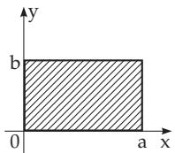
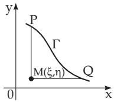
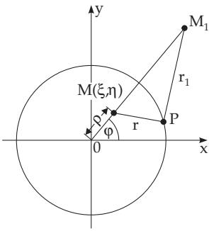

##### 9.2.2.3 Integration Methods for Linear Second-Order Partial Differential Equations

1. Method of Separation of Variables

Certain solutions of several diferential equations of physics can be determined by special substitutions, and although these are not general solutions, one gets a family of solutions depending on arbitrary parameters. Linear diferential equations, especially those of second order, can often be solved if looking for a solution in the form ofa product

$$
u ( x _ { 1 } , \ldots , x _ { n } ) = \varphi _ { 1 } ( x _ { 1 } ) \varphi _ { 2 } ( x _ { 2 } ) \ldots \varphi _ { n } ( x _ { n } ) .\tag{9.91}
$$

Next, one tries to separate the functions $\varphi _ { k } ( x _ { k } )$ , i.e., for each of them one wants to determine an ordinary diferential equation containing only one variable $x _ { k }$ . This separation of variables is successful in many cases when the trial solution in the form of a product (9.91) is substituted into the given diferential equation. In order to guarantee that the solution of the original equation satisfies the required homogeneous boundary conditions, it may appear to be suficient that some of functions $\varphi _ { 1 } ( x _ { 1 } )$ , $\varphi _ { 2 } ( x _ { 2 } ) , \ldots , \varphi _ { n } ( x _ { n } )$ satisfy certain boundary conditions.

By means of summation, diferentiation and integration, new solutions can be acquired from the obtained ones; the parameters should be chosen so that the remaining boundary and initial conditions are satisfied (see examples).

Finally, don’t forget that the solutions obtained in this way, often infinite series and improper integrals, are only formal solutions. That is, one has to check whether the solution makes a physical sense, e.g., whether it is convergent, satisfies the original diferential equation and the boundary conditions, whether it is diferentiable termwise and whether the limit at the boundary exists.

The infinite series and improper integrals in the examples of this paragraph are convergent if the functions defining the boundary conditions satisfy the required conditions, e.g., the continuity assumption for the second derivatives in the first and the second examples.

A: Equation of the Vibrating String is a linear second-order partial diferential equation of hyperbolic type

$$
{ \frac { \partial ^ { 2 } u } { \partial t ^ { 2 } } } = a ^ { 2 } { \frac { \partial ^ { 2 } u } { \partial x ^ { 2 } } } .\tag{9.92a}
$$

It describes the vibration of a spanned string. The boundary and the initial conditions are:

$$
u \bigg \vert _ { t = 0 } = f ( x ) , \ \frac { \partial u } { \partial t } \bigg \vert _ { t = 0 } = \varphi ( x ) , \quad u \vert _ { x = 0 } = 0 , \ u \vert _ { x = l } = 0 .\tag{9.92b}
$$

Seeking a solution in the form

$$
u = X ( x ) T ( t ) ,\tag{9.92c}
$$

and after substituting it into the given equation (9.92a) follows

$$
\frac { T ^ { \prime \prime } } { a ^ { 2 } T } = \frac { X ^ { \prime \prime } } { X } .\tag{9.92d}
$$

The variables are separated, the right side depends on only x and the left side depends on only $t ,$ so each of them is a constant quantity. The constant must be negative, otherwise the boundary conditions cannot be satisfied, i.e., non-negative values give the trivial solution $\boldsymbol { u } ( \boldsymbol { x } , t ) = 0$ . This negative constant is denoted by $- \lambda ^ { 2 }$ . The result is an ordinary linear second-order diferential equation with constant coeficients for both variables. For the general solution see 9.1.2.4, p. 555. The results are the linear diferential equations

$$
X ^ { \prime \prime } + \lambda ^ { 2 } X = 0 ,
$$

$$
( 9 . 9 2 \mathrm { e } ) \mathrm { a n d } T ^ { \prime \prime } + a ^ { 2 } \lambda ^ { 2 } T = 0 .\tag{9.92f}
$$

From the boundary conditions follows $X ( 0 ) ~ = ~ X ( l ) ~ = ~ 0$ . Hence $X ( x )$ is an eigenfunction of the

Sturm-Liouville boundary value problem and $\lambda ^ { 2 }$ is the corresponding eigenvalue (see 9.1.3.1, 3., p. 569). Solving the diferential equation (9.92e) for X with the corresponding boundary conditions one gets

$$
X ( x ) = C \sin \lambda x \quad { \mathrm { w i t h } } \quad \sin \lambda l = 0 , \quad { \mathrm { i . e . , w i t h } } \quad \lambda = { \frac { n \pi } { l } } = \lambda _ { n } \quad ( n = 1 , 2 , \ldots ) .\tag{9.92g}
$$

Solving equation (9.92f) for $T$ yields a particular solution of the original diferential equation (9.92a) for every eigenvalue $\lambda _ { n } \mathrm { { : } }$

$$
u _ { n } ( x , t ) = \left( a _ { n } \cos { \frac { n a \pi } { l } } t + b _ { n } \sin { \frac { n a \pi } { l } } t \right) \sin { \frac { n \pi } { l } } x .\tag{9.92h}
$$

Requiring that for $t = 0$

$$
u { \Big \vert } _ { t = 0 } = \sum _ { n = 1 } ^ { \infty } u _ { n } ( x , 0 ) { \mathrm { ~ i s ~ e q u a l ~ t o ~ f ( x ) , ~ \quad \mathrm { a n d } } }\tag{9.92i}
$$

$$
\left. { \frac { \partial u } { \partial t } } \right| _ { t = 0 } = \sum _ { n = 1 } ^ { \infty } { \frac { \partial u _ { n } } { \partial t } } ( x , 0 ) { \mathrm { ~ i s ~ e q u a l ~ t o ~ } } \varphi ( x ) ,\tag{9.92j}
$$

one gets with a Fourier series expansion in sines (see 7.4.1.1, 1., p. 474)

$$
a _ { n } = \frac { 2 } { l } \int _ { 0 } ^ { l } f ( x ) \sin \frac { n \pi x } { l } d x , \quad b _ { n } = \frac { 2 } { n a \pi } \int _ { 0 } ^ { l } \varphi ( x ) \sin \frac { n \pi x } { l } d x .\tag{9.92k}
$$

B: Equation of Longitudinal Vibration of a Bar is a linear second-order partial diferential equation of hyperbolic type, which describes the longitudinal vibration of a bar with one end free and a constant force p afecting the fixed end. Here is to solve the same diferential equation as in A (p. 579), i.e.,

$$
{ \frac { \partial ^ { 2 } u } { \partial t ^ { 2 } } } = a ^ { 2 } { \frac { \partial ^ { 2 } u } { \partial x ^ { 2 } } } ,\tag{9.93a}
$$

with the same initial but diferent boundary conditions:

$$
u \bigg \vert _ { t = 0 } = f ( x ) , \quad \frac { \partial u } { \partial t } \bigg \vert _ { t = 0 } = \varphi ( x ) , \qquad \quad ( 9 . 9 3 \mathrm { b } ) \qquad \quad \frac { \partial u } { \partial x } \bigg \vert _ { x = 0 } = 0 \quad ( \mathrm { f r e e ~ e n d } ) ,\tag{9.93c}
$$

$$
\left. { \frac { \partial u } { \partial x } } \right| _ { x = l } = k p .\tag{9.93d}
$$

The conditions (9.93c,d) can be replaced by the homogeneous conditions

$$
\left. \frac { \partial z } { \partial x } \right| _ { x = 0 } = \left. \frac { \partial z } { \partial x } \right| _ { x = l } = 0\tag{9.93e}
$$

where instead of u is introduced a new unknown function

$$
z = u - { \frac { k p x ^ { 2 } } { 2 l } } .\tag{9.93f}
$$

The diferential equation becomes inhomogeneous:

$$
\frac { \partial ^ { 2 } z } { \partial t ^ { 2 } } = a ^ { 2 } \frac { \partial ^ { 2 } z } { \partial x ^ { 2 } } + \frac { a ^ { 2 } k p } { l } .\tag{9.93g}
$$

Looking for the solution in the form $z = v + w$ , where v satisfies the homogeneous diferential equation with the initial and boundary conditions for z, i.e.,

$$
z \Big | _ { t = 0 } = f ( x ) - \frac { k p x ^ { 2 } } { 2 } , \quad \frac { \partial z } { \partial t } \Big | _ { t = 0 } = \varphi ( x ) ,\tag{9.93h}
$$

and w satisfies the inhomogeneous diferential equation with zero initial and boundary conditions. This gives $w = { \frac { k a ^ { 2 } p t ^ { 2 } } { 2 l } }$ . Substituting the product form of the unknown function $\boldsymbol { v } ( \boldsymbol { x } , t )$ into the diferential equation (9.93a)

$$
v = X ( x ) T ( t )\tag{9.93i}
$$

gives the separated ordinary diferential equations as in A (p. 579)

$$
{ \frac { X ^ { \prime \prime } } { X } } = { \frac { T ^ { \prime \prime } } { a ^ { 2 } T } } = - \lambda ^ { 2 } .\tag{9.93j}
$$

Integrating the diferential equation for X with the boundary conditions $X ^ { \prime } ( 0 ) = X ^ { \prime } ( l ) = 0$ one finds the eigenfunctions

$$
X _ { n } = \cos { \frac { n \pi x } { l } }\tag{9.93k}
$$

and the corresponding eigenvalues

$$
{ \lambda _ { n } } ^ { 2 } = { \frac { n ^ { 2 } \pi ^ { 2 } } { l ^ { 2 } } } \quad ( n = 0 , 1 , 2 , \ldots ) .\tag{9.93l}
$$

Proceeding as in A (p. 579) one finally obtains

$$
u = \frac { k a ^ { 2 } p t ^ { 2 } } { 2 l } + \frac { k p x ^ { 2 } } { 2 l } + a _ { 0 } + \frac { a \pi } { l } b _ { 0 } t + \sum _ { n = 1 } ^ { \infty } \left( a _ { n } \cos { \frac { a n \pi t } { l } } + \frac { b _ { n } } { n } \sin { \frac { a n \pi t } { l } } \right) \cos { \frac { n \pi x } { l } } ,\tag{9.93m}
$$

where $a _ { n }$ and $b _ { n } ( n = 0 , 1 , 2 , . . . )$ are the coeficients of the Fourier series expansion in cosines of the functions $f ( x ) - { \frac { k p x ^ { 2 } } { 2 } } { \mathrm { ~ a n d ~ } } { \frac { l } { a \pi } } \varphi ( x )$ in the interval (0, l) (see 7.4.1.1, 1., p. 474).

C: Equation of a Vibrating Round Membrane fixed along the boundary:

The diferential equation is linear, partial and it is of hyperbolic type. It has the form in Cartesian and in polar coordinates (see 3.5.3.2,3., p. 211)

$$
{ \frac { \partial ^ { 2 } u } { \partial x ^ { 2 } } } + { \frac { \partial ^ { 2 } u } { \partial y ^ { 2 } } } = { \frac { 1 } { a ^ { 2 } } } { \frac { \partial ^ { 2 } u } { \partial t ^ { 2 } } } ,\tag{9.94a}
$$

$$
{ \frac { \partial ^ { 2 } u } { \partial \rho ^ { 2 } } } + { \frac { 1 } { \rho } } { \frac { \partial u } { \partial \rho } } + { \frac { 1 } { \rho ^ { 2 } } } { \frac { \partial ^ { 2 } u } { \partial \varphi ^ { 2 } } } = { \frac { 1 } { a ^ { 2 } } } { \frac { \partial ^ { 2 } u } { \partial t ^ { 2 } } } .\tag{9.94b}
$$

The initial and boundary conditions are

$$
u | _ { t = 0 } = f ( \rho , \varphi ) , \qquad ( 9 . 9 4 \mathrm { c } ) \qquad \left. { \frac { \partial u } { \partial t } } \right| _ { t = 0 } = F ( \rho , \varphi ) , \quad ( 9 . 9 4 \mathrm { d } ) \qquad u | _ { \rho = R } = 0 . \mathrm { . }\tag{9.94e}
$$

The substitution of the product form

$$
u = U ( \rho ) \varPhi ( \varphi ) T ( t )\tag{9.94f}
$$

with three variables into the diferential equation in polar coordinates yields

$$
{ \frac { U ^ { \prime \prime } } { U } } + { \frac { U ^ { \prime } } { \rho U } } + { \frac { \varPhi ^ { \prime \prime } } { \rho ^ { 2 } \varPhi } } = { \frac { 1 } { a ^ { 2 } } } { \frac { T ^ { \prime \prime } } { T } } = - \lambda ^ { 2 } .\tag{9.94g}
$$

Three ordinary diferential equations are obtained for the separated variables analogously to examples A (p. 579) and B (p. 580):

$$
{ \cal T } ^ { \prime \prime } + a ^ { 2 } \lambda ^ { 2 } { \cal T } = 0 ,\tag{9.94h}
$$

$$
\frac { \rho ^ { 2 } U ^ { \prime \prime } + \rho U ^ { \prime } } { U } + \lambda ^ { 2 } \rho ^ { 2 } = - \frac { \varPhi ^ { \prime \prime } } { \varPhi } = \nu ^ { 2 } ,\tag{9.94i}
$$

$$
\phi ^ { \prime \prime } + \nu ^ { 2 } \phi = 0 .\tag{9.94j}
$$

From the conditions $\varPhi ( 0 ) = \varPhi ( 2 \pi ) , \varPhi ^ { \prime } ( 0 ) = \varPhi ^ { \prime } ( 2 \pi )$ it follows that:

$$
\phi ( \varphi ) = a _ { n } \cos n \varphi + b _ { n } \sin n \varphi , \quad \nu ^ { 2 } = n ^ { 2 } \quad ( n = 0 , 1 , 2 , \ldots ) .\tag{9.94k}
$$

U and λ will be determined from the equations $[ \rho U ^ { \prime } ] ^ { \prime } - \frac { n ^ { 2 } } { \rho } U = - \lambda ^ { 2 } \rho U$ and $U ( R ) = 0$ . Considering the obvious condition of boundedness of $U ( \rho )$ at $\rho = 0$ and substituting $\lambda \rho = z { \mathrm { ~ g i v e s } }$

$$
z ^ { 2 } U ^ { \prime \prime } + z U ^ { \prime } + ( z ^ { 2 } - n ^ { 2 } ) U = 0 , \mathrm { i . e . , } U ( \rho ) = J _ { n } ( z ) = J _ { n } \left( \mu \frac { \rho } { R } \right) ,\tag{9.94l}
$$

where $J _ { n }$ are the Bessel functions (see 9.1.2.6, 2., p. 562) with $\lambda = { \frac { \mu } { R } }$ and $J _ { n } ( \mu ) = 0$ . The system of functions

$$
U _ { n k } ( \rho ) = J _ { n } \left( \mu _ { n k } { \frac { \rho } { R } } \right) \quad ( k = 1 , 2 , . . . )\tag{9.94m}
$$

with $\mu _ { n k }$ as the k-th positive root of the function $J _ { n } ( z )$ is a complete system of eigenfunctions of the self-adjoint Sturm-Liouville problem which are orthogonal with the weight function $\rho .$ The solution of the problem can have the form of a double series:

$$
U = \sum _ { n = 0 } ^ { \infty } \sum _ { k = 1 } ^ { \infty } \left[ \left( a _ { n k } \cos n \varphi + b _ { n k } \sin n \varphi \right) \cos \frac { a \mu _ { n k } t } { R } \right.
$$

$$
+ ( c _ { n k } \cos n \varphi + d _ { n k } \sin n \varphi ) \sin \frac { a \mu _ { n k } t } { R } \Bigg ] J _ { n } \left( \mu _ { n k } \frac { \rho } { R } \right) .\tag{9.94n}
$$

From the initial conditions at $t = 0$ one obtains

$$
f ( \rho , \varphi ) = \sum _ { n = 0 } ^ { \infty } \sum _ { k = 1 } ^ { \infty } ( a _ { n k } \cos n \varphi + b _ { n k } \sin n \varphi ) J _ { n } \left( \mu _ { n k } \frac { \rho } { R } \right) ,\tag{9.94o}
$$

$$
F ( \rho , \varphi ) = \sum _ { n = 0 } ^ { \infty } \sum _ { k = 1 } ^ { \infty } \frac { a \mu _ { n k } } { R } ( c _ { n k } \cos n \varphi + d _ { n k } \sin n \varphi ) J _ { n } \left( \mu _ { n k } \frac { \rho } { R } \right) ,\tag{9.94p}
$$

where

$$
a _ { n k } = \frac { 2 } { \pi R ^ { 2 } J _ { n - 1 } ^ { 2 } ( \mu _ { n k } ) } \int _ { 0 } ^ { 2 \pi } d \varphi \int _ { 0 } ^ { R } f ( \rho , \varphi ) \cos n \varphi J _ { n } \left( \mu _ { n k } \frac { \rho } { R } \right) \rho d \rho ,\tag{9.94q}
$$

$$
b _ { n k } = \frac { 2 } { \pi R ^ { 2 } J _ { n - 1 } ^ { 2 } ( \mu _ { n k } ) } \int _ { 0 } ^ { 2 \pi } d \varphi \int _ { 0 } ^ { R } f ( \rho , \varphi ) \sin n \varphi J _ { n } \left( \mu _ { n k } \frac { \rho } { R } \right) \rho d \rho .\tag{9.94r}
$$

In the case of $n = 0$ , the numerator 2 should be changed to 1. To determine the coeficients $c _ { n k }$ and $d _ { n k }$ the function $f ( \rho , \varphi )$ is replaced by $F ( \rho , \varphi )$ in the formulas for $a _ { n k }$ and $b _ { n k }$ and finely it is multiplied by $\frac { R } { a \mu _ { n k } }$

D: Dirichlet Problem (see 13.5.1, p. 729) for the rectangle $0 \leq x \leq a , 0 \leq y \leq b$ (Fig. 9.17):

  
Figure 9.17

Find a function $u ( x , y )$ satisfying the elliptic type Laplace diferential equation

$$
\Delta u = 0
$$

and the boundary conditions

(9.95a)

$$
\begin{array} { l } { { u ( 0 , y ) = \varphi _ { 1 } ( y ) , u ( a , y ) = \varphi _ { 2 } ( y ) , } } \\ { { u ( x , 0 ) = \psi _ { 1 } ( x ) , u ( x , b ) = \psi _ { 2 } ( x ) . } } \end{array}\tag{9.95b}
$$

$$
u = X ( x ) Y ( y )
$$

First there is to determine a particular solution for the boundary conditions $\varphi _ { 1 } ( y ) = \varphi _ { 2 } ( y ) = 0$ . Substituting the product form

(9.95c)

into (9.95a) gives the separated diferential equations

$$
{ \frac { X ^ { \prime \prime } } { X } } = - { \frac { Y ^ { \prime \prime } } { Y } } = - \lambda ^ { 2 }\tag{9.95d}
$$

with the eigenvalue λ analogously to examples A (p. 579) through C (p. 581). Since $X ( 0 ) = X ( a ) = 0 .$

$$
X = C \sin \lambda x , \quad \lambda = { \frac { n \pi } { a } } = \lambda _ { n } \quad ( n = 1 , 2 , \ldots ) .\tag{9.95e}
$$

In the second step the general solution of the diferential equation is obtained:

$$
Y ^ { \prime \prime } - \frac { n ^ { 2 } \pi ^ { 2 } } { a ^ { 2 } } Y = 0 \ : \ : \ : ( 9 . 9 5 \mathrm { f } ) \ : \ : \ : \ : \ : \ : \ : \ : \ : \ : \mathrm { i n t h e ~ f o r m } \ : \ : \ : \ : Y = a _ { n } \sinh \frac { n \pi } { a } ( b - y ) + b _ { n } \sinh \frac { n \pi } { a } y \ : .\tag{9.95g}
$$

From these equations one gets a particular solution of (9.95a) satisfying the boundary conditions $u ( 0 , y ) =$ $u ( a , y ) = 0$ , which has the form

$$
u _ { n } = \left[ a _ { n } \sinh { \frac { n \pi } { a } } ( b - y ) + b _ { n } \sinh { \frac { n \pi } { a } } y \right] \sin { \frac { n \pi } { a } } x .\tag{9.95h}
$$

In the third step one considers the general solution as a series

$$
u = \sum _ { n = 1 } ^ { \infty } u _ { n } ,\tag{9.95i}
$$

so from the boundary conditions for $y = 0$ and $y = b$

$$
u = \sum _ { n = 1 } ^ { \infty } \left( a _ { n } \sinh { \frac { n \pi } { a } } ( b - y ) + b _ { n } \sinh { \frac { n \pi } { a } } y \right) \sin { \frac { n \pi } { a } } x\tag{9.95j}
$$

follows with the coeficients

$$
a _ { n } = \frac { 2 } { a \sinh \frac { n \pi b } { a } } \int _ { 0 } ^ { a } \psi _ { 1 } ( x ) \sin \frac { n \pi } { a } x d x , \quad b _ { n } = \frac { 2 } { a \sinh \frac { n \pi b } { a } } \int _ { 0 } ^ { a } \psi _ { 2 } ( x ) \sin \frac { n \pi } { a } x d x .\tag{9.95k}
$$

The problem with the boundary conditions $\psi _ { 1 } ( x ) = \psi _ { 2 } ( x ) = 0$ can be solved in a similar manner, and taking the series (9.95j) one gets the general solution of (9.95a) and (9.95b).

E: Heat Conduction Equation Heat conduction in a homogeneous bar with one end at infinity and the other end kept at a constant temperature is described by the linear second-order partial diferential equation of parabolic type

$$
{ \frac { \partial u } { \partial t } } = a ^ { 2 } { \frac { \partial ^ { 2 } u } { \partial x ^ { 2 } } } ,\tag{9.96a}
$$

which satisfies the initial and boundary conditions

$$
u | _ { t = 0 } = f ( x ) , \quad u | _ { x = 0 } = 0\tag{9.96b}
$$

in the domain $0 \leq x < + \infty , t \geq 0$ . It is also to be supposed that the temperature tends to zero at infinity. Substituting

$$
u = X ( x ) T ( t )\tag{9.96c}
$$

into (9.96a) one obtains the ordinary diferential equations

$$
\frac { T ^ { \prime } } { a ^ { 2 } T } = \frac { X ^ { \prime \prime } } { X } = - \lambda ^ { 2 } ,\tag{9.96d}
$$

whose parameter λ is introduced analogously to the previous examples A (p. 579) through D (p. 582). One gets

$$
T ( t ) = C _ { \lambda } e ^ { - \lambda ^ { 2 } a ^ { 2 } t }\tag{9.96e}
$$

as a solution for $T ( t )$ . Using the boundary condition $X ( 0 ) = 0$ , gives

$$
X ( x ) = C \sin \lambda x \quad \quad \quad \quad ( 9 . 9 6 \mathrm { f } ) \quad { \mathrm { a n d ~ s o } } \quad u _ { \lambda } = C _ { \lambda } e ^ { - \lambda ^ { 2 } a ^ { 2 } t } \sin \lambda x ,\tag{9.96g}
$$

where λ is an arbitrary real number. The solution can be obtained in the form

$$
u ( x , t ) = \int _ { 0 } ^ { \infty } C ( \lambda ) e ^ { - \lambda ^ { 2 } a ^ { 2 } t } \sin { \lambda x } d \lambda .\tag{9.96h}
$$

From the initial condition $u | _ { t = 0 } = f ( x )$ follows (9.96i) with (9.96j) for the constant (see 7.4.1.1, 1.,

p. 474).

$$
f ( x ) = \int _ { 0 } ^ { \infty } C ( \lambda ) \sin \lambda x d \lambda , \qquad \quad ( 9 . 9 6 \mathrm { i } ) \qquad \quad C ( \lambda ) = \frac { 2 } { \pi } \int _ { 0 } ^ { \infty } f ( s ) \sin \lambda s d s .\tag{9.96j}
$$

Combining (9.96j) and (9.96h) gives

$$
u ( x , t ) = { \frac { 2 } { \pi } } \int _ { 0 } ^ { \infty } f ( s ) \left( \int _ { 0 } ^ { \infty } e ^ { - \lambda ^ { 2 } a ^ { 2 } t } \sin \lambda s \sin \lambda x d \lambda \right) d s\tag{9.96k}
$$

or after replacing the product of the two sines with one half of the diference of two cosines ((2.122), p. 83) and using formula (21.27), in Table 21.8.2, p. 1100, it follows that

$$
u ( x , t ) = \int _ { 0 } ^ { \infty } f ( s ) { \frac { 1 } { 2 a { \sqrt { \pi t } } } } \left[ \exp \left( - { \frac { ( x - s ) ^ { 2 } } { 4 a ^ { 2 } t } } \right) - \exp \left( - { \frac { ( x + s ) ^ { 2 } } { 4 a ^ { 2 } t } } \right) \right] d s .\tag{9.96l}
$$

2. Riemann Method for Solving Cauchy’s Problem for the Hyperbolic

Diferential Equation

$$
{ \frac { \partial ^ { 2 } u } { \partial x \partial y } } + a { \frac { \partial u } { \partial x } } + b { \frac { \partial u } { \partial y } } + c u = F\tag{9.97a}
$$

1. Riemann Function is a function $v ( x , y ; \xi , \eta )$ , where $\xi$ and $\eta$ are considered as parameters, satisfying the homogeneous equation

$$
\frac { \partial ^ { 2 } v } { \partial x \partial y } - \frac { \partial ( a v ) } { \partial x } - \frac { \partial ( b v ) } { \partial y } + c v = 0\tag{9.97b}
$$

which is the adjoint of (9.97a) and the conditions

$$
v ( x , \eta ; \xi , \eta ) = \exp \left( \int _ { \xi } ^ { x } b ( s , \eta ) d s \right) , \quad v ( \xi , y ; \xi , \eta ) = \exp \left( \int _ { \eta } ^ { y } a ( \xi , s ) d s \right) .\tag{9.97c}
$$

In general, linear second-order diferential equations and their adjoint diferential equations have the form

$$
\sum _ { i , k } a _ { i k } \frac { \partial ^ { 2 } u } { \partial x _ { i } \partial x _ { k } } + \sum _ { i } b _ { i } \frac { \partial u } { \partial x _ { i } } + c u = f \mathrm { \nabla } ( 9 . 9 7 \mathrm { d } ) \quad \mathrm { ~ a n d ~ } \quad \sum _ { i , k } \frac { \partial ^ { 2 } ( a _ { i k } v ) } { \partial x _ { i } \partial x _ { k } } - \sum _ { i } \frac { \partial ( b _ { i } v ) } { \partial x _ { i } } + c v = 0 .\tag{9.97e}
$$

  
Figure 9.18

2. Riemann Formula is the integral formula which is used to determine function $u ( \xi , \eta )$ satisfying the given diferential equation (9.97a) and taking the previously given values along the previously given curve Γ (Fig. 9.18) together with its derivative in the direction of the curve normal (see 3.6.1.2, 2., p. 244):

$$
u ( \xi , \eta ) = \frac { 1 } { 2 } ( u v ) _ { P } + \frac { 1 } { 2 } ( u v ) _ { Q } - \int _ { \ c Q P } \left[ b u v + \frac { 1 } { 2 } \left( v \frac { \partial u } { \partial x } - u \frac { \partial v } { \partial x } \right) \right] d x
$$

$$
- \left[ a u v + \frac { 1 } { 2 } \left( v \frac { \partial u } { \partial y } - u \frac { \partial v } { \partial y } \right) \right] d y + \iint F v d x d y .\tag{9.97f}
$$

The smooth curve $\Gamma \left( \mathbf { F i g . 9 . 1 8 } \right)$ must not have tangents parallel to the coordinate axes, i.e., the curve must not be tangent to the characteristics. The line integral in this formula can be calculated, since the values of both partial derivatives can be determined from the function values and from its derivatives in a non-tangential direction along the curve arc.

In the Cauchy problem, the values of the partial derivatives of the unknown function, $\mathrm { e . g . , } \frac { \partial u } { \partial y }$ are often

given instead of the normal derivative along the curve. Then another form of the Riemann formula is used:

$$
u ( \xi , \eta ) = ( u v ) _ { P } - \intop _ { \widehat { Q P } } \left( b u v - u \frac { \partial v } { \partial x } \right) d x - \left( a u v + v \frac { \partial u } { \partial y } \right) d y + \intop _ { P M Q } F v d x d y .\tag{9.97g}
$$

Telegraph Equation (Telegrapher’s Equation) is a linear second-order partial diferential equation of hyperbolic type

$$
a { \frac { \partial ^ { 2 } u } { \partial t ^ { 2 } } } + 2 b { \frac { \partial u } { \partial t } } + c u = { \frac { \partial ^ { 2 } u } { \partial x ^ { 2 } } }\tag{9.98a}
$$

where $a > 0 , b $ , and c are constants. The equation describes the current flow in wires. It is a generalization of the diferential equation of a vibrating string.

Replacing the unknown function $\boldsymbol { u } ( \boldsymbol { x } , t )$ by $u = z \exp ( - ( b / a ) t )$ , so (9.98a) is reduced to the form

$$
\frac { \partial ^ { 2 } z } { \partial t ^ { 2 } } = m ^ { 2 } \frac { \partial ^ { 2 } z } { \partial x ^ { 2 } } + n ^ { 2 } z \quad \left( m ^ { 2 } = \frac { 1 } { a } , { \mathrm { \Omega } n } ^ { 2 } = \frac { b ^ { 2 } - a c } { a ^ { 2 } } \right) .\tag{9.98b}
$$

Replacing the independent variables by

$$
\xi = \frac { n } { m } ( m t + x ) , \quad \eta = \frac { n } { m } ( m t - x )\tag{9.98c}
$$

finally one gets the canonical form

$$
\frac { \partial ^ { 2 } z } { \partial \xi \partial \eta } - \frac { z } { 4 } = 0\tag{9.98d}
$$

of a hyperbolic type linear partial diferential equation (see 9.2.2.1, 1., p. 577). The Riemann function $v ( \xi , \eta ; \xi _ { 0 } , \eta _ { 0 } )$ should satisfy this equation with unit value at $\xi = \xi _ { 0 }$ and $\eta = \eta _ { 0 }$ . Choosing the form

$$
w = ( \xi - \xi _ { 0 } ) ( \eta - \eta _ { 0 } )\tag{9.98e}
$$

for w in $v = f ( w )$ , then f(w) is a solution of the diferential equation

$$
w \frac { d ^ { 2 } f } { d w ^ { 2 } } + \frac { d f } { d w } - \frac { 1 } { 4 } f = 0\tag{9.98f}
$$

with initial condition $f ( 0 ) = 1$ . The substitution $w = \alpha ^ { 2 }$ reduces this diferential equation to Bessel’s diferential equation of order zero (see 9.1.2.6, 2., p. 562)

$$
{ \frac { d ^ { 2 } f } { d \alpha ^ { 2 } } } + { \frac { 1 } { \alpha } } { \frac { d f } { d \alpha } } - f = 0 ,\tag{9.98g}
$$

hence the solution is

$$
v = I _ { 0 } \left[ \sqrt { ( \xi - \xi _ { 0 } ) ( \eta - \eta _ { 0 } ) } \right] .\tag{9.98h}
$$

A solution of the original diferential equation (9.98a) satisfying the boundary conditions

$$
z { \biggl | } _ { t = 0 } = f ( x ) , \quad \left. { \frac { \partial z } { \partial t } } \right| _ { t = 0 } = g ( x )\tag{9.98i}
$$

can be obtained substituting the found value of v into the Riemann formula and then returning to the original variables:

$$
\begin{array} { l } { \displaystyle { z ( x , t ) = \frac { 1 } { 2 } [ f ( x - m t ) + f ( x + m t ) ] } } \\ { \displaystyle { + \frac { 1 } { 2 } \sum _ { x = m t } ^ { x + m t } \Bigg [ g ( s ) \frac { I _ { 0 } \left( \frac { n } { m } \sqrt { m ^ { 2 } t ^ { 2 } - ( s - x ) ^ { 2 } } \right) } { m } - f ( s ) \frac { n t I _ { 1 } \left( \frac { n } { m } \sqrt { m ^ { 2 } t ^ { 2 } - ( s - x ) ^ { 2 } } \right) } { \sqrt { m ^ { 2 } t ^ { 2 } - ( s - x ) ^ { 2 } } } \Bigg ] d s . } } \end{array}\tag{9.98j}
$$

3. Green’s Method of Solving the Boundary Value Problem for Elliptic

Diferential Equations with Two Independent Variables

This method is very similar to the Riemann method of solving the Cauchy problem for hyperbolic differential equations.

If one wants to find a function $u ( x , y )$ satisfying the elliptic type of linear second-order partial diferential equation

$$
{ \frac { \partial ^ { 2 } u } { \partial x ^ { 2 } } } + { \frac { \partial ^ { 2 } u } { \partial y ^ { 2 } } } + a { \frac { \partial u } { \partial x } } + b { \frac { \partial u } { \partial y } } + c u = f\tag{9.99a}
$$

in a given domain and taking the prescribed values on its boundary, first the Green function $G ( x , y , \xi , \eta )$ has to be determined for this domain, where $\xi$ and η are regarded as parameters. The Green function must satisfy the following conditions:

1. The function $G ( x , y ; \xi , \eta )$ satisfies the homogeneous adjoint diferential equation

$$
{ \frac { \partial ^ { 2 } G } { \partial x ^ { 2 } } } + { \frac { \partial ^ { 2 } G } { \partial y ^ { 2 } } } - { \frac { \partial ( a G ) } { \partial x } } - { \frac { \partial ( b G ) } { \partial y } } + c G = 0\tag{9.99b}
$$

everywhere in the given domain except at the point $x = \xi , y = \eta$

2. The function $G ( x , y ; \xi , \eta )$ has the form

$$
U \ln { \frac { 1 } { r } } + V
$$

(9.99c)

$$
\mathrm { w i t h } r = \sqrt { ( x - \xi ) ^ { 2 } + ( y - \eta ) ^ { 2 } } ,\tag{9.99d}
$$

where U has unit value at the point $x = \xi , y = \eta$ and U and V are continuous functions in the entire domain together with their second derivatives.

3. The function $G ( x , y ; \xi , \eta )$ is equal to zero on the boundary of the given domain.

The second step is to give the solution of the boundary value problem with the Green function by the formula

$$
u ( \xi , \eta ) = { \frac { 1 } { 2 \pi } } \intop _ { S } u ( x , y ) { \frac { \partial } { \partial n } } G ( x , y ; \xi , \eta ) d s - { \frac { 1 } { 2 \pi } } \iint f ( x , y ) G ( x , y ; \xi , \eta ) d x d y ,\tag{9.99e}
$$

where D is the considered domain, $S$ is its boundary on which the function is assumed to be known and $\frac { \partial } { \partial n }$ denotes the normal derivative directed toward the interior of D.

Condition 3 depends on the formulation of the problem. For instance, if instead of the function values the values of the derivative of the unknown function are given in the direction normal to the boundary of the domain, then in 3 the condition

$$
\frac { \partial G } { \partial n } - ( a \cos \alpha + b \cos \beta ) G = 0\tag{9.99f}
$$

holds on the boundary. α and $\beta$ denote here the angles between the interior normal to the boundary of the domain and the coordinate axes. In this case, the solution is given by the formula

$$
u ( \xi , \eta ) = - { \frac { 1 } { 2 \pi } } \int _ { S } { \frac { \partial u } { \partial n } } G d s - { \frac { 1 } { 2 \pi } } \int _ { D } f G d x d y .\tag{9.99g}
$$

4. Green’s Method for the Solution of Boundary Value Problems with Three Independent Variables

The solution of the diferential equation

$$
\Delta u + a { \frac { \partial u } { \partial x } } + b { \frac { \partial u } { \partial y } } + c { \frac { \partial u } { \partial z } } + e u = f\tag{9.100a}
$$

should take the given values on the boundary of the considered domain. As the first step, one constructs again the Green function, but now it depends on three parameters $\xi , \eta ,$ , and $\zeta .$ The adjoint diferential equation satisfied by the Green function has the form

$$
\Delta G - \frac { \partial ( a G ) } { \partial x } - \frac { \partial ( b G ) } { \partial y } - \frac { \partial ( c G ) } { \partial z } + e G = 0 .\tag{9.100b}
$$

As in condition 2, the function $G ( x , y , z ; \xi , \eta , \zeta )$ has the form

$$
U _ { r } ^ { 1 } + V
$$

$$
\mathrm { ( 9 . 1 0 0 c ) } \qquad \mathrm { w i t h } \quad r = \sqrt { ( x - \xi ) ^ { 2 } + ( y - \eta ) ^ { 2 } + ( z - \zeta ) ^ { 2 } } .\tag{9.100d}
$$

The solution of the problem is:

$$
u ( \xi , \eta , \zeta ) = { \frac { 1 } { 4 \pi } } \int _ { S } u { \frac { \partial G } { \partial n } } d s - { \frac { 1 } { 4 \pi } } \int _ { D } \int _ { \cal D } f G d x d y d z .\tag{9.100e}
$$

Both methods, Riemann’s and Green’s, have the common idea first to determine a special solution of the diferential equation, which can then be used to obtain a solution with arbitrary boundary conditions. An essential diference between the Riemann and the Green function is that the first one depends only on the form of the left-hand side of the diferential equation, while the second one depends also on the considered domain. Finding the Green function is, in practice, an extremely dificult problem, even if it is known to exist; therefore, Green’s method is used mostly in theoretical research.

A: Construction of the Green function for the Dirichlet problem of the Laplace diferential equation (see 13.5.1, p. 729)

  
Figure 9.19

$$
\Delta u = 0\tag{9.101a}
$$

for the case, when the considered domain is a circle (Fig. 9.19). The Green function is

$$
G ( x , y ; \xi , \eta ) = \ln \frac { 1 } { r } + \ln \frac { r _ { 1 } \rho } { R } ,\tag{9.101b}
$$

where $r = \overline { { M P } } , \ \rho = \overline { { O M } } , r _ { 1 } = \overline { { M _ { 1 } P } }$ and R is the radius of the considered circle (Fig. 9.19). The points M and $M _ { 1 }$ are symmetric with respect to the circle, i.e., both points are on the same ray starting from the center and

$$
{ \overline { { O M } } } \cdot { \overline { { O M _ { 1 } } } } = R ^ { 2 } .\tag{9.101c}
$$

The formula (9.99e) for a solution of Dirichlet’s problem, after substituting the normal derivative of the Green function and after certain calculations, yields the so-called Poisson integral

$$
u ( \xi , \eta ) = \frac { 1 } { 2 \pi } \int _ { 0 } ^ { 2 \pi } \frac { R ^ { 2 } - \rho ^ { 2 } } { R ^ { 2 } + \rho ^ { 2 } - 2 R \rho \cos ( \psi - \varphi ) } u ( \varphi ) d \varphi .\tag{9.101d}
$$

The notation is the same as above. The known values of u are given on the boundary of the circle by $u ( \varphi )$ . For the coordinates of the point $M ( \xi , \eta )$ follows $\xi = \rho$ cos ψ, $\eta = \rho$ sin ψ.

B: Construction of the Green function for the Dirichlet problem of the Laplace diferential equation (see 13.5.1, p. 729)

$$
\Delta u = 0 ,\tag{9.102a}
$$

for the case when the considered domain is a sphere with radius R. The Green function now has the form

$$
G ( x , y , z ; \xi , \eta , \zeta ) = \frac { 1 } { r } - \frac { R } { r _ { 1 } \rho } ,\tag{9.102b}
$$

with $\rho = \sqrt { \xi ^ { 2 } + \eta ^ { 2 } + \zeta ^ { 2 } }$ as the distance of the point $( \xi , \eta , \zeta )$ from the center, r as the distance between the points $( x , y , z )$ and $( \xi , \eta , \zeta )$ , and $r _ { 1 }$ as the distance of the point $( x , y , z )$ from the symmetric point of $( \xi , \eta , \zeta )$ according to (9.101c), i.e., from the point $\left( \frac { R \xi } { \rho } , \frac { R \eta } { \rho } , \frac { R \zeta } { \rho } \right)$ . In this case, the Poisson integral has the form (with the same notation as in A (p. 587))

$$
u ( \xi , \eta , \zeta ) = \frac { 1 } { 4 \pi } \int \int _ { S } \frac { R ^ { 2 } - \rho ^ { 2 } } { R r ^ { 3 } } u d s .\tag{9.102c}
$$

5. Operational Method

Operational methods can be used not only to solve ordinary diferential equations but also for partial diferential equations (see 15.1.6, p. 769). They are based on transition from the unknown function to its transform (see 15.1, p. 767). In this process the unknown function is regarded as a function of only one variable and the transformation is performed with respect to this variable. The remaining variables are considered as parameters. The diferential equation to determine the transform of the unknown function contains one less independent variable than the original equation. In particular, if the original equation is a partial diferential equation of two independent variables, then one obtains an ordinary diferential equation for the transform. If the transform of the unknown function can be found from the obtained equation, then the original function is obtained either from the formula for the inverse function or from the table of transforms.

6. Approximation Methods

In order to solve practical problems with partial diferential equations, diferent approximation methods are used. They can be divided into analytical and numerical methods.

1. Analytical Methods make possible the determination of approximate analytical expressions for the unknown function.

2. Numerical Methods result in approximate values of the unknown function for certain values of the independent variables. Here the following methods (see 19.5, p. 976) are used:

a) Finite Diference Method, or Lattice-Point Method: The derivatives are replaced by divided differences, so the diferential equation including the initial and boundary conditions becomes an algebraic equation system. A linear diferential equation with linear initial and boundary conditions becomes a linear equation system.

b) Finite Element Method, or briefly FEM (see 19.5.3, p. 978), for boundary value problems: Here a variational problem is assigned to the boundary value problem. The approximation of the unknown function is performed by a spline approach, whose coeficients should be chosen to get the best possible solution. The domain of the boundary value problem is decomposed into regular sub-domains. The coeficients are determined by solving an extreme value problem.

c) Integral Equation Method (along a Closed Curve) for special boundary problems: The boundary value problem is formulated as an equivalent integral equation problem along the boundary of the domain of the boundary value problem. To do this, one applies the theorems of vector analysis (see 13.3.3, p. 724, and followings), e.g., Green formulas. The remaining integrals along the closed curve are to be determined numerically by a suitable quadrature formula.

3. Physical Solutions of diferential equations can be given by experimental methods. This is based on the fact that various physical phenomena can be described by the same diferential equation. To solve a given equation, first a model is constructed by which the given problem is simulated and the values of the unknown function are obtained directly from this model. Since such models are often known and can be constructed by varying the parameters in a wide range, the diferential equation can also be applied in a wide domain of the variables.
