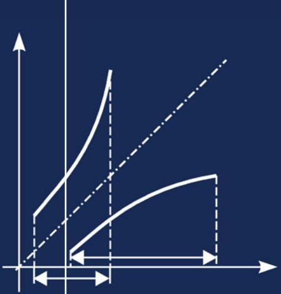

# Handbook of Mathematics 6th Edition

I. N. Bronshtein K. A. Semendyayev G. Musiol H. Mühlig

HANDBOOK OF MATHEMATICS

Sixth Edition

123

I.N. Bronshtein • K.A. Semendyayev Gerhard Musiol • Heiner Mühlig

Handbook of Mathematics Sixth Edition

With 799 Figures and 132 Tables

I.N. Bronshtein (Deceased)

Gerhard Musiol

Dresden, Sachsen

K.A. Semendyayev (Deceased)

Germany

Heiner Mühlig

Germany

Dresden, Sachsen

ISBN 978-3-662-46220-1   
DOI 10.1007/978-3-662-46221-8

ISBN 978-3-662-46221-8 (eBook)

Library of Congress Control Number: 2015933616

Springer Heidelberg New York Dordrecht London

© Springer-Verlag Berlin Heidelberg 2015

This work is subject to copyright. All rights are reserved by the Publisher, whether the whole or part of the material is concerned, specifically the rights of translation, reprinting, reuse of illustrations, recitation, broadcasting, reproduction on microfilms or in any other physical way, and transmission or information storage and retrieval, electronic adaptation, computer software, or by similar or dissimilar methodology now known or hereafter developed.

The use of general descriptive names, registered names, trademarks, service marks, etc. in this publication does not imply, even in the absence of a specific statement, that such names are exemp from the relevant protective laws and regulations and therefore free for general use.

The publisher, the authors and the editors are safe to assume that the advice and information in this book are believed to be true and accurate at the date of publication. Neither the publisher nor the authors or the editors give a warranty, express or implied, with respect to the material contained herein or for any errors or omissions that may have been made.

Printed on acid-free paper

Springer-Verlag GmbH Berlin Heidelberg is part of Springer Science+Business Media (www.springer.com)

## 本书包含的章

- [Preface to the Sixth English Edition](<Preface to the Sixth English Edition.md>)
- [Preface to the Fifth English Edition](<Preface to the Fifth English Edition.md>)
- [From the Preface to the Fourth English Edition](<From the Preface to the Fourth English Edition.md>)
- [Co-Authors](<Co-Authors.md>)
- [Additional Chapters with Co-Authors in the CD–ROM to the Books of the German Editions 7,8 and 9.](<Additional Chapters with Co-Authors in the CD–ROM to the Books of the German Editions 7,8 and 9.md>)
- [Contents](<Contents.md>)
- [List of Tables](<List of Tables.md>)
- [1 Arithmetics](<1 Arithmetics.md>)
- [2 Functions](<2 Functions.md>)
- [3 Geometry](<3 Geometry.md>)
- [4 Linear Algebra](<4 Linear Algebra.md>)
- [5 Algebra and Discrete Mathematics](<5 Algebra and Discrete Mathematics.md>)
- [6 Differentiation](<6 Differentiation.md>)
- [7 Infinite Series](<7 Infinite Series.md>)
- [8 Integral Calculus](<8 Integral Calculus.md>)
- [9 Differential Equations](<9 Differential Equations.md>)
- [10 Calculus of Variations](<10 Calculus of Variations.md>)
- [11 Linear Integral Equations](<11 Linear Integral Equations.md>)
- [12 Functional Analysis](<12 Functional Analysis.md>)
- [13 Vector Analysis and Vector Fields](<13 Vector Analysis and Vector Fields.md>)
- [14 Function Theory](<14 Function Theory.md>)
- [15 Integral Transformations](<15 Integral Transformations.md>)
- [16 Probability Theory and Mathematical Statistics](<16 Probability Theory and Mathematical Statistics.md>)
- [17 Dynamical Systems and Chaos](<17 Dynamical Systems and Chaos.md>)
- [18 Optimization](<18 Optimization.md>)
- [19 Numerical Analysis](<19 Numerical Analysis.md>)
- [20 Computer Algebra Systems-Example Mathematica](<20 Computer Algebra Systems-Example Mathematica.md>)
- [21 Tables](<21 Tables.md>)
- [22 Bibliography](<22 Bibliography.md>)
- [Index](<Index-2.md>)
