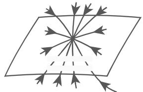
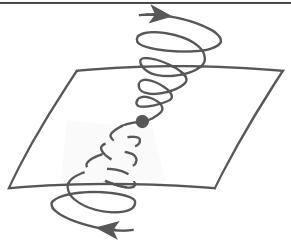
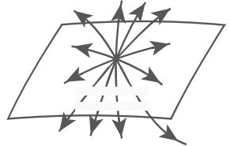
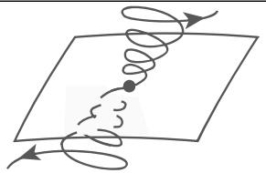
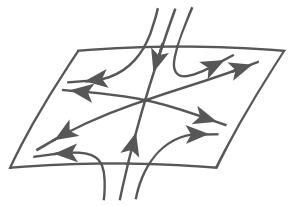
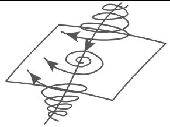
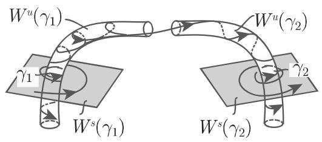
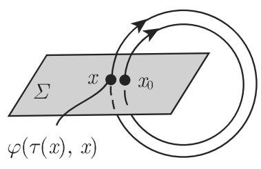
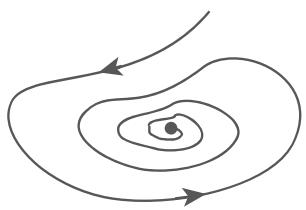
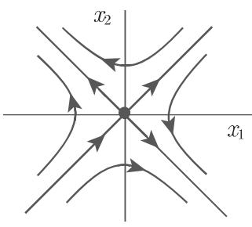

<table><tr><td>参数域</td><td> $\Delta$ </td><td>平衡点类型</td><td>特征多项式根</td><td> $W^s$ 和 $W^u$ 维数</td></tr><tr><td rowspan="2"> $\delta >0; q>0, r>0$ </td><td> $\Delta < 0$ </td><td>稳定结点</td><td> $\text{Im } \lambda j = 0$  $\lambda_j < 0, j = 1,2,3$ </td><td rowspan="2"> $\dim W^s = 3, \dim W^u = 0$ </td></tr><tr><td> $\Delta >0$ </td><td>稳定焦点</td><td> $\text{Re } \lambda_{1,2} < 0$  $\lambda_3 < 0$ </td></tr><tr><td colspan="5"> $\Delta < 0:$   $\Delta >0:$ </td></tr><tr><td>参数域</td><td> $\Delta$ </td><td>平衡点类型</td><td>特征多项式根</td><td> $W^s$ 和 $W^u$ 维数</td></tr><tr><td rowspan="2"> $\delta < 0; r < 0, q >0$ </td><td> $\Delta < 0$ </td><td>不稳定结点</td><td> $\text{Im } \lambda j = 0$  $\lambda_j > 0, j = 1,2,3$ </td><td rowspan="2"> $\dim W^s = 0, \dim W^u = 3$ </td></tr><tr><td> $\Delta >0$ </td><td>不稳定焦点</td><td> $\text{Re } \lambda_{1,2} > 0$  $\lambda_3 > 0$ </td></tr><tr><td colspan="5"> $\Delta < 0:$   $\Delta >0:$ </td></tr><tr><td>参数域</td><td> $\Delta$ </td><td>平衡点类型</td><td>特征多项式根</td><td> $W^s$ 和 $W^u$ 维数</td></tr><tr><td rowspan="2"> $\delta >0; r < 0, q \leqslant 0$ oder  $r < 0, q >0$ </td><td> $\Delta < 0$ </td><td>稳定结点</td><td> $\text{Im } \lambda_j = 0$  $\lambda_{1,2} < 0, \lambda_3 > 0$ </td><td rowspan="2"> $\dim W^s = 2, \dim W^u = 1$ </td></tr><tr><td> $\Delta >0$ </td><td>稳定焦点</td><td> $\text{Re } \lambda_{1,2} < 0$  $\lambda_3 > 0$ </td></tr><tr><td colspan="5"> $\Delta < 0:$   $\Delta >0:$ </td></tr><tr><td>参数域</td><td> $\Delta$ </td><td>平衡点类型</td><td>特征多项式根</td><td> $W^{s}$ 和 $W^{u}$ 维数</td></tr><tr><td rowspan="2"> $\delta < 0; r > 0, q \leqslant 0$ oder  $r > 0, q > 0$ </td><td> $\Delta < 0$ </td><td>稳定节点</td><td> $\text{Im}\lambda_{j} = 0$  $\lambda_{1,2} > 0, \lambda_{3} < 0$ </td><td rowspan="2"> $\text{dim } W^{s} = 1, \text{ dim } W^{u} = 2$ </td></tr><tr><td> $\Delta > 0$ </td><td>稳定焦点</td><td> $\text{Re}\lambda_{1,2} > 0$  $\lambda_{3} < 0$ </td></tr><tr><td colspan="5"> $\Delta < 0:$  $\Delta > 0:$ </td></tr></table>

续表

4. 同宿轨和异宿轨

设 $\gamma _ { 1 }$ 和 $\gamma _ { 2 }$ 是方程 (17.1) 的双曲平衡点或双曲周期轨．若分界面 $W ^ { s } ( \gamma _ { 1 } )$ 和 $W ^ { u } ( \gamma _ { 2 } )$ 相交，则相交集包含复杂的轨道对千两个平衡点或者周期轨，轨线$\gamma \subset W ^ { s } ( \gamma _ { 1 } ) \cap W ^ { u } ( \gamma _ { 2 } )$ 称为异宿轨，如果 $\gamma _ { 1 } \neq \gamma _ { 2 }$ （图 17.7(a)）；称为同宿轨，如果$\gamma _ { 1 } = \gamma _ { 2 }$ ．平衡点的同宿轨也称为分界线环（图 17.7(b)).

  
(a)

  
(b)  
17.7

·给定参数 $\sigma = 1 0 , b = 8 / 3 \ /$ 考虑带参数 的洛伦茨方程 (17.2)．当 $1 < r <$ 13.926 · · ·时，方程 (17.2) 的平衡点 (0,0,0) 是鞍点该点有一个二维稳定流形 $w ^ { s }$ 和一个一维不稳定流形 $W ^ { s }$ . $r = 1 3 . 9 2 6 \cdots$ ·，则在 (0,0,0) 处存在两个分界线环，即当 $t \to + \infty$ 时，不稳定流形的分支（沿稳定流形）回到原点．

17.1.2.5 庞加莱映射

1. 自治微分方程组的庞加莱映射

令 $\gamma = \{ \varphi ( t , x _ { 0 } ) , t \in [ 0 , T ] \}$ 是方程 (17.1) 周期轨， $n - 1$ 维光滑超曲面，与轨道勹在 $x _ { 0 }$ 处横截相交（图 17.8(a)）．那么，存在 $x _ { 0 }$ 的邻域 和光滑函数 $\tau : U $ ---+厌使 $\tau ( x _ { 0 } ) = T _ { : }$ ，并且对任意 $x \in U ,$ 有 $\varphi ( \tau ( x ) , x ) \in \Sigma$ 映射$P : U \cap \Sigma \to \Sigma \quad x \to P ( x ) = \varphi ( \tau ( x ) , x )$ 称为 $\gamma$ 在 $x _ { 0 }$ 处的庞加莱映射．若方(17.1) 的右端项 阶连续可微的，则 也是 阶连续可微的．雅可比矩阵

$D P ( x _ { 0 } )$ 的特征值是周期轨的乘子 $\rho _ { 1 } , \cdots , \rho _ { n - 1 }$ •它们不依赖千 $\gamma$ 上 $x _ { 0 }$ 的选取，也不依赖千横截曲面的选取．

  
(a)

  
(b)  
17.8

当 $M = U ,$ ，且迭代点留在 内时系统 (17.3) 可与庞加莱映射联系起来方(17.1) 的周期轨对应千离散系统的平衡点并且这些平衡点的稳定性对应千方程(17.1) 周期轨的稳定性

·在极坐标下，考虑方程 (17.9a) 的横截超平面

$$
\Sigma = \{(r, v): r > 0, v = v _ {0} \}.
$$

选定 $U = \Sigma$ 显然 $\tau ( r ) = 2 \pi ( \forall r > 0 )$ ．千是，利用方程 (17.9a) 解的表达式有

$$
P (r) = [ 1 + (r ^ {- 2} - 1) \mathrm{e} ^ {- 4 \pi} ] ^ {- 1 / 2}.
$$

故 $P ( \Sigma ) = \Sigma , P ( 1 ) = 1$ 且 $P ^ { \prime } ( 1 ) = \mathrm { e } ^ { - 4 \pi } < 1$

2. 非自治时间周期微分方程的庞加莱映射

考虑非自治微分方程 (17.11)，右端项 关千 周期的，即 $f ( t + T , x ) =$ $f ( t , x ) ( \forall t \in \mathbb { R } , \forall x \in M )$ ．该方程可表示为自治微分方程 ${ \dot { x } } = f ( s , x ) , { \dot { s } } = 1$ ,柱状相平面 $M \times \{ s \ \mathrm { m o d } \ T \}$ ．对任意 $s _ { 0 } \in \{ s \ m o d \ T \} , \Sigma = M \times \{ s _ { 0 } \}$ 是横截面（图 17.S(b)）．庞加莱映射可在全局给出 $P : \Sigma  \Sigma , \quad x _ { 0 }  \varphi ( s _ { 0 } + T , s _ { 0 } , x _ { 0 } )$ ，其中， $\varphi ( t , s _ { 0 } , x _ { 0 } )$ 是方程 (17.11) 满足在时刻 $s _ { 0 }$ 初值为 $x _ { 0 }$ 的解

17.1.2.6 微分方程的拓扑等价

1. 定义

除了方程 (17.1) 和相应的流 $\{ \varphi ^ { t } \} _ { t \in \mathbb { R } }$ ，假设还有一个微分方程

$$
\dot {x} = g (x),\tag{17.22}
$$

其中， $g : N \to \mathbb { R } ^ { n }$ 是开集 $N \subset \mathbb { R } ^ { n }$ 上的 $C ^ { r }$ 映射．设方程 (17.22) 的流 $\{ \psi ^ { t } \} _ { t \in \mathbb { R } }$ 存在

微分方程组 (17.1) (17.22) （或它们的流）称为拓扑等价，如果存在同胚映: M -----+ （即， 是双射， $\displaystyle h ^ { - 1 }$ 都是连续映射）将方程 (17.1) 的每一条轨道映射为方程 (17.22) 的一条轨道，并且该映射是保定向的，但未必保参数化．微分方程组 (17.1) (17.22) 是拓扑等价的，如果除了同胚映射 $h : M \to N ,$ ，还存在连续映射 ：厌 $\times M \to$ 厌使得对固定 $x \in M , \tau$ 作为厌到厌上的映射是严格单调递增的，并且对任意 $x \in M , t \in \mathbb { R }$ ，有 $\tau ( 0 , x ) = 0$ 和 $h ( \varphi ^ { t } ( x ) ) = \psi ^ { \tau ( t , x ) } ( h ( x ) )$

在拓扑等价的情形下，方程 (17.1) 的平衡点对应千方程 (17.22) 的平衡点；方(17.1) 的周期轨对应千方程 (17.22) 的周期轨，但周期不一定相同因此，若微分方程 (17.1) (17.22) 拓扑等价，则相空间中轨道分解的拓扑结构是相同的若方(17.1) (17.22) 拓扑等价，并且同胚映射 $h : M \to N$ 是保参数化的，即对任意$t , x ,$ ，有 $h ( \varphi ^ { t } ( x ) ) = \psi ^ { t } ( h ( x ) )$ ），则称方程 (17.1) (17.22) 是拓扑共扼的．

拓扑等价或拓扑共辄也可在相空间 的子集上定义假设，方程 (17.1)定义在 $U _ { 1 } \subset M$ 上，方程 (17.22) 定义在 $U _ { 2 } \subset N .$ 那么， $U _ { 1 }$ 上方程 (17.1) 拓扑等价千 $U _ { 2 }$ 上 (17.22)，如果存在同胚映射 $h : U _ { 1 } \to U _ { 2 }$ 将方程 (17.1) 的每一条轨道与$U _ { 1 }$ 的交集映射为方程 (17.22) 的一条轨道与 $U _ { 2 }$ 交集，并且该映射是保定向的．

：方程 (17.1) (17.22) 之间的同胚映射可以拉伸和收缩轨道，不可以截断和闭合轨道

17.9(a) 和图 7.9(b) 相图中的流是拓扑等价的；图 17.9(a) 和图 7.9(c)图中的流不是拓扑等价的

  
(a)

  
(b)

  
(c)  
17.9

• ：考虑两个平面线性微分方程组 ${ \dot { x } } = A x$ 和 ${ \dot { x } } = B x$ ，其中 $A = \left( \begin{array} { l l } { { - 1 } } & { { - 3 } } \\ { { - 3 } } & { { - 1 } } \end{array} \right)$ $B \ = \ \left( \begin{array} { c c } { { 4 } } & { { 0 } } \\ { { 0 } } & { { - 8 } } \end{array} \right)$ ．这两个系统在（0,0) 附近的相图如图 17.10(a） 和 17.10(b)所示．

  
(a)

  
17.10  
(b)

同胚映射 $h : \mathbb { R } ^ { 2 } \longrightarrow \mathbb { R } ^ { 2 }$ 定义为 $h ( x ) = R x .$ ，其中 $R = \frac { 1 } { \sqrt { 2 } } \left( \begin{array} { c c } { 1 } & { - 1 } \\ { 1 } & { 1 } \end{array} \right)$ ．函数$\tau : \mathbb { R } \times \mathbb { R } ^ { 2 } \to$ 厌定义为 $\tau ( t , x ) = \frac { 1 } { 2 } t ,$ 它将第一个系统的轨道映射为第二个系统的轨道因此这两个系统是拓扑等价的．

2. 格罗布曼—哈特曼 (Grohman-Hartman) 定理

设 $p$ 是方程 (17.1) 的双曲平衡点那么，在 的某个邻域内，微分方程 (17.1)与其线性化方程 ${ \dot { y } } = D f ( p ) y$ 是拓扑等价的．
