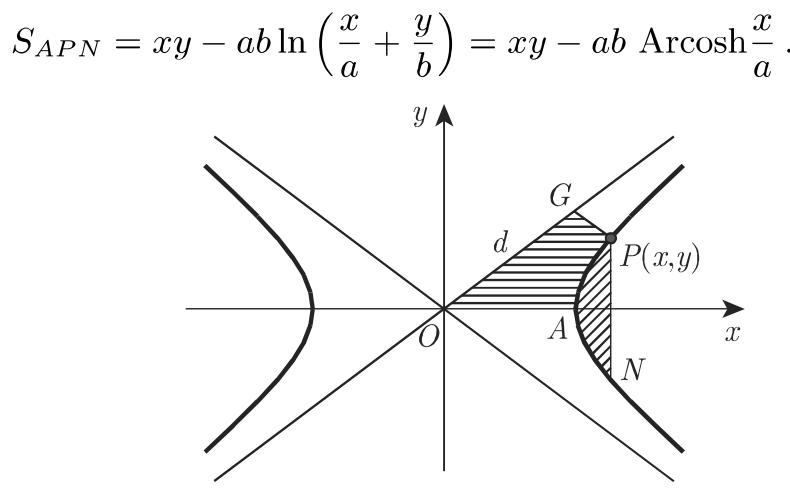
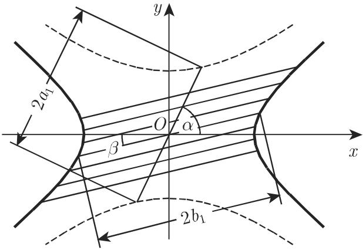
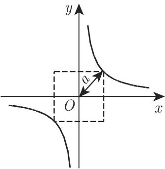
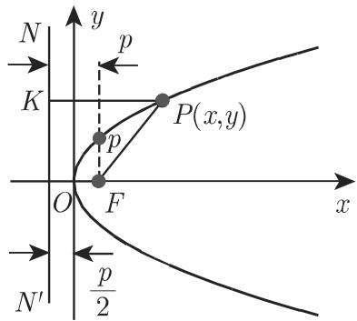
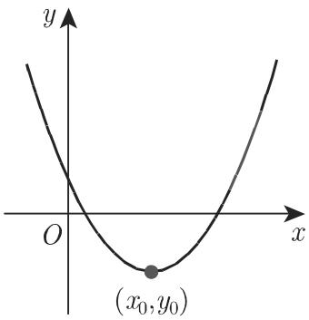
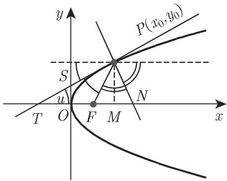

双曲线的直径是双曲线两支之间过中心的弦，双曲线的中心也是这些弦的中点．具有斜率 $k ^ { \prime }$ 的两条直径称为是共辄的，如果其中一条属千一个双曲线而另一条属千它的共扼，并且 $k k ^ { \prime } = { \frac { b ^ { 2 } } { a ^ { 2 } } }$ 成立．平行千一条直径的弦的中点位千它的共扼直径上（图 3.161)．两条共辄直径当中符合 $| k | < { \frac { b } { a } }$ 的一条与双曲线相交．如果两条共辄直径的长是 $2 a _ { 1 }$ 和 $2 b _ { 1 }$ ，并且它们与实轴之间所夹的锐角是 $\alpha$ 和 $\beta < \alpha$ ，则有等式

$$
a _ {1} ^ {2} - b _ {1} ^ {2} = a ^ {2} - b ^ {2}, \quad a b = a _ {1} b _ {1} \sin (\alpha - \beta)\tag{3.339}
$$

成立

9. 双曲线的曲率半径

双曲线在点 $P ( x _ { 0 } , y _ { 0 } )$ （图 3.159) 处的曲率半径是

$$
R = a ^ {2} b ^ {2} \left(\frac {x _ {0} ^ {2}}{a ^ {4}} + \frac {y _ {0} ^ {2}}{b ^ {4}}\right) ^ {3 / 2} = \frac {r _ {1} r _ {2} ^ {3 / 2}}{a b} = \frac {p}{\sin^ {3} u},\tag{3.340a}
$$

  
3.162

其中 是切线与连接切点和焦点的径向量之间的夹角．在顶点 处曲率半径是

$$
R _ {A} = R _ {B} = p = \frac {b ^ {2}}{a}.\tag{3.340b}
$$

  
3.161

10. 双曲线中的面积（图 3.162)

a) 弓形 APN:

(3.341a)

b) 面积 OAPG:

$$
S _ {O A P G} = \frac {a b}{4} + \frac {a b}{2} \ln \frac {2 d}{c}.\tag{3.341b}
$$

线段PG平行千下面的渐近线 是焦距， $d = O G$

11. 双曲线的弧长

就像抛物线一样，双曲线上两点 之间的弧长类似千椭圆的弧长（参见270 3.5.2.8, 9.），不能用初等方法来计算，而要用到第二类不完全椭圆积分$E ( k , \varphi )$ （参见第 654 8.1.4.3, 2.).

12. 等边双曲线

等边双曲线具有相同长度的轴，因此它的方程是

$$
x ^ {2} - y ^ {2} = a ^ {2}.\tag{3.342a}
$$

等边双曲线的渐近线是直线 $y = \pm x ;$ 它们相互垂直．如果渐近线与坐标轴重合（图 3.163) ，则其方程为

$$
x y = \frac {a ^ {2}}{2}.\tag{3.342b}
$$

3.5.2.10 抛物线

1. 抛物线的要素

在图 3.164 中， 轴与抛物线的轴重合， 是抛物线的顶点， 是抛物线的焦点，它位千 轴上且与原点的距离为 ${ \frac { p } { 2 } } ;$ 其中 称为抛物线的半焦弦．准线记作 $N N ^ { \prime }$ 它是在与焦点相对的一侧距原点 $\frac { p } { 2 }$ 处与 轴垂直相交的直线．半焦弦等千过焦点与轴垂直的弦长的一半．抛物线的数值离心率等千 （参见第 279 3.5.2.11, 4.).

  
3.163

  
3.164

2. 抛物线的方程

如果原点是抛物线的顶点且位千抛物线左侧， 轴是抛物线的轴，则抛物线方程的标准形式为

$$
y ^ {2} = 2 p x.\tag{3.343}
$$

关千极坐标形式的抛物线方程，见第 280 3.5.2.11, 6. ，具有垂直轴（图 3.165)的抛物线方程为

$$
y = a x ^ {2} + b x + c.\tag{3.344a}
$$

由这一形式给出的抛物线的参数为

$$
p = \frac {1}{2 | a |}.\tag{3.344b}
$$

如果有 $a > 0$ ，则抛物线开口朝上，当 $a < 0$ 时开口朝下．顶点的坐标是

$$
x _ {0} = - \frac {b}{2 a}, y _ {0} = \frac {4 a c - b ^ {2}}{4 a}.\tag{3.344c}
$$

3. 抛物线的性质

（抛物线的定义） 抛物线是到给定点（焦点）的距离与到给定直线（准线）的距离相等的点的轨迹（图 3.164)．在此以及在下面的笛卡儿坐标公式中，我们假设抛物线方程是由标准形式给出的，因此成立等式

$$
P F = P K = x + \frac {p}{2},\tag{3.345}
$$

其中 $F P$ 是起点在焦点而终点为抛物线上的点的径向量．

4. 抛物线的直径

抛物线的直径是平行千抛物线的轴的直线（图 3.166)．抛物线的直径平分与其端点处的切线平行的弦（图 3.166)．设弦的斜率为 k, 则直径的方程是

$$
y = \frac {p}{k}.\tag{3.346}
$$

  
3.165

  
3.166

5. 抛物线的切线（图 3.167)

抛物线在点 $P ( x _ { 0 } , y _ { 0 } )$ 处的切线方程是

$$
y y _ {0} = p \left(x + x _ {0}\right).\tag{3.347}
$$

切线和法线是从焦点出发的半径与从切点出发的直径之间所夹的角的角平分线顶点处的切线即 轴平分切点与切线在抛物线的轴即 轴上的交点之间的切线段

$$
T S = S P, \quad T O = O M = x _ {0}, \quad T F = F P.\tag{3.348}
$$

如果

$$
p = 2 b k,
$$

则方程 $y = k x + b$ 所表示的直线是抛物线的切线．

(3.349)

6. 抛物线的曲率半径

在点 $P ( x _ { 0 } , y _ { 0 } )$ 处法线PN （图 3.167) 的长为 $l _ { n }$ ，则抛物线的曲率半径是

$$
R = \frac {(p + 2 x _ {0}) ^ {3 / 2}}{\sqrt {p}} = \frac {p}{\sin^ {3} u} = \frac {l _ {n} ^ {3}}{p ^ {2}}\tag{3.350a}
$$

而在顶点 $O$ 它是

$$
R = p.\tag{3.350b}
$$

7. 抛物线中的面积（图 3.168)

a) 抛物线弓形 $_ { P O N }$

$$
S _ {O P N} = \frac {2}{3} S _ {M Q N P} (M Q N P \text {是平行四边形}).\tag{3.351a}
$$

b) 面积 OPR（抛物线曲线下的面积）

$$
S _ {O P R} = \frac {2 x y}{3}.
$$

(3.351b)

3.167  
  
3.168

8. 抛物线的弧长

从顶点 到点 $P ( x , y )$ 的一段抛物线弧长为

$$
\begin{array}{r l} & {l _ {O P} = \frac {p}{2} \left[ \sqrt {\frac {2 x}{p} \left(1 + \frac {2 x}{p}\right)} + \ln \left(\sqrt {\frac {2 x}{p}} + \sqrt {1 + \frac {2 x}{p}}\right) \right]} \\ & {\qquad = - \sqrt {x \left(x + \frac {p}{2}\right)} + \frac {p}{2} \mathrm{Arsinh} \sqrt {\frac {2 x}{p}}.} \end{array}\tag{3.352a}
$$

(3.352b)

对千 $\frac x y$ 值较小的情况可以使用下面的近似公式

$$
l _ {O P} \approx y \left[ 1 + \frac {2}{3} \left(\frac {x}{y}\right) ^ {2} - \frac {2}{5} \left(\frac {x}{y}\right) ^ {4} \right].\tag{3.352c}
$$

3.5.2.11 二次曲线（圆锥曲线）

1. 二次曲线的一般方程

利用二次曲线的一般方程

$$
a x ^ {2} + 2 b x y + c y ^ {2} + 2 d x + 2 e y + f = 0\tag{3.353a}
$$

可以定义椭圆，它的特殊情形 圆、双曲线、抛物线或作为奇异圆锥曲线的两条直线

借助表 3.19 和表 3.20 给出的坐标变换可以将这个方程化简为标准形式．

评论 (3.353a) 中的系数并非特殊圆锥曲线中的参数．

评论 如果有两个系数 (a c) 等千 0, 则所需的坐标变换简化为坐标轴的平移．

方程 $c y ^ { 2 } + 2 d x + 2 e y + f = 0$ 可以写成形式 $( y - y _ { 0 } ) ^ { 2 } = 2 p ( x - x _ { 0 } )$ ;

方程 $a x ^ { 2 } + 2 d x + 2 e y + f = 0$ 可以写成形式 $( x - x _ { 0 } ) ^ { 2 } = 2 p ( y - y _ { 0 } )$

2. 二次曲线的不变量

二次曲线的不变量是如下三个量：

$$
\Delta = \left| \begin{array}{c c c} a & b & d \\ b & c & e \\ d & e & f \end{array} \right|, \quad \delta = \left| \begin{array}{c c} a & b \\ b & c \end{array} \right|, \quad S = a + c.\tag{3.353b}
$$

它们在坐标系的旋转中保持不变，即如果在坐标变换后曲线方程具有形式

$$
a ^ {\prime} x ^ {2} + 2 b ^ {\prime} x ^ {\prime} y ^ {\prime} + c ^ {\prime} y ^ {2} + 2 d ^ {\prime} x ^ {\prime} + 2 e ^ {\prime} y ^ {\prime} + f ^ {\prime} = 0,\tag{3.353c}
$$

则用新的常数计算 $\varDelta ,$ 这三个量将得到同样的值．

3.19 二次曲线的方程有心曲线 $( \delta \neq { \bf 0 } ) ^ { * }$

<table><tr><td colspan="2">量δ和Δ</td><td colspan="2">曲线的形状</td></tr><tr><td rowspan="4">有心曲线δ≠0</td><td>δ&gt;0</td><td>Δ≠0</td><td>椭圆a)当Δ·S&lt;0:实椭圆,b)当Δ·S&gt;0:虚椭圆**</td></tr><tr><td></td><td>Δ=0</td><td>一对具有实公共点的虚**直线</td></tr><tr><td rowspan="2">δ&lt;0</td><td>Δ≠0</td><td>双曲线</td></tr><tr><td>Δ=0</td><td>一对相交直线</td></tr><tr><td colspan="2">所需坐标变换</td><td colspan="2">变换后方程的标准形式</td></tr><tr><td colspan="2">1.原点平移到曲线的中心,其坐标是 $x_0=\frac{be-cd}{\delta},y_0=\frac{bd-ae}{\delta}$ 2.将坐标轴旋转α角,这里tan2α=2b/a-csin2α的符号必须和2b的符号相一致.这里新x&#x27;轴的斜率是 $k=\frac{c-a+\sqrt{(c-a)^2+4b^2}}{2b}$ (a&#x27;和c&#x27;是二次方程u2-Su+δ=0的根)</td><td colspan="2"> $a'x'^2+c'y'^2+\frac{\Delta}{\delta}=0$  $a'=\frac{a+c+\sqrt{(a-c)^2+4b^2}}{2}$  $c'=\frac{a+c-\sqrt{(a-c)^2+4b^2}}{2}$ </td></tr></table>

凶， $S$ (3.353b) 中给出的数  
＊＊该曲线方程对应于一条虚曲线．

3. 二次曲线（圆锥曲线）的形状

如果一个对顶直圆锥被一个平面所截，则导致圆锥曲线．如果该平面不通过圆锥的顶点则结果是一个双曲线、一个抛物线或一个椭圆，这取决千该平面是否平行千圆锥的两条母线，一条母线或不平行千圆锥的任何母线．如果该平面通过顶点，则结果是一个奇异圆锥曲线，并有 $\varDelta = 0$ 圆柱，即顶点在无穷远处的奇异圆锥的圆锥曲线是平行线．圆锥曲线的形状可以借助表 3.19 和表 3.20 来确定．

4. 二次曲线的一般性质

到定点 （焦点）的距离与到定直线（准线）的距离之比为常数 的点（图 3.169)的轨迹是具有数值离心率 的二次曲线．当 $e < 1$ 时为椭圆当 $e = 1$ 时为抛物线当 $e > 1$ 时为双曲线

  
3.169

3.20 二次曲线的方程抛物曲线 $( \delta = { \bf 0 } )$

<table><tr><td colspan="3">量δ和Δ</td><td>曲线的形状</td></tr><tr><td rowspan="2">抛物曲线*,δ=0</td><td>Δ≠0</td><td>抛物线</td><td></td></tr><tr><td>Δ=0</td><td>两条直线:</td><td>平行直线,当 $d^{2}-af>0$ ,二重直线,当 $d^{2}-af=0$ ,虚**直线,当 $d^{2}-af<0$ .</td></tr><tr><td colspan="3">所需坐标变换</td><td>变换后方程的标准形式</td></tr><tr><td colspan="4">Δ≠0</td></tr><tr><td colspan="3">1.原点平移到抛物线的顶点,其坐标 $x_{0}$ 和 $y_{0}$ 由方程 $ax_{0}+by_{0}+\frac{ad+be}{S}=0$ 和 $\left(d+\frac{dc-be}{S}\right)x_{0}+\left(e+\frac{ae-bd}{S}\right)y_{0}+f=0$ </td><td> $y'^{2}=2px'$  $p=\frac{ae-bd}{S\sqrt{a^{2}+b^{2}}}$ </td></tr><tr><td colspan="4">定义.</td></tr><tr><td colspan="4">2.将坐标轴旋转α角,这里 $\tan\alpha=-\frac{a}{b};\sin\alpha$ 的符号必须不同于a的符号.</td></tr><tr><td colspan="4">Δ=0</td></tr><tr><td colspan="3">将坐标轴旋转α角,这里 $\tan\alpha=-\frac{a}{b};\sin\alpha$ 的符号必须不同于a的符号.</td><td> $Sy'^{2}+2\frac{ad+be}{\sqrt{a^{2}+b^{2}}}y'+f=0$ 可以变换成形式 $(y'-y_{0}')(y'-y_{1}')=0$ .</td></tr></table>

＊在0=0 的情形，假设系数 $a , b , c$ 都不等于 0.

＊＊该曲线方程对应千一条虚曲线

5. 通过五个点确定一条曲线

过平面上五个给定的点有且仅有一条二次曲线．如果其中有三个点位千同一条直线上，则它是奇异或退化圆锥曲线

6. 二次曲线的极坐标方程

所有二次曲线都可以表示成极坐标方程

$$
\rho = \frac {p}{1 + e \cos \varphi},\tag{3.354}
$$

其中 $p$ 是半焦弦， 是离心率．这里极点位千焦点处，而极轴从焦点指向较近的顶点对千双曲线来说这个方程只定义了它的一支
