#### 3.5.2 平面解析几何

3.5.2.1 基本概念、平面坐标系

平面的每个点 的位置可以用任意一个坐标系给出．确定点的位置的数称为坐标．大多数情况下使用笛卡儿坐标和极坐标．

1. 笛卡儿坐标

的笛卡儿坐标是在已给的确定尺度下该点到两个相互垂直的坐标轴的符号距离（图 3.120)．坐标轴的交点 称为原点．水平坐标轴称为横轴，通常为 轴，垂直坐标轴称为纵轴，通常为 轴．

  
3.120

在这些轴上给定了正向：通常 轴的正向朝右， 轴的正向朝上．点 的坐标的正负取决千该点在哪半轴上的投影（图 3.121)．坐标 分别称为点 的横坐标和纵坐标．具有横坐标 和纵坐标 的点记作 $P ( \boldsymbol { a } , \boldsymbol { b } )$ . x, 平面被坐标轴分成四个象限 I,II,III IV （图 3.121(a)).

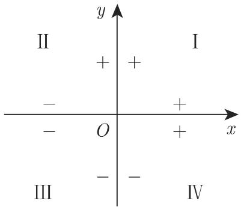  
(a)

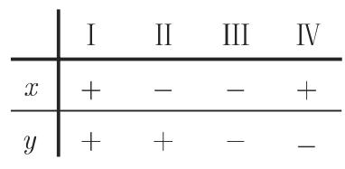  
(b)  
3.121

2. 极坐标

的极坐标（图 3.122) 是极径 $\rho ,$ 即该点到一个给定的极点 的距离，以及极角 $\varphi$ 即直线 $O P$ 与一条给定的穿过极点的射线（极轴）之间的夹角．极点也称为原点．如果从极轴出发按逆时针度量则极角为正的，否则为负

3. 曲线坐标系

这一坐标系由平面上两个单参数曲线族，即坐标曲线族（图 3.123) 构成．通过平面上的每一点恰好有两个族中一条曲线它们在该点彼此相交．对应千该点的参数是它的曲线坐标在图 3.123 中点 具有曲线坐标 $u = a _ { 1 }$ 和 $v = b _ { 3 }$ . 在笛卡儿坐标系中，坐标曲线是平行千坐标轴的直线在极坐标系中，坐标曲线是以极点为圆心的同心圆和从极点发出的射线．

  
3.122

  
3.123

3.5.2.2 坐标变换

在将一个笛卡儿坐标系变换成另外一个笛卡儿坐标系时坐标将按确定的法则发生改变

1. 坐标轴的平移

将横坐标轴移动 单位，纵坐标轴移动 单位（图 3.124)．假设点 在平移前具有坐标 $x , y ,$ 之后具有坐标 $x ^ { \prime } , y ^ { \prime }$ ．新原点 $O ^ { \prime }$ 的旧坐标是 $^ { a , }$ b. 新旧坐标之间的关系如下：

$$
x = x ^ {\prime} + a, \quad y = y ^ {\prime} + b,\tag{3.286a}
$$

$$
x ^ {\prime} = x - a, \quad y ^ {\prime} = y - b.\tag{3.286b}
$$

2. 坐标轴的旋转

将坐标轴旋转一个角度 $\varphi$ （图 3.125)，得到如下的坐标变换：

$$
\begin{array}{r l} & x ^ {\prime} = x \cos \varphi + y \sin \varphi , \\ & y ^ {\prime} = - x \sin \varphi + y \cos \varphi , \\ & x = x ^ {\prime} \cos \varphi - y ^ {\prime} \sin \varphi , \\ & y = x ^ {\prime} \sin \varphi + y ^ {\prime} \cos \varphi . \end{array}\tag{3.287a}
$$

(3.287b)

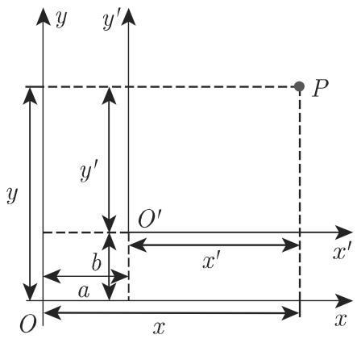  
3.124

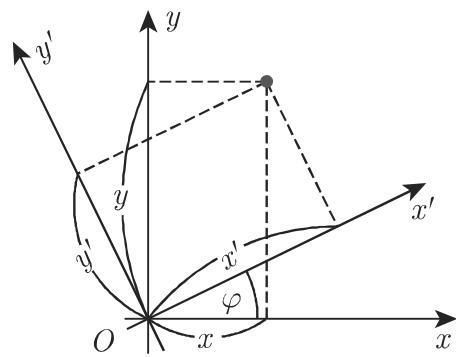  
3.125

属千 (3.287a) 的矩阵

$$
\boldsymbol {D} = \left( \begin{array}{c c} {{\cos \varphi}} & {{\sin \varphi}} \\ {{- \sin \varphi}} & {{\cos \varphi}} \end{array} \right) \text {用于} \binom{{{x ^ {\prime}}}}{{{y ^ {\prime}}}} = \boldsymbol {D} \binom{{{x}}}{{{y}}} \text {和} \binom{{{x}}}{{{y}}} = \boldsymbol {D} ^ {- 1} \binom{{{x ^ {\prime}}}}{{{y ^ {\prime}}}}\tag{3.287c}
$$

称为旋转矩阵．

一般来说一个笛卡儿坐标系到另一个笛卡儿坐标系的变换可以分作两步：坐标轴的平移和旋转

评论 利用这里讨论的所谓坐标变换虽然改变了坐标系，但所表示的对象仍然处在它的位置．相比之下，利用所谓的几何变换将改变对象，但坐标系却仍处在它的位置而不发生改变．

在第 308 3.5.4.1, 我们用

$$
\left( \begin{array}{l} x _ {P} ^ {\prime} \\ y _ {P} ^ {\prime} \end{array} \right) = \boldsymbol {R} \left( \begin{array}{l} x _ {P} \\ y _ {P} \end{array} \right)\tag{3.288}
$$

刻画一个对象的旋转，其中 是旋转矩阵． 之间存在关系

$$
\boldsymbol {R} = \boldsymbol {D} ^ {- 1}.\tag{3.289}
$$

3. 笛卡儿坐标与极坐标之间的变换

假设原点与极点重合并且横坐标轴与极轴重合（图 3.126)，则有

$$
\begin{array}{r l} & {x = \rho (\varphi) \cos \varphi , \quad y = \rho (\varphi) \sin \varphi \quad (- \pi <   \varphi \leqslant \pi , \rho \geqslant 0);} \\ & {\qquad \qquad \qquad \qquad \qquad \rho = \sqrt {x ^ {2} + y ^ {2}},} \\ & {\varphi = \left\{ \begin{array}{l l} {{\arctan {\frac {y}{x}} + \pi ,}} & {{x <   0,}} \\ {{\arctan {\frac {y}{x}},}} & {{x > 0,}} \\ {{\frac {\pi}{2},}} & {{x = 0, y > 0,}} \\ {{- \frac {\pi}{2},}} & {{x = 0, y <   0,}} \\ {{\text {未定义},}} & {{x = y = 0.}} \end{array} \right.} \end{array}\tag{3.290a}
$$

(3.290b)

(3.290c)

  
3.126

3.5.2.3 平面上的特殊点

1. 两点之间的距离

如果在笛卡儿坐标系中给定两点 $P _ { 1 } ( x _ { 1 } , y _ { 1 } )$ 和 $P _ { 2 } ( x _ { 2 } , y _ { 2 } )$ （图 3.127) ，则它们的距离是

$$
d = \sqrt {\left(x _ {2} - x _ {1}\right) ^ {2} + \left(y _ {2} - y _ {1}\right) ^ {2}}.\tag{3.291}
$$

如果它们由极坐标给出为 $P _ { 1 } ( \rho _ { 1 } , \varphi _ { 1 } )$ 和 $P _ { 2 } ( \rho _ { 2 } , \varphi _ { 2 } )$ （图 3.128) ，则它们的距离是

$$
d = \sqrt {\rho_ {1} ^ {2} + \rho_ {2} ^ {2} - 2 \rho_ {1} \rho_ {2} \cos (\varphi_ {2} - \varphi_ {1})}.\tag{3.292}
$$

  
3.127

  
3.128

2. 质心坐标

具有质量 $m _ { i } ( i = 1 , 2 , \cdots , n )$ 的质点系 $M _ { i } \left( x _ { i } , y _ { i } \right)$ 的质心坐标 $( x , y )$ 由下列公式计算：

$$
x = \frac {\sum m _ {i} x _ {i}}{\sum m _ {i}}, \quad y = \frac {\sum m _ {i} y _ {i}}{\sum m _ {i}}.\tag{3.293}
$$

3. 线段的分割

(1) 定比分割 线段 $\overline { { P _ { 1 } P _ { 2 } } }$ 的具有分割比 ${ \frac { \overline { { { P _ { 1 } } { P } } } } { \overline { { { P P _ { 2 } } } } } } = { \frac { m } { n } } = \lambda$ 点 的坐标由公式

$$
x = \frac {n x _ {1} + m x _ {2}}{n + m} = \frac {x _ {1} + \lambda x _ {2}}{1 + \lambda},\tag{3.294a}
$$

$$
y = \frac {n y _ {1} + m y _ {2}}{n + m} = \frac {y _ {1} + \lambda y _ {2}}{1 + \lambda}\tag{3.294b}
$$

计算对千线段 $\overline { { P _ { 1 } P _ { 2 } } }$ 的中点 M, 因为入＝ 1,

$$
x = \frac {x _ {1} + x _ {2}}{2},\tag{3.294c}
$$

$$
y = \frac {y _ {1} + y _ {2}}{2}.\tag{3.294d}
$$

可以定义 $\overline { { P _ { 1 } P } }$ 和 ${ \overline { { P P } } } _ { 2 }$ 符号．它们的符号的正负依赖千它们的方向是否与$\overline { { P _ { 1 } P _ { 2 } } }$ 致因此在情形入 $< 0$ 下，公式 (3.294a, b) 得到线段 $\overline { { P _ { 1 } P _ { 2 } } }$ 之外的一点．这称为外分．

如果 在线段 $\overline { { P _ { 1 } P _ { 2 } } }$ 之内，它称为内分．我们定义

a) 如果 $P = P _ { 1 }$ ，则 $\lambda = 0$

b) 如果 $P = P _ { 2 }$ 则 $\lambda = \infty$

c) 如果 是直线 的一个无穷远点或反常点即如果 $g$ 上距离 $\overline { { P _ { 1 } P _ { 2 } } }$ 无穷远则入＝— 1.

3.129(b) 显示的是入的形状．

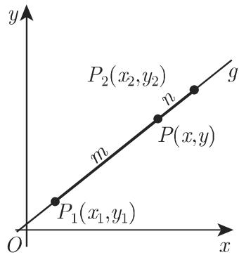  
(a)

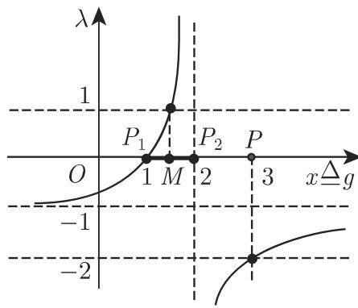  
(b)  
3.129

·对千一点 $P _ { \mathrm { : } }$ 如果 $P _ { 2 }$ 是线段 $\overline { { P _ { 1 } P } }$ 的中点则成立有 $\lambda = { \frac { \overline { { P _ { 1 } P } } } { \overline { { P P _ { 2 } } } } } = - 2$

(2) 调和分割 如果一个线段的内分和外分具有相同的绝对值 $| \lambda |$ ，则产生调和分割． $P _ { i }$ 和 $P _ { a }$ 分别表示内分点和外分点 $\lambda _ { i }$ 丛 $\lambda _ { a }$ 别表示内分比和外分比．则

$$
\frac {\overline {{P _ {1} P _ {i}}}}{\overline {{P _ {i} P _ {2}}}} = \lambda_ {i} = \frac {\overline {{P _ {1} P _ {a}}}}{\overline {{P _ {a} P _ {2}}}} = - \lambda_ {a}\tag{3.295a}
$$

或

$$
\lambda_ {i} + \lambda_ {a} = 0.\tag{3.295b}
$$

如果 表示线段 $\overline { { P _ { 1 } P _ { 2 } } }$ 的中点它与 $P _ { 1 }$ 的距离是 （图 3.130), $P _ { i }$ 和 $P _ { a }$ 与的距离分别记作 $x _ { i }$ 和 $x _ { a }$ ，则

$$
\frac {b + x _ {i}}{b - x _ {i}} = \frac {x _ {a} + b}{x _ {i} - b} \quad \text {或} \quad \frac {x _ {i}}{b} = \frac {b}{x _ {a}}, \quad \text {即}, \quad x _ {i} x _ {a} = b ^ {2}.\tag{3.296}
$$

名称调和分割与调和平均有关．在图 3.131 中，对千 $\lambda = 5 { : } 1$ 表示了调和分割，与图 3.14 类似根据 (3.295a) ，线段 ${ \overline { { P _ { 1 } P _ { i } } } } = p$ 和 $\overline { { P _ { 1 } P _ { a } } } = q$ 的调和平均 $r$ 与第 25(1.67b) 一致，等千

$$
r = \frac {2 p q}{p + q} = 2 b \quad (\text {参见图} 3. 1 3 2).\tag{3.297}
$$

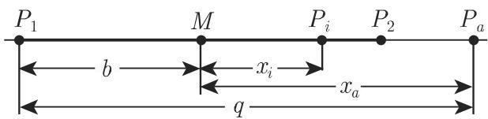  
3.130

  
3.131

  
3.132

(3) 黄金分割 一线段 的黄金分割是将它分成两部分 $a - x$ 使得分与整个线段和 a-x 部分与 部分具有相同的比：

$$
{\frac {x}{a}} = {\frac {a - x}{x}}.\tag{3.298a}
$$

在此情形， $x$ 是 $a$ 和 $a - x$ 的儿何平均（参见第 1.1.1.2 中的黄金分割），它成立有

$$
x = \sqrt {a (a - x)},\tag{3.298b}
$$

$$
x = \frac {a (\sqrt {5} - 1)}{2} \approx 0. 6 1 8 \cdot a.\tag{3.298c}
$$

该线段的 部分可以如图 3.133(a) 所示通过儿何作图给出．

评论 线段 也是具有外接圆半径 $a$ 的正十边形的边长（参见第 1823.1.5.3).

评论 下面的儿何问题也导致黄金分割方程：给定一个具有常数边长 $a$ 和变量边长 $a - x$ 的矩形求 的值使得该矩形的面积 $a ( a - x )$ 等千以 $x$ 为边长的正方形的面积 $x ^ { 2 }$ （图 3.133(b)).

  
(a)

  
(b)  
3.133

3.5.2.4 面积

1. 凸多边形面积

如果给定凸多边形的顶点 $P _ { 1 } ( x _ { 1 } , y _ { 1 } ) , P _ { 2 } ( x _ { 2 } , y _ { 2 } ) , \cdots , P _ { n } ( x _ { n } , y _ { n } )$ ），则它的面积是S = 1-2 [(x1 一心）如＋如＋（四—邓）伽＋如＋···+（吓— m) 也＋如）］．

(3.299)

如果按反时针顺序计数顶点则公式 (3.299) (3.300) 得出正的面积，否则面积为负

2. 三角形面积

如果给定三角形的顶点 $P _ { 1 } ( x _ { 1 } , y _ { 1 } ) , P _ { 2 } ( x _ { 2 } , y _ { 2 } )$ 和 $P _ { 3 } ( x _ { 3 } , y _ { 3 } )$ （图 3.134) ，则其面积可以用以下公式计算：

$$
\begin{array}{l} S = \frac {1}{2} \left| \begin{array}{c c c} x _ {1} & y _ {1} & 1 \\ x _ {2} & y _ {2} & 1 \\ x _ {3} & y _ {3} & 1 \end{array} \right| = \frac {1}{2} \left[ x _ {1} \left(y _ {2} - y _ {3}\right) + x _ {2} \left(y _ {3} - y _ {1}\right) + x _ {3} \left(y _ {1} - y _ {2}\right) \right] \\ = \frac {1}{2} \left[ \left(x _ {1} - x _ {2}\right) \left(y _ {1} + y _ {2}\right) + \left(x _ {2} - x _ {3}\right) \left(y _ {2} + y _ {3}\right) + \left(x _ {3} - x _ {1}\right) \left(y _ {3} + y _ {1}\right) \right]. \end{array}\tag{3.300}
$$

如果 $\left| { \begin{array} { c c c } { x _ { 1 } } & { y _ { 1 } } & { 1 } \\ { x _ { 2 } } & { y _ { 2 } } & { 1 } \\ { x _ { 3 } } & { y _ { 3 } } & { 1 } \end{array} } \right| = 0$ 成立，则三点 $P _ { 1 } , P _ { 2 } , P _ { 3 }$ 共线

(3.301)

  
3.134

3.5.2.5 曲线方程

对千坐标 而言方程 $F ( x , y ) = 0$ 常常对应千一条曲线它具有如下性质这条曲线上的每个点 的坐标满足该方程，反之，坐标满足该方程的任何点都在这条曲线上．这些点的集合也称几何轨迹，或简称轨迹．如果平面上没有任何实点满足方程 $F ( x , y ) = 0$ ，则不存在任何实曲线，这时我们谈论的就是一条虚曲线．■ $\mathbf { A } \colon x ^ { 2 } + y ^ { 2 } + 1 = 0$

■ B: $y - \ln { \big ( } 1 - x ^ { 2 } - \cosh x { \big ) } = 0$

如果 $F ( x , y )$ 是一个多项式，则相应千方程 $F ( x , y ) = 0$ 的曲线称为代数曲线，该多项式的次数也是曲线的次数或阶数（参见第 83 2.3.4)．如果曲线方程不能够变形成 $F ( x , y ) = 0$ ，其中 $F ( x , y )$ 是多项式则该曲线称为超越曲线

曲线方程可以在任何一个坐标系中以相同的方式定义．但本书从现在起只使用笛卡儿坐标系，除非另作说明

3.5.2.6 直线

1. 直线方程

每个坐标线性方程都表示一条直线反之，每条直线的方程都是一个坐标线性方程

(1) 直线的一般方程

$$
A x + B y + C = 0 \quad (A, B, C \text {是常数}).\tag{3.302}
$$

当 $A = 0$ 时直线平行千 $B = 0$ 时直线平行千 $y$ 轴， $C = 0$ 时直线通过原点（图 3.135).

(2) 直线的斜截式方程 $y$ 轴不平行的任何一条直线可以用如下形式的方程表示：

$$
y = k x + b \quad (k, b   \text {是常数}).\tag{3.303}
$$

称为是直线的斜率或角系数；它等千该直线与 轴正向夹角的正切（图 3.136).直线在 轴上的截距是 b. 斜率和 的值都可以为负，这取决千直线的位置．

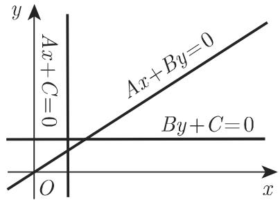  
3.135

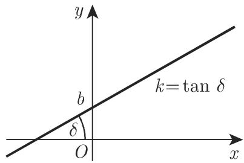  
3.136

(3) 直线的点斜式方程 以给定方向（图 3.137) 通过一给定点 $P _ { 1 } ( x _ { 1 } , y _ { 1 } )$ 的直线方程是

$$
y - y _ {1} = k \left(x - x _ {1}\right), \quad \text {其中} \quad k = \tan \delta .\tag{3.304}
$$

(4) 直线的两点式方程 如果给定直线上两点 $P _ { 1 } ( x _ { 1 } , y _ { 1 } )$ 和 $P _ { 2 } ( x _ { 2 } , y _ { 2 } )$ （图 3.138),则直线的方程是

$$
{\frac {y - y _ {1}}{y _ {2} - y _ {1}}} = {\frac {x - x _ {1}}{x _ {2} - x _ {1}}}.\tag{3.305}
$$

(5) 直线的截距式方程 如果直线在坐标轴上的截距是 $a$ 和 $b ,$ ，考虑它们的符号，则直线的方程是（图 3.139)

$$
\frac {x}{a} + \frac {y}{b} = 1.\tag{3.306}
$$

  
3.137

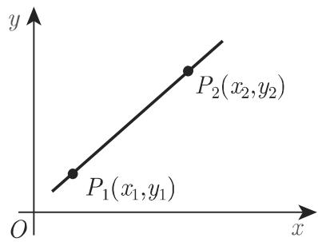  
3.138

  
3.139

  
3.140

(6) 直线方程的法线式（黑塞法式） 是原点到直线的距离， 轴与过原点的法线之间的夹角（图 3.140)，其中 $p > 0$ ，而 $0 \leqslant \alpha < 2 \pi$ ，则直线方程的黑塞法式为

$$
x \cos \alpha + y \sin \alpha - p = 0.\tag{3.307}
$$

黑塞法式可以从直线的一般方程 (3.302) 通过乘以正规化因子

$$
\mu = \pm \frac {1}{\sqrt {A ^ {2} + B ^ {2}}}\tag{3.308}
$$

得到 $\mu$ 的符号必须和 (3.302) 的符号相反．

(7)直线的极坐标方程（图 3.141) 是极点到直线的距离（从极点到直线的法线段）， $\alpha$ 是极轴与过极点到直线的法线之间的夹角，则该直线的极坐标方程为

$$
\rho = \frac {p}{\cos (\varphi - \alpha)}.\tag{3.309}
$$

2. 点到直线的距离

点 $P _ { 1 } ( x _ { 1 } , y _ { 1 } )$ 到一条直线的距离 （图 3.140) 可以通过将该点的坐标代入黑塞法式 (3.307) 左边得到

$$
d = x _ {1} \cos \alpha + y _ {1} \sin \alpha - p.\tag{3.310}
$$

如果 $P _ { 1 }$ 和原点位千直线的两侧，则有 $d > 0$ 否则有 $d < 0$

3. 直线的交点

(1) 两条直线的交点 为了得到两条直线的交点坐标 $( x _ { 0 } , y _ { 0 } )$ ，需要解它们的方程构成的方程组．如果两条直线的方程是

$$
A _ {1} x + B _ {1} y + C _ {1} = 0, \quad A _ {2} x + B _ {2} y + C _ {2} = 0,\tag{3.311a}
$$

则它们的解为

$$
x _ {0} = \frac {\left| \begin{array}{c c} B _ {1} & C _ {1} \\ B _ {2} & C _ {2} \end{array} \right|}{\left| \begin{array}{c c} A _ {1} & B _ {1} \\ A _ {2} & B _ {2} \end{array} \right|}, \quad y _ {0} = \frac {\left| \begin{array}{c c} C _ {1} & A _ {1} \\ C _ {2} & A _ {2} \end{array} \right|}{\left| \begin{array}{c c} A _ {1} & B _ {1} \\ A _ {2} & B _ {2} \end{array} \right|}.\tag{3.311b}
$$

如果 $\left| { \begin{array} { c c } { A _ { 1 } } & { B _ { 1 } } \\ { A _ { 2 } } & { B _ { 2 } } \end{array} } \right| = 0$ 成立，则两条直线平行．如果 ${ \frac { A _ { 1 } } { A _ { 2 } } } = { \frac { B _ { 1 } } { B _ { 2 } } } = { \frac { C _ { 1 } } { C _ { 2 } } }$ 成立，则两条直线重合

(2) 直线束 如果有第三条直线

$$
A _ {3} x + B _ {3} y + C _ {3} = 0\tag{3.312a}
$$

通过前两条直线的交点（图 3.142)，则关系

$$
\left| \begin{array}{c c c} A _ {1} & B _ {1} & C _ {1} \\ A _ {2} & B _ {2} & C _ {2} \\ A _ {3} & B _ {3} & C _ {3} \end{array} \right| = 0\tag{3.312b}
$$

必须满足

方程

$$
\left(A _ {1} x + B _ {1} y + C _ {1}\right) + \lambda \left(A _ {2} x + B _ {2} y + C _ {2}\right) = 0 (- \infty <   \lambda <   + \infty)\tag{3.312c}
$$

给出了通过两条直线 (3.311a) 的交点 $P _ { 0 } ( x _ { 0 } , y _ { 0 } )$ 的全部直线 $( A _ { 2 } x + B _ { 2 } y + C _ { 2 } =$ 除外）．（3.312c) 定义了以 $P _ { 0 } ( x _ { 0 } , y _ { 0 } )$ 为中心的平面束．如果最初的两条直线方程由法线式给出，则 $\lambda { = } ~ \pm 1$ 时得到交点处角的平分线方程（图 3.143).

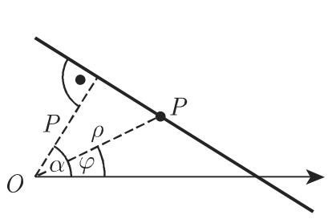  
3.141

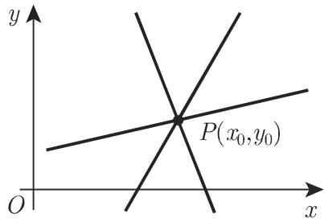  
3.142

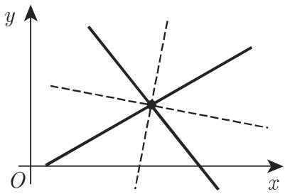  
3.143

4. 两条直线的夹角

3.144 中有两条相交直线如果它们的方程由一般式

$$
A _ {1} x + B _ {1} y + C _ {1} = 0 \quad {\text {和}} \quad A _ {2} x + B _ {2} y + C _ {2} = 0\tag{3.313a}
$$

给出，则对千角 $\varphi ,$ 成立有

$$
\tan \varphi = \frac {A _ {1} B _ {2} - A _ {2} B _ {1}}{A _ {1} A _ {2} + B _ {1} B _ {2}},\tag{3.313b}
$$

$$
\cos \varphi = \frac {A _ {1} A _ {2} + B _ {1} B _ {2}}{\sqrt {A _ {1} ^ {2} + B _ {1} ^ {2}} \sqrt {A _ {2} ^ {2} + B _ {2} ^ {2}}},\tag{3.313c}
$$

$$
\sin \varphi = \frac {A _ {1} B _ {2} - A _ {2} B _ {1}}{\sqrt {A _ {1} ^ {2} + B _ {1} ^ {2}} \sqrt {A _ {2} ^ {2} + B _ {2} ^ {2}}}.\tag{3.313d}
$$

借助两条相交直线的斜 $k _ { 1 }$ 伈和 $k _ { 2 }$ 则有

$$
\tan \varphi = \frac {k _ {2} - k _ {1}}{1 + k _ {1} k _ {2}},\tag{3.313e}
$$

$$
\cos \varphi = \frac {1 + k _ {1} k _ {2}}{\sqrt {1 + k _ {1} ^ {2}} \sqrt {1 + k _ {2} ^ {2}}},\tag{3.313f}
$$

$$
\sin \varphi = \frac {k _ {2} - k _ {1}}{\sqrt {1 + k _ {1} ^ {2}} \sqrt {1 + k _ {2} ^ {2}}},\tag{3.313g}
$$

这里的角 $\varphi$ 是按从第一条直线到第二条直线的逆时针方向度量的．

对千平行直线（图 3.145(a)) 有等式— ${ \frac { A _ { 1 } } { A _ { 2 } } } = { \frac { B _ { 1 } } { B _ { 2 } } }$ 或 $k _ { 1 } = k _ { 2 }$ 成立．

  
3.144

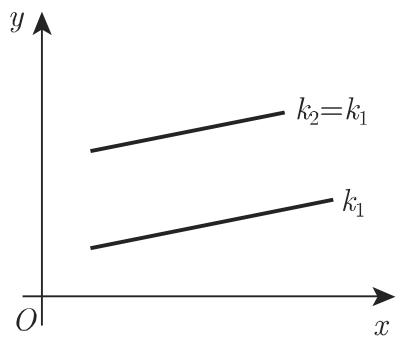  
(a)

  
(b)  
3.145

对千垂直（正交）直线（图 3.145(b)）有 $A _ { 1 } A _ { 2 } + B _ { 1 } B _ { 2 } = 0$ 或 $k _ { 2 } = - \frac { 1 } { k _ { 1 } }$ 成立

3.5.2.7

1. 圆的定义

与给定的点具有相同的给定距离的点的轨迹称为圆．给定的距离称为该圆的半径而给定的点称为该圆的圆心

2. 圆的笛卡儿坐标方程

当圆心在原点时（图 3.146(a)），圆的笛卡儿坐标方程为

$$
x ^ {2} + y ^ {2} = R ^ {2}.\tag{3.314a}
$$

  
(a)

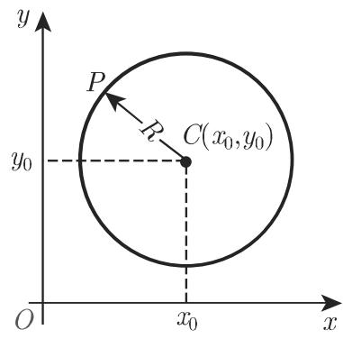  
3.146  
(b)

如果圆心在点 $C ( x _ { 0 } , y _ { 0 } )$ （图 3.146(b) ），则方程为

$$
(x - x _ {0}) ^ {2} + (y - y _ {0}) ^ {2} = R ^ {2}.\tag{3.314b}
$$

一般的二次方程

$$
a x ^ {2} + 2 b x y + c y ^ {2} + 2 d x + 2 e y + f = 0\tag{3.315a}
$$

只有当 $b = 0$ 和 $a = c$ 时才成为圆的方程在此情形该方程总能变换成形式

$$
x ^ {2} + y ^ {2} + 2 m x + 2 n y + q = 0.\tag{3.135b}
$$

对千该圆的半径和圆心坐标有下列等式成立：

$$
R = \sqrt {m ^ {2} + n ^ {2} - q},\tag{3.316a}
$$

$$
x _ {0} = - m, \quad y _ {0} = - n.\tag{3.316b}
$$

如果 $q > m ^ { 2 } + n ^ { 2 }$ 立，则该方程定义了一条虚曲线；如果 $q = m ^ { 2 } + n ^ { 2 }$ ，则曲线只是单独一个点 $P ( x _ { 0 } , y _ { 0 } )$

3. 圆的参数表达式

$$
x = x _ {0} + R \cos t, y = y _ {0} + R \sin t,\tag{3.317}
$$

其中 是动半径与 轴正向之间的夹角（图 3.147).

4. 圆的极坐标方程

在与图 3.148 对应的一般情形中，圆的极坐标方程为

$$
\rho^ {2} - 2 \rho \rho_ {0} \cos (\varphi - \varphi_ {0}) + \rho_ {0} ^ {2} = R ^ {2}.\tag{3.318a}
$$

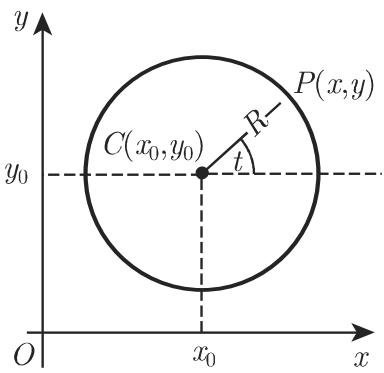  
3.147

  
3.148

如果圆心在极轴上且圆通过极点（图 3.149)，则方程具有形式

$$
\rho = 2 R \cos \varphi .\tag{3.318b}
$$

5. 圆的切线

(3.314a) 给出的圆在点 $P ( x _ { 0 } , y _ { 0 } )$ 处的切线（图 3.150) 方程具有形式

$$
x x _ {0} + y y _ {0} = R ^ {2}.\tag{3.319}
$$

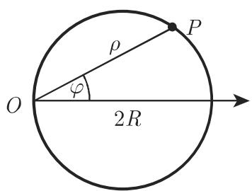  
3.149

  
3.150

3.5.2.8 椭圆

1. 椭圆的要素

在图 3.151 中， AB=2a 是长轴， CD= 2b 是短轴， A,B,C,D 是顶点， $F _ { 1 }$ $F _ { 2 }$ 是两侧与中心距离为 $c = { \sqrt { a ^ { 2 } - b ^ { 2 } } }$ 的焦点， $e = \frac { c } { a } < 1$ 是数值离心率， $p = { \frac { b ^ { 2 } } { a } }$ 是半焦弦，即过焦点平行千短轴的弦的一半．

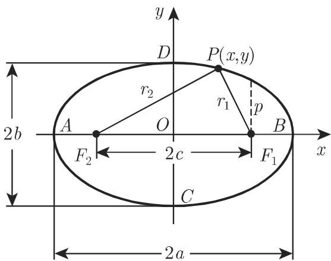  
3.151

2. 椭圆的方程

如果坐标轴与椭圆的长短轴重合，椭圆的方程具有标准形式．这一方程以及这一方程的参数形式是

$$
\frac {x ^ {2}}{a ^ {2}} + \frac {y ^ {2}}{b ^ {2}} = 1,\tag{3.320a}
$$

$$
x = a \cos t, y = b \sin t.\tag{3.320b}
$$

关千用极坐标给出的椭圆方程，参见第 280 3.5.2.11, 6..

3. 椭圆的定义焦点性质

椭圆是与两个给定点（焦点）的距离之和等千常数 2a 的点的轨迹．这两段距离也称为椭圆上的点的焦半径，可以由如下等式表示为坐标 的函数：

$$
r _ {1} = \overline {{F _ {1} P}} = a - e x, r _ {2} = \overline {{F _ {2} P}} = a + e x, r _ {1} + r _ {2} = 2 a.\tag{3.321}
$$

在此以及在下面的笛卡儿坐标公式中，我们假设椭圆方程是由标准形式给出的．

4. 椭圆的准线

椭圆的准线是与椭圆的短轴平行并和它距离为 $d = a / e$ 的直线（图 3.152)．椭圆上的每个点 $P ( x , y )$ 满足等式

$$
\frac {r _ {1}}{d _ {1}} = \frac {r _ {2}}{d _ {2}} = e,\tag{3.322}
$$

这一性质也可以当作椭圆的定义

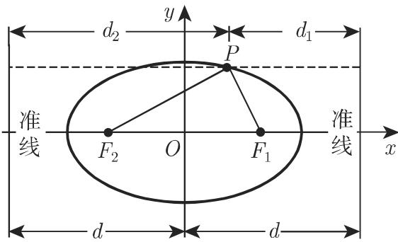  
3.152

5. 椭圆的直径

通过椭圆中心的弦称为椭圆的直径．椭圆的中心也是该直径的中点（图 3.153).平行千同一直径的所有弦的中点的轨迹也是一条直径；它称为前一条直径的共辄直径．对千两条共辄直径的斜率 $k$ 和 $k ^ { \prime }$ ，等式

$$
k k ^ {\prime} = \frac {- b ^ {2}}{a ^ {2}}\tag{3.323}
$$

成 $\underline { { \vec { \mathbf { \Pi } } } }$ 如果 $2 a _ { 1 }$ 和 $2 b _ { 1 }$ 是两条共辄直径的长， $\alpha$ 和 $\beta .$ 是两条直径与长轴所夹的锐角，从而 $k = - \mathrm { t a n } \alpha$ 和 $k ^ { \prime } = \tan \beta$ 成立，则有下面形式的阿波 $\mathscr { G }$ 尼奥斯定理：

$$
a _ {1} b _ {1} \sin (\alpha + \beta) = a b, \quad a _ {1} ^ {2} + b _ {1} ^ {2} = a ^ {2} + b ^ {2}.\tag{3.324}
$$

6. 椭圆的切线

在点 $P ( x _ { 0 } , y _ { 0 } )$ 处椭圆的切线由方程

$$
\frac {x x _ {0}}{a ^ {2}} + \frac {y y _ {0}}{b ^ {2}} = 1\tag{3.325}
$$

给出．椭圆在点 处的法线和切线（图 3.154) 是连接点 $P$ 与焦点的半径所形成的内角和外角的角平分线．如果有等式

$$
A ^ {2} a ^ {2} + B ^ {2} b ^ {2} - C ^ {2} = 0\tag{3.326}
$$

成立，则直线 $A x + B y + C = 0$ 是该椭圆的切线．

  
3.153

  
3.154

7. 椭圆的曲率半径（图 3.154)

如果 表示切线与连接切点 $P ( x _ { 0 } , y _ { 0 } )$ 和焦点的径向量之间的夹角，则曲率半径是

$$
R = a ^ {2} b ^ {2} \left(\frac {x _ {0} ^ {2}}{a ^ {4}} + \frac {y _ {0} ^ {2}}{b ^ {4}}\right) ^ {\frac {3}{2}} = \frac {(r _ {1} r _ {2}) ^ {\frac {3}{2}}}{a b} = \frac {p}{\sin^ {3} u}.\tag{3.327}
$$

在顶点 以及 $D _ { ; }$ ，曲率半径分别是 $R _ { A } = R _ { B } = { \frac { b ^ { 2 } } { a } } = p$ 和 $R _ { C } = $ $R _ { D } = { \frac { a ^ { 2 } } { b } }$

8. 椭圆的面积（图 3.155)

a) 椭圆：

$$
S = \pi a b.\tag{3.328a}
$$

b) 椭圆扇形 BOP:

$$
S _ {B O P} = \frac {a b}{2} \arccos {\frac {x}{a}}.\tag{3.328b}
$$

c) 椭圆弓形 PBN:

$$
S _ {P B N} = a b \arccos {\frac {x}{a}} - x y.\tag{3.328c}
$$

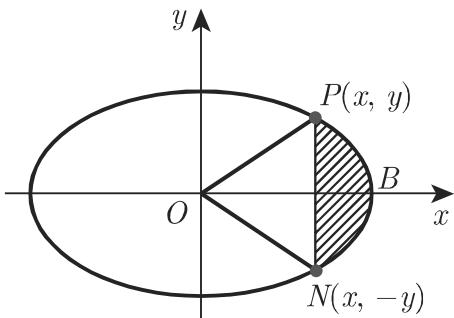  
3.155

9. 椭圆的弧长和周长

就像抛物线一样，椭圆上两点 之间的弧长不能用初等方法来计算，而要用到第二类不完全椭圆积分 $E ( k , \varphi )$

椭圆的周长（参见第 668 8.2.2.2, 2.）可以用具有数值离心率 $e = { \frac { \sqrt { a ^ { 2 } - b ^ { 2 } } } { a } }$ 和 $\varphi = \frac { \pi } { 2 }$ （对千四分之一周长）的第二类完全椭圆积分 $E ( e ) = E \left( e , { \frac { \pi } { 2 } } \right)$ 计矗，它等千

$$
L = 4 a E \left(k, {\frac {\pi}{2}}\right) = 4 a \int_ {0} ^ {\pi / 2} {\sqrt {1 - k ^ {2} \sin^ {2} \psi}}, \quad {\text {其中}} \quad k = e = {\frac {{\sqrt {a ^ {2} - b ^ {2}}}}{a}}.\tag{3.329a}
$$

$L = 4 a E \left( E , { \frac { \pi } { 2 } } \right) = 4 a E ( e )$ 的计算可以借助下面的方法完成

a) 级数展开

$$
L = 4 a E (e) = 2 \pi a \left[ 1 - \left(\frac {1}{2}\right) ^ {2} e ^ {2} - \left(\frac {1 \cdot 3}{2 \cdot 4}\right) ^ {2} \frac {e ^ {4}}{3} - \left(\frac {1 \cdot 3 \cdot 5}{2 \cdot 4 \cdot 6}\right) ^ {2} \frac {e ^ {6}}{5} - \dots \right],\tag{3.329b}
$$

$$
L = \pi (a + b) \left(1 + {\frac {\lambda^ {2}}{4}} + {\frac {\lambda^ {4}}{6 4}} + {\frac {\lambda^ {6}}{2 5 6}} + {\frac {2 5 \lambda^ {8}}{1 6 3 8 4}} + \dots\right), \quad \text {其中} \quad \lambda = {\frac {a - b}{a + b}}.\tag{3.329c}
$$

b) 近似公式

$$
L \approx \pi \left[ 1, 5 (a + b) - \sqrt {a b} \right]\tag{3.329d}
$$

或

$$
L \approx \pi (a + b) \frac {6 4 - 3 \lambda^ {4}}{6 4 - 1 6 \lambda^ {2}}.\tag{3.329e}
$$

c) 利用第 1424 页关千第二类完全椭圆积分的表 21.9.

d) 确定 (3.329a) 中积分的数值积分方法．

·对千 $a = 1 . 5 , b = 1$ 我们得到下面的 的近似值：根据 (3.329e) $L \approx 7 . 9 3 2 7$ 借助第 1424 页表 21.9 $L \approx 7 . 9 4$ （参见第 654 8.1.4.3, ．)，应用数值积分得更精确的值 $L \approx 7 . 9 3 2 7 2 1$

3.5.2.9 双曲线

1. 双曲线的要素

在图 3.156 中， $A B = 2 a$ 是实轴； A,B 是顶点； 是中心； $F _ { 1 }$ 凡和 $F _ { 2 }$ 是在实轴上两侧与中心距离为 $c > a$ 的焦点； $C D = 2 b = 2 { \sqrt { c ^ { 2 } - a ^ { 2 } } }$ 是虚轴； $p = { \frac { b ^ { 2 } } { a } }$ 是双曲线的半焦弦，即垂直千实轴且过焦点的弦的一半； $e = \frac { c } { a } > 1$ 是数值离心率

2. 双曲线的方程

双曲线的标准方程（即 轴与实轴一致）和参数方程是

$$
\frac {x ^ {2}}{a ^ {2}} - \frac {y ^ {2}}{b ^ {2}} = 1,\tag{3.330a}
$$

$$
x = \pm a \cosh t, y = b \sinh t (- \infty <   t <   + \infty),\tag{3.330b}
$$

$$
x = \pm \frac {a}{\cos t}, \quad y = b \tan t \left(- \frac {\pi}{2} <   t <   \frac {\pi}{2}\right).\tag{3.330c}
$$

极坐标的情形见第 280 3.5.2.11, 6..

3. 双曲线的定义焦点性质

双曲线是与两个给定点（焦点）的距离之差等千常数 2a 的点的轨迹．满足$r _ { 1 } - r _ { 2 } = 2 a$ 的点属千双曲线的一支（图 3.156 左边一支），满足 $r _ { 2 } - r _ { 1 } = 2 a$ 的点属千另一支（图 3.156 右边一支）．这些距离也称为焦半径，它们可以由下面的公式计算

$$
r _ {1} = \pm (e x - a), r _ {2} = \pm (e x + a), r _ {2} - r _ {1} = \pm 2 a,\tag{3.331}
$$

其中右边一支取正号，左边一支取负号

在此以及在下面的笛卡儿坐标公式中，我们假设双曲线方程是由标准形式给出的．

4. 双曲线的准线

双曲线的准线是与实轴垂直并和虚轴距离为 $d = a / c$ 的直线（图 3.157)．双曲线上的每个点 $P ( x , y )$ 满足等式

$$
{\frac {r _ {1}}{d _ {1}}} = {\frac {r _ {2}}{d _ {2}}} = e.\tag{3.332}
$$

  
3.156

  
3.157

5. 双曲线的切线

在点 $P ( x _ { 0 } , y _ { 0 } )$ 处双曲线的切线由方程

$$
\frac {x x _ {0}}{a _ {2}} - \frac {y y _ {0}}{b _ {2}} = 1\tag{3.333}
$$

给出．双曲线在点 处的法线和切线（图 3.158) 是连接点 与焦点的半径所形成的内角和外角的角平分线．如果有等式

$$
A ^ {2} a ^ {2} - B ^ {2} b ^ {2} - C ^ {2} = 0\tag{3.334}
$$

成立，则直线 $A x + B y + C = 0$ 是该椭圆的切线．

6. 双曲线的渐近线

双曲线的渐近线是 $| x | \to \infty$ 时被双曲线的两支无限趋近的直线（图 3.159).（关千渐近线的定义见第 338 3.6.1.4) 渐近线的斜率是 $k = \pm \mathrm { t a n } \delta = \pm \frac { b } { a }$ .渐近线的方程是

$$
y = \pm \left(\frac {b}{a}\right) x.\tag{3.335}
$$

  
3.158

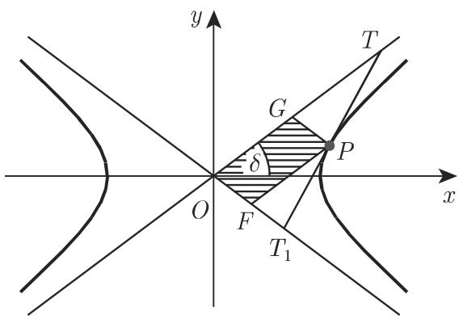  
3.159

一条切线被渐近线所截，形成双曲线的一个切线段，即线段 $T T _ { 1 }$ （图 3.159) ．该切线段的中点是切点 P, 因此有 $T P = T _ { 1 } P$ 对千任何切点 来说，切线与渐近线之间的三角形 $T O T _ { 1 }$ 的面积是相同的，它等千

$$
S _ {T O T _ {1}} = a b.\tag{3.336}
$$

对千任何切点 $P ,$ 由渐近线和两条过点 且平行千渐近线的直线所确定的平行四边形 OFPG 的面积是

$$
S _ {O F P G} = \frac {a b}{2}.\tag{3.337}
$$

7. 共枙双曲线（图 3.160)

共扼双曲线具有方程

$$
\frac {x ^ {2}}{a ^ {2}} - \frac {y ^ {2}}{b ^ {2}} = 1 \quad \text {和} \quad \frac {y ^ {2}}{b ^ {2}} - \frac {x ^ {2}}{a ^ {2}} = 1,\tag{3.338}
$$

其中第二个方程对应的曲线在图 3.160 中用虚线表示．它们有相同的渐近线，因此它们之中的一个实轴是另一个的虚轴，反之亦然．

  
3.160

8. 双曲线的直径（图 3.161)

##### 本节续页

- [（续2）](<3.5.2 平面解析几何-2.md>)
