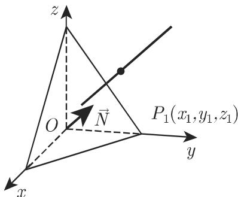
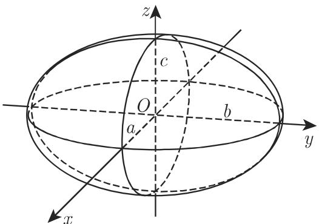
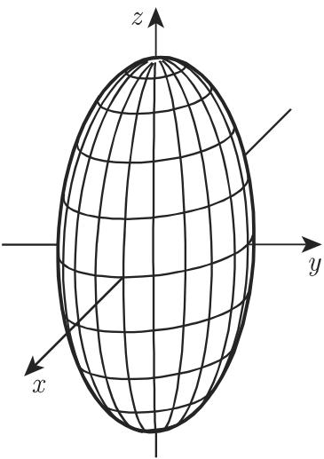
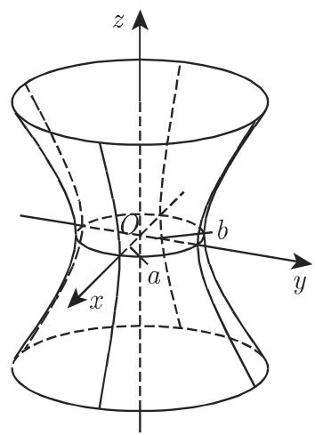
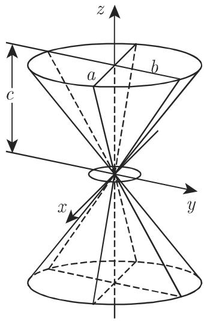
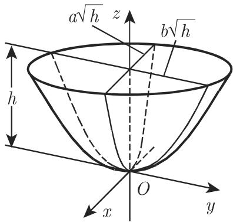
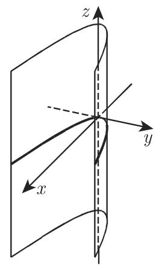

(6) 通过一点且平行千两条直线的平面方程 如果直线的方向向量 $\vec { R } _ { 1 } ( l _ { 1 }$ $m _ { 1 } , n _ { 1 } )$ 和 $\vec { R } _ { 2 } ( l _ { 2 } , m _ { 2 } , n _ { 2 } )$ ，则有

a) 坐标形式

$$
\left| \begin{array}{c c c} x - x _ {1} & y - y _ {1} & z - z _ {1} \\ l _ {1} & m _ {1} & n _ {1} \\ l _ {2} & m _ {2} & n _ {2} \end{array} \right| = 0;\tag{3.384a}
$$

b) 向量形式＊

$$
\left(\vec {r} - \vec {r} _ {1}\right) \vec {R} _ {1} \vec {R} _ {2} = 0.\tag{3.384b}
$$

(7) 通过一点且垂直千一条直线的平面方程 如果点是 $P _ { 1 } ( x _ { 1 } , y _ { 1 } , z _ { 1 } )$ ，直线的方向向量是 $\vec { N } ( A , B , C )$ ，则有

a) 坐标形式

$$
A (x - x _ {1}) + B (y - y _ {1}) + C (z - z _ {1}) = 0;\tag{3.385a}
$$

b) 向量形式

$$
\left(\vec {r} - \vec {r _ {1}}\right) \vec {N} = 0.\tag{3.385b}
$$

(8) 点到平面的距离 在平面方程的黑赛法式 (3.380a)

$$
x \cos \alpha + y \cos \beta + z \cos \gamma - p = 0\tag{3.386a}
$$

中代入点 $P ( a , b , c )$ 的坐标，结果为带符号的距离

$$
\delta = a \cos \alpha + b \cos \beta + c \cos \delta - p,\tag{3.386b}
$$

如果 和原点在平面的两侧，则 $\delta > 0$ ，在相反的情形 $\delta < 0$

(9) 通过两平面交线的平面方程 通过由方程 $A _ { 1 } x + B _ { 1 } y + C _ { 1 } z + D _ { 1 } = 0$ 和$A _ { 2 } x + B _ { 2 } y + C _ { 2 } z + D _ { 2 } = 0$ 给定的两平面的交线的平面方程是

a) 坐标形式

$$
A _ {1} x + B _ {1} y + C _ {1} z + D _ {1} + \lambda (A _ {2} x + B _ {2} y + C _ {2} z + D _ {2}) = 0.\tag{3.387a}
$$

b) 向量形式

$$
\vec {r} \vec {N _ {1}} + D _ {1} + \lambda (\vec {r} \vec {N _ {2}} + D _ {2}) = 0.\tag{3.387b}
$$

＊关于三个向量的混合积见第 249 3.5.1.6, 2.

关千两个向量的标量积见第 247 3.5.1.5, 1.；按仿射坐标给出的标量积见第 2503.5.1.6, 5. ；关千平面的向量方程见第 252 3.5.1.7.

这里入是一个实参数，因此 (3.387a) (3.387b) 定义了一个平面束．图 3.182 显示的是三个平面的情形如果在 (3.387a) (3.387b) 中入取－oo 和＋oo 之间的所有值，则将得到平而束中的全部平而 $\left( A _ { 2 } x + B _ { 2 } y + C _ { 2 } z + D _ { 2 } = 0 \right.$ 除外）．如果给定的两平面方程由法式表示，则对千 $\lambda { = } \pm 1$ 将得到平分这两个平面夹角的平面方程．

  
3.182

2. 空间中的两个和多个平面

(1) 两平面之间的夹角，一般情形 由方程 $A _ { 1 } x + B _ { 1 } y + C _ { 1 } z + D _ { 1 } = 0$ 和$A _ { 2 } x + B _ { 2 } y + C _ { 2 } z + D _ { 2 } = 0$ 给定的两平面之间的夹角 $\varphi$ 叮以用下面的公式计算：

$$
\cos \varphi = \frac {A _ {1} A _ {2} + B _ {1} B _ {2} + C _ {1} C _ {2}}{\sqrt {(A _ {1} ^ {2} + B _ {1} ^ {2} + C _ {1} ^ {2}) (A _ {2} ^ {2} + B _ {2} ^ {2} + C _ {2} ^ {2})}}.\tag{3.388a}
$$

如果两平面巾向量方程 $\vec { r } \vec { N } _ { 1 } + D _ { 1 } = 0$ 和 $\vec { r } \vec { N } _ { 2 } + D _ { 2 } = 0$ 给出，则

$$
\cos \varphi = {\frac {{\vec {N}} _ {1}   {\vec {N}} _ {2}}{{N}} _ {1} N _ {2}}, \quad {\text {其中}} \quad N _ {1} = | {\vec {N}} _ {1} |   {\text {而}}   N _ {2} = | {\vec {N}} _ {2} |  .\tag{3.388b}
$$

(2) 三个平面的交点 三个给定的平面 $A _ { 1 } x + B _ { 1 } y + C _ { 1 } z + D _ { 1 } = 0 , A _ { 2 } x +$ $B _ { 2 } y + C _ { 2 } z + D _ { 2 } = 0$ 和 $A _ { 3 } x + B _ { 3 } y + C _ { 3 } z + D _ { 3 } = 0$ 的交点坐标由公式

$$
\bar {x} = \frac {- \varDelta_ {x}}{\varDelta}, \quad \bar {y} = \frac {- \varDelta_ {y}}{\varDelta}, \quad \bar {z} = \frac {- \varDelta_ {z}}{\varDelta}\tag{3.389a}
$$

计算，其中

$$
\Delta = \left| \begin{array}{c c c} A _ {1} & B _ {1} & C _ {1} \\ A _ {2} & B _ {2} & C _ {2} \\ A _ {3} & B _ {3} & C _ {3} \end{array} \right|, \quad \Delta_ {x} = \left| \begin{array}{c c c} D _ {1} & B _ {1} & C _ {1} \\ D _ {2} & B _ {2} & C _ {2} \\ D _ {3} & B _ {3} & C _ {3} \end{array} \right|,
$$

$$
\Delta_ {y} = \left| \begin{array}{c c c} A _ {1} & D _ {1} & C _ {1} \\ A _ {2} & D _ {2} & C _ {2} \\ A _ {3} & D _ {3} & C _ {3} \end{array} \right|, \quad \Delta_ {z} = \left| \begin{array}{c c c} A _ {1} & B _ {1} & D _ {1} \\ A _ {2} & B _ {2} & D _ {2} \\ A _ {3} & B _ {3} & D _ {3} \end{array} \right|.\tag{3.389b}
$$

如果有 $\varDelta \neq 0$ ，则三个平面交千一点．如果有 $\varDelta = 0$ 并且至少有一个二阶非零子式则平面平行千一条直线如果每个二阶子式都等千 $0 ,$ ，则平面通过一条直线

3. 两平面平行和垂直的条件

a) 平行的条件如果有

$$
\frac {A _ {1}}{A _ {2}} = \frac {B _ {1}}{B _ {2}} = \frac {C _ {1}}{C _ {2}} \quad \text {或} \quad \vec {N} _ {1} \times \vec {N} _ {2} = \vec {0}\tag{3.390}
$$

成立，则两平面平行

b) 垂直的条件如果有

$$
A _ {1} A _ {2} + B _ {1} B _ {2} + C _ {1} C _ {2} = 0 \quad \text {或} \quad \vec {N} _ {1} \vec {N} _ {2} = 0\tag{3.391}
$$

成立，则两平面互相垂直

4. 四个平面的交点

四个平面 $A _ { 1 } x + B _ { 1 } y + C _ { 1 } z + D _ { 1 } = 0 , A _ { 2 } x + B _ { 2 } y + C _ { 2 } z + D _ { 2 } = 0 , A _ { 3 } x +$ $B _ { 3 } y + C _ { 3 } z + D _ { 3 } = 0$ 和 $A _ { 4 } x + B _ { 4 } y + C _ { 4 } z + D _ { 4 } = 0$ 具有一个公共点仅当行列式

$$
\delta = \left| \begin{array}{c c c c} A _ {1} & B _ {1} & C _ {1} & D _ {1} \\ A _ {2} & B _ {2} & C _ {2} & D _ {2} \\ A _ {3} & B _ {3} & C _ {3} & D _ {3} \\ A _ {4} & B _ {4} & C _ {4} & D _ {4} \end{array} \right| = 0\tag{3.392}
$$

成立在此情形该公共点由三个方程确定，第四个方程是多余的，它可以由其他方程导出．

5. 两平行平面之间的距离

如果由方程

$$
A x + B y + C z + D _ {1} = 0 \quad {\text {和}} \quad A x + B y + C z + D _ {2} = 0\tag{3.393}
$$

给出的两平面平行，则它们之间的距离是

$$
d = \frac {\left| D _ {1} - D _ {2} \right|}{\sqrt {A ^ {2} + B ^ {2} + C ^ {2}}}.\tag{3.394}
$$

3.5.3.11 空间中的直线

1. 直线的方程

(1) 空间直线的方程，一般情形 因为空间中的直线可以定义为两个平面的交线所以它可以表示为两个线性方程形成的方程组．

a) 坐标形式

$$
A _ {1} x + B _ {1} y + C _ {1} z + D _ {1} = 0, \quad A _ {2} x + B _ {2} y + C _ {2} z + D _ {2} = 0.\tag{3.395a}
$$

b) 向量形式

$$
\vec {r} \vec {N} _ {1} + D _ {1} = 0, \quad \vec {r} \vec {N} _ {2} + D _ {2} = 0.\tag{3.395b}
$$

(2) 两投影平面中的直线方程 两个方程

$$
y = k x + a, \quad z = h x + b\tag{3.396}
$$

每一个都定义了一个平面，它们过该直线并分别垂直千 x, 平面和 $x , \ z$ 平面（图 3.183)．它们称为投影平面．这一表示不能用千平行千 $y , \ z$ 平面的直线，因此在这种情形就要考虑其他坐标面的投影

  
3.183

(3) 通过一点平行千一个方向向量的直线方程 通过一点 $P _ { 1 } ( x _ { 1 } , \ y _ { 1 } , \ z _ { 1 } )$ 平行千一个方向向量 $\vec { R } ( l , m , n )$ （图 3.184) 的直线方程（或方程组）具有形式：

a) 坐标表示和向量形式

$$
{\frac {x - x _ {1}}{l}} = {\frac {y - y _ {1}}{m}} = {\frac {z - z _ {1}}{n}},\tag{3.397a}
$$

$$
(\vec {r} - \vec {r} _ {1}) \times \vec {R} = \vec {0};\tag{3.397b}
$$

b) 参数形式和向量形式

$$
x = x _ {1} + l t, \quad y = y _ {1} + m t, \quad z = z _ {1} + n t,\tag{3.397c}
$$

$$
\vec {r} = \vec {r} _ {1} + \vec {R} t,\tag{3.397d}
$$

其中数 $x _ { 1 } , y _ { 1 } , z _ { 1 }$ 满足 (3.395a) 中的方程从 (3.395a) 推出 (3.397a) 的表示需求出

$$
l = \left| \begin{array}{c c} B _ {1} & C _ {1} \\ B _ {2} & C _ {2} \end{array} \right|, m = \left| \begin{array}{c c} C _ {1} & A _ {1} \\ C _ {2} & A _ {2} \end{array} \right|, n = \left| \begin{array}{c c} A _ {1} & B _ {1} \\ A _ {2} & B _ {2} \end{array} \right|,\tag{3.398a}
$$

或按向量形式

$$
\vec {R} = \vec {N _ {1}} \times \vec {N _ {2}}.\tag{3.398b}
$$

(4) 通过两点的直线方程 通过两点 $P _ { 1 } ( x _ { 1 } , y _ { 1 } , z _ { 1 } )$ ）和 $P _ { 2 } ( x _ { 2 } , y _ { 2 } , z _ { 2 } )$ 的直线方程（图 3.185)

  
3.184

  
3.185

坐标形式和向量形式＊

$$
{\frac {x - x _ {1}}{x _ {2} - x _ {1}}} = {\frac {y - y _ {1}}{y _ {2} - y _ {1}}} = {\frac {z - z _ {1}}{z _ {2} - z _ {1}}},\tag{3.399a}
$$

$$
\mathrm{b)} \quad (\vec {r} - \vec {r _ {1}}) \times (\vec {r} - \vec {r _ {2}}) = \vec {0}.\tag{3.399b}
$$

如果 $x _ { 1 } ~ = ~ x _ { 2 }$ 则方程的坐标形式为 $x = x _ { 2 } , \frac { y - y _ { 1 } } { y _ { 2 } - y _ { 1 } } = \frac { z - z _ { 1 } } { z _ { 2 } - z _ { 1 } }$ . 如果有$x _ { 1 } = x _ { 2 } , y _ { 1 } = y _ { 2 }$ 都成立，则方程的坐标形式为 $x = x _ { 2 } , y = y _ { 2 }$

(5) 过一点且垂直千一个平面的直线方程 过点 $P _ { 1 } ( x _ { 1 } , \ y _ { 1 } , \ z _ { 1 } )$ 并垂直千由方程 $A _ { 1 } x + B _ { 1 } y + C _ { 1 } z + D _ { 1 } = 0$ 或 $\vec { r } \vec { N } + D = 0$ （图 3.186) 给定的一个平面的直线方程的

坐标形式和向量形式

$$
\mathrm{a)} \frac {x - x _ {1}}{A} = \frac {y - y _ {1}}{B} = \frac {z - z _ {1}}{C};\tag{3.400a}
$$

b) $( { \vec { r } } - { \vec { r } } _ { 1 } ) \times { \vec { N } } = { \vec { 0 } } .$

(3.400b)

如果有 $A = 0$ 成立，则坐标形式的方程与前面的情形有类似的形式

  
3.186

2. 点到直线距离的坐标形式

点 $M ( a , b , c )$ 到由方程 (3.397a) 给出的直线的距离 满足：

$$
d ^ {2} = \frac {\left[ (a - x _ {1}) m - (b - y _ {1}) l \right] ^ {2} + \left[ (b - y _ {1}) n - (c - z _ {1}) m \right] ^ {2} + \left[ (c - z _ {1}) l - (a - x _ {1}) n \right] ^ {2}}{l ^ {2} + m ^ {2} + n ^ {2}}\tag{3.401}
$$

3. 由坐标形式给出的两直线之间的最短距离

如果两直线是由方程 (3.397a) 给出，则它们的距离是

$$
d = \frac {\pm \left| \begin{array}{c c c} x _ {1} - x _ {2} & y _ {1} - y _ {2} & z _ {1} - z _ {2} \\ l _ {1} & m _ {1} & n _ {1} \\ l _ {2} & m _ {2} & n _ {2} \end{array} \right|}{\sqrt {\left| \begin{array}{c c} l _ {1} & m _ {1} \\ l _ {2} & m _ {2} \end{array} \right| ^ {2} + \left| \begin{array}{c c} m _ {1} & n _ {1} \\ m _ {2} & n _ {2} \end{array} \right| ^ {2} + \left| \begin{array}{c c} n _ {1} & l _ {1} \\ n _ {2} & l _ {2} \end{array} \right| ^ {2}}}.\tag{3.402}
$$

如果分子中的行列式等千 ，则两直线相交．

3.5.3.12 空间中直线与平面的交点和夹角

1. 直线与平面的交点

(1) 坐标形式的直线方程 由方程 $A x + B y + C z + D = 0$ 给定的平面与由${ \frac { x - x _ { 1 } } { l } } = { \frac { y - y _ { 1 } } { m } } = { \frac { z - z _ { 1 } } { n } }$ 给定的直线的交点坐标是

$$
\bar {x} = x _ {1} - l \rho , \quad \bar {y} = y _ {1} - m \rho , \quad \bar {z} = z _ {1} - n \rho ,\tag{3.403a}
$$

其中

$$
\rho = \frac {A x _ {1} + B y _ {1} + C z _ {1} + D}{A l + B m + C n}.\tag{3.403b}
$$

如果 $A l + B m + C n = 0$ 成立，则直线平行千平面．如果 $A x _ { 1 } + B y _ { 1 } + C z _ { 1 } + D$ $= 0$ 也成立，则直线位千平面内．

(2) 两投影平面中的直线方程 由方程 $A x + B y + C z + D = 0$ 给定的平面与由 $y = k x + a$ 和 $z = h x + b$ 给定的直线的交点具有坐标

$$
\bar {x} = - \frac {B a + C b + D}{A + B k + C h}, \quad \bar {y} = k \bar {x} + a, \quad \bar {z} = h \bar {x} + b.\tag{3.404}
$$

如果 $A + B k + C h = 0$ 成立，则直线平行千平面．如果 $B a + C b + D = 0$ 也成立，则直线位千平面内．

(3) 两直线的交点如果两条直线由 $y \ = \ k _ { 1 } x + a _ { 1 } , \ z \ = \ h _ { 1 } x \ + \ b _ { 1 }$ 和 $y \ : =$ $k _ { 2 } x + a _ { 2 } , z = h _ { 2 } x + b _ { 2 }$ 给定，则其交点（若存在的话）坐标为

$$
\bar {x} = \frac {a _ {2} - a _ {1}}{k _ {1} - k _ {2}} = \frac {b _ {2} - b _ {1}}{h _ {1} - h _ {2}}, \quad \bar {y} = \frac {k _ {1} a _ {2} - k _ {2} a _ {1}}{k _ {1} - k _ {2}}, \quad \bar {z} = \frac {h _ {1} b _ {2} - h _ {2} b _ {1}}{h _ {1} - h _ {2}},\tag{3.405a}
$$

仅当

$$
(a _ {1} - a _ {2}) (h _ {1} - h _ {2}) = (b _ {1} - b _ {2}) (k _ {1} - k _ {2})\tag{3.405b}
$$

时交点存在，否则两直线不相交．

2. 平面和直线之间的夹角

(1) 两条直线之间的夹角

a) 一般情形 如果直线由方程 ${ \frac { x - x _ { 1 } } { l _ { 1 } } } \ = \ { \frac { y - y _ { 1 } } { m _ { 1 } } } \ = \ { \frac { z - z _ { 1 } } { n _ { 1 } } }$ 和 ${ \frac { x - x _ { 2 } } { l _ { 2 } } } \ =$ $\frac { y - y _ { 2 } } { m _ { 2 } } = \frac { z - z _ { 2 } } { n _ { 2 } }$ 或以向量形式 $( { \vec { r } } - { \vec { r } } _ { 1 } ) \times { \vec { R } } _ { 1 } = { \vec { 0 } }$ 和 $( \vec { r } - \vec { r } _ { 2 } ) \times \vec { R } _ { 2 } = \vec { 0 }$ 给出，则关千它们之间的夹角有

$$
\cos \varphi = \frac {l _ {1} l _ {2} + m _ {1} m _ {2} + n _ {1} n _ {2}}{\sqrt {(l _ {1} ^ {2} + m _ {1} ^ {2} + n _ {1} ^ {2}) (l _ {2} ^ {2} + m _ {2} ^ {2} + n _ {2} ^ {2})}}\tag{3.406a}
$$

或

$$
\cos \varphi = {\frac {{\vec {R}} _ {1} {\vec {R}} _ {2}}{{R} _ {1} R _ {2}}} \text {其中} R _ {1} = | {\vec {R}} _ {1} | \text {且} R _ {2} = | {\vec {R}} _ {2} |.\tag{3.406b}
$$

b) 平行的条件 如果有

$$
\frac {l _ {1}}{l _ {2}} = \frac {m _ {1}}{m _ {2}} = \frac {n _ {1}}{n _ {2}} \text {或} \vec {R _ {1}} \times \vec {R _ {2}} = \vec {0},\tag{3.407}
$$

则两条直线平行．

c) 垂直的条件 如果有

$$
l _ {1} l _ {2} + m _ {1} m _ {2} + n _ {1} n _ {2} = 0 \quad \text {或} \quad \vec {R _ {1}} \vec {R _ {2}} = 0,\tag{3.408}
$$

则两条直线互相垂直

(2) 直线与平面之间的夹角

a) 如果直线和平而由方程 ${ \frac { x - x _ { 1 } } { l } } = { \frac { y - y _ { 1 } } { m } } = { \frac { z - z _ { 1 } } { n } }$ 和 $A x + B y + C z + D =$ 或以向量形式 $( \vec { r } - \vec { r } _ { 1 } ) \times \vec { R } = \vec { 0 }$ 和 $\vec { r } \vec { N } + D = 0$ 给出，则它们之间的夹角 $\varphi$ 可由下面的公式得到

$$
\sin \varphi = \frac {A l + B m + C n}{\sqrt {(A ^ {2} + B ^ {2} + C ^ {2}) (l ^ {2} + m ^ {2} + n ^ {2})}}\tag{3.409a}
$$

或

$$
\sin \varphi = {\frac {{\vec {R}}   {\vec {N}}}{{\cal R} N}}    {\text {其中}}    R = | {\vec {R}} |    \text {且}    N = | {\vec {N}} |.\tag{3.409b}
$$

b) 平行的条件 如果有

$$
A l + B m + C n = 0 \quad {\text {或}} \quad {\vec {R}} {\vec {N}} = 0,\tag{3.410}
$$

则直线与平面平行

c) 垂直的条件 如果有

$$
\frac {A}{l} = \frac {B}{m} = \frac {C}{n} \quad \text {或} \quad \vec {R} \times \vec {N} = \vec {0},\tag{3.411}
$$

则直线与平面垂直

3.5.3.13 二次曲面，标准方程

1. 有心曲面

下面的方程，也称为二次曲面方程的标准形式可以从二次曲面的一般方程通过将中心放置在原点导出（参见第 306 3.5.3.14)．这里中心是通过它的弦的中点．坐标轴是曲面的对称轴因此坐标面也是对称平面

2. 椭球面

设半轴是 $a , b , c$ （图 3.187)，则椭球面的方程为

$$
\frac {x ^ {2}}{a ^ {2}} + \frac {y ^ {2}}{b ^ {2}} + \frac {z ^ {2}}{c ^ {2}} = 1.\tag{3.412}
$$

需要区分下列特殊情况：

a) 压缩的旋转椭球面（透镜形式） $a = b > c$ （图 3.188).

b) 拉伸的旋转椭球面（詈茄形式） $a = b < c$ ( 3.189).

c) 球面 $a = b = c , $ 因此 $x ^ { 2 } + y ^ { 2 } + z ^ { 2 } = a ^ { 2 }$ 成立

旋转椭球面的两种形式通过 x, 平面上具有轴 的一个椭圆绕 轴旋转而成如果将一个圆绕任何轴旋转则得到一个球面如果一个平面通过一个椭球面则所截图形是一个椭圆；在特殊情形它是一个圆椭球的体积是

$$
V = \frac {4 \pi a b c}{3}.\tag{3.413}
$$

  
3.187

  
3.188

3. 双曲而

a) 单叶双曲面（图 3.190) 为实半轴， 为虚半轴，则方程是（关千母线见第 303 页）

$$
\frac {x ^ {2}}{a ^ {2}} + \frac {y ^ {2}}{b ^ {2}} - \frac {z ^ {2}}{c ^ {2}} = 1\tag{3.414}
$$

b) 双叶双曲面（图 3.191) 为实半轴， a, 为虚半轴，则方程是

$$
{\frac {x ^ {2}}{a ^ {2}}} + {\frac {y ^ {2}}{b ^ {2}}} - {\frac {z ^ {2}}{c ^ {2}}} = - 1.\tag{3.415}
$$

在双曲面的两种情形中，用平行千 轴的平面去截它将得到双曲线．在单叶双曲面的情形，截痕也可以是两条相交直线在两种情形中平行千 $x , \ y$ 面的截痕是椭圆

当 $a = b$ 时，双曲面可以表示成具有半轴 的双曲线绕轴 $2 c$ 所得的旋转曲面．在单叶双曲面的情形这是虚的，而在双叶双曲面的情形这是实的．

  
3.189

  
3.190

  
3.191

4. 锥面（图 3.192)

如果顶点在原点则方程是

$$
\frac {x ^ {2}}{a ^ {2}} + \frac {y ^ {2}}{b ^ {2}} - \frac {z ^ {2}}{c ^ {2}} = 0.\tag{3.416}
$$

作为准线可以考虑具有半轴 的椭圆，它所在的平面在距离原点 处垂直千 轴．这样表示的锥面可以看成是曲面

$$
\frac {x ^ {2}}{a ^ {2}} + \frac {y ^ {2}}{b ^ {2}} - \frac {z ^ {2}}{c ^ {2}} = \pm 1\tag{3.417}
$$

的渐近锥面它的母线在无穷远处无限趋近千两个双曲面（图 3.193)．当 $a = b$ 时存在一个直圆锥（参见第 209 3.3.4, (9)).

5. 抛物面

因为抛物面没有中心，所以在下节中假设顶点在原点， $z$ 轴是其对称轴， $x , z$ 平面和 $y ,$ 平面是对称平面

a) 椭圆抛物面（图 3.194)

$$
z = \frac {x ^ {2}}{a ^ {2}} + \frac {y ^ {2}}{b ^ {2}}.\tag{3.418}
$$

平行千 $z$ 轴的平面截出的图形是抛物线那些平行千 x, 平面的平面截出的是椭圆

  
3.192

  
3.193

垂直千 $z$ 轴的平面在距离原点 处截抛物面所得立体的体积为（图 3.194)

$$
V = \frac {1}{2} \pi \overline {{a}} \overline {{b}} h,\tag{3.419}
$$

参数 $\overline { { a } } = a \sqrt { h }$ 和 $\bar { b } = b \sqrt { h }$ 是在高 处所截椭圆的半轴．千是，（3.419) 所得是具有相同底面和高度的椭圆柱面的体积的一半．

b) 旋转抛物面 $a = b$ 时我们得到一个旋转抛物面它可以由 $x , z$ 平面上的抛物线 $z = { \frac { x ^ { 2 } } { a ^ { 2 } } }$ 绕 轴旋转产生

c) 双曲抛物面（图 3.195)

$$
z = \frac {x ^ {2}}{a ^ {2}} - \frac {y ^ {2}}{b ^ {2}}.\tag{3.420}
$$

平行千 $y , z$ 平面或 x, 平面的截痕是抛物线；平行千 x,y 平面的截痕是双曲线或两条相交直线

  
3.194

  
3.195

6. 直纹曲面

直纹曲面的直母线完全位千该曲面上．例子有锥面和柱面的母线．

a) 单叶双曲面（图 3.196)

$$
\frac {x ^ {2}}{a ^ {2}} + \frac {y ^ {2}}{b ^ {2}} - \frac {z ^ {2}}{c ^ {2}} = 1.\tag{3.421}
$$

单叶双曲面具有两族直母线方程为

$$
{\frac {x}{a}} + {\frac {z}{c}} = u \left(1 + {\frac {y}{b}}\right), \quad u \left({\frac {x}{a}} - {\frac {z}{c}}\right) = 1 - {\frac {y}{b}};\tag{3.422a}
$$

$$
{\frac {x}{a}} + {\frac {z}{c}} = v \left(1 - {\frac {y}{b}}\right), v \left({\frac {x}{a}} - {\frac {z}{c}}\right) = 1 + {\frac {y}{b}},\tag{3.422b}
$$

其中 是任意量．

b) 双曲抛物面（图 3.197)

$$
z = \frac {x ^ {2}}{a ^ {2}} - \frac {y ^ {2}}{b ^ {2}}.\tag{3.423}
$$

双曲抛物而也具有两族直母线，方程为

$$
{\frac {x}{a}} + {\frac {y}{b}} = u, \quad u \left({\frac {x}{a}} - {\frac {y}{b}}\right) = z;\tag{3.424a}
$$

$$
{\frac {x}{a}} - {\frac {y}{b}} = v, \quad v \left({\frac {x}{a}} + {\frac {y}{b}}\right) = z.\tag{3.424b}
$$

也取任意的值．在两种情形中，通过曲面的每个点有两条直线分别来自两个族．图 3.196 和图 3.197 表示的只是一族直线

  
3.196

  
3.197

7. 柱面

a) 椭圆柱面（图 3.198)

$$
\frac {x ^ {2}}{a ^ {2}} + \frac {y ^ {2}}{b ^ {2}} = 1.\tag{3.425}
$$

b) 双曲柱面（图 3.199)

$$
\frac {x ^ {2}}{a ^ {2}} - \frac {y ^ {2}}{b ^ {2}} = 1.\tag{3.426}
$$

c) 抛物柱面（图 3.200)

  
3.198

$$
y ^ {2} = 2 p x.\tag{3.427}
$$

  
3.199

  
3.200

3.5.3.14 二次曲面，一般理论

1. 二次曲面的一般方程

$$
\begin{array}{l} {a _ {1 1} x ^ {2} + a _ {2 2} y ^ {2} + a _ {3 3} z ^ {2} + 2 a _ {1 2} x y + 2 a _ {2 3} y z + 2 a _ {3 1} z x + 2 a _ {1 4} x} \\ {+ 2 a _ {2 4} y + 2 a _ {3 4} z + a _ {4 4} = 0.} \end{array}\tag{3.428}
$$

．从其方程判断二次曲面的类型

二次曲面的类型可以从其方程出发利用其不变量Ll, 8, 的符号来确定（表 3.24 和表 3.25)．在这里我们可以看到这些曲面方程的名称及其标准形式，每个方程都可以变换成标准形式．除了虚锥面的顶点以及两个虚平面的交线外，从所谓虚曲面的方程不能确定任何实点的坐标．

3.24 二次曲面的类型 $( \delta \neq 0 ,$ 有心曲面）

<table><tr><td></td><td> $S \cdot \delta > 0, T > 0$ </td><td> $S \cdot \delta$ 和 $T$ 都不大于0</td></tr><tr><td rowspan="2"> $\Delta < 0$ </td><td>椭球面</td><td>双叶双曲面</td></tr><tr><td> $\frac{x^{2}}{a^{2}} + \frac{y^{2}}{b^{2}} + \frac{z^{2}}{c^{2}} = 1$ </td><td> $\frac{x^{2}}{a^{2}} + \frac{y^{2}}{b^{2}} - \frac{z^{2}}{c^{2}} = -1$ </td></tr><tr><td rowspan="2"> $\Delta > 0$ </td><td>虚椭球面</td><td>单叶双曲面</td></tr><tr><td> $\frac{x^{2}}{a^{2}} + \frac{y^{2}}{b^{2}} + \frac{z^{2}}{c^{2}} = -1$ </td><td> $\frac{x^{2}}{a^{2}} + \frac{y^{2}}{b^{2}} - \frac{z^{2}}{c^{2}} = 1$ </td></tr><tr><td rowspan="2"> $\Delta = 0$ </td><td>虚锥面(具有实顶点)</td><td>锥面</td></tr><tr><td> $\frac{x^{2}}{a^{2}} + \frac{y^{2}}{b^{2}} + \frac{z^{2}}{c^{2}} = 0$ </td><td> $\frac{x^{2}}{a^{2}} + \frac{y^{2}}{b^{2}} - \frac{z^{2}}{c^{2}} = 0$ </td></tr></table>

3. 二次曲面的不变量

替换 $a _ { i k } = a _ { k i }$ ，则有

$$
\Delta = \left| \begin{array}{c c c c} a _ {1 1} & a _ {1 2} & a _ {1 3} & a _ {1 4} \\ a _ {2 1} & a _ {2 2} & a _ {2 3} & a _ {2 4} \\ a _ {3 1} & a _ {3 2} & a _ {3 3} & a _ {3 4} \\ a _ {4 1} & a _ {4 2} & a _ {4 3} & a _ {4 4} \end{array} \right|,\tag{3.429a}
$$

$$
\delta = \left| \begin{array}{c c c} a _ {1 1} & a _ {1 2} & a _ {1 3} \\ a _ {2 1} & a _ {2 2} & a _ {2 3} \\ a _ {3 1} & a _ {3 2} & a _ {3 3} \end{array} \right|,\tag{3.429b}
$$

$$
S = a _ {1 1} + a _ {2 2} + a _ {3 3},\tag{3.429c}
$$

$$
T = a _ {2 2} a _ {3 3} + a _ {3 3} a _ {1 1} + a _ {1 1} a _ {2 2} - a _ {2 3} ^ {2} - a _ {3 1} ^ {2} - a _ {1 2} ^ {2}.\tag{3.429d}
$$

这些不变量在坐标系的平移或旋转过程中不变．

3.25 二次曲面的类型 $( \delta = 0 ;$ 抛物面，柱面和两个平面）

<table><tr><td></td><td colspan="4"> $\Delta < 0$ (这里 $T > 0$ )</td><td colspan="4"> $\Delta > 0$ (这里 $T < 0$ )</td></tr><tr><td rowspan="2"> $\Delta \neq 0$ </td><td colspan="4">椭圆抛物面</td><td colspan="4">双曲抛物面</td></tr><tr><td colspan="4"> $\frac{x^{2}}{a^{2}} + \frac{y^{2}}{b^{2}} = \pm z$ </td><td colspan="4"> $\frac{x^{2}}{a^{2}} - \frac{y^{2}}{b^{2}} = \pm z$ </td></tr><tr><td rowspan="2"> $\Delta = 0$ </td><td colspan="8">以二次曲线作为准线的柱面有下列不同类型:如果该曲面没有退化为两个实平面,虚平面或重合平面,则当 $T > 0$ 时为虚椭圆柱面,当 $T < 0$ 时为双曲柱面,当 $T = 0$ 时为抛物柱面.退化的条件是</td></tr><tr><td colspan="8"> $\begin{vmatrix} a_{11} & a_{12} & a_{14} \\ a_{21} & a_{22} & a_{24} \\ a_{41} & a_{42} & a_{44} \end{vmatrix} + \begin{vmatrix} a_{11} & a_{13} & a_{14} \\ a_{31} & a_{33} & a_{34} \\ a_{41} & a_{43} & a_{44} \end{vmatrix} + \begin{vmatrix} a_{22} & a_{23} & a_{24} \\ a_{32} & a_{33} & a_{34} \\ a_{42} & a_{43} & a_{44} \end{vmatrix} = 0$ </td></tr></table>
