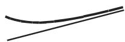
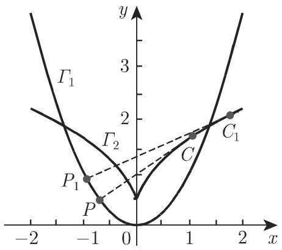
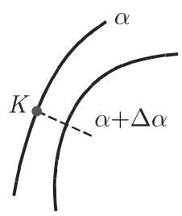
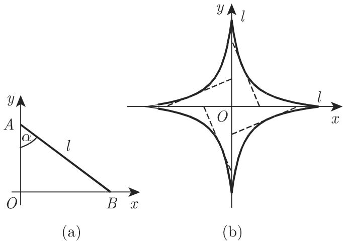

■ A: $F ( x , y ) \equiv ( x ^ { 2 } + y ^ { 2 } ) ^ { 2 } - 2 a ^ { 2 } ( x ^ { 2 } - y ^ { 2 } ) = 0$ （参见第 131 2.12.6, 2.66,纽线）； $F _ { x } = 4 x ( x ^ { 2 } + y ^ { 2 } - a ^ { 2 } ) , F _ { y } = 4 y ( x ^ { 2 } + y ^ { 2 } + a ^ { 2 } )$ ；方程组 $F _ { x } = 0 , F _ { y } = 0$ 导致三个解 $( 0 , 0 ) , ( \pm a , 0 )$ ，其中只有一个满足条件 $F = 0$ . 将（0, 0) 代入二阶导数得 $F _ { x x } = - 4 a ^ { 2 } , F _ { x y } = 0 , F _ { y y } = + 4 a ^ { 2 } ; \varDelta = - 1 6 a ^ { 4 } < 0$ ，即在原点处曲线自身相交；切线的斜率是 $\tan \alpha = \pm 1$ ，其方程为 $y = \pm x$

■ B: $F ( x , y ) \equiv x ^ { 3 } + y ^ { 3 } - x ^ { 2 } - y ^ { 2 } = 0 ; F _ { x } = x ( 3 x - 2 ) , F _ { y } = y ( 3 y - 2 )$ ；点 (0,$0 ) , ( 0 , 2 / 3 ) , ( 2 / 3 , 0 )$ 和 $\left( { \frac { 2 } { 3 } } , { \frac { 2 } { 3 } } \right)$ 只有第一个在曲线上；有 $F _ { x x } = - 2 , F _ { x y } = 0$ $F _ { y y } = - 2 , \varDelta = 4 > 0$ ，即原点是一个孤立点．

■ $\mathbf { C } \colon F ( x , y ) \equiv ( y - x ^ { 2 } ) ^ { 2 } - x ^ { 5 } = 0$ ．方程组 $F _ { x } = 0 , F _ { y } = 0$ 仅得到一个解 (0, 0),它也满足方程 $F = 0$ 而且有 $\varDelta = 0$ 和 $\tan \alpha = 0$ , 因此原点是一个第二类尖点．这可以从方程的显式形式 $y = x ^ { 2 } ( 1 \pm { \sqrt { x } } )$ 看出．对千 $x < 0 , y$ 没有定义，而对千$0 < x < 1$ , 的两个值都是正的；在原点处切线是水平的．

(4) ${ \cal F } ( x , y ) = 0 ( F ( x , y )$ 是关千兀和 的多项式）类型的代数曲线

如果方程不包含常数和一次项，则原点是一个二重点对应的切线可以通过使二次项之和相等来确定

·对千双纽线（参见第 131 页图 2.66) 在原点处的切线方程 $y = \pm x$ 可以由 $x ^ { 2 } - y ^ { 2 }$ =0 推出．

如果方程也不包含二次项但包含三次项，则原点是一个三重点

3.6.1.4 曲线的渐近线

1. 定义

渐近线是当曲线远离原点时无限趋近的一条直线（图 3.232).

曲线可以从一侧趋近千该直线（图 3.232(a)），或在趋近的过程中与它不断相交（图 3.232(b)).

并不是任何一条曲线在无限地远离原点时（曲线的无穷分支）都有一条渐近线．例如作为一种渐近逼近的假分式的整式部分（参见第 18 1.1.7.2).

  
(a)

  
(b)  
3.232

2. 以参数形式 $x = x ( t ) , y = y ( t )$ 给出的函数

为了确定渐近线的方程首先确定 $t \longrightarrow t _ { i }$ 时得出 $x ( t ) \to \pm \infty$ 或 $y ( t ) \to \pm \infty$ （或两者）的那些值

有下列情形：

a) 对千 $t \longrightarrow t _ { i }$ 有 $x ( t )  \infty$ 但 $y ( t _ { i } ) = a \neq \infty \colon y = a$ ．渐近线是水平直线．

(3.515a)

b) 对千 $t \longrightarrow t _ { i }$ 有 $y ( t ) \to \infty$ 但 $x ( t _ { i } ) = a \neq \infty \colon x = a$ . 渐近线是垂直直线．

(3.515b)

c) 如果 $y ( t )$ $x ( t )$ 两者都趋向 $\pm \infty$ ，则要计算下列极限：

$$
k = \lim _ {t \to t _ {i}} {\frac {y (t)}{x (t)}} \quad {\text {和}} \quad b = \lim _ {t \to t _ {i}} [ y (t) - k   x (t) ].
$$

如果两者都存在，则渐近线方程为

$$
y = k x + b.\tag{3.515c}
$$

■ $x = { \frac { m } { \cos t } } , y = n ( \tan t - t ) , t _ { 1 } = { \frac { \pi } { 2 } } , t _ { 2 } = - { \frac { \pi } { 2 } }$ ，确定在 $t _ { i }$ 点的渐近线

$$
x (t _ {1}) = y (t _ {1}) = \infty , \quad k = \lim _ {t \to \pi / 2} \frac {n}{m} (\sin t - t \cos t) = \frac {n}{m},
$$

$$
b = \lim _ {t \to \pi / 2} \left[ n (\tan t - t) - \frac {n}{m} \frac {m}{\cos t} \right] = n \lim _ {t \to \pi / 2} \frac {\sin t - t \cos t - 1}{\cos t} = - \frac {n \pi}{2}
$$

千渐近线由 (3.515c) 给出 $y = { \frac { n } { m } } x - { \frac { n \pi } { 2 } }$ 对千第二条渐近线等等，类似地得$y = - { \frac { n } { m } } x + { \frac { n \pi } { 2 } }$

．以显式 $y = f ( x )$ 给出的函数

垂直渐近线位千函数 $f ( x )$ 的无穷跳跃间断点（参见第 76 2.1.5.3) 处；水平渐近线和斜渐近线具有方程

$$
y = k x + b, \quad \text {其中} \quad k = \lim _ {x \to \infty} {\frac {f (x)}{x}}, \quad b = \lim _ {x \to \infty} [ f (x) - k x ].\tag{3.516}
$$

4. 以隐式多项式形式 $F ( x , y ) = 0$ 给出的函数

(1) 为了确定水平渐近线和垂直渐近线，我们从关千 的多项式表达式中选取次数为 的最高次项，然后将它们分离作为函数 $\ p ( x , y )$ ，并对 $y$ 求解（如果可能的话）方程 $\varPhi ( x , y ) = 0$

$$
\Phi (x, y) = 0 \quad {\text {得出}} \quad x = \varphi (y), \quad y = \psi (x).\tag{3.517}
$$

值 $y _ { 1 } = a$ 当 $x  \infty$ 时如果极限存在则给出水平渐近线 $y = a ;$ 值 $x _ { 1 } = b$ ,$y  \infty$ 时如果极限存在则给出垂直渐近线 $x = b$

(2) 为了确定斜渐近线将直线 $y = k x + b$ 的方程代入 $F ( x , y )$ ，然后按照 $x$ 的幕次排列作为结果所得的多项式：

$$
F (x, k x + b) \equiv f _ {1} (k, b) x ^ {m} + f _ {2} (k, b) x ^ {m - 1} + \dots .\tag{3.518}
$$

从方程

$$
f _ {1} (k, b) = 0, \quad f _ {2} (k, b) = 0\tag{3.519}
$$

可以得到（如果它们存在的话）参数 $k$ b.

$x ^ { 3 } + y ^ { 3 } - 3 a x y = 0$ （参见第 125 2.11.3, 2.59, 笛卡儿叶形线）．基千方程$F ( x , k x + b ) \equiv ( 1 + k ^ { 3 } ) x ^ { 3 } + 3 ( k ^ { 2 } b - k a ) x ^ { 2 } + \cdot \cdot \cdot$ ，根据 (3.519) 得 $f _ { 1 } ( k , b ) = 1 + k ^ { 3 }$ $= 0$ 和 $f _ { 2 } ( k , b ) = k ^ { 2 } b - k a = 0$ 并解得 $k = - 1 , b = - a$ , 渐近线方程是 $y = - x - a$

3.6.1.5 关于由一个方程给出的曲线的一般讨论

研究由方程 (3.483)rv(3.486) 之一给出的曲线通常是为了解它们的性质和形状．

1. 由显式函数 $y = f ( x )$ 给出的曲线之作图

a) 确定定义域（参见第 61 2.1.1)

b) 确定对称性 确定曲线关千原点或 轴的对称性以检验函数是奇函数还是偶函数（参见第 66 2.1.3.4).

c) 确定函数在土oo 的行为 这可以通过计算 $\operatorname* { l i m } _ { x \to - \infty } { f ( x ) }$ 和 $\operatorname* { l i m } _ { x \to + \infty } { f ( x ) }$ 来确定（参见第 71 2.1.4. 7).

d) 确定间断点（参见第 76 2.1.5.3).

e) 确定与 轴和叶自的交点 这可以通过计算 f(O) 和解方程 $f ( x ) = 0$ 来确定．

f) 确定极大值和极小值并找出函数递增或递减的单调区间．

g) 确定拐点以及在这些点处的切线方程（参见第 334 3.6.1.3).

我们可以利用这些数据来描绘函数的图像，如有必要，还可以计算一些个别点以使得绘图更加精确．

·描绘函数 $y = { \frac { 2 x ^ { 2 } + 3 x - 4 } { x ^ { 2 } } }$ 的图像：

a) 该函数对千除 $x = 0$ 外的所有 有定义．

b) 不具有对称性

c) $x \longrightarrow - \infty$ 时有 $y \longrightarrow 2 ,$ ，并且显然 $y = 2 - 0$ 即从下方趋近，而当 $x \to \infty$ 时也有 $y \longrightarrow 2 ,$ ，但 $y = 2 + 0 ,$ ，即从上方趋近．

d) x = 是一个间断点使得函数从左边和右边都趋向—oo, 因为对千 较小的值 是负的．

e) 因为 $f ( 0 ) = - \infty$ 成立，所以与 轴没有交点由 $f ( x ) = 2 x ^ { 2 } + 3 x - 4 = 0$ 得与 轴交点位千 $x _ { 1 } \approx 0 . 8 5$ 和 $x _ { 2 } \approx - 2 . 3 5$

f) 极大值在 $x = 8 / 3 \approx 2 . 6 6$ 处取得，在此 $y \approx 2 . 5 6$

g) $x = 4 , y = 2 . 5$ 处有一个拐点过该点的切线斜率为 $\tan \alpha = - { \frac { 1 } { 1 6 } }$

h) 在基千这些数据描绘了函数的图像（图 3.233) 后，我们可以计算该曲线与渐近线的交点它位千 $x = 4 / 3 \approx 1 . 3 3$ 和 $y = 2$

2. 巾隐函数 $F ( x , y ) = 0$ 给出的曲线之作图

对千这种情形没有一般的规则因为根据函数的具体形式可以采取不同的步骤．如有可能，我们推荐下列步骤：

a) 确定与坐标轴的所有交点

b) 确定曲线的对称性 这可以通过将 替换为— 替换为— 来确定．

c) 确定极大值和极小值 先关千 轴确定，然后交换 $y$ 再关千 轴确定（参见第 596 6.1.5.3).

d) 确定拐点和此处的切线斜率（参见第 334 3.6.1.3).

e) 确定奇点（参见第 336 3.6.1.3, 3.).

f) 确定顶点（参见第 336 3.6.1.3, 2.) 和对应的曲率圆（参见第 331 3.6.1.2,4.）．在相对较大的一段曲线上，常常很难区分曲线的弧段与曲率圆的圆弧段．

g) 确定渐近线的方程（参见第 338 3.6.1.4) 以及曲线的支相对千渐近线的位置.

3.6.1.6 渐屈线和渐伸线

1. 渐屈线

一条曲线的渐屈线是该曲线曲率中心的轨迹（参见第 332 3.6.1.2, 5.) ；同时它也是该曲线法线的包络（也见第 342 3.6.1.7) ．如果将 (3.502)rv(3.5Q4) 中的$x _ { C }$ 和 $y _ { C }$ 视为动点坐标，则渐屈线的参数形式可以从曲率中心的坐标公式导出．如果有可能从 (3.502)rv(3.5Q4) 中消去参数 (x, 或切，则可以获得由笛卡儿坐标表示的渐屈线方程

  
3.233

·确定抛物线 $y = x ^ { 2 }$ 的渐屈线（图 3.234)．从 $X = x - { \frac { 2 x ( 1 + 4 x ^ { 2 } ) } { 2 } } = - 4 x ^ { 3 } , \ Y =$ $x ^ { 2 } + { \frac { 1 + 4 x ^ { 2 } } { 2 } } = { \frac { 1 + 6 x ^ { 2 } } { 2 } }$ ，考虑 作为动点得渐屈线 $Y = { \frac { 1 } { 2 } } + 3 \left( { \frac { X } { 4 } } \right) ^ { 2 / 3 }$

2. 渐伸线或渐开线

曲线 $\boldsymbol { { \Gamma } } _ { 2 }$ 的渐伸线（也称为渐开线）是一条曲线 ${ \cal { T } } _ { 1 }$ , 后者的渐屈线是 $\boldsymbol { { \Gamma } } _ { 2 }$ 因此，渐伸线的每条法线 $P C _ { \overrightarrow { - } }$ 是渐屈线的一条切线（图 3.234)，渐屈线的弧长 $\widehat { C C } _ { 1 }$ 等千渐伸线曲率半径的增量：

$$
\widehat {C C} _ {1} = \overline {{P _ {1} C}} _ {1} - \overline {{P C}}.\tag{3.520}
$$

这些性质表明，渐伸 ${ \cal { T } } _ { 1 }$ 可以看作是从 $\boldsymbol { { \Gamma } } _ { 2 }$ 伸开的棉纱线末端描绘的曲线．一条给定的渐屈线对应一族曲线，其中每条曲线由棉纱线的初始长度确定（图 3.235).

渐屈线的方程可以通过积分对应千其渐屈线的微分方程组得到．关千圆的渐仲线方程见第 137 2.14.4.

·悬链线是曳物线的渐屈线；曳物线是悬链线的渐伸线（参见第 139 2.15.1).

  
3.234

  
3.235

3.6.1.7 曲线族的包络

1. 特征点

考虑由下面方程表示的 －参数曲线族

$$
F (x, y, \alpha) = 0.\tag{3.521}
$$

这族里相应千参数值 $\alpha .$ 和 $\boldsymbol { \mathrm { I } } \alpha + \Delta \alpha$ 的任何两条邻近曲线具有最接近的点K. 这样一个点要么是曲线 (a) $( \alpha + \Delta \alpha )$ 的交点；要么是曲线 (a) 上的一个点，它沿法线到曲线 $( \alpha + \Delta \alpha )$ 的距离是比 $\Delta \alpha$ 更高阶的无穷小量（图 3.236(a), (b)）．当 $\Delta \alpha  0$ 时曲线 $( \alpha + \Delta \alpha )$ 趋近千曲线 (a)，其中在某些情形点 趋千一个极限位置，即特征点．

2. 曲线族特征点的儿何轨迹

方程 (3.521) 可以表示一条或多条曲线．它们由最接近的点或该曲线族的边界点形成（图 3.237(a) ），或者说它们形成了该曲线族的包络，即与族中每条曲线相切的一条曲线（图 3.237(b) ）．也有可能是这两种情形的组合（图 3.237(c), (d)).

  
(a)

  
3.236  
(b)

(a)  
(c)  

(d)  
  
3.237

3. 包络的方程

包络的方程可以从 (3.521) 计算，其中 可以从下列方程组中消去：

$$
F = 0, \quad \frac {\partial F}{\partial \alpha} = 0.\tag{3.522}
$$

·确定当长为 $| A B | = l$ 的线段AB的端点沿坐标轴滑动时所产生的直线族的方程（图 3.238(a)）．曲线族的方程是

$$
{\frac {x}{l \sin \alpha}} + {\frac {y}{l \cos \alpha}} = 1
$$

或 $F \equiv x \cos \alpha + y \sin \alpha - l \sin \alpha \cos \alpha = 0 , { \frac { \partial F } { \partial \alpha } } = - x \sin \alpha + y \cos \alpha - l \cos ^ { 2 } \alpha +$ $l \sin ^ { 2 } \alpha = 0$ ．消去 给出作为包络的 $x ^ { 2 / 3 } + y ^ { 2 / 3 } = l ^ { 2 / 3 }$ ，它是一条星形线（也见3.238(b)).

  
3.238
