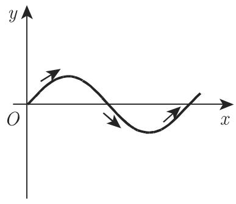
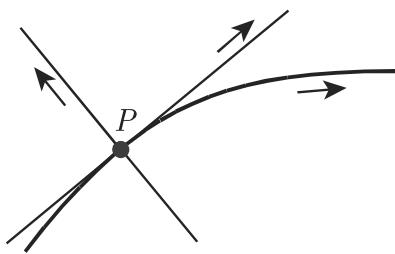
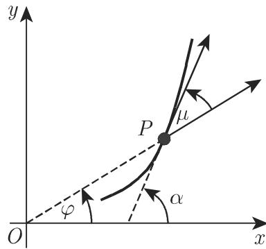
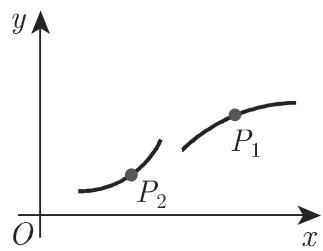
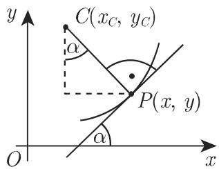
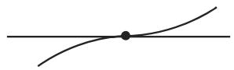
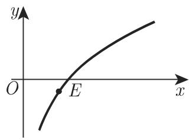
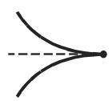
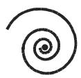
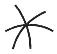

#### 3.6.1 平面曲线

3.6.1.1 定义平面曲线的方法

1. 坐标方程

(1) 笛卡儿坐标

a) 隐式

$$
F (x, y) = 0;\tag{3.483}
$$

b) 显式

$$
y = f (x),\tag{3.484}
$$

(2) 参数形式

$$
x = x (t), \quad y = y (t).\tag{3.485}
$$

(3) 极坐标

$$
\rho = f (\varphi).\tag{3.486}
$$

2. 曲线上的正方向

如果曲线是以 (3.485) 的形式给出，则它上面的正方向定义为参数 的值增加时曲线上的点 $P ( x ( t ) , y ( t ) )$ 移动的方向．如果曲线由 (3.484) 的形式给出，则横坐标可以看作参数 $( x = x , y = f ( x ) )$ ），因此正方向相应千横坐标的增加．对千 (3.486)的形式可以将角 $\varphi$ 看成参数 $( x = f ( \varphi ) \mathrm { c o s } \varphi , y = f ( \varphi ) \mathrm { s i n } \varphi )$ ，因此正方向相应 $\mathtt { F } \varphi$ 的增加即逆时针．

·图 3.219(a), (b), (c): $\mathbf { A } \colon x = t ^ { 2 } , y = t ^ { 3 } , \mathbf { B } \colon y = \sin x , \mathbf { C } \colon \rho = a \varphi .$

  
(a)

  
(b)  
3.219

  
(c)

3.6.1.2 曲线的局部元素

依赖千曲线上的动点 是否按形式 (3.484)\~(3.486) 给出，其位置由 x, t或 $\varphi$ 定义．在这里以参数值 $x + \mathrm { d } x , t + \mathrm { d } t$ 或 $\varphi { + } \mathrm { d } \varphi ^ { , }$ 任意接近千 的一个点记N.

1. 弧微分

如果 表示曲线从一个固定点 到点 的长，则无穷小增量 $\Delta s = \widehat { P N }$ 可以近似地由弧长的微分，即弧微分ds表示：

$$
\left\{ \begin{array}{l l} {\sqrt {1 + \left(\frac {\mathrm{d} y}{\mathrm{d} x}\right) ^ {2}}   \mathrm{d} x,} & {\text {对于形式(3.484)},} \end{array} \right.
$$

$$
\Delta s \approx \mathrm{d} s = \left\{ \begin{array}{l l} {{\sqrt {1 + \left(\frac {\mathrm{d}}{\mathrm{d} x}\right) ^ {2}} \mathrm{d} x,}} & {{\text {对于形式(3.484),}}} \\ {{\sqrt {x ^ {\prime 2} + y ^ {\prime 2}}   \mathrm{d} t,}} & {{\text {对于形式(3.485),}}} \\ {{\sqrt {\rho^ {2} + \rho^ {\prime 2}}   \mathrm{d} \varphi ,}} & {{\text {对于形式(3.486).}}} \end{array} \right.\tag{3.487}
$$

(3.488)

(3.489)

■ A: $y = \sin x , \mathrm { ~ d } s = { \sqrt { 1 + \cos ^ { 2 } x } } \mathrm { d } x .$

■ B: $x = t ^ { 2 } , y = t ^ { 3 } , \mathrm { d } s = | t | \sqrt { 4 + 9 t ^ { 2 } } \mathrm { d } t .$

■ C: $\rho = a \varphi ~ ( a > 0 ) , \mathrm { d } s = a \sqrt { 1 + \varphi ^ { 2 } } \mathrm { d } \varphi .$

2. 切线和法线

(1) 曲线在点 处的切线 是割线PN $N  P$ 时处千极限位置的一条直线；此处的法线是过 垂直千切线的一条直线（图 3.220).

  
3.220

(2) 切线和法线的方程 针对 (3.483), (3.484) (3.485) 三种情形在表 3.26中给出．这里 x,y 的坐标， X,Y 是切线和法线上点的坐标．导数值应在处计算

3.26 切线和法线方程

<table><tr><td>方程类型</td><td>切线方程</td><td>法线方程</td></tr><tr><td>(3.483)</td><td> $\frac{\partial F}{\partial x}(X - x) + \frac{\partial F}{\partial y}(Y - y) = 0$ </td><td> $\frac{X - x}{\frac{\partial F}{\partial x}} = \frac{Y - y}{\frac{\partial F}{\partial y}}$ </td></tr><tr><td>(3.484)</td><td> $Y - y = \frac{\mathrm{d}y}{\mathrm{d}x}(X - x)$ </td><td> $Y - y = -\frac{1}{\frac{\mathrm{d}y}{\mathrm{d}x}}(X - x)$ </td></tr><tr><td>(3.485)</td><td> $\frac{Y - y}{y'} = \frac{X - x}{x'}$ </td><td> $x'(X - x) + y'(Y - y) = 0$ </td></tr></table>

关千曲线的切线方程和法线方程的一些例子

■ A: 圆 $x ^ { 2 } + y ^ { 2 } = 2 5$ 在点 $P ( 3 , 4 )$

a) 切线方程 $2 x ( X - x ) + 2 y ( Y - y ) = 0$ 或 $X x + \ Y y = 2 5$ , 考虑到点千圆上，有： $3 X + 4 Y = 2 5$

b) 法线方程 ${ \frac { X - x } { 2 x } } = { \frac { Y - y } { 2 y } }$ 或 $Y = { \frac { y } { x } } X$ . L. \_ ；在点 P: $Y = { \frac { 4 } { 3 } } X$

■ B: 正弦曲线 $y = \sin x$ 在点 0(0, 0):

a) 切线方程 $Y - \sin x = \cos x ( X - x )$ 或 $Y = X \cos x + \sin x - x \cos x ;$ 在点 $( 0 , 0 ) \colon Y = X$

b) 法线方程 $Y - \sin x = - { \frac { 1 } { \cos x } } ( X - x )$ 或 $Y = - X { \sec { x } } + \sin { x } + x { \sec { x } } ;$ 在点 $( 0 , 0 ) \colon Y = - X$

■ C: 曲线 $x = t ^ { 2 } , y = t ^ { 3 }$ 在点 $P ( 4 , - 8 ) , t = - 2$

a) 切线方程 ${ \frac { Y - t ^ { 3 } } { 3 t ^ { 2 } } } = { \frac { X - t ^ { 2 } } { 2 t } }$ 或 $Y = { \frac { 3 } { 2 } } t X - { \frac { 1 } { 2 } } t ^ { 3 }$ 气在点 $P \colon Y = - 3 X + 4$

b) 法线方程 $2 t ( X - t ^ { 2 } ) + 3 t ^ { 2 } ( Y - t ^ { 3 } ) = 0$ 或 $2 X + 3 t Y = t ^ { 2 } ( 2 + 3 t ^ { 2 } )$ ；在点 $P ( 4 , - 8 ) \colon X - 3 Y = 2 8$

(3) 曲线的切线和法线的正方向 如果曲线由 (3.484), (3.485), (3.486) 中的形式之一给出，则切线和法线上的正方向按以下方式定义：切线的正方向与切点处曲线的正方向相同而从切线的正方向逆时针围绕 $P$ 旋转 $9 0 ^ { \circ }$ 则得到法线的正方向（图 3.221)．切线和法线被点 分成正的和负的半直线．

(4) 切线的斜率 可以巾以下度量确定：

a) 切线的斜率角 $\alpha ,$ 即横坐标轴的正向与切线的夹角，或

b) 角 $\mu$ （如果曲线巾极坐标给出），即向径 $O P ( \overline { { O P } } = \rho )$ 与切线正方向之间的夹角（图 3.222) ．对千角 $\alpha$ 和 $\mu { \overset { \cdot } { } }$ 下列公式成立，其中 ds (3.487) (3.489) 计算：

$$
\tan \alpha = \frac {\mathrm{d} y}{\mathrm{d} x}, \quad \cos \alpha = \frac {\mathrm{d} x}{\mathrm{d} s}, \quad \sin \alpha = \frac {\mathrm{d} y}{\mathrm{d} s};\tag{3.490a}
$$

$$
\tan \mu = \frac {\rho}{\frac {\mathrm{d} \rho}{\mathrm{d} \varphi}}, \quad \cos \mu = \frac {\mathrm{d} \rho}{\mathrm{d} s}, \quad \sin \mu = \rho \frac {\mathrm{d} \varphi}{\mathrm{d} s}.\tag{3.490b}
$$

  
3.221

  
3.222

■ A: y = sinx, tan a= cosx, cos $\alpha = { \frac { 1 } { \sqrt { 1 + \cos ^ { 2 } x } } }$ , si $\mathrm { n } \alpha = { \frac { \cos { x } } { \sqrt { 1 + \cos ^ { 2 } { x } } } } ;$

■ B: $x = t ^ { 2 } , y = t ^ { 3 } , \tan \alpha = { \frac { 3 t } { 2 } } , \cos \alpha = { \frac { 2 } { \sqrt { 4 + 9 t ^ { 2 } } } } , \sin \alpha = { \frac { 3 t } { \sqrt { 4 + 9 t ^ { 2 } } } } ;$

■ C: $\rho = a \varphi , \tan \mu = \varphi , \cos \mu = { \frac { 1 } { \sqrt { 1 + \varphi ^ { 2 } } } } , \sin \mu = { \frac { \varphi } { \sqrt { 1 + \varphi ^ { 2 } } } } .$

(5) 切线和法线线段，次切距和次法距（图 3.223)

a) 应用笛卡儿坐标对千 (3.484), (3.485) 形式的定义有

$$
\overline {{{P T}}} = \left| \frac {y}{y ^ {\prime}} \sqrt {1 + y ^ {\prime 2}} \right| \quad (\text {切线线段}),\tag{3.491a}
$$

$$
\overline {{{{P N}}}} = \left| y \sqrt {1 + {y ^ {\prime}} ^ {2}} \right| \quad (\text {法线线段}),\tag{3.491b}
$$

$$
\overline {{{{P ^ {\prime} T}}}} = \left| \frac {y}{y ^ {\prime}} \right| \quad (\text {次切距}),\tag{3.491c}
$$

$$
\overline {{{{P ^ {\prime} N}}}} = | y y ^ {\prime} | \quad (\text {次法距}).\tag{3.491d}
$$

b) 应用极坐标对千 (3.486) 形式的定义有

$$
\overline {{{{P T ^ {\prime}}}}} = \left| \frac {\rho}{\rho^ {\prime}} \sqrt {\rho^ {2} + \rho^ {\prime 2}} \right| \quad (\text {极切线线段}),\tag{3.492a}
$$

$$
\overline {{{{P N ^ {\prime}}}}} = \left| \sqrt {\rho^ {2} + \rho^ {\prime 2}} \right| \quad (\text {极法线线段}),\tag{3.492b}
$$

$$
\overline {{{{O T ^ {\prime}}}}} = \left| \frac {\rho^ {2}}{\rho^ {\prime}} \right| \quad (\text {极次切距}),\tag{3.492c}
$$

$$
\overline {{{{O N ^ {\prime}}}}} = | \rho^ {\prime} | \quad (\text {极次法距}).\tag{3.492d}
$$

■ A: $y = \cosh x \ , \ y ^ { \prime } = \sinh x \ , \ \sqrt { 1 + { y ^ { \prime } } ^ { 2 } } = \cosh x \ ; \ \overline { { P T } } = \vert \cosh x \coth x \vert$ ${ \overline { { P N } } } =$ $| \mathrm { c o s h } ^ { 2 } x | , \overline { { P ^ { \prime } T } } = | \mathrm { c o t h } x | , \overline { { P ^ { \prime } N } } = | \sinh x \cosh x | .$

■ $\mathbf { B } \colon \rho = a \varphi \ ( a > 0 ) , \ \rho ^ { \prime } = a , \ { \sqrt { \rho ^ { 2 } + \rho ^ { \prime } { } ^ { 2 } } } = a { \sqrt { 1 + \varphi ^ { 2 } } } ; \ { \overline { { P T ^ { \prime } } } } = \left| a \varphi { \sqrt { 1 + \varphi ^ { 2 } } } \right|$ ${ \overline { { P N ^ { \prime } } } } = \left| a { \sqrt { 1 + \varphi ^ { 2 } } } \right| , { \overline { { O T ^ { \prime } } } } = \left| a \varphi ^ { 2 } \right| , { \overline { { O N ^ { \prime } } } } = a$

(6) 两曲线之间的夹角 两曲线 ${ \cal { T } } _ { 1 }$ 和 $\boldsymbol { { \Gamma } } _ { 2 }$ 在它们的交点 处的夹角 $\beta$ 定义为它们的切线在点 $P$ 处的夹角（图 3.224)．根据这一定义，角 $\beta$ 的计算简化为斜率是

$$
k _ {1} = \tan \alpha_ {1} = \left(\frac {\mathrm{d} f _ {1}}{\mathrm{d} x}\right) _ {P},\tag{3.493a}
$$

$$
k _ {2} = \tan \alpha_ {2} = \left(\frac {\mathrm{d} f _ {2}}{\mathrm{d} x}\right) _ {P}\tag{3.493b}
$$

的两条直线之间夹角的计算这里 $y = f _ { 1 } ( x )$ 是 ${ \cal { T } } _ { 1 }$ 的方程而 $y = f _ { 2 } ( x )$ 是 $T _ { 2 }$ 的方程，导数是在 点处计算的借助公式

$$
\tan \beta = \tan (\alpha_ {2} - \alpha_ {1}) = \frac {\tan \alpha_ {2} - \tan \alpha_ {1}}{1 + \tan \alpha_ {1} \tan \alpha_ {2}}\tag{3.494}
$$

我们得到 $| \beta .$

·确定抛物线 $y = { \sqrt { x } }$ 和 $y = x ^ { 2 }$ 在点 $P ( 1 , 1 )$ 处的夹角：

$$
\begin{array}{r l} & {\tan \alpha_ {1} = \left(\frac {\mathrm{d} \sqrt {x}}{\mathrm{d} x}\right) _ {x = 1} = \frac {1}{2}, \quad \tan \alpha_ {2} = \left(\frac {\mathrm{d} (x ^ {2})}{\mathrm{d} x}\right) _ {x = 1} = 2,} \\ & {\tan \beta = \frac {\tan \alpha_ {2} - \tan \alpha_ {1}}{1 + \tan \alpha_ {1} \tan \alpha_ {2}} = \frac {3}{4}.} \end{array}
$$

3. 曲线的凸和凹部分

如果一条曲线由显式函数 $y = f ( x )$ 给出，则可以检查在包含点 的一小部分曲线是上凹还是下凹，当然 是拐点或奇点除外（参见第 334 3.6.1.3)．如果二阶导数 $f ^ { \prime \prime } ( x ) > 0$ （假如存在的话），则曲线是上凹的，即朝 的正向（图 3.225 中的点 $P _ { 2 } )$ ．如果 $f ^ { \prime \prime } ( x ) < 0$ 成立 $( \nvDash _ { \mathbb { 1 } } \ P _ { 1 } )$ ，则曲线是下凹的．在 $f ^ { \prime \prime } ( x ) = 0$ 的情形应该检验它是否是拐点

■ $y = x ^ { 3 }$ （图 $2 . 1 5 ( \mathrm { b } ) ,$ ; $y ^ { \prime \prime } = 6 x$ 对千 $x > 0$ 曲线是上凹的，对千 $x < 0$ 曲线是下凹的．

  
3.223

  
3.224

  
3.225

4. 曲率和曲率半径

(1) 曲线的曲率 曲线在点 处的曲率 是点 处的正切线方向之间的夹角 （图 3.226) 与弧长下飞（当 $\widehat { P N }$ $\widehat { P N } \to 0$ 时）之比的极限：

$$
K = \lim _ {\widehat {P N} \to 0} \frac {\delta}{\widehat {P N}}.\tag{3.495}
$$

曲率 的符号依赖千该曲线朝法线正的一半 $( K > 0 )$ 弯曲还是朝法线负的一半$( K < 0 )$ 弯曲（参见第 327 3.6.1.1, 2.）．换旬话说，曲率中心对千 $K > 0$ 而言是在法线的正侧对千 $K < 0$ 而言是在法线的负侧有时曲率 仅被看成是一个正的量．千是上述极限取绝对值

  
3.226

(2) 曲线的曲率半径 曲线在点 处的曲率半径 是曲率绝对值的倒数：

$$
R = \frac {1}{| K |}.\tag{3.496}
$$

在点 处的曲率越大，曲率半径越小．

：对千半径为 的圆，每点处的曲率 $K = { \frac { 1 } { a } }$ 而曲率半径 $R = a$ 是常数．

：对千直线有 $K = 0 , R = \infty$

(3) 曲率和曲率半径的公式

使用通常的记号 $\delta = \mathrm { d } \alpha$ 和 $\widehat { P N } = \mathrm { d } s$ ，有

$$
K = \frac {\mathrm{d} \alpha}{\mathrm{d} s}, \quad R = \left| \frac {\mathrm{d} s}{\mathrm{d} \alpha} \right|.\tag{3.497}
$$

对千第 326 3.6.1.1 曲线的不同定义公式， 的不同表达式为：(3.484) 中的定义：

$$
K = \frac {\frac {\mathrm{d} ^ {2} y}{\mathrm{d} x ^ {2}}}{\left[ 1 + \left(\frac {\mathrm{d} y}{\mathrm{d} x}\right) ^ {2} \right] ^ {3 / 2}}, \quad R = \left| \frac {\left[ 1 + \left(\frac {\mathrm{d} y}{\mathrm{d} x}\right) ^ {2} \right] ^ {3 / 2}}{\frac {\mathrm{d} ^ {2} y}{\mathrm{d} x ^ {2}}} \right|.\tag{3.498}
$$

(3.485) 中的定义：

$$
K = \frac {\left| \begin{array}{c c} x ^ {\prime} & y ^ {\prime} \\ x ^ {\prime \prime} & y ^ {\prime \prime} \end{array} \right|}{\left(x ^ {\prime 2} + y ^ {\prime 2}\right) ^ {3 / 2}}, R = \left| \frac {(x ^ {\prime 2} + y ^ {\prime 2}) ^ {3 / 2}}{\left| \begin{array}{c c} x ^ {\prime} & y ^ {\prime} \\ x ^ {\prime \prime} & y ^ {\prime \prime} \end{array} \right|} \right|.\tag{3.499}
$$

(3.483) 中的定义：

$$
K = \frac {\left| \begin{array}{c c c} F _ {x x} & F _ {x y} & F _ {x} \\ F _ {y x} & F _ {y y} & F _ {y} \\ F _ {x} & F _ {y} & 0 \end{array} \right|}{\left(F _ {x} ^ {2} + F _ {y} ^ {2}\right) ^ {3 / 2}}, R = \left| \begin{array}{c c c} & & \\ & & \left(F _ {x} ^ {2} + F _ {y} ^ {2}\right) ^ {3 / 2} \\ \hline \left| \begin{array}{c c c} F _ {x x} & F _ {x y} & F _ {x} \\ F _ {y x} & F _ {y y} & F _ {y} \\ F _ {x} & F _ {y} & 0 \end{array} \right| \end{array} \right|.\tag{3.500}
$$

(3.486) 中的定义：

$$
K = \frac {\rho^ {2} + 2 \rho^ {\prime 2} - \rho \rho^ {\prime \prime}}{(\rho^ {2} + \rho^ {\prime 2}) ^ {3 / 2}}, R = \left| \frac {(\rho^ {2} + \rho^ {\prime 2}) ^ {3 / 2}}{\rho^ {2} + 2 \rho^ {\prime 2} - \rho \rho^ {\prime \prime}} \right|.\tag{3.501}
$$

■ A: $y = \cosh x$ ， $K = \frac { 1 } { \cosh ^ { 2 } x } ;$

■ B: $x = t ^ { 2 } , \quad y = t ^ { 3 } , \quad K = \frac { 6 } { t ( 4 + 9 t ^ { 2 } ) ^ { 3 / 2 } } ;$

■ C: $y ^ { 2 } - x ^ { 2 } = a ^ { 2 }$ ， $K = { \frac { a ^ { 2 } } { ( x ^ { 2 } + y ^ { 2 } ) ^ { 3 / 2 } } } ;$

■ D: $\rho = a \varphi$ $K = \frac { 1 } { a } \cdot \frac { \varphi ^ { 2 } + 2 } { ( \varphi ^ { 2 } + 1 ) ^ { 3 / 2 } }$

5. 曲率圆和曲率中心

(1) 曲率圆 点处的曲率圆是过 和曲线上两个邻近的点 的圆当 $N  P$ 和 $M  P$ 时的极限位置（图 3.227)．它过曲线上的点并在此具有与曲线相同的一阶导数和二阶导数．因此它在切点处对曲线拟合得特别好．曲率圆也称为密切圆它的半径是曲率半径，其值是曲率绝对值的倒数

(2) 曲率中心 曲率圆的中心 是点 的曲率中心．它位千曲线凹的一侧，并在该曲线的法线上．

(3) 曲率中心的坐标 对千由第 326 3.6.1.1 中的方程定义的曲线，其曲率中心的坐标 $( x _ { C } , y _ { C } )$ 可以用以下公式确定．

(3.484) 中的定义：

$$
x _ {C} = x - \frac {\frac {\mathrm{d} y}{\mathrm{d} x} \left[ 1 + \left(\frac {\mathrm{d} y}{\mathrm{d} x}\right) ^ {2} \right]}{\frac {\mathrm{d} ^ {2} y}{\mathrm{d} x ^ {2}}}, \quad y _ {C} = y + \frac {1 + \left(\frac {\mathrm{d} y}{\mathrm{d} x}\right) ^ {2}}{\frac {\mathrm{d} ^ {2} y}{\mathrm{d} x ^ {2}}}.\tag{3.502}
$$

(3.485) 中的定义：

$$
x _ {C} = x - \frac {y ^ {\prime} (x ^ {\prime 2} + y ^ {\prime 2})}{\left| \begin{array}{c c} x ^ {\prime} & y ^ {\prime} \\ x ^ {\prime \prime} & y ^ {\prime \prime} \end{array} \right|}, \quad y _ {C} = y + \frac {x ^ {\prime} (x ^ {\prime 2} + y ^ {\prime 2})}{\left| \begin{array}{c c} x ^ {\prime} & y ^ {\prime} \\ x ^ {\prime \prime} & y ^ {\prime \prime} \end{array} \right|}.\tag{3.503}
$$

(3.486) 中的定义：

$$
x _ {C} = \rho \cos \varphi - \frac {(\rho^ {2} + \rho^ {\prime 2}) (\rho \cos \varphi + \rho^ {\prime} \sin \varphi)}{\rho^ {2} + 2 \rho^ {\prime 2} - \rho \rho^ {\prime \prime}},
$$

$$
y _ {C} = \rho \sin \varphi - \frac {(\rho^ {2} + \rho^ {\prime 2}) (\rho \sin \varphi - \rho^ {\prime} \cos \varphi)}{\rho^ {2} + 2 \rho^ {\prime 2} - \rho \rho^ {\prime \prime}}.\tag{3.504}
$$

(3.483) 中的定义：

$$
x _ {C} = x + \frac {F _ {x} \left(F _ {x} ^ {2} + F _ {y} ^ {2}\right)}{\left| \begin{array}{c c c} F _ {x x} & F _ {x y} & F _ {x} \\ F _ {y x} & F _ {y y} & F _ {y} \\ F _ {x} & F _ {y} & 0 \end{array} \right|}, \quad y _ {C} = y + \frac {F _ {y} \left(F _ {x} ^ {2} + F _ {y} ^ {2}\right)}{\left| \begin{array}{c c c} F _ {x x} & F _ {x y} & F _ {x} \\ F _ {y x} & F _ {y y} & F _ {y} \\ F _ {x} & F _ {y} & 0 \end{array} \right|}.\tag{3.505}
$$

这些公式可以变换成形式

$$
x _ {C} = x - R \sin \alpha , y _ {C} = y + R \cos \alpha\tag{3.506}
$$

或

$$
x _ {C} = x - R \frac {\mathrm{d} y}{\mathrm{d} s}, \quad y _ {C} = y + R \frac {\mathrm{d} x}{\mathrm{d} s} (\text {图} 3. 2 2 8).\tag{3.507}
$$

其中 应该像在 (3.498) $\Xi$ (3.501) 中那样计算．

  
3.227

  
3.228

3.6.1.3 曲线的特殊点

以下仅讨论在坐标变换下仍保持不变的点．极大值和极小值的确定见第 5966.1.5.3.

  
3.229

1. 拐点及其确定规则

拐点是曲线上曲率改变其符号的点（图 3.229)．拐点处的切线与曲线相交，因此在它附近曲线位千切线的两侧在拐点有 $K = 0$ 且 $R = \infty$

(1) 曲线的显定义式 (3.484) $y = f ( x )$

a) 必要条件 如果曲线上一点处存在二阶导数，则该点为拐点的必要条件是此二阶导数的值为零（关千不存在二阶导数的情形见 b))

$$
f ^ {\prime \prime} (x) = 0\tag{3.508}
$$

在二阶导数存在的情形，为了确定拐点需要找出 $f ^ { \prime \prime } ( x ) = 0$ 的所有根 $x _ { 1 } , x _ { 2 } , \cdots ,$ $x _ { i } , \cdots , x _ { n }$ 九，并将它们代入接下来所求的更高阶导数中．如果对千值 $x _ { i }$ 而言的第一个非零导数具有奇数阶，则在此存在一个拐点．如果所考虑的点不是一个拐点因为第一个不为零的导数阶数 是偶数，则对千 $f ^ { ( k ) } ( x ) < 0$ 有曲线是下凹的；对千$f ^ { ( k ) } ( x ) > 0$ 有曲线是上凹的．对千高阶导数无法检验的情形，例如它们不存在时，b).

b) 充分条件 拐点存在的一个充分条件是当从该点左侧过渡到右侧时二阶导数 $f ^ { \prime \prime } ( x )$ 的符号发生改变．因此曲线在横坐标为 $x _ { i }$ 的点是否具有拐点的问题，可以通过检验经该点的二阶导数的符号来回答：如果经过时符号发生改变，则存在一个拐点．这一方法也可以用千 $y ^ { \prime \prime } = \infty$ 的情形

${ \bf a } \colon y = { \frac { 1 } { 1 + x ^ { 2 } } } , f ^ { \prime \prime } ( x ) = - 2 { \frac { 1 - 3 x ^ { 2 } } { ( 1 + x ^ { 2 } ) ^ { 3 } } } , x _ { 1 , 2 } = \pm { \frac { 1 } { \sqrt { 3 } } } , f ^ { \prime \prime \prime } ( x ) = 2 4 x { \frac { 1 - x ^ { 2 } } { ( 1 + x ^ { 2 } ) ^ { 4 } } } ,$ $f ^ { \prime \prime \prime } ( x _ { 1 , 2 } ) \neq 0$ . 拐点： $A \left( { \frac { 1 } { \sqrt { 3 } } } , { \frac { 3 } { 4 } } \right) , B \left( - { \frac { 1 } { \sqrt { 3 } } } , { \frac { 3 } { 4 } } \right)$

■ B: $y = x ^ { 4 } , f ^ { \prime \prime } ( x ) = 1 2 x ^ { 2 } , x _ { 1 } = 0 , f ^ { \prime \prime \prime } ( x ) = 2 4 x , f ^ { \prime \prime \prime } ( x _ { 1 } ) = 0 , f ^ { T V } ( x ) = 2 4 ;$ 不存在拐点■ C: $y = x ^ { \frac { 5 } { 3 } } , y ^ { \prime } = { \frac { 5 } { 3 } } x ^ { \frac { 2 } { 3 } } , y ^ { \prime \prime } = { \frac { 1 0 } { 9 } } x ^ { - { \frac { 1 } { 3 } } }$ ；对 $x = 0$ 我们有 $y ^ { \prime \prime } = \infty$

由千 的值在从负到正的变化过程中，二阶导数的符号从“—"变到“十＂，因此曲线在 $x = 0$ 处具有拐点

评论 在实践中，如果从曲线的形状推出拐点存在，例如在具有连续导数的极大值和极小值之间，则仅确定点 $x _ { i }$ 而不检验更高阶的导数．

(2) 曲线的其他定义形式 针对 (3.484) 情形的曲线定义形式而得到的拐点存在的必要条件 (3.508) 对千其他的定义公式将具有如下的分析形式：

a) (3.485) 中的参数形式定义：

$$
\left| \begin{array}{c c} x ^ {\prime} & y ^ {\prime} \\ x ^ {\prime \prime} & y ^ {\prime \prime} \end{array} \right| = 0.\tag{3.509}
$$

b) (3.486) 中的极坐标定义：

$$
\rho^ {2} + 2 \rho^ {\prime 2} - \rho \rho^ {\prime \prime} = 0.\tag{3.510}
$$

c) (3.483) 中的隐式定义：

$$
F (x, y) = 0 \quad {\text {和}} \quad \left| \begin{array}{c c c} {{F _ {x x}}} & {{F _ {x y}}} & {{F _ {x}}} \\ {{F _ {y x}}} & {{F _ {y y}}} & {{F _ {y}}} \\ {{F _ {x}}} & {{F _ {y}}} & {{0}} \end{array} \right| = 0  .\tag{3.511}
$$

在这些情形中，解系给出了可能拐点的坐标

$\mathbf { A } { \mathrm { : } } x = a \left( t - { \frac { 1 } { 2 } } \sin t \right)$ $y = a \left( 1 - { \frac { 1 } { 2 } } \cos t \right)$ （参见第 132 页短摆线（图 2.68b));

$$
\left| \begin{array}{c c} x ^ {\prime} & y ^ {\prime} \\ x ^ {\prime \prime} & y ^ {\prime \prime} \end{array} \right| = \frac {a ^ {2}}{4} \left| \begin{array}{c c} 2 - \cos t & \sin t \\ \sin t & \cos t \end{array} \right| = \frac {a ^ {2}}{4} (2 \cos t - 1);
$$

$$
\cos t _ {k} = \frac {1}{2}; \quad t _ {k} = \pm \frac {\pi}{3} + 2 k \pi \quad (k = 0, \pm 1, \pm 2, \dots).
$$

对千参数值 $t _ { k }$ 该曲线具有无穷多个拐点

■ B: $\rho = \frac { 1 } { \sqrt { \varphi } } ; \rho ^ { 2 } + 2 \rho ^ { \prime 2 } - \rho \rho ^ { \prime \prime } = \frac { 1 } { \varphi } + \frac { 1 } { 2 \varphi ^ { 3 } } - \frac { 3 } { 4 \varphi ^ { 3 } } = \frac { 1 } { 4 \varphi ^ { 3 } } ( 4 \varphi ^ { 2 } - 1 )$ . 拐点位千角$\varphi = \frac 1 2$

■ C: $x ^ { 2 } - y ^ { 2 } = a ^ { 2 }$ （双曲线）． $\left| \begin{array} { c c c } { F _ { x x } } & { \cdot } & { \cdot } \\ { \cdot } & { \cdot } & { \cdot } \\ { \cdot } & { \cdot } & { \cdot } \end{array} \right| = \left| \begin{array} { c c c } { 2 } & { 0 } & { 2 x } \\ { 0 } & { - 2 } & { - 2 y } \\ { 2 x } & { - 2 y } & { 0 } \end{array} \right| = 8 x ^ { 2 } - 8 y ^ { 2 } .$ ．方

程 $x ^ { 2 } - y ^ { 2 } = a ^ { 2 }$ 和 $8 ( x ^ { 2 } - y ^ { 2 } ) = 0$ 相互矛盾，因此双曲线没有拐点．

  
(a)

  
3.230  
(b)

2. 顶点

顶点是曲线上曲率具有极大值或极小值的点．例如椭圆具有四个顶点 A,B,C,，对数函数的曲线在 $E \left( { \frac { 1 } { \sqrt { 2 } } } , - { \frac { \ln 2 } { 2 } } \right)$ 具有一个顶点（图 3.230)．确定顶点可以转化成确定 的极值，或者 的极值，如果这样做更简单的话．公式 (3.498)\~(3.501)可用来计算

3. 奇点

奇点是曲线上各种特殊点的总称

(1) 奇点的类型 a), b), · · ·, j) 对应千图 3.231 中的表示

a) 二重点 在二重点曲线与自己相交（图 3.231(a)).

b) 孤立点 孤立点满足曲线的方程；但它与该曲线分离（图 3.231(b)).

c), d) 尖点 在尖点处曲线的方向发生改变；根据切线的位置可以区分出第一类尖点和第二类尖点（图 3.231(c), (d)).

e) 密切点 在密切点处曲线与自身接触（图 3.231(e)).

f) 角点 在角点处曲线突然改变其方向，但与尖点不同的是在此曲线的两不同支具有两条不同的切线（图 3.231(f)).

g) 终点在终点处曲线终止（图 3.231(g)).

h) 渐近点 在渐近点附近当曲线任意趋近千它时通常将环绕无限次．

i)'j) 更多的奇点 有可能曲线在同一点处具有两个或更多的这样的奇点（图 3.231(i), (j)).

  
(a)

  
(b)

  
(c)

  
(d)  
(e)

  
(f)

  
(g)

  
(h)  
3.231

  
(i)

  
(j)

(2) 密切点、角点、终点和渐近点的确定 这些类型的奇点仅在超越函数（参见261 3.5.2.5) 的曲线上出现

角点相应千导数 $\frac { \mathrm { d } y } { \mathrm { d } x }$ 有限跳跃．

曲线的终点相应千函数 $y = f ( x )$ 具有有限跳跃的间断点或直接终止．

渐近点可以在曲线由极坐标形式 $\dot { \iota } \rho = f ( \varphi )$ 给出的情形中以最容易的方式确定．如果当 $\varphi  \infty$ 或 $\varphi  - \infty$ 时极限等千 $0 \ ( \operatorname* { l i m } \ \rho = 0 )$ ，这极点是一个渐近点

■ A: 对千曲线 $y = \frac { x } { 1 + \mathrm { e } ^ { \frac { 1 } { x } } }$ （图 6.2c) （参见第 582 6.1.1) 原点是一个角点．

■ B: 点（ 1, 0) (1, 1) 是函数 $y = { \frac { 1 } { 1 + \mathrm { e } ^ { \frac { 1 } { x - 1 } } } }$ （图 2.8) （参见第 70 2.1.4.5) 的间断点．

：对数螺线 ${ \mathrm { i } } \rho = a \mathrm { e } ^ { k \varphi }$ （图 2.75) （参见第 138 2.14.3) 在原点处具有一个渐近点

(3) 多重点的确定（情形 a) e)，以及 i) j) 这里用一般术语多重点表示二重点、三重点等等．为了确定它们，我们从形式为 $F ( x , y ) = 0$ 的曲线方程出发满足三个方程 $F = 0 , F _ { x } = 0$ 和 $F _ { y } = 0$ 具有坐标 $( x _ { 1 } , y _ { 1 } )$ 的一个点 A, 当三个二阶导数 $F _ { x x } , F _ { x y }$ 和 $F _ { y y }$ 至少一个不为零时是一个二重点．否则 是一个三重点或具有更高重数的点．

二重点的性质依赖千雅可比行列式

$$
\Delta = \left| \begin{array}{c c} F _ {x x} & F _ {x y} \\ F _ {y x} & F _ {y y} \end{array} \right| \binom{x = x _ {1}}{y = y _ {1}}\tag{3.512}
$$

的符号

情形 $\mathbf { \Delta } \mathbf { \Delta } \mathbf { \Delta } \mathbf { \Delta } \mathbf { \Delta } \mathbf { \Delta } \mathbf { \Delta } \mathbf { \Delta } \mathbf { \Delta } \mathbf { \Delta } \mathbf { \Delta } \mathbf { \Delta } \mathbf { \Delta } \mathbf { \Delta } \mathbf { \Delta } \mathbf { \Delta } \mathbf { \Delta } \mathbf { \Delta } \mathbf { \Delta } \mathbf { \Delta } \mathbf { \Delta } \mathbf { \Delta } \mathbf { \Delta } \mathbf { \Delta } \mathbf { \Delta } \mathbf { \Delta } \mathbf { \Delta } \mathbf { \Delta } \mathbf { \Delta } \mathbf { \Delta } \mathbf { \Delta } \mathbf { \Delta } \mathbf { \Delta } \mathbf { \Delta } \mathbf { \Delta } \mathbf { \Delta } \mathbf { \Delta } \mathbf { \Delta } \mathbf { \Delta } \mathbf { \Delta } \mathbf { \Delta } \mathbf { \Delta } \mathbf { \Delta } \mathbf { \Delta } \mathbf { \Delta } \mathbf { \Delta } \mathbf { \Delta } \mathbf { \Delta } \mathbf { \Delta } \mathbf { \Delta } \mathbf { \Delta } \mathbf { \Delta } \mathbf { \Delta } \mathbf \mathbf { \Delta } \mathbf { \Delta } \mathbf \Delta \mathbf { } \Delta \mathbf \Delta \mathbf { } \Delta \mathbf \Delta \mathbf { } \Delta \mathbf \Delta \mathbf \mathbf { } \Delta \Delta \mathbf \mathbf \Delta \mathbf { } \Delta \mathbf \Delta \mathbf \Sigma \Sigma \Sigma \Sigma \mathbf \Sigma \Sigma \Sigma \Sigma \mathbf \Sigma \Sigma \Sigma \Sigma \Sigma \mathbf \Sigma \Sigma \Sigma \Sigma \Sigma \Sigma \mathbf \Sigma \Sigma \Sigma \Sigma \mathbf \Sigma \Sigma \Sigma \Sigma \Sigma \Sigma \Sigma \Sigma \Sigma \Sigma \Sigma \Sigma \Sigma \Sigma \Sigma \mathbf \Sigma \Sigma \Sigma \Sigma \Sigma \Sigma \Sigma \Sigma \Sigma \Sigma \Sigma \Sigma \Sigma \Sigma \Sigma \Sigma \Sigma \Sigma \Sigma \Sigma \Sigma \Sigma \Sigma \Sigma \Sigma \Sigma \Sigma \Sigma \Sigma \Sigma \Sigma \Sigma \Sigma \Sigma \Sigma \Sigma \Sigma \Sigma \Sigma \Sigma \Sigma \Sigma \Sigma \Sigma \Sigma \Sigma \Sigma \Sigma \Sigma \Sigma \Sigma \Sigma \Sigma \Sigma \Sigma \Sigma \Sigma \Sigma \Sigma \Sigma \Sigma \Sigma \Sigma \Sigma \Sigma \Sigma \Sigma \Sigma \Sigma \Sigma \Sigma \Sigma \Sigma \Sigma \Sigma \Sigma \Sigma \Sigma \Sigma \Sigma \Sigma \Sigma \Sigma \Sigma \Sigma \Sigma \Sigma \Sigma \Sigma \Sigma \Sigma \Sigma \Sigma \Sigma \Sigma \Sigma \Sigma \Sigma \Sigma \Sigma \Sigma \Sigma \Sigma \Sigma \Sigma \Sigma \Sigma \Sigma \Sigma \Sigma \Sigma \Sigma \Sigma \Sigma \Sigma \Sigma \Sigma \Sigma \Sigma \Sigma \Sigma \Sigma \Sigma$ 当 $\varDelta \nobreakspace < \nobreakspace 0$ 时曲线在点 处自身相交；在点 处切线的斜率是方程

$$
F _ {y y} k ^ {2} + 2 F _ {x y} k + F _ {x x} = 0.\tag{3.513}
$$

的根

情形 $\mathbf { \Delta } \mathbf { \Delta } \mathbf { \Delta } \mathbf { \Delta } \mathbf { \Delta } \mathbf { \Delta } \mathbf { \Delta } \mathbf { \Delta } \mathbf { \Delta } \mathbf { \Delta } \mathbf { \Delta } \mathbf { \Delta } \mathbf { \Delta } \mathbf { \Delta } \mathbf { \Delta } \mathbf { \Delta } \mathbf { \Delta } \mathbf { \Delta } \mathbf { \Delta } \mathbf { \Delta } \mathbf { \Delta } \mathbf { \Delta } \mathbf { \Delta } \mathbf { \Delta } \mathbf { \Delta } \mathbf { \Delta } \mathbf { \Delta } \mathbf { \Delta } \mathbf { \Delta } \mathbf { \Delta } \mathbf { \Delta } \mathbf { \Delta } \mathbf { \Delta } \mathbf { \Delta } \mathbf { \Delta } \mathbf { \Delta } \mathbf { \Delta } \mathbf { \Delta } \mathbf { \Delta } \mathbf { \Delta } \mathbf { \Delta } \mathbf { \Delta } \mathbf { \Delta } \mathbf { \Delta } \mathbf { \Delta } \mathbf { \Delta } \mathbf { \Delta } \mathbf { \Delta } \mathbf { \Delta } \mathbf { \Delta } \mathbf { \Delta } \mathbf \mathbf { \Delta } \mathbf { \Delta } \mathbf \Delta \mathbf { } \Delta \mathbf { \Delta } \mathbf \Delta \mathbf { } \Delta \mathbf \Delta \mathbf { } \Delta \mathbf \Delta \mathbf { } \Delta \mathbf \Delta \mathbf \Delta \mathbf { } \Delta \mathbf \Delta \mathbf \Delta \mathbf \mathbf { \Delta } \Delta \mathbf \mathbf \Delta \mathbf \delta \delta \delta \delta \delta \delta \delta \delta \delta \delta \delta \delta \delta \delta \delta \delta \delta \delta \delta \delta \delta \delta \delta \delta \delta \delta \delta \delta \delta \delta \delta \delta \delta \delta \delta \delta \delta \delta \delta \delta \delta \delta \delta \delta \delta \delta \delta \delta \delta \delta \delta \delta \delta \delta \delta \delta \delta \delta \delta \delta \delta \delta \delta \delta \delta \delta \delta \delta \delta \delta \delta \delta \delta \delta \delta \delta \delta \delta \delta \delta \delta \delta \delta \delta \delta \delta \delta \delta \delta \delta \delta \delta \delta \delta \delta \delta \delta \delta \delta \delta \delta \delta \delta \delta \delta \delta \delta \delta \delta \delta \delta \delta \delta \delta \delta \delta \delta \delta \delta \delta \delta \delta \delta \delta \delta \delta \delta \delta \delta \delta \delta \delta \delta \ c o \ c o \ c o \ c o \ c o \ c o \ c o \ c o \ c o \ c o \ c o \ c o \ c o \ c o \ c o \ c o \ c o \ c o \ c o \ c o \ c o$ 当 $\varDelta > 0$ 是一个孤立点

情形 $\mathbf { \nabla } \varDelta = \mathbf { 0 }$ 当 $\varDelta = 0$ 要么是一个尖点要么是一个密切点；切线的斜率是 F

$$
\tan \alpha = - \frac {F _ {x y}}{F _ {y y}}.\tag{3.514}
$$

关千多重点的更详细的研究建议将坐标系原点平移到点 并旋转坐标系使轴成为点 处的切线则从方程的形式人们可以说出它是第一类还是第二类尖点，或是一个密切点

##### 本节续页

- [（续2）](<3.6.1 平面曲线-2.md>)
