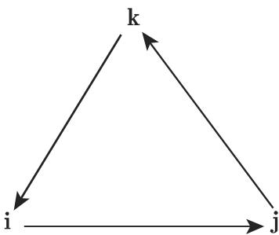

#### 4.4.1 四元数

4.4.1.1 定义和表示

1. 虚数单位

四元数是形如

$$
w + \mathbf {i} x + \mathbf {j} y + \mathbf {k} z\tag{4.106}
$$

的广义复数，其中 $w , x , y , z$ 是实数， i,j, 是广义虚数单位，它们满足下列乘法法则：

$$
\mathbf {i} ^ {2} = \mathbf {j} ^ {2} = \mathbf {k} ^ {2} = - 1, \quad \mathbf {i j} = \mathbf {k} = - \mathbf {j i}, \quad \mathbf {j k} = \mathbf {i} = - \mathbf {k j}, \quad \mathbf {k i} = \mathbf {j} = - \mathbf {i k},\tag{4.107}
$$

广义虚数单位的乘法法则见所附的乘法表．这个法则也可用图 4.4 中的圈表示．按箭头方向做乘法得到正号，反箭头方向产生负号．

乘法表

<table><tr><td></td><td>i</td><td>j</td><td>k</td></tr><tr><td>i</td><td>-1</td><td>k</td><td>-j</td></tr><tr><td>j</td><td>-k</td><td>-1</td><td>i</td></tr><tr><td>k</td><td>j</td><td>-i</td><td>-1</td></tr></table>

  
4.4

因此，乘法不可交换，但可结合为纪念哈密顿将定义了四元数乘法的四维欧氏向量空间 $\mathbb { R } ^ { 4 }$ 记作 H. 四元数形成一个代数，称作四元数除环．

2. 四元数的表示

四元数有不同的表示：

作为超复数 $q = w + \mathbf { i } x + \mathbf { j } y + \mathbf { k } z = q _ { 0 } + q$ , 其中标量部分 $q _ { 0 } = \operatorname { S c } q$ 向量部分$\pmb q = \mathrm { V e c } \pmb q$

作为由数 $w \in \mathbb { R }$ 和向量 $\left( x , y , z \right) ^ { \mathrm { T } } \in \mathbb { R } ^ { 3 }$ 组成的四维向量 $\boldsymbol { q } = ( w , x , y , z ) ^ { \mathrm { T } } =$ $( q _ { 0 } , \pmb q ) ^ { \mathrm { T } }$

三角式 $q = r ( \cos \varphi + { \underline { { n } } } _ { \pmb { q } } \sin \varphi )$ ，其中 $r = | q | = { \sqrt { w ^ { 2 } + x ^ { 2 } + y ^ { 2 } + z ^ { 2 } } }$ 是 $\mathbb { R } ^ { 4 }$ 中四维向量的长度并且 $\cos \varphi = { \frac { w } { | q | } }$ ，以及 $\underline { { n } } _ { \underline { { q } } } = \frac { 1 } { | ( x , y , z ) ^ { \mathrm { T } } | } ( x , y , z ) ^ { \mathrm { T } } . \underline { { n } } _ { \underline { { q } } }$ 是 $\mathbb { R } ^ { 3 }$ 中与$\underline { { \pmb q } }$ 有关的单位向量．

四元数的乘法法则不同千通常 $\mathbb { R } ^ { 3 }$ 和 $\mathbb { R } ^ { 4 }$ 中引进的法则（参见 (4.109b),(4.114), (4.115)).

3. 超复数与三角式间的关系

如果 $| \underline { { \boldsymbol q } } | \neq 0$ ，那么

$$
q = q _ {0} + \underline {{{\boldsymbol {q}}}} = | q | \left(\frac {q _ {0}}{| q |} + \frac {\underline {{{\boldsymbol {q}}}}}{| q |}\right) = | q | \left(\frac {q _ {0}}{| q |} + \frac {\underline {{{\boldsymbol {q}}}}}{| \underline {{{\boldsymbol {q}}}} |} \frac {| \underline {{{\boldsymbol {q}}}} |}{| q |}\right) = r (\cos \varphi + \underline {{{\boldsymbol {n}}}} _ {\underline {{{\boldsymbol {q}}}}} \sin \varphi).\tag{4.108a}
$$

如果 $| q | = 0$ ，那么当 $q _ { 0 } \neq 0$ 时有

$$
q = q _ {0} = | q _ {0} | \frac {q _ {0}}{| q _ {0} |} = \left\{ \begin{array}{l l} | q _ {0} | = | q _ {0} | \cos 0, & q _ {0} > 0, \\ | q _ {0} | (- 1) = | q _ {0} | \cos \pi , & q _ {0} <   0. \end{array} \right.\tag{4.108b}
$$

4. 纯四元数

纯四元数的标量部分为零： $q _ { 0 } = 0$ 纯四元数的集合记作 $\mathbb { H } _ { 0 }$ 。．我们经常将纯四元数 $\pmb q$ 等同千儿何向量 $\vec { q } \in \mathbb { R } ^ { 3 }$ ，即

$$
q = q _ {0} + \left\{ \begin{array}{l l} {\underline {{{{\boldsymbol {q}}}}},} & {\text {若}   \underline {{{{\boldsymbol {q}}}}}   \text {表示纯四元数},} \\ {\vec {q},} & {\text {若}   \underline {{{{\boldsymbol {q}}}}}   \text {解释为几何向量}.} \end{array} \right.\tag{4.109a}
$$

对千 $\underline { { { p } } } , \underline { { { q } } } \in \mathbb { H } _ { 0 }$ 。，乘法法则是

$$
\underline {{p}} \underline {{q}} = - \vec {p} \cdot \vec {q} + \vec {p} \times \vec {q},\tag{4.109b}
$$

其中·和 分别表示 $\mathbb { R } ^ { 3 }$ 的点积和叉积．（4.109b) 的结果解释为一个四元数．·令 $\nabla = \frac { \partial } { \partial x } \vec { \bf i } + \frac { \partial } { \partial y } \vec { \bf j } + \frac { \partial } { \partial z } \vec { \bf k }$ 是纳勃拉算子（参见第 933 13.2.6.1)，并令$\vec { \mathbf { v } } = v _ { 1 } ( x , y , z ) \vec { \mathbf { i } } + v _ { 2 } ( x , y , z ) \vec { \mathbf { j } } + v _ { 3 } ( x , y , z ) \vec { \mathbf { k } }$ 是一个向量场．这 $\vec { \bf i } , \vec { \bf j } , \vec { \bf k }$ 是笛卡儿坐标系中平行千坐标轴的单位向量．如果 $\nabla$ 解释为纯四元数，那么依据（4.107),它们的积是

$$
\begin{array}{c} \nabla \vec {\boldsymbol {v}} = - \frac {\partial v _ {1}}{\partial x} - \frac {\partial v _ {2}}{\partial y} - \frac {\partial v _ {3}}{\partial z} + \vec {\mathbf {i}} \left(\frac {\partial v _ {3}}{\partial y} - \frac {\partial v _ {2}}{\partial z}\right) \\ + \vec {\mathbf {j}} \left(\frac {\partial v _ {1}}{\partial z} - \frac {\partial v _ {3}}{\partial x}\right) + \vec {\mathbf {k}} \left(\frac {\partial v _ {2}}{\partial x} - \frac {\partial v _ {1}}{\partial y}\right). \end{array}
$$

这个四元数可以在向量解释下，写成

$$
\nabla \vec {\boldsymbol {v}} = - \mathrm{div} \tilde {\boldsymbol {v}} + \mathrm{rot} \tilde {\boldsymbol {v}},
$$

但这个结果应该看作四元数．

5. 单位四元数

如果 $| q | = 1$ ，那么四元数 $q$ 是单位四元数．单位四元数的集合记作 $\mathbb { H } . \ \mathbb { H } _ { 1 }$ 是所谓乘法李群．集合正可以等同千三维 $S ^ { 3 } = \{ \underline { { \pmb { x } } } \in \mathbb { R } ^ { 4 } : | \underline { { \pmb { x } } } | = 1 \}$

4.4.1.2 四元数的矩阵表示

1. 实矩阵

如果数 等同千恒等矩阵

$$
1 \triangleq \left( \begin{array}{c c c c} 1 & 0 & 0 & 0 \\ 0 & 1 & 0 & 0 \\ 0 & 0 & 1 & 0 \\ 0 & 0 & 0 & 1 \end{array} \right),\tag{4.110a}
$$

以及

$$
\mathbf {i} \stackrel {\wedge} {=} \left( \begin{array}{c c c c} 0 & - 1 & 0 & 0 \\ 1 & 0 & 0 & 0 \\ 0 & 0 & 0 & 1 \\ 0 & 0 & - 1 & 0 \end{array} \right), \quad \mathbf {j} \stackrel {\wedge} {=} \left( \begin{array}{c c c c} 0 & 0 & - 1 & 0 \\ 0 & 0 & 0 & - 1 \\ 1 & 0 & 0 & 1 \\ 0 & 1 & 0 & 0 \end{array} \right), \quad \mathbf {k} \stackrel {\wedge} {=} \left( \begin{array}{c c c c} 0 & 0 & 0 & 1 \\ 0 & 0 & - 1 & 0 \\ 0 & 1 & 0 & 0 \\ - 1 & 0 & 0 & 0 \end{array} \right),\tag{4.110b}
$$

那么四元数 $q = w + \mathbf { i } x + \mathbf { j } y + \mathbf { k } z$ 可以表示为矩阵

$$
q \stackrel {{\wedge}} {{=}} \left( \begin{array}{c c c c} w & - x & - y & z \\ x & w & - z & - y \\ y & z & w & x \\ - z & y & - x & w \end{array} \right).\tag{4.110c}
$$

2. 复矩阵

四元数可以通过复矩阵

$$
\mathbf {i} \triangleq \left( \begin{array}{c c} 0 & - \mathrm{i} \\ - \mathrm{i} & 0 \end{array} \right), \quad \mathbf {j} \triangleq \left( \begin{array}{c c} 0 & - 1 \\ 1 & 0 \end{array} \right), \quad \mathbf {k} \triangleq \left( \begin{array}{c c} - \mathrm{i} & 0 \\ 0 & \mathrm{i} \end{array} \right)\tag{4.111a}
$$

表示千是

$$
q = w + \mathbf {i} x + \mathbf {j} y + \mathbf {k} z \stackrel {{\wedge}} {{=}} \left( \begin{array}{c c} w - \mathrm{i} z & \mathrm{i} x - y \\ \mathrm{i} x + y & w + \mathrm{i} z \end{array} \right).\tag{4.111b}
$$

(1) 在方程 (4.llla, 4.lllb) 的右边， 表示复数的虚数单位．

(2) 四元数的矩阵表示并不唯一，即有可能给出与 (4.110b, 4.110c) (4.llla,4.lllb) 不同的表示

3. 共辄与逆元素

四元数 $q = w - \mathbf { i } x + \mathbf { j } y + \mathbf { k } z$ 的共辄是四元数

$$
\overline {{q}} = w - \mathbf {i} x - \mathbf {j} y - \mathbf {k} z.\tag{4.112a}
$$

显然，

$$
| q | ^ {2} = q \overline {{q}} = \overline {{q}} q = w ^ {2} + x ^ {2} + y ^ {2} + z ^ {2}.\tag{4.112b}
$$

因此每个四元数 $q \in$ HI ＼｛0} 都有逆元素

$$
q ^ {- 1} = \frac {\overline {{q}}}{| q | ^ {2}}.\tag{4.112c}
$$

4.4.1.3 计算法则

1. 加法和减法

两个或多个四元数的加法和减法定义为

$$
\begin{array}{r l} & q _ {1} + q _ {2} - q _ {3} + \dots \\ & = (w _ {1} + \mathbf {i} x _ {1} + \mathbf {j} y _ {1} + \mathbf {k} z _ {1}) + (w _ {2} + \mathbf {i} x _ {2} + \mathbf {j} y _ {2} + \mathbf {k} z _ {2}) \\ & \quad - (w _ {3} + \mathbf {i} x _ {3} + \mathbf {j} y _ {3} + \mathbf {k} z _ {3}) + \dots \\ & = (w _ {1} + w _ {2} - w _ {3} + \dots) + \mathbf {i} (x _ {1} + x _ {2} - x _ {3} + \dots) \\ & \quad + \mathbf {j} (y _ {1} + y _ {2} - y _ {3} + \dots) + \mathbf {k} (z _ {1} + z _ {2} - z _ {3} + \dots). \end{array}\tag{4.113}
$$

四元数的加减与 $\mathbb { R } ^ { 4 }$ 中的向量或矩阵的加减相同

2. 乘法

乘法是结合的，所以

$$
\begin{array}{r l} & q _ {1} q _ {2} = (w _ {1} + \mathbf {i} x _ {1} + \mathbf {j} y _ {1} + \mathbf {k} z _ {1}) (w _ {2} + \mathbf {i} x _ {2} + \mathbf {j} y _ {2} + \mathbf {k} z _ {2}) \\ & \qquad = (w _ {1} w _ {2} - x _ {1} x _ {2} - y _ {1} y _ {2} - z _ {1} z _ {2}) + \mathbf {i} (w _ {1} x _ {2} + w _ {2} x _ {1} + y _ {1} z _ {2} - z _ {1} y _ {2}) \\ & \qquad + \mathbf {j} (w _ {1} y _ {2} + w _ {2} y _ {1} + z _ {1} x _ {2} - z _ {2} x _ {1}) + \mathbf {k} (w _ {1} z _ {2} + w _ {2} z _ {1} + x _ {1} y _ {2} - x _ {2} y _ {1}). \end{array}\tag{4.114}
$$

应用通常 $\mathbb { R } ^ { 3 }$ 中的向量积（参见第 247 3.5.1.5)，它可以写成

$$
q _ {1} q _ {2} = \left(q _ {0 1} + \underline {{{\boldsymbol {q}}}} _ {1}\right) \left(q _ {0 2} + \underline {{{\boldsymbol {q}}}} _ {2}\right) = q _ {0 1} q _ {0 2} - \vec {\boldsymbol {q}} _ {1} \cdot \vec {\boldsymbol {q}} _ {2} + \vec {\boldsymbol {q}} _ {1} \times \vec {\boldsymbol {q}} _ {2},\tag{4.115}
$$

其中 $\vec { \pmb q } _ { 1 } \cdot \vec { \pmb q } _ { 2 }$ 和 $\vec { \pmb q } _ { 1 } \times \vec { \pmb q } _ { 2 }$ 是向量 $\vec { \pmb q } _ { 1 } , \vec { \pmb q } _ { 2 } \in \mathbb { R } ^ { 3 }$ 的点积和叉积．其次是 $\mathbb { R } ^ { 3 }$ 等同千纯四元数的空间 1HI 。.

四元数的乘法不可交换！

乘积 $q _ { 1 } q _ { 2 }$ 对应千矩阵 $\ b { L } _ { q 1 }$ 与向量 $q _ { 2 }$ 的矩阵乘法，并且它等千矩阵 $\scriptstyle R _ { q _ { 2 } }$ 与向 量 $q _ { 1 }$ 的积

$$
q _ {1} q _ {2} = \boldsymbol {L} _ {q _ {1}} q _ {2} = \left( \begin{array}{c c c c} w _ {1} & - x _ {1} & - y _ {1} & - z _ {1} \\ x _ {1} & w _ {1} & - z _ {1} & y _ {1} \\ y _ {1} & z _ {1} & w _ {1} & - x _ {1} \\ z _ {1} & - y _ {1} & x _ {1} & w _ {1} \end{array} \right) \left( \begin{array}{c} w _ {2} \\ x _ {2} \\ y _ {2} \\ z _ {2} \end{array} \right)
$$

$$
= \boldsymbol {R} _ {q _ {2}} q _ {1} = \left( \begin{array}{c c c c} w _ {2} & - x _ {2} & - y _ {2} & - z _ {2} \\ x _ {2} & w _ {2} & z _ {2} & - y _ {2} \\ y _ {2} & - z _ {2} & w _ {2} & x _ {2} \\ z _ {2} & y _ {2} & - x _ {2} & w _ {2} \end{array} \right) \left( \begin{array}{c} w _ {1} \\ x _ {1} \\ y _ {1} \\ z _ {1} \end{array} \right)\tag{4.116}
$$

3. 除法

两个四元数相除是基千乘法定义的： $q _ { 1 } , q _ { 2 } \in$ IH $q _ { 2 } \neq 0$

$$
\frac {q _ {1}}{q _ {2}} := q _ {1} q _ {2} ^ {- 1} = q _ {1} \frac {\overline {{q}} _ {2}}{| q _ {2} | ^ {2}}.\tag{4.117}
$$

因子的次序是重要的

令 $q _ { 1 } = 1 + \mathbf { j } , q _ { 2 } = { \frac { 1 } { \sqrt { 2 } } } ( 1 - \mathbf { k } )$ ，那么 $| q _ { 2 } | = 1 , \overline { { { q } } } _ { 2 } = \frac { 1 } { \sqrt { 2 } } ( 1 + \mathbf { k } )$ ，因而

$$
\frac {q _ {1}}{q _ {2}} := q _ {1} \frac {\overline {{q}} _ {2}}{| q _ {2} | ^ {2}} = \frac {1}{\sqrt {2}} (1 + \mathbf {i} + \mathbf {j} + \mathbf {k}) \neq \frac {\overline {{q}} _ {2}}{| q _ {2} | ^ {2}} q _ {1} = \frac {1}{\sqrt {2}} (1 - \mathbf {i} + \mathbf {j} + \mathbf {k}).
$$

4. 广义棣莫弗公式

设 $q \in$ IH $q = q _ { 0 } + \underline { { q } } = r ( \cos \varphi + \underline { { n } } _ { q } \sin \varphi )$ ，其中 $r = | q | , \varphi = \operatorname { a r c c o s } { \frac { q _ { 0 } } { | q | } } , \cos \varphi =$ ${ \frac { q _ { 0 } } { | q | } } , \sin \varphi = { \frac { | { \underline { { q } } } | } { | q | } }$ ,那么对千任何 $k \in \mathbb { N }$

$$
q ^ {k} = r ^ {k} \mathrm{e} ^ {\underline {{\boldsymbol {n}}} \underline {{\boldsymbol {q}}} ^ {k \varphi}} = r ^ {k} \big (\cos (k \varphi) + \underline {{\boldsymbol {n}}} _ {\boldsymbol {q}} \sin (k \varphi) \big).\tag{4.118}
$$

5. 指数函数

对千 $q = q _ { 0 } + \pmb q \in$ IHI，它的指数函数定义为

$$
\mathrm{e} ^ {q} = \sum_ {k = 0} ^ {\infty} \frac {q ^ {k}}{k !} = \mathrm{e} ^ {q _ {0}} (\cos | \underline {{{{\boldsymbol {q}}}}} | + \underline {{{{\boldsymbol {n}}}}} _ {\underline {{{{\boldsymbol {q}}}}}} \sin | \underline {{{{\boldsymbol {q}}}}} |).\tag{4.119}
$$

指数函数的性质 对千 $q \in$ IHI ，有

$$
\mathrm{e} ^ {- q} \mathrm{e} ^ {q} = 1,\tag{4.120a}
$$

$$
\mathrm{e} ^ {q} \neq 0,\tag{4.120b}
$$

$$
\mathrm{e} ^ {q} = \mathrm{e} ^ {q _ {0} + \underline {{\boldsymbol {q}}}} = \mathrm{e} ^ {q _ {0}} \mathrm{e} ^ {\underline {{\boldsymbol {q}}}},\tag{4.120c}
$$

$$
\mathrm{e} ^ {\underline {{{{{n}}}}} \underline {{{{{q}}}}} ^ {\pi}} = - 1, \quad \text {特别} \quad \mathrm{e} ^ {\mathbf {i} \pi} = \mathrm{e} ^ {\mathbf {j} \pi} = \mathrm{e} ^ {\mathbf {k} \pi} = - 1.\tag{4.120d}
$$

$$
\text {对于单位四元数} u \text {和} \vartheta \in \mathbb {R}: \mathrm{e} ^ {\vartheta u} = \cos \vartheta + u \sin \vartheta .\tag{4.120e}
$$

如果 $q _ { 1 } q _ { 2 } \ = \ q _ { 2 } q _ { 1 }$ ' 那么 $\mathrm { e } ^ { q _ { 1 } + q _ { 2 } } = \mathrm { e } ^ { q _ { 1 } } \mathrm { e } ^ { q _ { 2 } }$ ．但是，由 $\mathrm { e } ^ { q _ { 1 } + q _ { 2 } } = \mathrm { e } ^ { q _ { 1 } } \mathrm { e } ^ { q _ { 2 } }$ 推不出$q _ { 1 } q _ { 2 } = q _ { 2 } q _ { 1 }$

因为 $( \mathbf { i } \pi ) ( \mathbf { j } \pi ) = \mathbf { k } \pi ^ { 2 } \neq - \mathbf { k } \pi ^ { 2 } = ( \mathbf { j } \pi ) ( \mathbf { i } \pi )$ ），所以也有

$$
\mathrm{e} ^ {\mathbf {i} \pi} \mathrm{e} ^ {\mathbf {j} \pi} = (\cos \pi) (\cos \pi) = (- 1) (- 1) = 1,
$$

但是，

$$
\mathrm{e} ^ {\mathbf {i} \pi + \mathbf {j} \pi} = \left(\cos (\sqrt {2} \pi) + \frac {\mathbf {i} + \mathbf {j}}{\sqrt {2}} \sin (\sqrt {2} \pi)\right) \neq 1.
$$

6. 三角函数

对千 $q \in$ IHI ，令

$$
\cos q := \frac {1}{2} (\mathrm{e} ^ {\underline {{n}} \underline {{q}} ^ {q}} + \mathrm{e} ^ {- \underline {{n}} \underline {{q}} ^ {q}}), \quad \sin q := - \underline {{n}} _ {\underline {{q}}} (\mathrm{e} ^ {\underline {{n}} \underline {{q}} ^ {q}} - \mathrm{e} ^ {- \underline {{n}} \underline {{q}} ^ {q}}).\tag{4.121}
$$

cosq 是偶函数，与此相反， sinq 是奇函数

加法公式 对千任何 $q = q _ { 0 } + \pmb q \in$ IHI,

$$
\cos q = \cos q _ {0} \cos \underline {{{{\boldsymbol {q}}}}} - \sin q _ {0} \sin \underline {{{{\boldsymbol {q}}}}}, \quad \sin q = \sin q _ {0} \cos \underline {{{{\boldsymbol {q}}}}} + \cos q _ {0} \sin \underline {{{{\boldsymbol {q}}}}}.\tag{4.122}
$$

7. 双曲线函数

对千 $q \in$ IHI ，令

$$
\cosh q := \frac {1}{2} (\mathrm{e} ^ {q} + \mathrm{e} ^ {- q}), \quad \sinh q := - \underline {{\boldsymbol {n}}} _ {\underline {{\boldsymbol {q}}}} (\mathrm{e} ^ {q} - \mathrm{e} ^ {- q}).\tag{4.123}
$$

coshq 是偶函数，与此相反， sinhq 是奇函数

加法公式 对千任何 $q = q _ { 0 } + \pmb q \in$ IHI

$$
\cosh q = \cosh q _ {0} \cos \underline {{\boldsymbol {q}}} - \sinh q _ {0} \sinh \underline {{\boldsymbol {q}}}, \quad \sinh q = \sinh q _ {0} \cos \underline {{\boldsymbol {q}}} + \cosh q _ {0} \sinh \underline {{\boldsymbol {q}}}.\tag{4.124}
$$

8. 对数函数

对千 $q = q _ { 0 } + \underline { { q } } = r ( \cos \varphi + \underline { { n } } _ { q } \sin \varphi ) \in$ IHI ，以及 $k \in \mathbb { Z }$ 对数函数的第 个分1支定义为

$$
\log_ {k} q := \left\{ \begin{array}{l l} {\ln r + \underline {{{{\boldsymbol {n}}}}} _ {\underline {{{{\boldsymbol {q}}}}}} (\varphi + 2 k \pi),} & {| \underline {{{{\boldsymbol {q}}}}} | \neq 0, \text {或} | \underline {{{{\boldsymbol {q}}}}} | = 0, \text {并且} q _ {0} > 0,} \\ {\text {无定义},} & {| \underline {{{{\boldsymbol {q}}}}} | \neq 0, \text {并且} q _ {0} <   0.} \end{array} \right.\tag{4.125}
$$

对数函数的性质

$$
\mathrm{e} ^ {\log_ {k} q} = q, \quad \mathrm{对于任何使得} \log_ {k} q \mathrm{有定义的} q \in \mathbb {H},\tag{4.126a}
$$

$$
\log_ {0} \mathrm{e} ^ {q} = q, \quad \text {对于任何使得} | {\pmb q} | \neq (2 l + 1) \pi (l \in \mathbb {Z}) \text {的} q \in \mathbb {H},\tag{4.126b}
$$

$$
\log_ {k} 1 = 0,\tag{4.126c}
$$

$$
\log_ {0} \mathbf {i} = \frac {\pi}{2} \mathbf {i}, \quad \log_ {0} \mathbf {j} = \frac {\pi}{2} \mathbf {j}, \quad \log_ {0} \mathbf {k} = \frac {\pi}{2} \mathbf {k}.\tag{4.126d}
$$

log $q _ { 1 }$ log q2 $q _ { 1 }$ 与 $q _ { 2 }$ 交换的情形下，则当适当定义 时，下面熟知的等式 (4.127) 成立：

$$
\log (q _ {1} q _ {2}) = \log q _ {1} + \log q _ {2}.\tag{4.127}
$$

对千单位四元数 $q \in \mathbb { H } _ { 1 }$ ，有 $| q | = 1$ 和 $q = \cos \varphi + \underline { n } _ { q } \sin \varphi ,$ 因而

$$
\log q := \log_ {0} q = \underline {{{{\boldsymbol {n}}}}} _ {\boldsymbol {q}} \varphi \quad (\text {当} q \neq - 1).\tag{4.128}
$$

9. 幕函数

设 $q \in$ IHI $\alpha \in \mathbb { R }$ ，则

$$
q ^ {\alpha} := \mathrm{e} ^ {\alpha \log q}.\tag{4.129}
$$

4.4.2 $\mathbb { R } ^ { 3 }$ 中旋转的表示

空间旋转是绕着一个轴（所谓旋转轴）实现的旋转轴通过原点由（在轴上的）方向向量 $\vec { a } \neq \vec { 0 }$ 定向．轴上的正向由 $\vec { a }$ 选取．正旋转（旋转角 $\varphi \geqslant 0 )$ 相对千正向逆时针旋转方向向量通常是标准化的， $| \vec { a } | = 1$

等式

$$
\vec {w} = R \vec {v}\tag{4.130a}
$$

意味着向量 $\vec { w }$ 由向量 $\vec { v }$ 通过旋转矩阵 产生，即旋转矩阵 将向量 $\vec { v }$ 变换为$\vec { w }$ ．因为旋转矩阵是正交矩阵，所以

$$
\boldsymbol {R} ^ {- 1} = \boldsymbol {R} ^ {\mathrm{T}},\tag{4.130b}
$$

并且 (4.130a) 等价千

$$
\vec {w} = R ^ {- 1} \vec {w} = R ^ {\mathrm{T}} \vec {w}.\tag{4.130c}
$$

有必要将空间变换与下列变换加以区分：

a) 几何变换，即当儿何对象相对千一个固定的坐标系被变换；

b) 坐标变换，即对象固定，同时坐标系相对千对象被变换（参见第 3073.5.4).

现在几何变换是用四元数处理的．

4.4.2.1 物体绕坐标轴的旋转

在笛卡儿坐标系中轴是由基向量定向的．绕 轴的旋转由矩阵 $\pmb { R } _ { x }$ 给出，绕 $y$ 轴的旋转由矩阵 $R _ { y }$ 给出，绕 轴的旋转由矩阵 $\pmb { R } _ { z }$ 给出，其中

$$
\boldsymbol {R} _ {x} (\alpha) := \left( \begin{array}{c c c} 1 & 0 & 0 \\ 0 & \cos \alpha & - \sin \alpha \\ 0 & \sin \alpha & \cos \alpha \end{array} \right), \quad \boldsymbol {R} _ {y} (\beta) := \left( \begin{array}{c c c} \cos \beta & 0 & \sin \beta \\ 0 & 1 & 0 \\ - \sin \beta & 0 & \cos \beta \end{array} \right),
$$

$$
\boldsymbol {R} _ {z} (\gamma) := \left( \begin{array}{c c c} \cos \gamma & - \sin \gamma & 0 \\ \sin \gamma & \cos \gamma & 0 \\ 0 & 0 & 1 \end{array} \right).\tag{4.131}
$$

物体的旋转与坐标系的旋转（参见第 285 3.5.3.3, 3.) 间的关系是

$$
\boldsymbol {R} _ {x} (\alpha) = \boldsymbol {D} _ {x} ^ {\mathrm{T}} (\alpha), \quad \boldsymbol {R} _ {y} (\beta) = \boldsymbol {D} _ {y} ^ {\mathrm{T}} (\beta), \quad \boldsymbol {R} _ {z} (\gamma) = \boldsymbol {D} _ {z} ^ {\mathrm{T}} (\gamma).\tag{4.132}
$$

齐次坐标中旋转矩阵的表示在第 314 3.5.4.5 中给出

4.4.2.2 卡丹角

每个绕通过原点的轴的旋转 可以作为在一个给定坐标系中一系列绕坐标轴的旋转给出（参见第 287 3.5.3.5)，这里

·第一次旋转是绕 轴旋转角为 $\alpha _ { \mathrm { C } }$

• 第二次旋转是绕 轴旋转角为 $\beta _ { \mathrm { C } }$ ,

• 第三次旋转是绕 轴，旋转角为 $\gamma _ { \mathrm { C } }$

角 $\alpha _ { \mathrm { C } } , \beta _ { \mathrm { C } } , \gamma _ { \mathrm { C } }$ 称作卡丹角．千是旋转矩阵是

$$
\begin{array}{c c c} \boldsymbol {R} = \boldsymbol {R} _ {\mathrm{C}} := \boldsymbol {R} _ {z} (\gamma_ {\mathrm{C}}) \boldsymbol {R} _ {y} (\beta_ {\mathrm{C}}) \boldsymbol {R} _ {x} (\alpha_ {\mathrm{C}}) & & (4. 1 3 3 \mathrm{a}) \\ = \left( \begin{array}{c c c} \cos \beta_ {\mathrm{C}} \cos \gamma_ {\mathrm{C}} & \sin \alpha_ {\mathrm{C}} \sin \beta_ {\mathrm{C}} \cos \gamma_ {\mathrm{C}} - \cos \alpha_ {\mathrm{C}} \sin \gamma_ {\mathrm{C}} & \cos \alpha_ {\mathrm{C}} \sin \beta_ {\mathrm{C}} \cos \gamma_ {\mathrm{C}} + \sin \alpha_ {\mathrm{C}} \sin \gamma_ {\mathrm{C}} \\ \cos \beta_ {\mathrm{C}} \sin \gamma_ {\mathrm{C}} & \sin \alpha_ {\mathrm{C}} \sin \beta_ {\mathrm{C}} \sin \gamma_ {\mathrm{C}} + \cos \alpha_ {\mathrm{C}} \cos \gamma_ {\mathrm{C}} & \cos \alpha_ {\mathrm{C}} \sin \beta_ {\mathrm{C}} \sin \gamma_ {\mathrm{C}} - \sin \alpha_ {\mathrm{C}} \cos \gamma_ {\mathrm{C}} \\ - \sin \beta_ {\mathrm{C}} & \sin \alpha_ {\mathrm{C}} \cos \beta_ {\mathrm{C}} & \cos \alpha_ {\mathrm{C}} \cos \beta_ {\mathrm{C}} \end{array} \right). \end{array}\tag{4.133b}
$$

优点

• 非常通用的旋转表示，

清晰的结构

缺点

• 旋转的顺序是重要的，即一般地，

$$
\pmb {R} _ {x} (\alpha_ {\mathrm{C}}) \pmb {R} _ {y} (\beta_ {\mathrm{C}}) \pmb {R} _ {z} (\gamma_ {\mathrm{C}}) \neq \pmb {R} _ {z} (\gamma_ {\mathrm{C}}) \pmb {R} _ {y} (\beta_ {\mathrm{C}}) \pmb {R} _ {x} (\alpha_ {\mathrm{C}}).\tag{4.133c}
$$

表示不唯一，因为 $R ( \alpha _ { \mathrm { C } } , \beta _ { \mathrm { C } } , \gamma _ { \mathrm { C } } ) = R ( - \alpha _ { \mathrm { C } } \pm 1 8 0 ^ { \circ } , \beta _ { \mathrm { C } } \pm 1 8 0 ^ { \circ } , \gamma _ { \mathrm { C } } \pm 1 8 0 ^ { \circ } )$

• 对连续实施的旋转不适用（如动画）．

• 可能发生常平架锁定（一个轴旋转 $9 0 ^ { \circ }$ 成为另一个轴）．

• 常平架锁定情形：绕 $y$ 轴旋转 $9 0 ^ { \circ }$

$$
\boldsymbol {R} (\alpha_ {\mathrm{C}}, 9 0 ^ {\circ}, \gamma_ {\mathrm{C}}) = \left( \begin{array}{c c c} 0 & \sin (\alpha_ {\mathrm{C}} - \gamma_ {\mathrm{C}}) & \cos (\alpha_ {\mathrm{C}} - \gamma_ {\mathrm{C}}) \\ 0 & \cos (\alpha_ {\mathrm{C}} - \gamma_ {\mathrm{C}}) & - \sin (\alpha_ {\mathrm{C}} - \gamma_ {\mathrm{C}}) \\ - 1 & 0 & 0 \end{array} \right).\tag{4.133d}
$$

可见失去了一个自由度，在实际应用中，这可能引起难以预料的运动

应该了解的是：卡丹角有时被称为欧拉角，但在文献中它们的定义可能是不同的（参见第 289 3.5.3.6).

4.4.2.3 欧拉角

欧拉角 $\psi , \vartheta , \varphi$ 中通常引进如下（参见第 289 3.5.3.6):

• 第一次旋转是绕 轴旋转角为心 $\psi$

• 第二次旋转是绕 轴的象，旋转角为{) $\vartheta .$

• 第三次旋转是绕 轴的象，旋转角为 $\varphi .$

旋转矩阵是

$$
\begin{array}{c c c} \boldsymbol {R} = \boldsymbol {R} _ {\mathrm{E}} = \boldsymbol {R} _ {z} (\varphi) \boldsymbol {R} _ {x} (\vartheta) \boldsymbol {R} _ {z} (\psi) & \\ = \left( \begin{array}{c c c} \cos \psi \cos \varphi - \sin \psi \cos \vartheta \sin \varphi & - \cos \psi \sin \varphi - \sin \psi \cos \vartheta \cos \varphi & \sin \psi \sin \vartheta \\ \sin \psi \cos \varphi + \cos \psi \cos \vartheta \sin \varphi & - \sin \psi \sin \varphi + \cos \psi \cos \vartheta \cos \varphi & - \cos \psi \sin \vartheta \\ \sin \vartheta \sin \varphi & \sin \vartheta \cos \varphi & \cos \vartheta \end{array} \right) \end{array}\tag{4.134a}
$$

(4.134b)

4.4.2.4 绕任意零点轴的旋转

绕标准化向量 $\pmb { \vec { a } } = ( a _ { x } , a _ { y } , a _ { z } ) , | \pmb { \vec { a } } | = 1$ 旋转角为 $\varphi$ 的反时针方向旋转分完成

(1) 按照（4.135a) 应用 ${ \cal R } _ { 1 } , \vec { a }$ 轴旋转到 $x , y$ 平面： $\vec { a } ^ { \prime } = R _ { 1 } \vec { a }$ ．结果是：向 量 $\vec { a } ^ { \prime }$ 位千 $x , y$ 平面上．

(2) 按照（4.135b) 应用 ${ \cal R } _ { 2 } , \vec { a } ^ { \prime }$ 轴旋转直到平行千 轴的位置： $\vec { a } ^ { \prime \prime } = R _ { 2 } \vec { a } ^ { \prime }$ 结果是：向量 $\vec { a } ^ { \prime \prime }$ 平行于 轴．

$$
\boldsymbol {R} _ {1} = \left( \begin{array}{c c c} \frac {a _ {x}}{\sqrt {a _ {x} ^ {2} + a _ {z} ^ {2}}} & 0 & \frac {a _ {z}}{\sqrt {a _ {x} ^ {2} + a _ {z} ^ {2}}} \\ 0 & 1 & 0 \\ - a _ {z} & 0 & \frac {a _ {x}}{\sqrt {a _ {x} ^ {2} + a _ {z} ^ {2}}} \end{array} \right),\tag{4.135a}
$$

$$
\boldsymbol {R} _ {2} = \left( \begin{array}{c c c} \sqrt {a _ {x} ^ {2} + a _ {z} ^ {2}} & a _ {y} & 0 \\ - a _ {y} & \sqrt {a _ {x} ^ {2} + a _ {z} ^ {2}} & 0 \\ 0 & 0 & 1 \end{array} \right).\tag{4.135b}
$$

(3) 应用 $\pmb { R } _ { 3 }$ ，绕 轴旋转角度 $\varphi$ :

$$
\boldsymbol {R} _ {3} = \boldsymbol {R} _ {x} (\varphi) = \left( \begin{array}{c c c} 1 & 0 & 0 \\ 0 & \cos \varphi & - \sin \varphi \\ 0 & \sin \varphi & \cos \varphi \end{array} \right).\tag{4.135c}
$$

旋转 $\pmb { R } _ { 1 }$ 和几 $R _ { 2 }$ 下列两步中是反方向进行的．

(4) $\pmb { R } _ { 2 }$ 逆向旋转，即按照 (4.135d)，绕 轴旋转角度 $\beta ,$ 这里 $\sin \beta \ =$ $a _ { y } , \cos \beta = \sqrt { a _ { x } ^ { 2 } + a _ { z } ^ { 2 } }$

(5) $\pmb { R } _ { 1 }$ 的逆向旋转，即按照 (4.135e) ，绕 轴旋转角度— $- \alpha ,$ ，这里 $\sin ( - \alpha ) =$ $\frac { - a _ { z } } { \sqrt { a _ { x } ^ { 2 } + a _ { z } ^ { 2 } } } , \cos ( - \alpha ) = \frac { a _ { x } } { \sqrt { a _ { x } ^ { 2 } + a _ { z } ^ { 2 } } }$

$$
\boldsymbol {R} _ {2} ^ {- 1} = \left( \begin{array}{c c c} \sqrt {a _ {x} ^ {2} + a _ {z} ^ {2}} & - a _ {y} & 0 \\ a _ {y} & \sqrt {a _ {x} ^ {2} + a _ {z} ^ {2}} & 0 \\ 0 & 0 & 1 \end{array} \right),\tag{4.135d}
$$

$$
\boldsymbol {R} _ {1} ^ {- 1} = \left( \begin{array}{c c c} \frac {a _ {x}}{\sqrt {a _ {x} ^ {2} + a _ {z} ^ {2}}} & 0 & \frac {- a _ {z}}{\sqrt {a _ {x} ^ {2} + a _ {z} ^ {2}}} \\ 0 & 1 & 0 \\ \frac {a _ {z}}{\sqrt {a _ {x} ^ {2} + a _ {z} ^ {2}}} & 0 & \frac {a _ {x}}{\sqrt {a _ {x} ^ {2} + a _ {z} ^ {2}}} \end{array} \right).\tag{4.135e}
$$

最后合成矩阵是

$$
\begin{array}{c c c} \boldsymbol {R} (\vec {\boldsymbol {a}}, \varphi) & \\ = \boldsymbol {R} _ {1} ^ {- 1} \boldsymbol {R} _ {2} ^ {- 1} \boldsymbol {R} _ {3} \boldsymbol {R} _ {2} \boldsymbol {R} _ {1} & (4. 1 3 5 \mathrm{f}) \\ = \left( \begin{array}{c c c} \cos \varphi + a _ {x} ^ {2} (1 - \cos \varphi) & a _ {x} a _ {y} (1 - \cos \varphi) - a _ {z} \sin \varphi & a _ {x} a _ {z} (1 - \cos \varphi) + a _ {y} \sin \varphi \\ a _ {y} a _ {x} (1 - \cos \varphi) + a _ {z} \sin \varphi & \cos \varphi + a _ {y} ^ {2} (1 - \cos \varphi) & a _ {y} a _ {z} (1 - \cos \varphi) - a _ {x} \sin \varphi \\ a _ {z} a _ {x} (1 - \cos \varphi) - a _ {y} \sin \varphi & a _ {z} a _ {y} (1 - \cos \varphi) + a _ {x} \sin \varphi & \cos \varphi + a _ {z} ^ {2} (1 - \cos \varphi) \end{array} \right). \end{array}\tag{4.135g}
$$

矩阵 $R ( \vec { a } , \varphi )$ 是正交矩阵，即它的逆等千它的转置： $\pmb { R } ^ { - 1 } ( \vec { \pmb { a } } , \varphi ) = \pmb { R } ^ { \mathrm { T } } ( \vec { \pmb { a } } , \varphi )$ ）．还有下列公式成立：

$$
\begin{array}{r l} & {\boldsymbol {R} \vec {x} = \boldsymbol {R} (\vec {a}, \varphi) \vec {x}} \\ & {\qquad = (\cos \varphi) \vec {x} + (1 - \cos \varphi) \frac {\vec {x} \cdot \vec {a}}{| \vec {a} | ^ {2}} \vec {a} + \frac {\sin \varphi}{| \vec {a} |} \vec {a} \times \vec {x}} \\ & {\qquad = (\cos \varphi) \vec {x} + (1 - \cos \varphi) \vec {x} _ {\vec {a}} + (\sin \varphi) \frac {\vec {a}}{| \vec {a} |} \times \vec {x}.} \end{array}\tag{4.136a}
$$

(4.136b)

在这些公式中向量 $\vec { \pmb x }$ 分解为两个分量，一个平行千 $\vec { a } ,$ ，另一个垂直千 $\vec { a } .$ ．平行部分是$\vec { x } _ { \vec { a } } = \frac { \vec { x } \cdot \vec { a } } { | \vec { a } | ^ { 2 } } \vec { a }$ ，垂直部分是 $\vec { r } = \vec { x } - \vec { x } _ { \vec { a } }$ ．垂直部分在法向量为 $\vec { a }$ 的平面上，所以它的象是 $( \cos \varphi ) { \vec { r } } + ( \sin \varphi ) { \vec { r } } ^ { * }$ ，其中 ${ \vec { r } } ^ { * }$ 由 $\vec { r }$ 做正方向 $9 0 ^ { \circ }$ 旋转得到： $\vec { r } ^ { * } = \frac { 1 } { | \vec { a } | } \vec { a } \times \vec { r } .$ 向量元旋转的结果是

$$
\begin{array}{c} \vec {x} _ {\vec {a}} + (\cos \varphi) \vec {r} + (\sin \varphi) \vec {r} ^ {*} \\ = \frac {\vec {x} \cdot \vec {a}}{| \vec {a} | ^ {2}} \vec {a} + (\cos \varphi) \left(\vec {x} - \frac {\vec {x} \cdot \vec {a}}{| \vec {a} | ^ {2}} \vec {a}\right) + (\sin \varphi) \frac {1}{| \vec {a} |} \vec {a} \times \vec {r}, \end{array}\tag{4.136c}
$$

其中

$$
\vec {a} \times \vec {r} = \vec {a} \times (\vec {x} - \vec {x} _ {\vec {a}}) = \vec {a} \times \vec {x}.\tag{4.136d}
$$

优点.

是计算机绘图学中的“标准表示“,

不必确定卡丹角，

不会发生常平架锁定

缺点.

不适用千动画（即旋转的插值）.

4.4.2.5 旋转和四元数

如果将 (4.135£) 中的单位向量 $\vec { a }$ 等同千纯四元数 $\underline { { \pmb a } }$ （同时旋转角 $\varphi$ 保持不变），那么我们得到

$$
R (\underline {{\boldsymbol {a}}}, \varphi) = \left( \begin{array}{c c c} q _ {0} ^ {2} + q _ {1} ^ {2} - q _ {2} ^ {2} - q _ {3} ^ {2} & 2 q _ {1} q _ {2} - 2 q _ {0} q _ {3} & 2 q _ {1} q _ {3} + 2 q _ {0} q _ {2} \\ 2 q _ {1} q _ {2} + 2 q _ {0} q _ {3} & q _ {0} ^ {2} - q _ {1} ^ {2} + q _ {2} ^ {2} - q _ {3} ^ {2} & 2 q _ {2} q _ {3} - 2 q _ {0} q _ {1} \\ 2 q _ {1} q _ {3} - 2 q _ {0} q _ {2} & 2 q _ {2} q _ {3} + 2 q _ {0} q _ {1} & q _ {0} ^ {2} - q _ {1} ^ {2} - q _ {2} ^ {2} + q _ {3} ^ {2} \end{array} \right) =: \boldsymbol {R} (q),\tag{4.137a}
$$

其中 $q _ { 0 } = \cos { \frac { \varphi } { 2 } }$ 以及 $\underline { { \boldsymbol { q } } } = ( q _ { 1 } , q _ { 2 } , q _ { 3 } ) ^ { \mathrm { T } } = ( a _ { x } , a _ { y } , a _ { z } ) ^ { \mathrm { T } } \sin \frac { \varphi } { 2 }$ 是单位四元数$q = q ( \underline { { { a } } } , \varphi ) = \cos \frac { \varphi } { 2 } + \underline { { { a } } } \sin \frac { \varphi } { 2 } \in$ IHI1. 如果将向量 $\vec { x }$ 看作 $\mathbb { R } ^ { 3 } \ni \vec { x } = x _ { 1 } \mathbf { i } + x _ { 2 } \mathbf { j } + x _ { 3 } \mathbf { k } \in$ IHI。，那么

$$
\boldsymbol {R} (\underline {{\boldsymbol {a}}}, \varphi) \underline {{\boldsymbol {x}}} = \boldsymbol {R} (q) \underline {{\boldsymbol {x}}} = q \underline {{\boldsymbol {x}}} \overline {{q}}.\tag{4.137b}
$$

特别地旋转矩阵的行是向量 $q \underline { { e } } _ { k } \overline { { q } }$

$$
\boldsymbol {R} (\underline {{\boldsymbol {a}}}, \varphi) = \left( \begin{array}{c c c} q \left( \begin{array}{c} 1 \\ 0 \\ 0 \end{array} \right) \overline {{q}} & q \left( \begin{array}{c} 0 \\ 1 \\ 0 \end{array} \right) \overline {{q}} & q \left( \begin{array}{c} 0 \\ 0 \\ 1 \end{array} \right) \overline {{q}} \end{array} \right) = (q \mathbf {i} \overline {{q}} q \mathbf {j} \overline {{q}} q \mathbf {k} \overline {{q}}).\tag{4.137c}
$$

推论：.

旋转矩阵可以借助四元数 $q = \cos { \frac { \varphi } { 2 } } + \underline { { a } } \sin { \frac { \varphi } { 2 } }$ 确定．

·在四元数乘法的意义下，并且将 $\mathbb { R } ^ { 3 }$ 等同千纯四元数集 $\mathbb { H } _ { 0 } .$ ，对千旋转向量 $R ( \underline { { a } } , \varphi )$ 有 $R ( { \underline { { a } } } , \varphi ) { \underline { { x } } } = q { \underline { { x } } } { \overline { { q } } }$

对千每个单位四元数 $q \in$ IHI1, 和— 确定相同的旋转，所 $\mathbb { H } _ { 1 }$ 是 S0(3)双重覆盖一个接着一个实施旋转对应千四元数的乘法即

$$
\boldsymbol {R} (q _ {2}) \boldsymbol {R} (q _ {1}) = \boldsymbol {R} (q _ {1} q _ {2});\tag{4.138}
$$

并且共扼四元数对应千逆旋转：

$$
\boldsymbol {R} ^ {- 1} (q) = \boldsymbol {R} (\overline {{q}});\tag{4.139}
$$

##### 本节续页

- [（续2）](<4.4.1 四元数-2.md>)
