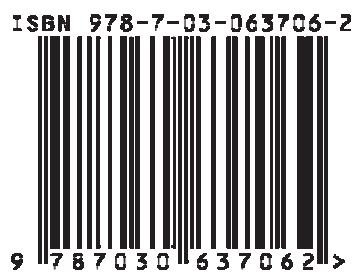

内导数 586内分 258内符号表示 1299内函数 586内积 1279内积空间 480, 879内接四边形 179内接五角星形 182内切圆 174内射 860内序遍历 546内旋轮线 135能量值 782能谱 782尼科梅德斯蚌线 126尼斯特伦法 828拟范数 891拟合问题 611拟线性偏微分方程 755拟周期函数 1128逆变换 1002, 1017, 1037逆波兰表示法 546逆关系 445逆积分 1020逆矩阵 368, 373逆模糊化 513逆算子 887, 1002, 1005逆映射 447逆元 451年金 29年金支付 31聂梅茨基算子 900牛顿插值公式 1276牛顿法 1211, 1234, 1250牛顿近似序列 901牛顿力场 920扭曲—反扭曲孤子 800扭曲—反扭曲偶极 801扭曲—反扭曲碰撞 801扭曲孤子 799扭曲—扭曲碰撞 800诺伊曼级数 822,844诺伊曼问题 951

0

欧几里得定理 188欧儿里得范数 492欧几里得距离 866欧儿里得算法 4, 486, 499欧儿里得向量空间 492欧拉多边形法 1259欧拉公式 634欧拉关系式 45,990欧拉关千多面体的定理 207欧拉函数 505欧拉迹 542欧拉角 289,395欧拉三角形 219欧拉数 623欧拉图 542欧拉微分方程 737, 809,810, 812, 813欧拉折线法 1259欧洲论文编号 513偶波函数 791偶函数 66偶密度函数 1106

p

帕塞瓦尔等式 883帕塞瓦尔方程 635, 754帕塞瓦尔公式 1031帕斯卡三角形 15帕斯卡蜗线 128排列 1053, 1054判别式 761庞加莱—本迪克松定理 112庞加莱映射 1132抛物点 358抛物面 303抛物桶状体 212抛物线 82, 90, 275抛物型方程 762抛物型微分方程 763配置点 1265, 1270配置法 832, 1265, 1270配置问题 1198皮卡迭代法 821

皮卡—林德勒夫定理 719,872, 1118皮卡逐次逼近法 727匹配 548偏差 1106偏导数 598偏微分 600偏微分方程 1024, 1036偏序 861偏序向量空间 862频率 1086频率表 1087频率分布 1087频率锁定 1177频谱 1029频数 1057频移定理 1009平凡子环 485平凡子集 439平凡子群 452平方根 962平方根函数 989平方可积函数 835平方取中法 1101平衡点 1117平滑 1115平滑方法 1106平截头棱锥休 205平均误差 1108—1110平均值法 141平面波 1048平面场 916平面的法向量 294平面角 203平面棱角 202平面三角形 173平面投影 319平面图 537,549平面微分方程 1125平面线性微分方程组 1134平稳点 1216平稳态 781平行 168平行六面体 204平行四边形 177

平行投影 320平行直线 168, 265平移 175, 308, 1040平移不变量 380平移不变性 379平移法则 1008平移矩阵 310坡度角 581泊松分布 1068泊松公式 778泊松过程 1081泊松微分方程 780, 948,951普通蒙特卡罗方法 1103普通年金的现值 31普通年金的终值 31889, 1029谱解释 1029

Q

期望 1063, 1071, 1072,1074—1076期望有限 1107期望值 1063齐次边界条件 852齐次边值问题 752齐次方程 717齐次方程组 412齐次函数 158齐次特征积分方程 853齐次微分方程 742齐次问题 778齐次一阶线性微分方程1123奇点 326, 336, 352, 353,723, 957奇异方阵 367奇异积分 723奇异积分方程 848奇异积分曲线 723奇异解 717奇异吸引子 1155奇异元素 483, 722奇异圆锥曲线 278奇异值 429

奇异值分解 430肪点 357恰当微分方程 717, 760“千层酥“结构 1154铅垂方向 716前提 572前向计算 1230前向运动学 482前序遍历 546前缀表示法 546潜在乘子 1197嵌入 1157强对偶性定理 1203强发散级数 617强级数 624强连通图 551强模糊相似 561切割 560强收敛级数 617水平集 560强稳定 1307切点 238切割线定理 184切平面 213, 351, 352切线 184, 344切线的斜率角 329切线多边形 181切线线段 329切向量 478切元素 478切比雪夫逼近 1283切比雪夫定理 652切比雪夫多项式 115, 1284倾斜角 581求和 1041求和变量 7求和约定 376求积公式 827, 1252, 1261求积号 8867球层 211球冠 211球极平面投影 406球面贝塞尔函数 747球面场 916

球面二角形 217球面角盈 220球面距离 213, 214球面螺旋线 239球面曲线 213球面三角形 218球面调和函数 748, 749球面向量场 920球面新月形 217球面坐标系 703,920球面坐标系下小区域的体积703球套定理 870球心角体 211区间法则 661区域 155区域配置 1270曲率 347, 358曲率半径 331, 333, 347曲率线 357曲率圆 332曲率中心 333曲面 350, 1365曲面的面积元素 355曲面的线素 354曲面法线 352曲面积分 694, 706曲面上的度量 355曲线拟合 1318曲线坐标 255, 351, 381取方根 10540,550全等 175全等定理 190全对称 470全概率定理 1060全局极大值 65, 595全局极小点 1200全局极小值 65, 595全局库恩—塔克条件 1201全排列 1053全微分 600全微分的可积性 691全域 436全域量词 436

权函数 753 三对角矩阵 1269 上下文无关加密 517权重 1064 三角不等式 243 上有界 863权重因子 1109 三角测屈的第二基本问题 绍德尔不动点定理 903451 198 舍入误差 1307群表 451 三角测量的第一基本问题 设计距离 516群表示 456 196 射线 168群的阶 451 三角插值 1276, 1288 射线点 725群论 471 三角插值公式 1287 审敛法 617群同构 455 三角多项式 1287 生成多项式 516群同态 455 三角方程 60 生成矩阵 515三角分解 1243 生成树 547R三角格式 1256 生成元系 453扰动 776, 1306 三角函数 80, 991 生灭过程 1082扰动函数 816, 1308 三角函数系 881 剩余变量 1185热导方程 769, 779 三角矩阵 364 剩余类 505人工变量 1189 三角形 187 剩余类乘法 505任意角 102 三角形剖分 1272 剩余类环 484,505任意曲线坐标系 697, 704 三角形全等定理 176 剩余类加法 505任意坐标系下小区域的体积 三角形坐标 1276 乘余谱 889704 （三阶）数字和 498 施密特正交化过程 836容量 552 （三阶）数字交错和 498 施瓦茨—布尼雅可夫斯基不等容许区间 559 三面角 203, 219 879冗余位置 514 三素数组 496 施瓦茨反射原理 967瑞尼维数 1151 三维对象 1366 施瓦茨交换定理 602若尔当标准形 427 三维曲线 1367 施瓦茨—克里斯托费尔公式若尔当矩阵 427 三维图形 1365 965若尔当块 427 三元组 243, 444 十进对数 11若尔当引理 986, 987 散度 925, 928, 948 十进制 1300弱稳定 1307 散焦 798 十六进制 1300沙勒定理 418 时间离散系统 1117s扇形公式 946 时间连续系统 1117萨吕法则 375 商代数 526 时域分析 1051三重鞍点 1164 商环 486 实部 44三重积 249 商集 448 实二次型 425三重积分 699 商群 455 实根 1240三重结点 1164 上点维数 1150 实函数 61三次插值样条 1293 上盒维数 1148 实矩阵 361三次多项式 82 上极限 628 实李代数 477三次方程 52 上解 904 实利率 27三次光滑样条 1295 上界 65, 594, 863 实数集 3三次抛物线 82 上界函数 65 实向量空间 489三次曲线 86—88 上确界 863 实轴 271三次样条 1293 上容量 1148 始点 536三度量投影 321 上三角矩阵 364, 1244 世界坐标系 316三对角 1294 上下文敏感加密 517 事件 1055

事件域 1056 双对数坐标纸 152 四素数组 496试位法 1236 双二次方程 54 四元数 386收敛 616, 619, 868 双孤子 801 四元数除环 388收敛半径 628 双连通区域 157 四元组 444收敛定理 909 双列霍纳格式 1239 松弛参数 1249收敛广义积分 674, 677 双纽线 130, 131 松弛法 1249收敛数列 614 双曲点 358 素数 495收敛条件 1235 双曲函数 81, 657, 991 素数对 495收敛性 627, 633, 978, 979, 双曲函数方程 60 素数检验 5101006, 1236, 1263 双曲螺线 137 素因子分解式 496收敛性条件 1250 双曲面 302 素域 485收敛域 625 双曲平衡点 1135 素元素 495收敛圆 979 双曲吸引子 1155 速端曲线 914首次积分 730 双曲线 91, 271, 995 算法 1220首数 12 双曲型方程 762 算术平均 1064, 1108首项系数 49 双曲型情形 763 算术平均数 662输出 1323 双曲型曲线 89 算术运算 365输入 1323 双曲型微分方程 763 算图 162输入误差 1306 双曲余弦 115 算子 62537, 545 双曲正切 115 算子范数 1123竖坐标 281 双曲正弦 115 算子方法 775, 1005数乘函数 584 双曲正弦戈登方程 802 随机变量 1061数的类型 1330 双三次插值样条 1296 随机过程 1078数理统计方法 1106 双三次光滑样条 1297 随机矩阵 1080数列 613 双三次样条 1295 随机链 1078数列极限 615 双射 447 随机事件 1055数码 1300 双线性映射 493 随机数 1083, 1100数学摆 996 双线性型 493 随机现象 1053数值法 638 双周期函数 983, 997 随机向量 1064, 1080, 1084数值方法 775, 1241 水平 546 随机学 1053数值分析 1233 顺向函数 1263 随机样本 1083数值积分 1252, 1320 顺序迭代 1250 随机游动 1104数值计算 1306, 1328 斯蒂尔切斯积分 673, 896 随机游动过程 1104数值解 813, 827, 1320, 斯莱特条件 1203 缩并 3781321 斯特芬森方法 1237 缩放变换 309数值离心率 267, 271, 279 斯特林公式 683 缩放矩阵 310数值搜索程序 1208 斯图姆定理 58 索伯列夫空间 876数制 1300 斯图姆函数 57, 58 索伯列夫意义下导数 911数轴 2 斯图姆链 57T数字模拟 1100 斯图姆—刘维尔问题 753数字图书馆 1233 斯图姆序列 1240 塔特定理 549双半开连续区间 677 斯托克斯积分定理 946 泰勒定理 594, 602双侧卷积 1010, 1031 四次方程 54 泰勒公式 603双度量投影 321 四阶方法 1260 泰勒级数 630, 980双对数坐标系 152 四面体 206 泰勒斯定理 188

泰勒展开式 73 同余关系 526 w特别积分 660, 714 统计量 1084外摆线 129, 133特解 714 桶状体 212外次数 536特殊特征值问题 421 1329特征 756 投影定理 881 外错角 170外导数 586特征带 757 投影法则 189外分 258特征点 342 投影方向 319外函数 586特征多项式 421 投影积分 687, 709外加调整 382, 384特征方程 421, 724, 851 投影平面 298, 319特征空间 889 投影算子 896 外接圆 174外切多边形 181特征数 819 投影线 319外切四边形 180特征向量 421 透视投影 319, 324特征值 379, 421 凸包 859 外推原理 1257特征组 755 凸多面角 203 外旋轮线 135梯度 925—927 凸集 859 外延 432梯度法 1216 凸四边形 179 完备距离空间 870梯度方法 814 凸问题 1203 完备事件组 1057梯度算子 933 凸性 1204 完全二部图 536梯度投影方法 1219 凸优化 1203 完全积分 757梯形 178 凸锥 859 完全可积性 760梯形公式 847, 1253 突变 1212 完全匹配 548提取公因式 14 突变步长 1215 完全图 536体积标度 150 图解微分法 588 完全椭圆积分 654体积导数 925, 926 图形积分法 664 网络算图 162体积积分 694, 699 图形基元 1357 危险圆 200条件概率 1060 图形命令 1359 威尔逊定理 510条件收敛 620 图形选项 1359 微分法则 585条件收敛的级数 978 湍流 1174 微分方程 714条件数 1247 湍流相 1172 微分方程的解 1356调和分割 259 推迟位势 778 微分算子 1353调和分析 1258, 1287 退化核 817 微分同胚 1156调和分析法 634 退化极端点 1184 微分中值定理 593调和函数 951, 955 退化态 787 微积分基本定理 659调和级数 616 托勒密定理 180 微商 581,842通积分 714 椭球面 302 韦伯函数 744通解 714, 716 椭圆 91,994 韦布尔分布 1072同步迭代 1250 椭圆点 357 韦达定理 56同构 455, 526, 529, 537, 椭圆函数 983, 996, 998 唯一解 842861 椭圆积分 653 唯一性 633同胚映射 861, 1133 椭圆型方程 762 维恩图解 440同宿轨 1132 椭圆型情形 763 维数 474, 490同态 526,860 椭圆型微分方程 763 维数公式 491同位角 170 拓扑等价 1133, 1134 伪标量 385,386同余 504 拓扑共扼 1134, 1137 伪素数 510同余法 1101 拓扑墒 1144 伪随机数 1101

伪椭圆积分 653伪向量 385伪张量 384,385尾数 12, 1304卫星导航 406未知系数法 741位势场 940位势方程 780位数顺序 1291位置概率 784位置向量 44,243位置坐标 384谓词 436谓词演算公式 437魏尔斯特拉斯定理 162,626魏尔斯特拉斯函数 1000魏尔斯特拉斯形式 810魏尔斯特拉斯一致收敛审敛法627温特纳和康蒂法则 1121稳定焦点 1126稳定结点 1126稳定流形 1128, 1136稳定向量子空间 1136稳定性 1120瓮模型 1065沃尔夫方法 1205沃尔什变换 1052沃尔什函数 1052沃尔泰拉积分方程 816,842, 872乌雷松算子 900无界被积函数的积分 673无界数列 614无理函数 80, 651无理数 2无穷等比级数 23无穷级数 616无穷收敛级数 17无穷数列 613, 616无散场 948无限积分区间的积分 673无限集 449无向图 535无旋场 968

无旋源场 948无源场 968无约束问题 1209五元组 444物理解法 776误差传播 1114误差方程组 1246误差分析 1116误差估计 1250误差函数 95, 682, 1070误差曲线 94

X

西北角规则 1195西尔维斯特惯性定理 426吸收集 1120吸引域 1121希尔伯特边值问题 852希尔伯特矩阵 1353希尔伯特空间 880希尔德雷思—戴索普方法1207希尔函数 433系数 13, 245系数矩阵 412, 1248系数增广矩阵 413细分 550下点维数 1150下盒维数 1148下降法 1210下降方向 1201下解 904下界 65,863下界函数 65下连续性 905下容量 1148下三角矩阵 364, 1244下有界 863184弦定理 184弦振动方程 764显式 714显形式 63, 350显著性差异 1095显著性水平 1091

线段 168线积分 684,939线性变换 490, 860线性差分方程 1044线性常微分方程 1035线性丢番图方程 502线性多步法 1261线性法则 1007线性反馈移位寄存器 488线性泛函 490, 861, 891线性方程组 412, 1242,1351线性分式函数 961线性格 863线性规划 1179线性规划问题 1185线性函数 79, 81, 963, 989线性回归 1097, 1098线性积分方程 816线性空间 855线性流形 856线性码 488线性目标函数 1179线性拟合问题 1246线性试验 1264线性算子 490, 860, 884线性同余式 506线性无关性 858线性系 409线性向量函数 383线性谐振子 791线性序 448线性映射 490线性子空间 856线性组合 109线性最小二乘问题 420,1246相伴勒让德函数 749相错直线 201相对不确定性 1111相对极大值 65, 595相对极小值 65, 595相对极值 595, 609相对角 170相对频率 1057, 1086

相对误差 1111相关变量 410相关的勒让德多项式 790相关分析 1095相关积分 1151相关维数 1151相合映射 174相互独立 1095相交圆 213相空间 1117相容性 1263相似 425相似变换 425相似定理 176相似法则 1007相似三角形 176相依函数 158向后代换法 1243向量 242, 364, 856向量表示 1298向量场 919, 1118向量迭代 429向量分析 408向晕范数 371向噩格 863向量积 247, 367向措空间 489, 855向量梯度 928向量图 109向最位势 949向量线 923向量形式 35012项代数 527相图 1122相位谱 1029相位移 108491象限 255象限关系 103像空间 62, 1002, 1006消息 1344小波 1048小波变换 1049小圆 213, 236

小圆的平面半径 236小圆的球面半径 236小圆的球面中心 236206斜埃尔米特矩阵 363斜等轴测投影 320斜对称矩阵 363斜对称张量 379斜航线 239斜角立体投影 320斜截圆柱 207斜率 262, 581斜平行投影 323斜投影 320斜域 484谐振动 791心脏线 129, 133辛普森公式 1254新度 171, 193信号 1047信号分析 1047信号合成 1047信息 1344信息维数 1150信息位置 514星形线 134形变变换 318形式法则 613形式解 764525匈牙利方法 1199修正单纯形法 1190修正牛顿法 1235修正形式 1249虚部 44虚曲线 261虚数单位 43虚轴 271序关系 861序区间 863序有界 863悬链线 117, 139, 807旋度 925, 930, 308旋度密度 948,950旋度线 931

旋转 175旋转不变最 380旋转不变性 379, 385旋转角 289旋转矩阵 257, 286, 310,369, 376, 394旋转矩阵的插值 405旋转数 1176旋转映射 1141选择 1213选择压力 1215选主元步骤 410远主元法 410, 415选主元法则 411薛定谔方程 780学生 分布 1076循环连分数 4循环链分数 4循环码 515循环群 487循环子群 452

Y

压缩映射 8711雅可比方法 1248雅可比函数 997雅可比行列式 698, 902雅可比矩阵 1251亚纯函数 983, 997, 1019亚当斯—巴什福思法则 1262延拓法则 1122严格单调递减函数 65严格单调递减数列 614严格单调递增函数 65严格单调递增数列 614沿曲线的围道积分 691演化策略 1212演化算法 1213演化原理 1212杨氏图 463样本 1065, 1083样本变量 1084样本函数 1084样本容量 1065样条插值 1276

耶格尔补 567 映射的超临界霍普夫分歧 1170

右手螺旋线 348

曳物线 139

右手系 280

一般蚌线 128映射的次临界鞍结点分岔1167

右手坐标系 280

一般迭代法 1234, 1250

右旋 946

一般类型的曲面积分 711

永久年金 31

右旋法则 942

一般类型的线积分 689

优先规则 433

余割函数 100

一般三角形的毕达哥拉斯定理189

游路问题 1199

余角 169

有根数 545

余角公式 103

一般四边形 179

有界差分 564

余切函数 99

一般特征值问题 421

有界函数 65

余弦定律 189, 212

一般线性群 473

有界聚合 564

余项 603, 616, 625

一般形式 816, 994

有界数列 614

余项估计 624

一般余弦函数 98

有理点 2

余因子 495

一般正弦函数 98

有理函数 80, 647

隅角 202

一般正弦曲线 107

有理数 1

互素的剩余类 505

一般指数函数 991

有理线性函数 144

与 m 互素的剩余类群 505

一次方程 51

有限差分 1264, 1268

语境 1344

一次一密发射 517

有限差分法 775, 1265

语言变量 555

一对一映射 447

有限级数 22

语言量 555

有限极限 615一阶近似的稳定性定理1126

语义等价 434

有限扩域 484

预估—校正法 1262

有限跳跃间断点 76

（一阶）数字和 498

预估子 1262

有限域 486

（一阶）数字交错和 498

预解集 888

有限元 1273

一阶微分方程 1021

预解式 823, 824, 884

有限元法 776

一阶线性偏微分方程 754

484

有限元方法 814, 1271

一阶线性微分方程 719

元素 439, 1329

有向边 535

一维波动方程 1037

元素 的阶 453

有向链 550

一维热传导方程 1024

原点 2, 255, 281

有向曲面 709

一维搜索 1208

原函数 641, 1002, 1006

有向图 535

原价 32

一元函数 606

有心曲面 302

原始空间 1006, 1002

一致逼近 1283

有序对 443

原像空间 62, 1002

一致收敛 626, 628

有序二元树 546

原序列 1039

一致收敛级数 626

有序向量空间 862

原值 32

一致搜索 1208

酉表示 459

184, 266

移动无理式 21

酉矩阵 369

圆变换 962

异宿轨 1132

酉空间 879

圆场 920

因变量 61

右导数 582

圆的渐伸线 137

引力场 950

右端矩形公式 1253

圆点 357

隐函数 587,604

右极限 70, 582

圆弓形 186

隐函数极值 597

右开区间 677

圆环 187

隐式 714

右陪集 453

圆膜振动方程 766

隐式微分方程 721

右奇异向量 430

圆扇形 186

隐形式 63, 350

右手定律 942

圆心 183, 266

映射 447

右手法则 247, 281

圆心角 170

圆周 994 振幅谱 1029 正态误差 1107圆周映射的典范形式 1176 整除性 494 正投影 320圆锥截面 210 整个利息周期 27 正凸多边形 181圆锥曲线 277 整区 483 正弦定律 189, 221929, 1126, 1135 整体离散误差 1263 正弦戈登方程 795, 799源点 552 正半轨 1117 正弦积分 987约化映射 1166 正比例函数 81 正弦量 107约束谓词 438 正定矩阵 1245 正弦—余弦定律 221约束向撮 243 正定算子 896 正向不变集 1120运动 1117 正多面体 207 正因子 497运输网络 537, 552 正方形 177 正则二元树 546运输问题 1194 正非线性算子 903 正则方程组 1099蕴涵 6, 572 正割函数 99 正则化参数 420正规方程 1246, 1280 正则化问题 420z正规方程组 420, 1279 正则矩阵 367增广矩阵 412, 1244 正规化半对数形式 1302 正则性条件 1202增量 26, 600 正规化的本征函数 753 正指向 942增长函数 1263 正规化条件 786 支撑 555增长因子 27 正规矩阵 363 支撑超平面 893债务 28 正规模糊集 560 支撑泛函 893展形 559 正规十进制数 1304 直方图 1087辗转相除法 17 正规形式 49, 50, 720, 738, 直和 461张量 375 1161 直积 461张量不变量 380 正规子群 453 直角三角形 174张量 的分量 377 正规组 738, 758 直接法 1242张量积 378 正交 168, 202, 492, 820 直接积 454,526张晕积方法 1296 正交多项式 1279 直接全等图形 175张晕积近似 830 正交化方法 1247 直接问题 1306章动角 289 正交矩阵 368 直棱锥 205帐篷映射 1141 正交空间 880 直纹面 359障碍函数法 1222 正交投影 320 直纹曲面 304IS 32 正交系 881, 959 直线 81, 168, 993折扣率 26 正交相似变换 425 直线法 32真发散 615 正交性 880 直圆柱 207真分式 18 正交旋转矩阵 376 直圆锥 209真实误差 1109 正交直线 168 直锥台 209真值 432 正棱锥 205 值表 646真值表 432 正六面体 205 值域 61, 62, 860真值函数 432 正齐次函数 810 指标 453真子集 439 正切定律 189, 225 指数 9, 10 1304振荡级数 616 正切公式 190 指数方程 59振动叠加 108 正切函数 99 指数分布 1071振动量子数 793 正算子 863 指数函数 74, 80, 93, 143,振幅 108 正态变量 1069 656, 964, 1362振幅函数 997 正态分布 1069, 1214 指数和 147

<table><tr><td>指数曲线 93</td><td>周期轨 1127</td><td>转换 1300</td></tr><tr><td>指数型傅里叶变换 1028</td><td>周期函数 66, 1015</td><td>转移概率 1079</td></tr><tr><td>指向类 174</td><td>周期加倍 1168</td><td>转移矩阵 1079</td></tr><tr><td>质心 290</td><td>周期模式 795</td><td>转置积分方程 819</td></tr><tr><td>秩 491</td><td>周期平行四边形 998</td><td>转置矩阵 361</td></tr><tr><td>秩亏格 420</td><td>周期线性微分方程 1124</td><td>状态函数 782</td></tr><tr><td>秩0张量 377</td><td>周期样条 1293</td><td>状态空间 1078, 1225</td></tr><tr><td>秩n张量 377</td><td>周期因子 1015</td><td>状态向量 1225</td></tr><tr><td>置换矩阵 1244</td><td>周线积分 940</td><td>锥 209, 861</td></tr><tr><td>置换群 451, 454</td><td>轴测投影 321</td><td>锥面 209, 292, 303</td></tr><tr><td>置信概率 1092</td><td>轴对称 175</td><td>准范数 891</td></tr><tr><td>置信区间 1092</td><td>轴对称场 916</td><td>准希尔伯特空间 879</td></tr><tr><td>置信水平 1092</td><td>轴向场 916</td><td>准线 207</td></tr><tr><td>置信限 1092</td><td>轴向量 242, 384</td><td>子环 485</td></tr><tr><td>置信域 1098</td><td>逐次逼近法 821</td><td>子集 439</td></tr><tr><td>中点法则 1262</td><td>主点 325</td><td>子空间 491</td></tr><tr><td>中点坐标 291</td><td>主动约束 1217</td><td>子空间判别法 491</td></tr><tr><td>中国剩余定理 507</td><td>(主)对角元素 362</td><td>子流形 1219</td></tr><tr><td>中间变量 586</td><td>主法截线 355</td><td>子区间 658</td></tr><tr><td>中间形式重组 1213</td><td>主法线 344</td><td>子区域 1295</td></tr><tr><td>中位数 1085, 1088</td><td>主行 410, 1187</td><td>子群 452</td></tr><tr><td>中位线 174, 178</td><td>主合取正规形式 532</td><td>子群判别法 452</td></tr><tr><td>中线 174</td><td>主理想 485</td><td>子图 538</td></tr><tr><td>中心 271, 726, 919</td><td>主列 410, 1187</td><td>子午线 213, 215, 351</td></tr><tr><td>中心场 916</td><td>主没影点 325</td><td>子午线收敛角 228</td></tr><tr><td>中心点 174, 726</td><td>主曲率半径 356</td><td>自伴算子 895</td></tr><tr><td>中心对称 174</td><td>主体 1339</td><td>自伴微分方程 752</td></tr><tr><td>中心对称场 916</td><td>主投影 321</td><td>自变量 61, 1329</td></tr><tr><td>中心流形定理 1160, 1166</td><td>主析取正规形式 532</td><td>自反空间 893</td></tr><tr><td>中心投影 319</td><td>主要记法 1106</td><td>自共轭矩阵 363</td></tr><tr><td>中心向量场 919</td><td>主要统计特性 782</td><td>自然对数 11, 990</td></tr><tr><td>中性元素 450</td><td>主元 410, 1187, 1243</td><td>自然对数曲线 93</td></tr><tr><td>中央子午线 228</td><td>主值 112, 990, 992</td><td>自然同态 456, 486</td></tr><tr><td>中值 662</td><td>主轴变换 379, 425</td><td>自然样条 1293</td></tr><tr><td>中值定理 662</td><td>主轴方向 379</td><td>自然指数函数 990</td></tr><tr><td>中缀形式 450</td><td>柱段 208</td><td>自然指数曲线 93</td></tr><tr><td>忠实表示 459</td><td>柱面 207, 305</td><td>自同态 861</td></tr><tr><td>终点 336, 536</td><td>柱面对称场 916</td><td>自相关函数 1143</td></tr><tr><td>种群策略 1215</td><td>柱面函数 743</td><td>自相似性质 1149</td></tr><tr><td>众数 1088</td><td>柱面坐标系 702, 920</td><td>自由半群 450</td></tr><tr><td>重力压力 671</td><td>柱面坐标系下小区域的体积</td><td>自由代数 527</td></tr><tr><td>重心 174, 290, 672</td><td>702</td><td>自由度 1091</td></tr><tr><td>重心坐标 1276</td><td>柱体 207</td><td>自由向量 243</td></tr><tr><td>周期 67, 97, 99, 108, 997, 1117</td><td>柱芯 555</td><td>自治方程 1121</td></tr><tr><td></td><td>转动惯量 671</td><td>自治线性微分方程组 1123</td></tr></table>

字典顺序 449

字节 1299

总长 548

总体 1083

纵向振动方程 765

纵轴 255

纵坐标 255, 281

阻尼 1041

阻尼法 1251 坐标反演 384 阶矩 1063

阻尼振荡曲线 109

组合 1053, 1054

组距 1086

组中点 1088

最大不动点 904 坐标线 282 元运算 450

最大距离 866

其他

最大下界 615

最大相对误差 1111 样条曲线 1299 RSA 算法 523

最短路 541 B-B 曲面表示 1299 SG 孤子 799

最佳逼近 882

最可能值 1088 B-B 曲线表示 1298 Slerp 算法 403

最小不动点 904 DFP 方法 1212 Squad 插值 405

最小二乘问题 611 折叠退化 787 分布 1076

最小费用 1229 IDEA 算法 524 纠错码 514

最小公倍数 501 IEEE 标准 1302 351

最小距离 514 IMSL 图书馆 1310 255

最小上界 615

最优策略 1229 KAM 定理 1139 变换 1039

最优购买策略 1230 KdV 方程 796 分位数 1062

最优性必要条件 1201 Lerp 插值 403 切割 560

最优性充分条件 1201 Lerp 算法 403 极限集 1120

左导数 582

左端矩形公式 1253 重极点 982 函数 999

左极限 70, 582 阶极点 982 代数 905

左开区间 677 Mathematica 1318, 1327 寸拟合优度检验 1091

左陪集 453 Mathematica 绘图 1357 极限集 1120

<table><tr><td>Ω代数 525</td><td>(n;k)线性码 515</td><td>1/5 成功法则 1215</td></tr><tr><td>Ω子代数 525</td><td>(μ,λ)演化策略 1215</td><td>2D 变换 308</td></tr><tr><td>(1+1)策略 1215</td><td>(μ+λ)策略 1215</td><td>3D 变换 314</td></tr><tr><td>(1+1)突变-选择策略 1214</td><td>0阶贝塞尔微分方程 1023</td><td>3D 图形 1366</td></tr></table>

Taschenbuchder Mathematik数学手册(原书第10版）

原版享誉德语系国家;不断再版的畅销工具书

内容简介

本书以手册的形式涵盖了人们日常工作、学习所需用到的数学知识。内容包括算术、函数、几何学、线性代数、代数学、离散数学、微分学、无穷级数、积分学、微分方程、变分法、线性积分方程、泛函分析、向量分析与向量场、函数论、积分变换、概率论与数理统计、动力系统与混沌、优化、数值分析、计算机代数系统等，并专门设有数学常用表格章节，方便读者查阅。

www.sciencep.com

定价：198.00元
